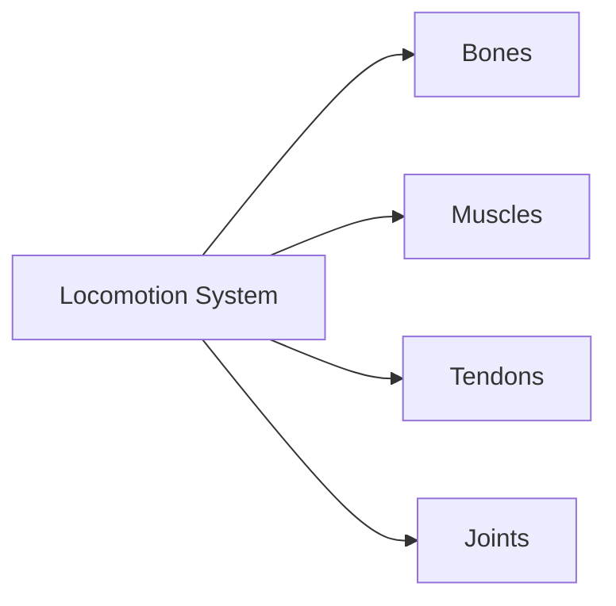
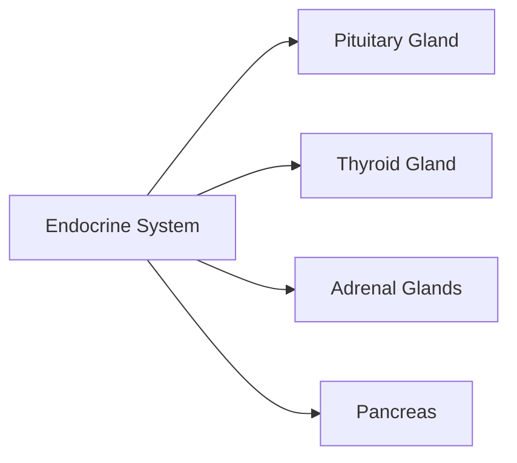

**CHAPTER OVERVIEW: ANIMAL PHYSIOLOGY**
======================================

Animal physiology is the study of the functions and processes that occur within living organisms, from the molecular level to the organism as a whole. This chapter will delve into the core concepts of animal physiology, covering topics such as movement, sensation, digestion, respiration, circulatory system, excretory system, endocrine system, and nervous system.

**1.1.0 Introduction**
-------------------

Animal physiology is a vast field of study that seeks to understand how living organisms function and interact with their environment. The study of animal physiology is essential for understanding how animals adapt to their surroundings, how they respond to stimuli, and how they maintain homeostasis.

### 1.2.0 Mechanics of Movement Systems

Movement is an essential aspect of animal physiology. Animals need to move to find food, escape predators, and interact with their environment.

#### 1.2.1 Muscle Physiology

Muscles are the primary organs of movement in animals. Muscles are made up of fibers that contract and relax to produce movement. Muscle physiology involves the study of how muscles contract and relax, and how they are controlled by the nervous system.

$${{E_{p}} + {W_{p}}  -  {{E_{{\text{p}}} + W_p} = \sum \Delta E_p = 0 }}$$

```latex
\text{This is the first law of thermodynamics}.
```

#### 1.2.2 Locomotion Systems

Locomotion systems are responsible for generating movement in animals. Locomotion systems include bones, muscles, tendons, and joints. Understanding how these systems work is essential for understanding how animals move.



### 1.3.0 Mechanics of Sensory Systems

Sensory systems are responsible for detecting and responding to stimuli in animals. Sensory systems include the eyes, ears, nose, tongue, and skin.

#### 1.3.1 Vision

Vision is the ability of animals to detect light and visualize their surroundings. Understanding how vision works is essential for understanding how animals interact with their environment.

```markdown
*   The eye is a complex organ that consists of the cornea, lens, retina, and optic nerve.
*   The cornea is a transparent layer that covers the front of the eye.
*   The lens is a flexible structure that changes shape to focus light on the retina.
*   The retina is a layer of light-sensitive cells that transmit visual information to the brain.
```

### 1.4.0 Mechanics of Digestive Systems

Digestive systems are responsible for breaking down food into nutrients that can be absorbed by the body. Digestive systems include the mouth, esophagus, stomach, small intestine, and large intestine.

#### 1.4.1 Digestion

Digestion is the process of breaking down food into nutrients. Understanding how digestion works is essential for understanding how animals obtain energy and nutrients.

```markdown
| Process                | Description |
| ---------------------- |-------------|
| Mechanical Digestion  | Breaks down food into smaller particles |
| Chemical Digestion    | Breaks down food into simpler compounds |
| Absorption             | Nutrients are absorbed into the bloodstream |
```

### 1.5.0 Mechanics of Respiratory Systems

Respiratory systems are responsible for exchanging oxygen and carbon dioxide between the body and the environment. Respiratory systems include the nose, mouth, trachea, bronchi, lungs, and diaphragm.

#### 1.5.1 Gas Exchange

Gas exchange is the process of exchanging oxygen and carbon dioxide between the body and the environment. Understanding how gas exchange works is essential for understanding how animals obtain oxygen and eliminate carbon dioxide.

```latex
\text{The rate of gas exchange is dependent on the partial pressure of oxygen and carbon dioxide}.
```

### 1.6.0 Mechanics of Circulatory Systems

Circulatory systems are responsible for transporting nutrients and oxygen to cells and removing waste products. Circulatory systems include the heart, blood vessels, and blood.

#### 1.6.1 Blood Circulation

Blood circulation is the process of transporting blood throughout the body. Understanding how blood circulation works is essential for understanding how animals obtain nutrients and oxygen.

```markdown
**Blood Circulation:**
=====================

*   The heart pumps blood throughout the body
*   Blood vessels transport blood to and from the heart
*   The blood carries oxygen and nutrients to cells
```

### 1.7.0 Mechanics of Excretory Systems

Excretory systems are responsible for removing waste products from the body. Excretory systems include the kidneys, liver, and skin.

#### 1.7.1 Waste Removal

Waste removal is the process of eliminating waste products from the body. Understanding how waste removal works is essential for understanding how animals maintain homeostasis.

```latex
\text{The rate of waste removal is dependent on the concentration of waste products}.
```

### 1.8.0 Mechanics of Endocrine Systems

Endocrine systems are responsible for producing hormones that regulate various bodily functions. Endocrine systems include the pituitary gland, thyroid gland, adrenal glands, and pancreas.

#### 1.8.1 Hormone Regulation

Hormone regulation is the process of controlling hormone levels in the body. Understanding how hormone regulation works is essential for understanding how animals maintain homeostasis.



### 1.9.0 Mechanics of Nervous Systems

Nervous systems are responsible for transmitting and processing information. Nervous systems include the brain, spinal cord, and nerves.

#### 1.9.1 Neural Transmission

Neural transmission is the process of transmitting information between neurons. Understanding how neural transmission works is essential for understanding how animals respond to stimuli.

```markdown
*   Neurons transmit information through electrical and chemical signals
*   Synapses are specialized structures that allow neurons to communicate with each other
*   The brain integrates information from sensory receptors to create a perception of the environment
```

### 1.10 Conclusion
-------------------

Animal physiology is a complex and multifaceted field of study that seeks to understand how living organisms function and interact with their environment. This chapter has provided an overview of the core concepts of animal physiology, including movement, sensation, digestion, respiration, circulatory system, excretory system, endocrine system, and nervous system.

**PRACTICE QUESTIONS**
--------------------

### 1. PRACTICE QUESTION 1

Which of the following is a primary function of the nervous system?

A) To produce hormones
B) To transmit and process information
C) To regulate body temperature
D) To maintain homeostasis

 Correct Answer: B)
 
 **ANSWER EXPLANATION**

The nervous system is responsible for transmitting and processing information between neurons. This is its primary function, and it plays a crucial role in how animals respond to stimuli and interact with their environment.

### 2. PRACTICE QUESTION 2

What is the process by which cells obtain energy from the breakdown of glucose?

A) Respiration
B) Photosynthesis
C) Fermentation
D) Osmosis

 Correct Answer: A)
 
 **ANSWER EXPLANATION**

Respiration is the process by which cells obtain energy from the breakdown of glucose. This process involves the breakdown of glucose to produce ATP, which is then used to power cellular activities.

### 3. PRACTICE QUESTION 3

Which of the following organisms is an autotroph?

A) Plant
B) Animal
C) Bacteria
D) Fungus

 Correct Answer: A)
 
 **ANSWER EXPLANATION**

Autotrophs are organisms that produce their own food through photosynthesis or chemosynthesis. Plants are autotrophs because they produce their own food through photosynthesis, using energy from the sun to synthesize glucose from carbon dioxide and water.

### 4. PRACTICE QUESTION 4

What is the primary function of the excretory system?

A) To produce hormones
B) To regulate body temperature
C) To eliminate waste products from the body
D) To maintain homeostasis

 Correct Answer: C)
 
 **ANSWER EXPLANATION**

The excretory system is responsible for eliminating waste products from the body. This includes the kidneys, liver, and skin, which work together to remove waste products from the body and maintain proper pH levels.

### 5. PRACTICE QUESTION 5

Which of the following is a byproduct of cellular respiration?

A) Water
B) Carbon dioxide
C) Oxygen
D) Glucose

 Correct Answer: B)
 
 **ANSWER EXPLANATION**

Cellular respiration is the process by which cells obtain energy from the breakdown of glucose. One of the byproducts of this process is carbon dioxide, which is produced when glucose is broken down to produce ATP.

### 6. PRACTICE QUESTION 6

What is the primary function of the circulatory system?

A) To maintain homeostasis
B) To transport oxygen and nutrients to cells
C) To eliminate waste products from the body
D) To regulate body temperature

 Correct Answer: B)
 
 **ANSWER EXPLANATION**

The circulatory system is responsible for transporting oxygen and nutrients to cells and removing waste products from the body. This is achieved through the heart, blood vessels, and blood, which work together to circulate blood throughout the body.

### 