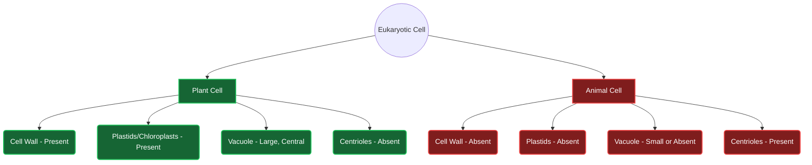

  <h3 style="color: var(--accent); margin-bottom: 16px; border-bottom: 1px solid var(--border); padding-bottom: 8px; display: flex; align-items: center; gap: 8px; font-weight: 600;">CELL THE UNIT OF LIFE</h3>
  <h4 style="border-left: 3px solid var(--info); padding-left: 8px; margin-top: 24px; margin-bottom: 10px; color: var(--text-primary); font-weight: 600;">DEEP CONCEPTUAL EXPLANATION</h4>

After analysing the previous year question papers, we have seen that 40-45 questions are asked from science section, out of these 10-15 questions were asked from Biology. From biology section, around 2-3 questions are asked from classification, genetics and evolution, 3-4 questions from human physiology, and 1 to 2 questions each from topics like cell, human health and diseases and applied biology. CELL : THE UNIT OF LIFE • Robert Hooke in 1665 discovered the cell. He is the Father of Cytology.

• Cell theory was given by Schleiden and Schwann.

Biology is the branch of science concerned with the study of living organisms. The term ‘biology’ is coined by Lamarck and Treviranus. The study of plants is called Botany, while study of animals is called Zoology.

• Matthias Jacob Schleiden (1838) a German botanist said that, all plants are composed of different kinds of cells, which in turn form plant tissues.

• Theodor Schwann (1839) said that, all animals and plants are made up of cells. Cell theory is not applicable for viruses.

THE CELL Cell is the basic structural and functional unit of all the living organisms. The word ‘cell’ comes from the Latin word cellula which means a ‘small room’.

• According to Virchow ‘new cells arise from pre-existing cells’, i.e. Omnis cellula-e-cellula.

• Living organisms may consist of one or more cells, according to this there are two types of organisms, i.e. unicellular (composed of single cell) and multicellular (composed of many cells).

• Smallest cell is mycoplasma or Pleuropneumonia Like Organism (PPLO). Largest cell is ostrich’s egg and the longest cell is nerve cell.

Cell • The smallest human cell is the red blood cell. Bacteria was discovered by AV Leeuwenhoek. Living parts of cell Non-living parts of cell Cell wall • First compound microscope was invented by Jansen and Jansen. Cell membrane Cytoplasm Vacuoles • Electron microscope was invented by Knoll and Ruska.

Fat droplets • Vital stains are used for staining living cells or living parts of cell, e.g. Janus green for mitochondria. Cell organelles Nucleus Granules Waste materials • Protoplasm is the living component of cell that includes cytoplasm, cell organelles and nucleoplasm. Endoplasmic reticulum Mitochondria Golgi bodies Lysosomes Ribosomes Plastids Centrosomes • Cytoplasm term was given by Strasburger.

GENERAL SCIENCE • Mitochondria, chloroplast, nucleus are double-membraned structures. (ii) Eukaryotic cell It is a complex cell with double membrane bound nucleus, e.g. plant and animal cells. Eukaryotic organisation is seen in all the protists, plants, fungi and animals.

• Lysosome, Golgi body, Endoplasmic Reticulum (ER) are single-membraned structures.

Differences between Prokaryotic and Eukaryotic Cell • Centrosome, flagella, ribosome are non-membranous in structure. Prokaryotic cell Eukaryotic cell • Glycogen is referred to as animal starch. Some Discoveries about the Cell Simplest and primitive in nature.

Advanced and comparatively complex in nature.

Nucleus is absent.

Nucleus is present.

Scientist Discovery Robert Brown (1831) Nucleus Membrane bound cell organelles are absent. Membrane bound cell organelles are present. Purkinje (1837) Named protoplasm to be a content of cell Single naked chromosome is present.

Many chromosomes are present.

W Flemming (1882) Observed mitotic cell division, splitting of chromosome and named the term chromatin Cell division is direct.

Cell division by mitosis or meiosis.

F Miescher Discovered the nucleic acid C Benda (1897) Mitochondria Structure of Animal and Plant Cell Beneden and Boveri (1887) The chromosome number is constant in a species Animal and plant cell structures are described below Camillo Golgi (1891) Golgi body Microvilli WS Sutton (1902) Significance of reductional division F Meves (1904) Mitochondria in plant cell JB Farmer and Moore (1905) Named meiosis Plasma membrane Golgi apparatus FA Johanssen (1909) Chiasma formation Lysosome TH Morgan (1933) Role of chromosomes in heredity Centriole Smooth endoplasmic reticulum Ribosomes Mitochondrion Nuclear envelope Nucleus Rough endoplasmic reticulum Types of Cells On the basis of the organisation, complexity and variety, all cells can be grouped into two types: (i) Prokaryotic cell It is a simpler cell, lacking a true nucleus, i.e. nuclear membrane is absent in these cells, e.g. bacteria, mycoplasma, etc. Nucleolus Cytoplasm Animal cell Bacteria are the microscopic prokaryotic organisms whose single cell have neither a membrane enclosed nucleus nor other membrane enclosed organelles like mitochondria and chloroplasts.

Rough endoplasmic reticulum Nucleolus Lysosome G The bacterial cell wall is strong and rigid. Chloroplast Smooth endoplasmic reticulum Nucleus Golgi apparatus Microtubule G Murein or peptidoglycan or mucopeptide is present in the cell wall.

Bacteria are mainly of two types:

(i) Archaebacteria They are obligate anaerobes.

(ii) Eubacteria They are true bacteria.

Some examples are as follow:

Nuclear envelope G Staphylococcus aureus causes boils, pneumonia, food poisoning and other diseases. Plasma membrane Middle lamella G Staphylococcus thermophilus gives yoghurt its creamy flavour. Cell wall Peroxisome G S. lactis often added to milk for the production of cheese.

Cytoplasm Ribosomes Mitochondrion Plant cell Differences between Plant and Animal Cell Plant cell Animal cell Cell wall is present in plant cell.

Cell wall is usually absent.

Cell Membrane or Plasmalemma It is the innermost layer of cell envelope that is semipermeable in nature and is responsible for the interaction of cell with the outside environment.

Plastids are found.

Plastids are usually absent.

• It consists of protein (52%), lipid (40%) and carbohydrate (5-10%). It is elastic in nature because of the presence of lipids.

Centrioles are found in some algae and fungi.

Centrioles are found in all cells.

• The most popular theory ‘fluid mosaic model’ of membrane structure was given by Singer and Nicolson.

Big vacuoles are present but they are less in number. Vacuole is very small in size but present in more number.

• It states that integral and peripheral proteins are found in cell membrane.

Cell shape is usually round or irregular.

Cell shape is rectangular and fixed.

• Pinocytosis (cell drinking) In this process, cells ingest extracellular fluid.

• Phagocytosis (cell eating) Engulfing and digestion of extracellular solid food by cell.

Composition of Cell Representation of the chemical composition of living tissue is as follows: Component The total cellular mass in % Component The total cellular mass in % Water 70-90% Lipids 2% Proteins 10-15% Nucleic acids 5-7% Carbohydrates 3% Ions 1% Nucleus The term ‘Nucleus’ is given by Waldeyer (1888). Nucleus is a specialised largest principal cell organelle of the cell, which contains all genetic information for controlling all essential processes related to metabolism and transmission. It was first discovered by Robert Brown in 1831.

• Most of the eukaryotic cells are uninucleate except Paramecium, which is binucleate.

Cell Organelles There are some organelles as follow:

• Nucleus is made up of nuclear membrane, nucleoplasm, nucleolus, chromatin. Chromatin is composed of nucleic acid and protein (histone and non-histone chromosome).

• Chromosome of eukaryotic cell is composed of DNA + histone protein + some amount of RNA. Normally each cell contains 23 pair of chromosomes in humans.

Cell Wall It is a rigid and solid covering that gives shape and strong structural support to the cell. It is a non-living structure, which forms the outer covering of the plasma membrane in plants and fungi, but is absent in animal cells. Cell wall consists of following parts:

• Nucleic acid, the genetic material was discovered by Friedrich Miescher. The term ‘Nucleic acid’ was given by Altman.

• Middle lamella It is composed of calcium pectate (chief component) and magnesium pectate.

• Primary cell wall It is composed of cellulose, hemicellulose and lignin. Rigidity of cell wall is due to lignin.

Chromosome During the cell division, chromatin shrinks (compressed) and gets divided into various smaller, thick and consolidated form, known as chromosomes. Chromosome Number in Some Organisms • Secondary cell wall It is composed of cellulose and hemicellulose.

• Tertiary cell wall It is present in tracheids of gymnosperms.

Organisms Chromosome number in each body cell Organisms Chromosome number in each body cell • Bacterial cell wall is composed of peptidoglycan or murein. Bacterial cell wall contains D-amino acids. Roundworm Mouse • Fungal cell wall is composed of chitin. Mosquito Rat Drosophila Human beings Functions of Cell Wall Garden pea Potato Onion Dog • It helps in preventing cell from bursting or collapsing and allows the material to pass in and out of the cell.

Maize Pigeon Frog Gold fish • It wards off the attack of pathogens like viruses, bacteria, fungi and protozoans. Rice Amoeba Sunflower GENERAL SCIENCE Study of Cell Organelles Cell organelle Nature/Composition Function Present (P)/Absent (A) Animal cell Plant cell Cell membrane Double layer of lipid molecules with proteins molecules, differentially permeable. Gives shape to the cell, maintains distinct composition of the cell.

Gives strength and rigidity to the cell. Cell wall Freely permeable, made up of fibrous polysaccharide (cellulose). Bacteria and unicellular eukaryotes have peptidoglycan compound in their cell wall. Cytoplasm Consists of aqueous ground substance, having starch, glycogen, etc.

Provides medium for suspension of materials and cell organelles. Vacuoles Fluid-filled spaces without any definite shape and size.

Larger in plant cell.

Store water, minerals, salts, food pigments, wastes, etc. Nucleus Oval-shaped, bounded by double membrane having pores possess genetic material. Controls the metabolic activities, regulates cell division, synthesises and stores proteins, also called as the controller of the cells.

Mitochondria Bounded by a double membrane, found in cytoplasm.

They contain DNA also.

Cellular respiration or oxidation of food, ATP is stored in it, so called as powerhouse of the cell. Endoplasmic Reticulum (ER) Membranous network of fluid-filled with lumen with or without ribosomes, absent in RBCs. Forms supporting skeletal framework of the cell also called skeleton of the cell.

Play a vital role in protein synthesis also called protein factory of the cell. Ribosomes Dense and spherical particles, found either attached to endoplasmic reticulum or freely in cytoplasm. It is the smallest non-membranous organelles. Lysosomes Tiny spherical bag-like structures found in cytoplasm with hydrolytic enzymes.

Helps in intracellular digestion, digest worn out organelles, also called suicidal bags of the cell. Sites of photosynthesis, give colour to organ, also called as kitchen of the cell. Chloroplasts Sac-like double walled with protein matrix generally called plastids, contain photosynthetic pigments called chlorophyll and carotenoids. These also contains DNA.

Golgi bodies Consist of tubules and vesicles. Secrete hormones, enzymes, involved in synthesis of cell wall, plasma membrane, etc. Centriole Hollow and cylindrical structures made up of microtubules.

Helps in cell division in animal cell.

Microtubules Tubulin protein Spindle formation CELL CYCLE • Cell cycle is an orderly sequence of events or stages by which a cell duplicates its genome, synthesise the other constituents of the cell and eventually divides into two daughter cells. It is a cyclic process, which involves cell growth and cell division.

• Cell division is an essential process in all living organisms. The mode of cell division is fundamentally similar in all organisms. During cell division, the processes like DNA replication and cell growth must take place in a sequential coordinated manner to ensure the correct division and formation of progeny cells with intact genome. Cell cycle involves two phases, i.e. interphase followed by M-phase.

(i) G1-phase (Gap 1) It corresponds to the duration between the mitosis (M-phase) and initiation of replication of DNA. Cell grows, becomes metabolically active, but does not undergo DNA replication. Some time after G1-phase cell may enter S-phase and continue the cell cycle or it may enter into G0-phase. In G0-phase the cells leave cell cycle. (ii) S-phase (Synthesis) It is known to be the phase, in which actual synthesis or replication of DNA takes place. In case of animal cell, during S-phase DNA replication begins inside the nucleus, while the duplication of centrioles takes place in the cytoplasm.

(iii) G2-phase (Gap 2) This phase is also called post-synthetic or pre-mitotic phase. During this stage, the synthesis of DNA stops and proteins required for M-phase are being synthesised, while the growth of the cells continues. It prepares the cell to undergo divisions.

2. M-phase M-phase is the actual phase of cell division. It may occur in two way depending upon the type of cell, it is taking place in, i.e. mitosis (vegetative cell) or meiosis (generative cell).

1. Interphase It is the period between the end of one cell division to the beginning of the next cell division (i.e. between true successive M-phase). Interphase is further divided into following three substages on the basis of various synthetic activity.

(A) Mitosis (ii) Metaphase-I Lining of chromosomes in the middle. Formation of spindle apparatus takes place and each centromere is joined by chromosomal fibres. (iii) Anaphase-I Separation of homologous chromosomes (disjunction) to form two cells with haploid number of the chromosomes.

(iv) Telophase-I This is the last stage of meiosis-I, two cells with n number of chromosomes are formed. A type of cell division, in which chromosomes replicate themselves and get equally distributed into daughter nuclei, i.e. the chromosome number in the parental and the progeny becomes same.

The four phases of mitosis are:

(i) Prophase Chromosome deviation in chromatids starts and nuclear membrane and nucleolus disappear. (ii) Metaphase Chromosomes line up in the middle and spindle fibres from centriole connect to each chromatid (half of chromosome). (iii) Anaphase Chromatids are pulled apart to separate poles and the membrane begins to pinch off in the middle.

(iv) Telophase Complete division of cytoplasm (cytokinesis) and two cells are formed. Two daughter cells, which are formed by mitosis have same/equal number of chromosomes. It results in formation of somatic cells. (B) Meiosis Meiosis-II It is very similar to mitosis. (i) Prophase-II The shortening and thickening of the chromatids.

(ii) Metaphase-II Lining of chromosomes in the middle. (iii) Anaphase-II Separation of chromosomes into chromatids. (iv) Telophase-II Uncoiling and lengthening of the chromosomes, four daughter cells with haploid set of chromosomes are formed.

Differences between Mitosis and Meiosis Mitosis Meiosis A type of cell division that results in the formation of four daughter cells each with half the chromosome number of the parent cell. In the process of meiosis, there are two main stages:

Found in somatic cells.

Found in diploid reproductive cells.

Forms two identical diploid cells.

Forms four haploid cells.

Meiosis-I Every chromosome behaves independently.

Homologous chromosomes show pairing.

Chromosome number remains constant.

Chromosome number becomes half.

Crossing over does not occur.

Crossing over occurs.

IMPORTANT POINTS G Chromoplasts are yellow, orange and red coloured.

G Leucoplasts are colourless plastids.

G Golgi bodies are absent in bacteria, blue-green algae, mature sperm and RBCs. G Dinomitosis is failure of meiosis-II to occur after meiosis-I. It solely occurs in the class–Dinophyceae, a class of Alga with chlorophyll-c.

It is further divided into four phases:

(i) Prophase-I The longest phase of meiosis-I.

It is composed of five substages:

(a) Leptotene Chromatins condense to form chromosome. (b) Zygotene Pairing of homologous chromosomes called synapsis, in this phase, synaptonemal complex is formed. (c) Pachytene Crossing over between non-sister chromatids.

(d) Diplotene Longest duration phase, in which chiasmata formation takes place. (e) Diakinesis It involves slipping of chiasmata called terminalisation. CLASSIFICATION OF PLANTS AND ANIMALS • Classification means the ordering of organisms into groups. The branch of science that deals with the principles and procedures of biological classification is called taxonomy.

TAXONOMY The classification results in an organised system, which is essential for the naming and cataloging of future specimens and reflects inter-relationships between living organisms. Biologists use method of classification to understand the evolutionary history and it provides an organised way of studying characteristics of living organisms.

• Carolus Linnaeus is the Father of Taxonomy. ‘Systema Naturae’ and ‘Species Plantarum’ books are written by Carolus Linnaeus.

## Visual Summary & Diagrams

### Animal Cell - 3D Scientific Illustration

### Plant vs Animal Cell Comparison

