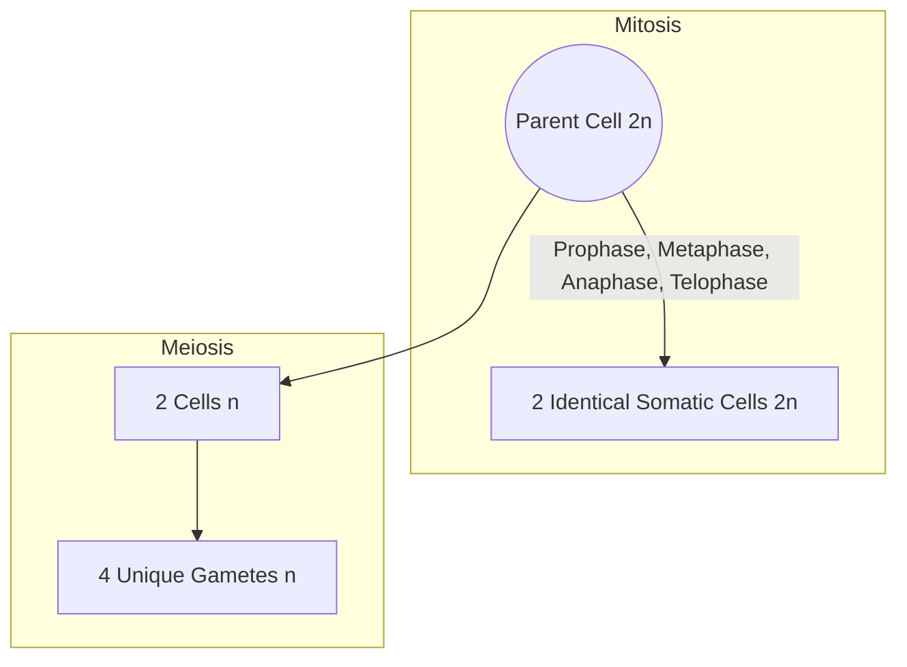
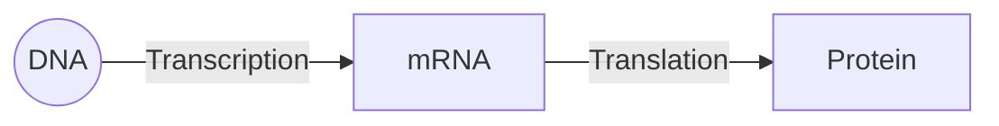

<div class="revision-card" style="background: rgba(20,20,30,0.4); border: 1px solid var(--border); border-radius: 8px; padding: 20px; margin-bottom: 24px; box-shadow: 0 4px 12px rgba(0,0,0,0.25);">
  <h3 style="color: var(--accent); margin-bottom: 16px; border-bottom: 1px solid var(--border); padding-bottom: 8px; display: flex; align-items: center; gap: 8px; font-weight: 600;">GENETICS AND MOLECULAR BIOLOGY AND EVOLUTION OF LIFE</h3>
  <h4 style="border-left: 3px solid var(--info); padding-left: 8px; margin-top: 24px; margin-bottom: 10px; color: var(--text-primary); font-weight: 600;">DEEP CONCEPTUAL EXPLANATION</h4>

GENERAL SCIENCE GENETICS AND MOLECULAR BIOLOGY AND EVOLUTION OF LIFE GENETICS Gregor Johann Mendel is known as the Father of Genetics. The term ‘Genetics’ was first used by William Bateson in 1905. Mendel’s Laws Mendel’s laws of inheritance are based on his observations on monohybrid and dihybrid crosses. He summarised his findings into following three laws: Law of Dominance • Genetics is the process of transfer of character (traits) from one generation to next generation through genes.

• A gene is known as the molecular unit of heredity of a living organism.

• Dr. Hargovind Khorana (1968) discovered the genetic code and its function in protein systhesis.

(a) Law of dominance states that, when two alternative forms of a trait or character (genes) are present in an organism, only one factor expresses itself in F1 progeny and is called dominant, while the other whose expression remain masked is called recessive. (b) This shows that crossing between pure organisms for two contrasting characters produce only one character in F1-generation and both in F2-generation. Law of Segregation Mendel’s Experiments GJ Mendel for the first time conducted experiments to understand the pattern of inheritance of variation in living organisms.

• He conducted hybridisation (crossing) experiments on garden pea (Pisum sativum) for seven years and proposed the laws of inheritance in living organisms.

• Mendel conducted artificial pollination/cross- pollination experiments using several true-breeding lines of pea.

• A true-breeding line refers to one that have undergone continuous self-pollination and expressed stable traits for several generations.

• Mendel selected 14 true-breeding pea plant varieties, which were similar except for one character with contrasting traits.

(a) This law states that, though, F1 hybrid, alleles for dominant and recessive characters remain together, but these alleles do not show any blending and both the characters are recovered as such in the F2-generation. (b) These two co-existing alleles of an individual for contrasting trait segregate (separate) during gamete formation, so that each gamete receive only one of the two alleles. (c) Alleles again unite during fertilisation of gametes.

Law of Independent Assortment (a) It is also known as inheritance law and it states that alleles for one character assort independently of alleles for another character during gamete formation. (b) When two pairs of traits are combined in a hybrid, segregation of one pair of character is independent of the other pair of characters during gamete formation. These characters are listed in table given below:

A List of Contrasting Traits Studied by Mendel in Pea Plant ² Note Back cross is performed between F1 hybrid and one of its parent whether dominant or recessive, while test cross is a cross between F1 hybrid and recessive parent only. Characters Contrasting traits Dominant Recessive Stem height Tall Dwarf Flower colour Violet White Flower position Axial Terminal Pod shape Inflated Constricted Pod colour Green Yellow Seed shape Round Wrinkled Seed colour Yellow Green In 1900, Mendel’s work was ‘rediscovered’ by three European scientists, Hugo de Vries, Carl Correns and Erich von Tschermak. Exceptions to Principle of Dominance and Principle of Paired Factors Incomplete dominance is the phenomenon, in which phenotype of the F1 hybrid offspring does not resemble any of the parent, but it is an intermediate between the expression of two alleles in their homozygous state.

Red and white flowering true breeding lines of Mirabilis jalapa are when crossed, they shows F1 hybrid having pink flowers, i.e. incomplete dominance (exception to dominance law). Codominance is the phenomenon, in which two alleles of a hybrid express themselves independently. In this, offsprings show resemblance to both the parents. ABO blood group system in humans is the well-known example of codominance. SOME HEREDITARY DISEASES These are anatomical or physiological abnormalities present from birth, also called congenital diseases. These diseases can be caused by genetic mutations or environmental factors.

Mutation is nothing but the sudden change in genetic make up due to addition, deletion or replacement of any gene. Diseases by genetic mutation can be transmitted to next generation, whereas by environmental factors are non-transmissible. Haemophilia-A A, B, O BLOOD GROUP The ABO blood group system was discovered by the Austrian scientist Karl Landsteiner. ABO blood grouping is controlled by the gene I. The plasma membrane of the Red Blood Cells (RBCs) has sugar polymers that protude from its surface. These gene controls the kind of sugar protruding from RBC. The gene I has three alleles, I , I B and i. The alleles and I B produce a slightly different form of sugar, while allele i does not produce any sugar.

On the basis of the presence or the absence of the antigen A or B, four types of blood groups are present, which are A, B, AB and O.

• It is the most common X-linked recessive genetic disorder associated with serious bleeding.

• It is caused by a reduction in the amount and activity of coagulation factor VIII.

The Genetic Basis of Blood Groups in Human Population (Haemophilic male) (Normal female) XX X Y Allele from parent 1 Allele from parent 2 Genotype of offsprings Blood types of offsprings IA IA IA IA Xh IA IB IA IB AB IA IA i IB IA IA IB AB IB IB IB IB X X X X XY XY IB IB i i i Carrier daughters Normal sons Haemophilia-A Colour Blindness • For transfusion purpose the Rhesus factor and ABO grouping are the two most important compatibility factors to consider.

• An individual may be Rh+ or Rh−-factor. In simpler term, if an individual's blood type is A and positive for the Rhesus factor, then he or she is deemed to be ‘A+’.

• It is an X-linked recessive genetic disorder, which results in the inability to perceive differences between some of the colours that others can distinguish.

• It does not mean not seeing any colour at all infact it leads to the failure in discrimination between red and green colour.

(Normal male) XC XC (Colourblind female) X Y XCX XCY XCX XCY Colourblind son Carrier daughter Carrier daughter Colourblind son Colour blindness Cri-du-Chat Syndrome • It is a rare genetic disorder due to a missing part of chromosome 5.

• It is characterised by having a cat-like cry of affected children.

SEX DETERMINATION IN HUMANS In humans, each cell contains 46 chromosomes (44 autosomes + 2 sex chromosomes). Male sex chromosome is XY, whereas female sex chromosome is XX. During gamete formation, in female, all gametes contain only one type of chromosome, i.e. X and in male, half of the sperm contain X-chromosome, while half contain Y-chromosome. Thus, when a male gamete, i.e. sperm carrying X-chromosome fertilises an ova, the zygote develops into female and when a sperm carrying Y-chromosome fertilises an ova, the zygote develops into a male. Any increase or decrease in the number of sex chromosomes or autosomes causes genetic disorder. GENERAL SCIENCE Sickle-Cell Anaemia • It is an autosome linked recessive trait that can be transmitted from parents to the offsprings, when both the partners are carriers for the gene.

Progeria Caused due to the point mutation in position LMNA gene replacing cytosine for thymine. Creating a truncated from progenin of prelamin a protein. Early aging, small face and jaw, pinched nose, loss of eye sight, hair loss are some of major symptoms.

• It is a genetic blood disorder characterised by an abnormal, sickle-shape red blood cells.

• It is caused by the substitution of glutamic (Glu) acid by valine (Val) at the sixth position of the β-globin chain of the haemoglobin molecules.

Down’s Syndrome/ Trisomy-21 Blue Baby Syndrome It is used to describe newborns with cyanotic heart lesions. It is caused basically due to high nitrate contamination in ground water resulting in decreased O2 carrying capacity of haemoglobin in babies leading to death. It is also called as methaemoglobinemia.

• It is a chromosomal disorder caused by the presence of all or a part of an extra 21st chromosome.

• It is associated with impairment of cognitive ability and physical growth and a particular set of facial characteristics.

• In this syndrome, the person exhibit Mongolism.

Klinefelter’s Syndrome • It is a condition, in which human males have an extra X-sex chromosome (44 + XXY). MOLECULAR BASIS OF INHERITANCE Nucleic acid is the genetic material found in living beings. It was discovered by Friedrich Miescher. The term ‘Nucleic acid’ was given by Altman. Nucleic acids are polymers as nucleotides. Basically two types of nucleic acids are found in living systems, i.e. Ribonucleic Acid (RNA) and Deoxyribonucleic Acid (DNA).

• Effects are development of small testicles and reduced fertility.

• Such persons are sterile males or feminised males with undeveloped testis and some feminine characteristics like enlarged breasts, etc. They may be mentally retarded aslo.

Ribonucleic Acid (RNA) RNA was the first genetic material to be discovered even before DNA evolved as a genetic material. Duchenne Muscular Dystrophy • It is an X-linked disease associated with muscular dystrophy (mutations in the dystrophin gene).

• The 2 OH ′− group of ribonucleotides is a reactive group that makes RNA, a catalyst. It is evident that the essential life processes such as metabolism, translation and splicing, etc., have evolved, around RNA being a catalyst was reactive and hence, unstable.

• It is characterised by rapid progression of muscle degeneration, eventually leading to loss in ambulation, respiratory failure and death.

Turner’s Syndrome • It is a condition, in which human female has only one sex chromosome (XO).

• Effects are rudimentary ovaries and lack of secondary sexual character in women.

• Therefore, DNA has evolved from RNA with chemical modification that makes it more stable.

RNAs are of three main types, i.e. messenger RNA (mRNA), transfer RNA (tRNA) and ribosomal RNA (rRNA), which participate in the process of transcription and translation also.

• RNA helps in the formation of protein, i.e. protein synthesis or translation.

Patau Syndrome/Trisomy-13 • A syndrome, in which a patient has an additional copy of autosomal chromsome 13 due to a non-disjunction of chromosomes during meiosis. Deoxyribonucleic Acid (DNA) DNA acts as a genetic material in most organisms.

• It is a long polymer of deoxyribonucleotides.

• Its effects are mental retardation, cut mark in the lip.

• The number of nucleotides or base pair (bp) present in the DNA determines its length.

• DNA is made up of two polynucleotide chains and its back bone is constituted by sugar and phosphate.

From this backbone the nitrogenous bases project inwards.

• The two strands of DNA are paired through hydrogen bonds (H-bonds) between bases.

Alkaptonuria It is a rare inherited genetic disorder of phenylalanine and tyrosine metabolism. Phenylketonuria It is an autosomal recessive metabolic genetic disorder characterised by mutation in the gene for hepatic enzyme phenylalanine hydroxylase. Differences between DNA and RNA Discoveries Related to Structure of DNA and Composition of DNA DNA RNA It usually occurs inside nucleus and in some cell organelles like mitochondria and chloroplast.

Very little RNA occurs inside nucleus. Most of it is found in the cytoplasm.

• Friedrich Miescher (in 1869), identified DNA as an acidic substance present in nucleus and termed it nuclein.

• James Watson and Francis Crick (in 1953) proposed the double helix model of the DNA structure.

DNA is the genetic material.

RNA is not the genetic material except in certain viruses, e.g. HIV, retrovirus.

• Erwin Chargaff observed that for a double-stranded DNA, the ratios between adenine, thymine and guanine, cytosine are constant and equal to one.

It is double-stranded with the exception of some viruses like polyomavirus. RNA is single-stranded with the exception of some viruses, e.g. double- stranded inT T T bacteriophage, etc.

DNA shows regular helical coiling.

There is no regular coiling except in some parts of RNA.

It contains deoxyribose sugar.

It contains ribose sugar.

Genetic Code Nitrogen base thymine occurs in DNA along with three other adenine, cytosine and guanine. Thymine is replaced by uracil in RNA. The other three are adenine, cytosine and guanine. It replicates to form new DNA molecules.

It cannot replicate itself except in RNA-RNA viruses. The relationship between the sequence of nucleotide on mRNA (i.e. messenger RNA) and sequence of amino acids in the polypeptide is called genetic code.

RNA controls only protein synthesis.

• In this nitrogenous bases in mRNA encode the information required for protein synthesis.

DNA controls heredity, evolution, metabolism, structure and differentiation.

• The sequence of nitrogenous bases (nucleotides) in mRNA for coding a single amino acid is called as codon.

• A codon is triplet, i.e. it is formed of three nucleotide bases, specific, continuous, i.e. without comma or punctuation and universal in nature.

Structure of a Polynucleotide Chain (DNA/RNA) RNA and DNA both are comprised of polynucleotide chain. A nucleotide is composed of a nitrogenous base, pentose sugar and a phosphate group. Nitrogenous Base It is a nitrogen containing organic molecule having physical properties similar to a base.

ORIGIN OF LIFE The origin of life is considered a unique event in the history of universe. The study of history of life forms on the earth is called evolutionary biology. The important theories of origin of life are as follows: Theory of Spontaneous Generation • There are two types of nitrogenous bases:

1. Purines (Adenine and Guanine) 2. Pyrimidines (Cytosine, Thymine and Uracil) • Adenine and thymine are bonded by double bond (A==T).

• It states that life originated from decaying and rotting matter like straw, mud, etc., spontaneously, i.e. organism is formed automatically from non-living matter.

• Cytosine and guanine are bonded by triple hydrogen bond (C ≡≡ ).

• Out of pyrimidines, cytosine is common for both DNA and RNA, while thymine is present in DNA only.

• Van Helmont (1652) stated that young mice could arise from wheat grains, when these are put in the dark along with a moist shirt.

• Uracil is present in RNA in place of thymine.

Theory of Biogenesis A Pentose Sugar • Nitrogenous base is attached to the pentose sugar by N-glycosidic linkage to form nucleoside.

• Theory of spontaneous generation (life) was rejected by Francesco Redi (1668), Lazzaro Spallanzani (1765) and Louis Pasteur (1861).

• Spontaneous generation of flies from rotting meat was disproved by F Redi.

• Two types of sugars are present in RNA and DNA respectively, i.e. ribose in case of RNA and deoxyribose in case of DNA.

• Spallanzani stated that air carried microorganisms.

• Pasteur is famous for ‘Germ Theory of Diseases’.

• Theory of biogenesis states that the living things can only arise from previously existing living things.

A Phosphate Group When a phosphate group is attached to 5′–OH of a nucleoside through phosphodiester linkage, a nucleotide is formed. GENERAL SCIENCE Modern Theory (Oparin’s Hypothesis) • The most important condition for the origin of life is the presence of water.

• Hydrogen atoms were most numerous and most active in primitive atmosphere.

• This theory is also known as modern theory or abiogenic origin or naturalistic theory or physiochemical evolution.

• According to this theory, life originated on earth after a long period of ‘abiogenic molecular evolution’.

• It was hypothesised by AI Oparin. Oparin wrote a book ‘The Origin of Life’ in 1936.

EVOLUTION The term ‘Evolution’ has been derived from the Latin word evolvere (e–out; volvere–to roll) means to unfold or to unroll to reveal hidden potentialities. Evolution is a process by which different kinds of living organisms develope from earlier froms.

• The first experimental support to Oparin-Haldane’s theory of origin of life came from Urey and Miller’s simulation experiment in 1853.

Geological Time Scale and Events in the Evolution By studying fossils occurring in different strata of rocks, geologists are able to reconstruct the time and course of evolutionary change.

• They demonstrated clearly that the UV radiations or electrical discharge or combination of these can produce complex organic compounds from a mixture of CH , NH , H O and H 2 with ratio of methane, ammonia and hydrogen was 2 : 1 : 2 in the experiment.

Time Scale of Earth Era Period Age in million years from present Epoch Age in million years from present Fauna (Animals) Flora Plants Cenozoic (Era of modern life) Quarternary 0-2 Recent (Holocene) (0.01) Modern man dominant; Modern mammals, birds, fishes, insects. Rise of herbaceous plants, decline of woody plants. Age of mammals and angiosperms Pleistocene 2 Extinction of great mammals; Humans appeared evolution of human society and culture.

Tertiary 2-65 Pliocene 6-7 (Age of mammals) Formation and adaptive radiation of modern mammals.

Adaptive radiation of flowering plants.

Miocene 26 Mammals at peak, first man-like apes formed. Oligocene 38 Rise of first monkeys and apes. Eocene 54 Diversification of placental mammals, origin of horse.

Angiosperm dominance.

Palaeocene 65 Rise of first primates.

Mesozoic (Era of medieval life) Creataceous 135 Extinction of dinosaurs and toothed birds; Rise of and placental mammals.

Dominance of angiospermic plants.

Age of reptiles and gymnosperms Jurassic 145 (Age of reptiles) Origin of toothed birds (first birds) dinosaurs dominant.

Origin of angiosperm.

Dominance of gymnosperms.

Triassic 225 Origin of dinosaurs and mammals.

Abundance of gymnosperms.

Origin of conifers.

Palaeozic (Era of ancient life) Permian 280 Extinction of trilobites. Origin of mammals-like reptile (therapsids) and most modern orders of insects. Carboniferous 350 (Age of amphibians) Origin of reptiles and winged insects. Amphibians dominant. Abundance of tree ferns, forming coal forests.

Devonian 400 (Age of fishes) Origin of amphibians; fishes abundant spiders appeared.

Earliest mosses and ferns.

First speed plants appeared.

Silurian 440 Origin of jawed fishes and wingless insects; earliest coral reefs.

Earliest spore-bearing plants.

Ordovician 500 (Age of invertebrates) Origin of vertebrates (Jawless fishes); invertebrates abundant, also called age of giant molluscs. Cambrian 570 All invertebrate phyla established; origin of trilobites. Proterozoic (Era of early life) 1000, 2000, 3000 Ancient metazoans (sponges, cnidarians), primitive eukaryotes; scanty fossils (prokaryotes).

Archaezoic (Era of invisible life) Origin of life; no recognisable fossils. Azoic (Era of no life) Origin of solar system; no life. (ii) Lamarck arranged his theory in four postulates.

Evidences of Organic Evolution • Homologous organs are similar in basic structure and origin, but dissimilar in functions, e.g. wings of bat, cat’s paw, front foot of horse, human hands and wings of birds are homologous organs. – Internal forces tend to increase size of the body. – Formation of new organs is the result of the need.

– Development of organs is based on the continuous use and disuse. – All changes acquired by the organism are transmitted to offspring by the process of inheritance. (iii) Some examples of uses and disuses of organs are:

• Analogous organs are the organs similar in shape and function, but their origin, basic development plan are dissimilar, e.g. wings of insects, birds and bats are analogous organs. Analogous organs are also called as homoplastic organs.

– Webbed feet of swimming birds.

– Rudimentary eyes of cave dwellers.

– Elongated limbless body of snake.

– Long thin neck in giraffe.

– Vestigial organs of living animals.

• Vestigial organs are degenerated, non-functional organs, which were functional earlier. Human body has been discribed to possess about 90 vestigial organs.

• Some of these are muscles of ear pinna, canine teeth and third molar teeth, body hairs, vermiform appendix (degenerated terminal part of caecum) nictitating membrane of eye, caudal vertebrae (coccyx or tail bone), etc.

• Atavism or reversion is the sudden reappearance of some ancestral features. Appearance of thick body hair, large canines, monstral face, short temporary tails, additional pairs of nipples, etc., are examples of atavism.

• Connecting links are organisms that has features of two existing group of organisms. These also provide an evidence for evolution.

Darwinism Charles Darwin (1809-1882) and Alfred Russel Wallace (1823-1913) proposed, the ‘Theory of Natural Selection’. Darwin’s theory is based on five principles: (i) Over production is shown by every organism.

(ii) Organism show struggle for existence. (iii) Struggle for existence leads to variations and their inheritance. (iv) The variations in the organisms lead to the survival of the fittest.

(v) Natural selection and species formation is due to variations. One major criticism against Darwin’s theory was his failure to give an explanation for variations. Organism Connecting link between Virus Living and non-living Euglena (Protozoa) Plants and animals Proterospongia (Protozoa) Protozoa and Porifera Peripatus (Arthropoda) Annelida and Arthropoda Neopilina (Mollusca) Annelida and Mollusca Balanoglossus (Chordata) Non-chordata and Chordata Dipnoi (Lung fish) Pisces and Amphibia Archaeopteryx (Aves) Reptiles and Aves Prototheria (Mammalia) Reptiles and Mammalia Mutation Theory Hugo de Vries (1845-1935) gave much importance to the discontinuous variation or saltatory variations and proposed that new species arise not by the accumulation of minor and continuous variation through the natural selection, but by saltatory variations that appear suddenly for, which he coined the term ‘mutation’.

(i) After that he proposed the ‘theory of mutation’. (ii) Mutations are discontinuous variation. (iii) These are due to changes in chromosomes, genes and DNA. These changes may or may not be inherited.

Theories of Evolution Evolution is generally progressive and variation is most important requirement for it. The ultimate source of organic variation is mutation (sudden change in genes). These are some important theories of evolution: Lamarckism Synthetic Theory The modern theory of origin of species or evolution is known as modern synthetic theory of evolution.

(i) Initial basis of synthetic theory was given by Dobzohansky (1937). Modern synthetic theory of evolution was designated by Huxley in 1942. (ii) According to it the five basic factors are: – Gene mutation – Changes in chromosome structure and number – Genetic recombinations – Natural selection – Reproductive isolation First three factors are responsible for genetic variability.

The French biologist Jean Baptiste de Lamarck (1744-1829) suggested a complete theory of evolution. Lamarckian theory is also known as ‘Theory of Inheritance of Acquired Characters’ or ‘Theory of Use and Disuse of Organs’. (i) Lamarck’s theory was published in his book ‘Philosophie Zoologique’ in 1809.

GENERAL SCIENCE – Mutation must not occur.

– The population must be very large.

Hardy-Weinberg Equilibrium Hardy-Weinberg law is the fundamental law of population genetics, which provides the basis for studying the Mendelian population. According to this law, (i) Mutations introduce new genes into a species resulting into a change in gene frequencies. (ii) In certain conditions gene frequencies remain constant. The conditions necessary for gene frequency to remain constant are: – All genes must have an equal chance of being passed to the next generations.

(iii) Constant gene frequencies over several generations indicate that natural selection and evolution are not taking place. (iv) Changing gene frequencies would indicate that evolution is in progress.

– Mating must be completely random.

PLANT MORPHOLOGY AND PHYSIOLOGY Angiosperms are the seed bearing, flowering plants in which seeds are formed inside fruits; and male and female reproductive parts are organised into flowers. MORPHOLOGY OF ANGIOSPERMS Morphology (Morphe–form; logos–study) is the branch of biology, which deals with the study of external forms and features of different plant organs like roots, stems, leaves, flowers, seeds, fruits, etc. The body of typical angiospermic plant is differentiated into an underground root system and an aerial shoot system.

Type of parasitic plants are as follow:

(i) Obligate parasite, e.g. Nuytsia floribunda. (ii) Facultative parasite, e.g Rhinanthus. (iii) Root parasite, e.g. Rafflesia, sandal wood.

(iv) Stem parasite, e.g. Cuscuta, Loranthus. (v) Saprophytic humus plants Grow on dead organic matter, e.g. fungi. (vi) Symbiotic plants Symbiosis or mutually beneficial partnership of two organisms, e.g.

mycorrhiza associated with roots of higher plants and legumes associated with Rhizobium (N2-fixing bacteria). Shoot tip (apical bud) Different organ systems present in angiosperms are as follow: Flower Lateral bud Leaf Stem Seeds Fruit Root System Roots develop from radicle of seed. They are non-green, underground, geotropic, phototropic and hydrotropic in nature and they do not bear buds, nodes and internodes. They have unicellular root hairs. Lateral roots arise endogenously from pericycle.

Shoot Root Primary root Lateral root Root hair Root tip Root cap Morphology of plant Types of Roots Roots are of two types: (i) Tap root It develops from radicle. The primary root grows and gives rise to secondary and tertiary roots forming tap root system, e.g. dicot. (ii) Adventitious root These roots develop from any part of the plant body other than the radicle, e.g.

monocot.

Functions of Roots • Roots help in fixation and absorption of water and minerals.

• Storage of food is one of the major function of roots, conduction of water takes place by roots.

• It helps in photosynthesis and respiration by providing supply of water to all parts of plant.

Types of Plants On the basis of nutrition, plants are of following types: (i) Autotrophic plants These are green and capable of making their own food by the process of photosynthesis, e.g. all green plants. (ii) Parasitic plants Depend on other plants for food and water. They have special roots for absorption of food and water. These roots are called sucking roots or haustoria, e.g. Cuscuta, Duranta.


</div>


## Visual Summary & Diagrams: Genetics

### Mitosis vs Meiosis



## Visual Summary: Genetics

### Mitosis vs Meiosis
```mermaid
flowchart LR
    Mitosis((Mitosis)) --> Somatic[Somatic Cells]
    Mitosis --> Identical[2 Identical Diploid Cells (2n)]
    Mitosis --> PMAT[Prophase -> Metaphase -> Anaphase -> Telophase]
    
    Meiosis((Meiosis)) --> Gametes[Sex Cells / Gametes]
    Meiosis --> Unique[4 Unique Haploid Cells (n)]
    Meiosis --> CrossingOver[Crossing Over occurs in Prophase I]
```

### DNA Structure (Central Dogma)

