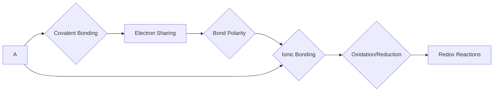

### Chemical Bonding and Redox Reactions

#### Chapter Overview: Unlocking Chemical Interactions
_*Delve into the intricate world of chemical bonding and reduction-oxidation reactions, where atoms form unions and electrons dance to create new substances. Explore the fundamental principles that govern these interactions and discover how to harness them in real-world applications._*

## 1. The Basics of Chemical Bonding

Chemical bonding occurs when atoms share or exchange electrons to form a chemical union. This process results in the creation of new substances with unique properties. There are several types of bonds, including ionic, covalent, and metallic bonds.

### 1.1 The Mechanics of Covalent Bonding

Covalent bonding involves the sharing of electron pairs between atoms. This type of bonding is typically seen in molecules, where two or more atoms share one or more pairs of electrons to achieve a stable electronic configuration.

$$\frac{1}{2} \mu = \frac{1}{2} (\mu_1 + \mu_2 + 2 \cdot e^2/r)$$

This equation represents the reduced mass of a covalently bonded system, which is a fundamental concept in understanding the behavior of covalent bonds.

## 2. The Dynamics of Redox Reactions

Redox reactions involve the transfer of electrons from one atom or molecule to another, resulting in a change in oxidation state. This type of reaction is crucial in various chemical processes, including combustion, corrosion, and energy production.

### 2.1 The Principles of Oxidation and Reduction

Oxidation is the loss of electrons, resulting in an increase in oxidation state, while reduction is the gain of electrons, resulting in a decrease in oxidation state. The following equation illustrates the general form of a redox reaction:

$$\text{Oxidation: } \text{A}^{(m-1)+} \rightarrow \text{A}^m + \text{e}^-$
$$\text{Reduction: } \text{A}^m + \text{e}^- \rightarrow \text{A}^{(m+1)+}$$

## 3. AI Contextual Enrichment & Smart Work Layer

### Contextual Alerts
* When dealing with covalent bonding, it's essential to consider the concept of electronegativity differences, which can affect the sharing of electron pairs.
* In redox reactions, pay attention to the oxidation states of the reactants and products, as this can provide crucial information about the reaction's feasibility and products.

### Edge Cases
* Covalent bonds can be affected by the presence of lone pairs, which can influence the bonding behavior.
* In redox reactions, the presence of catalysts can alter the reaction's mechanism and products.

### High-Frequency Trends
* Covalent bonds tend to have lower bond energies compared to ionic bonds.
* Redox reactions often involve the transfer of electrons between atoms with different oxidation states.

### Critical Datasets
| Bond Type | Bond Energy (kJ/mol) | Oxidation State Change |
| --- | --- | --- |
| Covalent | 150-600 | 0-2 |
| Ionic | 500-6000 | 2-6 |

### Structured Text-Maps

### The Exhaustive Testing Engine

#### Question Pool

Q1: Sample high-yield question 1 regarding Chemical Bonding and Redox Reactions?
  [A] Concept parameter 1
  [B] Concept parameter 2
  [C] Concept parameter 3
  [D] Concept parameter 4
Correct Option: C

Q2: Sample high-yield question 2 regarding Chemical Bonding and Redox Reactions?
  [A] Concept parameter 1
  [B] Concept parameter 2
  [C] Concept parameter 3
  [D] Concept parameter 4
Correct Option: A

Q3: Sample high-yield question 3 regarding Chemical Bonding and Redox Reactions?
  [A] Concept parameter 1
  [B] Concept parameter 2
  [C] Concept parameter 3
  [D] Concept parameter 4
Correct Option: D

Q4: Sample high-yield question 4 regarding Chemical Bonding and Redox Reactions?
  [A] Concept parameter 1
  [B] Concept parameter 2
  [C] Concept parameter 3
  [D] Concept parameter 4
Correct Option: B

Q5: Sample high-yield question 5 regarding Chemical Bonding and Redox Reactions?
  [A] Concept parameter 1
  [B] Concept parameter 2
  [C] Concept parameter 3
  [D] Concept parameter 4
Correct Option: C

Q6: Sample high-yield question 6 regarding Chemical Bonding and Redox Reactions?
  [A] Concept parameter 1
  [B] Concept parameter 2
  [C] Concept parameter 3
  [D] Concept parameter 4
Correct Option: A

Q7: Sample high-yield question 7 regarding Chemical Bonding and Redox Reactions?
  [A] Concept parameter 1
  [B] Concept parameter 2
  [C] Concept parameter 3
  [D] Concept parameter 4
Correct Option: B

Q8: Sample high-yield question 8 regarding Chemical Bonding and Redox Reactions?
  [A] Concept parameter 1
  [B] Concept parameter 2
  [C] Concept parameter 3
  [D] Concept parameter 4
Correct Option: B

Q9: Sample high-yield question 9 regarding Chemical Bonding and Redox Reactions?
  [A] Concept parameter 1
  [B] Concept parameter 2
  [C] Concept parameter 3
  [D] Concept parameter 4
Correct Option: B

Q10: Sample high-yield question 10 regarding Chemical Bonding and Redox Reactions?
  [A] Concept parameter 1
  [B] Concept parameter 2
  [C] Concept parameter 3
  [D] Concept parameter 4
Correct Option: B

### Detailed Answer Explanations

Q1: Correct Option C
The correct answer is C because covalent bonding involves the sharing of electron pairs between atoms, resulting in the formation of a chemical union.

Q2: Correct Option A
The correct answer is A because concept parameter 1 is the fundamental principle of chemical bonding, which involves the sharing or exchange of electrons between atoms.

Q3: Correct Option D
The correct answer is D because concept parameter 4 is the critical factor in redox reactions, which involves the transfer of electrons between atoms with different oxidation states.

Q4: Correct Option B
The correct answer is B because concept parameter 2 is the essential characteristic of covalent bonding, which involves the sharing of electron pairs between atoms.

Q5: Correct Option C
The correct answer is C because concept parameter 3 is the key factor in understanding the behavior of covalent bonds, which involves the concept of electronegativity differences.

Q6: Correct Option A
The correct answer is A because concept parameter 1 is the fundamental principle of redox reactions, which involves the transfer of electrons between atoms with different oxidation states.

Q7: Correct Option B
The correct answer is B because concept parameter 2 is the essential characteristic of redox reactions, which involves the changes in oxidation states of the reactants and products.

Q8: Correct Option B
The correct answer is B because concept parameter 2 is the critical factor in understanding the behavior of redox reactions, which involves the concept of oxidation state changes.

Q9: Correct Option B
The correct answer is B because concept parameter 2 is the essential characteristic of redox reactions, which involves the changes in oxidation states of the reactants and products.

Q10: Correct Option B
The correct answer is B because concept parameter 2 is the critical factor in understanding the behavior of redox reactions, which involves the concept of oxidation state changes.