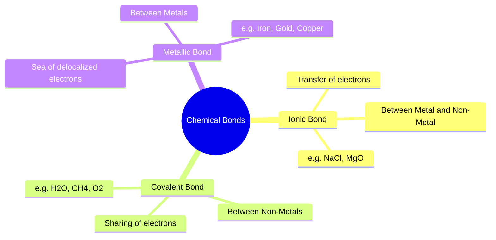

  <h3 style="color: var(--accent); margin-bottom: 16px; border-bottom: 1px solid var(--border); padding-bottom: 8px; display: flex; align-items: center; gap: 8px; font-weight: 600;">CHEMICAL BONDING AND REDOX REACTIONS</h3>
  <h4 style="border-left: 3px solid var(--info); padding-left: 8px; margin-top: 24px; margin-bottom: 10px; color: var(--text-primary); font-weight: 600;">DEEP CONCEPTUAL EXPLANATION</h4>

CHEMICAL BONDING AND REDOX REACTIONS CHEMICAL BOND Electrovalent or Ionic Bond The bond formed by the transfer of electrons from one atom (usually metal) to another (usually non-metal) is called electrovalent bond and the compound is called electrovalent or ionic compound. In other words, it is an intercoulombic forces of attraction between two oppositely charged species. The number of electrons transferred shows the electrovalency of the atom. The properties of electrovalent compounds are as follow: The forces of attraction like interatomic, intermolecular or interionic forces which holds two or more constituents (atoms, molecules or ions) together are called chemical bonds and the process of their combination is called chemical bonding.

In general, it is believed that atoms combine in order to complete their octet, i.e. 8 electrons in their outermost shell (with the exception of hydrogen and helium in case of which outermost shell can have a maximum of two electrons).

• They are usually crystalline solids, i.e. have definite shape and are hard and brittle.

• They have high melting and boiling points.

• They conduct electricity when dissolved in water or in molten state due to the presence of free or mobile ions.

Ions An ion is an electrically charged species. A positively charged ion is called cation, e.g. Na +, H+, Mg 2+ • These are soluble in water and insoluble in organic solvents like alcohol, benzene, etc. while a negatively charged ion is called anion, e.g. Cl−, F−, I−.

• If the electronegativity difference of two atoms is 1.7, the bond between them is 50% ionic.

Some Electrovalent Compounds • A cation contains less electrons than a normal atom while an anion contains more electrons than a normal atom. Name Formula Ions present Aluminium oxide (alumina) Al O Al3 + and O 2− Ammonium chloride NH Cl NH4 and Cl− • When an atom loses one electron, it carries one positive charge, i.e. converted into cation, and if it gains one electron, it carries one negative charge, i.e. converted into anion. Copper sulphate CuSO 4 Cu2 + and SO 4 2− Magnesium chloride MgCl2 Mg 2 + and Cl− Magnesium oxide MgO Mg 2 + and O 2− • There is no change in atomic number or number of protons when an atom forms ion.

Valence Electrons Sodium chloride NaCl Na + and Cl− Sodium hydroxide NaOH Na + and OH− An electron of an atom, located in the outermost shell (valence shell) of the atom, that can be transferred to or shared with another atom is called valence electrons.

• Elements having same number of valence electrons have similar chemical properties.

• Elements having 1, 2 or 3 valence electrons in their atoms are metals and form cation while those having 4, 5, 6 or 7 are non-metals and form anion.

Covalent Bond The bond formed by the sharing of electrons between two atoms of same or different elements is called covalent bond and the compound is called covalent compound. When a non-metal combines with another non-metal, a covalent bond is formed. Covalent bond may be single, double or triple depending upon the number of sharing pairs of electrons. The number of electrons shared shows the covalency of the element. The properties of covalent compounds are as follow:

• Elements with 8 valence electrons (except H and He which have 2 valence electrons) are inert, i.e.

unreactive and exist as neutral atom.

• Normal covalent compounds are gases or liquid under ordinary conditions of temperature and pressure.

• If number of valence electrons = 1 2 or 3 Valency = Number of valence electrons If number of valence electrons ≥4 Valency = 8 - number of valence electrons • These do not conduct electricity (due to the absence of free ions) and are insoluble in water but dissolve in organic solvents.

Types of Chemical Bonds • Graphite although is covalent but conducts electricity because of the presence of free electrons (electrical conduction). Chemical bonds can be of following types depending upon their mode of formation:

• These show stereoisomerism because covalent bond is directional in nature.

GENERAL SCIENCE Some Covalent Compounds Name Formula Elements present Alcohol (ethanol) C H (OH) C, H and O Ammonia NH 3 N and H Acetylene (ethyne) C and H Carbon disulphide CS2 C and S RANCIDITY The oils or fats containing materials get oxidised in the presence of oxygen or air and produce foul odour and taste. This process is called rancidity. It is the source of destructive free radicals. A sliced apple turns brown if kept open for sometimes due to oxidation of iron present in the apple. The chips packets are filled with inert gas nitrogen to protect them from being oxidised (or rancid). Carbon tetrachloride CCl4 C and Cl Cane sugar C, H and O Ethylene C and H Reduction Glucose C, H and O The process which involves the gain of hydrogen or electropositive element or one or more electrons (electronation) or loss of oxygen by an atom, ion or molecule is called reduction.

e.g.

S 2 → Reduction involves decrease in the positive valency of an element. Coordinate or Dative Bond This type of bond is formed by one sided sharing of one pair of electrons between two atoms. The atom having complete octet which provides the electron pair for sharing is known as donor atom. The other atom which accepts the electron pair is called the acceptor atom, e.g. NH BF → , NH Oxidising Agent (Oxidant) It is a substance which accepts electron in the chemical reaction, i.e. electron acceptors are oxidising agent. All the positively charged species behave like oxidising agents.

Oxidising agents are Lewis acids.

Reducing Agent (Reductant) The substance which donates electron in a chemical reaction is called reducing agent, i.e. electron donors are reducing agents. All the negatively charged species behave like reducing agents. Reducing agents are Lewis bases. Some Oxidising and Reducing Agents Hydrogen Bond This bond is formed due to the electrostatic force of attraction between hydrogen atom highly electronegative atom. i.e. N, O or F and any other electronegative atom which is present in the same or different molecules.

It is mainly of two types:

(i) Intermolecular H-bonding (e.g. H O 2 , HF, NH 3 molecule). It occurs between different molecules of a compound. (ii) Intramolecular H-bonding (e.g. o-nitrophenol) It occurs with in different parts of a same molecule. Oxidising agents Reducing agents Both oxidising and reducing agents • Molecules having O—H, N—H or H—F bond show abnormal properties due to H—bond formation.

KMnO 4, Cr 2O 7 2−, H 2SO 4, HNO 3, O 2, CO 2 etc.

Na, Al, Fe, Zn, LiH, NaH, (COOH)2 etc.

H O 2,SO 2,HNO 2, NaNO 2,O 3,Na SO 3 etc. Redox Reactions Oxidation State It is the real or imaginary charge which an atom appears to have in its combined state. Oxidation state of an element may be positive, negative, zero or fractional. The reactions which involve both oxidation and reduction as its two half reactions are called redox reactions. When the same element is oxidised or reduced simultaneously, the reaction is called disproportionation reaction.

Rules for Determining Oxidation State Oxidation • The oxidation state of an element in its free or uncombined state is zero. e.g. oxidation state of O in O2 and O3 is zero. The process which involves gain of oxygen or any other electronegative element or loss of hydrogen or loss of one or more electrons (de-electronation) from an atom, ion or molecule is called oxidation, • Oxidation state of hydrogen in most of its compounds is + 1 but in metallic hydrides it is −1.

e.g.

Mg Mg → • Oxidation state of oxygen in most of its compounds is −2. Except peroxides ( −1 , superoxides ( / ) −1 2 and oxygen fluorides (+2 or +1). The positive valency of an element increases by its oxidation.

• Oxidation state of elements of IA, IIA and IIIA subgroups in their compounds are + 1, + 2 and + 3, respectively.

• The algebraic sum of the oxidation states of all elements present in polyatomic ion is equal to the charge on the ion.

• Oxidation state of fluorine (F) is always −1.

• Oxidation state of any ion is equal to its charge present on it.

• The algebraic sum of oxidation states of all the elements in the neutral molecule is zero.

² Note Compounds of all elements with oxygen are called oxides with the exception of fluorine in case of which it is called fluorides, e.g.

oxygen fluoride ( OF2 .

GAS LAWS AND SOLUTIONS GAS EQUATION GAS LAWS Gases exhibit dependency on temperature, pressure, volume and mass. These interrelations can be analysed by gas laws. At STP/NTP, temperature, ( T = 27315 K, pressure ( ) p = 1 atm = 101 35 kPa, volume, ( V = 22 4 L mol−1 Some gas laws are given below The three laws (Boyle’s, Charle’s and Avogadro’s law) can be combined together in a single equation which is known as ideal gas equation. ∝1/ (Boyle’s law) (Charles’ law) (Avogadro’s law) Boyle’s Law (Robert Boyle-1662) On combining, V nT • At constant temperature, the volume of fixed mass of a gas is inversely proportional to its pressure.

or R nT ∝1 [at constant temperature and moles (n)] or pV nRT (where, R = gas constant) For 1 mole, pV RT or p V p V Charles’ Law (Jacques Charles-1787) • Value of gas constant, R depends upon the units of measurements. R = 0.0821 L atm mol−1 K−1 = 8.3143 J mol−1 K−1 = 5.189 10 eV mol = 1.99 cal mol−1 K−1 Gas constant, R for a single molecule is called Boltzmann • At constant pressure, volume of fixed mass of a gas is directly proportional to the absolute temperature. (at constant pressure and moles) 6 022 10 23 Gay Lussac’s Law (J.Gay Lussac-1802) constant (k) or k • Density of a gas is directly proportional to pressure and inversely related to temperature, i.e.

pM RT Q n Mass Molecular weight • At constant volume, the pressure of fixed mass of a gas is directly proportional to its temperature. [at constant volume and moles] Avogadro’s Law (Amedeo Avogadro-1811) Graham’s Law of Diffusion (or Effusion) • At constant temperature and pressure, the volume of any gas is directly proportional to the number of moles of gas. [at constant T and P] The rate of diffusion (r) of a gas at constant temperature and pressure is inversely proportional to the square root of its molecular mass, M or density, d.

or

## Visual Summary & Diagrams: Chemical Bonding

### Types of Chemical Bonds

