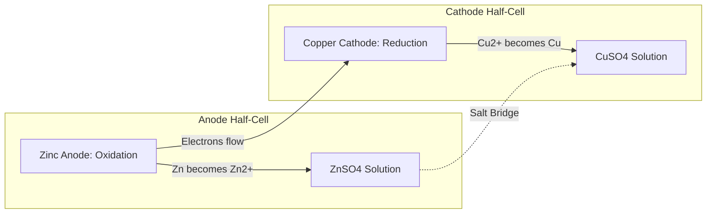

  <h3 style="color: var(--accent); margin-bottom: 16px; border-bottom: 1px solid var(--border); padding-bottom: 8px; display: flex; align-items: center; gap: 8px; font-weight: 600;">ELECTROCHEMISTRY</h3>
  <h4 style="border-left: 3px solid var(--info); padding-left: 8px; margin-top: 24px; margin-bottom: 10px; color: var(--text-primary); font-weight: 600;">DEEP CONCEPTUAL EXPLANATION</h4>

GENERAL SCIENCE COLLOIDS Types of Emulsions There are two types of emulsions • Oil in water type e.g. milk in which tiny droplets of liquid fat are dispersed in water.

• Water in oil type e.g. stiff greases, in which water being dispersed in lubricating oil.

In a colloid, the size of solute particles is bigger than that of true solution but smaller than that of suspension, i.e. lies in between 1 to 100 nm. A colloidal solution is a heterogeneous system in which one substance is dispersed as very fine particles in another substance, called dispersion medium.

## Visual Summary & Diagrams: Electrochemistry

### Galvanic (Voltaic) Cell

