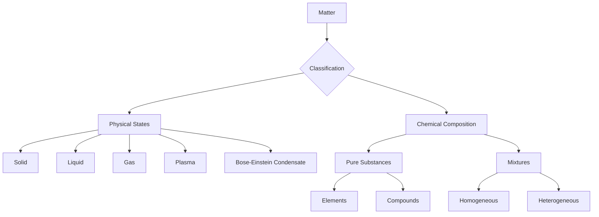

# Chemistry: Understanding Matter

Chemistry is the scientific discipline involved with elements and compounds composed of atoms, molecules, and ions: their composition, structure, properties, behavior, and the changes they undergo during a reaction with other substances.

## Deep Conceptual Explanation: What is Matter?

Matter is defined as anything that possesses mass, occupies space (has volume), and can be perceived by one or more of our sense organs. It is the fundamental substance of which all physical objects are composed. Understanding matter is crucial for comprehending the physical world around us.

Matter exists in five primary physical states:

*   **Solid**: Possesses a definite shape and volume. Intermolecular forces are very strong, holding particles in fixed positions.
*   **Liquid**: Has a definite volume but no definite shape, taking the shape of its container. Intermolecular forces are weaker than solids, allowing particles to move past each other.
*   **Gas**: Neither a definite shape nor a definite volume. Intermolecular forces are very weak, and particles move freely and randomly.
*   **Plasma**: An ionized gas, consisting of a gas of ions, atoms, and free electrons. It is the most common state of matter in the universe (e.g., in stars).
*   **Bose-Einstein Condensate (BEC)**: A state of matter that can arise when a gas of bosons is cooled to temperatures very close to absolute zero. At these temperatures, a large fraction of the bosons occupy the lowest quantum state, becoming a single quantum mechanical entity.

Among these, solid, liquid, and gas are the most commonly encountered states on Earth under normal conditions.

### Fundamental Properties of Matter

All forms of matter exhibit specific physical properties that distinguish them:

*   <h4>Density</h4>
    Density is a measure of the mass of a substance per unit volume. It quantifies how much 'stuff' is packed into a given space. Mathematically, it is expressed as:
    
    
Density (ρ) = Mass (m) / Volume (V)

    
    Materials with higher density are considered 'heavier' for a given volume.

*   <h4>Compressibility</h4>
    Compressibility refers to the ability of a substance to decrease in volume under pressure.
    *   **Gases** are highly compressible due to the vast intermolecular spaces between their particles.
    *   **Solids** are minimally compressible because their particles are tightly packed with very small intermolecular spaces.
    *   **Liquids** have intermediate compressibility, greater than solids but significantly less than gases.

*   <h4>Thermal Expansion</h4>
    Thermal expansion is the tendency of matter to change in volume in response to a change in temperature. When heated, particles gain kinetic energy and move further apart, causing expansion. Conversely, cooling causes contraction.
    *   **Gases** exhibit the maximum thermal expansion due to their weak intermolecular forces.
    *   **Liquids** show moderate thermal expansion.
    *   **Solids** have the minimum thermal expansion because their strong intermolecular forces restrict particle movement.

## Classification of Matter

Based on its chemical composition, matter can be broadly classified into two main categories: Pure Substances and Mixtures.

### Pure Substances

Pure substances have a fixed chemical composition and distinct properties. They cannot be separated into simpler substances by physical methods.

*   <h4>Elements</h4>
    Elements are the simplest forms of pure substances and cannot be broken down into simpler substances by any physical or chemical means. Each element is composed of only one type of atom.
    *   **Examples**: Sodium (Na), Iron (Fe), Mercury (Hg), Oxygen (O₂).

*   <h4>Compounds</h4>
    Compounds are pure substances formed when two or more different elements chemically combine in a fixed ratio by mass. The properties of a compound are distinct from the properties of its constituent elements. Compounds can only be separated into their constituent elements by chemical reactions.
    *   **Examples**: Water (H₂O), Ammonia (NH₃), Sugar (C₁₂H₂₂O₁₁), Carbon Dioxide (CO₂).

### Mixtures

A mixture is a substance composed of two or more elements or compounds that are physically combined in any ratio, without chemical bonding between them. The components of a mixture retain their individual properties and can often be separated by physical methods.

*   <h4>Homogeneous Mixtures</h4>
    In a homogeneous mixture, the constituents are uniformly distributed throughout the mixture, resulting in a single phase. The composition and properties are consistent at every point.
    *   **Examples**: Salt solution, Sugar solution, Air, Alloys (like brass).

*   <h4>Heterogeneous Mixtures</h4>
    In a heterogeneous mixture, the constituents are not uniformly distributed, and the mixture consists of two or more distinct phases. Different parts of the mixture have different compositions and properties.
    *   **Examples**: Colloidal solutions (e.g., milk, fog), Sand and water, Oil and water, Mixture of salt and sugar, Iodized salt (often heterogeneous due to trace additives).

## Physical and Chemical Changes

Matter can undergo various transformations, which are broadly categorized into physical and chemical changes.

*   <h4>Physical Changes</h4>
    Physical changes alter the form or appearance of a substance but do not change its chemical composition. No new substances are formed, and these changes are often reversible.
    *   **Key Characteristics**: Reversible, no new substance formed, changes in state/form.
    *   **Examples**: Melting of ice, boiling of water, crystallization, dissolution of salt in water, cutting paper, bending metal.

*   <h4>Chemical Changes</h4>
    Chemical changes result in the formation of one or more new substances with entirely different chemical properties. These changes involve the breaking and forming of chemical bonds and are generally irreversible.
    *   **Key Characteristics**: Irreversible, new substances formed, changes in chemical composition.
    *   **Examples**: Burning of any substance (e.g., wood, candle), photosynthesis, ripening of fruits, rusting of iron, digestion of food.

## Laws of Chemical Combination

The fundamental principles governing how elements combine to form compounds are articulated in the Laws of Chemical Combination. These laws provide the basis for understanding quantitative aspects of chemical reactions.

*   <h4>Law of Conservation of Mass (Antoine Lavoisier, 1789)</h4>
    This fundamental law states that matter can neither be created nor destroyed in an isolated chemical system. In a chemical reaction, the total mass of the reactants must be equal to the total mass of the products. Atoms are merely rearranged, not lost or gained.

*   <h4>Law of Definite Proportions / Law of Constant Composition (Joseph Proust, 1799)</h4>
    This law asserts that a given chemical compound always contains its component elements in fixed proportions by mass, regardless of its source or method of preparation. For example, pure water (H₂O) will always consist of hydrogen and oxygen in a 1:8 mass ratio.

*   <h4>Law of Multiple Proportions (John Dalton, 1803)</h4>
    When two elements combine to form more than one compound, the masses of one element that combine with a fixed mass of the other element are in a ratio of small whole numbers. For instance, carbon and oxygen can form carbon monoxide (CO) and carbon dioxide (CO₂). For a fixed mass of carbon, the ratio of oxygen masses in CO₂ to CO is 2:1.

## Visual Summary & Diagrams

Here is a flowchart summarizing the classification of matter discussed above:

## Atomic Structure: The Building Blocks

Atoms are the fundamental building blocks of all matter, serving as the basis for everything in the universe. Our understanding of atoms has evolved significantly over time, with early theories providing foundational insights.

### Dalton's Atomic Theory (1808)

John Dalton proposed one of the first comprehensive atomic theories, which laid the groundwork for modern chemistry. Key postulates of his theory include:

*   Matter is composed of indivisible particles called atoms.
*   Atoms of a given element are identical in mass, size, and all other properties. Atoms of different elements differ in mass, size, and chemical properties.
*   Atoms cannot be created or destroyed. In a chemical reaction, atoms are merely rearranged, combined, or separated.
*   Atoms of different elements combine in simple whole-number ratios to form chemical compounds.
*   When atoms combine in more than one ratio, they form different compounds (this postulate supports the Law of Multiple Proportions).

While some aspects of Dalton's theory have been refined or disproven by later discoveries (e.g., atoms are divisible into subatomic particles, isotopes exist), it remains a cornerstone in the history of chemistry.