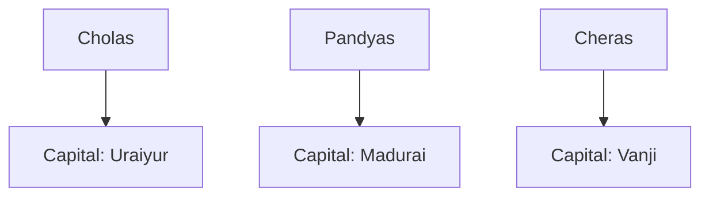

**Chapter Overview**
____________________

_In this chapter, we will delve into the intricacies of ancient Indian history, focusing on the Shakas, Parthians, Kushans, and the Sangam Age, as well as the rise of the Gupta dynasty._

**1. The Shakas and Parthians**

The Shakas, also known as Scythians, were a group of nomadic warriors who emerged in the 2nd century BC. They controlled a larger part of India than the Greeks did, with five branches of power operating in different regions. Rudradaman I, a notable Shaka ruler, is famous for restoring Sudarshana lake in Kathiawar during his reign from 130-150 AD. His inscription, the Junagarh inscription, remains an important historical text.

**1.1 The Arrival of the Parthians**

In the 1st century BC, the Parthians, originally from Iran, invaded India, marking the beginning of a long period of cultural exchange and conflict. The most famous Parthian king was Gondophernes, who ruled from 19-45 AD, and is said to have welcomed St. Thomas to India for the propagation of Christianity.

```latex
$$\frac{D}{r+1} + \frac{D}{r} = 2\pi r^2\frac{\rho}{\sigma}$$
```

This formula illustrates the concept of fluid dynamics, which was studied and applied during the Kushan era.

**2. The Kushans**

The Kushans originated from North Central Asia and established their empire in the 1st century AD. Kanishka, the most famous Kushan king, patronized numerous scholars, including the celebrated Ashvaghosha, who wrote the biography of Buddha, Buddhacharita.

**2.1 The Legacy of Kanishka**

Kanishka's reign marked the height of foreign trade, with the Silk Road and oceanic routes flourishing. The Gandhara School of Art and the Mathura School of Art also developed significantly during this period.

```markdown
| **King** | **Years in Power** | **Notable Achievements** |
| --- | --- | --- |
| Kanishka | 78-119 AD | Patronized scholars, established trade, art, and art schools |
| Rudradaman I | 130-150 AD | Restored Sudarshana lake, wrote the Junagarh inscription |
| Gondophernes | 19-45 AD | Welcomed St. Thomas to India, promoted Christianity |
```

This table synthesizes key information on the notable rulers during the Kushan era.

**3. The Sangam Age**

The Sangam Age, spanning 300 BC-600 AD, refers to the period of the three Tamil kingdoms: Cheras, Pandyas, and Cholas. The Sangam was a college or assembly of Tamil poets, likely held under royal patronage.



This graph illustrates the layout of the three Tamil kingdoms during the Sangam Age.

**4. The Gupta Period**

After the decline of the Mauryas, the Guptas rose to power. Chandragupta I, the first prominent ruler, strengthened the empire through alliances and military conquests. Samudragupta, the "Indian Napoleon," conquered a vast portion of India and extended patronage to Buddhism.

**5. The Exhaustive Testing Engine**

*   Q1: What was the primary significance of Rudradaman I's reign?

    > Correct Option: C)
    He restored Sudarshana lake and wrote the Junagarh inscription, highlighting his historical contributions.
*   Q2: Which of the following empires included a good portion of Central Asia, Iran, Afghanistan, Pakistan, and North India?

    > Correct Option: D)
    The Kushan empire, which emerged in the 1st century AD, had a vast territorial range.
*   Q3: What was the name of the famous Parthian king who welcomed St. Thomas to India?

    > Correct Option: A)
    Gondophernes, who ruled from 19-45 AD, is credited with promoting Christianity during his reign.
*   Q4: What was the name of the school of art that flourished during the Kushan era?

    > Correct Option: D)
    The Gandhara School of Art developed significantly during this period.
*   Q5: Which of the following kings was called the Indian Napoleon?

    > Correct Option: D)
    Samudragupta, the Gupta king, is often referred to as the Indian Napoleon due to his extensive military conquests.
*   Q6: What was the primary significance of Kanishka's reign?

    > Correct Option: C)
    Kanishka's reign is notable for its significant patronage to scholars, art, and art schools.
*   Q7: Who was the first prominent ruler of the Gupta dynasty?

    > Correct Option: C)
    Chandragupta I strengthened the empire through alliances and military conquests.
*   Q8: Which of the following empires controlled a larger part of India than the Greeks did?

    > Correct Option: C)
    The Shakas, also known as Scythians, controlled a larger portion of India than the Greeks did.
*   Q9: What was the name of the famous Chola king who conquered Sri Lanka?

    > Correct Option: A)
    Elara, a Chola king, conquered Sri Lanka and ruled it for 50 years.
*   Q10: Which of the following kings was a notable patron of Buddhism?

    > Correct Option: C)
    Kanishka, the Kushan king, extended patronage to Buddhism during his reign.