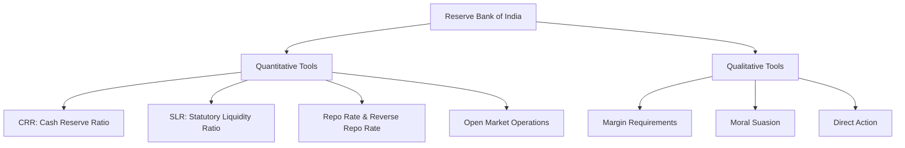
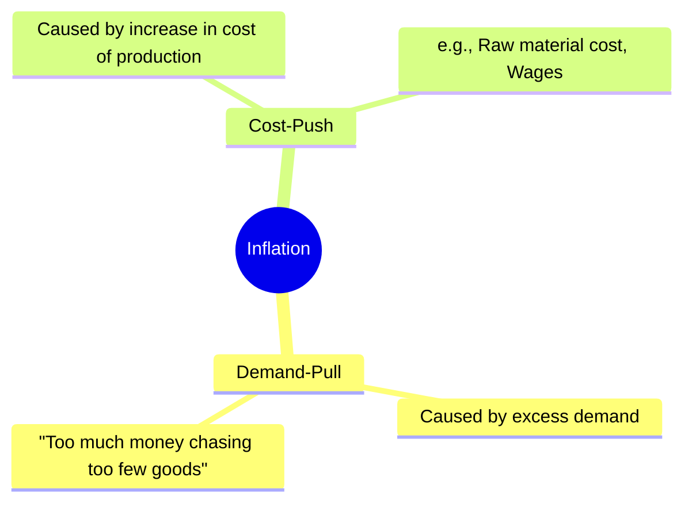
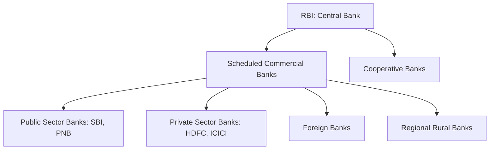
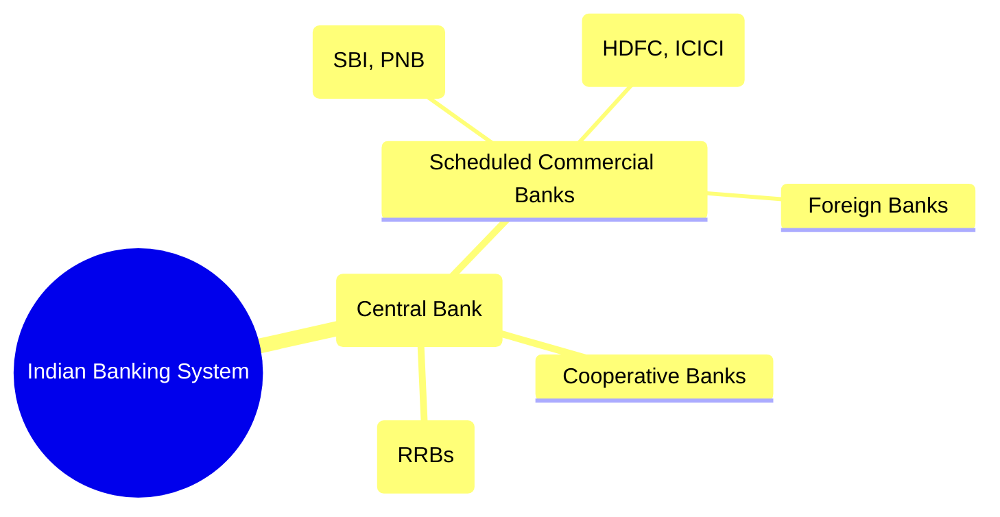

<div class="revision-card" style="background: rgba(20,20,30,0.4); border: 1px solid var(--border); border-radius: 8px; padding: 20px; margin-bottom: 24px; box-shadow: 0 4px 12px rgba(0,0,0,0.25);">
  <h3 style="color: var(--accent); margin-bottom: 16px; border-bottom: 1px solid var(--border); padding-bottom: 8px; display: flex; align-items: center; gap: 8px; font-weight: 600;">BANKING INFLATION PUBLIC FINANCE AND MCQS</h3>
  <h4 style="border-left: 3px solid var(--info); padding-left: 8px; margin-top: 24px; margin-bottom: 10px; color: var(--text-primary); font-weight: 600;">DEEP CONCEPTUAL EXPLANATION</h4>

GENERAL STUDIES Bharatiya Mahila Bank Foreign Banks • The main objective of the bank is to focus on the banking needs of women and to promote their economic empowerment.

• Foreign Banks are allowed to operate in India through branches and representative offices. A new Foreign Bank desirous of opening a branch in India is required to apply to Reserve Bank of India giving relevant information about its shareholders, financial position and dealings with Indian parties.

• The Union Government on 12th November, 2013 appointed Usha Anantha Subramanian as the first Chairperson and Managing Director of public sector Bharatiya Mahila Bank (BMB).

• CITI Bank, HSBC, Standard Chartered Banks are some examples of Foreign Banks in India.

• The BMB is based on the principle of : ‘Women empowerment is India’s empowerment’.

Regional Rural Banks The Union Cabinet, on 15th June, 2016, approved the merger of 5 associate banks of SBI and Bharatiya Mahila Bank with the State Bank of India. It is the first move to consolidate the country’s struggling public sector banks.

• In 1976, the Parliament enacted the Regional Rural Banks Act, 1976 to provide for the incorporation, regulation and winding up of Regional Rural Banks. The Act has been made effective from the 26th September, 1975.

• The equity of the RRBs is contributed by the Central Government, concerned State Government and the sponsor bank in the proportion of 50:15:35.

Industrial Development Bank of India (IDBI) IDBI bank is an Indian government-owned financial service company. It is headquartered in Mumbai, India. In the group-wise classification, since 31st December, 2007, IDBI Bank limited has been included in nationalised banks.

• The objective of the RRBs is to develop the rural economy by providing; for the purpose of development of agriculture, trade, commerce, industry and other productive activities in the rural areas, credit and other facilities, particularly to the small and marginal farmers, agricultural labourers, artisans and small entrepreneurs and for matters connected there with and incidental there to.

Private Sector Banks All those banks where greater parts of stake or equity are held by the private shareholders are called as private sector banks. In India, private sector banks are known with two names; old private sector banks and new private sector banks. Scheduled Co-operative Banks Co-operative banks have also played a limited, but important role in the banking system of the country. It can be further divided into two banks Old Private Sector Banks The banks which were not nationalised at the time of nationalisation of banks that took place during 1969 and 1980 are known as the old private sector banks. These were not nationalised, because of their small size and regional focus. New Private Sector Banks Urban Co-operative Banks • The UCBs are registered under the Co-operative Societies Acts of the respective State Governments. UCBs having a multi-state presence are registered under the Multi-state Co-operative Societies Act and regulated by the Central Government.

• The banks, which came in operation after 1991, with the introduction of economic reforms and financial sector reforms are known as new private sector banks. Banking Regulation Act was then amended in 1993, which permitted the entry of new private sector banks in the Indian banking sector.

• Besides, the Reserve Bank also has regulatory and supervisory authority for bank related operations under certain provisions of the Banking Regulation Act, 1949 (as applicable to Co-operative Societies).

• IDFC Bank started its operation in 2015.

State Co-operative Banks • Bandhan Bank has started its operations in India from 23rd August, 2015.

• State Co-operative Bank means the Principal co-operative society in a state, the primary object of which is the financing of other co-operative societies in the state.

Top Five Private Sector Banks Top five private sector banks are as follows Payment Banks • ICICI Bank, 1994 Vadodara • HDFC Bank, 1994 Mumbai • Axis Bank, 1994 Ahmedabad • Kotak Mahindra Bank, 1985 Mumbai RBI has issued license for establishment of 11 payment banks. These banks are allowed to accept restricted deposits but cannot issue loans and credit cards. Such banks operate both current and saving accounts.

• Yes Bank, 2004 Mumbai Financial Institutions Major Stock Exchanges in India The major stock exchanges in India are as follows Financial Institutions are an important part of the Indian Financial System as they provide medium to long-term finance to different sectors of the economy. Some of the important financial institutions are as follows • National Housing Bank set-up on 9th July, 1988, to provide a sound, healthy, viable and cost effective housing finance system to all segments of the population.

Bombay Stock Exchange (BSE) Bombay Stock Exchange (BSE) is one of the oldest stock exchanges in the world (since, 1875) and the oldest of Asia. The share sensex of BSE includes 30 listed companies. It has indices, viz (i) BSE 200, (ii) BSE 100, (iii) BSE 500, (iv) SENSEX, (v) MIDCAP and (vi) SMLCAP.

• National Bank of Agriculture and Rural Development (NABARD) for facilitating credit flow for promotion and development of agriculture, small scale industries, cottage and village industries, handicrafts and other rural crafts.

• Industrial Finance Corporation of India Limited (IFCI) to provide financial assistance to medium and large industries.

National Stock Exchange (NSE) It was established in November, 1992 on the recommendation of pherwani committee. However, it became a full-fledged stock exchange in 1993 and commenced operations in 1994. In October 1995, it became the biggest stock exchange in India. NSE share sensex includes 50 listed companies.

• Small Industries Development Bank of India (SIDBI) for promotion, financing and development of small scale Approved Stock Exchanges in India • Mudra Bank provide loans at low rates to small entrepreneurs.

Financial Market Financial market is an important part of financial sector. It is the market, where financial transactions take place. On the basis of short-term and long-term transactions, such markets are classified as follows Money Market • The cluster of financial institutions that deal in short-term securities and loans, gold and foreign exchange are termed as money market. Indian money market is broadly divided into two categories :

• Vadodara Stock Exchange, Vadodara • Coimbatore Stock Exchange, Coimbatore • Bombay Stock Exchange, Mumbai • Over the Counter Exchange of India, Mumbai • National Stock Exchange, Mumbai • Ahmedabad Stock Exchange, Ahmedabad • Bangalore Stock Exchange, Bengaluru • Bhubaneshwar Stock Exchange, Bhubaneshwar • Calcutta Stock Exchange, Kolkata • Cochin Stock Exchange, Cochin • Delhi Stock Exchange, Delhi • Guwahati Stock Exchange, Guwahati • Hyderabad Stock Exchange, Hyderabad • Jaipur Stock Exchange, Jaipur • Mangalore Stock Exchange, Mangalore • Ludhiana Stock Exchange, Ludhiana • Chennai Stock Exchange, Chennai • Madhya Pradesh Stock Exchange, Indore • Pune Stock Exchange, Pune • Saurastra Kutch Stock Exchange, Rajkot i. Organised money market which includes call money market, collateral loan market, treasury bill market, commercial bill market, banker’s acceptance market, certificates of deposits market, commercial paper market.

ii. Unorganised money market includes unregulated non-bank financial intermediaries such as money lenders, chit funds, nidhis etc. Commodity Exchange There are six commodity exchanges in India Capital Market It is one of the most important segments of the Indian financial system. It is the market available to the companies for meeting their requirements of the long-term funds. These are markets for buying and selling equity and debt instruments. It includes stock market. i. Multi Commodity Exchange of India Limited (MCX), Mumbai ii. National Commodity and Derivatives Exchange Limited (NCDEX), Mumbai iii. Indian National Multi-Commodity Exchange (NMCE), Mumbai iv. Commodity Exchange Limited (ICEX), Mumbai v. ASE, Derivatives and Comodity Exchange Limited (ASE, DCEL), Mumbai vi. Universal Commodity Exchange (UCE), Hyderabad Stock Market A stock market, equity market or share market is the aggregation of buyers and sellers of stocks (also called shares). These may include securities listed on a stock exchange as well as those only traded privately.

GENERAL STUDIES Some of the direct taxes are as follows Some Prominent Stock Indices of Famous Markets Reforms in Insurance Sector Index Country Dollex, SENSEX. S&P CNX. NIFTY-FIFTY BANKEX India Dow Jones United States (New York) Nikkei Japan MID-DAX Germany HANG SENG Hong Kong STRAITS TIMES. SIHEX Singapore KOSPI Korea SET Thailand The reforms in the insurance sector started with the enactment of Insurance Regulatory and Development Authority Act, 1999. The Act paved the way for the entry of private insurance companies into the insurance market and also Constitution of Insurance Regulatory and Development Authority. In 1993, Malhotra Committee was set-up to recommend reforms in insurance sector.

TAIEN Taiwan SHANGHAI COM China NASDAQ USA Insurance Regulatory and Development Authority of India (IRDAI) INSURANCE • IRDAI was constituted on 19th April, 2000 to protect the interest of the holders of insurance policies and to regulate, promote and ensure orderly growth of the insurance industry. The authority consists of a Chairperson, three whole-time members and four part-time members. Insurance has been an important part of the Indian financial system. Until recently, insurance services were provided by the public sector i.e. life insurance by the Life Insurance Corporation of India and general insurance by the General Insurance Corporation and its four subsidiaries. i. Income Tax It is the tax levied directly on the income of the people by the Central Government.

ii. Corporate Tax It is levied on the profit of the companies or corporations. It is the largest source of revenue of the Central Government, covering about 18% of the total revenue. iii. Wealth Tax This tax is levied on the net wealth of the individuals, Hindu undivided family and joint stock companies. It is a minor source of revenue of the government, primarily imposed to reduce concentration of wealth in the society. iv. Gift Tax This tax is imposed by the Central Government on all donations and gifts over and above the prescribed limits to the family members. However, donation given by the charitable institutions and companies is not covered under gift tax. This tax is basically imposed to check the evasion of estate duty and wealth tax.

v. Interest Tax This tax is imposed on the interest income of the commercial banks on their gross loans and advances. Presently, it is not in force in India. (i) General Insurance Corporation (GIC) Established on 1st January, 1973, It has four subsidiary companies, which are as follows • It provides for regulating the insurance sector, the authority has been issuing regulations covering almost the entire segment of insurance industry, namely; regulation on insurance agents, solvency margin, re-insurance, registration of insurers, obligation of insurers to rural and social sector, accounting procedure etc. Indirect Tax Indirect taxes are those taxes which have their primary burden or impact on one person, but that person succeeds in shifting his burden on to others.

TAX STRUCTURE Direct Tax Indirect Tax Personal Income Tax Excise Duty Corporation Tax Custom Duty Wealth Tax Sales Tax Gift Tax Service Tax i. National Insurance Company Limited, Kolkata. ii. The New India Assurance Company Limited, Mumbai. iii. The Oriental and Insurance Company Limited, New Delhi.

iv. United India Fire and General Insurance Company Limited, Chennai. Land Revenue Value Added Tax Profession Tax Passenger Tax Tax is a compulsory payment by the citizens to the government to meet the public expenditure. It is legally imposed by the government on the taxpayer and in no case taxpayer can deny to pay taxes to the government. Tax can be direct or indirect, which are as follows (ii) Life Insurance Corporation (LIC) Stamp Duty and Registration Charges Entertainment Tax Direct Tax • Established on 1st September, 1956.

Securities Transaction Tax Electricity Duty Banking Cash Transaction Tax Motor Vehicles Tax A direct tax is that tax, which is borne by the person on whom it is levied. A direct tax cannot be shifted to other person.

• Head office Mumbai, Zonal offices 7 (Mumbai, Kolkata, Delhi, Chennai, Kanpur, Hyderabad and Bhopal).

which runs from 1st April to 31st March.

• In the Constitution of India the term Budget is nowhere used. It is rather mentioned as Annual Financial statement under Article 112 comprising the revenue capital budget and also the estimates for the next fiscal year called Budget Estimates.

Goods and Services Tax (GST) Goods and Services Tax is a comprehensive indirect tax on manufacture, sale and consumption of goods and services throughout India, to replace taxes levied by the Central and State Governments. Goods and services tax would be levied and collected at each stage of sale or purchase of goods or services based on the input tax credit method. C. Apart from taxes levied and collected by the state the Constitution has provided for the revenues for certain taxes on the Union List to be allotted, partly or wholly to the states. Finance Commission Finance Commission is constituted to define financial relations between the Centre and the States. Under the provision of Article 280 of the Constitution, the President appoints a Finance Commission for the specific purpose of devolution of non-plan revenue resources. KC Niyogi was the chairman of first finance commission.

The 14th Finance Commission was headed by YV Reddy.

• Central Taxes Replaced by GST Central Excise Duty, Additional Duties of Excise and Customs, Special Additional Duty of customs (SAD), Service Tax and Cesses and Surcharges on Supply of Goods and Services.

FRBM Act, 2003 The Fiscal Responsibility and Budget Management Act (FRBM), 2003 is an act of the Parliament of India to institutionalise financial discipline, reduce India’s fiscal deficit, improve macro-economic management and the overall management of the public funds by moving towards a balanced budget. Recommendations of 14th Finance Commission • Devolution of Taxes to States The share of taxes of the centre to states is recommended to be increased from 32% to 42%.

• State Taxes Subsumed in the GST VAT, Central Sales Tax, Purchase Tax, Luxury Tax, Entry Tax, Entertainment Tax, Taxes on Advertisements, Lotteries, Betting, Gambling and State Cesses and Surcharges.

• Fiscal Deficit Fiscal deficit of states should be aimed at 3% of the Gross State Domestic Product (GSDP) during the period 2015 to 2020.

Financial Relations Between Centre and States Objectives The main objectives of the act are as follows 1. To introduce transparent fiscal management systems in the country.

2. To introduce a more equitable and manageable distribution of the country’s debts over the years.

3. To aim for fiscal stability for India in the long run.

INFLATION • Compensation to States for GST An autonomous and independent Goods and Services Tax (GST) compensation fund is to be set-up in order to facilitate compensation to states. Revenue compensation to states for the GST should be for 5 years.

• Amendments to FRBM Act The FRBM Act, 2003 should be amended, to remove the definition of effective revenue.

• Article 264 and Article 293 explain the financial relations between the Union and State Governments.

Although states have been assigned certain taxes, which are levied and collected by them, they also have a share in the revenue of certain union taxes and there are certain other taxes, which are levied and collected by the Central Government, but whole proceeds are transferred to the states. It is that state in which the prices of goods and services rise on the one hand and value of money falls on the other. When money circulation exceeds the production of goods and services, the state of inflation takes place in the UNION BUDGET Types of Inflation Four types of inflation are as follows • The budget is an extension account of the governments finances, in which revenues from all sources and expenses of all activities undertaken are aggregated.

• The Constitution provides residuary powers to the centre. It makes a clear division of fiscal powers between the Central and the State Governments.

A. List I of 7th Schedule of the Constitution enlists the Union Taxes. B. List II of 7th Schedule enlists the taxes, which are within the jurisdiction of the states • The Finance Minister presents the Union Budget every year in the Parliament that contains the Government of India’s revenue and expenditure for one fiscal year, i. Demand Pull Inflation Inflation created and sustained by excess of aggregate demand for goods and services over the aggregate supply. In other words, demand pull inflation takes place when increase in production lags behind the increase in money supply. GENERAL STUDIES Balance of Trade (BoT) The difference between a nation’s imports of goods and services and its exports of them is known as Balance of Trade.

of CPI after 2015 revision has been changed to 2012. CSO compile CPI for urban and rural population separately. It also publish combined CPI (Urban+Rural). DEFLATION • It is the most important element of the Balance of Payments.

• There are three possibilities in the Balance of Trade (BoT), which are as follow – Balanced BoT i.e. Exports = Imports – Adverse BoT i.e. Exports < Imports – Favourable BoT i.e. Exports > Imports ii. Cost Push Inflation Inflation which is created and sustained by increase in cost of production which is independent of the state of demand (e.g. trade unions can bargain for higher wages and hence, contribute to inflation).

iii. Stagflation In this type, there is fall in the output and employment levels. Due to various pressures, the entrepreneurs have to raise the price to maintain their margin of profit. But as they only partially succeed in raising the prices, they are faced with a situation of declining output and investment. Thus, on one side there is a rise in the general price level and on the other side, there is a fall in the output and employment. Balance of Payment (BoP) iv. Hyper Inflation It is very rapid growth in the rate of inflation in which money loses its value to the point where alternative mediums of exchanges-such as barter or foreign currency are commonly used. Also called Galloping Inflation.

Measurement of Inflation It is that state in which the value of money rises and the price of goods and services falls. The state of deflation may appear in the economy due to the following reasons • When the government withdraws money from circulation.

• When government imposes heavy direct taxes or takes heavy loans from the public (voluntary or compulsory or both).

• When the Central Bank sells the securities in open market (which reduces the quantity of money in circulation).

• When the Central Bank increases the bank rate (which curtails the quantity of credit in the economy).

Measures to Check Deflation • Inflation is measured by general price index. General price index measures the changes in average prices of goods and services. A base year is selected and its index is assumed as 100 and on this basis price index for the current year is calculated.

• If the index of the current year is below 100, it indicates the state of deflation and on the contrary, if index of the current year is above 100 it indicates the state of inflation.

• To increase money supply.

• To promote credit creation by the banks.

• Curtailment in taxes so as to increase the purchasing power of people.

• To increase the public expenditure and to increase the employment • To increase the money supply in circulation by repayment of old public debts.

WHOLESALE PRICE INDEX (WPI) • To provide economic subsidy by the government to the industrial Foreign Trade G It measures the change in wholesale prices on weekly basis. On the basis of weekly indices average annual WPI is worked out. G Average annual wholesale prices of the base year (assumed as 100).

Foreign Trade is a characteristic feature of all modern economies. India, since ages, has experienced a thriving international trade. However, with the rapid economic progress in recent years, these has been a shift from the traditional areas and destinations of export/import.

The Balance of Payment (BoP) of country is the record of all economic transactions between the residents of a country and the rest of the world in particular period (over a quarter of a year or more commonly over a year). These transactions are made by individuals, firms and government bodies. It is divided into the following two accounts : Current Account Current account of Balance of Payment consist of all transactions relating to goods, services and income. It is functionally classified into merchandise or visible and invisibles. Current account deficit is the situation where payments on the current account, out of the country are more than the payments into the country. In current account surplus there is a net inward payment into the country on the current account.

Capital Account Capital account is that acount which records all such transactions between residents of a country and rest of the world, which causes a change in the asset or liability status of the residents of a country or its government. Investments (FDI and FII) and Borrowings, External Commercial Borrowings (ECB) are part of the capital account. Consumer Price Index (CPI) It measures changes in price level of goods and services purchased by households. The base year for calculation Foreign Direct Investment (FDI) Some key features of the new foreign trade policy are as follows – India to be made a significant participant in world trade by 2020.

• It is an investment in a foreign country through the acquisition of a local company or the establishment of an operation on a new greenfield site.

– Merchandise Exports from India Scheme (MEIS) to promote specific services for specific markets foreign trade policy.

• Brownfield investment is when a company or government entity purchase or leases existing production facilities to launch a new production activity.

– FTP would reduce export obligation by 25% and given boost to domestic manufacturing. – Industrial products to be supported in major markets rates ranging from 2% to 3%.

• Since, 1st April, 2010 in India, Foreign Direct Investment (FDI) has been regulated by the consolidated FDI policy issued by the Department of Industrial Policy and Promotion (DIPP).

– Branding companies planned to promote exports in sectors where India has traditional strength.

• This consolidation is expected to clarify India’s FDI policy and provide for a better understanding and predictability of the foreign investment rules among foreign investors and sectoral regulators.

INTERNATIONAL ORGANISATIONS Foreign Institutional Investment (FII) An International Organisation has been defined as a forum of co-operation of Sovereign States based on multilateral international agreement and comprising of a relatively stable range of participants.

• A foreign institutional investor is one which is registered in a country outside of the one in which it is investing. In India, it is used to refer to companies which invest in the country’s financial markets.

• In 2013, India accepted the internationally laid down definition of FII to remove the ambiguity between FII and FDI. Now, when an investor has a stake of less than 10% in a company, it will be treated as FII and where and investor has a stake of more than 10%, it will be treated as FDI.

• FIIs may invest in securities in both the primary and secondary market in shares, debentures and warrants of listed or unlisted companies.

Bretton Woods Conference The Bretton Woods Conference, officially known as the United Nations Monetary and Financial Conference, was a gathering of delegates from 44 nations that met from 1st to 22nd July, 1944, in Bretton Woods, New Hampshire, to agree upon a series of new rules for the post World War II International Monetary System. The two major accomplishments of the conference were the creation of the International Monetary Fund (IMF) and the International Bank for Reconstruction and Development (IBRD) also known as World Bank. Participatory Notes These refers to instruments issued by registered foreign institutional investors to overseas investors who are not registered with SEBI but wish to invest in Indian stock markets.

Foreign Trade Policy (FTP), 2015-20 World Bank Since, its inception in 1944, the World Bank has expanded from a single institution to a closely associated group of five development institutions. On 1st July, 2012, Jim Yong Kim became the 12th President of the World Bank Group. He has been appointed as a head of World Bank in 2016 for second-term. The world bank is a vital source of financial and technical assistance to developing countries around the world. It aims to end extreme poverty and at the same time promote shared prosperity.

• The new five years Foreign Trade Policy, 2015-20 provides a framework for increasing exports of goods and services as well as generation of employment and increasing value addition in the country in keeping with the ‘Make in India’ vision. The focus of the new policy is to support both the manufacturing and services sectors, with special emphasis on improving case of doing business.

International Monetary Fund (IMF) The IMF came into formal existence in December, 1945, when its first 29 member countries signed its Article of Agreement. It began operations on 1st March, 1947. At present, 189 nations are Members of IMF.

• The government is pitching India as a friendly destination for manufacturing and exporting goods.

GENERAL STUDIES Organisation of the Petroleum Exporting Countries (OPECs) India is a founder Member of the IMF. Finance Minister of India is the ex-officio Governor on the Board of Governors of the IMF, which is the highest decision making body of the IMF. RBI Governor is the alternate Governor at the IMF. The IMF’s primary purpose is to ensure the stability of the International Monetary System—the system of exchange rates and international payments that enables countries (and their citizens) to transact with one another. International Labour Organisation (ILO) The International Labour Organisation emerged with the League of Nations from the Treaty of Versailles in 1919.

It was founded to give expression to the growing concern for social reform after World War I and the conviction that any reform had to be conducted at an international level. The ILO has generated such hallmarks of industrial society as the eight-hour working day, maternity protection, child labour laws and a range of policies, which promote workplace safety and peaceful industrial relations. Established on 11th April, 1919 Associated with UNO 14th December, The headquarter of OPECs is located in Vienna and it has 12 members and it was established in 1960. OPEC nations account for two-third of the world’s oil reserves and 33.3% of the world’s oil production.

The main objective is determination of the best means for safeguarding the organisation’s interests, individually and collectively. It pursues ways and means of ensuring the stabilisation of prices in international oil markets with a view to eliminate harmful and unnecessary fluctuations. BRICS Headquarters Geneva Membership Director-General Guy Ryder (2012-17) Noble Peace Prize In economics, BRICS (Brazil, Russia, India, China, South Africa) is an acronym that refer to countries Brazil, Russia, India, China and South Africa which are all deemed to be at similar stage of newly advanced economic development. World Trade Organisation (WTO) The WTO commenced under the Marrakesh Agreement in 1995 and replaced GATT. It deals with the global rules of trade between nations, helps producers of goods and services, exporters and importers conduct their business. The WTO’s agreement on Trade Related Aspects of Intellectual Property Right (TRIPS), was negotiated in 1986-94 Uruguay round. Rules related to trade, tariff, patent and intellecutual property right are framed by the WTO.

The members of the World Trade Organisation (WTO) agree to accord MFN status to each other. New Development Bank (NDB) TRIPS (TRADE RELATED ASPECTS OF INTELLECTUAL PROPERTY RIGHTS) G The 1995 TRIPS Agreement provided for both product patents and process patents. Product patents are meant to protect the individual product, while process patent protect the process used to create the product.

Asian Development Bank (ADB) The Asian Development Bank was established following the recommendations of the United Nations Economic and Social Commission for Asia and the Pacific. It was formed to foster economic growth and co-operation in the region of Asia and the Pacific and to contribute to the acceleration of economic development of the developing countries of the region. The Asian Development Bank (ADB), an International Partnership of 67 member countries, was established in 1966 with its headquarters at Manila, Philippines. India is a founder member. The New Development Bank, formerly referred to as the BRICS Development Bank, is a multilateral development bank established by the BRICS states.

According to the agreement on the NDB, “the bank shall support public or private projects through loans, guarantees, equity participation and other financial instruments.” The bank is headquarter in Shanghai, China. KV Kamath, from India, is the first elected President of the NDB. G The agreement gave developing countries 10 years to enact laws to protect intellectual property. Thus, India enacted its Patents (Amendment) Act in 2005 to confirm to the agreement.

G Developed countries on the other hand had to enact laws in 1995 itself. Under the agreement, protection to patents had to be provided for 20 years. TRIPS agreement is administered by WTO. SAARC South Asian Association for Regional Cooperation (SAARC) is an organisation of South Asian nations, founded in December, 1985 and dedicated to economic, technological, social and cultural development emphasising collective self-reliance. Its members are Bangladesh, Bhutan, India, Maldives, Nepal, Pakistan, Sri Lanka and Afghanistan. Asia-Pacific Economic Cooperation (APEC) Asia-Pacific Economic Cooperation or APEC, is the premier forum for facilitating economic growth, cooperation, trade and investment in the Asia-Pacific region. APEC is the only Inter-governmental grouping in the world operating on the basis of non-binding commitments, open dialogue and equal respect for the views of all participants.

The SAARC Secretariat is based in Kathmandu, Nepal. It co-ordinates and monitors implementation of activities, prepares for services meetings and serves as a channel of communication between the association and its member states as well as other regional organisations. Shanghai Cooperation Organisation (SCO) The headquarter of SCO is located in Beijing, China and it has 6 members. It is an inter-governmental mutual-security organisation, which was founded in 2001, in Shanghai by the leaders of China, Kazakhstan, Kyrgyzstan, Russia, Tajikistan and Uzbekistan. Except for Uzbekistan, the other countries had been members of the Shanghai Five, founded in 1996, after the inclusion of Uzbekistan in 2001, the members renamed the organisation.

India has signed memorandum on accession in 2016. It is expected to become full member in 2017. SAFTA The South Asian Free Trade Area or South Asian Preferential Trading Arrangement is an agreement reached on 6th January, 2004 at the 12th SAARC Summit in Islamabad, Pakistan. It created a free trade area of 1.6 billion people in Bangladesh, Bhutan, India, Maldives, Nepal, Pakistan and Sri Lanka. BIMSTEC The headquarter of BIMSTEC (Bay of Bengal Initiative for Multi-Sectoral Technical and Economic Cooperation) is located in Dhaka, Bangladesh and it has 7 members Bangladesh, India, Myanmar, Bhutan, Sri Lanka, Thailand and Nepal and it was established in 1997. The main objective is to promote multi-sectoral cooperation for economic and social progress of the Bay of Bengal region. The member countries agreed to create the BIMSTEC free trade area framework agreement in order to promote international trade and investment in the region.

ASEAN Association of South-East Asian Nations (ASEAN) was established on 8th August, 1967, in Bangkok, Thailand, with the signing of the ASEAN Declaration (Bangkok Declaration) by the Founding Fathers of ASEAN, namely; Indonesia, Malaysia, Philippines, Singapore and Thailand. Later on Brunei Darussalam, Vietnam, Lao PDR and Myanmar and Cambodia joined the organisation making it 10 members group. The main aim of the organisation is to accelerate economic growth, social progress and cultural development in the region. European Union The European Union (EU) is an economic and political union of 28 member states that are located primarily in Europe. The European Union received the 2012 Nobel Peace Prize for having ‘‘contributed to the advancement of peace and reconciliation, democracy, and human rights in Europe.’’ On 1st July, 2013, Croatia became the 28th EU member. In 2016, UK decided to exit from EU.

G-8 The member of G-8 are Canada, France, Germany, Italy, Japan UK, USA and the Russia. On 24th March, 2014, the original G-7 nations voted to effectively suspend Russia in response to latter’s annexation of Crimea. However, they decided that Russia might restore its membership in G-8 depending on its action. The main objective of G-8 aims at discussing and evolving strategies to deal with the major economic and political international issues. There is no formal institutional structure or permanent secretariat. Heads of state of member nations and EU representatives hold meetings annually. India, Brazil, South Africa (IBSA) The members of IBSA are India, Brazil, South Africa and it was established in 2003. The main objective of IBSA is to promote South-South Cooperation. It aims at increasing the trade opportunities among the three countries and facilitating the trilateral exchange of information, technologies and skills to complement each other strength. Indian Ocean Rim Association for Regional Cooperation (IOR-ARC) The headquarter of IOR-ARC is located in Mauritius and it has 20 members. The main objective is to promote balanced growth and sustainable development of the region and member states, to focus on those areas of economic cooperation, which provide maximum opportunities for development, shared interests and mutual benefits.

Multilateral Summits G-20 It was established on 26th September, 1999, when the Finance Ministers of the G-7 announced the formation of the G-20 in Washington DC to establish an informal mechanism for dialogue among systematically important countries, including the industrialised countries and the big emerging markets within the framework of the Bretton Woods Institutional System. India is member of G-20. The main objective of G-20 is promoting discussion on and study and review of policy issues among industrialised countries and big emerging markets with a view to enhancing international financial stability. The G-20 does not have a permanent secretariat. The chair rotates between the members selected from different five regional grouping of countries each year.

GENERAL STUDIES PRACTICE EXERCISE 2. Promotion of investment from foreign sources.

3. Promotion of export of services only.

Which of the objectives(s) given above is/are of this act? (a) Only 2 (b) 1 and 2 (c) 2 and 3 (d) All of these 5. Which of the following was launched by the government on the advice of the World Bank? 1. New Agricultural Strategy 2. Food Corporation of India 3. Public Distribution System 4. Agriculture Prices Commission Select the correct answer using the codes given below. (a) 1 and 2 (b) 2, 3 and 4 (c) 1 and 4 (d) All of these 1. Which are the incorrect functions of the RBI, out of the given statements? 1. Issuing and disbursing agency for all currency notes and coins in India.

2. Stabilising exchange rate of rupee.

3. Forwarding short-term and long-term loans to the Government of India.

Select the correct answer using the codes give below. (a) Only 1 (b) 2 and 3 (c) Only 3 (d) 1 and 3 9. Consider the following statement(s) 1. In Third Five Year Plan growth rate of agriculture products was negative.

2. In Third Five Year Plan Indian economy took the first step to devaluate the Indian rupee after independence.

Which of the statement(s) given above is/are correct? (a) Only 1 (b) Only 2 (c) Both 1 and 2 (d) Neither 1 nor 2 10. What is an ECO-MARK? (a) A scheme for labelling pollution-free industrial unit (b) A scheme for labelling environment friendly consumer product (c) A cost effective production technique (d) An international certification of Eco-friendly building 2. Which of the following does not come under ‘Plan expenditure’? 1. Supports to the state plans and ‘grants-in-aid’ given to them by the Government of India.

2. Maintenance of assets created under plan expenditure.

3. Recapitalisation funds for public sector banks.

Select the correct answer using the codes given below. (a) 1 and 2 (b) 2 and 3 (c) 1 and 3 (d) All of these 6. Aadhar has huge potential for improving operations and delivery of service. Its potential application in various significant public services delivery and social sector programme is immense. In this context, consider the following statements.

1. The UID database can be used for the authentication of beneficiaries under the Public Distribution System.

2. It will help in enhancing the efficiency of social audit of programmes.

3. It will enable greater commitment towards government financing of public health and primary healthcare.

Which of the statements given above are correct? (a) 1 and 2 (b) 1 and 3 (c) 2 and 3 (d) All of these 3. Consider the following statements 1. Government of India has not set-up any new PSU in last 3 years.

2. Government now concentrates on social sector and lets the private sector to take care of industrial sector.

Which of the statement(s) given above is/are correct? (a) Only 1 (b) Only 2 (c) Both 1 and 2 (d) Neither 1 nor 2 7. Which of the following statements, related to World Bank Organisations, IBRD and IDA? 1. India use IDA funds on social sector.

2. India use IBRD funds on infrastructure development.

3. IBRD loans are cheaper than IDA loans.

Select the correct answer using the codes given below. (a) Only 1 (b) 1 and 3 (c) 1 and 2 (d) 2 and 3 11. The Mahatma Gandhi National Rural Employment Guarantee Act (MGNREGA) is an Indian job guarantee scheme enacted by legislation on 25th August, 2005. Which among the following statements is not correct regarding MGNREGA? 1. The scheme provides a legal guarantee for at least one hundred days of employment in every financial year to adult member of any rural household willing to do work.

2. This act was introduced with an aim of improving the purchasing power of the rural people.

3. The law was initially called the National Rural Employment Guarantee Act (NREGA) but was renamed on 2nd October, 2009.

Select the correct answer using the codes given below. (a) Only 1 (b) Only 2 (c) All of these (d) None of these 8. The SEZ Act 2005, has certain objectives. In this context, consider the following.

1. Development of infrastructure facilities.

4. Consider the following statements regarding ‘plan’ and ‘non-plan expenditure’.

1. Plan expenditure goes towards fulfilling the Five Year Plan.

2. Assets created under plan expenditure get their maintenance funds also under plan expenditure.

Which of the statement(s) given above is/are correct? (a) Only 1 (b) Only 2 (c) Both 1 and 2 (d) Neither 1 nor 2 (c) tax on final consumption collected at the consumption rate (d) a special tax levied by the states on products from other states 16. The largest of Gross Domestic Product (GDP) in India comes from (a) agriculture and allied sectors (b) manufacturing construction, electricity and gas (c) service sector (d) defence and public administration 12. With reference to BRIC countries, consider the following statement(s) 1. At present China’s GDP is more than the combined GDP of all the three other countries.

2. China’s population is more than the combined population of any two other countries.

Which of the statement(s) given above is/are correct? (a) Only 1 (b) Only 2 (c) Both 1 and 2 (d) Neither 1 nor 2 21. Which one of the following is correct about Twelfth Five Year Plan? (a) Twelfth Five Year Plan of Indian (b) Twelfth Five Year Plan aims to grow GDP at the rate of 10% (c) Twelfth Five Year Plan aims to sustain inclusive growth, which started in Eleventh Plan (d) Both ‘a’ and ‘b’ 17. Consider the following statement(s) about the Navratna Status Industries.

1. Navratna was originally assigned to nine Public Sector Enterprises in 1997.

2. The number of PSEs having Navratna status is now 17 industries.

Which of the statement(s) given above is/are correct? (a) Only 1 (b) Only 2 (c) Both 1 and 2 (d) Neither 1 nor 2 13. Which one of the following statements is not correct? (a) Commercial Bank reserves held by RBI are an asset of Commercial Banks (b) Commercial Banks decrease the supply of money, when they purchase government bonds from householders or businesses (c) Actual reserves don’t necessarily exceed required reserves (d) The supply of money increases, when the RBI buys government securities from households or businesses 22. Consider the following statement(s) 1. NABARD is an apex institution handling matters concerning policy, planning and operating the field of credit for agriculture and other developmental activities in rural India.

2. NABARD operates through its headquarter at Mumbai.

Which of the statement(s) given above is/are correct? (a) Only 1 (b) Only 2 (c) Both 1 and 2 (d) Neither 1 nor 2 23. Which one of the following is the objective of the Twelfth Five Year Plan of India? (a) Faster and inclusive growth (b) Faster, quick and reliable inclusive growth (c) Faster, reliable and more inclusive growth (d) Faster, sustainable and more inclusive growth 18. Consider the following statement(s).

1. In the last 5 years, the revenue from the direct taxes constitute more than the half of revenue receipt in India.

2. The corporate tax constitute more than 50% of direct tax revenue source of the Central Government.

Which of the statement(s) given above is/are correct? (a) Only 1 (b) Only 2 (c) Both 1 and 2 (d) Neither 1 nor 2 14. Why is Reserve Bank of India (RBI) also known as Bankers’ Bank and lender of last resort? (a) Reserve Bank of India maintains the security of the Commercial Banks and appointment of its officials. (b) Commercial Banks need to keep some amount in the custody of the RBI and can borrow from the RBI at the times of need and urgency (c) RBI acts as an agent of the government to regulate the day-to-day functions of the Commercial Banks and maintains the liquidity of the banks (d) Both ‘a’ and ‘c’ 24. In India, which of the following have the highest share in the disbursement of credit to agriculture and allied activities? (a) Commercial Bank (b) Cooperative Bank (c) Regional Rural Bank (d) Micro Finance Institutions 25. Match the following List I (Five Year Plans) List II (Objectives) 19. Consider the following Public Sector Enterprises (PSEs) 1. Steel Authority of India Limited 2. Indian Oil Corporation Limited 3. Oil and Natural Gas Corporation 4. Hindustan Aeronautics Limited Which of the PSEs given above are Maharatna industries in India? (a) 2 and 4 (b) 1, 2 and 3 (c) 2 and 3 (d) All of these A. First Plan 1. Growth with social justice B. Third Plan 2. Sustainable inclusive growth C. Fifth Plan 3. Self-reliant and D. Twelfth Plan 4. Agriculture, irrigation and power projects 20. Value added tax is (a) an advolerum tax on domestic final consumption collected at all stages between production and point of final sale (b) an advolerum tax on final consumption collected at the manufacturing level 15. With reference to the Indian economy, consider the following statements 1. Agriculture, forestry and fishing.

2. Manufacturing.

3. Trade, hotels, transport and communication.

4. Financing, Insurance, real estate and business services.

The decreasing order of the contribution of these sectors to the Gross Domestic Product (GDP) at factor cost at constant prices (2013-14) is (a) 3, 1, 2, 4 (b) 3, 4, 1, 2 (c) 4, 3, 1, 2 (d) 1, 3, 2, 4 Codes A B C D A B C D (a) 2 4 (b) 2 3 4 1 (c) 4 3 (d) 1 3 2 4 GENERAL STUDIES 3. Companies exclusively financed by foreign companies.

4. Portfolio investment.

Select the correct answer using the codes given below. (a) 2 and 4 (b) 1 and 3 (c) 1, 2 and 3 (d) All of these 31. Foreign Direct Investment (FDI) is investment directly into production in a country by a company located in another country, then which one of the following modes is correct about the FDI? (a) Buying a company in the target country (b) Expanding operations of an existing business in that country (c) Investing in the shares and stocks of a company in the target country (d) Both ‘a’ and ‘b’ 26. Consider the following statement(s) 1. General Agreement on Trade in Services is a treaty of the World Trade Organisation (WTO) that entered into force in January, 1995.

2. All members of the WTO are signatories to the General Agreement on Trade in Services.

Which of the statement(s) given above is/are correct? (a) Only 1 (b) Only 2 (c) Both 1 and 2 (d) Neither 1 nor 2 36. The sum total of incomes received for the services of labour, land or capital in a country is called (a) Gross Domestic Product (b) National Income (c) Gross Domestic Income (d) Gross National Income 27. The banks are required to maintain a certain ratio between their cash in the hand and total assets. This is called (a) Statutory Bank Ratio (SBR) (b) Statutory Liquid Ratio (SLR) (c) Central Bank Reserve (CBR) (d) Central Liquid Reserve (CLR) 37. Mixed economy means an economy where (a) both agriculture and industry are equally promoted by the state (b) there is co-existence of public sector along with private sector (c) there is importance of small-scale industries along with heavy industries (d) economy is controlled by military as well as civilian rules 32. Consider the following statement(s) 1. Bay of Bengal Initiative for Multi-Sectoral Technical and Economic Cooperation (BIMSTEC) is visualised as a bridging link between ASEAN and SAARC.

2. It was formerly known as the Bangkok Agreement.

Which of the statement(s) given above is/are correct? (a) Only 1 (b) Only 2 (c) Both 1 and 2 (d) Neither 1 nor 2 38. Which of the following bodies finalises the Five Year Plan proposals? (a) Planning Commission (b) Union Cabinet (c) National Development Council (d) Ministry of Planning 39. Economic survey is published by (a) Ministry of Finance (b) Planning Commission (c) Government of India (d) Indian Statistical Institute 33. Devaluation of currency by a country is meant to lead to 1. expansion of import trade.

2. promotion of import substitution.

3. expansion of export trade.

Select the correct answer using the codes given below. (a) Only 1 (b) 2 and 3 (c) 1 and 2 (d) 1 and 4 28. Consider the following norms of the Mid-day Meal Scheme.

1. To provide a minimum of 450 calories of food.

2. To provide a minimum 12 gm of protein.

3. To provide adequate quantities of micro-nutrients like iron, folic acid, Vitamin-A.

4. To provide adequate quantities of essential fatty acids and medicine for the common cold and diarrhoea.

Which of the norms given above are correct? (a) 1, 3 and 4 (b) 1, 2 and 3 (c) 1, 2 and 4 (d) All of these 40. The Planning Commission of India 1. was set-up in 1950.

2. was a constitutional body.

3. was an advisory body.

4. was a government department.

Select the correct answer using the codes given below. (a) Only 3 (b) 2 and 3 (c) 1 and 3 (d) 1 and 2 41. Match the following 29. Which one of the following factors is taken account to calculate the Balance of Payment (BoP) of a country? (a) Current account (b) Changes in the Foreign Exchange Reserves (c) Errors and omissions (d) All of the above List I List II 34. Consider the following action(s) which the government can take.

1. Devaluating the domestic currency.

2. Reduction in the export subsidy.

3. Adopting suitable policies which attract greater FDI and more funds from FIIs.

Which of the above action can help in reducing the current account deficit? (a) 1 and 2 (b) 2 and 3 (c) Only 3 (d) 1 and 3 A. First Plan 1. Rapid Industrialisation B. Second Plan 2. Community Development Programme C. Third Plan 3.

Expansion of Basic Industries D. Fourth Plan 4. Minimum Needs Programme E. Fifth Plan 5. Achievement of Self-Reliance and Growth with Stability 30. Which one of the following unemployment is also known as search unemployment which occurs at the time period between jobs when a worker is searching for or transitioning from one job to another? (a) Seasonal unemployment (b) Frictional unemployment (c) Classical unemployment (d) None of the above 35. Which of the following would include Foreign Direct Investment in India? 1. Subsidiaries of companies in India.

2. Majority foreign equity holding in Indian companies.

(c) making rupee dearer in comparison to some foreign currency (d) None of the above (c) the Government of India lends to the other countries (d) the Reserve Bank of India gives credit to commercial banks Codes (a) (b) (c) (d) 42. Match the following List I List II 49. Hard Currency is defined as currency (a) which can hardly be used for international transactions (b) which is used in times of war (c) which loses its value very fast (d) traded in foreign exchange market for which demand is persistently relative to the supply 57. Participatory Notes (PNs) are associated with which one of the following? (a) Consolidated Fund of India (b) Foreign Institutional Investors (c) United Nations Development Programme (d) Kyoto Protocol A. Year of the Great Divide 1.

B. Industrial Policy Resolution 2.

C. Setting up of Planning Commission 3.

D. Nationalisation of 14 Commercial Banks 4.

50. The first bank established in India was (a) Punjab National Bank (b) Traders Bank (c) State Bank of India (d) Bank of Hindustan 58. ‘Repo Rate’ is the rate at which (a) the Reserve Bank of India lends to State Government (b) the Intrenational aid agencies lend to Reserve Bank of India (c) the Reserve Bank of India lends to banks (d) the banks lend to Reserve Bank of India Codes A B C D A B C D (a) 2 4 (b) 4 3 1 2 (c) 2 1 (d) 1 3 4 2 43. Rolling plan was designed for the period (a) 1978-83 (b) 1980-85 (c) 1985-90 (d) 1974-97 51. For regulation of the Insurance Trade in the country the Government has formed (a) SEBI (b) Reserve Bank of India (c) Insurance Regulatory and Development Authority (d) General Insurance Corporation 59. In India, the bank NABARD does not provide refinance to (a) Scheduled Commercial Banks (b) Regional Rural Banks (c) Export-Import Banks (d) State Land Development Banks 44. Which Committee’s recommendations are being followed for estimating Poverty Line in India? (a) Dutt Committee (b) Chelliah Committee (c) Chakravorty Committee (d) Lakdawala Committee 60. Open market operations of a Central Bank are sale and purchase of (a) foreign currencies (b) corporate securities (c) trade bills (d) government securities 52. Which of the following is not true about the Reserve Bank of India? (a) It regulates the currency and credit system of India (b) It maintains the exchange value of the rupee (c) Foreign exchange reserves are kept by RBI (d) One rupee notes and coins are issued by RBI 45. Unemployment which occurs when workers move from one job to another job is known as (a) seasonal unemployment (b) frictional unemployment (c) cyclical unemployment (d) technological unemployment 61. The place where bankers meet and settle their mutual claims and accounts is known as (a) treasury (b) clearing house (c) collection centre (d) dumping ground 53. When was the Reserve Bank of India taken over by the Government? (a) 1945 (b) 1948 (c) 1952 (d) 1956 46. The type of unemployment mostly found in India can be characterised as (a) structural (b) frictional (c) cyclical (d) disguised 54. What are gilt-edged securities? (a) Securities issued by multinationals (b) Securities issued by the government (c) Securities issued by the private sectors (d) Securities issued by the joint venture companies 62. Consider the following statement(s) 1. Scheduled Banks are those Banks which are included in the second schedule of the RBI Act, 1934.

2. There are 15 non-scheduled commercial banks operating in the country.

3. Cooperative banks are organised and managed on the principle self help and mutual help.

Which of the statement(s) given above is/are correct? (a) Only 1 (b) 1 and 2 (c) 1 and 3 (d) All of these 47. Which of the following group of states has the largest concentration of rural poor and people living below the poverty line? (a) Karnataka, Maharashtra, Goa (b) Goa, Andhra Pradesh, Maharashtra (c) Tamil Nadu, Kerala, Goa (d) Andhra Pradesh, Karnataka, Tamil Nadu 55. Among the following, which one is not a credit rating agency operating in India? (a) CRISIL (b) ICRA (c) Dow Jones (d) CARE 63. If the Cash Reserve Ratio is lowered by the Central Bank, what will be its effect on credit creation? (a) Decrease (b) Increase (c) No change (d) None of these 48. ‘Devaluation’ means (a) converting rupee into gold (b) lowering of the value of one currency in comparison of some foreign currency 56. Bank rate is the rate at which (a) a bank lends of the public (b) the Reserve Bank of India lends to the public GENERAL STUDIES Which of the statements given are correct? (a) 1 and 3 (b) 1 and 2 (c) 2 and 3 (d) All of these 75. Which among the following formulates Fiscal Policy? (a) RBI (b) Finance Ministry (c) SEBI (d) Planning Commission 64. The main function of the Exim Bank is (a) to help RBI in the regulation of foreign exchange (b) to prevent unlicensed transaction (c) to promote exports and curtail imports (d) to conserve foreign exchange 69. The standard of living in a country is represented by its (a) National Income (b) Per Capita Income (c) Poverty Ratio (d) Unemployment Rate 70. Which is the best measure of economic growth of a country? (a) GNP (b) GDP (c) Net revenue (d) None of these 76. What is ‘recession’? (a) Rise is the cost of production, especially because of wage increase (b) increase in money supply without a matching increase in production (c) Reduction in production and employment for want of sufficient demand for goods (d) None of the above 77. Match the following List I List II 65. Which of the following are the functions of the Central Bank of India? 1. Regulation of currency and flow of credit system.

2. Maintaining exchange value of rupee.

3. Formulating monetary policy of India.

4. Supervisory powers over the indigenous bankers and leasing companies.

Select the correct answer using the codes given below. (a) 1 and 3 (b) 1, 2 and 3 (c) 1, 2 and 4 (d) All of these A. Depression 1. Co-existence of inflation and stagnation B. Recession 2. Recovery from depression C. Reflation 3. Reduction in production over a short period D. Stagflation 4. Insufficient demand leading to idle men machinery over a long time 5. Reduction is level of prices 71. Consider the following statements with regard to Statutory Liquidity Ratio (SLR) 1. To meet SLR, commercial banks can use cash only.

2. SLR is maintained by the banks with themselves.

3. SLR restricts the banks leverage in pumping more Which of the statements given above are correct? (a) 1 and 2 (b) 1 and 3 (c) 3 and 2 (d) All of these Codes A B C D A B C D (a) 1 2 (b) 4 3 2 5 (c) 4 3 (d) 3 4 2 1 78. Which committee was constituted for reforms in tax structure? (a) Narsimham Committee (b) Chelliah Committee (c) Gadgil Committee (d) Kelkar Committee 66. Consider the following statement(s) 1. Pump-priming refers to deficit financing and spending by a government on public works in during recession counter cyclical measures.

2. The example of demerit goods include tobacco, alcohol etc.

3. Thirteenth Finance Commission called the demerit goods as sin goods and wants them to be harshly taxed.

Which of the statement(s) given above is/are correct? (a) Only 3 (b) 2 and 3 (c) All of these (d) None of these 72. Which of the following is not true about ‘vote-on Account’? (a) It is a budget presented in the Parliament to cover the deficit left by the last budget (b) It does not allow the government to set for the economic policies of the new plan which starts from 1st April (c) It prevents the government from imposing fresh taxes or withdrawing old one (d) This allows the government to withdraw an amount for a period with the consent of Parliament 67. Which bank gives long-term loans of farmers? (a) NABARD (b) Land Development Bank (c) SBI (d) Rural banks 79. The area under the Special Export Zones (SEZs) has been declared ‘Foreign Teritory’. This means that (a) goods cannot be brought into the domestic tariff area (b) SEZ goods cannot be sold in the domestic tariff area (c) goods brought from the SEZ to the domestic tariff area are to be treated as ‘imported’ goods (d) SEZ goods are free of excise duty 73. Which one of the following statements is correct? Fiscal Responsibility and Budget Management Act (FRBMA) concerns (a) fiscal deficit (b) revenue deficit (c) Both fiscal and revenue deficit (d) Neither fiscal deficit nor revenue deficit 80. Under the Sick Industrial Companies (Special Provisions) Act, an industrial unit is considered sick, if 1. its net worth is entirely eroded.

2. it has eroded 50% of its peak net worth during any one of five consequent years.

3. its accumulated losses exceed its net worth and it has suffered cash losses for the current and preceding years.

74. Who among the following Indian freedom fighters made an attempt to estimate the per capita income of India? (a) Gopal Krishna Gokhale (b) Feroze Shah Mehta (c) Surendranath Banerjee (d) Dadabhai Naoroji 68. Consider the following statements 1. Life Insurance Corporation of India is the oldest insurance company in India.

2. National Insurance Company Limited was nationalised in the year 1972 and made a subsidiary of General Insurance Corporation of India.

3. Headquarters of United India Insurance Company Limited are located at Chennai.

87. Which tax is collected by Panchayat? (a) Sales Tax (b) Custom Duty (c) Land Revenue (d) Tax on Local fairs 4. It has eroded its net worth in the course of the preceding three financial years.

Select the correct answer using the codes given below (a) 1 and 2 (b) 3 and 4 (c) 1 and 3 (d) 2 and 4 Codes (a) Both the statements are individually true and Statement II is the correct explanation of Statement I (b) Both the statements are individually true, but Statement II is not the correct explanation of Statement I (c) Statement I is true, but Statement II is false (d) Statement I is false, but Statement II is true 88. Which one of the following countries is not a founder member of OPEC? (a) Bahrain (b) Kuwait (c) Iraq (d) Iran 93. Match the following List I (Five Year Plans) List II (Emphasises) 81. The core sector includes 1. coal 2. power 3. petroleum 4. soaps and detergent Select the correct answer using the codes given below. (a) 1 and 2 (b) 1, 2 and 3 (c) 1 and 4 (d) 2 and 3 A. First 1. Food security and women empowerment B. Second 2. Heavy industries C. Fifth 3. Agriculture and community development D. Ninth 4. Removal of poverty 82. Which of the following sectors does not come under tertiary sector? (a) Transport (b) Trade (c) Business services (d) Electricity 89. Which one among the following statements about United Nations organs is correct? (a) Decisions of the General Assembly are binding on all members (b) The term of the non-permanent members of the Security Council is for three years (c) International Court of Justice has 20 judges elected for a period of five years (d) The Trusteeship Council has been suspended since 1st November, 83. Which of the following committes was assigned to recommend reforms in the insurance sector? (a) Rekhi Committee (b) Nadkarni Committee (c) Malhotra Committee (d) Chelliah Committee Codes A B C D A B C D (a) 1 2 (b) 1 4 2 3 (c) 3 2 (d) 3 4 2 1 94. Consider the following statement(s) about Sinking Fund 1. It is a method of repayment of public debt.

2. It is created by the government out of budgetary revenues every year.

Which of the statement(s) given above is/are correct? (a) Only 1 (b) Only 2 (c) Both 1 and 2 (d) Neither 1 nor 2 90. Which one among the following statements about South Asia is not correct? (a) All the countries in South Asia are currently democracies (b) SAFTA was signed at the 12th SAARC Summit in Islamabad (c) The US and China play an influential role in the politics of some South Asian States (d) Bangladesh and India have agreements on riverwater sharing and boundary disputes 84. The headquarters of International Monetary Fund and World Bank are located at (a) Geneva and Montreal (b) Geneva and Vienna (c) New York and Geneva (d) Washington DC 85. Which one of the following is not a member of Organisation of the Petroleum Exporting Countries (OPEC)? (a) Algeria (b) Brazil (c) Ecuador (d) Nigeria 95. Which of the following statements are correct? 1. The global economy relied on oil for much of the 20th century as a portable and indispensable fuel.

2. The immense wealth associated with oil generates political struggles to control it.

3. History of petroleum is also the history of war and struggle.

4. Nowhere is this more obviously the case of war and struggle than in West Asia and Central America.

Select the correct answer using the codes given below. (a) 1, 2 and 3 (b) 2 and 4 (c) 1 and 3 (d) All of these 91. Which among the following statements about European Union (EU) are correct? 1. The EU is the world’s largest 2. The EU has its own flag, anthem and currency.

3. The EU’s combined armed forces are the second largest in the world.

4. The EU has its own Constitution.

Select the correct answer using the codes given below. (a) 1, 2 and 3 (b) 1 and 4 (c) 2 and 3 (d) 3 and 4 92. Statement I Deficit financing does not lead to inflation if adopted in small doses. Statement II Deficit financing is an often used tool for financing budgetary deficits.

86. According to the provisions of the Fiscal Responsibility and Budget Management (FRBM) Act, 2003 and FRBM Rules, 2004, the Government is under obligation to present three statements before the Parliament along with the Annual Budget. Which one of the following is not one of them? (a) Macro-economic Framework Statement (b) Fiscal Policy Strategy Statement (c) Medium-term Fiscal Policy Statement (d) Statement showing Short-term Fiscal Policy 96. India’s market regulator SEBI is on course to relax investment norms for sovereign wealth funds, the investment vehicles which are directly controlled by the government of a country. The main reason behind this move is GENERAL STUDIES (a) the desire of the government of India to attract more foreign investment (b) pressure by foreign governments on India to execute specific mutual agreements on financial services (c) SEBI’s desire to create a more level playing field for foreign investors (d) RBI’s relevant directives to SEBI 100. Consider the following statement(s) regarding India’s advocacy for a permanent seat in the United Nations Security Council 1. India is the largest democracy in the world.

2. India is among the top five largest growing economies in the world.

3. India has been the largest contributor to the United Nations Peace Keeping Forces.

4. India is one of the top ten contributors of the United Nations Budget.

Which of the statement(s) given above is/are correct? (a) 1, 3 and 4 (b) 1 and 2 (c) Only 2 (d) All of these 104. Consider the following statements about Tata Steel 1. It is Asia’s first privately owned integrated iron and steel plant.

2. It is the first company outside Japan to get the Deming Application Prize in 2008, for excellence in total quality management.

3. Immediately after the enactment of Provident Fund Law in India, Tata Steel introduced provident fund for its employees.

4. It is the first company in the world to get Social Accountability 8000 certification from Social Accountability International, USA.

Which of the statements given above are correct? (a) 1 and 2 (b) 2 and 3 (c) 1 and 4 (d) All of these 97. Consider the following statement(s) 1. The five permanent members of the Security Council are the only countries recognised as nuclear-weapon states under the Nuclear Non-Proliferation Treaty.

2. The term of non-permanent members of the council is 5 years.

Which of the statement(s) given above is/are correct? (a) Only 1 (b) Only 2 (c) Both 1 and 2 (d) Neither 1 nor 2 101. Brent index is associated with (a) crude oil prices (b) copper future prices (c) gold future prices (d) shipping rate index 105. Which one of the following crops production has been exceeding target since 2004-2005 in India, but its growers have been committing suicide in large numbers in many parts of the country every year? (a) Pulse (b) Cotton (c) Oilseeds (d) Wheat 102. Consider the following statement(s) relating to estimation of National Income.

1. Foreigners working in India Embassies are normal residents of India.

2. Foreigners working in the office of WHO, World Bank, UNO etc. located in India are not normal residents of India.

3. Indians working in foreign embassies in India are not normal residents of India.

Which of the statement(s) given above is/are correct? (a) Only 1 (b) 1 and 2 (c) Only 3 (d) All of these 98. A recent survey (by Bloomberg) shows that the USA has fallen behind emerging markets in Brazil, China and India as the preferred place to invest. Why is it so? 1. Unstable economic situation of the USA which the global investors feel not likely to improve in the near future.

2. Global investors are finding Brazil, China and India to be actually more amenable to foreign investment.

Select the correct answer using the codes given below. (a) Only 1 (b) Only 2 (c) Both 1 and 2 (d) Neither 1 nor 2 103. Match the following 106. Consider the following statement(s) with regard to Statutory Liquidity Ratio (SLR) 1. To meet SLR, Commercial banks can use cash only.

2. SLR is maintained by the banks with themselves.

3. SLR restricts the banks leverage in pumping more money into the Which of the statement(s) given above is/are correct? (a) Only 2 (b) 1 and 3 (c) 2 and 3 (d) All of these 99. Match the following List I (Industrial Policies) List II (Salient Features) List II (Features) List I (Phases of Industrial Revolution) 107. Which one of the following Public Sector Bank’s emblem, figures a dog and the words ‘faithful friendly’, in it? (a) Punjab National Bank (b) Syndicate Bank (c) Oriental Bank of Commerce (d) State Bank of India A.

The Industrial Policy, 1948 1. Began the process of state-centric B. The Industrial Policy, 1956 2. Reaffirmed faith in C. The Industrial Policy, 1980 3. Initiated public-private partnership D. The Industrial Policy, 1991 4. Ushered in mixed A. First Phase 1. Rise of steel, chemicals, electricity industries B. Second Phase 2. Rise of cotton mill C. Third Phase 3. Rise of steam engine D. Fourth Phase 4. Rise of petrochemicals, jet aircraft, computers Codes A B C D A B C D (a) 4 1 (b) 4 2 1 3 (c) 3 1 (d) 3 2 1 4 108. Consider the following statement(s) 1. The current global economic crisis owes its genesis to the sub-prime crisis in the United States.

2. The Indian economy is showing a faster recovery from the economic crisis than its Western counterparts.

Codes A B C D A B C D (a) 2 3 (b) 2 1 3 4 (c) 4 1 (d) 4 3 1 2 115. Match the following List I (Persons) List II (Organisations) Which of the statement(s) given is/are correct? (a) Only 1 (b) Only 2 (c) Both 1 and 2 (d) Neither 1 nor 2 Which of the statement(s) given is/are correct? (a) Only 1 (b) Only 2 (c) Both 1 and 2 (d) Neither 1 nor 2 A.

Juan Somavia 1.

IAEA B.

Margaret Chan 2.

ILO C. Kemal Dervis 3.

WHO D. Mohamed ElBaradei 4.

UNDP 109. In which one of the following places was Asia’s first Export Processing Zone (EPZ) set-up? (a) Santa Cruz (b) Kandla (c) Cochin (d) Surat 120. The acronym SRO, being used in the capital market for various market participants, stands for which one of the following? (a) Self Regulatory Organisations (b) Small Revenue Operators (c) Securities Roll-back Operators (d) Securities Regulatory Organisations 110. Which one among the following states has the highest gender disparity? (a) Odisha (b) Uttar Pradesh (c) Haryana (d) Maharashtra 121. Who among the following was the first Chairman of the Planning Commission? (a) Dr Rajendra Prasad (b) Pt Jawaharlal Nehru (c) Sardar Vallabhbhai Patel (d) JB Kripalani 111. In which of the following years was General Agreement on Tariffs and Trade (GATT) absorbed into the World Trade Organisation (WTO)? (a) 1991 (b) 1995 (c) 2000 (d) 2005 122. Which one of the following countries is not a member of ASEAN? (a) Brunei Darussalam (b) Cambodia (c) Vietnam (d) India Codes A B C D A B C D (a) 1 2 (b) 2 3 4 1 (c) 2 4 (d) 1 3 2 4 116. The Eleventh Five Year Plan strategy to raise agricultural output envisages which of the following? 1. Greater attention to land reforms.

2. Double the rate of growth of irrigated area.

3. Promote animal husbandry and fishery.

4. Interest free credit to the farmers.

Select the correct answer using the codes given below. (a) 1 and 3 (b) 2 and 3 (c) 1, 2 and 3 (d) 2 and 4 117. By which one of the following years does the Eleventh Five Year Plan aim at achieving 10% rural tele-density in India from the present 1.9%? (a) 2009 (b) 2010 (c) 2011 (d) 2012 123. In which of the following International Organisations is India a member? 1. Indian Ocean Rim Association for Regional Cooperation.

2. Organisation for Economic Cooperation and Development.

Select the correct answer using the codes given below. (a) Only 1 (b) Only 2 (c) Both 1 and 2 (d) Neither 1 nor 2 112. Consider the following statement(s) about IAEA 1. It was set-up as the World’s Atoms for Peace organisation in 1957.

2. The IAEA Secretariat is headquartered at the Vienna international centre in Vienna, Austria.

3. In terms of its statute, the IAEA reports annually to the UN General Assembly.

Which of the statement(s) given above is/are correct? (a) Only 3 (b) Only 1 (c) 2 and 3 (d) All of these 113. International Bank for Reconstruction and Development is also known as (a) Credit Bank (b) Exim Bank (c) World Bank (d) Asian Bank 114. Which one of the following pairs is not correctly matched? 124.Consider the following statement(s) 1. The USSR assisted in the building of the Bhilai Steel Plant.

2. The British assisted in the building of the Bokaro Steel Plant.

Which of the statement(s) given above is/are correct? (a) Only 1 (b) Only 2 (c) Both 1 and 2 (d) Neither 1 nor 2 Organisation Headquarter Geneva 118. Which one of the following statements regarding Monitorable Socio-Economic target of the Eleventh Five Year Plan, under the head environment, is not correct? (a) Treat all urban waste water by 2011-2012 to clear river waters (b) Increase energy efficiency by 20 percentage points by 2016-1017 (c) Attain WHO standards of air quality in all major cities by 2011-2012 (d) Increase forest and tree cover by 15 percentage points (a) International Labour Organisation London 125. The World Economic Forum (WEF) India Economic Summit will be hosted by which city of India? (a) New Delhi (b) Chennai (c) Kolkata (d) Mumbai (b) International Maritime Organisation (c) International Monetary Fund : Washington DC New York (d) International Atomic Energy Agency 126. Which portal has been launched by the Reserve Bank of India (RBI) to curb illegal money pooling by firms? (a) Tez (b) Savdhan (c) Chetavani (d) Sachet 119. Consider the following statement(s) 1. Food for Work Programme was launched in India during the Tenth Five Year Plan.

2. The Planning commission in India is a constitutional body.


</div>


## Visual Summary & Diagrams: Banking & Inflation

### RBI Monetary Policy Instruments


### Types of Inflation


### Indian Banking Structure



## Visual Summary: Banking & Finance

### Structure of Indian Banking


### Inflation Types
```mermaid
flowchart TD
    Inflation((Inflation))
    Inflation --> Demand[Demand-Pull: "Too much money chasing too few goods"]
    Inflation --> Cost[Cost-Push: "Increase in production costs (raw materials/wages)"]
```
