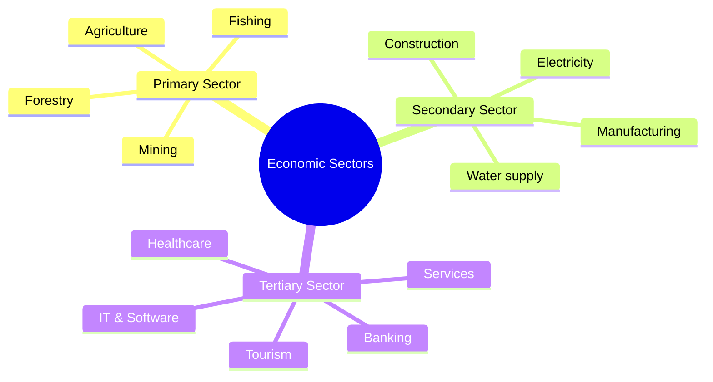

  <h3 style="color: var(--accent); margin-bottom: 16px; border-bottom: 1px solid var(--border); padding-bottom: 8px; display: flex; align-items: center; gap: 8px; font-weight: 600;">ECONOMIC SECTORS AND MASTER REVISION MCQS</h3>
  <h4 style="border-left: 3px solid var(--info); padding-left: 8px; margin-top: 24px; margin-bottom: 10px; color: var(--text-primary); font-weight: 600;">DEEP CONCEPTUAL EXPLANATION</h4>

GENERAL STUDIES 137. In terms of BASEL what does LFR refer to? (a) Logistic Channel Report (b) Least Cost Routing (c) Looking for Raid (d) Loan to Funding Ratio 138. Real time gross settlement benefits (a) the customers (b) the banks (c) Reserve Bank of India (d) Both ‘a’ and ‘b’ 132. The Government of India, in consultation with the Reserve Bank of India (RBI), has decided to issue (a) 2nd Tranche of Sovereign Gold Bonds (b) 3rd Tranche of Sovereign Gold Bonds (c) 4th Tranche of Sovereign Gold Bonds (d) 5th Tranche of Sovereign Gold Bonds 127. Which Indian company has become the first-ever Indian quasi-sovereign to issue a Masala bond on London Stock Exchange (LSE)? (a) Neyveli Lignite Corporation Limited (NLC) (b) Nuclear Power Corporation of India Limited (NPCIL) (c) National Thermal Power Corporation Limited (NTPC) (d) Bharat Heavy Electricals Limited (BHEL) 128. India’s first facility to produce nickel metal has been launched in which of the following states? (a) Odisha (b) Chhattisgarh (c) Uttar Pradesh (d) Jharkhand 133. Which of the following scheme provide the insurance coverage and financial support to the farmers in the event of failure of crops and subsequent low crop yield? (a) NNAIS (b) MNAIS (c) GIC (d) LNAIS 139. The Ministry of Finance is an important ministry within the Government of India. It concerns itself with (a) taxation (b) financial legislation (c) financial institutions (d) All of the above 129. What is the India’s rank in the technology-driven start-ups, as per the latest report by Assocham? (a) 4th (b) 3rd (c) 2nd (d) 5th 140. Consider the following statement(s) regarding the Office of Economic Advisor (OEA) 1. It is attached to the Ministry of Finance.

134. Which of the following programme launched an aim to make all national highways free of railway crossings by 2019? (a) SBP (b) UY (c) NUHM (d) NRHM 2. The weekly compilation and publication of Wholesale Price Indices (WPI) is done by the office of economic advisor.

Which of the statement(s) given above is/are correct? (a) Only 1 (b) Only 2 (c) Both 1 and 2 (d) Neither 1 nor 2 130. “NIDHI” has launched by the Union Government for nurturing ideas and innovation into start ups. What does “NIDHI” stands for? (a) National Imitation for Developing and Harnessing Innovations (b) National Immigration for Developing and Harnessing Innovations (c) National Initiative for Developing and Harnessing Innovations (d) National Implementation for Developing and Harnessing Innovations 135. IRDAI is an autonomous apex statutory body, which regulates and develops the insurance industry in India. IRDAI is headquartered at (a) Bengaluru (b) Mumbai (c) New Delhi (d) Hyderabad 141. The concept of ‘universal banking’ was implemented in India on the recommendations of (a) Abid Hussain Committee (b) RH Khan Committee (c) S Padmanabhan Committee (d) YH Malegam Committee 136. Which of the following is a part of capital account? (a) Private capital (b) Banking capital (c) Official capital (d) All of the above 131. The portfolio investment by foreign institutional investors is called (a) FDI (b) FII (c) Balance of Payment (d) SDR QUESTIONS FROM CDS EXAM (2012-2016) 2012 (I) 12. In the parlance of financial investment, the term bear denotes (a) an investor, who feels that the price of a particular security is going to fall (b) an investor, who expects the price of a particular share to rise (c) a shareholder, who has an interest in a company, financially or otherwise (d) any lender, whether by making a loan or buying a bond 7. Which one among the following is not a clause of World Trade Organisation? (a) Most favoured nation treatment (b) Lowering trade barriers with negotiations (c) Providing financial support to the countries having deficit balance of payments (d) Discouraging unfair trade practices such as antidumping and export subsidies 1. Which of the following measures should be taken when an economy is going through in inflationary pressures? 1. The direct taxes should be increased.

2. The interest rate should be reduced.

3. The public spending should be increased.

Select the correct answer using the codes given below. (a) Only 1 (b) Only 2 (c) 2 and 3 (d) 1 and 2 8. The basis of European Union began with the signing of (a) Maastricht Treaty (b) Treaty of Paris (c) Treaty of Rome (d) Treaty of Lisbon 13. Consider the following statement(s) 1. Rural forestry aims to raise the trees on community land and on privately owned land.

2. Farm forestry encourages individual farmers to plant trees on their own farmland to meet the domestic need of the family.

Which of the statement(s) given above is/are correct? (a) Only 1 (b) Only 2 (c) Both 1 and 2 (d) Neither 1 nor 2 2. Which of the following statement(s) is/are correct? 1. NIFTY is based upon 50 firms in India.

2. NIFTY is governed and regulated by the Reserve Bank of India.

3. NIFTY does not trade in mutual funds.

Select the correct answer using the codes given below. (a) Only 1 (b) Only 2 (c) Only 3 (d) 1 and 3 9. Which of the following statement(s) is/are correct? 1. If a country is experiencing increase in its per capita GDP, its GDP must necessarily be growing.

2. If a country is experiencing negative inflation its GDP must be decreasing.

Select the correct answer using the codes given below. (a) Only 1 (b) Only 2 (c) Both 1 and 2 (c) Neither 1 nor 2 3. Which one among the following is not a Millennium Development Goal of the United Nations? (a) Eradicate extreme poverty (b) Reduce birth rate and death rate (c) Improve maternal health (d) Promote gender equality 10. Fiscal Policy in India is formulated by (a) the Reserve Bank of India (b) the Planning Commission (c) the Finance Ministry (d) the Securities and Exchange Board of India 4. Special Drawing Rights (SDRs) relate to (a) the World Bank (b) the Reserve Bank of India (c) the World Trade Organisation (d) the International Monetary Fund 2012 (II) 14. Which of the following are responsible for the decrease of per capita holding of cultivated land in India? 1. Low per capita income.

2. Rapid rate of increase of population.

3. Practice of dividing land equally among the heirs.

4. Use of traditional techniques of ploughing.

Select the correct answer using the codes given below. (a) 1 and 2 (b) 2 and 3 (c) 1 and 4 (d) 2, 3 and 4 5. When the productive capacity of the economic systems of a state is inadequate to create sufficient number of jobs, it is called (a) seasonal unemployment (b) structural unemployment (c) disguised unemployment (d) cyclical unemployment 15. Consider the following statement(s) 1. High growth will led to inflation.

2. High growth will lead to deflation.

Which of the statement(s) given above is/are correct? (a) Only 1 (b) Only 2 (c) Both 1 and 2 (d) Neither 1 nor 2 11. Which one among the following is an appropriate description of deflation? (a) It is a sudden fall in the value of a currency against other currencies (b) It is a persistent recession in the (c) It is a persistent fall in the general price level of goods and services (d) It is fall in the rate of inflation over a period of time 6. National income ignores (a) sales of a firm (b) salary of employees (c) exports of the IT sector (d) sale of land GENERAL STUDIES 2013 (I) 25. Human Poverty Index (HPI) developed by UNDP is based on which of the following deprivations? 1. Income deprivation 2. Literacy deprivation 3. Social services deprivation 4. Employment deprivation Select the correct answer using the codes given below. (a) 2 and 4 (b) 1, 2 and 3 (c) 1, 3 and 4 (d) All of these 20. Which of the following are included in the category of direct tax in India? 1. Corporation tax 2. Tax on income 3. Wealth tax 4. Customs duty 5. Excise duty Select the correct answer using the codes given below. (a) 1, 2 and 3 (b) 1, 2, 4 and 5 (c) 2 and 3 (d) 1, 3, 4 and 5 2013 (II) 21. Which one among the following is a fixed cost to a manufacturing firm in the short run? (a) Insurance on buildings (b) Overtime payment to worker (c) Cost of energy (d) Cost of raw materials 16. Which one among the following is not a salient feature of the Companies Bill as amended in the year 2012? (a) For spending the amount earmarked for corporate social responsibility, the company shall give preferences to local areas where it operates (b) Punishment for falsely inducing a person to enter into an agreement with bank or financial institution with a view to obtaining credit facilities (c) There is no limit in respect of companies in which a person may be appointed as auditor (d) ‘Independent directors’ shall be excluded for the purpose of computing ‘one-third of retiring directors’ 26. The Government of India and Reserve Bank of India have decided to introduce 1 billion pieces of ` 10 notes in polymer/plastic on a field trial basis.

Which of the following is/are the objectives behind this move? 1. Increase of the lifetime of the notes.

2. Combating counterfeiting.

3. Reducing the cost of minting of currency.

Select the correct answer using the codes given below. (a) 1 and 2 (b) Only 2 (c) Only 3 (d) All of these 22. The government can influence private sector expenditure by 1. taxation 2. subsidies 3. macro-economic policies 4. grants Select the correct answer using the codes given below. (a) 3 and 4 (b) 1, 2 and 4 (c) 1, 2 and 3 (d) All of these 27. Which bank is limited to the needs of agriculture and rural finance? (a) SBI (b) NABARD (c) IFC (d) RBI 17. Which of the following institution(s) was/were asked by the Government of India to provide official estimates of black (unaccounted) money held by Indians, both in India and abroad? 1. National Institute of Public Finance and Policy.

2. National Council of Applied Economic Research.

3. National Institute of Financial Management.

Select the correct answer using the codes given below. (a) Only 1 (b) 1 and 2 (c) 2 and 3 (d) All of these 28. The effect of a government surplus upon the equilibrium level of NNP (Net National Product) is substantially the same as (a) an increase in investment (b) an increase in consumption (c) an increase in saving (d) a decrease in saving 23. Which of the following occupations are included under secondary sector as per the national income accounts? 1. Manufacturing 2. Construction 3. Gas and water supply 4. Mining and quarrying Select the correct answer using the codes given below. (a) 3 and 4 (b) 1, 2 and 4 (c) 1, 2 and 3 (d) All of these 29. The value of money varies (a) directly with the, interest rate (b) directly with the price level (c) directly with the volume of employment (d) inversely with the price level 18. The concept which tries to ascertain the actual deficit in the revenue account after adjusting for expenditure of capital nature is termed as (a) revenue deficit (b) effective revenue deficit (c) fiscal deficit (d) primary deficit 30. Corporation tax is imposed by (a) State Government (b) Central Government (c) Local Government (d) State as well as Central Government 31. Statement I the 19th century came to a state of ruin under English East India Company.

24. The sharp depreciation of rupee in the Forex market in the year 2011 was due to 1. flight to safety by foreign investors.

2. meltdown in European markets.

3. inflation in emerging market economies.

4. lag effect of monetary policy tightening.

Select the correct answer using the codes given below. (a) 1, 2 and 3 (b) 1, 2 and 4 (c) 3 and 4 (d) All of these 19. Which one among the following programmes has now been restructured as the National Rural Livelihood Mission? (a) Swarna Jayanti Shahari Rozgar Yojana (b) Swarna Jayanti Gram Swarozgar Yojana (c) Janshree Bima Yojana (d) Rashtriya Swasthya Bima Yojana Statement II English East India Company’s acquisition of Diwani right led to the miseries of the peasants and those associated with the traditional handicrafts industry of India. Which of the statement(s) given above is/are correct? (a) Only 1 (b) Only 2 (c) Both 1 and 2 (d) Neither 1 nor 2 Select the correct answer using the codes given below.

(a) 2 and 3 (b) 1 and 2 (c) Only 1 (d) All of these 38. The main functioning of the banking system is to (a) accept deposits and provide credit (b) accept deposits and subsidies (c) provide credit and subsidies (d) accept deposits, provide credit and subsidies 43. ‘Inclusive growth’ is a phrase used in India’s 1. 9th Plan 2. 10th Plan 3. 11th Plan 4. 12th Plan Select the correct answer using the codes given below: (a) 1, 2 and 3 (b) 2 and 4 (c) 3 and 4 (d) Only 4 Codes (a) Both the statements are individually true and Statement II is the correct explanation of Statement I (b) Both the statements are individually true, but Statement II is not the correct explanation of Statement I (c) Statement I is true, but Statement II is false (d) Statement I is false, but Statement II is true 32. The production function of a firm will change whenever (a) input price changes (b) the firm employs more of any input (c) the firm increases its level of output (d) the relevant technology changes 44. Corporation tax in India is levied on income of a company. Which one of the following does not include Corporation tax? (a) Profit from business (b) Capital gain (c) Interest on securities (d) Sale proceed of assets 39. In India, the price of petroleum products has been deregulated mainly to (a) reduce the burden of subsidies given to the oil companies (b) discourage the exploration of oil reserves in the country (c) discourage the demand for private vehicles (d) curb the use of black money in the 45. In India, contribution of food inflation to overall inflation is around 1 3rd to 2 5th. Within food 40. Which of the following factors was not a reason behind the occurrence of the Industrial Revolution in England first? (a) No part of the country was far from the sea (b) Navigable rivers made inland transport easier (c) In England machines could be operated by wind or water power due to favourable climate condition (d) England had coal, iron and other necessary mineral resources inflation, contribution of food articles is higher because price rise in food articles is (a) higher and their weight is also higher compared to food products (b) higher but their weight is lower compared to food products (c) lower but their weight is higher compared to food products (d) lower and their weight is also lower compared to food products 33. If the average total cost is declining then (a) the marginal cost must be less than the average total cost (b) total cost must be constant (c) the average fixed cost curve must be above the average variable cost curve (d) the marginal cost must be greater than the average total cost 34. In a perfectly competitive consumption will both be pareto optimal, if the economy operates at a point where (a) there is general equilibrium (b) output levels are below equilibrium (c) output levels are above equilibrium (d) consumption is less than output 2014 (I) 46. In India, mergers and acquisition of firms are regulated by (a) National Manufacturing Competitiveness Council (b) Competition Commission of India (c) Security and Exchange Board of India (d) Department of Industrial Policy and Promotion 35. The average fixed cost curve will always be (a) a rectangular hyperbola (b) a downward sloping convex to the origin curve (c) a downward sloping straight line (d) a U-shaped curve 36. The income elasticity of demand for inferior goods is (a) less than one (b) less than zero (c) equal to one (d) greater than one 41. According to the Companies Act, 2013, ‘nominal capital’ implies (a) such part of capital, which has been called for payment (b) the maximum amount of share capital of a company (c) such part of capital, which has been received by a company from its shareholders (d) such capital as the company issues from time to time for subscription 47. Which of the following statements about India’s unorganised sector are true? 1. Labour is more in number than that in the organised sector.

2. Job security and work regulation are better in unorganised sector.

3. They are usually not organised into trade unions.

4. Workers are usually employed for a limited number of days.

Select the correct answer using the codes given below. (a) 1, 2 and 4 (b) 1, 3 and 4 (c) 3 and 4 (d) 1 and 3 42. Which of the following is/are the objective(s) of ‘Mahatma Gandhi Pravasi Suraksha Yojana’? To encourage and enable the overseas Indian workers by giving government contribution to 1. save for their return and resettlement.

2. save for their old age.

3. obtain a life insurance cover against natural death for the entire life of the worker.

37. Consider the following statement(s) 1. The recent decision of Government of India to partially decontrol the sugar industry gives the millers the freedom to sell sugar in open market and removes their obligation to supply sugar at subsidised rates to ration shops.

2. C Rangarajan panel also suggested decontrolling of sugar industry in India.

GENERAL STUDIES 2. Insulate utilities from State Governments to prevent interference with internal operations.

3. Scrap the Electricity Act, 2003 in order to improve the revenue generation of the power distribution companies.

Select the correct answer using the codes given below. (a) 1 and 3 (b) 1 and 2 (c) Only 2 (d) All of these 3. The World Bank is a vital source of financial and technical assistance to developing countries around the world. It is not a bank in the ordinary sense but a unique partnership to reduce poverty and support development.

4. The World Bank Group comprises five institutions managed by their member countries in order to promote shared prosperity by fostering the income growth of the bottom 40% for every country.

Which of the statements given above are correct? (a) 1, 2 and 3 (b) 2, 3 and 4 (c) 1, 3 and 4 (d) 2 and 4 48. Classification of an enterprise into public or private sector is based on (a) number of employees in the enterprise (b) ownership of assets of the enterprise (c) employment conditions for workers in the enterprise (d) nature of products manufactured by the enterprise 49. Share of food in total consumption expenditure has been coming down as Per Capita Income grew over time in last sixty years because (a) people have been purchasing less food (b) people have been preferring non-cereal items in their food basket (c) growth in food expenditure has been lower than growth in per capita income (d) percentage of the poor in population has increased over time 55. Which of the following is not the recommendation of the Arvind Mayaram Committee on rationalising the FDI/FPI definition (June, 2014)? (a) Foreign investment of 10% or more in a listed company will be treated as Foreign Direct Investment (FDI). (b) In a particular company, an investor can hold the investments either under the Foreign Portfolio Investment (FPI) route or under the FDI route, but not both. (c) Any investment by way of equity shares, compulsorily convertible preference shares/debentures which is less than 10% of the post-issue paid up equity capital of a company shall be treated as FPI.

(d) On NRI Investors, the Committee recommended treating non-repatriable investment as FDI.

56. Which one among the following pairs is not correctly matched? 52. Which of the following statements about International Monetary Fund (IMF) are correct? 1. The IMF is a United Nations specialised agency.

2. The IMF was founded at the Bretton Woods Conference in 1944 to secure international monetary cooperation.

3. The objective of the IMF is to stabilise currency exchange rates and to expand international liquidity (access to hard currencies).

Select the correct answer using the codes given below. (a) 1 and 3 (b) 2 and 3 (c) 1 and 2 (d) All of these : Marginal product increases (a) When total product increases at an increasing rate : Marginal product declines (b) When total product increases at a diminishing rate 53. Union Government in June, 2014 granted Navaratna status to 1. Engineers India Limited 2. Coal India Limited 3. India Trade Promotion Organisation 4. National Buildings Construction Corporation Limited Select the correct answer using the codes given below. (a) 1, 2 and 3 (b) 2 and 3 (c) 1 and 4 (a) All of these (c) When total product reaches its maximum : Marginal product becomes zero (d) When total product begins to decline : Marginal product becomes positive 57. The way total output changes due to change in all inputs in same proportion is known as law of (a) returns to scale (b) diminishing returns (c) increasing returns (d) constant returns 2014 (II) 50. Consider the following statements relating to the World Trade Organisation (WTO) 1. The WTO deals with the global rules of trade between nations.

2. The goal of the WTO is to help producers of goods and services, exporters and importers conduct their business.

3. The WTO, which is a successor body of the General Agreement on Tariffs and Trade, came into being following the Uruguay Round of Negotiations.

4. The WTO distances itself in framing of rules on trade in intellectual property rights.

Which of the statements given above are correct? (a) 1, 2 and 3 (b) 2, 3 and 4 (c) 1, 2 and 4 (d) 1 and 3 54. World Bank in June, 2014 released a study report on India’s Power Sector titled ‘More Power to India : The Challenge of Electricity Distribution’. Which of the following is/are the key recommendation(s) of the report? 1. Ensure regulatory autonomy, effectiveness and accountability for utilities and regulators.

58. Which of the following statements are correct? 1. When marginal revenue is positive, total revenue increases with increase in output.

2. When marginal revenue is zero, total revenue is maximum.

3. When marginal revenue becomes negative, total revenue falls with increase in output.

51. Consider the following statements relating to the World Bank 1. The World Bank was established in 1946, which is headquartered in New York.

2. The World Bank Group has set for itself the goal to end extreme poverty from the world by 2030.

Select the correct answer using the codes given below. (a) 1 and 2 (b) 2 and 3 (c) 1 and 3 (d) 1, 2 and 3 63. Which of the following theories form the basis of international trade? 1. Absolute cost difference 2. Comparative cost difference 3. Opportunity cost Select the correct answer using the codes given below. (a) Only 1 (b) Only 2 (c) 1 and 2 (d) All of these 64. Which one among the following is not a source of tax revenue for the Central Government in India? (a) Income tax (b) Customs duties (c) Service tax (d) Motor vehicle tax 68. In May, 2014, an agreement for credit of $ 24 million (equivalent) from World Bank for additional financing for Uttarakhand Rural Water Supply and Sanitation Project was signed. The objective/objectives of the agreement was/were 1. to improve the effectiveness of Rural Water Supply and Sanitation (RWSS) services through decentralisation.

2. to restore services of damaged schemes in the disaster affected areas in the State of Uttarakhand.

Select the correct answer using the codes given below. (a) Only 1 (b) Only 2 (c) Both 1 and 2 (d) Neither 1 nor 2 65. Which of the following does not form part of current account of Balance of Payments? (a) Export and import of goods (b) Export and import of services (c) Income receipts and payments (d) Capital receipts and payments 59. Which of the following statement(s) is/are true? 1. If increase in demand and supply are of equal magnitude, the price will remain unchanged, but the equilibrium quantity will increase.

2. If increase in demand is of greater magnitude than increase in supply, both equilibrium price and equilibrium quantity will increase.

3. If increase in supply is of greater magnitude than increase in demand, equilibrium price will fall but equilibrium quantity will increase.

Select the correct answer using the codes given below. (a) Only 1 (b) 1 and 2 (c) 2 and 3 (d) 1, 2 and 3 66. Consider the following statement(s) 1. Government of India has upgraded the National Industrial Classification from NIC-1987 to NIC-2008.

2. NIC is an essential statistical standard for developing and maintaining comparable database according to economic activities.

Which of the statement(s) given above is/are correct? (a) Only 1 (b) Only 2 (c) Both 1 and 2 (d) Neither 1 nor 2 69. Consider the following statements relating to the Non-Alignment Movement 1. The Non-Aligned Movement (NAM) was created and founded during the collapse of the colonial system and the independence struggles of the people of Africa, Asia, Latin America and other regions of the world and at the height of the Cold War.

2. The First Summit of the Movement of Non-Aligned countries was convened by the leaders of India, Indonesia, Egypt, Syria and Yugoslavia at Belgrade on 1st to 6th September, 1961.

3. During the early days of the Movement, its actions were a key factor in the decolonisation process, which led later to the attainment of freedom by many countries and to the founding of several new sovereign States.

4. The fundamental principle of the movement is to maintain equal distance from both the super powers by joining the military alliances of both the blocs.

Which of the statements given above are correct? (a) 1, 2 and 3 (b) 2 and 3 (c) 1, 3 and 4 (d) 1 and 2 70. Which of the following is not correct regarding the 2014 FIFA Football World Cup? (a) ‘We Are One’ is the official song (b) ‘Dar um, Jeito’ (We Will Find A Way)’ is the official anthem (c) Brazil is the first country to host a World Cup for the second time (d) For the first time two consecutive World Cups are not hosted in Europe 67. Under the forceful thrust of British rule, a rapid transformation of the Indian economy took place. In this context, which of the following statement(s) is/are correct? transformed into a colonial whose structure was determined by Britain’s fast developing 2. The influx of cheap Indian products into England gave a great blow to English textile industries.

3. The 19th century saw the collapse of the traditional fresh economic alignment along commercial lines.

Select the correct answer using the codes given below. (a) 1 and 3 (b) Only 1 (c) Only 2 (d) 1 and 2 60. A market in which there are large numbers of sellers of a particular product, but each seller sells somewhat differentiated but close products is termed as (a) perfect competition (b) monopoly (c) monopolistic competition (d) oligopoly 61. The value of all final goods and services produced by the normal residents of a country and their property, whether operating within the domestic territory of the country or outside in an year is termed as (a) Gross National Income (b) Net National Income (c) Gross Domestic Product (d) Net Domestic Product 62. National product at factor cost is equal to (a) Domestic product + Net factor income from abroad (b) National product at market prices −Indirect taxes + Subsidies (c) Gross domestic product − Depreciation (d) National product at market prices + Indirect taxes + Subsidies GENERAL STUDIES Select the correct answer using the codes given below. (a) Only 1 (b) Only 2 (c) Both 1 and 2 (d) Neither 1 nor 2 71. Which of the following statement(s) about Marrakesh Treaty is/are correct? 1. The main goal of the treaty is to create a set of mandatory limitations and exceptions for the benefits of the blind and visually impaired.

2. India has ratified the treaty.

3. The treaty has come into force from July, 2014.

Select the correct answer using the codes given below. (a) Only 1 (b) 1 and 2 (c) Only 2 (d) All of these 79. Rise in the price of a commodity means (a) rise in the value of currency only (b) fall in the value of currency only (c) rise in the value of commodity only (d) fall in the value of currency and rise in the value of commodity 80. Which of the following statement(s) with regard to the proposed Asian Infrastructure Investment Bank is/are correct? 1. India is one of the founding members of the bank.

2. The bank is to be headquartered in Shanghai.

Select the correct answer using the codes given below. (a) Only 1 (b) Only 2 (c) Both 1 and 2 (d) Neither 1 nor 2 75. Consider the following statement(s) on Bay of Bengal Initiative for Multi-Sectoral Technical and Economic Cooperation (BIMSTEC) 1. BIMSTEC has seven members Bangladesh, Bhutan, India, Myanmar, Nepal, Sri Lanka and Thailand.

2. BIMSTEC provides a link between South Asia and South-East Asia by way of economic cooperation and linkages in identified areas of cooperation.

3. BIMSTEC was rechristened as BISTEC in the year 2014.

Select the correct answer using codes given below. (a) Only 1 (b) Only 2 (c) 1 and 2 (d) All of these 2015 (I) 72. Consider the following statements about SAARC 1. The SAARC Secretariat is located at Kathmandu.

2. The Secretariat is headed by the Secretary General, who is appointed by the Council of Ministers from Member States in alphabetical order for a three year term.

3. The Secretary General is assisted by eight Directors on deputation from the Member States.

Select the correct answer using the codes given below. (a) Only 1 (b) 2 and 3 (c) All of these (d) 1 and 3 76. When two goods are completely inter-changeable, they are (a) perfect substitutes (b) perfect complements (c) Giffen goods (d) Veblen goods 73. Match the following 77. Match the following 81. Which of the following statements is/are true with regard to the newly launched Vanbandhu Kalyan Yojana? 1. Under the scheme, Centre will provide ` 10 crore each for every State and Union Territory of the country for the development of various facilities for the tribals.

2. The scheme mainly focuses on bridging infrastructural gaps and gap in human development indices between Schedules Tribes and other Social Groups.

Select the correct answer using the codes given below. (a) Only 1 (b) Only 2 (c) Both 1 and 2 (d) Neither 1 nor 2 List I (Training Institutes) List II (Locations) List I (Industries) List II (Locations) A. National Academy of Direct Taxes 1. Hyderabad B. Rafi Ahmed Kidwai National Postal Academy 2. Nagpur A.

Railway equipment 1. Kochi B.

Automobile 2. Ludhiana C.

Ship-building 3. Bhilai D.

Bicycle 4. Jabalpur C. Sardar Vallabhbhai Patel National Police Academy 3. Dehradun D. Indira Gandhi National Forest Academy 4. Ghaziabad Codes A B C D A B C D (a) 2 4 (b) 2 1 4 3 (c) 3 4 (d) 3 1 4 2 74. Consider the following statement(s) on SAFTA 1. SAFTA is a trade liberalisation programme among the South-Eastern countries of Asia.

2. According to SAFTA, the Ministerial Council shall meet at least once every year or more often as and when considered necessary by the Contracting States.

82. Which of the following statements is not true? (a) The General Agreement on Tariffs and Trade (GATT) had regulated global trade since, 1947 (b) GATT was replaced by the World Trade Organisation (WTO) in 1995 (c) The Most Favoured Nation principle under GATT provided that preferential trading agreements reached with one country should be extended to other countries (d) The WTO has been able to cover in an agreements the agriculture and textile sectors which are the principal concerned for the Least Developed Countries (LDCs) 83. Which of the following is not a part of contemporary Indian foreign policy in relationships with its neighbours? (a) Look East Policy for linking up with South-East Asia via Myanmar (b) Panchsheel (c) Non-alignment (d) SAARC Codes A B C D A B C D (a) 3 4 (b) 3 1 4 2 (c) 2 1 (d) 2 4 1 3 78. Consider the following statement(s) with regard to the First Renewable Energy Global Investors Meet and Expo (2015) 1. This is a follow-up to the ‘Make in India’ initiative.

2. The central theme of the meet is to attract large scale investments in the renewable energy sector in India.

Which of the statement(s) given above is/are correct? (a) Only 1 (b) Only 2 (c) Both 1 and 2 (d) Neither 1 nor 2 2015 (II) 89. Which of the following is not a central tenet of Socialism? (a) Historical Materialism (b) Dialectical Materialism (c) Alienation and Class Struggle (d) Individual Freedom 94. Under flexible exchange rate system, the exchange rate is determined (a) predominantly by market mechanism (b) by the Central Bank (c) as a weighted index of a group of currencies (d) by the World Trade Organisation 84. Consider the following statement(s) 1. The Nirmal Bharat Abhiyan is restructured into the Swachh Bharat Mission.

2. The Swachh Bharat Mission has two sub-missions — Union Territories and States.

Which of the statement(s) given above is/are correct? (a) Only 1 (b) Only 2 (c) Both 1 and 2 (d) Neither 1 nor 2 90. Which of the following is not true for South Asian Free Trade Area (SAFTA)? (a) It is a step towards a South Asian customs union and common market (b) The agreement came into effect in (c) The SAFTA is a trade liberalisation regime (d) The SAFTA agreement takes precedence over any other agreement a member country may have with States outside SAFTA 95. A Bill is deemed to be a ‘Money Bill’ if it has any provision dealing with 1. imposition, abolition, remission, alteration or regulation of any tax.

2. appropriation of money from the Consolidated Fund of India.

3. imposition of fines or other pecuniary penalties.

4. payment of fee for licences or fee for service rendered.

Select the correct answer using the codes given below. (a) 1 and 2 (b) 1, 3 and 4 (c) 1, 2 and 3 (d) Only 2 96. Which one of the following is not a part of service sector in India? (a) Transport (b) Construction (c) Hotels and restaurants (d) Insurance 85. Which of the following is/are the objective(s) of National AYUSH Mission, approved by the Union Cabinet recently? 1. Improvement of AYUSH educations through enhancement in the number of upgraded educational institutions.

2. Better access to AYUSH services through increase in the AYUSH hospitals and dispensaries, availability of drugs and manpower.

3. Providing sustained availability of quality raw material for AYUSH systems of medicine.

Select the correct answer using the codes given below. (a) Only 1 (b) 2 and 3 (c) 1 and 2 (d) All of these 91. The 3rd Meeting of the SAARC Culture Ministers, convened in New Delhi on 25th September, 2014, unanimously resolved 1. to declare 2015-16 as the SAARC Year of Cultural Heritage.

2. that Bamiyan will be the SAARC cultural capital for 2015-16.

3. to promote SAARC culture online by launching a dedicated SAARC website on culture, with emphasis on digitisation of rare manuscripts, rare books and other articles of intangible cultural value.

Select the correct answer using the codes given below. (a) Only 2 (b) 1 and 3 (c) 2 and 3 (d) All of these 97. Which one of the following is not correct in the context of industrial clusters development in India? (a) Industrial clusters play an important role for the MSME participants in their inclusiveness, technology absorption and efficiency improvement (b) Industrial clusters are visible in traditional handloom, handicrafts and modern SMC (c) Industrial cluster programmes in India are administered by various ministries (d) Industrial clusters lead to promotion of monopoly in the market 86. In recent plans, certain words/phrases were used in the title of the plan along with ‘growth’. They are 1. inclusive 2. faster 3. more inclusive 4. sustainable 5. more sustainable Which combination is true of the 12th Five Year Plan (2012-17)? (a) 1, 2 and 3 (b) 1, 4 and 5 (c) 2, 3 and 4 (d) 1, 2 and 4 92. Inclusion strategy does not focus on (a) reduction of inequality (b) reduction of poverty (c) diversifying livelihood for tribal population (d) getting poorer countries closer 98. Private investment in Indian agriculture is mostly on labour saving mechanisation. This could be a response to (a) rising productivity of agricultural sector (b) rising inequality in agriculture (c) rising wages and tighter labour market (d) debt write-off by the government 87. Demand for a commodity refers to (a) desire for that commodity (b) need for that commodity (c) quantity demanded of that commodity (d) quantity demanded at certain price during any particular period of time 99. Which one of the following is not a recommendation of the 14th Finance Commission? (a) Share of states in Central Divisible Pool is increased from 32%-42% (b) Area under forest cover is an important variable in distribution of states’ share among states 88. An exceptional demand curve is one that slopes (a) downward to the right (b) upward to the right (c) horizontally (d) upward to the left 93. Which among the following is not an aspect of Gender Mainstreaming (GM)? (a) GM was established as a global strategy for achieving gender equality by the United Nations (b) It was adopted in 1995 in the Beijing Platform of Action (c) It requires a review of government policy in all sectors for eliminating gender disparity (d) GM was followed by the Convention on the Elimination of all forms of Discrimination Against Women (CEDAW) GENERAL STUDIES 110. ‘Weibo’ is a social media platform, popularly used in (a) South Korea (b) China (c) Thailand (d) Japan (c) Fiscal discipline is dropped as a variable in distribution of states’ share among states (d) Sector-specific grant is recommended as in the previous Finance Commissions 105. What is meant by ‘Public Good’? (a) A commodity produced by government (b) A commodity whose benefits are indivisibly spread among the entire community (c) A government scheme that benefits the poor households (d) Any commodity that is very popular among general public 100. Which of the following statements with regard to New Development Bank (NDB), formerly referred to as the BRICS Development Bank is/are correct? 1. The headquarters of the bank is situated at Moscow, Russia.

2. KV Kamath is the first President of the bank.

Select the correct answer using the codes given below. (a) Only 1 (b) Only 2 (c) Both 1 and 2 (d) Neither 1 nor 2 106. Which one of the following statements with regard to 1814-1860 is not correct? (a) Between 1814 and 1850, four commodities dominated India’s exports— raw silk, opium, cotton and indigo (b) Between 1814 and 1860, five commodities dominated India’s exports— raw silk, opium, cotton, indigo and jute (c) Indigo and raw silk required processing techniques (d) Indigo and raw silk were financed by foreign capital 111. Which one of the following is not provided regular budgetary support by the Ministry of Defence? (a) Himalayan Mountaineering Institute, Darjeeling (b) Institute for Defence Studies and Analysis, New Delhi (c) Armed Forces Tribunal (d) United Service Institution of India, New Delhi 112. In April 2015, India and France agreed to conclude an inter-governmental agreement in respect of which one of the following platforms? (a) Rafale medium multirole combat aircraft (b) Scorpene submarines (c) Infantry mobility vehicles (d) Precision guided munitions system 113. Where was the 14th Asia Security Summit (Shangri-La Dialogue) held in May 2015? (a) Beijing (b) Bangkok (c) Jakarta (d) Singapore 101. Which of the following factors led to a decline in inflation rate in India during 2014-15? 1. Persistent decline in crude oil prices.

2. Softness in global prices of tradables such as edible oils and coal.

3. Tight monetary policy pursued by the Reserve Bank of India.

Select the correct answer using the codes given below. (a) Only 1 (b) 1 and 2 (c) 2 and 3 (d) All of these 107. In view of the fact that kerosene is an inferior good in India, what is/are its implication(s)? 1. As households get richer, they consume less kerosene.

2. Over time there is a decline in quality of kerosene.

3. Government needs to stop subsidies on kerosene.

Select the correct answer using the codes given below. (a) Only 1 (b) 1 and 2 (c) 2 and 3 (d) 1, 2 and 3 102. Which one of the following statements about the Companies Act, 2013 is not correct? (a) The Act regulates the corporate sector to make it accountable (b) It provides for Corporate Social Responsibility (CSR) (c) It provides more opportunities for new entrepreneurs (d) It enables wide application of information technology 114. Which of the following are members of BRICS? (a) Bhutan, Russia, India, China and Sri Lanka (b) Brazil, Russia, India, China and South Africa (c) Brazil, Russia, Indonesia, China and Singapore (d) Bangladesh, Republic of Korea, Indonesia, Canada and Sri Lanka 115. The ‘Panchsheel Agreement’ for peaceful co-existence was signed between (a) India and Bhutan (b) India and Nepal (c) India and China (d) India and Pakistan 116. Which one of the following is not a member of MERCOSUR (Southern Common Market)? (a) Argentina (b) Paraguay (c) Uruguay (d) Chile 103. Which one of the following is an example of a ‘natural monopoly’? (a) Indian Airlines (b) Delhi Jal Board (c) Delhi Transport Corporation (d) Steel Authority of India Limited 108. Which one of the following is the major source of Gross Tax Revenue (GTR) for the Government of India? (a) Income tax (b) Corporation tax (c) Customs duty (d) Service tax 2016 (I) 104. What is meant by ‘Price discrimination’? (a) Increase in price of a commodity over time (b) A situation where the same product is sold to different consumers for different prices (c) Subsidisation of a product by the government to sell it at a lower price (d) General decrease in price of a commodity over time 117. Which one of the Five Year Plans had a high priority to bring inflation under control and to achieve stability in the economic situation? (a) Fourth Plan (1969-74) (b) Fifth Plan (1974-79) (c) Sixth Plan (1980-85) (d) Seventh Plan (1985-90) 109. Which one of the following represents a progressive tax structure? (a) Tax rate is the same across all incomes (b) Tax rate increases as income increases (c) Tax rate decreases as income increases (d) Each household pays equal amount of tax 3. It is a national identity and citizenship card. Select the correct answer using the codes given below.

(a) 2 and 3 (b) 1 and 2 (c) 1 and 3 (d) All of these 4. The terms such as ‘Pareto Efficiency’, ‘Pareto Optimality’ and ‘Allocative Efficiency’ are all essentially one and the same which denote ‘efficiency in resource allocation’. Select the correct answer using the codes given below. (a) 1 and 4 (b) 1 and 3 (c) 2 and 3 (d) All of these 128. Human Development Report for each year at global level is published by (a) WTO (b) World Bank (c) UNDP (d) IMF 123. Which one of the following nations has faced severe economic crisis in the year 2015 resulting in default in repayment of IMF loan? (a) China (b) Greece (c) Ireland (d) Belgium 118. Which of the following statement(s) is/are true with respect to Phillips Curve? 1. It shows the trade-off between unemployment and inflation.

2. The downward sloping curve of Phillips Curve is generally held to be valid only in the short run.

3. In the long run, Phillips Curve is usually thought to be horizontal at the Non-Accelerating Inflation Rate of Unemployment (NAIRU).

Select the correct answer using the codes given below. (a) Only 1 (b) 2 and 3 (c) 1 and 2 (d) All of these 124. Which of the following is not a ‘Public Good’? (a) Electricity (b) National Defence (c) Light House (d) Public Parks 119. Which one of the following nations is not a member of the Eurasian Economic Union? (a) Belarus (b) Russia (c) Kazakhstan (d) Uzbekistan 129. Which one of the following is not a monitorable target of the Beti Bachao Beti Padhao Abhiyan? (a) Provide girls’ toilet in every school in 100 Child Sex Ratio (CSR) districts by the year 2017 (b) 100% girls’ enrolment in secondary education by the year 2020 (c) Promote a protective environment for girl children through implementation of Protection of Children from Sexual Offences (POCSO) Act 2012 (d) Train Elected Representatives/ Grassroot functionaries as Community Champions to mobilise communities to improve CSR and promote girls’ education 120. BRICS leaders signed the agreement to establish a New Development Bank at the summit held in (a) New Delhi, India (2012) (b) Durban, South Africa (2013) (c) Fortaleza, Brazil (2014) (d) Ufa, Russia (2015) 130. The National Policy for Children 2013 recognises every person as a child below the age of (a) 12 years (b) 14 years (c) 16 years (d) 18 years 125. Which one of the following is not among the aims of the Second Five Year Plan (1956-57 to 1960-61)? (a) Rapid industrialisation with particular emphasis on the development of basic and heavy industries (b) Large expansion of employment opportunities (c) Achieve self-sufficiency in foodgrains and increase agricultural production to meet the requirements of industry and exports (d) Reduction of inequalities in income and wealth and a more even distribution of economic power 121. Shishu, Kishor and Tarun are the schemes of (a) Regional Rural Banks (b) Micro Units Development and Refinance Agency Limited (MUDRA) (c) Small Industries Development Bank of India (d) Industrial Development Bank of India 126. Which of the following is/are the example(s) of Transfer Payment(s)? 1. Unemployment allowance 2. Payment of salary 3. Social security payments 4. Old age pension Select the correct answer using the codes given below. (a) 1 and 3 (b) 1, 2 and 3 (c) 1, 3 and 4 (d) None of these 131. Which of the following is not an objective of the Rashtriya Uchchatar Shiksha Abhiyan (RUSA)? (a) Improve the overall quality of private educational institutions (b) Ensure reforms in the affiliation, academic and examination systems (c) Correct regional imbalances in access to higher education (d) Create an enabling atmosphere in the higher education institutions to devote themselves to research and innovations 132. Which of the following is/are example(s) of ‘Near Money’? 1. Treasury Bill 2. Credit Card 3. Savings accounts and small time deposits.

4. Retail money market mutual funds.

Select the correct answer using the codes given below. (a) Only 1 (b) Only 2 (c) 1, 2 and 3 (d) 1, 3 and 4 127. Which of the following statements with regard to UID/Aadhar Card are correct? 1. It is a 12-digit unique form of identification for all residents of India.

2. It is an identity number along with the biometric information of the individuals.

122. Which of the following statements are true with respect to the concept of EFFICIENCY as used in mainstream economics? 1. Efficiency occurs when no possible reorganisation of production can make anyone better off without making someone else worse off.

inefficient if it is inside the Production Possibility Frontier (PPF).

3. At a minimum, an efficient Possibility Frontier (PPF).

GENERAL STUDIES 133. Which one of the following terms is used in Economics to denote a technique for avoiding a risk by making a counteracting transaction? (a) Dumping (b) Hedging (c) Discounting (d) Deflating families than it does from rich families.

4. Indirect taxes have the advantage of being cheaper and easier to collect.

Select the correct answer using the codes given below. (a) 1 and 3 (b) 2 and 4 (c) 1, 2 and 4 (d) All of these 3. Second National Commission on Labour has recommended against the utility of wage boards. Select the correct answer using the codes given below.

(a) Only 1 (b) Only 2 (c) 1 and 2 (d) All of these 136. Norman Borlaug won Nobel Peace Prize for his contributions in 1. development of high-yielding crops.

2. modernisation of irrigation infrastructure.

3. introduction of synthetic fertilizers and pesticides.

Select the correct answer using the codes given below (a) Only 1 (b) Only 2 (c) 2 and 3 (d) All of these 135. Which of the following statement(s) is/are false? 1. Wage Boards are tripartite in nature, with representatives from workers, employers and independent members.

2. Except for the Wage Boards for Journalists and Non-Journalists, all the other wage boards are statutory in nature.

134. Which of the following statements are correct? 1. Ability to pay principle of taxation holds that the amount of taxes people pay should relate to their income or wealth.

2. The Benefit Principle of taxation States that individuals should be taxed in proportion to the benefit they receive from government programmes.

3. A progressive tax takes a larger share of tax from poor ANSWERS Practice Exercise Questions From CDS Exam (2012-2016)

## Visual Summary & Diagrams: Economic Sectors

### Sectors of the Indian Economy

