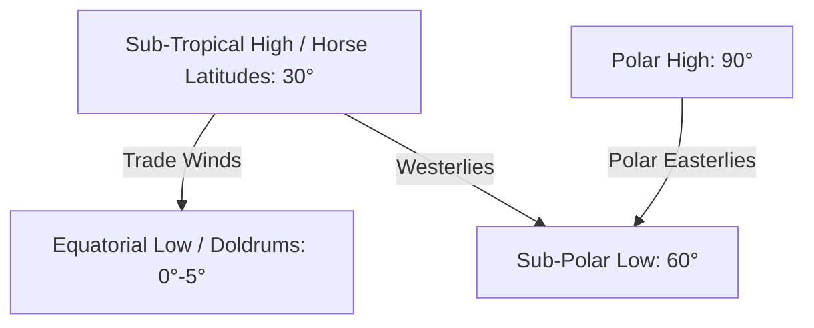

<div class="revision-card" style="background: rgba(20,20,30,0.4); border: 1px solid var(--border); border-radius: 8px; padding: 20px; margin-bottom: 24px; box-shadow: 0 4px 12px rgba(0,0,0,0.25);">
  <h3 style="color: var(--accent); margin-bottom: 16px; border-bottom: 1px solid var(--border); padding-bottom: 8px; display: flex; align-items: center; gap: 8px; font-weight: 600;">ENVIRONMENTAL GEOGRAPHY AND MCQS</h3>
  <h4 style="border-left: 3px solid var(--info); padding-left: 8px; margin-top: 24px; margin-bottom: 10px; color: var(--text-primary); font-weight: 600;">DEEP CONCEPTUAL EXPLANATION</h4>

There are two types of biomass pyramids, which are as follow : Functioning of Ecosystem The main functions of an ecosystem are as follow : Food Chain i. Upright Pyramid An upright pyramid is one where the combined weight of producers is larger than the combined weight of consumers. e.g. forest ecosystem.

ii. Inverted Pyramid An inverted pyramid is one where the combined weight of producers is smaller than the combined weight of consumers. e.g. an aquatic ecosystem.

• The feeding of one organism upon another in a sequence of food transfer is known as a food chain. Another definition is that it is the chain of transfer of energy (which typically comes from the Sun) from one organism to another. A simple food chain is like the following Grass>Insect>Frogs>Snake>Hawk • Except in deep-sea hydrothermal ecosystems, all food chains start with photosynthesis and end with decay.

Pyramid of Numbers The pyramid of numbers represents the number of organisms in each trophic level. Food Web • A network of food chains or feeding relationships by which energy and nutrients are passed on from one species of living organism to another is called Food Web.

• Upright, partly upright and inverted are the three types of pyramids of numbers. An aquatic ecosystem is an example of upright pyramid where the number of organisms becomes fewer and fewer higher up in the pyramid.

• A food web is represented by a graphical description of feeding relationships among species in an ecological community, e.g. of who eats whom. It is also a means of showing how energy and materials (e.g. carbon) flow through a community of species as a result of these feeding relationships.

• A forest ecosystem is an example of a partially upright pyramid, as fewer producers support more primary consumers, but there are less secondary and tertiary consumers.

• An inverted pyramid of numbers is one where the number of organisms depending on the lower levels grows closer toward the apex. e.g. a parasitic food chain.

Lion Jackal Goat Wild cat Kite Rabbit Pyramid of Energy The pyramid of energy represents the total amount of energy consumed by each trophic level. An energy pyramid is always upright as the total amount of energy available for utilisation in layer above is less than the energy available in the lower levels. This happens because during energy transfer from lower to higher levels, some energy is always lost. Energy is also lost at every level in the form of heat, respiration etc. Snake Food Web in a Forest Mouse Green Plant Poducer Ecosystem Productivity The productivity of an ecosystem refers to the rate of production, i.e. the amount of organic matter accumulated per unit area in unit time. It is of following types • Trophic Levels Trophic levels are the feeding position in a food chain such as primary producers, herbivore, primary carnivore etc. Generally, green plants form the first trophic level, the producers. Herbivores form the second trophic level, while carnivores and omnivores form the third and even the fourth trophic levels.

• Gross Primary Productivity (GPP) It is minus energy utilised in respiration.

NPP = GPP – R • Net Primary Productivity (NPP) It is the amount of chemical energy, that is generated by primary producer in a given period of time. It is also defined as rate of production of organic matter. NPP is the available biomass for consumption to heterotrophs.

• Ecological Pyramids An ecological pyramid is a graphical representation designed to show the number of organisms, energy relationships and biomass of an ecosystem. They are also called Eltonian pyramids after Charles Elton, who developed the concept of ecological pyramids.

• Secondary Productivity (SP) It is the rate of energy storage at consumer level.

• Pyramid of Biomass A pyramid of biomass is a representation of the amount of energy contained in biomass, at different tropic levels for a particular time. It is measured in grams per square metre or calories per sq m.

• Net Productivity (NP) It is the rate of storage of organic matter not used by the heterotrophs or consumers.

GENERAL STUDIES Causes and Sources • Air pollution is caused by various type of pollutants. Petroleum refineries release poisonous gases like sulphur dioxide, nitrogen oxides etc. Ecological Niche It is the role, position a species has in its environment. A species niche include all of its interaction with biotic and abiotic factor of its environment.

• Dust is produced from cement factories and from stone crushers and hot mix plant releases suspended particulate matter more than five times the safety limits by industrial standards.

• The thermal power plant produce deadly pollutants such as fly ash, hydrocarbons etc. In urban areas, automobiles are the chief sources of pollution.

Ecological Succession It is a natural process by which different groups or communities colonise the same area over a period of time in a definite sequence. It can also be defined as series of stages one after the other, by which a group of organisms living in a community reaches its final stable state or climax. POLLUTION • The ever increasing traffic density has aggravated the existing problem of air pollution. Automobiles mainly produce pollutants like unburnt hydrocarbons, CO2, NO2, lead oxides etc. Effects of Air Pollution • Effect on Human Health Introduction of contaminants or impurities into the natural environment is called pollution. Pollutant or contaminant may be natural or foreign substance.

Pollution cause adverse changes in the nature and in long term affects the life on Earth. – Irritation of eyes, nose, throat, damage to lungs when inhaled.

– Acute and chronic asthma.

Environmental Pollution – Brochitis and emphysema (as a result of synergy between SO2 and suspended particulate matter).

– Lung cancer.

Environmental pollution is the effect of undesirable changes in our surroundings that have harmful effects on plants, animals and human beings. Primary Pollutants • Acid Deposition The process by which acidic air pollutants, generally sulphur dioxide and nitrogen oxides are deposited on the Earth. Much of this deposition occurs when the pollutants condense in water and fall to the Earth as precipitation, known generally as acid rain. Acid deposition causes changes in the pH of water and soil, leading to a host of environmental problems.

• A primary pollutant is an air pollutant emitted directly from a source. A secondary pollutant is not directly emitted as such, but forms when other pollutants (primary pollutants) react in the atmosphere.

• Sulphur dioxide, Nitrogen oxides, Carbon monoxide, CFCs, CO2, Suspended Particulate Matter (SPM) etc are primary pollutants.

• Wet Deposition It refers to acidic rain, fog and snow. If, the acid chemicals in the air are blown into areas where the weather is wet, the acids can fall to the ground in the form of rain, snow, fog or mist.

Secondary Pollutants These are derived from primary pollutants. The examples of secondary pollutants are as follow • Dry Deposition In areas where the weather is dry, the acid chemicals may become incorporated into dust or smoke and fall to the ground through dry deposition, sticking to the ground, buildings, homes, cars and trees.

• Particulate matter formed from gaseous primary pollutants and compounds in photochemical smog, such as nitrogen dioxide.

• Ground level ozone ( O3 formed from NO and Volatile Organic Compounds (VOCs).

2. Noise Pollution Noise can be described as sound without agreeable musical quality or as an unwanted or undesired sound. Thus, noise can be taken as a group of loud, non-harmonious sounds or vibrations that are unpleasant and irritating to ear.

• Peroxyacetyl Nitrate (PAN) similarly formed from NO Sources of Noise Pollution 2 and VOCs.

Kinds of Pollution • The noise pollution has two sources, i.e. industrial and non-industrial. The industrial sources includes the noise from various industries and big machines working at a very high speed and high noise intensity.

1. Air Pollution Presence of contaminants released by human activities into the Earth's atmosphere having potential of causing harm to property or the precious lives of plants, animals or humans.

• Non-industrial source of noise includes the noise created by road traffic, aircraft, railroads, construction, industry, noise in buildings and consumer products, loud speakers, sirens etc.

Effects of Noise Pollution • e-Waste Treatment Environmentally sound e-waste treatment technology is identified at three levels, which are as follow :

• It decreases the hearing efficiency in humans. There should be cool and calm atmosphere during the pregnancy. Unpleasant sounds make a lady of irritative nature. Sudden noise causes abortion in females.

• The noises are recognised as major contributing factors in accelerating the already existing tensions of modern living. These tensions result in certain disease like enhanced blood pressure or mental illness etc.

• Noise pollution damages the nervous system of animals.

Animal loses the control of its mind.

i. In this level treatment includes decontamination, dismantling and segregation. ii. This treatment includes shredding and special treatment processes like electromagnetic separation, eddy current separation and density separation using water. iii. This treatment includes recovery of metals and disposal of hazardous e-waste fraction, including plastics with flame retardants, CFCs, capacitors, mercury, lead and other items. All three levels of e-waste treatment are based on material flow.

• Loud noise is very dangerous to buildings, bridges and monuments. It creates waves which strike the walls and put the building in danger condition. It weakens the structure of buildings.

3. Radioactive Pollution Radioactive pollution, like any other kind of pollution, is the release of radioactive elements into the environment.

Radioactive element omits high energy waves which can cause mutation in the DNA of living organisms.

4. Water Pollution According to definition of WHO, “water pollution occurs when foreign materials either from natural or other sources are added to water supplies and may be harmful to life, because of their toxicity, reduction of normal oxygen level of water, aesthetically unsuitable effects and spread of epidemic diseases”.

Causes of Radioactive Pollution Sources of Water Pollution Sources of water pollution are as follow :

• There are many causes of radioactive pollution, which can significantly harm the environment.

• Industrial effluents.

• Industrial wastes derived from chemical industries, thermal power plants and nuclear power stations.

• Production of nuclear weapons, decommissioning of nuclear weapons, mining of radioactive ore, coal ash, medical waste, nuclear power plants are important source of radioactive pollution.

• Sewage and other waste.

• Agricultural discharges.

Radioactive Waste Management Types of Water Pollution Following techniques are effective in radioactive waste management Water pollution can be classified as :

• Surface Water Pollution Rivers, lakes and ponds constitute surface water.

• Geological Disposal This is effectively, the burying of radioactive material. Rooms are then excavated at the bottom of geological formation and radioactive material is stored here until it has decayed enough to not be dangerous any more.

• River Water Pollution It poses a serious problem.

Urban sewer drainage and industrial effluents are two major sources of river pollution. Soil erosion causes siltation of lakes.

• Transmutation Transmutation of radioactive waste is the process of consuming this radioactive waste and turning it into less harmful waste. This is currently not used very often due to high coasts.

• Sea Water Pollution It occurs near coastal waters due to dumping of pollutants. Pollution at deep sea is caused by leakage of oil due to ship wreckage. Oil spills have caused great harm to sea life in recent past.

• Re-Use of Radioactive Waste Some radioactive isotopes, such as strontium-90 and caesium-137 are able to be extracted for use in other industries such as food irradiation.

e-Waste • Ground Water Pollution Contamination of ground water takes place through pollutants like nitrates, phosphorus, potash, insecticides, pesticides etc. These pollutants reach into the ground water and make water polluted.

• Effects of Water Pollution The water we drink is a crucial component for healthy living. Clean water is essential for health. Use of contaminated water is a major reason for various water borne diseases like Cholera, Typhoid, Hepatits-B etc.

• It comprises of wastes generated from used electronic devices and household appliances, which are no longer suitable for their original intended use and are best suited only for recovery, recycling or disposal such as computers, mobiles or cell phones, personal stereos and large household appliances such as refrigerators, air-conditioners.

GENERAL STUDIES • The effects of water pollution are not only devastating to people, but also to animals, fish and birds. Polluted water is unsuitable for drinking, recreating, agriculture and industry. It diminishes the aesthetic quality of lakes and rivers. More seriously, contaminated water destroys aquatic life and reduces its reproductive ability. Eventually, it is a hazard to human health. ii. Species Diversity It refers to the variety of species in a specific area. The diversity of species can be measured through its richness, abundance and types.

iii. Ecosystem Diversity The broad differences between ecosystem types and the diversity of habitats and ecological processes occurring within each ecosystem type constitute the ecosystem diversity.

5. Thermal Pollution Measurement of Biodiversity Biodiversity is an important measure of ecosystem health.

Biodiversity can be measured and monitored at several spatial scales.

• This pollution is the degradation of water quality by any process that changes ambient water temperature. A common cause of thermal pollution is the use of water as a coolant, storm water by power plants and industrial manufactures.

• Alpha Diversity It is used to measure richness and evenness of individuals within a habitat unit.

• Beta Diversity Beta diversity is distinct from alpha diversity as it is expression of diversity between habitats.

• When water used as a coolant is returned to the natural environment at a higher temperature, the change in temperature decreases oxygen supply and affects ecosystem composition. Thermal pollution is a crucial source of global warming.

• Gamma Diversity It is used to measure diversity of habitats within a landscape or region.

6. Marine Pollution • Point Diversity It refers to diversity on the smallest scale such as the diversity of microhabitat or sample taken from within a homogenous habitat.

• It refers to the emptying of chemicals or other particles into the ocean and its harmful effects. These chemicals enter into food chain when they are taken up by plankton and benthos.

Biodiversity Hotspots • UNCLOS gives special attention to protection and preservation of marine environment. It covers main sources of ocean pollution, which are as follow – Land based and coastal activities • A biodiversity hotspot is a bio-geographic region with a significant reservoir of biodiversity that is under threat from humans. This concept was put forward by Norman Myers. – Continental shelf drilling – Potential sea bed mining – Ocean dumping • To qualify as a biodiversity hotspot, a region must meet two strict criterias. It must contain atleast 0.5% or 1500 species of vascular plants as endemic and it has to have lost atleast 70% of its primary vegetation. – Vessel source pollution – Pollution from or through the atmosphere.

BIODIVERSITY • Around the world, 25 areas qualify under this definition. These sites support nearly 60% of the world’s plant, bird, mammal, reptile and amphibian species, with a very high share of endemic species. Threats to Biodiversity It refers to the variety and abundance of organisms living in a particular region. In other words, biodiversity is the variability among living and non-living organism and ecological complexes of which they are part, including diversity within and between species and ecosystems. Levels of Biodiversity • The unsustainable harvesting of natural resources, including plants, animals and marine species and the degradation or fragmentation of ecosystems through land conversion for agriculture, forest clearing etc.

Invasive non-native or alien species being introduced to ecosystems to which they are not adapted. Biodiversity can be observed at three levels, which are as follows :

• Pollution from chemical contaminants certainly poses a further threat to species and ecosystems. A changing global climate threatens species and ecosystems. The distribution of species is largely determined by climate, as the distribution of ecosystems and plant vegetation zones.

i. Genetic Diversity It means the variation found in the genes within a species. Each individual of every species have different genetic composition. Within a species there may also be discrete populations with distinctive genes. Conservation of Biodiversity Conservation of biodiversity is important to International Union for Conservation (IUCN) • prevent the loss of genetic diversity of a species.

• save a species from becoming extinct.

• protect ecosystems damage and degradation.

• IUCN is an international organisation dedicated to finding pragmatic solutions to our most pressing environment and development challenges.

Conservation Strategies Conservation effects can be grouped into following two categories, which are as follow • The organisation publishes the IUCN red list compiling information from a network of conservation organisations to rate which species are most endangered. The IUCN Red List Classification Extinct (EX) No individuals remaining. Extinct in the Wild (EW) Known only to survive in captivity.

Critically Endangered (CR) Extremely high risk of extinction in the wild. Endangered (EN) High risk of extinction in the wild. i. In situ (on site) conservation included to protection of plants and animals with their natural habitats or in protected areas. Protected areas are land or sea dedicated to protect and maintain biodiversity.

ii. Ex-situ (off site) conservation of plants and animals outside the natural habitat. These include botanical gardens, gene banks of seed, tissue culture and cryopreservation. Vulnerable (VU) High risk of endangerment in the wild. Near Threatened (NT) Likely to become endangered in near future.

Least Concern (LC) Lowest risk, does not qualify for a ‘more at risk category’. Data Deficient (DD) Data not enough to make an assessment of its risk of extinction. Not Evaluated (NE) Has not been evaluated against the criteria.

International Efforts to Protect the Biodiversity Critical Ecosystem Partnership Fund (CEPF) is a global programme that provides funding and technical assistance to non-governmental organisations and other private sector partners to protect critical ecosystems. They focus on biodiversity hot-spots. Man and Biosphere Programme (MAB) The Convention on Biological Diversity (CBD) The Convention on Biological Diversity (CBD) is an international legally binding treaty. The convention has three main goals, which are as follow :

• MAB of UNESCO was established in 1971 to promote interdisciplinary approaches to management, research and education in ecosystem conservation and sustainable use of natural resources.

i. Conservation of biodiversity.

ii. Sustainable use of its components.

iii. Fair and equitable sharing of benefits arising from genetic resources.

• Earlier focus of MAB programme was protection of designated area, but in 1990's after Rio Summit focus shifted towards promoting interactions of mankind with nature in terms of sustainable living, income generation and reducing poverty.

Cartagena Protocol in Biosafety MAB-Network • Total membership has reached 669 biosphere reserves in 120 countries. It was created in 1971.

• On 29th January, 2000, the Conference of the Parties (CoP) to the convention on biological diversity adopted a supplementary agreement to the convention known as the cartagena protocol on biosafety.

• Benefits gained from being part of network include access to a shared base of knowledge and incentives to integrate conservational practices.

• The protocol seeks to protect biological diversity from the potential risks posed by living modified organisms resulting from modern biotechnology.

Conservation of Biodiversity in India Several important steps have been taken by the Indian Government including enactment of laws for in-situ and ex-situ conservation of endangered and valuable plants and animal, creation of biosphere reserves, national parks, sanctuaries, world heritage sites, zoological parks are some of the important steps in this direction which have been described briefly as below The Nagoya Protocol on Access and Benefit-Sharing The Nagoya Protocol on Access to genetic resources and the fair and equitable sharing of benefits arising from their utilisation to the convention on biological diversity is an international agreement which aims at sharing the benefits arising from the utilisation of genetic resources in a fair and equitable way. GENERAL STUDIES Endangered Species of India Birds Great Indian Bustard, Forest Owlet, Vulture, Bengal Florican, Himalayan Quail, Siberian Crane • Wetlands consist primarily of hydric soil, which supports aquatic plants. Wetlands play a number of roles in the environment, principally water purification, flood control and shoreline stability. Mammals Flying Squirrel, Red Panda, Pygmy Hog, Kondana Rat Snow Leopard, Asiatic Lion, One-Horned Rhinoceros • Wetlands are also considered the most biologically diverse of all ecosystems, serving as home to a wide range of plant and animal life.

Reptiles Gharial, Hawksbill Turtle, River Terrapin, Sispara Day Gecko Amphibians Flying Frog, Tiger Toad Ramsar Convention Wildlife Conservation in India Project Year Project Year • The Ramsar convention is an international treaty signed in Ramsar, Iran for conservation and wise use of wetlands. The agreement was signed on 2nd February, 1971 and came into force from 21st December, 1975. Project Hangul Project Manipur Thamin Project Gir Project Rhino Project Tiger Project Elephant • It is one of the oldest specific conventions that deal not only with the conservation of the wetlands, but also its wise use. India joined Ramsar Convention in 1981 and this convention is in force in India since, 1982. Project Olive Riddey Turtles Project Red Panda Ramsar Wetlands and their State Crocodile Breeding Scheme Project Vulture S. No.

Wetland State 01.

Kolleru Lake Andhra Pradesh 02.

Deepor Beel Assam 03.

Nalsarovar Gujarat 04.

Pong Dam Lake Himachal Pradesh 05.

Renuka Wetland Himachal Pradesh Tiger Conservation ‘The Project Tiger’ was launched in India in 1972 as conservation programme for saving the Indian Tiger. Project Tiger Scheme has been under implementation since, 1973 as a Centrally Sponsored Scheme of Government of India.

06.

Chandertal Wetland Himachal Pradesh Important Tiger Reserves 07.

Hokera Wetland Jammu and Kashmir 08.

Surinsar-Mansar Lake Jammu and Kashmir Name of Tiger Reserve State Name of Tiger Reserve State 09. Tsomoriri Jammu and Kashmir Kaziranga Assam Periyar Kerala 10. Wular Lake Jammu and Kashmir Manas Assam Dudhwa Uttar Pradesh 11.

Thrissur Kole Kerala Nameri Assam Simplipal Odisha 12.

Vembanad-Kol Wetland Kerala 13.

Sasthamkotta Lake Kerala Namdapha Arunachal Pradesh Ranthambore Rajasthan 14. Ashtamudi Wetland Kerala Melghat Maharashtra 15. Bhoj Wetland Madhya Pradesh Nagarjunsagar Andhra Pradesh- Telangana 16.

Loktak Lake Manipur Valmiki Bihar Sariska Rajasthan 17. Chilika Odisha Indravati Chhattisgarh Pench Madhya Pradesh 18.

Bhitarkanika Mangrove Odisha 19.

East Calcutta Wetlands West Bengal Bandipur Karnataka Bori, Satpura, Pachmari Madhya Pradesh 20. Ropar Punjab Palamau Jharkhand Sathyamanglam Tamil Nadu 21. Kanjili Punjab Nagarhole Karnataka Kawal Telangana 22.

Harika Lake Punjab Corbett Uttarakhand Mukundra Hills Rajasthan 23. Keoladeo National Park Rajasthan Kanha Madhya Pradesh 24.

Sambar Lake Rajasthan 25.

Point Calimere Wildlife and Bird Sanctuary Tamil Nadu Wetlands 26.

Rudrasagar Lake Tripura 27.

Upper Ganga River (Brijghat to Narora Stretch) Uttar Pradesh • A wetland is a land area that is saturated with water, either permanently or seasonally, such that it takes on the characteristics of a distinct ecosystem. Kaziranga National Park Assam One horned rhinoceros, gaur, elephant, leopard and wild buffalo National Park and Wildlife Sanctuaries Kanchenjunga National Park Sikkim Snow leopard, musk deer and Himalayan boar Nagarhole National Park Karnataka • There are 105 National Parks and 551 Wildlife Sanctuaries covering an area of more than 15.67 million ha in the country. Namdapha Sanctuary Arunachal Pradesh Elephant, panther, sambhar, tiger, cheetal and king cobra • Madhya Pradesh and Andaman and Nicobar Islands have the maximum number of National Parks (9 each).

Pachmarhi Sanctuary Madhya Pradesh Tiger, panther, boar, sambhar, nilgai and barking deer Simlipal Sanctuary Odisha Elephant, tiger, leopard, gaur and cheetal • Andaman and Nicobar Islands has 96 (maximum in India) and Maharashtra has 36 wildlife sanctuaries. Difference between National Park, Sanctuary and Biosphere Reserve Sunderban Tiger Reserve West Bengal Tiger, deer, wild boar, crocodile and Gangetic dolphin National Park Sanctuary Biosphere Reserve Sonai Rupa Sanctuary Assam Elephant, sambhar, wild boar and one-horned rhinoceros Tungabhadra Sanctuary Karnataka Panther, cheetal, sloth bear and four-horned antelope A reserved area for preservation of endangered species. Valvadore National Park Gujarat Wolf and black buck Multipurpose protected area to preserve genetic diversity in representative ecosystem.

A reserved area for preservation of its natural vegetation, wildlife and natural beauty. Vedanthangal Bird Sanctuary Tamil Nadu Important bird sanctuary Boundaries are fixed by legislation.

Boundaries are not sacrosanct.

Boundaries are fixed by legislation.

Wild Ass Sanctuary Gujarat Wild ass, wolf, nilgai and chinkara Important Sanctuaries and National Parks Biosphere Reserves in India Name Location Reserve For Achanakmar Sanctuary Chhattisgarh Tiger, boar, cheetal, sambhar and bison Bandhavgarh National Park Madhya Pradesh Tiger, panther, cheetal, nilgai and wild boar • The biosphere reserve programme was launched by the UNESCO in 1971, under the aegis of its Man and Biosphere (M&B) programme, to provide a global network of protected areas for conserving natural communities. Bandipur Sanctuary Karnataka and Tamil Nadu Elephant, tiger, panther, sambhar, deer and birds • There are 18 biosphere reserves in India of which of 10 recognised by UNESCO. Banerghatta National Park Karnataka Elephant, cheetal, deer and grey partridge and green pigeon Biosphere Reserves of India Bhadra Sanctuary Karnataka Elephant, cheetal, panther, sambhar and wild boar Name States Type Area (km2) Great Rann of Kutch Gujarat Desert Chandraprabha Sanctuary Uttar Pradesh Gir lions, cheetal and sambhar Gulf of Mannar (UNESCO) Tamil Nadu Coasts Corbett National Park Uttarakhand Tiger, leopard, elephant and sambhar (named in memory of Jim Corbett) Sunderbans (UNESCO) West Bengal Gangetic Delta Dachigam Sanctuary Jammu and Kashmir Kashmiri stag Cold Desert Himachal Pradesh Western Himalayas Nanda Devi (UNESCO) Uttarakhand West Himalayas Dandeli Sanctuary Karnataka Tiger, panther, elephant, cheetal, sambhar and wild boar Western Ghats Nilgiri (UNESCO) Tamil Nadu, Kerala and Karnataka Dudhwa National Park Uttar Pradesh Tiger, panther, sambhar, cheetal, nilgai and barking deer Dihang-Dibang Arunachal Pradesh East Himalayas Gandhi Sagar Sanctuary Madhya Pradesh Cheetal, sambhar, chinkara and wild birds Pachmarhi (UNESCO) Madhya Pradesh Semi-Arid Ghana Bird Sanctuary Rajasthan Water birds, black-buck, cheetal and sambhar Seshachalam Hills Andhra Pradesh Eastern Ghats 4755.997 Gir Forest Gujarat India’s biggest wildlife sanctuary famous for gir lions Simlipal (UNESCO) Odisha Deccan Peninsula 4374 Gautam Buddha Sanctuary Bihar Tiger, leopard, sambhar, cheetal and barking deer Madhya Pradesh, Chhattisgarh Maikala Range Achanakamar- Amarkantak (UNESCO) Jaldapara Sanctuary West Bengal Rhinoceros GENERAL STUDIES Name States Type Area (km2) • Climate change would impact on agricultural and forestry management.

Manas Assam East Himalayas Khanchenjunga (UNESCO) Sikkim East Himalayas Agasthyamalai (UNESCO) Kerala, Tamil Nadu Western Ghats • Rising sea levels and heavy storm damage would severely affect coastlines. Sea levels are increasing at about 2 mm per year. A 1m rise in sea level over the 21st century would mean sub-mergence of some low-lying island nations and displacement of a large number of people. Great Nicobar (UNESCO) Andaman and Nicobar Islands Islands Dibru-Saikhowa Assam East Himalayas • Infectious disease would become more common as global temperatures rise. Panna (UNESCO) Madhya Pradesh Catchment area of Ken river Global Warming Nokrek (UNESCO) Meghalaya East Himalayas • This refers to an increase in average global temperature.

Natural events and human activities are believed to be contributing to an increase in average global temperature. CONTEMPORARY ENVIRONMENTAL ISSUES Climate Change • This is caused primarily by increases in ‘greenhouse’ gases such as carbon dioxide ( CO2 , methane nitrous oxide etc. Greenhouse Effect • The term ‘greenhouse’ is used in conjunction with the phenomenon known as the Greenhouse Effect.

• Changes in the average weather for a particular location leads to climate change. It result from both natural processes such as the change in the Sun's strength and also from human activities, through the build-up of greenhouse gases.

• The atmospheric concentrations of these gases have increased significantly, since, pre-industrial times largely because of fossil fuel usage, decrease in forest cover etc resulting in climate change.

• Six main greenhouse gases are Carbon Dioxide ( CO2 , Methane ( CH4 (which is 20 times as potent a greenhouse gas as carbon dioxide) and Nitrous Oxide N O , plus three fluorinated industrial gases:

Hydrofluorocarbons (HFCs), Perfluorocarbons (PFCs) and Sulphur Hexafluoride ( SF6 .

• It is now a global concern that the climatic changes occurring today have been speeded up because of man's activities.

Causes of Climate Change The causes of climate change can be divided into two categories, which are as follow : i. Natural Causes The Earth’s climate is influenced and changed through natural causes like volcanic eruptions, ocean current, the Earth’s orbital changes and solar variations. ii. Man-Made Causes Burning of fossil fuels, deforestation, mining, industrialisation etc are man-made causes of climate change.

Effects of Climate Change • Climate changes can severely affect human societies, agriculture and the natural ecosystem, terrestrial and aquatic ecosystem, which provide many goods and services on which we rely, would be severely affected.

• Combined with oxidation of high latitude peat lands, release of the carbon stores would add greatly to the CO2 content in the atmosphere. Thus, the effects of warming themselves would cause more warming.

Impact of Global Warming Extreme Weather Patterns Most scientists believe that the warming of the climate will lead to more extreme weather patterns. Such as, more hurricanes and drought, longer spells of dry heat or intense rain (depending on where you are in the world). Rising Sea Levels Water expands when heated and sea levels are expected to rise due to climate change. Rising sea levels will also result as the polar caps begin to melt. Rising sea levels is already affecting many small Islands.

Ocean Acidification Oceans are able to absorb some of the excess CO2 released by human activity. This has helped to keep the planet cooler. But, due to it pH level of water become low, which affects marine life especially to coral and animals having calcium shell. Global Dimming Inter-Governmental Panel on Climate Change (IPCC). This is the leading international body for the assessment of climate change. It was established by the United Nations Environment Programme (UNEP) and the World Meteorological Organisation (WMO) in 1988 to provide the world with a clear scientific view on the current state of knowledge in climate change and its potential environmental and socio-economic impacts.

• Many wild plants and animal species found today can be forced out of their present area of growth/habitats as climate warms.

United Nations Framework Convention on Climate Change (UNFCCC) appeared during the Southern hemisphere’s spring (October and November) and then filled in. Soon after the Antarctic hole was found, Canadian scientists discovered that the ozone layer above the Arctic is also thinning significantly.

• The United Nations Framework Convention on Climate Change (UNFCCC), signed by over 150 countries at the Rio Earth Summit in 1992. The main purposes of this protocol was to – provide mandatory targets on greenhouse gas emissions for the world's leading economies, all of whom accepted it at the time.

• The highest latitudes; the North and South poles experience the greatest amount of ozone loss, during their spring. Ozone depletion is most pronounced in the Antarctic. But ozone depletion, to a lesser degree, now occurs in the mid latitudes. e.g. the amount of stratospheric ozone over the Northern hemisphere has been dropping by 4% per decade.

– provide flexibility in how countries meet their targets. Impacts of Ozone Layer Depletion – further recognise that commitments under the protocol would vary from country to country. Kyoto Protocol • Stratospheric ozone filters out most of the Sun's potentially harmful shortwave Ultraviolet (UV) radiation.

If this ozone becomes depleted, then more UV rays will reach the Earth. Exposure to higher amounts of UV radiation could have serious impacts on human beings, animals and plants, such as the following • The Kyoto Protocol, 1997 to the UNFCCC is an international treaty that sets binding obligations on industrialised countries to reduce emissions of greenhouse gases. – Impact on Human Life More skin cancers, sunburns and premature aging of the skin. UV radiation can damage several parts of the eye, including the lens, cornea, retina and conjunctiva. Cataracts (a clouding of the lens) are the major cause of blindness in the world.

• The protocol recognises that developed countries are principally responsible for the current high levels of greenhouse gas emissions in the atmosphere, as a result of more than 150 years of industrial activity and places a heavier burden on developed nations under the principle of common, but differentiated responsibilities.

Paris Agreement – Agriculture, Forestry and Natural Ecosystems Several of the world's major crop species are particularly vulnerable to increased UV, resulting in reduced growth, photosynthesis and flowering.

• It is dealing with Green House Gas (GHG) emmissions mitigation, adaptation and finance from year 2020.

– These species include wheat, rice, barley, oats, corn, soyabeans, peas, tomatoes, cucumbers, cauliflower, broccoli and carrots.

• This agreement has been signed by 191 countries and 61 countries have even ratified it. This agreement will come into force when 55 countries that emits 55% GHG ratify it.

Hole in Ozone Layer – Damage to Marine Life In particular, plankton (tiny organisms in the surface layer of oceans) are threatened by increased UV radiation. Decreases in plankton could disrupt the fresh and saltwater food chains and lead to a species shift in canadian waters. Loss of biodiversity in our oceans, rivers and lakes could reduce fish yields for commercial and sport-fisheries.

• The ozone layer lies in the stratosphere, in the upper level of our atmosphere. The ozone in it is spread very sparsely.

• Stratospheric ozone filters out most of the Sun's potentially harmful shortwave Ultraviolet (UV) radiation.

– Impacts on Animals In domestic animals, UV over exposure may cause eye and skin cancers. Species of marine animals in their development stage (e.g. young fish, shrimp larvae and crab larvae) have been threatened in recent years by the increased UV radiation under the Antarctic ozone hole.

• This ozone has become depleted, due to the release of such ozone-depleting substances such as Chlorofluorocarbons (CFCs). When stratospheric ozone is depleted, more UV rays reach the Earth.

– Impacts on Materials Wood, plastic, rubber, fabrics and many construction materials are degraded by UV radiation. The economic impact of replacing and/or protecting materials could be significant. The Main Ozone Depleting Substances (ODSs) • Exposure to higher amounts of UV radiation could have serious impacts on human beings, animals and plants. The main ozone of depleting substances are as follow :

Depletion of the Stratospheric Ozone Layer (Ozone Depletion) • Chlorofluorocarbons (CFCs) The most widely used ODS, accounting for over 80% of total stratospheric ozone depletion. Used as coolants in refrigerators, freezers and air conditioners in buildings and cars manufactured before 1995.

• In 1985, a group of scientists made an unsettling discovery, a marked decrease in stratospheric ozone over the South pole, in the Antarctic. The depletion GENERAL STUDIES from the core of the plan, representing multi-pronged, long termed and integrated strategies for achieving goals in the context of climate change. The eight missions are as follow :

Found in industrial solvents, dry cleaning agents and hospital sterilants. Also used in foam products such as soft-foam padding (e.g. cushions and mattresses) and rigid foam (e.g. home insulation).

• Halons Used in some fire extinguishers, in cases where materials and equipment would be destroyed by water or other fire extinguisher chemicals.

• Methyl Chloroform Used mainly in industry for vapour decreasing, some aerosols, cold cleaning, adhesives and chemical processing.

• Carbon Tetrachloride Used in solvents and some fire extinguishers.

• Hydrochlorofluoro Carbons (HCFCs) HCFCs have become major, transitional substitutes for CFCs. They are much less harmful to stratospheric ozone than CFCs are, but HCFCs, still cause some ozone destruction and are potent greenhouse gases.

Montreal Protocol • Ozone depletion has generated worldwide concern leading to the adoption of montreal protocol which was signed in 1987. This protocol bans the production of CFCs, halons and other ozone depleting chemicals such as carbon tetrachloride and trichloroethane.

• Since 1987, more than 150 countries have signed an international agreement on the montreal protocol, which called for a phased reduction in the release of CFCs, such that the yearly amount added to the atmosphere in 1999, would be half that of 1986. Modifications of that treaty called for a complete ban on CFCs, which began in January, 1996.

Environment Related Important International Agreements/Conference UN Conference on the Human Environment Stockholm (1972) Convention on Migratory Species Bonn (1979) Convention for the Protection of the Ozone Layer Vienna (1985) Protocol on Substances that Deplete the Ozone Layer Montreal (1987) Convention on the Transboundary Movement of Hazardous Wastes Basel (1989) Earth Summit (UN Conference on Environment and Development) Rio-de-Janeiro (1992) i. National Solar Mission The NAPCC aims to promote the development and use of solar energy for power generation and other uses, with the ultimate objective of making solar competitive with fossil-based energy options. ii. National Mission for Enhanced Energy Efficiency The NAPCC recommends mandating specific energy consumption decreases in large energy-consuming industries, with a system for companies to trade energy-saving certificates, financing for public-private partnerships to reduce energy consumption. iii. National Mission on Sustainable Habitat The NAPCC also aims at promoting energy efficiency as a core component of urban planning by extending the existing Energy Conservation Building Code, strengthening the enforcement of automotive fuel economy standards, and using pricing measures to encourage the purchase of efficient vehicles and incentives for the use of public transportation.

iv. National Water Mission The NAPCC sets a goal of a 20% improvement in water use efficiency through pricing and other measures to deal with water scarcity as a result of climate change. v. National Mission for Sustaining the Himalayan Ecosystem This particular mission sets the goal to prevent melting of the Himalayan glaciers and to protect biodiversity in the Himalayan region. vi. Green India Mission The NAPCC also aims at afforestation of 6 million hectares of degraded forest lands and expanding forest cover from 23 to 33% of India’s territory.

vii. National Mission for Sustainable Agriculture The NAPCC aims to support climate adaptation in agriculture through the development of climate-resilient crops, expansion of weather insurance mechanisms and agricultural practices. viii. National Mission on Strategic Knowledge for Climate Change To gain a better understanding of climate science, impacts, and challenges, the plan envisions a new Climate Science Research Fund, improved climate modeling, and increased international collaboration. Sustainable Development Convention on Prior Informed Consent Rotterdam (1998) UN Conference on Sustainable Development Rio-de-Janeiro (2012) Nagoya Protocol on Genetic Resources Nagoya (2010) Convention on Biological Diversity (CBD-CoP-11) Hyderabad (2012) UN Climate Change Conference (CoP-20) Lima (2014) Paris Climate Conference (CoP-21) Paris (2015) • Sustainable development is the development that meets the need of the present generation without compromising the ability of future generations to meet their needs.

• It is an organising principle for human life on a finite planet. It put forward or desirable future state for human societies, in which living conditions and resource use meet human needs without undermining the sustainability of natural systems and environment.

National Action Plan on Climate Change (NAPCC) National Action Plan on Climate Change (NAPCC) is a comprehensive action plan which outlines measures on climate change related adaptation and mitigation while simultaneously advancing development. The eight missions


## Visual Summary: Environment & Oceanography

### Atmospheric Pressure Belts


### Ecology: Food Chain & Energy Flow
```mermaid
flowchart LR
    Sun[Sun] --> Producer[Producers (Plants)]
    Producer -->|10% Energy| Primary[Primary Consumers (Herbivores)]
    Primary -->|10% Energy| Secondary[Secondary Consumers (Carnivores)]
    Secondary -->|10% Energy| Tertiary[Tertiary Consumers (Apex)]
    
    Decomposers[Decomposers] -.-> Producer
    Tertiary -.-> Decomposers
```
