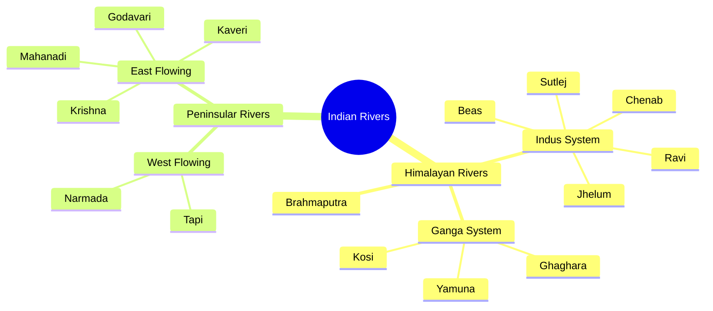
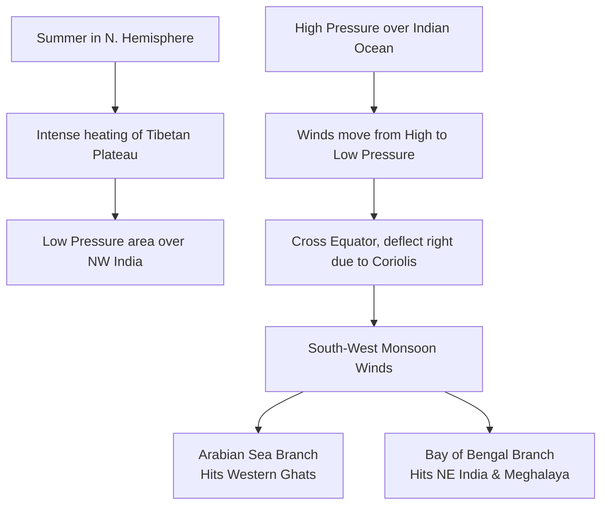

  <h3 style="color: var(--accent); margin-bottom: 16px; border-bottom: 1px solid var(--border); padding-bottom: 8px; display: flex; align-items: center; gap: 8px; font-weight: 600;">INDIAN GEOGRAPHY RESOURCES AND MCQS</h3>
  <h4 style="border-left: 3px solid var(--info); padding-left: 8px; margin-top: 24px; margin-bottom: 10px; color: var(--text-primary); font-weight: 600;">DEEP CONCEPTUAL EXPLANATION</h4>

70. Match the following List I (Phenomenons) List II (Dates) A. Summer Solstice 1. 21st June B. Winter Solstice 2. 22nd December C. Vernal Equinox 3. 23rd September D. Autumnal Equinox 4. 21st March 60. Which of the following statement(s) relating to earthquakes is/are correct? 1. The point of origin of earthquake is called epicenter.

2. The lines joining the places which were affected earthquake at the same point of time are called homoseismal lines.

Select the correct answer using the codes given below. (a) Only 1 (b) Only 2 (c) Both 1 and 2 (d) Neither 1 nor 2 66. Which of the following is/are the stage(s) of demographic transition? 1. High death rate and birthrate, low growth rate.

2. Rapid decline in death rate, continued low birthrate, very low growth rate.

3. Rapid decline in birthrate, continued decline in death rate.

4. Low death rate and birthrate, low growth rate.

Select the correct answer using the codes given below. (a) Only 1 (b) 1, 2 and 3 (c) 3 and 4 (d) 1 and 4 2014 (II) Codes A B C D A B C D (a) 1 4 (b) 1 2 4 3 (c) 3 2 (d) 3 4 2 1 71. Arrange the following features formed by rivers in its course starting from upstream.

1. Meanders 2. Falls 3. Delta 4. Oxbow Lake Select the correct answer using the codes given below.

(a) 2, 1, 3, 4 (b) 2, 1, 4, 3 (c) 1, 2, 3, 4 (d) 1, 4, 2, 3 61. ‘Population dividend’ refers to (a) total number of population (b) youthful age structure of a population (c) relatively high proportion of experienced aged people (d) migration from richer region to poorer region 72. Collision-Coalescence process of precipitation is applicable to (a) clouds which extend beyond freezing level (b) those clouds which do not extend beyond the freezing level (c) all types of clouds (d) cumulonimbus cloud 62. On 8th November, 2013, many people died in Philippines after a super typhoon ravaged the country. What was the name of the typhoon? (a) Haiyan (b) Utor (c) Phailin (d) Nesat 73. Baiji oil refinery is located at (a) Iran (b) Iraq (c) South Sudan (d) Russia Directions (Q. Nos. 74-75) The following items consist of two statements, Statement I and Statement II. You are to examine these two statements carefully and select the answers to these items using the codes given below.

63. Which of the following is/are direct source(s) of information about the interior of the Earth? 1. Earthquake wave 2. Volcano 3. Gravitational force 4. Earth magnetism Select the correct answer using the codes given below.

(a) 1 and 2 (b) Only 2 (c) 3 and 4 (d) All of these 67. Plate tectonics is a scientific theory that describes the large scale motions of Earth’s lithosphere. Which one among the following statements regarding plate tectonics is not correct? (a) Tectonic plates are composed of Oceanic lithosphere and thicker Continental lithosphere. (b) Tectonic plates are able to move because the Earth’s lithosphere has a higher strength than the underlying asthenosphere. (c) The Earth’s lithosphere is broken up into tectonic plates.

(d) Along divergent plate boundaries, subduction carries plates into the mantle.

68. MONEX is associated with (a) Montreal experiment (b) monetary experiment (c) lunar experiment (d) monsoon experiment 69. Consider the diagram given below 1012 mb 1020 mb 64. Which one of the following is depositional landform? (a) Stalagmite (b) Lapis (c) Sinkhole (d) Cave 998 mb Codes (a) Both the statements are individually true and Statement II is the correct explanation of Statement I (b) Both the statements are individually true, but Statement II is not the correct explanation of Statement I (c) Statement I is true, but Statement II is false (d) Statement I is false, but Statement II is true 74. Statement I A tsunami is a series of water waves caused by displacement of a large volume of water of an ocean.

The diagram represents the pressure conditions of three different places, viz,. A, B and C. Which of the following is the correct direction of movement of winds? (a) Blow from B towards A and C.

(b) Blow from C towards A and B.

(c) Blow from B to A and from A to C.

(d) Blow from B to C and C to B.

Statement II A tsunami can be generated when thrust faults associated with convergent or destructive plate boundaries move abruptly.

65. Which of the following statements regarding the duration of day and night is correct? (a) Difference is least near the Equator and progressively increases away from it (b) Difference is maximum at the Equator and progressively decreases away from it (c) Difference is least at the Tropics and progressively increases towards the Equator and Poles (d) Difference is maximum at the Tropics and progressively decreases towards the Equator and Poles GENERAL STUDIES 75. Statement I The Atacama is the driest among the deserts of the World.

83. The Earth without rotational movement would result into 1. no Sun-rise and Sun-set.

2. no occurrence of day and night cycle.

3. only one season.

Select the correct answer using the codes given below. (a) Only 1 (b) 1 and 2 (c) 2 and 3 (d) All of these 84. Match the following 79. In the absence of Cold Labrador Current, which one among the following would happen? (a) There will be no North-East Atlantic fishing grounds (b) There will be no North-West Atlantic fishing grounds (c) There will be no fishing ground in the North Atlantic ocean (d) Semi-arid condition of the Atlantic coast of the USA and Canada would prevail 80. Match the following List I (Ocean Currents) List II (Locations in Map) List I (Ocean Currents) List II (Coasts) A. Guinea current B. Oyashio current A.

Humboldt 1. Namibia-Angola B.

North Atlantic Drift 2. Chile-Peru C. Canaries current D. Kuroshio current Statement II The aridity of the Atacama is explained by its location between two mountain chains of sufficient height to prevent moisture advection from either the Pacific or the Atlantic Ocean.

76. Which among the following is/are correct statement(s) about Malawi? 1. Malawi is a landlocked country in South-East Africa that was formerly known as Nyasaland.

2. It has presidential system with unitary form of government.

3. Malawi’s economy is highly dependent on agriculture and majority of the population is rural.

Select the correct answer using the codes given below. (a) Only 1 (b) 2 and 3 (c) All of these (d) 1 and 3 C. Benguela 3. Mozambique- Madagascar D. Agulhas 4. Norway-United Kingdom Codes A B C D A B C D (a) 2 1 (b) 2 4 1 3 (c) 3 4 (d) 3 1 4 2 2015 (I) Codes A B C D A B C D (a) 4 3 (b) 2 3 1 4 (c) 2 1 (d) 4 1 3 2 85. Arrange the following layers of atmosphere vertically from the surface of the Earth 1. Mesosphere 2. Troposphere 3. Stratosphere 4. Thermosphere Codes (a) 1, 2, 3, 4 (b) 2, 1, 3, 4 (c) 2, 3,1, 4 (d) 3, 4, 2, 1 Directions (Q. Nos. 81-82) The following items consist of two statements, Statement I and Statement II. You are to examine these two statements carefully and select the answers to these items using the codes given below. 2015 (II) 77. Seismic gaps are (a) parts of plate boundaries in oceans where tsunamis occur frequently (b) sections of plate boundaries that have ruptured repeatedly in the recent past (c) sections of plate boundaries that have not ruptured in the recent past (d) plate boundaries having no volcanic activity 78. Consider the contour plot given below Codes (a) Both the statements are individually true and Statement II is the correct explanation of Statement I (b) Both the statements are individually true, but Statement II is not the correct explanation of Statement I (c) Statement I is true, but Statement II is false (d) Statement I is false, but Statement II is true 86. Which one of the following is the pattern of circulation around a low pressure area in the Northern hemisphere? (a) Counter-clockwise and away from the centre (b) Clockwise and away from the centre (c) Counter-clockwise and towards the centre (d) Clockwise and towards the centre 81. Statement I Tides are the rise and fall of sea levels caused by the combined effects of the gravitational forces exerted by the Moon and the Sun and the rotation of the Earth.

Contour in Metres Statement II The Earth rotates from the West towards the East once in 24 hours with respect to the Sun.

82. Statement I Sideral day is shorter than Solar day.

87. Which one of the following statements about the atmosphere is correct? (a) The atmosphere has definite upper limits, but gradually thins until it becomes imperceptible (b) The atmosphere has no definite upper limits, but gradually thins until it becomes imperceptible (c) The atmosphere has definite upper limits, but gradually thickens until it becomes imperceptible (d) The atmosphere has no definite upper limits, but gradually thickens until it becomes imperceptible Statement II The motion of the Earth in its orbit around the Sun is termed as revolution.

The above contours of an area indicate several relief features. Which one among the following relief features is not depicted here? (a) Steep slope (b) River valley (c) Conical hill (d) Gentle slope Codes A B C D A B C D (a) 2 1 (b) 2 3 1 4 (c) 4 3 (d) 4 1 3 2 92. Match the following 3. Rainy and dry seasons are found in both the climates. Select the correct answer using the codes given below.

(a) Only 1 (b) 2 and 3 (c) 1 and 3 (d) All of these List I (Weathering Types) List II (Landforms/ Processes) A. Chemical weathering 1. Till B. Mechanical weathering 2. Oxidation C. Glacial deposits 3. Plant roots D. Deposition by ground water 4. Stalactite 88. Which one of the following statements is correct? (a) Cold fronts move at slower rate than warm fronts and therefore, cannot overtake the warm fronts (b) Cold fronts normally move faster than warm fronts and therefore, frequently overtake the warm fronts (c) Cold fronts move at slower rate and eventually, they are overtaken by the warm fronts (d) Cold fronts move faster than warm fronts, but they cannot overtake the warm fronts 96. Which one of the following is the correct sequence of the given planets in increasing order of their size (diameter)? (a) Mars, Venus, Earth, Mercury, Uranus (b) Mercury, Mars, Venus, Earth, Uranus (c) Mercury, Mars, Venus, Uranus, Earth (d) Venus, Mercury, Mars, Earth, Uranus 89. Statement I The Kuroshio is a warm North-flowing ocean current on the West side of the North Pacific ocean. Statement II Presence of a number of volcanoes at the bottom of the sea of Japan is responsible for the Kuroshio becoming warm.

97. Which of the following statement(s) is/are correct? 1. The Earth is nearest to the Sun at Perihelion, which generally occurs on 3rd January.

2. The Earth is farthest away from the Sun at Perihelion, which generally occurs on 4th July.

3. The Earth is farthest away from the Sun at Aphelion, which generally occurs on 4th July.

4. The Earth is nearest to the Sun at Aphelion, which generally occurs on 3rd January.

Select the correct answer using the codes given below. (a) Only 1 (b) 2 and 4 (c) 1 and 3 (d) 1 and 2 Codes (a) Both the statements are individually true and Statement II is the correct explanation of Statement I (b) Both the statements are individually true, but Statement II is not the correct explanation of Statement I (c) Statement I is true, but Statement II is false (d) Statement I is false, but Statement II is true 98. Which one of the following is the cause of long-term sea-level change? (a) Atmospheric disturbance (b) Change in marine water density (c) Melting of icebergs (d) Melting of ice sheets 90. Which of the following elements are found in highest and lowest quantities respectively in the crust of the Earth? (a) Oxygen and silicon (b) Calcium and sodium (c) Sodium and magnesium (d) Oxygen and magnesium 91. Match the following List I (Climates) List II (Characteristics) 99. Which one of the following is the reason due to which the wind in the Southern hemisphere is deflected towards its left? (a) Difference in the water masses of Northern and Southern hemisphere (b) Temperature and pressure variations (c) Inclined axis of the Earth (d) Rotation of the Earth Codes A B C D A B C D (a) 2 3 (b) 2 1 3 4 (c) 4 1 (d) 4 3 1 2 93. If a ship has to go from Chennai to Kochi, it has to go around Sri Lanka rather than crossing through the Palk Strait. Why? (a) The Palk Strait has disputed islands and the Sri Lankan Navy does not allow the ships to cross through (b) It is too shallow for ships to cross (c) Shipping is prohibited through the strait due to its religious significance connected with the epic Ramayana (d) The around Sri Lanka route is actually shorter than crossing through the Palk Strait 94. Which of the following facts are related to Burma (Myanmar)? 1. It shares its borders with India, China, Bangladesh and Vietnam.

2. It is ruled by a military government.

3. The National League for Democracy was not allowed to contest the elections held in the year 2010.

4. Myanmar is a member of ASEAN.

Select the correct answer using the codes given below. (a) 1 and 3 (b) 3 and 4 (c) 1, 2 and 4 (d) 1 and 2 2016 (I) 100. The ‘eye’ of the cyclone has (a) abnormally high temperature and lowest pressure (b) abnormally low temperature and pressure (c) clear sky and lowest temperature (d) dense cloud cover and low pressure A. Mediterranean 1. Temperature cycle is moderated by marine influence B. Marine West Coast 2. Warm summers and cold winters with 3 months below freezing. Very large annual temperature range C. Dry Mid-Latitude 3. Strong temperature cycle with large annual range. Warm summers to hot and cold winters to very cold D. Moist Continental 4. Temperature range is moderate with warm to hot summers and mild winters 101. Stalactites and stalagmites are features of (a) glacial topography (b) volcanic topography (c) karst topography (d) fluvial topography 95. Which of the following statements regarding Mediterranean and Monsoon climate is/are correct? 1. Precipitation in Mediterranean climate is in winter while in Monsoon climate it is mostly in summer.

2. The annual range of temperature in Mediterranean climate is higher than the Monsoon climate.

GENERAL STUDIES ANSWERS Practice Exercise Questions from CDS Exam (2012-16) Indian Standard Time (IST) • India has only one standard time.

• India is 5.5 hours ahead of GMT/UTC, 4.5 hours behind Australian Eastern standard time and 10.5 hours ahead of American Eastern standard time.

India occupies a South-Central position in the Asian continent, looking across the Arabian sea to Arabia and Africa on the West and across Bay of Bengal to Myanmar, Malaysia and the Indonesian Archipelago on the East. Geographically, the Himalayan ranges keep India apart from the rest of Asia. India derives her name from river Indus.

• The 821 ° E longitude that passes through Allahabad city is Location choosen as standard longitude for Indian standard time.

RELIEF AND PHYSIOGRAPHIC DIVISIONS India is often described as a tropical country although a large part of India lies in sub-tropics. The territorial limits of the Indian mainland extend between 8° 4´ N and 37° 6´ N latitudes and 68° 7´ E and 97° 25´ E longitudes. Area and Extent • India ranks 7th in the world in terms of area after Russia, Canada, USA, China, Brazil and Australia. Physiography is the branch of geography, which studies the present relief features of the Earth’s surface or of natural features in their causal relationships. The physiographic diversity of India embraces fold mountains, flat plains and one of the oldest plateaus of the world.

India is divided into five physiographic units :

• It has a total land area of about 3287263 sq km, i.e.

about 33 lakh sq km.

1. The Himalayas • It is second largest in terms of population and holds 17.4% of the total world population, the land area of India amounts only to 2.4% of the total world landmass.

The Northern mountain wall is a series of high mountain ranges stretching over the Northern borders of India.

• India is the second largest country in Asia both in terms of area as well as population, after China.

• The geologically young and structurally fold mountain ranges, the Himalayas run in West-East direction from the Indus to the Brahmaputra.

The States Having Common Frontiers with Neighbouring Countries Country States • They form an arc, which covers a distance of about 2400 km. Their width varies from 400 km in Kashmir to 150 km in Arunachal Pradesh. Pakistan Jammu and Kashmir, Punjab, Rajasthan, Gujarat China Jammu and Kashmir, Himachal Pradesh, Uttarakhand, Sikkim, Arunachal Pradesh Nepal Uttarakhand, Uttar Pradesh, Bihar, West Bengal, Sikkim Bhutan Sikkim, West Bengal, Assam, Arunachal Pradesh Myanmar Arunachal Pradesh, Nagaland, Manipur, Mizoram Bangladesh West Bengal, Meghalaya, Assam, Tripura, Mizoram • State with longest coastline is Gujarat.

• Active volcanoes are in Barren island in Andaman and Nicobar islands.

• Northern most point of India is Indira Col.

• Southern most point is Indira point or Pygmalion point in Great Nicobar.

• Southern most tip of mainland is Kanyakumari.

• Eastern most point is Kibithu, Arunachal Pradesh.

• Western most point is Guhar moti in Kutch, Gujarat.

• The altitudinal variations are greater in the Eastern half than those in the Western half.

The Himalayas range is classified into four longitudinal series of mountains, which are as follow i. Trans-Himalayas North of the Greater Himalayas lie the Trans-Himalayas or the Tibet Himalayas. This section is older than Himalayas. This range acts as a watershed between rivers flowing towards South and those flowing towards North. These ranges are about 40 km wide and rise in height upto 5000 m. They include the Karakoram, Zanskar and Ladakh ranges. ii. Greater Himalayas or Himadri The Northern most important range is known as the Great or Inner Himalayas or the Himadri. iii. Himachal Himalayas The range lying to the South of the Himadri, forms the most rugged mountain system and is known as Himachal or Lesser Himalayas or Middle Himalayas.

GENERAL STUDIES Name State Features Rohtang pass Himachal Pradesh It is a high mountain pass on Eastern Pir Panjal range of the Himalayas around 51 km from Manali. It connects the Kullu of Himachal Pradesh, India. Shipki La Himachal Pradesh The river Sutlej enters India through this pass. Jelep La Sikkim Jelep La is a high mountain pass between India and Tibet in East Sikkim District of Sikkim. The famous Menmecho lake lies below the Jelep La pass.

iv. Shivaliks The outermost range of the Himalayas is called the Shivaliks. They extend over a width of 10-50 km and have an altitude varying between 900 and 1100 m. These ranges are composed of unconsolidated sediments brought down by rivers from the main Himalayan ranges located in North. v. The Purvanchal After crossing the Dihang Gorge, the Himalayas take a sudden Southward turn and form a series of comparatively low hills in the shape of crescent with it’s convex side pointing towards the West. These hills are known as Purvanchal. Nathu La Sikkim It connects the Indian State of Sikkim with China’s tibet autonomous region.

IMPORTANT PEAKS G Highest mountain peak in India K2 or Godwin Austin (PoK). Lipulekh pass Uttarakhand It is a Himalayan pass connecting the Kumaon region of Uttarakhand in the Pithoragarh district in India with the old trading town of Talakot in Tibet. G Highest peak of India in Himalaya is Kangchenjunga.

G Highest peak in Eastern Ghats Arma Konda (AP).

2. The Great Indian Plain G Highest mountain peak in Western ghats Annaimudi.

G Highest peak in Aravali is Gurushikhar in Mount Abu.

• To the South of Himalayas and North of Peninsula lies the Great Plain of North India. It is an aggradational plain formed mainly by the work of 3 rivers systems viz, the Indus, the Ganga and the Brahmaputra.

G Highest peak in Satpura and Mahadeo hills Dhupgarh.

G Highest peak in Nilgiris Doda Betta.

G Highest peak in Andaman and Nicobar Islands Saddle Peak.

• This is the largest alluvial tract of the world, extending for a length of 3200 km and width varies between 150 to 300 km.

Regional division of Great Plain of India are as follows : G Highest peak of Naga hills Saramati Peak. Punjab-Haryana Plain Mountain Passes of India Name State Features • The western part of the Northern Plain is known as Punjab-Haryana Plain. Its Eastern boundary in Haryana is formed by the Yamuna river. It also includes North-Eastern part of Rajasthan.

• Depositional processes by the rivers continuing since long, has united these doabs. However, this mass of alluvium is broken by bluffs, locally known as Dhayas.

Banihal pass Jammu and Kashmir Banihal pass is a pass across the Pir Panjal range at 2832 m. This mountain range separates the Kashmir valley in the Indian state of Jammu and Kashmir from the outer Himalayas and plains to the South. Changla pass Jammu and Kashmir Highest mountain pass in Ladakh. The Changla is on the route to Pangong lake from Leh. Ganga Plain This is the largest unit of Great Plain of India. Depending upon its geological variations, this plain can be furthur sub-divided into the following three divisions :

(i) Upper Ganga Plain Khardung La Jammu and Kashmir Khardung La is historically important as it lies on the major caravan route from Leh to Kashgar in Central Asia. Namika La Jammu and Kashmir Namika La is one of two high passes between Kargil and Leh, the other is the even higher Fotu La pass.

• Compacting the upper part of Ganga plain, this plain is delimited by 300 m contour in Shiwaliks in the North, the Peninsular body in the South and course of Yamuna river in the West and 100 m contour in East.

• The gradient is comparatively steeper in the North.

(ii) Middle Ganga Plain Zoji La pass Jammu and Kashmir Zoji La is a high mountain pass in India, located on the Indian National Highway-1 between Srinagar and Leh in the Western sections of mountain range.

• To the East of upper Ganga plain, lies middle Ganga plain occupying Eastern part of Uttar Pradesh and Bihar.

Bara-lacha La Himachal Pradesh Also known as Bara-lacha pass. Highest mountain pass in Zaskar range connecting Lahaul district in Himachal Pradesh to Ladakh in Jammu and Kashmir.

• This plain is drained by the Ghaghara, the Gandak and the Kosi rivers.

Hill Ranges of Peninsula The Aravalli Ranges • Major unit of this plain are Ganga-Ghaghara doab, Ghaghara- Gandak doab and Gandak-Kosi doab (Mithila plain). valley, divides the region into two parts namely, the Central Highlands in its North and the Deccan plateau in its South. (iii) Lower Ganga Plain • It runs North-East to South-West for 800 km from Delhi through Rajasthan to Palanpur in Gujarat.

Plateaus of Peninsular India The Deccan Plateau • It has a lower elevation between Delhi and Ajmer, where it is characterised by a chain of discontinuous ranges.

• Some districts of Bihar and whole of West Bengal are part of this plain. The Northern part of this plain has been formed by sediment deposited by the Tista, Jaldhaka and Torsa.

• It is the largest unit of the Peninsular plateau of India with an elevation of 600 m. It is higher in the South than in its North.

• Gurushikhar (1722 m) is the highest peak of the range, located in Abu hills of Rajasthan.

The Vindhyan Ranges • This area is marked by drawn and barren plain, a tract of old alluvium between Kosi-Mahananda corridor in the West and the river Sankosh in the East.

• It generally slopes from West to East and various big rivers of Southern India like Godavari, Krishna, Kaveri etc flow through it.

• It runs parallel to the Narmada Rift valley as an escarpment in an East-West direction from Jobat in Gujarat to Sasaram in Bihar for a distance of 1200 km.

The Satpura Ranges • The delta formation accounts for about two-thirds of this plain. This is the largest delta in the world. Large part of the coastal deltas is coverd by thick inaccessible tidal forests called Sunderbans.

• Karnataka plateau with Archean formations lies to the South of Maharashtra plateau having rocks of lava origin in Northern Karnataka called Malnad region and the rest of the red soil region of the plateau called Maidan.

Brahmaputra Plain Meghalaya Plateau • It is a series of seven mountains that run in the East-West direction in between Narmada and Tapi rivers. It is an example of block mountain.

• Amarkantak is meeting point of Vindhyan and Satpura range.

• It is extension of peninsular plateau, which has been separated by huge fault. Fault is between Rajmahal hills and Meghalaya plateau.

The Eastern Ghats The Chotanagpur Plateau • Western boundary of these plains are formed by Indo-Bangladesh border as well as boundary of lower Ganga plain. The Brahmaputra river enters this plain near Sadiya and flows further to Bangladesh after turning Southwards near Dhubri.

• These are discontinuous and irregular and dissected by rivers draining into the Bay of Bengal.

• It lies East of Baghelkhand in the state of Jharkhand covering some parts of Chhattisgarh and West Bengal. Its average elevation is 700 m above sea level.

• There are large marshy tracts in this region and Southern tributaries of Brahmaputra also have meandering course and there are good number of bhils and ox-bow lakes.

• The Eastern ghats stretch from the South of Mahanadi valley to the Nilgiris in the South. The Eastern ghats are comparatively broader and do not form a continuous water divide.

• It is the storehouse of minerals and a large scale mining of iron, manganese, coal, uranium etc is done in this region.

The Western Ghats or Sahyadris 3. The Peninsular Plateau • Damodar river valley is well-known for its coal deposits. The Malwa Plateau • Sahyadris form the Western edge of the Deccan plateau and lie parallel to the Western coast.

They form a continuous water divide.

• Largely in Western Madhya Pradesh and South-Eastern Rajasthan forms a triangular shape and is typical for having two systems of drainage.

The Marwar Uplands • It run continuously for 1600 km from Maharashtra to Kanyakumari and can be crossed through passes only.

• The Peninsular plateau is a tableland composed of mainly Archean gneisses and schists. It was formed due to the breaking and drifting of the Gondwana land and thus making it a part of the oldest landmass. This region of the country is surrounded on three sides by water and thus is a Peninsular plateau.

• The Marwar uplands of Eastern Rajasthan lie to the East of Aravalli ranges. They are made up of sandstones and limestones of the Vindhyan period.

• Highest mountain peak in Western ghat is Annaimudi. The Western ghats are higher than the Eastern ghats.

• The plateau has broad and shallow valleys and rounded hills. Narmada river, which flows into a Rift GENERAL STUDIES 4. The Coastal Plains • The islands North of 11° N latitude are known as Amindivi islands and those South of it are Cannanore islands.

• It originates from a glacier near Bokhar Chu in the Tibetan region near Mansarovar lake. In Tibet, it is known as Singi Khamban or Lion’s mouth.

The Peninsular plateau is flanked by stretch of narrow coastal strips, running along the Arabian sea on the West and the Bay of Bengal on the East. Andaman and Nicobar Islands Eastern Coastal Plains • The plains along the Bay of Bengal, i.e. the Eastern coastal plains are wide and level.

• In Jammu and Kashmir, its Himalayan tributaries are Zanskar, Dras, Gartang, Shyok, Shingar, Nubra, Gilgit etc. Its most important tributaries, which join Indus at various places, are Jhelum, Chenab, Ravi, Beas and Sutlej.

The Ganga River System • Andaman and Nicobar archipelago has been formed by the extension of the tertiary mountain chains of Arakan yoma. These islands lie close to equator and experience equatorial climate and have thick forest cover. Some of the islands are fringed with coral reefs.

• In the Northern part, they are referred to as the Utkal plains and Northern Circars, while the Southern part is known as the Coromandel coast.

Western Coastal Plains • It run almost parallel between Sahyadris and Arabian sea, from Kanyakumari to Surat.

• The Ganga system is the second major drainage system of India. It rises in the Gangotri glacier near Gaumukh (3900 m) in the Uttarakhand. Here, it is known as the Bhagirathi. At Devprayag, the Bhagirathi, meets the Alaknanda, hereafter, it is known as the Ganga.

• The entire group of islands is divided into two broad categories–The Andamans in the North and the Nicobars in the South. The Great Andaman group of islands in the North is separated by the Ten Degree Channel from the Nicobar group in the South.

• North to South it has seen classified as Kathiawar plain, Konkan plain, Karnataka plain and Malabar plain along the Kerala coast.

Rajasthan Desert DRAINAGE SYSTEM OF INDIA • Also known as Thar or Great Indian desert, which covers Western Rajasthan and the adjoining part of Pakistan. Desert is called Marusthali.

• The Alaknanda has its source in the Satopanth glacier above Badrinath. The Alaknanda consists of the Dhauli and the Vishnu Ganga, which meet at Joshimath or Vishnu Prayag. The other tributaries of Alaknanda such as the Pindar joins it at Karna Prayag, while Mandakini or Kali Ganga meets it at Rudra Prayag.

• India is blessed with hundreds of large and small rivers, which drains the length and breadth of the country. Water drains in two direction of the main water divide line of India. 90% of land water drains into Bay of Bengal and the rest drains into Arabian sea.

• The Eastern part of the Marusthali is rocky, while its Western part is covered by shifting sand dunes locally called dhrian.

• The Indian rivers are divided into following two major groups i. The Himalayan Rivers ii. The Peninsular Rivers • The left bank tributaries of Ganga are Ramganga, Gomti, Kali or Sharda, Gandak, Kosi and Mahanadi. The right bank tributaries of Ganga are Yamuna and Son. Yamuna joins the Ganga at Allahabad.

• The Eastern part of Thar desert upto Aravalli range is semi-arid plain, which is known as Rajasthan Bagar. It is drained by a number of seasonal streams creating fertile tracts locally known as Rohi.

The Himalayan Rivers 5. The Islands The Himalayan river system is divided into three major river system, which are as follow • Kosi is called as ‘Sorrow of Bihar’ while Damodar is called as ‘Sorrow of Bengal’ as these cause floods in these regions. Hooghly is a distributory of Ganga flowing through Kolkata. The Indus River System Apart from the large number of islands in the near proximity of the Indian coast, there are two main groups of islands in the Indian Ocean far away from the coast. The Brahmaputra River System Lakshadweep Islands • These islands group lies close to the Malabar coast of Kerala. This group of 25 islands is composed of small coral islands.

• It is one of the largest river of the world. It is known as Tsangpo in Tibet, Dihang or Siang in Arunachal Pradesh, Brahmaputra in Assam and Jamuna in Bangladesh.

• The Indus, also known as Sindhu, is the Western most of Himalayan rivers in India. It is one of the largest river basins of the world covering an area of 1165000 sq km (in India it is 321289 sq km) and a total length of 2880 km (in India 1114 km).

List of the Projects, State and Location Name of Dam State River Srisailam Dam Andhra Pradesh Krishna River Ukai Dam Gujarat Tapti River • Brahmaputra forms largest number of riverine islands. Majuli is the largest riverine island in the world. The combined stream of Ganga and Brahmaputra forms the biggest delta in the world, the Sunderbans, covering an area of 58752 sq km. Its major part is in Bangladesh. Pandoh Dam Himachal Pradesh Beas River Bhakra Nangal Dam Himachal Pradesh Sutlej River and Punjab Border • Brahmaputra is volume wise largest river of India, whereas lengthwise Ganga is the longest in India.

Tributaries of river are–Manar, Subanshri, Dibang and Lohit. Nathpa Jhakri Dam Himachal Pradesh Sutlej River Chamera Dam Himachal Pradesh Ravi River The Peninsular River System Baglihar Dam Jammu and Kashmir Chenab River Uri Hydroelectric Dam Jammu and Kashmir Jhelum River Maithon Dam Jharkhand Barakar River • The Peninsular drainage system is older than the Himalayan one. A large number of the Peninsular rivers are seasonal, as their flow is dependent on rainfall. Panchet Dam Jharkhand Damodar River Tungabhadra Dam Karnataka Tungabhadra River Krishna Raja Sagara Dam Karnataka Kaveri River • Most of the major rivers of the Peninsula such as Mahanadi, Godavari, Krishna and Cauvery flow Eastwards and drain into the Bay of Bengal. These rivers make deltas at their mouths.

Idukki Dam Kerala Periyar River Parambikulam Dam Kerala Parambikulam River Mullaperiyar Dam Kerala Periyar River Bargi Dam Madhya Pradesh Narmada River Bansagar Dam Madhya Pradesh Sone River Gandhi Sagar Dam Madhya Pradesh Chambal River • Narmada and Tapi are the only long rivers, which flow Westward and make estuaries rather than making a delta because of their swift flow and steep slopes. The drainage basins of the Peninsular rivers are comparatively smaller in size. Lakes Koyna Dam Maharashtra Koyna River Indravati Dam Odisha Indravati River Hirakud Dam Odisha Mahanadi River Mettur Dam Tamil Nadu Kaveri River Uttar Pradesh Rihand River Govind Ballabh Pant Sagar Dam also Rihand Dam A lake is an area of variable size that is filled with water and surrounded by land. Lakes from due to receding glaciers, plate tectonics, volcanism, meandering rivers, landslides and human damming. Man-made lakes are referred as reservoirs. Facts related to Indian lakes are given below Tehri Dam Uttarakhand Bhagirathi River RESERVOIRS Himayat Sagar Reservoir Telangana Osman Sagar Gobind Sagar Reservoir Himachal Pradesh Sutlej River Maharana Pratap Sagar Reservoir Himachal Pradesh Pong Dam Lake Salal Project Jammu and Kashmir Chenab River Chutak Hydroelectric Project Jammu and Kashmir Indirasagar Project Madhya Pradesh Narmada River Narmada Dam Project Madhya Pradesh Narmada River Rihand Project Uttar Pradesh Rihand River and Son River • Wular lake (Jammu and Kashmir) is the largest fresh water lake in India. Tulbul Navigation Project is located on this.

• Sambhar, Didwana, Lunkaransar, Panchpadra are some of the important saline lakes of Rajasthan.

• Ukai reservoir (Gujarat) is a man-made lake on river Tapi. Ranapratap Sagar and Jawahar Sagar (Rajasthan) and Gandhi Sagar (Madhya Pradesh) are located on river Chambal. Govind Sagar (Himachal Pradesh) is a huge reservoir.

• Nagarjuna Sagar (Andhra-Telangana) on river Krishna, Nizam Sagar (Telangana) on Manjra and Tungabhadra (Karnataka) on Tungabhadra are man-made lakes.

THE CLIMATE OF INDIA • Govind Ballabh Pant Sagar (Chhattisgarh-Uttar Pradesh) has been constructed on Rihand. Stanley reservoir is located in Tamil Nadu on Kaveri.

• Loktak lake (Manipur) is the largest fresh water lake in North-Eastern India. Keibul Lamjao is a floating national park located inside the lake.

• India has tropical monsoon type of climate. It is greatly influenced by the presence of Himalayas in the North as they block the cold masses from Central Asia. It is because of Himalayas that the monsoons shed their water in India.

• Chilika lake (Odisha) is the largest lagoon in India.

Kolleru lake (Andhra Pradesh) is a lake located around delta region. Pulicat lake (Andhra Pradesh) is a lagoon.

• Vembanad is located in Kerala. Lonar lake is a crater lake located in Buldhana, Maharashtra.

• The Tropic of Cancer (23.5°N) divide India into two almost equal climatic zones, namely; the Northern zone (sub-tropical) and the Southern zone (tropical).

GENERAL STUDIES Indian vegetation can be divided into the following groups Tropical Forests Tropical forests are divided into–Moist Forest and Dry Forest • The warm temperature or the sub-tropical climate of the Northern zone gives it cold winter seasons and hot summer seasons. The Southern tropical climate zone is warmer than the North and does not have a clear cut winter season. Moist Forest • It include areas—along the Western ghats surrounding the belt of evergreen forests, a strip along the Shiwalik range including Terai and Bhabar from 77°E to 88°E, hills of Eastern Madhya Pradesh, Chhattisgarh, Chhotanagpur and part of Odisha and West Bengal.

Moist forest can be classified as :

Tropical Wet Evergreen Forests • The Southern zone has the midday Sun almost vertically overhead at least twice every year and the Northern zone does not have the mid-day Sun vertically overhead during any part of the year.

• Species of trees found in this forests are teak, sal, laurel, white chuglam, badam, mahua and bamboo etc.

Littoral and Swamp Forests • It is found in the areas where the annual rainfall exceeds 250 cm.

• These forests occur in and around the deltas, estuaries and creeks.

• The annual temperature is about 25°-27°C, the average annual humidity exceeds 77% and the dry season is distinctly short.

• There are various factors which influence the climate of India. Location and latitude plays an important role in affecting climate of India. Tropic of Cancer divides, India into tropical and sub-tropical climatic regions. Indian ocean influences the climate of peninsular.

• Species of trees found are—sundari, rhizophora, srwpines, sonnoratic etc.

• These forests can survive and grow both in fresh as well as brackish water.

Dry Forest Dry forest can be classified as :

• It includes areas—the Western side of the Western ghats, a strip running from North-East to South-West direction across Arunachal Pradesh, upper Assam, Nagaland, Andaman and Nicobar Island mahogony, eboagle.

Tropical Dry Evergreen Forests • Himalayan range protects India from bitterly cold and dry winds from Central Asia and moreover acts as barrier in bringing monsoonal rainfall. Heating of interior part during summer attracts monsoon winds and cause monsoon rainfall. In winter Western disturbance cause snowfall in mountains and rainfall in plains. Seasons in India • Species of trees found in this forests are white cedar, mesua, jamun, hopea, mahogony, ebony etc.

• These are found along the coasts of Tamil Nadu, these forests occur in short stature.

Tropical Semi-Evergreen Forests • Annual rainfall is about 100 cm and the mean annual temperature is about 28°C. Indian climate is characterised by distinct seasonality. Indian Meteorological Department (IMD) has recognised the following four distinct seasons • These are found in the region where the annual rainfall is 200-250 cm.

• The mean humidity is about 15%, species of trees found here are khirni, jamun, tamarind, neem etc.

Tropical Dry Deciduous Forests • The mean annual temperature varies from 24°-27°C and the relative humidity is about 75%.

• These are similar to moist deciduous forests and shed their leaves in dry season.

i. The cold season or winter season.

ii. The hot weather season or summer season. iii. The South-West monsoon season or rainy season. iv. The season of the retreating monsoon or cool season.

• It includes areas—Western coast, Assam lower slopes of the Eastern Himalayas, Odisha and Andamans.

• These forests can grow in areas of even less rainfall of 100-150 cm per annum.

• Species of trees—aini, semul, kadam, rosewood, kusum etc.

NATURAL VEGETATION OF INDIA • Species of trees— teak, axlewood, tendu, palas, bel etc. Tropical Moist Deciduous Forests Tropical Thorn Forests • These are found in the areas having rainfall of 100 to 200 cm per annum.

• These forests generally occur in the area of low rainfall and high temperature.

• Species of trees found are—Khair, Neem, Babul, Cacti, Palas etc.

• Mean annual temperature of about 27°C the average relative humidity of 60 to 70%.

India is a land of great variety of natural vegetation. Himalayas are marked with temperate vegetation; Western Ghats and Andaman and Nicobar islands have tropical rain forests; deltaic regions have tropical forests and mangroves; desert and semi desert areas are known for variety of bushes and thorny vegetation. Major Soils of India • The areas are North-Western parts of the country including Rajasthan, South-Western Punjab, Western Haryana, Kutch etc.

• They are found in the higher hills of Tamil Nadu and Kerala, in the Eastern Himalayan region to the East of 88° E longitude.

Himalayan Moist Temperate Forests On the basis of genesis, colour, composition and location, the soils of India have been classified into the following types Sub-tropical Forest Sub-tropical forest are of three types Alluvial Soil • These forests are mainly composed of coniferous species such as pines, cedars, silver, firs, spruce etc are most important trees. Sub-tropical Broad-leaved Hill Forests • These forests occur in the temperate zone of the Himalayas between 1500 and 3300 m. Rainfall varies from 150 cm to 250 cm.

• These forests occur in the Eastern Himalayas to the East of 88°E longitude at altitudes varying from 1000 to 2000 m.

Himalayan Dry Temperate Forests • They cover the largest area in India (40%) and is the most important soil from agricultural point of view. Alluvial soil is widespread in the Northern plains and the river valleys. Through a narrow corridor in Rajasthan, they extend into the plains of Gujarat.

• The mean annual rainfall is 75 cm to 125 cm, average annual temperature is 18°-21°C. They form luxurious forests of evergreen species.

• These are coniferous forests with xerophytic shrubs. Deodar, chilgoza, oak, olive etc are the main trees.

• Such forests are found in the inner dry ranges of the Himalayas.

• Species of trees—Oaks, Chestnuts, Sals and Pines (on lower and higher margin respectively) etc.

MANGROVES • They also occur in the Nilgiri and Palni Hills at 1070-1525 m above sea level. These forests are generally called shales.

• Geologically, the alluvium is divided into new alluvium which is known as Khadar and old alluvium, as Bhangar. The newer alluvium is sandy and light coloured, whereas, older alluvium is more clayey, dark coloured and contains lime concretions.

Sub-tropical Moist Pine Forests • They are found at the height of 1000 to 2000 m above sea level in the Western Himalayas between 73°E and 88°E longitudes.

• The conglomerate deposits in piedmont area are generally known as Bhangar. This soil is suitable for rice, wheat, sugarcane, oil seeds and jute cultivation.

• Chir is the most dominant tree.

Sub-tropical Dry Evergreen Forests Black Soil/ Regur Soil Mangroves are very specialised forest ecosystem of tropical and sub-tropical regions of the world bordering sheltered sea-coasts. They occur all along the Indian coastline in the sheltered estuaries, tidal creeks, backwaters, salt marshes and mudflats. Mangroves are dominated by salt tolerant halophytic plants of diverse structure and are invaluable marine nurseries for a large variety of fish and other marine fauna. They support a large variety of birds, amphibians and many other local arboreal, benthic and water creatures.

• Found in the Bhabar, the Shivaliks and the Western Himalayas upto about 1000 m above sea-level.

Rainfall is between 50 to 100 cm.

• Olive, Acacia, Modesta and Pistacia are the important species of trees.

Temperate Forest Mangroves have a dense network of aerial roots, which help to aerate the root system and anchor the tree. Sundari is widespread in sunderbans, screw pines, canes and palms are common in deltas, cracks are often lined with Nipa.

• The principal region of black soil is the Deccan plateau and its periphery. This is formed from Deccan basalt trap rocks and occur in areas under the monsoon climate, mostly of semi-arid and sub-humid types.

Temperate forest is further divided into 3 types futher are of three types SOIL Montane Wet Temperate Forests • Soil is formed when rocks are broken down by the action of wind, water and climate. This process is called weathering.

• This soil is characterised by dark grey to black colour, high swelling and shrinkage, plasticity, deep cracks during summer and poor status of organic matter, nitrogen and phosphorus while this is rich in lime, iron, magnesia and alumina.

• The forests grow at a height of 1800 to 3000 m above sea level. The mean annual rainfall is 150 cm to 300 cm, the mean annual temperature is about 11°C-14°C and the average relative humidity is over 80%.

• Species of trees—deodar, chilauni, Indian chestnut, birch, blue pine etc.

• Impeded drainage and low permeability are the major problems. Cotton is mostly grown on this soil.

• Soil forms different layers of particles of different sizes called Horizons. Each layer is different from the other in thickness texture, colour and chemical composition.

GENERAL STUDIES Red and Yellow Soils Types of Farming productivity of the soil can be increased, which involves addition of organic matter and clay. Various geographical, physical and socio-economic factors are responsible for giving birth to different types of farming in different parts of the country.

• These soils are derived from granite, gneiss and other metamorphic rocks. These soils are formed under well drained condition. These soils are high textured and contain low soluble salts.

Swampy/Peaty Soil Peaty soil originate in areas of heavy rainfall, but inadequate drainage facility. This soil is usually found at the foot hills and extend in strips of varying widths at the foot of Himalayas in Jammu and Kashmir, Uttarakhand, Uttar Pradesh, Bihar and West Bengal.

• They are slightly acidic to slightly alkaline, well drained with moderate permeability. They are also poor in nitrogen, phosphorus, lime, humus etc.

Subsistence Farming Farmers cultivate small and scattered holdings with the help of draught animal and family members. The tools and techniques used are primitive and simple and main focus is on food crops. The farmers and his family members consume the entire farm production.

• Red soils cover a large part of Tamil Nadu, Karnataka, Andhra Pradesh, Telangana, Chhattisgarh, Jharkhand, Madhya Pradesh and Odisha.

Saline Soil Saline soil is formed due to accumulation of soluble salts which consists of chlorides and sulphates of calcium and magnesium. In India, areas around 7 million hectares are salt affected distributed in different states. Laterite Soil Forest Soil As the name suggests, forest soil is formed in the forest areas, where sufficient rainfall is available. The soil vary in structure and texture depending on the mountain environment where these are formed.

• Laterite soil is peculiar to India and some of the tropical countries where there is high temperature and heavy rainfall with alternating wet and dry periods. During rainfall silica is leached downwards and iron and aluminum oxide remains in the top layers.

Plantation Farming It involves growing and processing of a single cash crop purely meant for sale. It is capital intensive and the other necessary things needed are vast estate, managerial ability, technical know how, fertilizer, good transport facilities, processing factory etc. This type of agriculture is mainly practiced in Assam, sub-Himalayan West Bengal and in Nilgiri, Anaimalai and Cardamom hills in South. Soil Erosion and Degradation Shifting Agriculture • In hilly areas they are more acidic than that of low areas. They are less fertile and poor in humus, nitrogen, phosphate and calcium.

• Lateritic soils are found in Odisha, West Bengal, in some parts of Andhra Pradesh, Tamil Nadu, Kerala, Jharkhand and Maharashtra.

Desert Soil • The destruction of the soil cover is described as soil erosion, while decrease in its fertility is soil degradation. Wind and water are powerful agents of soil erosion because of their ability to remove soil and transport it.

• It is practised by the tribals in the forest areas of Assam, Meghalaya, Nagaland, Manipur, Tripura, Mizoram, Arunachal Pradesh, Odisha, Madhya Pradesh and Andhra Pradesh. In this type of agriculture, a piece of forest land is cleared mainly by tribal people with felling and burning of trees and crops are grown.

• Wind erosion is significant in arid and semi-arid regions. In regions with heavy rainfall and steep slopes, erosion by running water is more significant.

• In the North-Western part of India, desert soil occurs over the major parts of Rajasthan, South of Haryana and Punjab and Northern part of Gujarat. The soil in the plains are mostly derived from alluvium and pale brown to brown to yellow brown and fine sandy to loamy fine sand and is structureless.

• Dry paddy, buck wheat, maize, small millets, tobacco and sugarcane are the main crops grown under this type of agriculture. This is a very primitive method of cultivation which results in large scale deforestation and soil erosion especially on the foothill sides.

• The clay contents low and presence of alkaline Earth carbonates is an important feature. By increasing the water holding capacity, the AGRICULTURE IN INDIA India is a vast country endowed with a great variety of natural environments and thus provides conditions for a large number of crops to be grown in various parts.

Organic Farming Major Crops • A new trend of farming in which all input used for farming are natural, no chemicals are used.

• With varied types of climate relief, soil and with plenty of sunshine and long growing season, India is capable of growing almost each and every crop.

• Green manures and compost are used. Sikkim is the first organic state of India.

Cropping Seasons • Crops requiring tropical, sub-tropical and temperate climate can easily be grown in one or the other part of India. Indian crops are divided into the following categories : Three types of cropping seasons are found in India – Food Crops Rice, wheat, maize, millets, jowar, bajra, ragi, pulses, gram and tur.

Kharif It requires much water, long hot weather for their growth, grown in June with the arrival of South-East monsoon. e.g. rice, jowar, maize, cotton, groundnut, jute, tobacco, bajra, sugarcane, pulses etc. – Cash Crops Cotton, jute, sugarcane, tobacco, oilseeds, groundnut, linseed, sesamum, castorseed, rapeseed and mustard. Rabi Grown in winter, required cool climate during growth and warm climate during germination of seeds and maturation. Sowing is done in November and harvested in April-May. e.g. wheat, gram and oilseeds like, mustard and rapeseed etc.

– Plantation Crops Tea, coffee, spices, cardamom, chillies, ginger, turmeric, coconut and rubber. Zaid A brief cropping season practised in irrigated areas, sown in February- March, harvested in June. e.g. urad, moong, watermelons. – Horticulture Fruits Apple, peach, pear, apricot, almond, strawberry, mango, banana, citrus food and vegetables.

Major Crops of India Crops Temperature (0°C) Rainfall (cm) Soil Distribution Cash Crops Cotton 21-30 50-75 Black Soil Gujarat, Maharashtra, Punjab Jute 24-35 125-200 Sandy or Clayed Loams, Deep Rich West Bengal, Odisha, Bihar, Assam Sugarcane 20-26 Loamy Soil Uttar Pradesh, Maharashtra, Tamil Nadu Tobacco 15-38 Friable Sandy Soil Uttar Pradesh, Andhra Pradesh, Gujarat, Karnataka Food Crops Rice 24-27 Clayed and Loamy Soil West Bengal, Andhra Pradesh, Uttar Pradesh, Punjab Wheat 10-15 5-15 Light, Sandy, Clayed Loamy Soil Uttar Pradesh, Punjab, Haryana, Rajasthan Jowar 27-32 30-65 Black Clayed Loamy Soil Maharashtra, Karnataka, Madhya Pradesh Bajra 25-35 40-50 Loamy Soil Rajasthan, Uttar Pradesh, Haryana, Maharashtra, Gujarat Plantation Crops Tea 24-30 150-250 Loamy Forest Soil Kerala, Tamil Nadu, West Bengal, Assam Coffee 16-28 150-250 Friable Forest Loamy Soils Karnataka, Kerala, Tamil Nadu Rubber 25-35 Loamy Soils Kerala, Karnataka, Tamil Nadu Natural Resources RESOURCES • These resources are naturally occurring substances that are considered valuable in their relatively unmodified (natural) form. Human beings interact with the nature through technology and create institutions to accelerate their economic development. A resource is a source or supply from which benefit is produced. It is an economic or productive factor required to accomplish an activity or as means to undertake an enterprise and achieve desired outline.

• A natural resource’s value rests in the amount of the material available and the demand for it. The latter is determined by its usefulness to production.

Human Resources Classification of Natural Resources Natural resources are mostly classified into renewable and non-renewable resources :

• Human being themselves are essential components of resources. They transform material available in our environment into resources and use them.

• This is the set of individuals who make up the workforce of an organisation or economy. Human capital is sometimes used synonymously with human resources.

i. Renewable Resources These resources can renew themselves if they are not over harvested but used sustainably. The rate of sustainable use of renewable resource is determined by replacement rate and amount of standing stock of that particular resource. GENERAL STUDIES Non–Metallic Mineral Mines ii. Non-Renewable Resources It is a natural resource which are present in a fixed quantity and it cannot be used again once it gets exhausted. Non-Metallic Mineral Mines Limestone Found in Andhra Pradesh, Rajasthan, Madhya Pradesh, Gujarat, Chhattisgarh Mineral Resources Dolomite About 90% of the dolomite is found in Madhya Pradesh, Chhattisgarh, Odisha, Gujarat, Karnataka, West Bengal Asbestos Rajasthan, Andhra Pradesh and Karnataka Gypsum Found in Rajasthan, Jammu and Kashmir Graphite Occurs in Kalahandi, Bolangir (Odisha) and Bhagalpur (Bihar) • A mineral is an aggregate of two or more than two elements. A mineral has a definite chemical composition, atomic structure and is formed by inorganic processes. In economic geography, the term mineral is used for any naturally occurring material that is mined and is of economic value.

Energy Resources • Minerals generally occur in the Earth’s crust in the form of ore. The availability and per capita consumption of minerals is taken as an important indicator to assess the economic development of a country. India is a fast growing country and therefore, the demand for the energy is also continuously growing. India has exploited almost all the sources of energy such as hydroelectricity, thermal energy, nuclear energy, solar energy, wind energy etc. The Mineral Regions of India Energy Resources in India • The natural resources for electricity generation in India are unevenly dispersed and concentrated in a few pockets.

Hydro resources are located in the Himalayan foothills and in the North-Eastern Region (NER). Coal reserves are concentrated in Jharkhand, Odisha, West Bengal, Chhattisgarh, parts of Madhya Pradesh, whereas lignite is located in Tamil Nadu and Gujarat.

• North Eastern region, Sikkim and Bhutan have vast untapped hydro potential estimated to be about 35000 MW in NER, about 8000 MW in Sikkim and about 15000 MW in Bhutan.

Conventional Sources of Energy The mineral regions of India are as follow : The North-Eastern Peninsular Belt It comprises of Chota Nagpur plateau, Odisha plateau and West Bengal. It is the richest mineral belt of India. Coal and Iron are very abundant in the region. Central Belt It comprises of Chhattisgarh, Madhya Pradesh, Andhra Pradesh and Maharashtra. It contains deposits of manganese, bauxite, limestone, marble, coal, gems, mica, iron etc.

The Southern Belt It comprises Karnataka plateau but extends upto Tamil Nadu upland. It is rich in ferrous minerals and bauxite but lacks in coal deposits. The South-Western Belt It includes Southern Karnataka, Kerala and Goa. It has deposits of iron-ore, garnet and China clay, Monazite sand etc. The North-Western Belt It extends along the Aravalis in Rajasthan and in adjoining part of Gujarat. It is rich in non-ferrous minerals (copper, lead, zinc), uranium, mica, precious stones, aquamarine and emerald etc.

Metallic Mineral Mines Metallic Mineral Mines Iron Kemmangundi, Sandur and Hospet (Karnataka) Barbil-Koira (Odisha), Bailadila and Dalli-Rajhara (Chhattisgarh), North Goa Manganese Found in Karnataka, Odisha, Madhya Pradesh, Maharashtra Chromite Found in Odisha, Bihar, Karnataka, Maharashtra and Andhra Pradesh Copper Malanjkhand Belt (Balaghat, Madhya Pradesh), Khetri-Singhana Belt (Jhunjhun), Singhbhum (Jharkhand) Bauxite Found in Odisha,Gujarat, Jharkhand, Maharashtra, Chhattisgarh The conventional sources of energy are generally non- renewable sources of energy, which are being used since a long time. Conventional sources of energy are coal, petroleum and natural gas. Thermal Energy Thermal electricity is produced with the help of coal, petroleum and natural gas. About 65% of the total electricity produced is thermal in character. Thermal electricity has special significance in those areas, where geographical conditions are not very favourable for generation of hydroelectricity. It accounts for more than half of the installed capacity in 14 states.

Hydroelectricity The hydroelectric power generation in India made a humble start at the end of the 19th century, with the commissioning of electricity supply in Darjeeling during 1897, followed by a hydropower station at Sivasamudram in Karnataka during 1902. Atomic Energy Nuclear power is fourth largest source of electricity in India after, thermal, hydroelectricity and conventional source of power. Gold Kolar and Hutti (Karnataka), Ramgiri in Anantapur (Andhra Pradesh) The Major Atomic Power Stations Power Station Location Power Station Location Tarapur Maharashtra Rawatbhata Rajasthan Kalpakkam Tamil Nadu Narora Uttar Pradesh • In 1992, DNES was converted into Ministry of Non-Conventional Energy Sources, which is renamed in 2006 as Minister of New and Renewable Energy (MNRE). The minister now has taken up some programmes on various new technologies.

Kakrapara Gujarat Kaiga Karnataka Renewable Energy Plants Kudankulam Tamil Nadu Banswara Rajasthan Types of Energy Plants States Ultra Mega Power Plants (UMPP) Wind energy Muppandal Perungudi Tamil Nadu Plants States Capacity (MW) Awarded to Kayattar Tamil Nadu Sasan Madhya Pradesh Reliance Mundra Gujarat Tata Satara Maharashtra Krishnapatnam Andhra Pradesh Reliance Jogimati Karnataka Girye Maharashtra NA Lamba Mandvi Gujarat Tadri Karnataka NA Geothermal energy Manikaran Himachal Pradesh Major Thermal Plants Puga Valley Jammu and Kashmir Tattapani Chhattisgarh States Name of the Plant Tidal energy Gulf of Khambat Gujarat Haryana Faridabad, Panipat Gulf of Kachchh Gujarat Punjab Bathinda, Ropar Delhi Badarpur, Indraprastha Sunderban West Bengal Rajasthan Kota Wave energy Vizhinjam Kerala Uttar Pradesh Obra, Panki, Singrauli Solar energy Tirupati Andhra Pradesh Gujarat Ukai, Sikka, Ahmedabad Sabarmati Madhya Pradesh Satpura, Amarkantak, Pench Economic Activities Chhattisgarh Korba, Bhilai Maharashtra Nashik, Uran, Chandrapur Trombay, Dabhol Andhra Pradesh Ramagundam, Kotha-gundam, Nellore, Vijayawada Tamil Nadu Ennore, Tuticorin, Neyveli Human activities which generate income are known as economic activities. Economic activities are broadly grouped into primary, secondary, tertiary, quaternary and quinary activities. Bihar Barauni Jharkhand Bokaro Odisha Talcher, Rourkela West Bengal Kolkata, Titagarh, Durgapur Assam Namrup, Bongaigaon • Primary Activities are directly dependent on environment as these refer to utilisation of Earth’s surface such as land, water, vegetation, minerals etc. Thus, includes hunting and gathering, pastoral activities, fishing, forestry, agriculture, mining and quarrying.

Jammu & Kashmir Pampore Tripura Rokhia • Secondary Activities add value to natural resources by transforming raw materials into valuable products.

• Tertiary Activities include all types of services that required special skills provided in exchange of payments.

These are health, education, law, governance etc. Non-Conventional or Renewable Energy Sources • Quaternary Activities centre around research, development and may be seen as an advanced form of services involving specialised knowledge and technical skills.

• Quinary Activities are services that focus on the creation, re-arrangement and interpretation of new and existing technologies.

• The non-conventional energy sources include solar energy, wind energy, biomass energy, fuel cell, electric vehicles, tidal energy, hydrogen energy and geothermal energy. The renewable energy programme started with the establishment of the Department of Non-Conventional Energy Sources in 1982 in India.

Indian Renewable Energy Development Agency was set-up in 1987. GENERAL STUDIES INDUSTRIES The industries sector is regarded as the growth engine for economic development of a nation. As India is an emerging economy, in the post reform era 22% of the employment generation has been attributed to industrial sector. Industries in India Industries Details Cotton Textile Industry The first modern cotton textile mill was established in Bombay in 1854 by local parsi entrepreneurs with the name of Bombay spinning and weaving company. Mumbai is called cottonopolis of India and Ahmedabad is called Manchester of India. Coimbatore is called Manchester of South India and Kanpur is called Manchester of Uttar Pradesh.

Distribution Maharashtra (Mumbai, Sholapur, Pune, Kolhapur, Satara, Wardha, Aurangabad and Amravati), Gujarat (Ahmedabad, Vadodara, Rajkot, Surat, Bhavnagar, Porbandar, Maurvi and Viramgam), Tamil Nadu (Chennai, Tirunelveli, Madurai, Tuticorin, Salem, Virudhnagar and Pollachi), Karnataka (Bengaluru, Belgaum, Mangaluru, Chitradurga, Gulbaraga and Mysore), Uttar Pradesh (Kanpur, Etawah, Modinagar, Moradabad, Bareilly, Agra, Meerut and Varanasi), Madhya Pradesh (Indore, Gwalior, Ujjain and Bhopal), Rajasthan (Kota, Jaipur, Sri Ganganagar, Bhilwara and Udaipur). Woollen Textile Industry The first woollen textiles mill was set-up in 1876 at Kanpur. Jammu and Kashmir is a large producer of handloom woollen goods. Distribution Punjab (Dhariwal, Amritsar, Ludhiana, Ferozpur), Maharashtra (Mumbai), Uttar Pradesh (Kanpur, Mirzapur, Agra and Tanakpur) Jute Textile Industry First modern jute mill was set-up in 1855 at Rishra near Kolkata. India is the largest producer of raw jute and jute good production, whereas it is second largest exporter of jute goods after Bangladesh.

Distribution West Bengal, Bihar, Uttar Pradesh, Andhra Pradesh, Assam, Odisha, Tripura and Chhattisgarh. Silk Textile Industry India is the second largest producer of natural silk, after China and is the only country producing all four varieties or natural silk viz Mulberry, Tasar, Eri and Muga of which golden yellow Muga silk is unique in India. Distribution Karnataka is the leading producer followed by West Bengal, Bihar etc.

Rubber Industry The first factory of synthetic rubber was set-up at Bareilly. Distribution Bareilly (Uttar Pradesh), Baroda (Gujarat) Synthetic rubber units, Mumbai, Ahmedabad, Amritsar-Reclaimed rubber units. Tea Industry Tea cultivation in India was first started in the mid-19th century in Darjeeling, Assam and Nilgiris. Nearly 98% of the tea production comes from Assam, West Bengal, Tamil Nadu and Kerala, while the rest of it comes from Karnataka, Terai region of Uttarakhand, Himachal Pradesh, Arunachal Pradesh, Manipur and Tripura.

Sugar Industry Uttar Pradesh is the leading producer of sugar. Distribution Uttar Pradesh (Gorakhpur, Deoria, Basti, Gonda, Meerut, Saharanpur, Muzaffarnagar, Bijnor and Moradabad), Bihar (Darbhanga, Saran, Champaran and Muzaffarpur), Punjab (Phagwara and Dhuri), Haryana (Ambala, Rohtak and Panipat), Maharashtra (Nashik, Pune, Satara, Sangli, Kolhapur and Solapur) and Karnataka (Munirabad, Shimoga and Mandya). Paper Industry The first paper mill in the country was set-up at Serampore (Bengal) in 1832, which failed. In 1870, a fresh venture was started at Ballygunge near Kolkata. Raw material Bamboo (70%), Salai wood (12%), Sabai (9%), Bagasses (4%) and Waste paper and Rags (5%).

Distribution Madhya Pradesh (Nepanagar), Hindustan Paper Corp, Vellore, Mysore Paper mill, Bhadravati, Maharashtra, (Mumbai, Pune, Ballarpur and Kamptee produce paper and vikhroli), Andhra Pradesh (Rajahmundry and Sirpur), Madhya Pradesh (Indore, Bhopal and Shandol) and Karnataka. Iron and Steel Distribution Bhadrawati (Karnataka), Jamshedpur (Jharkhand), Durgapur, Burnpur (West Bengal), Bokaro (Jharkhand, Bhadrawati) (Karnataka), Rourkela (Odisha), Bhilai (Chhattisgarh), Salem (Tamil Nadu) and Visakhapatnam (Andhra Pradesh). Ship Distribution Cochin Shipyard , Mumbai (Mazgaoze Dock), Hindustan Shipyard at Visakhapatnam and Kolkata (Gorden Reach workshop). For Indian Navy, only at Mazgaon.

Aircraft Industry Distribution Hindustan Aeronautics India Limited was formed by merging two aricraft factories at Bengaluru and Kanpur. Four other factories are at Nashik, Lucknow, Koraput (Odisha) and Hyderabad. Fertilizer Industry The Fertilizer Corporation of India (FCI) was set-up in 1961 and National Fertilizer Limited (NFL) was set-up in 1974. Distribution Sindri (Bihar), Nangal, Trombay, Gorakhpur (Uttar Pradesh), Durgapur, Namrup, Cochin, Rourkela, Neyveli, Varanasi, Vadodra, Kanpur, Visakhapatnam and Kota.

Heavy Machinery Distribution Durgapur, Mumbai, Ranchi, Visakhapatnam, Tiruchirapalli and Naini. Machine Tool Industry It forms the basis for the manufacturing of industrial, defence equipments, automobiles, railway engines and electrical machinery. Distribution Hyderabad, Bengaluru, Pinjore (Haryana), Kalamassery (Kerala), Secunderabad, Ajmer and Srinagar.

Heavy Electrical Equipments Distribution Bengalure, Bhopal, Jammu, Tiruchirapalli, Ramchandrapuram (Hyderabad) and Jagdishpur (Uttar Pradesh). Photo Films Industry The Hindustan Photo Films Manufacturing Company at Udagamandalam (Tamil Nadu) is the only factory in the public sector, producing photo paper and films. Glass Industry Distribution Uttar Pradesh (Firozabad, Bahjoi, Hathras, Naini, Shikandrabad), Maharashtra (Mumbai, Telogaon, Pune, Sitarampur), Tamil Nadu (Tiruvottiyor) and Karnataka (Bolgaon, Bengaluru).

TRANSPORT • The second longest train route is of ‘Himsagar Express’ from Jammu Tavi to Kanyakumari. It covers a distance of 3726 km and passes through ten states. Railways • The oldest steam engine ‘Fairy Queen’ still runs on rail.

• Uttar Pradesh has largest railway network in India.

• Mumbai CST is busiest railway junction of India.

• India has the fifth largest railway network in the World after the USA, Russia, China and Canada.

The Indian railway operate in three different gauges Gauge Routes (km) • Railway track electrification was introduced in early 1920s. The first two sections from Victoria Terminus to Kurla and from Victoria Terminus to Bandra were electrified. About 26% of the rail lines have been electrified. Broad Gauges (1. 676 m) Meter Gauges (1. 000 m) ~6809 • Anil Kakodkar Committee was constituted for Rail Safety in 2011. Narrow Gauges (0.761 and 0.610 m) ~2463 Indian Railways Recognised by UNESCO Railways Specialities • It is the largest public sector undertaking of the country and it is the world’s largest railway network under single management.

Darjeeling Himalayan Railways (1999) Narrow gauge railway from Siliguri to Darjeeling in the state of West Bengal Chhatrapati Shivaji Terminus (2004) It was opened in 1887, in the time to celebrate Queen Victoria’s golden jubilee.

• The first Indian railway line in India was operated for public traffic in 1853 between Mumbai and Thane over a distance of 34 km.

Nilgiri Mountain Railways (2005) It connects the town of Mettupalayam with the hill station of Udagamandalam in the Nilgiri hills. Kalka-Shimla Railways (2008) Narrow Gauge railway in North-West India travelling along a most mountainous route from Kalka to Shimla.

• The first electric train in India was ‘Deccan Queen’, it was introduced in 1929 between Bombay and Poona. The headquarters of Indian railway is in New Delhi.

*The year in bracket represents the year in which UNESCO has added the railway line to the World Heritage site list.

• The fastest train in India is the Vande Bharat Express, whose maximum speed is 180 km/hr.

Konkan Railways Railway Zones • It runs from Mangalore to Roha (40 km South of Mumbai). Zone Headquarter Central railway Mumbai • It has the fastest track in India and has a total length of 738 km. Eastern railway Kolkata • Almost 10% of the line passes through tunnels.

Northern railway New Delhi North-Eastern railway Gorakhpur • Konkan railway connects Maharashtra, Karnataka and Goa. North-East Frontier railway Malegaon Metro Rail in India Southern railway Chennai South Central railway Secundrabad City System Start of Operations Notes South-Eastern railway Kolkata Western railway Mumbai (Church Gate) East Central railway Hajipur Kolkata Kolkata Metro 24th October, First mass rapid transit system in India and the 17th zone of the Indian Railways. East Coast railway Bhubaneshwar North Central railway Allahabad North-Western railway Jaipur Chennai Chennai MRTS 1st November, It is planned for the MRTS to be taken over by the Chennai Metro Rail Limited once the Chennai Metro becomes operational.

South-East Central railway Bilaspur South-West railway Hubli Delhi Delhi Metro 24th December, India’s first modern rapid transit system. West Central railway Jabalpur Kolkata Metro Kolkata Bengaluru Namma Metro 20th October, First Metro in India to introduce Wi-Fi onboard trains. Southern Coast Vishakhapatnum Gurgaon Rapid Metro Rail Gurgaon 14th November, India’s first fully privatelly financed metro, and the first metro system in the country to auction naming rights for its stations.

• Indian railways has the second biggest electrified system in the world after Russia. The total route covered is approximately 63000 km.

Mumbai Mumbai Metro 8th June, 2014 The largest number of underground stations (86 spanning 3 planned lines) in any metro system in India.

• Vivek Express has the longest train route in India connecting Dibrugarh and Kanyakumari. It is 8th longest in the world.

GENERAL STUDIES Roadways In 1943, Nagpur plan classified the roads into four categories • The Ministry of Road Transport and Highways is already in the process of preparing a draft for creation of a National Expressway Authority of India (NEAI) on the line NHAI. i. National highway ii. State highway iii. District roads Some of the Important Information Regarding the National Highways iv. Village roads • Indian road network is the 2nd largest in the world.

• NH44, is the longest NH of India, running from Srinagar to Kanyakumari • India has a road network of over 4.8 million km.

• NH5 and NH17 run along the Eastern and the Western coast respectively.

• National highways are constructed and maintained by Central Public Works Department (CPWD).

• NH15 represents the border road in Rajasthan desert.

National Highways • NH548 and 118 is the shortest highway in the Indian highway network. (Both length are 5-5 km) National Highway Route Distance • Maximum length of highway is present in State of Uttar Pradesh. NH-1 New Delhi-Ambala-Jalandhar-Amritsar NH-1 A Jalandhar-Uri NH-2 Delhi-Mathura-Agra-Kanpur-Allahabad-Varanasi- Kolkata NH-3 Agra-Gwalior-Nasik-Mumbai NH-4 Thane-Chennai via Pune and Bengaluru National Highway Development Programme (NHDP) National Highway Development Programme consists of following projects : NH-5 Kolkata-Chennai NH-6 Kolkata-Dhule • The Golden Quadrilateral project involves connectivity of NH-7 Varanasi-Kanyakumari – Delhi to Kolkata (NH2) – Delhi to Mumbai (NH8, NH76 and NH79) NH-8 Delhi-Mumbai (via Jaipur, Vadodra and Ahmedabad) – Mumbai to Chennai (NH4, NH7 and NH46) NH-9 Mumbai-Vijayawada NH-10 Delhi-Fazilka NH-15 Pathankot-Samakhiali (along great Indian desert) NH-17 Panvel-Edapplly (along West coast) – Chennai to Kolkata (NH5, NH6 and NH60) Total length 5846 km, out of which maximum length is in Andhra Pradesh (1016 km) followed by Uttar Pradesh (753 km).

NH-22 Ambala-Shipki La (along Shipki La Gorge) • North-South and East-West corridors NH-31 Barhi-Guwahati (connecting East to North-East) – NS corridor connects Srinagar to Kanyakumari. NH-37 Pancharatna near Goalpara-Saikhoaghat (along Assam plain) NH-44 Srinagar to Kanyakumari 3,806 km – EW corridor connects Porbandar (Gujarat) to Silchar (Assam). NH-47A Kundanoor and Willingdon-Island in Kochi Kerala NH-49 Cochin-Dhanshkodi Airways NH-52 Daihatsu-Junction NH-47 (near Saikhowaghat) NH-58 Delhi-Mana NH-65 Ambala-Pali • In 1935, the ‘Tata Airlines’ started its operation between Mumbai and Thiruvananthapuram and in 1937 between Mumbai and Delhi.

NH-75 Gwalior-Ranchi NH-220 Kollam (Quilon)-Teui (TN Border) • In 1953, all the private airline companies were nationalised and Indian Airlines and Air India came into existence. Expressway • International Airports Authority of India and National Airports Authority were merged on 1995 to form Airports Authority of India. The Authority manages the Civil Aviation Training College at Allahabad and National Institute of Aviation Management and Research at Delhi.

• Expressway is a highway especially planned for high speed traffic, limited point of a access or exist.

Expressway are the highest class of roads in the Indian roads network. Indian roads has approx 942 km expressway. Eastern Coast Ports International Airports in India International Airport City Ports of Eastern Coast Important Facts Rajiv Gandhi International Airport Hyderabad Kolkata Oldest port, India’s reverine port having two dock system. Calicut International Airport Calicut Paradip It handles iron ore and some amounts of coal and dry cargo.

Chhatrapati Shivaji International Airport Mumbai Kempe Gowda International Airport Bengaluru Chennai All weather port having deep drafted berth, oil jetties, iron ore terminals, etc. Goa International Airport, Dabolim Goa Visakhapatnam Seaport and well known for its outstanding performance. It serves the Bhilai and Rourkela steel plant. Netaji Subhash Chandra Bose International Airport Kolkata Thiruvananthapuram International Airport Thiruvananthapuram Tuticorin Artificial deep sea harbour, all weather port offer direct weekly container service to USA.

Ennore First corporatised major port in India. Lokpriya Gopinath Bordoloi International Airport Guwahati Sardar Vallabhbhai Patel International Airport Ahmedabad Western Coast Ports Indira Gandhi International Airport Delhi Chennai International Airport Chennai Ports of Western Coast Important Facts Sri Guru Ram Dass Jee Amritsar Cochin International Airport Cochin (Kerala) Mumbai It handles maximum traffic, natural harbour mostly petroleum and dry cargo. Coimbatore International Airport Coimbatore (Tamil Nadu) Kandla Tidal port and important traffic handled are crude oil, petroleum, edible oil, foodgrains.

Marmagao It handles iron ore. It has a naval base. Lal Bahadur Shastri Airport Varanasi (Uttar Pradesh) New Mangaluru It is an all weather port. Chaudhary Charan Singh Airport Lucknow (Uttar Pradesh) Cochin Major natural port in Willingdon Island.

Ambedkar Airport Nagpur (Maharashtra) Jawaharlal Nehru It is called as Nhava Sheva. Gaya Airport Gaya (Bihar) Imphal International Airport Imphal (Manipur) • Largest container port of India is Jawaharlal Nehru port in Mumbai. The largest natural port is in Visakhapatnam. Devi Ahilya Bai Holker International Airport Indore • Kandla in Gujarat is a tidal port. It has been made into a free trade zone.

Waterways • New Mangaluru port is also called the ‘Gateway of Karnataka’. Major Waterways of India • Mumbai port is the busiest port of India. Numbers Stretches of the Waterways Specifications • Mundra port is largest private port of India.

NW1 Allahabad-Haldia (1620 km) along Ganga river NW2 Sadiya- Dhubri (891 km) along Brahmaputra river • The Union Cabinet has given its in-principle approval for setting up a major port of Enayam near Colachel in Tamil Nadu. On completion the port will become country’s 13th major port. NW3 Kottapuram-Kollam (168 km) along Champakara and Udyogmandal canal Demographic Profile of India NW4 Bhadrachalam to Rajahmundri and Wazirabad to Vijaywada (1095 km) along Godavari and Krishna river Population NW5 Mangalgarhi to Paradeep and Talcher to Dhamara (623 km) along Mahanadi and Brahmini river system NW6 Lakhipur to Bhanga (121 km) along Barak river • Population geography is closely related to demography. It is concerned with the study of demographic processes and their consequences in and environmental context. Ports in India • Population density is the degree of compaction in population the closeness of persons living on a given surface, the spatial balance of their social and economic assets.

• Population density shows the population pressure on land resource. There are various ways to measure population density such as crude or arithmetic density, nutritional or physiological density, agricultural density, economic density etc. Among them arithmetic density is mostly used.

• The waterways authority in India divides Indian ports into three categories, major, minor and intermediate.

• India has about 200 ports, with 13 major and the rest intermediate and minor.

• Project Sagarmala has been concieved for development.

GENERAL STUDIES • There are various factors that affect the distribution and density of population such as physical factors (land forms, vegetation, soils and water supply), climatic factors (temperature, rainfall etc), availability of natural resources, means of transport and communication etc. Rural-Urban Composition India is primarily a country of villages. According to 2011 census, 68.84% of total population lives in rural areas and only 31.16% lives in urban areas, Goa is the most urbanised state where 62.17% of population lives in urban areas. Tamil Nadu (48.45%), Kerala (47.72%), Maharashtra (45.23%) are other states where urbanisation is high. Himachal Pradesh has mostly rural population.

• Population growth refers to the change in population. It can be measure in terms of absolute numbers and in percentage. Basic components of population growth are fertility, mortality and migration.

• Migration is the permanent, seasonal or temporary shift of residence for substantial duration.

Sex Ratio Sex ratio refers to the number of females per thousands males. According to 2011 census, India has recorded the sex ratio of 943.

• Population composition refers to the characteristics of population. These characteristics are measurable and helpful in differentiating one group of people from the other. Age—sex composition, literacy, rural-urban composition, occupation etc are such characteristics.

Demographic Characteristics • India is one of the most populous country of the world. Ethnic diversity, rural character and uneven distribution etc are some aspects of population affecting the process and pace of socio-economic development of India. Literacy The literacy rates among both males and females have shown improvement in census 2011 compared to the last census. The literacy rates in the country as a whole is 74.04%. In the rural and urban areas, the literacy rate are 68.9% and 84.9% respectively. The female literacy rate in the rural and urban areas shows wide variaton. In the urban areas of the country, the female literacy rate is 79.92%, in the rural areas it is only 58.75%.

• India’s population is unevenly distributed. Plains have more population than the mountains, deserts and forested lands.

Tribes of India • According to 2011 census, India is home to 121.01 crore population. Among states Uttar Pradesh is most populous state in India with population of 19.95 crore followed by Maharashtra, Bihar, West Bengal and Andhra Pradesh. On the other hand, Sikkim shares least proportion of population.

• India is the home to large number of indigenous people, who are still untouched by the lifestyle of the modern world. These tribal people also known as adivasis are the poorest in the country, who are still dependent on hunting, agriculture and fishing.

• India’s average population density is 382 persons per sq km. Arunachal Pradesh (17) has lowest population density whereas Bihar (1102) has highest density of population. Among Union Territories, Delhi (11297) has highest population density and Andaman and Nicobar (46) has lowest population density.

• Some of the major tribal groups in India include Gonds, Santhals, Khasis, Angamis, Bhils, Bhutias and Great Andamanese. All these tribal people have their own culture, tradition, language and lifestyle. This enables the tourist to get an insight into many different cultures at the same time on the tribal tour to India.

Growth of Population Important Tribes of India • Abors : Arunachal Pradesh • There are four phases identified for the growth of population in demographic history of India as follow • Aptanis : Arunachal Pradesh • Badagas : Nilgiri (TN) i. Period of stagnant growth rate (before 1921) ii. Period of steady growth (1921-1951) iii. Period of rapid growth (1951-1981) • Bhils : Madhya Pradesh and Rajasthan, some in Gujarat and Maharashtra iv. Period of declining growth rate (after 1981) • Bhot : Himachal Pradesh • Bhotias : Garhwal and Kumaon regions of Uttar Pradesh • Chakma : Tripura • The declining growth rate of population during 2001-2011 was 17.64%. Kerala registered the lowest growth rate of 4.86% whereas Daman and Diu registered the highest growth rate of 53.54%.

• Chenchus : Andhra Pradesh, Orissa • Gaddis : Himachal Pradesh • Garos : Meghalaya • Gonds : Madhya Pradesh. Also in Bihar, Orissa and Andhra Pradesh Migration A migrant is one who is enumerated in census at a place other than the place of his birth. In India, heavy pressure of population, poverty, high incidence of unemployment, etc are important factors responsible for migration.

• Gujjars : Himachal Pradesh Earthquake • Jarawas : Little Andamans • Khasis : Assam, Meghalaya • Kol : Madhya Pradesh • An earthquake is a vibration or oscillation of the surface of the Earth caused by the elasticity or the isostatic adjustment of the rocks, beneath the surface of the Earth. Major earthquakes are usually caused by sudden movements along faults.

• Kotas : Nilgiri (Tamil Nadu) • Kuki : Manipur • Lepchas : Sikkim • Lushais : Mizoram • Murias : Bastar (Madhya Pradesh) • Earthquakes are by far the most unpredictable and highly destructive of all the natural disasters. There is a geographic-pattern of the earthquake around the world at the tectonic plate margins. Earthquakes that are of tectonic origin have proved to be the most devastating and their area of influence is also quite large.

• Mikirs : Assam • Mundas : Bihar, Orissa, West Bengal • Earthquake Zones of India On the basis of the intensities or the destructiveness of the earthquakes. India is divided into four earthquake zones.

• Nagas (Angami, Sema, Ao, Tangkul, Lahora):

Nagaland, some in Assam and NEFA region.

• Oarons (also called Kurukh): Bihar, Orissa and West Bengal.

• Onges : Andaman and Nicobar islands • Santals : Birbhum region in Bengal, Hazaribagh, Purnea in Bihar, Orissa • Zone IV and Zone V had experienced some of the most devastating earthquakes in India. Areas vulnerable to these earthquakes are the North-East states, areas to the North of Darbhanga and Araria along the Indo-Nepal border in Bihar, Uttarakhand, Western Himachal Pradesh (around Dharamshala) and Kashmir valley in the Himalayan region and the Kutch (Gujarat).

• Sentinelese : Sentinel Island, Andaman and Nicobar • Zone III covers Southern and South-Eastern parts of Rajasthan, larger parts of Madhya Pradesh, Maharashtra, Karnataka, Jharkhand and Northern and North-Western part of Odisha.

• Shompens : Andaman and Nicobar • Todas : Nilgiri (Tamil Nadu) Floods • Uralis : Kerala • Warlis : Maharashtra • These are sudden and temporary inundation of a large area as an overflowing of rivers or reservoirs.

• The common causes which can be responsible for over flowing of river are heavy rainfall, sediment deposition, deforestation, interference in drainage system, change in the course of river etc. Tsunami and cyclone are responsible for flood in coastal areas.

NATURAL HAZARDS AND DISASTER MANAGEMENT Flood Prone Zones in India • In India, around 40 million hectare area is flood-prone, which is one eighth of the total area. The most flood prone areas are the Brahmaputra, Ganga and Indus basins.

• A disaster is a result of natural or man-made causes that leads to sudden disruption of normal life, causing severe damage to life and property to an extent those available social and economic protection mechanisms are inadequate to cope.

• As far as states are concerned, Uttar Pradesh, Bihar, West Bengal and Odisha are the most flood affected states followed by Haryana, Punjab and Andhra Pradesh.

• Disaster management is the managerial function which deals with creating the framework within which communities to reduce vulnerability to hazards and cope with disasters.

Droughts It is either absence or deficiency of rainfall from its normal pattern in a region for an extended period of time leading to general suffering in the society. On the basis of severity of droughts, India can be divided into the three regions, which are as follows :

• As per origin, disasters can be classified into natural and man-made disasters. Based on generic disasters can be classified into five categories; water and climate, geological, biological, accidental and chemical, industrial and nuclear.

Natural Disaster It is a major adverse event resulting from natural processes of the Earth; examples include floods, droughts, cyclones, landslides, volcanic eruptions, earthquakes, tsunamis and other geologic processes.

1. Extreme Drought Affected Areas Most parts of Rajasthan, Marusthali and Kutch regions of Gujarat fall in this category.

2. Severe Drought Prone Area Parts of Eastern Rajasthan, most parts of Madhya Pradesh, Eastern parts of Maharashtra, interior parts of Andhra Pradesh and Karnataka plateau, Northern parts of interior Tamil Nadu and Southern parts of Jharkhand and interior Odisha.

GENERAL STUDIES Tropical Cyclones 3. Moderate Drought Affected Area Northern parts of Rajasthan, Haryana, Southern districts of Uttar Pradesh, the remaining parts of Gujarat, Maharashtra except Konkan, Jharkhand and Coimbatore plateau of Tamil Nadu and interior Karnataka.

• Tropical cyclones are characterised by destructive winds, torrential rainfall and storm surges disrupt normal life with the accompanying phenomena of floods due to the exceptional level of rainfall and storm surge inundation into inland areas.

Tsunami • Cyclonic storms are more common in India’s Eastern coast and Bangladesh, they routinely hit between April and November, causing deaths and widespread damage to property. Man-Made Disaster • It is a Japanese word which means Harbor waves. Earthquakes and volcanic eruptions that cause the sea-floor, to move abruptly resulting in sudden displacement of ocean water in the form of high vertical waves are called tsunamis or seismic sea waves.

• Man-made disasters refer to non-natural disastrous occurrences that can be sudden or longer term.

• Sudden man-made disasters include structural collapses, such as building and mine collapse, when this occurs independently without any outside force.

• Earthquakes, volcanic eruptions and other underwater explosions (including detonations of underwater nuclear devices), landslides, glacier calvings, meteorite impacts and other disturbances above or below water all have the potential to generate a tsunami.

Nuclear Disaster • With increased emphasis on power generation through nuclear technology, the threat of nuclear hazards has also increased.

• From the tsunami point of view, Pacific ocean is in the most dangerous position. The tsunami that occurred on the 26th of December, 2004 in the Sumatra island of Indonesia in the Indian ocean was the result of subduction of Indian plate below the Burmese plate.

• The nuclear facilities in India have adopted internationally accepted guidelines for ensuring safety to the public and environment. A crisis management system is also in place to take care of any nuclear hazard.

Bhopal Gas Tragedy • It happened in 23rd December, 1984 and considered as world’s worst industrial disaster. Landslides The term landslide includes all varieties of mass movements of hill slopes and can be defined as the downward and outward movement of slope forming materials composed of rocks, soils, artificial fills or combination of all these materials along surface of separation by falling, sliding and flowing, either slowly or quickly from one place to another.

• A gas (methyl isocyanate) was leaked from Union Carbide Pesticide plant. This incident cause approximately 2000 deaths.

Landslides in India Disaster Management Act, 2005 • The Disaster Management Act, 2005 has been enacted as the Central Act to deal with the management of disasters. This act envisaged a three tier Disaster Management structure in India at National, States and District levels.

• Landslide and avalanches are among the major hydro- geological hazards that affect large parts of India.

Besides the Himalayas, the North-Eastern hill ranges the Western Ghats, the Nilgiris, the Eastern Ghats and the Vindhyas in that order, covering about 15% of the landmass.

• Under the act, the NDMA, SDMA, NEC, NDRF, NIDM and disaster related funds were established. The Disaster Management Act mandates the Central Government to establish National Disaster Management Authority as nodal authority with Prime Minister as its ex-officio chairperson.

• The Himalayas alone count for landslides of every fame, name and description big and small, quick and creeping, ancient and new. The North-Eastern region is badly affected by landslide problems of a bewildering variety.

• The DM Act puts on Central Government the obligation to take all measures necessary and expedient for the purpose of disaster management including coordination between ministries and department, state governments, various domestic and international agencies etc. It is also obliged to make proper allocation of funds.

• A different variety of landslides, characterised by a lateritic cap, pose constant threat to the Western Ghats in the South, along the steep slopes overlooking the Konkan coast besides Nilgiris, which is highly landslide prone.

PRACTICE EXERCISE 1. Which of the following pairs are correctly matched? 7. Which one of the following pairs is incorrectly matched? 13. Which one of the following lakes was formed when the marine transgression had taken place forming a lagoon, but at present is almost a fresh water lake? (a) Pulicate (b) Sambhar (c) Kolleru (d) Vembanad 1. Winter rain in : Western disturbance North-West Indian 2. Summer rain in : Retreating monsoon Malabar coast 3. Summer rain in : North-Westerly Bengal basin 4. Winter rain in : North-East Monsoon Tamil Nadu coast Codes (a) 1 and 2 (b) 1, 3 and 4 (c) 3 and 4 (d) All of these (a) Himalayas tertiary : Fold mountain (b) Deccan trap : Volcanic fissure eruption (c) Western Ghat : Palaeozoic fold, Mountains (d) Aravalli : Pre-Cambrian relict mountain 8. The Palk Bay lies between (a) Gulf of Kutch and Gulf of Khambhat (b) Gulf of Mannar and Bay of Bengal (c) Lakshadweep and Maldive Islands (d) Andaman and Nicobar Islands 2. Amritsar and Shimla are almost on the same latitude, but their climate difference is due to (a) the difference in their altitudes (b) their distance from sea (c) snowfall in Shimla (d) pollution in Amritsar 14. Consider the following statements 1. Rihand dam is on a tributary of the Son river.

2. Hirakud dam is on the Mahanadi river.

3. Tungbhadra project is a joint venture of the Andhra Pradesh and Karnataka states.

4. Kosi is known as the ‘Sorrow of Bihar’.

Which of the statements given above are correct? (a) 1, 2 and 3 (b) 1, 2 and 4 (c) 1, 3 and 4 (d) All of these 9. At which one of the following places two important rivers of India originate, while one of them flows towards North and merges with another important river flowing towards Bay of Bengal, the one flows towards Arabian sea? (a) Amarkantak (b) Badrinath (c) Mahabaleshwar (d) Nasik 3. Which one of the following is not a causative factor with respect to poor coverage of forest area in Jammu and Kashmir? (a) Low amount of rainfall (b) Large area under cultivation (c) Steep barren slopes (d) Snow covered peaks 10. Which of the following pairs is incorrectly matched? 15. Consider the following statement(s) 1. Western Himalayas are very dry whereas Eastern Himalayas are wetter.

2. Western Himalayas rise gradually in a series of ranges whereas Eastern Himalayas rises abruptly.

Which of the statement(s) given above is/are correct? (a) Only 1 (b) Only 2 (c) Both 1 and 2 (d) Neither 1 nor 2 4. The irregularity in the amount of rainfall in different parts of the North Indian plains is mainly due to (a) irregularity intensity of low pressure in the North-Western parts of India (b) variation in the location of the axis of low pressure trough (c) difference in frequency of cyclones (d) variation in the amount of moisture 16. Which among the following rock system in India is also known as storehouse of minerals? (a) Archean rock system (b) Dharwar system (c) The Cudappah system (d) The Vindhyan system 5. Which of the following regions has the potential for harnessing of tidal energy in India? (a) Gulf of Cambay (b) Gulf of Mannar (c) Backwaters of Kerala (d) Chilka Lake 17. With reference to the river Luni, which one of the following statements is correct? (a) It flows into Gulf of Khambhat (b) It flows into Gulf of Kutch (c) It flows into Pakistan and merges with a tributary of Indus (d) It is lost in the marshy land of the Rann of Kutch 6. Consider the following rivers 1. Kishanganga 2. Ganga 3. Wainganga 4. Penganga The correct sequence of these rivers when arranged in the North-South direction is (a) 1, 2, 3, 4 (b) 2, 1, 3, 4 (c) 2, 1, 4, 3 (d) 1, 2, 4, 3 18. Which of the following is the main stream of the Avadh Plains and its course has been shifting considerably suggesting that it is an aggrading river? (a) Kosi (b) Ghaghara (c) Gandak (d) Chambal (a) Imphal basin : Lacustrine (b) Ladakh plain : Glacial (c) Konkan coast : Alluvial (d) Ganga plain : Alluvial 11. Identify the incorrect statement about the Karnataka Plateau. (a) It has an average elevation of 600-900 m (b) It is composed of volcanic lava flow of Deccan trap in its Northern part (c) It has two distinct physiographic features Malnad and Maidan (d) The highest peak is Kalsubai 12. Which of the following is not correct with respect to Chilka lake? (a) It is the largest brackish water lagoon of Asia (b) It experiences seasonal fluctuations of water level (c) It is situated South of the Mahanadi Delta (d) It is situated North of the Mahanadi Delta GENERAL STUDIES Which of the statements given above are correct? (a) 1, 3 and 4 (b) 1, 2 and 3 (c) 1, 2 and 4 (d) All of these 25. The agglomeration of saline depressions on the Western side of the Araval is are generally known as (a) Bagar (b) Dhrians (c) Kallar (d) Rann 19. Which prominent geomorphic feature separates Shivaliks from the Middle Himalayan Range? (a) Fault basins (b) Lacustrine basins (c) Glacial valleys (d) Terai and Bhabar regions 20. Which of the following pairs is incorrectly matched? Wetland/Lake State 26. The Amindivi and Cannanore islands are separated from Minicoy island by (a) 10° channel (b) 9° channel (c) 8° channel (d) Duncan passage 27. The sand dunes have formed a large number of shallow lagoons along the Malabar coast, these lagoons are generally known as (a) Nads (b) Kari (c) Theris (d) Kayals 32. Consider the following statements 1. The Western part of Marusthali is covered by shifting sand dunes called Dhrian.

2. The Bhangar lands in Punjab are called as Wetlands.

3. Amarkantak is the highest peak of Satpura range.

4. Vindhya range acts as a watershed between the Ganga system and the river systems of South India.

Which of the statements given above are correct? (a) 1, 2 and 3 (b) 1 and 4 (c) 2, 3 and 4 (d) 3 and 4 28. Which one of the following is not true about Rajasthan Bagar? (a) It drained by the river Luni (b) It has thin blanket of sand (c) It has salt lakes (d) It has longitudinal and crescent shaped sand dunes 33. Which one of the following physiographic units has been created by both exogenic and endogenic forces? (a) The Peninsular plateau (b) The Thar desert (c) The Indo-Gangetic plain (d) The Himalayas (a) Pichola Rajasthan (b) Ashtamudi Kerala (c) Uani Maharashtra (d) Kabar Uttar Pradesh 21. Consider the following statement(s) 1. Generally, Western ghats are broader than Eastern ghats.

2. Eastern ghats are more continuous than the Western ghats.

3. Eastern ghats act as a water divide.

Which of the following is/are the difference between Eastern and Western Ghats? (a) Only 1 (b) 1 and 2 (c) 2 and 3 (d) All of these 22. Which of the following pairs Passes and Locations is/are incorrectly matched? Passes Locations 29. What is the most important geographic use of the Himalayas to India? (a) Prevention of invasions (b) Valuable source of timber (c) They prevent the monsoons from crossing to the North and also serve as a reservoir of water from which our perennial rivers flow (d) They protect India from the icy cold North winds 34. Which of the following statements is correct in respect of India, geographical position? (a) Lies between the latitudes of 8° and 37°N (b) Lies between the longitudes of 68° and 92°E (c) Lies in the North of Equator (d) All of the above 1. Zojila and Burzila : Jammu and Kashmir 2. Bara Lapcha La and Shipki La : Uttar Pradesh : Himachal Pradesh 3. Thaga La, Niti Pass and Lipu Lekh 4. Nathu La and Jelep La : Sikkim Codes (a) 1 and 2 (b) 2 and 3 (c) 3 and 4 (d) 1, 3 and 4 35. Which one of the following statements is incorrect? (a) Ghaggar’s water is utilised in the Indira Gandhi canal (b) Narmada rises from Amarkantak region (c) Nizam Sagar is situated on the Manjra river (d) Penganga is a tributary of the Godavari 30. Which one of the following phenomenon happens when the Sun shines vertically over the Tropic of Capricorn in the Southern hemisphere? (a) High pressure develops over North-Western India due to low temperatures (b) Low pressure develops over North-Western India due to high temperatures (c) No changes in temperature and pressure occur in North-Western India (d) ‘Loo’ blows in the North-Western India 23. The Amarkantak hill is the source of two rivers flowing in two different directions (West and East). They are (a) Narmada and Tapti (b) Narmada and Son (c) Tapti and Betwa (d) Tapti and Son 24. Which of the following is the highest peak of the Zanskar range? (a) Kamet (b) Dhaulagiri (c) Kanchenjunga (d) K2 36. Consider the following statement(s) 1. The average rainfall in India is about 125 cm.

2. The proportion of drought prone areas to the total area in India is 30%.

Which of the statement(s) given above is/are correct? (a) Only 1 (b) Only 2 (c) Both 1 and 2 (d) Neither 1 nor 2 31. Consider the following statements 1. The Garo-Rajmahal gap separates the Meghalaya Plateau from the main block of the Peninsular Plateau.

2. The Karnataka Plateau’s hilly region is known as Maland.

3. The backwaters in Kerala are locally known as Kayals.

4. Kolleru lake was once far inland, but now it is a lagoon.

(c) The West coast has little indentation except towards the South (d) The West and East coasts have the same alluvial features 37. Which of the following statement is incorrect? (a) Godavari forms the largest river system of Peninsular region (b) Narmada river forms Marble falls (c) Cardamom hills is a branch of Annamalai hills (d) Karnataka has the largest teak forest in India 38. Which one of the following East flowing rivers of India has Rift valley due to down warping? (a) Damodar (b) Mahanadi (c) Son (d) Yamuna 48. Which of the following statement(s) with regard to the expansion of the desert in Rajasthan is/are correct? 1. The predominant wind direction in Rajasthan is North-East to South-West, so the tendency for desertification has been more in that direction.

2. The Thar desert is dominantly a monsoon driven sand desert where wind erosion is a major problem during the summer months. While the Aravalli range is a major barrier in the spread of the desert, rampant mining creating cuts in the range is leading to the spread of the desert.

Select the correct answer using the codes given below. (a) Only 1 (b) Only 2 (c) Both 1 and 2 (d) Neither 1 nor 2 43. The Brahmaputra, Irrawady and Mekong rivers originate in Tibet and flow through narrow and parallel mountain ranges in their upper reaches. Of these rivers, Brahmaputra makes a ‘U’ turn in its course to flow into India. This ‘U’ turn is due to (a) Uplift of folded Himalayan series (b) Syntaxial bending of geologically young Himalayas (c) Geo-tectonic disturbance in the tertiary folded mountain chains (d) Both ‘a’ and ‘b’ 49. Which of the following statement(s) is/are correct? 1. Chaj doab is between Jhelum and Indus.

2. Bari doab is between Beas and Sutlej.

Select the correct answer using the codes given below. (a) Only 1 (b) Only 2 (c) Both 1 and 2 (d) Neither 1 nor 2 44. Which of the following are the East flowing rivers of India? 1. Tapi 2. Betwa 3. Beas 4. Pamba 5. Periyar Select the correct answer using the codes given below. (a) Only 2 (b) 2 and 4 (c) 2, 3 and 4 (d) 2, 4 and 5 39. Consider the following statements 1. The Peninsular India has not undergone marine submergence since Archean times.

2. The Aravalli mountains were one of the oldest geosynclines of the world.

3. Dharwar system is rich in minerals.

4. The Peninsular block of India is an earthquake-free zone.

Which of the statements given above are correct? (a) 1 and 2 (b) 2 and 4 (c) 1, 2 and 3 (d) All of these 45. Which one of the following characteristics is not relevant to Ganga river? (a) It is a braided river with numerous channels (b) It has multiple inter-twined sand-bars (c) It has extensive gully erosion (d) Deposits enormous sediments annually into the Bay of Bengal 50. Consider the following statements 1. The new alluvial soils are known as Khadar.

2. The old alluvial soils are called as Bhangar.

3. Black soil is called as Regur.

4. Black soil has as low moisture holding capacity.

Which of the statements given above are correct? (a) 1, 2 and 3 (b) 1, 3 and 4 (c) 2, 3 and 4 (d) All of these 40. Which of the following is true with regard to the characteristics of the Himalayan rivers? 1. Many of them have their sources in the Inner Himalayas.

2. They have a perennial flow.

3. They have a great capacity for erosion.

4. They do not form gorges.

Select the correct answer using the codes given below. (a) 1 and 2 (b) 1, 2 and 3 (c) 3 and 4 (d) 2 and 4 41. Which one of the following pairs is incorrectly matched? 46. Identify the correct decreasing order of river basins area in India. (a) Ganga, Brahmaputra, Indus, Godavari (b) Ganga, Indus, Brahmaputra, Krishna (c) Ganga, Brahmaputra, Godavari, Indus (d) Ganga, Indus, Godavari, Krishna 51. A state in India has the following characteristics 1. Its Northern part is arid and semi-arid.

2. Its central part produces cotton.

3. Cultivation of cash crops is predominant over food crops.

Which one of the following state has all of the above characteristics? (a) Andhra Pradesh (b) Gujarat (c) Karnataka (d) Tamil Nadu (a) Dandakaranya Kalahandi (b) Eastern ghats Khader (c) Shivaliks Dun (d) Mizoram Blue Mountain 42. Which of the following is not correct with regard to the coastal plains of India? (a) The West coast has a narrow alluvial margin interspersed by hilly terrain (b) The Eastern coast has a wide plain with well developed Deltas of the major rivers 52. Which one of the following is the correct sequence of the given Indian cities in the decreasing order of their normal annual rainfall? (a) Kochi, Kolkata, Delhi, Patna (b) Kolkata, Kochi, Patna, Delhi (c) Kochi, Kolkata, Patna, Delhi (d) Kolkata, Kochi, Delhi, Patna 47. Identify the correct decreasing order of annual yield of water in the river systems in India. (a) Brahmaputra, Ganga, Godavari, Indus (b) Brahmaputra, Indus, Ganga, Godavari (c) Ganga, Brahmaputra, Godavari, Indus (d) Ganga, Brahmaputra, Indus, Godavari GENERAL STUDIES 59. Which among the following were the components of Green Revolution? 1. High yielding varieties of seed.

2. Irrigation (a) surface and (b) ground.

3. Land reforms.

4. Rural electrification.

Select the correct answer using the codes given below. (a) Only 1 (b) 2, 3 and 4 (c) 1, 2 and 3 (d) All of these 53. Which of the following statement(s) is/are true? 1. Southern part of Western Ghat is separated form main Sahyadri by Palghat gap.

2. Northern section of the Western Ghat is made of horizontal sheets of lava.

Select the correct answer using the codes given below. (a) Only 1 (b) Only 2 (c) Both 1 and 2 (d) Neither 1 nor 2 60. In the given below map of India, 4 National Parks are marked. Match the alphabets with the correct name of the parks 54. Which of the following is/are not fresh water lakes? 1. Wular lake 2. Dal lake 3. Sambar lake 4. Lonar lake Select the correct answer using the codes given below.

(a) 1 and 3 (b) 1 and 2 (c) 3 and 4 (d) 1, 3 and 4 A. B.

C.

63. Consider the following statements about Indian forestry 1. About 40% of the Indian forests are in the inaccessible mountainous regions which impede the speedy transfer of felled trees.

2. Although, according to India’s forest policy, a high proportion of the land area shall be covered by forest except in some states, the percentage of forest cover is extremely low.

3. Exploitation of forests is less time consuming and less costly, as almost in every forest a single type of tree dominates.

4. The annual productivity of the forests is 3.5 cubic metres per hectare.

Which of the statements given above are correct? (a) 1 and 2 (b) 1, 2 and 3 (c) 3 and 4 (d) All of these D.

64. Which one of the following pairs is not correctly matched? Unit of Indian Railway Location 55. The first marine sanctuary in India, within its bounds coral reefs, mollusca, dolphins, tortoises and various kinds of sea birds has been established in (a) Sundarbans (b) Chilka lake (c) Gulf of Kutch (d) Lakshadweep 56. The typical area of ‘Sal’ forest in the India (a) on the Western ghats (b) between the Tapti and the Narmada (c) to North-East of the Godavari (d) on the Malwa plateau (a) Railway Staff College Vadodara (b) Central Organisation for Railway Varanasi Electrification (c) Wheel and Axle Plant Bengaluru (d) Rail Coach Factory Kapurthala 65. In the figure given below of natural vegetation, the Tropical Deciduous Forest is represented by (a) A - Sariska, B - Dudwa, C - Kaziranga, D - Bandipur (b) A - Kanha, B - Jim Corbett, C - Manas, D - Bandipur (c) A - Kanha, B - Dudwa, C - Manas, D - Bandipur (d) A - Sariska, B - Jim Corbett, C - Kaziranga, D - Bandipur B C 61. Which one of the following factors is responsible for excessive soil erosion in Chotanagpur plateau? (a) Heavy rain throughout the year (b) Loose sandy soil (c) Deep ploughing by tractors (d) Large scale felling of trees 57. On which of the following river deltas are the mangrove forests found? 1. Narmada 2. Subarnarekha 3. Krishna 4. Ganga Select the correct answer using the codes given below.

(a) 1 and 3 (b) 3 and 4 (c) 2 and 4 (d) 1, 3 and 4 (a) A (b) C (c) D (d) B 66. Kanha National Park belongs to which one among the following biogeographical areas in the world? (a) Tropical Sub-humid forests (b) Tropical Humid forests (c) Tropical Dry forests (d) Tropical Moist forests 58. Which of the following statements regarding laterite soils of India are correct? 1. Laterites are generally red in colour.

2. Laterites are rich in nitrogen and potash.

3. These are well developed in Rajasthan and Uttar Pradesh.

4. Tapioca and cashewnuts grow well on this soil.

Select the correct answer using the codes given below. (a) 1, 2 and 3 (b) 2, 3 and 4 (c) 1 and 4 (d) 2 and 3 67. Which one among the following rivers does not flow into the Bay of Bengal? (a) Mahanadi (b) Kaveri (c) Tapti (d) Godavari 62. The alpine vegetation in the Western Himalayas is found only up to a height of 3000 m while in the Eastern Himalayas it is found up to a height of 4000 m. The reason for this variation in the same mountain range is that (a) Eastern Himalayas are higher than Western Himalayas (b) Eastern Himalayas are nearer to the equator and sea coast than Western Himalayas (c) Eastern Himalayas get more monsoon rainfall than the Western Himalayas (d) Eastern Himalayas rocks are more fertile than the Western Himalayan rocks (a) Provision for extensive irrigation facilities (b) Change in the crop calendar (c) Avoidance of flood and drought prone areas for agriculture (d) Emphasis on selection of crops best suited to flood and drought conditions 68. ‘El-Nino’ associated with the formation of the South-West Monsoon of India is (a) an abnormally warm ocean current (b) a periodic warm air-mass (c) a periodic warm wind (d) a periodic low pressure centre 2. The mining industry since colonial days has been export-oriented. Which of the statement(s) given above is/are correct? (a) Only 1 (b) Only 2 (c) Both 1 and 2 (d) Neither 1 nor 2 80. Which one of the following places with petro-chemical industries is most westward located in India? (a) Kota (b) Nagpur (c) Barauni (d) Ujjain 69. Which one among the following cities never get the vertical rays of the Sun all through the year? (a) Chennai (b) Mumbai (c) Kolkata (d) Srinagar 75. The rainfall distribution pattern over the Ganga basin decreases from the (a) West to East and North to South (b) East to West and North to South (c) West to East and South to North (d) East to West and South to North 81. What is the characteristic feature of Narmada Valley? (a) Volcanic origin (b) Structural origin (c) Glacial origin (d) Aeolian origin 76. The Vindhyan system of rocks is important for the production of (a) precious stones and building materials (b) iron ore and manganese (c) bauxite and mica (d) copper and uranium 82. Which one of the following is the correct sequence of the given tiger reserves of India from North to South? (a) Dudwa, Kanha, Indravati, Bandipur (b) Kanha, Bandipur, Dudwa, Indravati (c) Indravati, Kanha, Dudwa, Bandipur (d) Dudwa, Kanha, Bandipur, Indravati 77. Match the following 70. Which of the following statement(s) regarding red soils of India is/are correct? 1. The colour of the soil is red due to ferric oxide content.

2. Red soils are rich in lime, humous and potash.

3. They are porous and have friable structure.

Select the correct answer using the codes given below. (a) Only 1 (b) 1 and 3 (c) 2 and 3 (d) All of these List II (Places) List I (Biosphere Reserve) A. Manas 1. Meghalaya B. Pachmarhi 2. Assam C. Nokrek 3. Madhya Pradesh D. Achanakmar Amarkantak 4. Chhattisgarh 71. According to the Census 2011, which one among the following Union Territories has the least population? (a) Daman and Diu (b) Dadra and Nagar Haveli (c) Lakshadweep (d) Puducherry Codes A B C D A B C D (a) 4 3 (b) 2 1 3 4 (c) 4 1 (d) 2 3 1 4 78. Match the following List I (Natural Vegetation of India) List II (Annual Rainfall Received) 72. Arrange the following oil refineries of India from West to East 1. Koyali 2. Bongaigaon 3. Mathura 4. Haldia Codes (a) 1, 2, 3, 4 (b) 1, 3, 4, 2 (c) 3, 1, 2, 4 (d) 2, 4, 3, 1 A. Tropical evergreen forests 1. 100-200 cm 83. Which of the following statement(s) with regard to the expansion of the desert in Rajasthan is/are correct? 1. The predominant wind direction in Rajasthan is North-East to South-West, so the tendency for desertification has been more in that direction.

2. The Thar desert is dominantly a monsoon driven sand desert where wind erosion is a major problem during the summer months. While the Aravalli range is a major barrier in the spread of the desert, rampant mining creating cuts in the range is leading to the spread of the desert.

Select the correct answer using the codes given below. (a) Only 1 (b) Only 2 (c) Both 1 and 2 (d) Neither 1 nor 2 B. Tropical deciduous forests 2. Above 200 cm C. Tropical dry forests 3. Less than 50 cm D. Arid forests 4. Above 300 cm 5. 50-100 cm 84. During the Indian monsoon season (a) the Westerly jet stream alone exists in the Indian region (b) the Easterly jet stream alone exists in the Indian region (c) both Westerly and Easterly jet streams exist in the Indian region (d) both Westerly and Easterly jet streams disappear 73. Consider the following statement(s) about black soil of India 1. Black soil becomes sticky when it is wet.

2. Black soil contains adequate nitrogen as well as phosphorus required for the growth of plants.

Which of the statement(s) given above is/are correct? (a) Only 1 (b) Only 2 (c) Both 1 and 2 (d) Neither 1 nor 2 Codes A B C D A B C D (a) 1 2 (b) 4 3 1 5 (c) 2 1 (d) 2 1 3 4 79. The agricultural production in different parts of India is very much affected by varying intensities of floods and droughts. Which one of the following measures would not be sustainable in this respect? 85. Which of the following three rivers of the peninsula India have the Amarkantak region as their source? (a) Narmada, Krishna, Godavari (b) Son, Mahanadi, Narmada (c) Godavari, Krishna, Kaveri (d) Chambal, Betwa, Luni 74. Consider the following statement(s) with regard to the mining industry of India 1. The spatial distribution of minerals is uneven. GENERAL STUDIES (c) originate in dry areas (d) originate largely in the Western ghats and have a short distance to cover to the sea 86. Which among the following states of India have common borders with Pakistan? (a) Jammu and Kashmir, Himachal Pradesh, Punjab and Rajasthan (b) Punjab, Jammu and Kashmir, Rajasthan and Gujarat (c) Jammu and Kashmir, Punjab, Haryana and Rajasthan (d) Punjab, Himachal Pradesh, Gujarat and Rajasthan 97. Which one of the following projects of the NHPC (National Hydroelectric Power Corporation) has the largest power generation capacity (installed)? (a) Baira-Siul (b) Chamera-I (c) Loktak (d) Salal 92. Consider the following statement(s) regarding the Western coastal plains of India.

1. The Western coastal plains are known as konkan from Daman to Goa.

2. The plains are narrower in the North and wider in the South.

Which of the statement(s) given above is/are correct? (a) Only 1 (b) Only 2 (c) Both 1 and 2 (d) Neither 1 nor 2 98. Which one of the following does not have a heavy water plant? (a) Narora (b) Sriharikota (c) Kakrapar (d) Kota 93. Consider the following features of a border district of India and identify the district using the codes given below 87. Consider the following places of Kashmir region 1. Srinagar 2. Gilgit 3. Kargil 4. Banihal Arrange the above place from North to South using the codes given below. (a) 1, 2, 3, 4 (b) 4, 3, 2, 1 (c) 2, 3, 1, 4 (d) 2, 1, 3, 4 Situated at the height of 10000 feet, which is enchanted with scenic beauty, the district is surrounded by two nations in the North and South-West. River Nyamjang-chu runs through it. Potato, maize and millet are the main crops of the district. Besides monasteries, tourist attractions of the district and its surrounding places include Sella Pass, PTSO, War memorial, Jaswant Garh etc.

Losar is one of the prominent festivals of the district. (a) Lohit (b) Tawang (c) Kangra (d) West Sikkim 99. Consider the following statement(s) 1. The Damuda series of rock system contain all the metallurgical coal in India.

2. Tamil Nadu is the Chief producer of lignite coal in India.

3. Tertiary coal is mainly confined to the Peninsular India.

Which of the statement(s) given above is/are correct? (a) Only 1 (b) 2 and 3 (c) 1 and 2 (d) All of these 100. Which of the following is the longest river in India? (a) Ganga (b) Brahmaputra (c) Yamuna (d) Godavari 101. Which one of the following rivers forms an estuary? (a) Narmada (b) Kavery (c) Krishna (d) Mahanadi 88. Which one of the following statements on biosphere reserves is not correct? (a) In 1973, UNESCO launched a worldwide programme on man and biosphere (b) Biosphere reserves promote research on ecological conservation (c) Nanda Devi Biosphere Reserve is located in Madhya Pradesh (d) Biosphere reserves are multipurpose protected areas to preserve the genetic diversity in ecosystems 102. Which of the following is not known for copper production in India? (a) Balaghat (b) Jhunjhunu (c) Singhbhum (d) Katni 94. Which is the correct arrangement of the following rivers from North to South? (a) Godavari, Penner, Kaveri, Periyar (b) Penner, Godavari, Periyar, Kaveri (c) Godavari, Kaveri, Penner, Periyar (d) Kaveri, Godavari, Periyar, Penner 89. Which one of the following statements is not correct regarding the Himalayas? (a) Himalayas have nappe and recumbent folds (b) Himalayas rose up from the Tethys Sea (c) Himalayas contain three mountain ranges– Sivaliks, Great Himalayas and Kunlun Ranges (d) The orogeny took place in the Tertiary Era 103. Consider the following statement(s) 1. India does not have any deposits of thorium.

2. Kerala’s monazit sands contain uranium.

Which of the statement(s) given above is/are correct? (a) Only 1 (b) Only 2 (c) Both 1 and 2 (d) Neither 1 nor 2 104. Karewas are terraces of glacial origin found in (a) Teesta valley (b) Ravi valley (c) Jhelum valley (d) Alaknanda valley 95. Which of the following statements with regard to rainfall in India is/are correct? 1. Most of the rainfall in India is due to the South-West monsoon.

2. In South India, rainfall decreases away from the Eastern Ghats.

Select the correct answer using the codes given below. (a) Only 1 (b) Only 2 (c) Both 1 and 2 (d) Neither 1 nor 2 90. Which one of the following is not associated with monsoon climate in India? (a) El-Nino temporary warm currents (b) South-equatorial warm currents of Indian Ocean (c) Western disturbances (d) Cyclones of Bay of Bengal 105. Which type of soil retains maximum amount of water? (a) Loam (b) Sandy (c) Clay (d) Red 91. Which one of the following places is not located on the bank of river Ganga? (a) Uttarkashi (b) Kanpur (c) Fatehpur (d) Bhagalpur 96. Deltas are common in India for the East-flowing river systems, whereas they are nearly absent on the West coast, because West-flowing rivers (a) are few (b) have lesser water volume and carry less run-off silt 106. The East Central Railway zone headquarters is located at (a) Patna (b) Hajipur (c) Muzaffarpur (d) Katihar Select the correct answer using the codes given below. (a) 1, 2 and 3 (b) 2, 3 and 4 (c) 1, 4 and 5 (d) 1, 2, 3 and 5 4. Trans-Himalaya belong to Himalaya system.

Which of the statement(s) given above is/are correct? (a) 1 and 2 (b) 1, 2 and 3 (c) 1 and 4 (d) Only 2 107. Which one of the following statements is not true? (a) Ghaggar’s water is utilised in the Indira Gandhi Canal. (b) Narmada rises from Amarkantak region. (c) Nizam Sagar is situated on the Manjra river.

(d) Penganga is a tributary of the Godavari.

114. In India, the main limiting factor for cultivation is (a) length of growing season (b) infertile soil (c) indequacy of water supply (d) small size of farms 108. The South-West monsoons end in India by (a) December (b) October (c) November (d) December 120. Arrange the following in terms of population density.

1. NCT Delhi 2. Chandigarh 3. Puducherry 4. Daman and Diu 5. Lakshadweep Codes (a) 1, 2, 3, 4, 5 (b) 3, 4, 2, 1, 5 (c) 4, 3, 1, 2, 5 (d) 3, 4, 1, 2, 5 115. Among the following states, which one does not have any significant coal resources? (a) Andhra Pradesh (b) Bihar (c) Chhattisgarh (d) Maharashtra 109. The monsoon responsible for rains in Jharkhand is (a) North-East monsoon (b) South-west monsoon (c) Northwester (d) None of the above 121. The greatest potential for the generation of tidal power in India is available in the (a) Coromandel coast (b) Gujarat coast (c) Konarat coast (d) Malabar coast 116. Consider the following statement(s) 1. Kerala has dispersed settlements.

2. Lower Ganga plain has hamleted settlements.

Which of the statement(s) given above is/are correct? (a) Only 1 (b) Only 2 (c) Both 1 and 2 (d) Neither 1 nor 2 110. At which one of the following places two important rivers of India originate, while one of them flows towards North and merges with another important river flowing towards Bay of Bengal, the other flows towards Arabian Sea? (a) Amarkantak (b) Badrinath (c) Mahabaleshwar (d) Nasik 111. Which type of irrigation covers the largest area of the net sown area? (a) Canal (b) Tank (c) Well and tube wells (d) Others (springs etc) 122. Which of the following statements about sugar industry are correct? 1. In the world, India’s share in sugar production is over 15%.

2. Sugar industry is the second largest agro-based industry in India.

3. India is the largest consumer of sugar.

4. India is the largest producer of sugar.

Select the correct answer using the codes given below. (a) 1 and 2 (b) 3 and 4 (c) 2 and 3 (d) 1 and 4 117. Which of the following statement(s) is/are correct regarding tribal groups in India? 1. Bhils are the people of Dravidian stock now living in MP and Rajasthan.

2. The Gonds constitute the largest tribal group of India.

3. Onges, Shompens and Sentinelese are the inhabitants of Andaman and Nicobar Islands.

Select the correct answer using the codes given below. (a) 1 and 2 (b) 2 and 3 (c) 1 and 3 (d) All of these 123. Which one of the following projects is also known as gift to Nepal? (a) Gandak project (b) Kosi project (c) Hasdo project (d) None of these 112. Which states in India are the largest producers of sugarcane? (a) Bihar and Uttar Pradesh (b) Uttar Pradesh and Rajasthan (c) Andhra Pradesh and Jammu and Kashmir (d) Punjab and Himachal Pradesh 118. Consider the following statement(s) 1. The density of population of India according to 2011 census is 252/sq km.

2. The decadal population growth during 2001-11 is 17.5%.

Which of the statement(s) given above is/are correct? (a) Only 1 (b) Only 2 (c) Both 1 and 2 (d) Neither 1 nor 2 124. Crude death rate is defined as (a) Number of infant death (b) Number of adult death (c) Number of death in a particular years/thousand of population (d) Number of both Infant and adult death 119. With respect to Himalaya, choose the correct statement(s) 1. There were two phase of upheaval of Himalaya 2. Himalayas are classified on two basis 3. Kumaon Himalaya belongs to longitudinal series of Himalayas 125. Which one of the following factors is responsible for excessive soil erosion in Chotanagpur plateau? (a) Heavy rain throughout the year (b) Loose sandy soil (c) Deep ploughing by tractors (d) Large scale felling of trees 113. The belt of coniferous forests in Nepal, Sikkim and Assam Himalayas is at a higher altitude than those in Kashmir Himalayas because Sikkim and Assam Himalayas 1. are at lower latitudes.

2. get lesser snowfall at lower heights.

3. have higher temperatures at lower heights.

4. have lower altitudes.

5. have more rainfall at lower heights.

GENERAL STUDIES 140. The Nagarjunasagar dam is constructed on the river (a) Krishna (b) Chambal (c) Kosi (d) Suttej Which of the statement(s) given above is/are correct? (a) Only 1 (b) Only 2 (c) Both 1 and 2 (d) Neither 1 nor 2 133. Jhum cultivation is a method of cultivation which used to be practiced in (a) Himachal Pradesh (b) Central Highland (c) Coastal Tamil Nadu (d) Nagaland 126. Tamil Nadu is a leading producer of mill-made cotton yarn in the country. What could be the reason? 1. Black cotton soil is the predominant type of soil in the state.

2. Rich pool of skilled labour is available.

Which of the statement(s) given above is/are correct? (a) Only 1 (b) Only 2 (c) Both 1 and 2 (d) Neither 1 nor 2 141. Consider the following statement(s) 1. Kavery is known as Dakshin Ganga.

2. Manjra is a tributary of Godavari.

Which of the statement(s) given above is/are correct? (a) Only 1 (b) Only 2 (c) Both 1 and 2 (d) Neither 1 nor 2 134. The direction of the monsoons of the Arabian Sea branch is from (a) North-West (b) Southern tip to West (c) South-East (d) None of the above 127. Which is the artificial port of India? (a) Kandla (b) Mangalore (c) Chennai or Madras (d) Haldia 142. Consider the following statements about Lonar lake. Which of the statements given below is/are true? (a) It is created by a meteor hitting the Earth.

(b) It is a crater lake.

(c) Both ‘a’ and ‘b’ (d) It is a man-made lake.

135. Which one of the following is not a plantation crop? (a) Tea (b) Coffee (c) Rubber (d) Sugarcane 128. The Konkan Railway connects (a) Goa Mangaluru (b) Roha Mangaluru (c) Kanyakumari Mangaluru (d) Kanyakumari – Mumbai 143. ln which one of the following states, the cotton cultivation is based mainly on irrigation? (a) Maharashtra (b) Madhya Pradesh (c) Rajasthan (d) Haryana 144. Which is the highest peak in Andaman and Nicobar Islands? (a) Saddle Peak (b) Mount Thuiller (c) Mount Diavolo (d) Mount Koyale 136. Which of the following is not part of Chotanagpur plateau? 1. Hazaribagh Plateau 2. Parasnath hills 3. Ranchi Plateau 4. Rajmahal hills Select the correct answer using the codes given below.

(a) Only 1 (b) 2 and 4 (c) Only 4 (d) None of these 137. Which one of the following East flowing rivers of India has Rift valley due to down warping? (a) Damodar (b) Mahanadi (c) Godavari (d) Yamuna 145. When the Kaveri river drops as soon as it enters Tamil Nadu, what waterfalls does it create? (a) Jog Falls (b) Five Falls (c) Hoggenakkal Falls (d) Sivasamudram Falls 129. If there were no Himalayan ranges, what would have been the most likely geographical impact on India? 1. Much of the country would experience the cold waves from Siberia.

2. Indo-Gangetic Plain would be devoid of such extensive alluvial soils.

3. The pattem of monsoon would be different from what it is at present.

Which of the statement(s) given above is/are correct? (a) Only 1 (b) 1 and 3 (c) 2 and 3 (d) All of these 146. An important river of the Indian desert is (a) Luni (b) Narmada (c) Krishna (d) Beas 130. Consider the following statement(s) 1. River Ravi flows between Pir Panjal and Dhauladhar.

2. River Sutlej does not originate in India.

Which of the statement(s) given above is/are correct? (a) Only 1 (b) Only 2 (c) Both 1 and 2 (d) Neither 1 nor 2 138. Consider the following statement(s) 1. Western dedicated freight corridor is from Dadri in Uttar Pradesh to Jawaharlal Nehru Port Trust near Mumbai.

2. Germany is assisting the project.

Which of the statement(s) given above is/are correct? (a) Only 1 (b) Only 2 (c) Both 1 and 2 (d) Neither 1 nor 2 147. Consider the following statement(s) 1. River Ken is a left bank tributary of Ganga.

2. River Chenab is the largest tributary of Indus.

Which of the statement(s) given above is/are correct? (a) Only 1 (b) Only 2 (c) Both 1 and 2 (d) Neither 1 nor 2 131. Coal mines in Jharkhand are located at (a) Jharia (b) Jamshedpur (c) Ranchi (d) Lohardaga 148. Which of the following states has the maximum total forest cover in India? (a) Arunachal Pradesh (b) Assam (c) Madhya Pradesh (d) Karnataka 139. Identify the wrong statement (a) Khadar soils are more sandy in composition than Bhangar soils.

(b) Regur is an intrazonal soil.

(c) Red soil is a zonal soil.

(d) The areas affected by wind erosion on an extensive scale in Northern Haryana and Punjab are called Chhos.

132. Consider the following statement(s) 1. ‘Regur soil‘ is another name for the Black soil.

2. Saline soil is also known as Usara soil.

156. Bhakra Nangal Project is a joint venture of the Punjab, Haryana and (a) Uttar Pradesh (b) Himachal Pradesh (c) Rajasthan (d) Uttarakhand 157. Soil erosion can be prevented by (a) increasing bird population (b) afforestation (c) removal of vegetation (d) overgrazing 149. Consider the following statements, with respect to trans-Himalayas 1. It is not part of Himalayas.

2. It acts as watershed.

3. It is also known as Tibet Himalaya.

4. Karakoram, Ladakh, Zanskar are ranges of trans-Himalaya.

Select the correct answer using the codes given below. (a) 1 and 4 (b) 2 and 3 (c) 1, 2 and 3 (d) All of these 163. Consider the following fact(s) about Central Highland 1. It slopes towards North and North-East direction.

2. Its Eastern extension is formed by Rajmahal hills.

3. Satpura forms its boundary in South.

4. Madhya Bharat Plateau is part of it.

Which of the statement(s) given above is/are correct? (a) 1 and 4 (b) 1 and 3 (3) Only 2 (d) All of these 150. Nanda Devi peak forms a part of (a) Assam Himalayas (b) Kumaon Himalayas (c) Nepal Himalayas (d) Punjab Himalayas 164. According to 2011 census, which state has the highest sex ratio? (a) Kerala (b) Haryana (c) Andhra Pradesh (d) Punjab 151. Which one of the following mountain ranges is spread over only one state in India? (a) Aravalli (b) Satpura (c) Ajanta (d) Sahyadri 165. Which state has the largest population of Scheduled Tribes? (a) Arunachal pradesh (b) Sikkim (c) Madhya Pradesh (d) Jharkhand 152. Which one of the following districts is well known for the cultivation of coffee? (a) Balasore (b) Chikmangalur (c) Guntur (d) Khurda 166. Which state in India has the maximum density of roads? (a) Madhya Pradesh (b) Kerala (c) Uttar Pradesh (d) Maharashtra 167. Jaduguda is associated with the mining of (a) Iron (b) Mica (c) Uranium (d) Copper 158. To meet its rapidly growing energy demand, some advise that India should pursue research and development on thorium as the future fuel of nuclear energy. In this context, what advantage does thorium hold over uranium? 1. Thorium is far more abundant in nature than uranium.

2. On the basis of per unit mass of mined mineral, thorium can generate more energy compared to natural uranium.

3. Thorium produces less harmful waste compared to uranium.

Which of the statement(s) given above is/are correct? (a) Only 1 (b) 2 and 3 (c) 1 and 3 (d) All of these 159. Identify the correct decreasing order of river basins area in India. (a) Ganga, Brahmaputra, Indus, Godavari (b) Ganga, Indus, Brahmaputra, Krishna (c) Ganga, Brahmaputra, Godavari, Indus (d) Ganga, Indus, Godavari, Krishna 160. Which one among the following is not a source of renewable energy? (a) Hydroelectricity (b) Solar energy (c) Fuel cell (d) Wind energy 168. Consider the following statements, with reference to Indian transport systems 1. Indian railway system is the largest in the world.

2. National Highways cater to 45% of the total land transport demand.

3. Among the states, Kerala has, the highest density of surface road.

4. National Highway 7 is the longest in the country.

Which of the statements given above are correct? (a) 1 and 2 (b) 1 and 3 (c) 2 and 3 (d) 2 and 4 153. With reference to Indian Agriculture, which one of the following statements is correct? (a) About 90% of the area under pulses in India is rainfed (b) The share of pulses in the gross cropped are at the national level has doubled in the last two decades (c) India accounts for about 15% of the total area under rice in the world (d) Rice occupies about 34% of the gross cropped area of India 154. Consider the following statements 1. Humus is not a mineral.

2. Humus helps to retain moisture in the soil.

3. It helps the plant in absorbing materials from the soil for building its body.

4. A soil looks dark on account of the presence of humus.

Which of the statements given above are correct? (a) 1, 2 and 4 (b) 2, 3 and 4 (c) 1, 3 and 4 (d) All of these 161. The greatest potential for the generation of tidal power in India is available in the (a) Malabar coast (b) Konkan coast (c) Gujarat coast (d) Coromandel coast 169. Consider the following statement(s) 1. The movement of the isotherms is greater over the land than it is over the oceans.

2. Coastal regions have a smaller range of temperature than the continental interiors.

Which of the statement(s) given above is/are correct? (a) Only 1 (b) Only 2 (c) Both 1 and 2 (d) Neither 1 nor 2 162. The tribal population in Andaman and Nicobar Islands belongs to the (a) Australoid race (b) Caucasoid race (c) Mongoloid race (d) Negroid race 155. The first Indian railway train in 1853, journeyed between (a) Bombay and Pune (b) Pune and Ahmedabad (c) Bombay and Thane (d) Howrah and Kharagpur GENERAL STUDIES 171. Consider the following statement(s) with regard to the mining industry of India 1. The spatial distribution of minerals is uneven.

2. The mining industry since colonial days has been export-oriented.

Which of the statement(s) given above is/are correct? (a) Only 1 (b) Only 2 (c) Both 1 and 2 (d) Neither 1 nor 2 172. The agricultural production in different parts of India is very much affected by varying intensities of floods and droughts. Which one of the following measures would not be sustainable in this respect? (a) Provision for extensive irrigation facilities (b) Change in the crop calendar (c) Avoidance of flood and drought prone areas for agriculture (d) Emphasis on selection of crops best suited to flood and drought conditions 170. In India, the problem of soil erosion is associated with which of the following? 1. Terrace cultivation 2. Deforestation 3. Tropical climate Select the correct answer using the codes given below. (a) 1 and 2 (b) Only 2 (c) 1 and 3 (d) All of the above QUESTIONS FROM CDS EXAM (2012-2016) 9. Match the following 2012 (I) List I (Rivers) List II (Tributaries) 5. Gaddis are (a) fishermen of Kerala (b) pastoralists of Arunachal Pradesh (c) shepherds of Himachal Pradesh (d) nomads of Rajasthan desert 1. The country that shares longest border with India is (a) China (b) Bangladesh (c) Nepal (d) Pakistan 2. Match the following A. Ganga 1. Chambal and Ken B. Indus 2. Wainganga and Indravati C. Yamuna 3. Chenab and Sutlej D. Godavari 4. Gomti and Kosi List I (Tiger Reserves) List II (States) 6. Arrange the following tributaries of river Brahmaputra from West to East.

1. Lohit 2. Dibang 3. Subansiri 4. Tista Codes (a) 4, 3, 2, 1 (b) 4, 3, 1, 2 (c) 3, 4, 2, 1 (d) 2, 4, 3, 1 A. Indravati 1. Karnataka B. Periyar 2. Odisha C. Simlipal 3. Kerala D. Bandipur 4. Chhattisgarh 7. Match the following List I (Hill Stations) List II (Locations in Map) 3 2 A.

Dharamsala B.

Almora C.

Nainital D.

Darjeeling Codes A B C D A B C D (a) 1 2 (b) 1 3 2 4 (c) 4 3 (d) 4 2 3. Duncan passage is located between (a) South and Little Andaman (b) Little and Great Nicobar (c) North and Middle Andaman (d) Middle and South Andaman Codes A B C D A B C D (a) 4 1 (b) 4 3 1 2 (c) 2 1 (d) 2 3 1 4 10. Tank irrigation is practised mainly in Peninsular India because 1. undulating relief and hard rocks make it difficult to dig canals and wells.

2. rivers are rainfed.

3. of compact nature of population and agricultural fields.

Select the correct answer using the codes given below. (a) 1 and 2 (b) 2 and 3 (c) 1 and 3 (d) All of these 2012 (II) 4. Match the following Codes A B C D A B C D (a) 1 2 (b) 1 3 2 4 (c) 2 1 (d) 2 4 1 3 8. Match the following List II (States) List I (Biosphere Reserves) List I (Minerals) List I (Producing Centres in Map) A.

Nilgiri 1. Odisha B.

Manas 2. Madhya Pradesh C.

Panchmarhi 3. Tamil Nadu D.

Simeslipal 4. Assam A. Copper B. Mice C. Chromite D. Lignite 11. Which of the following are responsible for the decrease of per capita holding of cultivated land in India? 1. Low per capita income.

2. Rapid rate of increase of population.

3. Practice of dividing land equally among the heirs.

4. Use of traditional techniques of ploughing.

Select the correct answer using the codes given below. (a) 1 and 2 (b) 2 and 3 (c) 1 and 4 (d) 2, 3 and 4 Codes A B C D A B C D (a) 2 4 (b) 2 1 4 3 (c) 3 1 (d) 3 4 1 2 Codes A B C D A B C D (a) 3 2 (b) 1 4 2 3 (c) 3 4 (d) 1 2 4 3 Codes A B C D A B C D (a) 1 3 (b) 1 2 3 4 (c) 4 3 (d) 4 2 3 1 19. Match the following 12. Surface water resources are highest in (a) Ganga plains (b) North-Eastern India (c) Peninsular India (d) Indus plains List I (Places) List II (Locations in Map) A. Kollam B. Tuticorin 13. The main aim of watershed management strategy of India is (a) promoting silviculture (b) hillslope management (c) arid land management (d) soil conservation B. Ongole D. Nellore Codes A B C A B C D (a) 3 4 (b) 3 1 4 2 (c) 2 1 (d) 2 4 1 3 24. Consider the following sanctuaries of India 1. Periyar 2. Dachigam 3. Sariska 4. Kanha Which one among the following is the correct sequence of location of the above sanctuaries from South to North? (a) 1, 4, 2, 3 (b) 4, 1, 3, 2 (c) 1, 4, 3, 2 (d) 3, 1, 4, 2 14. Which among the following cities of India will have mid-day Sun exactly overhead only a year? (a) Delhi and Chennai (b) Srinagar and Darjeeling (c) Hyderabad and Kohima (d) Nagpur and Kolkata 25. Which one among the following states does not form part of the Narmada basin? (a) Madhya Pradesh (b) Gujarat (c) Rajasthan (d) Maharashtra 15. Match the following Codes A B C D A B C D (a) 2 3 (b) 2 4 3 1 (c) 1 4 (d) 1 3 4 2 20. Veliconda hills, which is a part of Eastern ghats, is situated in (a) Odisha (b) Tamil Nadu (c) Karnataka (d) Andhra Pradesh List I (Tribal Groups) 2013 (II) List II (States where Predominantly Located) 21. Match the following A. Reang 1. Arunachal Pradesh B. Dimasa 2. Nagaland C. Konyak 3. Tripura D. Mishmi 4. Assam List II (Places of Production) List I (Industrials Production) 26. Which one among the following is the correct sequence of the rivers from North to South? (a) Damodar - Brahmani - Mahanadi - Tungabhadra (b) Damodar - Mahanadi - Brahmani - Tungabhadra (c) Brahmani - Tungabhadra - Damodar - Mahanadi (d) Damodar - Brahmani - Tungabhadra - Mahanadi Codes A B C D A B C D (a) 1 2 (b) 1 4 2 3 (c) 3 2 (d) 3 4 2 1 A. Brassware 1. Kanchipuram B. Silk Sarees 2. Lucknow C. Chikken Embroidery 3. Muradabad D. Sports Goods 4. Jalandhar 27. Amarkantak plateau in the Maikal hills marks the origin of the river (a) Gandak (b) Chambal (c) Narmada (d) Ghaggar 2013 (I) 16. Which one among the following Indian rivers originates in Maharashtra and flows through Karnataka and Andhra Pradesh to meet the Bay of Bengal in Andhra coast? (a) Mahanadi (b) Kaveri (c) Krishna (d) Godavari 28. Which of the following statement(s) about Nathu la Pass is/are correct? 1. It links Sikkim with Tibet.

2. It was the main artery of the ancient Silk Route.

3. It was reopened in the year 2006.

Select the correct answer using the codes given below. (a) 1 and 3 (b) 1 and 2 (c) 2 and 3 (d) All of these Codes A B C D A B C D (a) 3 1 (b) 3 2 1 4 (c) 4 2 (d) 4 1 2 3 22. Why is Himalayan region poor in mineral resources? (a) Himalayan region is made up of crystalline rocks (b) Displacement of rock strata has disturbed the arrangement of rocks and made it complex (c) The climatic conditions are not suitable for exploration of minerals (d) The rugged terrain makes exploration of minerals difficult and costly 2014 (I) 23. Match the following 17. The Karewas of Kashmir refers to which among the following types of deposits? (a) Aeolian and glacial (b) Fluvial (c) Lacustrine (d) Volcanic List II (Locations in Map) 18. Match the following List I (Hydroelectric Power Stations) 29. Which one of the following is the example of subsistence farming? (a) Shifting cultivation (b) Commercial farming (c) Extensive and intensive farming (d) Organic farming List I (Dams) List II (Rivers) A. Nagarjunasagar B. Mettur C. Hirakud D. Sileru A. Ukai Dam 1. Beas B. Bhakra Dam 2. Krishna C. Nagarjuna Sagar Dam 3. Sutlej D. Pandoh Dam 4. Tapi (Tapti) 30. Which of the following is/are West flowing river(s) of India? 1. Mahanadi 2. Krishna 3. Narmada 4. Kavery GENERAL STUDIES Select the correct answer using the codes given below. (a) 1, 2 and 4 (b) 2 and 3 (c) Only 3 (d) 1 and 3 Codes A B C D A B C D (a) 4 2 (b) 4 3 2 1 (c) 1 3 (d) 1 2 3 4 36. Veliconda group of low hills is a structural part of (a) Nilgiri Hills (b) Western Ghats (c) Eastern Ghats (d) Cardamom Hills 41. Which of the following statements regarding jhum cultivation in India are correct? 1. It is largely practised in North-Eastern Indian States.

2. It is referred to as ‘slash and burn’ technique.

3. In it, the fertility of soil is exhausted in a few years.

Select the correct answer using the codes given below. (a) 1 and 2 (b) 2 and 3 (c) 1 and 3 (d) All of these 37. Which one of the following dams is constructed across Krishna River? (a) Ukai Dam (b) Krishnaraja Sagar Dam (c) Srisailam Dam (d) Mettur Dam 2014 (II) 31. What would be the influence on the weather conditions when in mid-winter a feeble high pressure develops over the North-Western part of India? 1. High and dry winds would blow outward from this high pressure area.

2. The Northern plain would become cold.

3. Scorching winds (locally called loo) would blow during the day time.

4. There would be torrential rains brought by thunderstorms.

Select the correct answer using the codes given below. (a) 1 and 2 (b) 2 and 3 (c) 3 and 4 (d) All of these 42. Which of the following statement(s) relating to Indian agriculture is/are correct? 1. India has the world’s largest cropped area.

2. Cropping pattern is dominated by cereal crop.

3. The average size of an Indian farm holding is too small for several agricultural operations.

Select the correct answer using the codes given below. (a) Only 1 (b) 1 and 2 (c) 2 and 3 (d) All of these 32. Arrange the locations of four oil refineries of india from West to East. (a) Koyali, Kochi, Panipat, Mathura (b) Kochi, Koyali, Panipat, Mathura (c) Koyali, Panipat, Kochi, Mathura (d) Koyali, Panipat, Mathura, Kochi 38. Arrange the following States of India on the basis of conferring statehood (starting from the earliest) 1. Arunachal Pradesh 2. Nagaland 3. Sikkim 4. Meghalaya Codes (a) 2, 4, 3, 1 (b) 2 1 4 3 , , , (c) 4, 1, 3, 2 (d) 4 1 2 3 , , , 43. Arrange the following tiger reserves of India from North to South.

1. Indravati 2. Dudhwa 3. Bandipur 4. Similipal Codes (a) 3, 4, 1, 2 (b) 4, 2, 3, 1 (c) 2, 4, 1, 3 (d) 2, 1, 4, 3 33. Which one of the following is a land-locked harbour? (a) Visakhapatnam (b) Ennore (c) Mumbai (d) Haldia 44. Match the following 34. Match the following List II (Locations in Map) List I (Hill Ranges of Central India) List I (Hydroelectric Power Stations) List II (Locations in the Map) 2 3 4 (a) Satpura (b) Mahadeo (c) Vindhya (d) Maikala A. Srisailam B. Sabarigiri C. Hirakud D. Sileru 39. Consider the following statement(s) regarding ground water in India 1. The large scale exploitation of ground water is done with the help of tube-wells.

2. The demand for ground water started increasing with the advent of Green Revolution.

3. The total replenishable ground water reserves is highest in the hilly tracts of Sikkim, Nagaland and Tripura.

Which of the statement(s) given above is/are correct? (a) 1 and 2 (b) Only 1 (c) 2 and 3 (d) All of these Codes A B C D A B C D (a) 4 3 (b) 4 1 3 2 (c) 2 1 (d) 2 3 1 4 2015 (I) Codes A B C D A B C D (a) 3 1 (b) 3 4 1 2 (c) 2 4 (d) 2 1 4 3 35. Match the following List II (Rivers) List I (Irrigation/Power Projects) 45. Arrange the following tributaries of river Indus from North to South.

1. Chenab 2. Jhelum 3. Ravi 4. Sutlej Codes (a) 4, 3, 1, 2 (b) 2, 3, 1, 4 (c) 1, 2, 3, 4 (d) 2, 1, 3, 4 40. Which of the following would have happened if the Himalayas did not exist? (a) Monsoon rains would have taken place in winter months.

(b) Coastal India would have experienced Mediterranean climate. (c) North Indian plain would have been much cooler in winter. (d) North-Western part of India would have experienced humid condition.

A.

Bhakra Nangal 1. Bhagirathi B.

Dul Hasti 2. Mahanadi C.

Hirakud 3. Chandra D.

Tehri 4. Sutlej 55. Match the following List I (Farming Areas) List II (States) 51. Statement I India’s offshore and deep sea fish catch is very poor considering the marine potential. A. Doab 1. Assam B. Char 2. Karnataka C. Maidan 3. Punjab D. Terai 4. Uttar Pradesh Codes A B C D A B C D (a) 3 2 (b) 3 1 2 4 (c) 4 1 (d) 4 2 1 3 56. Match the following 46. Tank irrigation is commonly found in South-Central parts of India. What could be the reason? 1. Insufficient shallow ground water.

2. Rocky plateau with impervious surface depression.

3. Undulating terrain helps in accumulation of rain water in depression or man-made tank.

Select the correct answer using the codes given below. (a) Only 1 (b) 1 and 2 (c) 2 and 3 (d) All of these List I (Steel Mills) List I (States) A. Kalinganagra 1. West Bengal B. Vijayanagara 2. Tamil Nadu C. Salem 3. Odisha D. Durgapur 4. Karnataka Statement II Indian coast does not have many gulfs, bays, estuaries and backwaters. Codes (a) Both the statements are individually true and Statement II is the correct explanation of Statement I (b) Both the statements are individually true, but Statement II is not the correct explanation of Statement I (c) Statement I is true, but Statement II is false (d) Statement I is false, but Statement II is true 2015 (II) 52. Match the following 47. Which of the following is/are the reason(s) behind Gujarat being the leading producer of Salt in India? 1. The long length of coastline.

2. Long duration of hot and dry conditions.

3. Presence of gulf areas.

Select the correct answer using the codes given below. (a) 1 and 2 (b) Only 2 (c) 1 and 3 (d) All of these List I (Regions) List II (States) A. Baghelkhand 1. West Bengal B. Kuttanad 2. Madhya Pradesh C. Saurashtra 3. Kerala D. Rarh 4. Gujarat 48. If 82° 30′ East longitude (Allahabad) shows 6:00 am of Sunday (local time), what would be the local time of Florida (USA) located at 82° West longitude? (a) 6 : 58 pm of Saturday (b) 7 : 02 pm of Sunday (c) 6 : 58 am of Sunday (d) 7 : 02 am of Saturday Codes A B C D A B C D (a) 1 4 (b) 1 2 4 3 (c) 3 4 (d) 3 2 4 1 57. Which of the following are the major factors responsible for the monsoon type of climate in India? 1. Location 2. Thermal contrast 3. Upper air circulation 4. The Himalayan Mountains Select the correct answer using the codes given below. (a) 1 and 4 (b) 1, 2 and 3 (c) 2, 3 and 4 (d) All of these Codes A B C D A B C D (a) 2 3 (b) 2 4 3 1 (c) 1 3 (d) 1 4 3 2 53. Match the following List I (Lakes) List II (Types) A. Ashtamudi Kayal 1. Residual (Sweet water) B. Himayat Sagar 2. Lagoon C. Dal Lake 3. Glacial D. Tsomgo Lake 4. Artificial (Sweet water) 49. Consider the following statement(s) with regard to cold waves in winter season in Northern India 1. There is lack of maritime influence.

2. Northern India is nearer to the Himalayan region.

3. Air mass comes from polar regions of Northern India.

Which of the statement(s) given above is/are correct? (a) Only 1 (b) 2 and 3 (c) 1 and 3 (d) 1 and 2 58. Consider the following Indian states 1. Andhra Pradesh 2. Chhattisgarh 3. Tamil Nadu 4. Telangana 5. Uttarakhand Which among the states given above are the largest and smallest respectively (in terms of geographical area)? (a) 3 and 4 (b) 3 and 2 (c) 1 and 5 (d) 2 and 5 50. Match the following 59. Match the following Codes A B C D A B C D (a) 2 4 (b) 2 1 4 3 (c) 3 1 (d) 3 4 1 2 54. Match the following List I (Sanctuaries) List II (States) List I (Plants) List II (Natural Vegetation Types) List I (Cities) List II (Earthquake Zones) A. Ebony 1. Moist deciduous B. Shisham 2. Himalayan moist C. Walnut 3. Alpine D. Birch 4. Tropical evergreen A. Sharavati Valley 1. Gujarat B. Satkosia Gorge 2. Goa C. Pirotan Island 3. Odisha D. Bhagwan Mahavir 4. Karnataka A. Kolkata 1. Zone V B. Guwahati 2. Zone IV C. Delhi 3. Zone III D. Chennai 4. Zone II Codes A B C D A B C D (a) 4 1 (b) 4 2 1 3 (c) 3 2 (d) 3 1 2 4 Codes A B C D A B C D (a) 2 1 (b) 4 1 3 2 (c) 4 3 (d) 2 3 1 4 Codes A B C D A B C D (a) 3 2 (b) 3 1 2 4 (c) 4 1 (d) 4 2 1 3 GENERAL STUDIES 2016 (I) Arrange the above rivers from West to East. (a) 2, 4, 3, 1 (b) 2, 3, 4, 1 (c) 4, 2, 3, 1 (d) 3, 1, 2, 4 63. With which one of the following countries, India has signed an MoU under the International Cooperation on Brahmaputra and Sutlej rivers? (a) Pakistan (b) China (c) Bangladesh (d) Nepal 64. Headquarters of which one among the following Railway Zones in India is situated at the highest elevation from the mean sea level? (a) East–Central Railway (b) South–Eastern Railway (c) South–Western Railway (d) West–Central Railway 69. Which of the following statement(s) regarding chemical industry in India is/are correct? 1. Chemical industry is one of the oldest industries in India.

2. Dyestuff sector is one of the important segments of chemical industry.

3. Textile industry accounts for the largest consumption of dyestuffs.

Select the correct answer using the codes given below. (a) Only 1 (b) 2 and 3 (c) 1 and 3 (d) All of these 60. Consider the following statement(s) regarding laterite soils of India 1. Laterite soils are generally red in colour.

2. Laterite soils are rich in nitrogen and potash.

3. Laterite soils are well developed in Rajasthan and Uttar Pradesh.

4. Tapioca and cashewnuts grow well in this soil.

Which of the statement(s) given above is/are correct? (a) Only 1 (b) 2, 3 and 4 (c) 1 and 4 (d) 1, 2 and 4 61. Consider the following map of India.

70. Arrange the following popular hill stations of India in terms of their height (from highest to the lowest) from the mean sea level.

1. Mussoorie 2. Shimla 3. Ooty 4. Darjeeling Codes (a) 3, 2, 4, 1 (b) 3, 1, 4, 2 (c) 2, 3, 4, 1 (d) 2, 4, 1, 3 65. Consider the following statement(s) 1. Most of the coal and the ferrous group of minerals in India occur in the peninsula, South of the Vindhyas.

2. The peninsular India once formed part of the super-continent which included Australia, Antarctica, Africa and South America.

Which of the statement(s) given above is/are correct? (a) Only 1 (b) Only 2 (c) Both 1 and 2 (d) Neither 1 nor 2 66. The Mahatma Gandhi National Marine Park is located in (a) Pirotan Island (b) Rameswaram (c) Ganga Sagar Island (d) Port Blair The areas marked in the map given above account for the production of which one of the following cash crops? (a) Cotton (b) Groundnut (c) Sugarcane (d) Tobacco 67. Which one of the following islands is of volcanic origin? (a) Reunion island (b) Andaman and Nicobar islands (c) Lakshadweep islands (d) Maldives 62. Pir Panjal range in the Himalayas is a part of (a) Shivalik (b) Trans Himalaya (c) Central Himalaya (d) Lesser Himalaya 68. Consider the following tributaries of river Brahmaputra 1. Lohit 2. Tista 3. Subansiri 4. Sankosh 71. Which of the following statements relating to the Scheduled Tribes and Other Traditional Forest Dwellers (Recognition of Forest Rights) Act, 2006 are correct? 1. The Act recognises forest rights of forest dwelling Scheduled Tribes who have been occupying the forest land before 25th October, 1980.

2. The onus of implementation of the Act lies at the level of the State/UT Governments.

3. The Act seeks to recognise and vest certain forest rights in the forest dwelling Scheduled Tribes and other traditional forest dwellers.

Select the correct answer using the codes given below. (a) 1 and 2 (b) 2 and 3 (c) 1 and 3 (d) All of these ANSWERS Practice Exercise Questions from CDS Exam (2012-16) GENERAL STUDIES PART III ENVIRONMENT, ECOLOGY AND BIODIVERSITY ENVIRONMENT • In an ecosystem, the biotic and abiotic components are inseparably inter-related and interact with each other. Being an open system, an ecosystem has energy and material flowing across its boundaries.

• Environment literally means the surrounding and everything that affects an organism during its lifetime, collectively known as its environment.

Components of Ecosystem Components of ecosystem can be classified into two parts, which are as follow :

• In other words, “environment is the sum of the components of water, air and land; inter-relationships among them and also with human beings, other living organisms and property”. It includes all the physical and biological surroundings and their interactions.

The environment broadly consists of two types of components i. Abiotic Part It is the non-living component, e.g. air, water, soil, suspended particulate matter etc. Abiotic components of an ecosystem includes inorganic substances (carbon dioxide, nitrogen, oxygen water, etc), organic chemicals (chlorophyll etc) and climate factors (light, temperature, humidity etc). ii. Biotic Part It includes plants, animals and micro-organisms. It can be classified into various categories on the basis of functions. i. Abiotic Components Abiotic components of environment includes non-living elements like-land, water and air.

ii. Biotic Components Biotic components of environment include all the life forms like plants, animals, decomposers. Producers Types of Environment There are three types of environment :

• Plants are a major part of producers. Apart from trees and plants, producers also include micro-organisms such as bacteria near ocean vents. They produce their food themselves.

• Producers make their food or derive their energy by two processes :

i. Photosynthesis ii. Chemosynthesis i. Natural Environment It consists of all abiotic (non-living) and biotic (living) components, which exist naturally on Earth. ii. Man-Made Environment It consists of those places which are artificially made by man by planned manipulation. It includes crop fields, urban centres, industrial set-ups etc. iii. Social Environment It includes cultural norms and values prevailing in a particular society. It also includes the network of political, economic and religious institutions which often decide the environmental resources to be utilised by the people.

Consumers (Heterotrophs) Organisms that gather energy by consuming organic material from other organisms. Rather than performing photosynthesis or chemosynthesis, consumers perform aerobic respiration, which converts sugar (glucose) and oxygen into carbon dioxide and water to give them energy. There are four types of consumers, which are as follow : ECOLOGY It is a science, in which study of organism is undertaken in relation to their environment. This science developed in response to the increasing awareness of inter-relationships between plants, animals and their physical habitats.

Ecosystem • Then term ecosystem was first used by AG Tansley in 1935, who defined ecosystem as a particular category of physical system, consisting of organisms and inorganic components in a relatively stable equilibrium, open and of various sizes and kinds. i. Primary Consumers Organisms that consume mainly producers. Primary consumers are also known as herbivores because they consume mainly plants. ii. Secondary Consumers Organisms that consume mainly primary consumers. Secondary consumers are also known as carnivores because they consume mainly animals.

iii. Tertiary Consumers Organisms that consume secondary consumers. Tertiary consumers are to top carnivores because they are not eaten by other animals. iv. Decomposer or Detritus Bacteria, fungi and insects which degrade and decompose organic matter of all types and restore nutrients to the environment.

## Visual Summary & Diagrams

### Indian River Systems

## Visual Summary & Diagrams: Geography (Part 2)

### Mechanism of Indian Monsoon (SW Monsoon)

