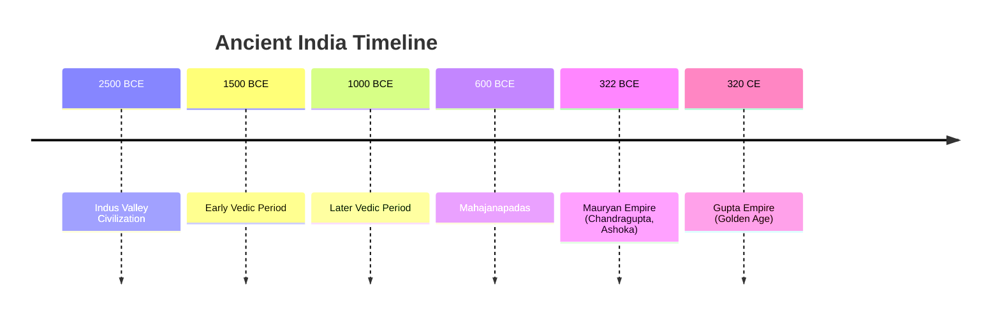
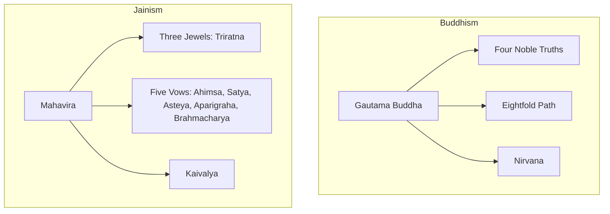
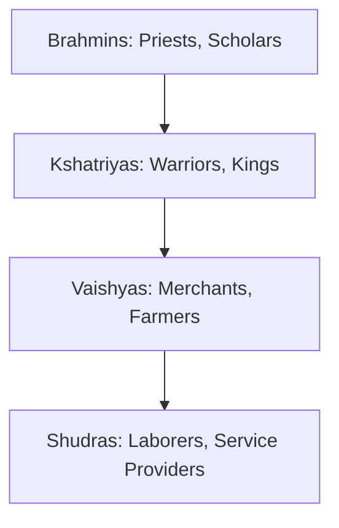

  <h3 style="color: var(--accent); margin-bottom: 16px; border-bottom: 1px solid var(--border); padding-bottom: 8px; display: flex; align-items: center; gap: 8px; font-weight: 600;">ANCIENT INDIA CORE AND MCQS</h3>
  <h4 style="border-left: 3px solid var(--info); padding-left: 8px; margin-top: 24px; margin-bottom: 10px; color: var(--text-primary); font-weight: 600;">DEEP CONCEPTUAL EXPLANATION</h4>

GENERAL STUDIES After analysing the previous year question papers, we have noticed that around 12-15 questions are asked from the History section. From Ancient India, questions are asked from topics like Harappan civilization, Rig Vedic age, Mauryan age, Six Indian philosophies, Gupta age, Literature during Ancient era. Questions from Medieval India covers the topics like Delhi Sultanate, Mughal empire, Foreign travellers during medieval age, Maratha empire, Vijayanagar empire, Art, Architecture and Literature. From Modern India, questions are mainly asked from the Indian National Movement. Topics from World History asked in the paper includes American war of Independence, Russian revolution, French revolution, World Wars I and II. PART I ANCIENT INDIA The age, when the pre-historic man began to use stones for utilitarian purpose is termed as the Stone age. The Stone age is divided into four category—the Paleolithic age or the Old Stone age, the Mesolithic age or the Middle Stone age, the Neolithic age or the New stone age and the Chalcolithic age.

70. The nation of saptanga that was introduced in the Arthashashtra includes (a) kings, territory, administration and treasury

## Visual Summary & Diagrams: Ancient India

### Chronology of Ancient Indian Empires

### Buddhism vs Jainism

## Visual Summary: Ancient History

### Vedic Society Hierarchy (Varnas)

