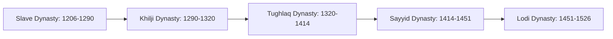
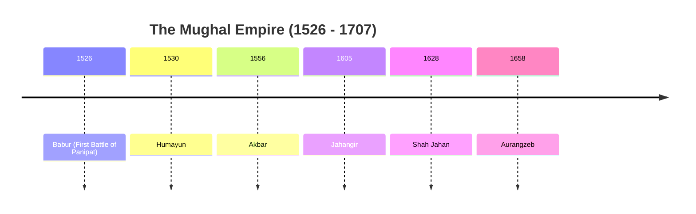
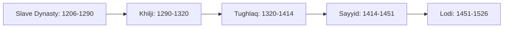

  <h3 style="color: var(--accent); margin-bottom: 16px; border-bottom: 1px solid var(--border); padding-bottom: 8px; display: flex; align-items: center; gap: 8px; font-weight: 600;">MEDIEVAL INDIA SULTANATE AND MCQS</h3>
  <h4 style="border-left: 3px solid var(--info); padding-left: 8px; margin-top: 24px; margin-bottom: 10px; color: var(--text-primary); font-weight: 600;">DEEP CONCEPTUAL EXPLANATION</h4>

GENERAL STUDIES 82. Arrange the following events in chronological order.

1. Reign of Kanishka 2. Visit of Hieun Tsang 3. Alexander’s invasion 4. Ashoka’s Kalinga War Codes (a) 2, 1, 3, 4 (b) 1, 3, 4, 2 (c) 3, 4, 1, 2 (d) 3, 4, 2, 1 (b) He was the 23rd tirthankara, the first 22 tirthankaras being considered legendary (c) He was the last and 24th tirthankara, who was not considered as the founder of the new faith but as a reformer of the existing religious sect (d) He was not one of the 24 tirthankaras In the early history of the far South in India, three tribal principalities are mentioned in Ashokan inscriptions of the 3rd century BC and in Kharavela inscription of the 1st century BC.

(a) Vakatakas, Cholas and Satvahanas (b) Cholas, Pandyas and Cheras (c) Ikshvakus, Vakatakas and Pandyas (d) Pallavas, Cholas and Pandyas 83. Match the following List I List II A. Hinduism 1. Eight Fold Path B. Jainism 2. Monotheism C. Buddhism 3. Divinity D. Islam 4. Three Fold Path 93. The Ashtadhyayi of Panini, the Mahabhasya of Patanjali and the Kashika Vritti of Jayaditya deal with (a) Principles of Law (b) Principles of Phonetics (c) Principles of Grammar (d) Principles of Linguistics 94. Fa-Hien’s mission to India was to (a) learn about the administrative system of the Gupta kings (b) understand the social position of women during the Gupta period (c) visit the Buddhist institutions and to collect copies of Buddhist manuscripts (d) get full knowledge about the condition of peasants during the period of Gupta kings Codes A B C D A B C D (a) 2 1 (b) 2 4 1 3 (c) 3 4 (d) 3 4 2 1 84. Consider the following statement(s) related to life events of Buddha is incorrect? (a) Buddha was born at Lumbini and he was younger contemporary of Mahavira. (b) Buddha got enlightenment under Peepal tree at Bodh Gaya. (c) Buddha delivered his first Seromon at Rajgir.

(d) Death of Buddha or Mahaparinirvana took place at Kusinagar.

95. What are the great epics that help to know the Sangam Age? (a) Silappadikaram and Manimekalai (b) Ramayana and Mahabharatha (c) Illiad and oddessey (d) Psalms and Proverbs 88. Which of the following statement is/are regarding “Uparika tax”? 1. It is an additional and oppressive tax.

2. It is the tax paid by cultivators.

3. It is an extra tax levied on all subjects.

4. It was a land tax on cultivators.

Select the correct answer using the codes given below. (a) Only 1 (b) 1, 2 and 3 (c) 3 and 4 (d) 2 and 4 89. Which one among the following statements about Ashokan edicts is correct? (a) The Pillar edicts were located in all parts of the empire (b) The edicts give details of his personal concerns but are silent on events of the empire (c) The subject of inscribed matter on Rock edicts differs completely with that of the Pillar edicts (d) The Greek or Aramaic edicts are versions or translations of the texts used in other edicts 96. The style in which Tamil and Sanskrit mixed is called (a) Malayalam (b) Creyole (c) Manippravalam (d) Thulu 85. Which one among the following is not a characteristic of Rig Vedic Aryans? (a) They were acquainted with horses, chariots and the use of bronze (b) They were acquainted with the use of iron (c) They were acquainted with the cow, which formed the most important form of wealth (d) They were acquainted with the use of copper and the modern ploughshare 97. The ruins at harappa were professionally examined for the first time by (a) Sir John Marshall (b) Cunningham (c) Mortimer Wheeler (d) Bishop Caldwell 90. Which one of the following statements regarding Harappan civilisation is correct? (a) The standard harappan seals were made of clay (b) The inhabitants of harappa had neither knowledge of copper nor bronze (c) The Harappan civilisation was rural based (d) The inhabitants of Harappa grew and used cotton 86. The earliest Buddhist literature which deal with the stories of the various birth of Buddha are (a) Vinaya pitakas (b) Sutta pitakas (c) Abhidamma pitakas (d) Jatakas 91. In Buddhism, what does “Patimokkha stand for”? (a) A description of Mahayana Buddhism (b) A description of Hinayana Buddhism (c) The rules of Sangha (d) The questions of king mehander 92. Consider the following passage and identify the three tribal principalities referred to there, in using the codes given below.

87. The Jainas believe the Jainism is the outcome of the teachings of 24 tirthankaras. In the light of this statement, which one among the following is correct of Vardhamana Mahavira? (a) He was the first tirthankara and the founder of Jainism 98. Which of the following statement(s) is/are correct about Jainism.

1. Rig Veda mentions two Tirthankaras-Rishabh Dev and Arishtanemi 2. The 24th Tirthankara was Vardhaman Mahavira (Emblem-lion) 3. The sacred books of Jainas are written in Pali language.

Select the correct answer using the codes given below. (a) 1 and 2 (b) Only 3 (c) Only 2 (d) All of these Select the correct answer using the codes given below. (a) 1 and 4 (b) 4 and 2 (c) 2 and 3 (d) 1 and 2 Codes (a) Both the statements are individually true and Statement II is the correct explanation of Statement I (b) Both the statements are individually true, but Statement II is not the correct explanation of Statement I (c) Statement I is true, but Statement II is false (d) Statement I is false, but Statement II is true 106. Which of the following ruler of Satavahana Empire composed Gathasaptashati? (a) Simuka (b) Pulumayi (c) Gautamiputra Satkarni (d) Hala 99. Consider the following statement(s) regarding Sankhya school 1. Sankhya does not accept the theory of rebirth or transmigration of soul.

2. Sankhya holds that it is the self-knowledge that leads to liberation and not any exterior influence or agent.

Select the correct answer using the codes given below. (a) Only 1 (b) Only 2 (c) Both 1 and 2 (d) Neither 1 nor 2 112. Which of the following marriage is especially practised by warriors? (a) Daiva (b) Pisaka (c) Rakshasa (d) Gandharva 107. “Heliodorus" a greek ambassador of the Indo-Greek king was sent to the court of which ruler? (a) Bhagbhadra (b) Devabhuti (c) Pushyamitra (d) Ghosha 100. Who among the following is known to have maintained the Silk Route and trade? (a) Ashoka (b) Kanishka (c) Vima Kadphises (d) Vasudeva 101. The ruler of Kushan dynasty, Kanishka was the follower of (a) Jainism (b) Hinayanism (c) Hinduism (d) Mahayanism 113. In which of the following inscriptions Ashoka made his famous declaration, “All men are my children”? (a) Minor Rock Edict (Ahravra) (b) Pillar Edict VII (c) Separated Kalinga Rock Edict I (d) Lumbini Pillar Edict 108. Which among the following rulers is often described as “the first empire builder of Indian History”? (a) Dhanananda (b) Bimbisara (c) Mahapadmananda (d) Chandragupta Maurya 102. The famous book ‘Brihat Katha’ was written by (a) Gunadhya (b) Panini (c) Sarva Varman (d) Radhagupt 114. Rajashekhara was the teacher of which of the following ruler? (a) Bhoj (b) Vijayalya (c) Mahendrapala (d) Gopal 109. Who was the author of the book ‘Silappadikarma’? (a) Ilango Adigal (b) Perudevanar (c) Seethalai Saathanaar (d) Tiruttakrdeva 103. Which of the following inscription are related to Satavahana period? (a) Nanaghat (b) Nasik (c) Paithan (d) Both ‘a’ and ‘b’ 115. Statement I Harsha is called the last Great Hindu Emperor of India, but he was neither a staunch Hindu nor the ruler of the whole country.

110. Which among the following is/are the terms used for coins of the Gupta period? 1. Dinara 2. Dramma 3. Rupaka 4. Suvarna 104. Consider the following place(s) 1. Ajanta Caves 2. Lepakshi Temple 3. Sanchi Stupa Select the correct answer using the codes given below.

(a) Only 4 (b) 2 and 3 (c) 1 and 4 (d) All of these Which of the above places is/are also known for mural paintings? (a) Only 1 (b) 1 and 2 (c) All of these (d) None of these 111. Statement I Virasen was the Commander-in-chief of Samudragupta during Northern campaign.

105. Who among the following were teachers of Gautama Buddha before his enlightenment? 1. Alara Kalama 2. Rudraka Ramputra 3. Makkhali Gosala 4. Nigantha Nataputta Statement II Harsha defeated Pulakesin-II, the maitraka ruler of Vallabhi.

Codes (a) Both the statements are individually true and Statement II is the correct explanation of Statement I (b) Both the statements are individually true, but Statement II is not the correct explanation of Statement I (c) Statement I is true, but Statement II is false (d) Statement I is false, but Statement II is true Statement II Samudragupta’s arms reached as far as Kanchi, Tamil Nadu, where the Pallavas were compelled to recognise his suzerainty. GENERAL STUDIES QUESTIONS FROM CDS EXAM (2012-2016) 2013 (I) 2012 (I) 1. The site of Harappa is located on the bank of river (a) Saraswati (b) Indus (c) Beas (d) Ravi (c) Silk routes existed before the Christian era and thrived almost upto 15th century (d) As a result of silk route trade, precious metals like gold and silver, flowed from Asia to Europe 13. In the Gupta age, Varahamihira wrote the famous book, ‘Brihat Samhita’. It was a treatise on (a) astronomy (b) statecraft (c) ayurvedic system of medicine (d) economics 2. Ashokan inscriptions of Mansehra and Shahbazgadhi are written in (a) Prakrit language, Kharoshthi script (b) Prakrit language, Brahmi script (c) Prakrit-Aramaic language, Brahmi script (d) Aramaic language, Kharoshthi script 8. Which among the following statements regarding the Gupta Dynasty is/are correct? 1. The Kumaramatyas were the most important of the and they were appointed directly by the king in the home provinces.

2. The village headmen lost importance and of the transactions began to be effected without their consent.

14. Which of the following was/were not related to Buddha’s life? 1. Kanthaka 2. Alara Kalama 3. Channa 4. Goshala Maskariputra Select the correct answer using the codes given below.

(a) Only 1 (b) Only 4 (c) 1 and 2 (d) 3 and 4 3. Who among the following Chinese travellers visited the Kingdoms of Harshavardhana and Kumar Bhaskar Varma? (a) I-Tsing (b) Fa-Hien (c) Hiuen Tsang (d) Sun Shuyun Select the correct answer using the codes given below. (a) Only 1 (b) Only 2 (c) Both 1 and 2 (d) Neither 1 nor 2 4. Which one among the following Indus cities was known for water management? (a) Lothal (b) Mohenjodaro (c) Harappa (d) Dholavira Directions (Q. Nos. 15-16) The following questions consist of two statements, Statement I and Statement II. You are to examine these two statements carefully and select the answer to these questions using the codes given below.

9. Which among the following materials were used for minting coins during the rule of the Mauryas? (a) Gold and Silver (b) Silver and Copper (c) Copper and Bronze (d) Gold and Copper 5. Who among the following scholars were contemporary of Kanishka? 1. Ashvaghosa 2. Nagarjuna 3. Vasumitra 4. Chanakya Select the correct answer using the codes given below.

(a) 1 and 2 (b) 3 and 4 (c) 2 and 4 (d) 1, 2 and 3 2012 (II) 10. What was the Kutagarashala literally, a hut with a pointed roof? (a) A place where animals were kept (b) A place where intellectual debates among Buddhist mendicants took place (c) A place where weapons were stored (d) A place to sleep 6. The polity of the Harappan people, as derived from the material evidence, was (a) secular-federalist (b) theocratic-federalist (c) oligarchic (d) theocratic-unitary 11. The Dhamma propagated by Ashoka was (a) the tenets of Buddhism (b) a mixture of the philosophies of Ajivikas and Charvakas (c) a system of morals consistent with the tenets of most of the sects of the time (d) the religious policy of the state 12. Which one among the following pairs is not properly matched? (a) Megasthenese Indica (b) Ashvaghosa Buddhacharita (c) Panini Mahabhashya (d) Vishakhadatta Mudrarakshasa 7. Silk routes are a good example of vibrant pre-modern trade and cultural links between distant parts of the world. Which one among the following is not true of silk routes? (a) Historians have identified several silk route over land and sea (b) Silk routes have linked Asia with Europe and Northern Africa Codes (a) Both the statements are true and Statement II is the correct explanation of Statement I (b) Both the statements are true, but Statement II is not the correct explanation of Statement I (c) Statement I is true, but Statement II is false (d) Statement I is false, but Statement II is true 15. Statement I There was great exodus of Jaina monks under the leadership of Bhadrabahu to the Deccan following severe famine in the Ganga valley towards the end of Chandragupta’s reign. Statement II Chandragupta Maurya joined the Jaina order as a monk.

16. Statement I Mahavira initially joined a group of ascetics called Nirgranthas.

Statement II The sect was founded 200 years earlier by Parsva. 2013 (II) 2014 (I) 4. Vedic sacrifices were of two kinds — those conducted by the householder and those that required ritual specialists.

21. The only inscribed stone portrait of Emperor Ashoka has been found at (a) Sanchi (b) Amaravati (c) Kanaganahalli (d) Ajanta Select the correct answer using the codes given below.

(a) Only 3 (b) 1 and 2 (c) 1, 2 and 4 (d) All of these 17. Statement I Kali age reflects the presence of deep social crisis characterised by varnasankara i.e. intermixture of varnas or social orders. 2015 (II) 27. Patanjali was (a) a philosopher of the ‘Yogachara’ school (b) the author of a book on Ayurveda (c) a philosopher of the ‘Madhyamika’ school (d) the author of a commentary on Panini’s Sanskrit grammar 22. Which one of the following statements about Rig Veda is not correct? (a) Deities were worshipped through prayer and sacrificial rituals (b) The Gods are presented as powerful, who could be made to intervene in the world of men via the performance of sacrifices (c) The Gods were supposed to partake of the offerings as they were consumed by the fire (d) The sacrifices were performed in the temples 28. Match the following List I (King) List II (Region) A.

Shashanka 1. Assam B.

Kharavela 2. Maharashtra C.

Simuka 3. Odisha D.

Bhaskara Varman 4. Bengal Statement II The Vaisyas and Sudras (peasants, artisans and labourers) either refused to perform producing functions or pay taxes or supply necessary labour for economic production resulting in weakening of Brahminical social order and social tension. Codes (a) Both the statements are true and Statement II is the correct explanation of Statement I (b) Both the statements are true, but Statement II is not the correct explanation of Statement I (c) Statement I is true, but Statement II is false (d) Statement I is false, but Statement II is true 23. Consider the following statement(s) 1. The Jains believed that Mahavira had twenty-three predecessors.

2. Parshvanatha was twenty-third Tirthankara.

3. Rishabh was immediate successor of Mahavira.

Which of the statement(s) given above is/are correct? (a) 1 and 2 (b) 2 and 3 (c) Only 2 (d) Only 3 18. Among the precious stones, the most extensive foreign trade during the Gupta age was that of (a) diamonds (b) ruby (c) pearl (d) sapphire Codes A B C D A B C D (a) 4 2 (b) 1 3 2 4 (c) 4 3 (d) 1 2 3 4 29. In ancient India, the ‘Yaudheyas’ were (a) a sect of the Buddhism (b) a sect of the Jainism (c) a republican tribe (d) vassals of the Cholas 2016 (I) 24. Which one of the following statements about ancient Indian Mahajanapadas is correct? (a) All Mahajanapadas were oligarchies where power was exercised by a group of people (b) All Mahajanapadas were located in Eastern India (c) No army was maintained by the Mahajanapadas (d) Buddhist and Jaina texts list sixteen Mahajanapadas 25. The Fourth Buddhist Council was held in Kashmir under the leadership of (a) Bindusara (b) Ashoka (c) Kunal (d) Kanishka 30. Who among the following archaeologists was the first to identify similarities between a pre-Harappan culture and the mature Harappan culture? (a) Amalananda Ghosh (b) Rakhaldas Bannerjee (c) Daya Ram Sahni (d) Sir John Marshall 2015 (I) 26. Which of the following characteristic(s) describes the nature of religion according to the Rig Veda? 1. Rig Vedic religion can be described as naturalistic polytheism.

2. There are striking similarities between the Rig Vedic religion and the ideas in the Iranian Avesta.

3. Vedic sacrifices were conducted in the house of the priest who was called yajaman.

19. Which of the following statement(s) is/are not correct about Bhakti tradition in South India? 1. Earliest Bhakti Movements in India were led by Alvar and Nayanar saints.

2. Naalayira Divya Prabandham, frequently described as Tamil Veda is an anthology of compositions by the Alvars.

3. Karaikkal Ammaiyar, women Alvar saints, supported patriarchal norms.

Select the correct answer using the codes given below. (a) 1 and 2 (b) Only 3 (c) Only 2 (d) All of these 20. Sangam literature formed a very important source for the reconstruction of the history of South India. It was written in (a) Tamil (b) Kannada (c) Telugu (d) Malayalam 31. Consider the following statement(s) 1. Abhinavagupta wrote a comprehensive treatise called the Tantraloka which systematically presents the teachings of the Kula and Trika systems.

2. The Samaraichchakaha by Haribhadra Suri written in Gujarat around the 8th century is technically not a tantric work but is saturated with tantric ideas and practices.

GENERAL STUDIES 34. The Lilavati of Bhaskara is a standard text on (a) Mathematics (b) Surgery (c) Peotics (d) Linguistics Which of the statement(s) given above is/are correct? (a) Only 1 (b) Only 2 (c) Both 1 and 2 (d) Neither 1 nor 2 Which of the statement(s) given above is/are correct? (a) Only 1 (b) Only 2 (c) Both 1 and 2 (d) Neither 1 nor 2 35. The Agrahara in early India was (a) the name of a village or land granted to Brahmins (b) the garland of flowers of Agar (c) the grant of land to officers and soldiers (d) land of village settled by Vaishya farmers 32. Which one among the following was not an attribute of Samudragupta described in Prayag Prashasti? (a) Sharp and polished intellect (b) Accomplished sculptor (c) Fine musical performances (d) Poetical talent of a genius 37. Which of the following statement(s) is/are true? 1. Faxian’s Gaoseng Faxian Zhuan was the earliest first-hand Chinese account of Buddhist sites and practices in India.

2. Faxian was only 25 year old at the time of writing the text.

3. Faxian’s main aim in coming to India was to obtain and take back texts containing monastic rules.

Select the correct answer using the codes given below. (a) Only 3 (b) Only 2 (c) 1 and 3 (d) All of these 33. Kamandaka’s Nitisara is a contribution to (a) Logic and Philosophy (b) Mathematics (c) Political morality (d) Grammar 36. Consider the following statement(s) about votive inscriptions in the 2nd century BC 1. They record gifts made to religious institutions.

2. They tell us about the idea of transference of the meritorious results of the action of one person to another person.

ANSWERS Practice Exercise Questions from CDS Exam (2012-16) PART II MEDIEVAL INDIA MUSLIM INVASION Arab Conquest of Sind • Fall of Delhi and Ajmer laid the foundation of Muslim Rule in India. Ghori also defeated Jaichand (Ruler of Kannauj) at Battle of Chandawar in 1194. Bakhtiyar Khilji, his general, annexed East India and destroyed Nalanda and Vikramshila University. Ghori died in 1206, leaving Qutub-ud-din Aibak as incharge.

• As Harshvardhana and Pulakesin II were struggling for supremacy in India, a revolutionary change was taking place, i.e. the emergence of Islam in Arabia.

• Sufi Saint Khawaja Moin-ud-din Chisti came with him from Afghanistan. Tomb of Moin-ud-din Chisti is in Ajmer also known as Ajmer Sharif. He founded Chisti Silsila.

• The Arabs, for long the carriers of Indian trade with Europe, were attracted by rich sea-ports of Sind.

However, two expeditions sent by Al-Hajjaj the Governor of Iraq failed. THE DELHI SULTANATE • The third expedition under his nephew and son-in-law Mohammed-bin-Qasim, managed to acquire control over Sind in AD 712. Multan was conquered in AD 713. Mahmud of Ghazni • Qutub-ud-din Aibak was Turkish slave by origin. He was purchased by Mohammad Ghori who later made him his Governor. After the death of Ghori, Aibak became the master of Hindustan and founded the slave dynasty in 1206.

The Delhi Sultanate (AD 1206-1526) had five ruling dynasties i. The Ilbari (Slave) ii. The Khilji iii. The Tughlaq iv. The Sayyid v. Lodhis • Mahmud came to the throne of Ghazni in AD 997. He moved towards India in AD 1001 by attacking and killing Jaipala, the King of Punjab in the First Battle of Waihind. The first attack was made against frontier post and many forts and districts were captured.

• Of these five dynasties the first three were of Turkish origin and the Lodhis were Afghans.

The Slave or Ilbari Dynasty • The sixth expedition (the Second Battle of Waihind) was against Anandapala (Hindu shahi ruler of Punjab) in AD 1008. The expedition in AD 1009 was against Nagarkot in the Kangra hills. The first dynasty of the Sultanate has been designated by various scholars as the Slave dynasty or the Mamluq dynasty or the Ilbari dynasty. Qutub-ud-din Aibak • Ghazni led 17 expeditions between AD 1001 and AD 1027. He plundered Thaneshwar, Mathura, Kannauj and Somnath. The temple of Somnath dedicated to Shiva was plundered in 1025 situated on the sea coast of Kathiawar (Gujarat).

• Utbi regarded as a great literary figure at that time, he was Mahmud’s court historian. His Kitab-ul-Yamini or Tarikh-I-Yamini is a book on Mahmud’s life and times.

• He was the founder of the Sultanate of Delhi.

Qutub-ud-din Aibak was the first Muslim King of India. He began his reign with the modest little Malik and Sipahsalar, which had been conferred upon him by Mohammed Ghori. Lahore and later Delhi were his capitals.

• He was famous for his generosity and earned the sobriquet of lakh-baksh (giver of lakhs).

• Firdausi (Persian poet) known as the immortal Homer of the East wrote the Shahanama, Al Beruni a brilliant scholar from Central Asia wrote Tahqiq-i-hind. Farukhi was also court poet of Ghazni.

Mohammed Ghori • He laid the foundation of Qutub Minar in Delhi after the name of the famous Sufi Saint Khwaja Qutub-ud-din Bakhtiyar Khilji. Aibak constructed the first mosque in India Quwat-ul-Islam (Delhi) and Adhai Din Ka Jhopara (At Ajmer).

• Muizzuddin Mohammed-bin-Sam (known as Mohammed Ghori), the last Turkish conqueror of North India, had no son.

• Hasan Nizami and Fakhr-ud-din (whom Aibak patronised) were all praised for the qualities of head and heart of Aibak and sense of justice in their works Taj-ul Massir and Tarikhi Mubarik Shahi respectively.

• His task was only half done, when he died of a sudden fall from a horse at Lahore in 1210 while playing Chaugan (Polo).

• The King of Delhi Prithviraj Chauhan completely routed the Ghori’s forces in AD 1191 at Tarain (First Battle of Tarain). But Prithviraj was defeated in the Second Battle of Tarain (AD 1192), Delhi and Ajmer were captured by Mohammed Ghori.

GENERAL STUDIES Shams-ud-din Iltutmish • He impressed upon the people that kingship was the vice regency of God on Earth (Niyabat-i-Khudai) and its dignity was next only to prophethood. The King was the shadow of God (Zil-i-Ilahi). Balban abandoned the chalisa.

• He was the real founder of the Delhi Sultanate. He made Delhi as the capital of the empire. He suppressed the revolts of ambitious nobles, fought with the sons of Aibak and sent expeditions against the Rajputs in Ranthambore, Jalor, Mewar.

• Balban introduced Sijdah or Paibos and started Nauroz festival. Balban took strong measures to safeguard the North-West frontier against the Mongol invasions.

• His son Mohammed’s death was a mashing blow to Balban and the death-knell to his dynasty. He was deeply racist and excluded non-Turks from the administration. The last ruler of dynasty was Kaiqubad, he was killed by Jalal-ud-din Khilji, who established Khilji dynasty.

• His governing class was entirely of foreign origin. It consisted of two groups, Turkish slave officers and Tazik. He introduced the silver coin (tanka) and the copper coin (jital). He organised the Iqta system and introduced reforms in civil administration and army, which was now paid and recruited.

The Khiljis • He set-up official nobility of slaves known as Turkan-i-Chalgani or Chalisa (a group of forty powerful turkish nobles).

• The coming of the Khiljis to power was more than a dynastic change. Their ascendancy is known as Khilji Revolution, because it marked the end of monopolisation of power by the Turkish nobility and racial dictatorship.

• On 18th February, 1229 the Khalifa sent emissaries from Baghdad with a decree registering the independent status of the Delhi Sultanate. Iltutmish was called the father of Tomb building (built Sultan Garhi). He completed Qutub Minar.

• The accession of Jalal-ud-din, Firoz Khilji marked the end of an epoch and signified a ‘revolution’ in the political and cultural history of medieval India.

Jalal-ud-din Firoz Khilji • He saved Delhi Sultanate from the wrath of Chengiz Khan, the Mongol leader, by refusing shelter to Khwarizm Shah, whom Chengiz Khan was chasing. Razia Sultan • He was an old man of 70, when he came to the throne and was unable to deal firmly with the problem of those troubled times.

• She was the first and the last Muslim woman ruler of medieval India. The first rebellion against her was raised by Kabir Khan, the Governor of Lahore.

• In order to win goodwill of Mongols, the Sultan married one of his daughter to the Mongol leader Ulugh Khan, a descendant of Chengiz Khan.

• Altunia the Governor of Bhatinda was also a revolutionary. So, she moved straight towards Bhatinda, but was defeated and taken as prisoner by Altunia, who married her.

• One of the most important events of Jalal-ud-din’s reign was the invasion of Devagiri the capital of the Yadava kingdom in the Deccan by Ala-ud-din (his nephew) and son-in-law of the Sultan and Governor of Kara.

Ala-ud-din Khilji • Razia with her husband was moving towards Delhi. She was defeated by Bahram Shah, a son of Iltutmish. Deserted by her soldiers, she was murdered by robbers.

• His first major conquest was the rich kingdom of Gujarat, which was then ruled by the Vaghela King Karna.

• Razia succession continued, in which three rulers ruled in continuity • In 1299, Ala-ud-din’s army under the joint command of Ulugh Khan and Nusrat Khan invaded Anhilwad, the capital of Gujarat.

i. Bahram Shah (AD 1240-1242) ii. Ala-ud-din Masud Shah (AD 1242-1246) iii. Nasir-ud-din Mahmud (AD 1246-1266) • Nasir-ud-din was the grandson of Iltutmish. Balban • During plunder of the rich port of Cambay, Ala-ud-din’s Commander Nusrat Khan acquired a Hindu turned Muslim slave Kafur (also known as Hazar Dinari), who later on rose to become a great Military General and the Malik Naib of Ala-ud-din.

• Balban ascended the throne in 1266-67 with host of problems. The first and foremost among these was the future relationship of the nobility with the king.

• He ordered the separation of the military department from the Finance Department (Diwan-i-Wizarat) and the former was placed under a Minister for Military Affairs (Diwan-i-Ariz).

• After the conquest of Gujarat, Ala-ud-din moved to Rajputana, where he conquered Ranthambore in 1300-1301 from Hamir Deva a descendant of Prithviraj III. In 1303 AD, he attacked Chittor the capital of Mewar, which was being ruled by Gahlot King Ratan Singh, whose queen Padmini committed Jauhar when her husband was defeated.

The value of token coin was equal to a silver coin. But, this experiment failed on account of the circulation of counterfeit coins on a very large scale and rejected by foreign merchants. So, he withdrew the token currency. He offered to exchange all the token coins for silver coins.

• Ala-ud-din Khilji is known for his market reform policy.

He established four separate market in Delhi. Market was put under control of officer called Shahna-i-Mandi. Price of commodities were fixed, merchants were registered with market. Separate department Diwani Riyasat was created and Naib-i-Riyasat was officer responsible for new department. Secret agent ‘Munhiyas’ were appointed to inform Sultan about condition of market. – The Sultan planned an expedition for the conquest of Khurasan and Iraq, but the scheme was abandoned, when the Sultan learnt that conditions in Iraq had improved.

• Ala-ud-din Khilji started measurement of land and land revenue were collected in cash also. He also introduced dagh system (branding of horse), huliya (list of soldier) and cash payment to soldier.

– The plan for the conquest of Quarachil (Kumaun Hills) met with a disastrous end. Quarachil has been identified with Rajput state in the Kumaun-Garhwal region.

• Hauz Khas, Mahal Hazar Satoon and Jamait Khana Mosque were built by Ala-ud-din. He adopted the title Sikandar-i-Sani.

• He increased the revenue and set-up new department for agriculture Diwan-i-Amir Koh. Ibn Battuta (the famous traveller) came to Delhi in 1334. He acted as Qazi of the capital for 8 years.

• Added the entrance door to Qutab Minar, built Alai Darwaza and built his capital at Siri fort. Last Ruler was Qutub-ud-din Mubarak Khilji.

• He patronised the famous Persian poet Amir Khusrau, who was known as Tuti-i-Hind (Parrot of India). Khusrau also invented sitar by modifying veena.

• Ibn Battuta has recorded the contemporary Indian scene in his Safarnamah called Rehla. Battuta was a moroccan explorer. His travel account tell us about his journey through the Delhi Sultanate period.

The Tughlaqs • During his period, Vijayanagara empire was established in AD 1336 by Harihara and Bukka, and Bahamani Kingdom AD 1346 by Hasan Gangu Behman Shah. The Tughlaqs were a Muslim family of Turkish origin. They provided three competent rulers- Ghiyas-ud-din, Mohammed-bin-Tughlaq and Firoz Shah Tughlaq. Firoz Shah Tughlaq Ghiyas-ud-din Tughlaq • Ghiyas-ud-din Tughlaq (real name Ghazi Malik) founded the third dynasty of the Sultanate. He also discarded Ala-ud-din’s system of measurement of land for the assessment of land revenue.

• Firoz Shah Tughlaq, who became Sultan in AD 1351 was a patron of arts and literature. He did not give any harsh punishment and banned the inhuman practices like cutting hands, nose etc.

He abolished as many as twenty-three taxes and substituted them with only the following four taxes • He took keen interest in the construction of canals for irrigation and formulated a famine policy to provide relief to peasants in the time of drought.

• He built the fortified city of Tughlaqabad and gave a new touch to the architecture of the Sultanate period.

i. Kharaj (a land tax equal to 1/10 of the produce of the land) ii. Jaziya (a tax paid by non-Muslims) iii. Zakat (tax on property (2.5%)) iv. Khams (1/5th of booty captured in war) • He established his capital at Tughlaqabad. He came in conflict with Sufi Saint Nizam-ud-din Auliya. Mohammed-bin-Tughlaq • He also made the civil and military post hereditary. One remarkable feature of his reign was his interest in civil works. He founded a number of new cities and towns, three most famous being Hissar, Fatehabad, Jaunpur and Firozabad, Firoz Shah Kotla (in Delhi).

• Mohammed-bin-Tughlaq (real name Jauna Khan) succeeded Ghiyas-ud-din Tughlaq under title Mohammed-bin-Tughlaq.

He was the most remarkable personality among the Sultans of Delhi. Few ambitious projects taken up by Mohammed during his period are as follow • To beautify his new capital Firozabad in Delhi the Ashokan pillars were brought, one from Topara in Ambala and the other from Meerut.

• He was very fond of collecting a large number of slaves (about 180000 slaves) and had a separate department for it known as Diwan-i-Bandagan.

– Shifting the capital from Delhi to Devagiri (Daulatabad) in 1327. He wanted to control South India better, from Daulatabad but Daulatabad was found to be unsuitable because it was not possible to control North India from there. So, he decided to re-transfer the capital to Delhi. – Introduction of the token currency (1329-30). (introduction of bronze tankas in place of silver tankas).

• He set-up a separate department, called the Diwan-i- Khairat, for the help of the poor and the needy. He built Dar-ul-Shafa or a charitable hospital.

GENERAL STUDIES • Ziauddin Barani (the historian was in his court) wrote two well- known works of history the Tarikh-i-Firozshahi and the Fatwa-i-Jahandari.

• He founded Agra in 1504 and made it as his capital. He reimposed Jaziya. Women were prohibited to go on saint graves during his reign. He imposed ban on any language other than Persian.

• He introduced two new coins Adha (50% jital) and Bikh (25% jital). He wrote his autobiography The Fatuhat-Firozshahi. Timur invaded India during his reign.

TIMUR INVASION Ibrahim Lodhi He was not ablest ruler. He was defeated and killed by Babur in the first Battle of Panipat (1526) and sultanate period ended. Administration under Delhi Sultanate During Nasir-ud-din Mahmud’s (last ruler) reign, Timur the Mongol leader of Central Asia invaded India. Timur reached Delhi in December 1398 and ordered general massacre.

• Administration/Kingdom was divided into iqtas. The head of the civil administration was a Wazir (head of finance department).

The Sayyids • The Wazir was assisted by a deputy or Naib Wazir, an Accountant General (Mushrif-i-mumalik) and the Auditor General (Maustauji-i-mumalik).

• Khizr Khan, the founder of the Sayyid dynasty, had collaborated with Timur and as a reward for services to the invader and was given the governorship of Lahore and Multan.

• The chief justice was Qazi-i-mumalik (having both religious and secular functions). He was responsible for the enforcement of the shariat.

• The officer-in-charge of the royal correspondence army head was known by the name of Ariz-i-mumalik and he was responsible for all military works like–recruitment, payment, inspection of the troops.

• Khizr Khan’s three successors—Mubarak Shah (1421-33), Mohammed Shah (1434-43) and Ala-ud-din Alam Shah (1443-51) assumed the royal title of Sultan and ruled as sovereign rulers, but all were incapable rulers.

• Barid-i-Mumalik The officer-in-charge of royal post and news agency.

• The provinces were divided into ‘shiqs’ under the control of ‘Shiqdars’. The next unit was paraganas headed by munsifs.

• During the 27 years of Sayyid dynasty the sultanate of Delhi remained in trouble due to external invasions, internal intrigue, chaos and confusion.

These conditions provided an opportunity to Bahlol Lodhi.

• Iqta system prevailed under which land of the empire was divided into several large and small tracts called Iqta and were given to soldiers, officers and nobles.

Important departments were as follow – Diwan-i-Insha Department of correspondence • Yahya-bin-Ahmed-bin-Abdullah Sirhindi wrote the Tarikh-i-Mubarakshahi (a history of Sultans of Delhi from time of Muizz-ud-Din, Muhammad-bin-Sam). – Diwan-i-Ariz Military department – Diwan-i-Risalat Department of appeals – Diwan-i-Qaza-i-Mumalik Department of Justice – Diwan-i-Ishtikak Department of pensions Sultanate Literature The Lodhis The Lodhis, who ruled for 75 years were Afghans by race. The Lodhis were ruling over Sirhind when Sayyids, were in India. Books Author Books Authors Alberuni Tahkik-i-Hind Amir Khusrau Tarikh-i-Alai Alberuni Qanun-i-Masudi Zia-ud-din Barani Fatwa-i-Jahandari Alberuni Jawahar-i-Jawahar Zia-ud-din Barani Tarikh-i-Firoz Shahi Minhaj-us-Siraj Tabaqat-i-Nasiri Firoz Shah Fatwa-i-Firoz Shahi Bahlol Lodhi Bahlol Lodhi was the founder of the Lodhi dynasty.

He was one of the Afghan Sardars, who established themselves in Punjab after the Timur’s invasion. He introduced coins, he called his Sardar Masnad-i-Ali. Amir Khusrau Laila-Majnu, Quran-us-Saadin Firozabadi Qamus Sikandar Lodhi Amir Khusrau Khazain-ul-Futuh Hassan Nizami Taj-ul-Maathir Amir Khusrau Tughlaqnama Abu Bakr Chach Namah Amir Khusrau Nuh-Siphir Fakhruddin Tarikh-i-Mubarak Shahi • He was the noblest and ablest ruler of the 3rd Lodhi rulers. He set-up an efficient coinage system, military, spy network and also introduced the system of auditing of accounts. Amir Khusrau Miftah-ul-Futuh Shams-i-Shiraj Afif Tarikh-i-Firoz Shahi Amir Khusrau Ayina-i-Sikandari Ibn Batutta Kitab-ul-Rehla Amir Khusrau Hasht Bihisht Isami Futuh-us-Salatin Amir Khusrau Shirin Khusrau Firdausi Shahnamah • He repaired Qutub Minar. He introduced the measuring scale ‘Gaz-i-Sikandari’ for measuring cultivated fields. He wrote Persian verses with the name of the Gul-rukhi.

Sultanate Architecture Structure Location Builder Quwwat-ul-Islam Mosque Delhi Qutub-ud-din Aibak Adhai din ka Jhopra Ajmer Qutub-ud-din Aibak • This expansion was responsible for the alliance of the Bahmani kingdom with Warangal, which lasted for about 50 years and was a major factor in the inability of the Vijayanagara Empire to overrun the Tungabhadra doab or to stem the Bahmani offensive in the area. Qutub Minar Delhi IItutmish (Founded by Qutub-ud-din Aibak) Deva Raya I Tomb of Hazarat Nizamuddin Auliya Delhi Alauddin Khilji Alai Darwaza Delhi Alauddin Khilji • He assumed the title of Maharajadhiraja. The reign of Deva Raya I began with a renewed fight for the Tungabhadra doab. Jammat Khana Masjid Delhi Alauddin Khilji Tomb of Ghiyasuddin Tughlaq Delhi Muhammad Bin Tughlaq Tughlaqabad Fort Delhi Ghiyasuddin Tughlaq • He was defeated by the Bahmani ruler, Firoz Shah and had to pay a huge indemnity. He also agreed to marry his daughter to the Sultan Deva Raya I who undertook a number of schemes for the welfare of the people.

Moth ki Masjid Delhi Wazir Miya Bhoiya (Prime Minister of Sikandar Lodhi) THE VIJAYANAGARA EMPIRE • In AD 1410, he got constructed a dam across the Tungabhadra, with canals leading to the city. This greatly helped in agriculture. He was also a great patron of the scholars.

• Vijayanagara kingdom was founded by Harihar I and Bukka I (Sons of Sangama), who were feudatories of Kakatiyas and later became ministers in the court of Kampili.

• Nicolo De Conti, an Italian (Venetian), visited the Vijayanagara empire under Deva Raya I. Conti describes the city of Vijayanagara as having a circumference of 96 km and employing 90000 potential soldiers and also mentions the festivals like Deepawali, Navratri etc.

• Harihara and Bukka were brought to the centre by Mohammed-bin-Tughlaq, converted to Islam and were sent to South again to control rebellion.

Few foreign travellers to India during Medieval Period G Marco Polo was an Italian traveller from Venice, who visited India in AD 1295.

• Harihar and Bukka founded the Vijayanagara Empire in 1336 on the advice of Vidyaranya, who converted them back to Hindu.

G Nicolo De Conti an Italian (Venetian) visited the Vijayanagara empire in 1419, is author of India Recognita. G Abdur Razzaq was an Uzbek Islamic scholar and ambassador of Shah Rukh, visited India from 1442-1445. G Duarte Barbosa was a missionary from Portugal and visited India in 1560.

G Fernao Nuniz Portuguese traveller visited Vijayanagara during reign of Achayuta Raya. G Nikitin Russian merchant visited Bahmani kingdom.

• Vijayanagara Empire ruler believed in divinity and said they ruling by will of God Virupaksha. Idols of Vijayanagara rulers were also started to be kept in temples. Colonel Colin Mackenzie brought Hampi of Vijayanagara Empire into light in the AD 19th century.

Sangama Dynasty Harihara I He made Anagundi his capital. He annexed the Hoyasala State in AD 1364. When, the Muslim ruler of Mandurai defeated and killed the Hoyasala ruler Vir Ballal III. Deva Raya II Bukka I • He was the greatest ruler of the Sangama dynasty. In order to strengthen his army, he inducted more Muslims and asked all his Hindu soldiers and officers to learn the art of archery from them.

• He made Gutti his capital. The war with Bahmanis started in AD 1367, during the reign of Bukka I. The Bahmani Sultan defeated Bukka I and after a long war concluded a treaty which restored the old positions.

• The empire saw expansion under Bukka I. His son Kumara Kampan successfully led an expedition against Madurai and annexed it. This is mentioned in Madura Vijayam written by Ganga Devi (Kampan’s wife).

• With his new army, he crossed the Tungabhadra river and tried to recover Mudkal, Bankapur etc which were to the South of the Krishna river and had been lost to the Bahmani Sultans. Three hard battles were fought, but at the end, the two sides had to agree to the existing frontiers.

Harihara II • Deva Raya II was called Immadi Devaraya and also Proudha Devaraya or the great Devaraya by his subjects. Some quarter varahas (gold coins of Vijayanagara) of Deva Raya II describe him as Gajabetakara (the elephant hunter).

• Bukka I was succeeded by his son Harihara II, who embarked upon a policy of expansion towards the Eastern sea coast. This new policy of expansion consequently led the Vijayanagara Empire into fresh conflicts.

GENERAL STUDIES • Timma, who wrote Parijatapahara-vam.

• Madaya, who wrote Raja Shekarcharitam.

• Dhurjate, who wrote Kalahasti Mahatyam.

• Deva Raya II was a great patron of literature and himself an accomplished scholar in Sanskrit. He is credited with the authorship of two Sanskrit works Mahanataka Sudhanidhi and a commentary on the Brahma Sutras of Badarayana.

• Surona, who wrote Raghav Pandaviyam and Prabhavati Pradyuman.

• Tenali Ramalingam, who wrote Ponduranga Mahatyam.

• Ayyalaraju Ramabhadra, who wrote Sakalamata sara Sangraha.

• The king had leaning for Vira Saivism, yet he showed tolerance in religious views. He appointed people belonging to different religions as his minister. He got constructed a mosque in the Vijayanagara and ordered that a copy of Quran be placed before his throne.

The Saluva Dynasty • Vijayanagara witnessed chaos and disorder after 1465 due to weak rulers. However, the situation was saved by the Governor of Chandragiri, Narasimha Suluva, who seized the throne in about 1485 in what is known in history as the First Usurpation.

• Narasimha was succeeded by Timma and Imadi Narasimha, who were minors at the time of their coronation. The real power was in the hands of Narsa Nayak, who was the Reagent.

• Rama Raja Bhushan was the eighth poet.

After Krishnadeva Raya, there was a period of confusion, following which Achayuta Rai ascended the throne and ruled upto 1542. Sadasiva Raya followed Achyuta Ray and ruled upto 1570. The Aravidu Dynasty The Aravidu Dynasty was founded by Thirumala II, the brother of Rama Raja, who ruled in the name of Sadasiva Raya. On his failure to repopulate Vijayanagara, he shifted the capital to Penugonda. During his rule, the Nayaks became independents. Tirumala then divided his empire into three practically linguistic sections and placed them under his sons. The Tuluva Dynasty BAHAMANI KINGDOM Following the death of Narsa Nayak in 1505, his son Vira Narasimha, succeeded as the reagent. He deposed Imadi Narasimha and laid the foundation of the Tuluva Dynasty by what is known in history as the Second Usurpation.

Babur referred Krishna Deva Raya (1509-1529) as the greatest ruler of the Tuluva Dynasty.

• The Bahamani kingdom of Deccan was founded by Hasan Gangu, whose original name was Ismail Mukh.

The capital was Gulbarga. Hasan Gangu took the title of Ala-ud-din Hasan, Bahaman Shah (AD 1347-58) and became the first king of Bahamani in AD 1347. Krishnadeva Raya • He renamed Gulbarga as Ahsanabad. At the time of his death his dominion had four provinces Gulbarga, Daulatabad, Berar and Bidar.

• He maintained friendly relations with Albuquerque, the Portuguese Governor, whose Ambassador Friar Luis was a resident in Vijayanagara.

• Mahmud Shah I (1358-75) son of Bahaman Shah established a council consisting of eight ministers and decentralised his provincial administration. He fought with Vijayanagara.

• He gave Albuquerque permission to built a Fort of Bhatkal. He built the Vijaya Mahal (House of Victory) and expanded the Hazara Rama temple and the Vithal Swami temple.

• He took the titles of Yavanaraja Sthapanacharya (restorer of the Yavana kingdom, i.e. Bahmani) and Abhinava-Bhoja.

• Firoz Shah (1397-1422) was the most remarkable figure in Bahamani kingdom. He was determined to make Deccan the cultural centre of India. He inducted Hindus in his administration to large extent. He built an observatory at Daulatabad. He founded city of Firozabad on the bank of river Bhima. Firoz defeated Devaraya I.

• He was also known as Andhra Pitamaha and Andhra Bhoja. He was a gifted scholar in both Telugu and Sanskrit of which only two works are extant.

• Firoz Shah was succeeded by his brother Ahmed Shah I (AD 1422-36). He shifted his capital from Gulbarga to Bidar, Ahmed Shah is known as Wali or saint due to his association with Gesu Daraz.

• The Telugu work on polity Amuktamalyada and the Sanskrit drama Jambavati Kalyanam is also written by him. Krishna Deva Rai was also a great patron of art and literature, and was known as Andhra Bhoj.

Krishnadeva Raya’s Ashtadiggajas Krishnadeva Raya’s court was adorned by following Ashtadiggajas (the eight celebrated poets) • Peddana, who wrote Manucharitam and Harikathasaran- samu.

• Humayun was succeeded by his son Nizam Shah (1461-63) and then by Mohammed Shah III (AD 1463-82). Mahmud Gawan was the Prime Minister of Mohammed. Bahamani kingdom saw a resurgence under Mahmud Gawan’s guidance. His military conquests included Konkan, Goa and Krishna-Godavari Delta, Nikitin a Russian merchant, visited Bidar during his reign.

Qadiri • Adilshahi of Bijapur (1490-1686) founded by Yusuf Adil Shah. Greatest ruler of the kingdom was Ibrahim Adil Shah. He introduced ‘Dakhini’ in place of Persian language. Another ruler Mohammed Adil Shah built the Gol Gumbaz. It was annexed by Aurangazeb.

• Founder was Sheikh Mohi-ud-din Qadir Zilani in India. It was popularised by Shah Nizamat Ullah, Makhdum Zilani Dara Shikoh (son of Shah Jahan) was the disciple of Mullah Shah Badakshi.

• He (Dara) wrote the Safinat-ul-Auliya, Sakinat-ul-Auliya.

These are the biographies of the saints. Dara Shikoh also translated some books as Sir-e-Akbar, Sir-e-Asrar.

• Imad Shahis of Berar (1490-1574) founded by Fateullah Khan II Mad-ul-Mulk with Daulatabad as capital. Later, it was conquered and annexed by one of the Nizam Shahi rulers of Ahmednagar.

Naqshabandi • Founder father Khwaza Baha-ud-din Naqshabandi in India. It was popularised by Khwaza Khwand Mahmud (his centre was in Kashmir).

• Other saints Baqi-Billah, Shahwali ullah, Khwaza Mir Dard Naqshaband. Mir Dard wrote the Dard-e-Dil, the Sham-e-Mahfil, the Ilm-ul-Khitab.

• Qutub Shahis of Golconda (1518-1687) founded by Quli Qutub Shah. He built the famous Golconda fort and made it his capital.

Mohammed Quli Qutub Shah was the greatest of all. He founded the city of Hyderabad. He built the famous Charminar. Most important port of Qutub Shahi kingdom was Masulipatnam. The kingdom was annexed by Aurangzeb (1687).

• Other famous silsilah were Firdausi, Quadiri, Satari etc.

• Barid Shahis of Bidar (1528-1619) founded by Ali Barid.

Annexed by Adil Shahis of Bijapur.

Bhakti Movement RELIGIOUS MOVEMENTS • Bhakti is a devotional worship of God with the ultimate objective of attaining Moksha or Salvation. The Sufis • Initially, Bhakti Movement started in South India in the form of alvar and nayanar. Gradually Bhakti Movement spread to North. In North India, Bhakti Movement started to fluorish in 13th century.

• Sufism is a mystical Islamic belief and practice in which Muslim seeks the truth of divine love and knowledge through direct personal experience of God. Sufis are against the orthodoxy and fanaticism of religion.

• In India, Sufism appealed not only to Muslims but also to Hindus and these sufi saints became venerated figure for all.

• Bhakti saint were against the casteism, ritualism, religious sacrifices. Bhakti saints professed equal participation of women in religious practices. These saints used the local dialect to promote their ideas and communicate with masses.

Bhakti Movement is divided into two branches i. Nirguna ii. Saguna • In Islam visiting pilgrimage site associated with Muhammad or other venerated figure such as sufi saints etc is called Ziyarat. The abode of sufi was called Khanqah. Nirguna Saints • During 13th century, the Sufism was divided into 14 silsilas. Sufis had many branches in India. The Chistis Founder was Khwaza Abu-e-Chisti, but in India Moin-ud-din Chisti popularised it. His tomb is situated at Ajmer in Rajasthan.

• Main disciple of Moin-ud-din was Khwaza Qutub-ud-din Bakhtiyar Kaki (after him Qutub Minar was named).

• Famous saint Nizam-ud-din Auliya saw the reign of seven Delhi Sultans. He was also known as Mahboob-i-Ilahi (beloved of God) and Sultan-ul-Auliya (king of the saints).

His tomb is situated in Delhi.

Guru Nanak He was born at Talwandi in Lahore. He propogated Monotheism, Hindu-Muslim unity and denounced Idol worship. His disciple Mardana played Rabas. He established Sikh religion. His teachings are found in Guru Granth Sahib. Dadu Dayal He was born in Ahmedabad to Muslim parents, bought up by a Hindu. His teachings are collected in a book called Bani. His disciples were Sundaradasa, Rajjab, Bakham and Warid. He founded Brahma sect or Param Brahma Sampradaya. Kabir He was opposed to caste, creed, idol worship and propogated Hindu-Muslim unity. His works are Sabada Doha, Holi, Rekhtal etc. Verses of Kabir Namdev, Ravidas, Dhanna, Pipa etc were included in Adi Granth.

• Sheikh Nasir-ud-din (Chirag-i-Delhi) was also a disciple of Mahboob-i-Illahi. Amir Khusrau and Al-Biruni were also follower of Chisti.

GENERAL STUDIES Saguna Saints Important Philosopher and Bhakti Saints Tulsidas Contemporary to Akbar. Works- Ramcharitamanas, Kavitawali, Gitawali, Parvati Mangal, Janki Mangal, Vinay Patrika etc. Ramananda Propagated Bhakti in North India. Organised a group of cadres called Bairagi.

Surdas He was disciple of Vallabhacharya. He was a blind poet from Agra. He sang the glory of Krishna in his Sursagar. Gorakhnath Founder of Nath Hindu monastic movement in India. His followers are mostly found in Himalayan states. Followers are called yogis. Mirabai Rathor princess of Merta and daughter-in-law of Rana Sanga of Mewar (husband-Bhoja Raja). She wrote the verse Padavali. She believed in Krishna.

Chaitanya He was known as Gaudiya Mahaprabhu. He was founder of Gaurang or Bengal Vaishnavism. His teacher was Ishwapuri. Shankaracharya He was born at Kalodi, Kerala. He taught concepts of Maya (illusion), Advaita and importance of Vedanta. He established four Mathas at Badrinath, Puri, Sringeri and Dwarka. He wrote commentaries on Upanishads, Bhagwad Gita and Brahmasutras of Badrayana.

He is also known as Pseudo-Buddhist as many of his doctrines were similar to that of Buddhist doctrines. Abhinava Gupta He was a philosopher, mystic and aesthetican from Kashmir. His most famous work is Tantraloka, a treatise on all philosophical and practical aspects of Kashmir Shaivism. Ramanuja Acharya He was Tamil Vaishnavite saint. He gave philosophy of Visist-advait. Wrote Vedanta Samgraha, commentaries on Brahmasutras and Bhagwad Gita.

Madhavacharya He was Kannada Vaishnavite saint. He gave philosophy of Dvaita. Nimbarka Telugu Vaishnavite saint, contemporary of Ramayana. Concept of Dvaitadvaita was promoted by him.

Vallabhacharya He was a Telugu Vaishnavite saint. He was born at Varanasi in 1479 and went to Vrindavan, where he resided permanently. He established the philosophy of Shuddhadvaita. Vallabhacharya’s teachings are also known as Pushtimarga. He was the contemporary of Vijayanagara King Krishna Deva Raya. Raghunandan He belonged to Nabadwip (Nadia) in Bengal. He was considered to be the most influential writer in the Dharamashastras. Shankara Deva He established EK Sharan Sampradaya or Mahapurushiya Sampradaya. He divided universe into two parts Aswatantra and Swatantra.

Chaitanya Mahaprabhu He was also a great saint. There had been Vaishnavism in Bengal long before his birth, but Chaitanya accepted that Krishna alone is the most perfect God. ‘Kirtan’ system was given by Chaitanya. The Sikh Gurus and Their Contribution Guru Nanak (1469-1539) First Guru of Sikhs, Founder of Sikhism.

Guru Angad (1504-1552) Compiled the biography of Guru Nanak Dev, known as Janam Sakhi introduced Gurumukhi Script; 63 hymns of Guru Angad Dev included in Guru Granth Sahib. Guru Amar Das (1479-1574) He promoted inter-caste dining at his kitchen. Akbar granted villages to finance the scheme, out of which grew Amritsar. Guru Ram Das (1534-1581) Son-in-law of Guru Amar Das.

Guru Arjun Dev (1563-1606) Son of Guru Ram Das died after torture in Mughal (Jahangir) detention for sheltering rebellious Mughal prince Khusrau. Guru Hargobind (1595-1644) Son of Guru Arjun Dev, put on two words–one signifying Miri (secular power) and other Piri (spiritual power), Built the Akal Takht in 1608. Guru Har Rai (1630-1661) Son of Guru Hargobind supported Dara’s claim in the wars of succession between Shah Jahan’s sons.

Guru Harikishan (1656-1664) Son of Guru Har Rai, Gurudwara Bangla Sahib in New Delhi, was constructed in his memory. Guru Tegh Bahadur (1621-1675) Son of Guru Hargobind, Gurudwara Rakab Ganj Sahib in New Delhi, is where Guru’s body was cremated. He was executed on Mughal orders. Guru Govind Singh (1666-1700) Son of Guru Tegh Bahadur, tenth and the last sikh guru.

Guru Granth Sahib was finally completed. Bhakti Saints of Maharashtra Namdev By profession he was a tailor. Earlier he believed in Saguna stream, but later on diverted towards Nirguna branch. He was poet saint of Maharashtra. Earlier he was influenced by Vaishnavism. He worshipped Vithoba. He formed a varkari sect of Hinduism. Tukaram Tukaram was contemporary of Shivaji. He was part of varkari devotionalism tradition, he is also known for Abhanga devotional poetry. His poetry was devoted to vithoba (avatar of Vishnu).

Ramdas A noted spiritual poet of Maharashtra. He is famous for his Advaita vedantist text and Dashbodh. He was spiritual guru of Shivaji. Eknath He was famous religious Marathi poet of Varkari Sampradaya. He wrote Bhavarth Ramayan and a variant of Bhagvata Purana. Taneshwara He was 13th century Marathi saint, poet, philosopher and yogi. He wrote Dnyaneshwari (commentary on Gita) and Amrutobhava. His works are considered gem of Marathi language.

THE MUGHAL EMPIRE • Akbar then consolidated his empire through a series of conquests, the most difficult and most memorable being the campaign against Rana Pratap of Chittor, whom he defeated in the famous Battle of Haldighati in 1576. Babur • Akbar introduced Mansabdari system system, it means rank or position. So rank of government official was determined.

• The Mughal empire was founded by Zahir-ud-din Muhammad Babur. He was a turk. In 1523, the invitation came from Daulat Khan Lodhi, the Governor of Punjab and Alam Khan, uncle of Sultan Ibrahim Lodhi of Delhi to invade India.

• He abolished the pilgrim tax. In 1564, he abolished Jaziya. Land revenue system during Akbar’s Rule was known as Zabti. Todar Mal was the incharge of Revenue System.

• He defeated Ibrahim Lodhi in the first Battle of Panipat in 1526. Babur possessed a large part of artillery, a new kind of weapon coming into use in Europe and Turkey.

Babur introduced gunpowder and artillery in war in India.

• Akbar formulated an order known as Din-i-Ilahi (Divine Monotheism) in 1582. Birbal, Abul Fazal and Faizi joined the order. Akbar issued the ‘Decree of Infallibility’ in 1579. Abul Fazal wrote the Ain-i-Akbari.

• Navratna of his court were Birbal, Todar Mal, Abul Fazal, Tansen, Abdur Rahim Khan-i-Khana, Mullado Pyaja, Hakim Hukkam, Faizi, Maan Singh.

• Defeated the Rana Sangram Singh of Mewar in the decisive Battle of Khanwa which took place on 16th March, 1527 at Khanwa. Defeated Rajput Chief Medini Rai in the Battle of Chanderi in 1528. Defeated the Afghan Chief under Mahmud Lodhi in the Battle of Ghaghra in Bihar in 1529. Tomb of Babur is situated in Kabul.

• Chand Bibi revolted during the reign of Akbar. Akbar built Buland Darwaza in 1601 AD in Fatehpur Sikri to communicate his victory over Gujarat. He also built Ibadat Khana.

Humayun • Father Monserrate wrote a commentary on his journey to the court of Akbar. He wrote about personality of Akbar, lavishness, customs, rituals of the palace. He also wrote about revenue and justice systems.

• Babur’s eldest son Humayun divided the empire inherited from his father among his three brothers Kamran, Hindal and Askari.

The Conquest of Akbar Year Territory Specific Malwa The ruler of Malwa was Baz Bahadur.

• Humayun built the Dinpanah at Delhi as his second capital. He was attacked by Sher Shah at Chausa (Battle of Chausa) in 1539 and was defeated badly. In Battle of Kannauj (1540) he was defeated again by Sher Shah Suri.

Garhkatanga (a kingdom in Gondwana) Rani Durgawati and her minor son, Bir Narayan, died fighting Mughals. The Mughal army was led by Asaf Khan.

• After wandering for 15 years and after the death of Sher Shah, Humayun regained his lost kingdom in 1555, defeating Sikander Shah with the help of Bairam Khan.

Chittor The storming of the fortress of Chittor was one of the most famous military feats of Akbar. Rana Udai Singh was its ruler.

• Humayun died in 1556, after an accidental fall from the stairs of his library building (Sher Mandal, Delhi).

1572-73 Gujarat Akbar built the famous Buland Darwaza at Fatehpur Sikri in commemoration of this victory.

• Humayunnama is the account of Humayun’s life written by Gulbadan Begum (his half-sister).

1574-76 Bihar and Bengal Akbar personally marched against Bihar and drove out Daud from Patna and Hajipur. Akbar Battle of Haldighati Rana Pratap, the son of Udai Singh of Mewar, was severely defeated by the Mughal army under Maan Singh and Asaf Khan.

Kabul Mirza Hakim was defeated.

• Akbar (AD 1556-1605) was undoubtedly the brightest star of the Mughal empire. Jalal-ud-din Mohammed Akbar was born in 1542 at Amarkot when his father Humayun and mother Hamida Banu were struggling.

Kashmir and Baluchistan Sindh Orissa The Mughal army was led by Maan Singh.

• At the time of his father’s death Akbar was merely 13 years old and was in the guardianship of Bairam Khan, who on hearing of Humayun’s death coronated Akbar at Kalanaur.

Qandhar The Mughal army in this battle was commanded by Abdur Rahim Khan-i-Khanan. Asirgarh The capture of Asirgarh marked the climax of Akbar’s career of conquest.

• In November 1556, the Mughal army under Bairam Khan moved towards Delhi and defeated Hemu in the Second Battle of Panipat.

GENERAL STUDIES Jahangir • Many foreign travellers visited India during the reign of Shah Jahan. Two Frenchman Bernier and Travenier and an Italian adventurer Manucci, the author of the Storio Dor Magor are specially noteworthy. Aurangzeb • Akbar’s eldest son Salim assumed the title ‘Nur-ud-din Mohammed Jahangir’ and ascended the throne. He mostly lived in Lahore, which he adorned with gardens and buildings. A few months after his accession, his eldest son Khusrau revolted against him.

• Aurangzeb ascended the throne with the title of Alamgir (conqueror of the world) and ruled for almost 50 years.

• Jahangir’s first political success was against the Mewar Rana Amar Singh (1615). In 1620, Prince Khurram conquered Kangra. Jahangir followed the policy of his father with regard to the Deccan.

• During his reign the Mughal empire reached territorial climax. He first defeated the Imperial army at Dharmatt and then defeated a force led by Dara in the Battle of Samugarh.

• In 1617, Ahmednagar fell and Khurram was rewarded with the title ‘Shah-Jahan’. Jahangir married Mehr-u-nisa, whom he gave the title ‘Nur-Jahan’.

• He ordered the arrest and later executed the ninth Sikh Guru, Guru Teg Bahadur. He discontinued the practice of inscribing the Kalima on the coins and abolished the celebration of the new year’s day (Nauroz). He was constantly involved in trying to curtail the rising maratha power, however he failed to subdue them.

• Nur-Jahan was a politically shrewd and ambitious woman who dominated the royal household especially when Jahangir fell ill. She had great influence on Jahangir’s life as she had the status of Pad Shah Begum, coins were struck in her name and on all farmans her name was attached to the imperial signature.

• Nur Jahan’s influence secured high positions for her father I’timad-ud-Daulah and for her brother Asaf Khan. She married Asaf’s daughter Mumtaz Mahal to Khurram.

• Aurangzeb’s reign was marked by growing agrarian crisis and popular rebellions, such as those of the Jats, the Satnamis, the Sikhs and the Rajputs (when Jodhpur was annexed).

• Problem arose, when Nur Jahan married her daughter Sher Afghani to Jahangir’s youngest son, Shaharyar. Now, Nur Jahan supported him for the heir-apparent.

• The Mughal court was divided into Pro-Nur Jahan and Anti-Nur Jahan. These events hampered the military operation for the recovery of Kandahar.

• His religious policies were great setback to the standards of tolerance and liberalism set by his predecessors. Mulhitasib (regulator of moral conduct) was appointed in the reign. Aurangzeb was called a Darvesh or Zinda Pir. He also forbade Sati. He patronised the greatest digest of Muslim law in Indian Fatawa-i-Alamgiri. He was a diplomat and capable general.

• Captain Hawkins (1608-11) and Sir Thomas Roe (1615-19) visited his court to gain favourable concessions for English trade with India. As a result of the efforts of Thomas Roe, English factories were established at Surat, Agra, Ahmedabad and Broach.

Shah Jahan • Shah Jahan, the third son of Jahangir, ascended the throne in AD 1628 and married Mumtaz in 1612.

• He was an able general and administrator. In the first year of his reign Shah Jahan had to overcome the revolts of the Bundela chief, Juzhar Singh and the Afghan noble named Khan Jahan Lodhi an ex-viceroy of the Deccan.

• Shah Jahan’s reign of 30 years is regarded as the Golden age of Mughal in art and architecture during which monument like the famous Taj Mahal at Agra in the memory of his wife Mumtaz, the Red fort at Delhi with its Diwan-i-Khas and Diwan-i-Aam, the Jama Masjid and the famous Jewel-studded peacock throne were built among other numerous pieces of architecture.

• At the time of Shah Jahan’s sickness in 1657 his eldest son was in Agra, Shuja was Governor in Bengal, Aurangzeb was viceroy in the Deccan and the youngest Murad was Governor in Gujarat.

• Aurangzeb took control of the fort and crowned himself at Delhi, after defeating his brothers. Shah Jahan was kept in strict confinement at Agra fort till his death in 1666.

• He imposed Jaziya on the Hindus in 1679. He banned music and dancing. He died in 1707 in the Deccan.

Later Mughals Bahadur Shah He was generous, learned and pious without any bigotry. He assumed the title of Shah Alam and was known as Shah-i-Behkhabar. Jahandar Shah Jahandar Shah’s three brothers namely Azim-us-Shan, Rafi-us-Shan and Jahan Shah lost their lives in the Battle of successions. He became king with the help of Zulfikar Khan. He abolished Jaziya. Farrukhsiyar He had succeeded the throne with the help of Sayyid brothers Abdullah Khan and Hussain Ali.

In 1717, Farrukhsiyar gave tax free trade permission to British East India Company to trade through Bengal. This Royal farman became Magna Carta for British East India Company. In 1719, Sayyid Brothers killed him with the help of Maratha Peshwa Balaji Vishwanath. Mohammed Shah Nadir Shah invaded India in 1738-39. Nadir Shah defeated him in the Battle of Karnal (1739) and took away peacock throne and Kohinoor diamond. He was the most pleasure loving ruler of loose morals and therefore, called Mohammed Shah Rangeela.

• Sipah Salar Commander of the force.

• Kotwal was primarily the chief of the city police.

• A civilian was to be head of entire province and was given a small army. In the field of central administration Sher Shah followed the Sultanate pattern.

There were four main central departments, which were as follow • The Mansabdari system introduced by Akbar was a unique feature of the administrative system of the Mughal empire.

• In Akbar’s reign the empire was divided into 15 Subas.

• The territory of the empire was divided into Khalisa, Jagirs and Inam.

• Zabti system was based on the measurement and assessment of land.

i. Diwan-i-Wijarat This department was concerned with financial matter. ii. Diwan-i-Ariz Headed by Ariz-i-mumalik. It was a military department. iii. Diwan-i-Insha Working as a secretariat.

iv. Diwan-i-Rasalat Headed by Sadar, this department dealt with foreign affair matter.

Diwan-i-Kaza headed by Qazi.

The Qazi looked after the judicial administration.

• During Mughals Tins-i-Kamil refers to cash crop and earning from cash crop.

Revenue System There were two important officials at the Sarkar level, which were as follow • Land was measured using the Sikandari-gaz one-third of the average produce was fixed as tax. i. Shiqdari-i-Shiqadaran to maintain law and order. ii. Munshif-i-Munshifan to supervise the revenue collection.

• The peasant was given a Patta and a Qabuliyat, which fixed the peasants rights and taxes.

Zamindars were removed and taxes were directly collected. Ahmed Shah Mohammed Shah was succeeded by his only son Ahmed Shah, born through a dancing girl whom the emperor had married. During this period, Safdarjung the nawab of Awadh was the Wazir of the empire. During Ahmed Shah’s reign Ahmed Shah Abdali invaded India twice in 1749 and 1752, when he marched upto Delhi.

Alamgir II After the de-thronement of Ahmed Shah, Aziz-ud-din a grandson of Jahandar Shah was placed on the throne with the title Alamgir II. Shah Alam II Shah Alam II joined hands with Mir Qasim of Bengal and Shuja-ud-Daula of Awadh in the Battle of Buxar against the British in 1764. They were defeated. Akbar II He gave the title of Raja to Ram Mohan Roy. He started the Hindu-Muslim unity festival Phool-Walon-Ki-Sair.

Bahadur Shah II During the revolt of 1857, he was proclaimed the emperor by the rebels. He was confined by the British to the Red Fort.

• Sher Shah is known for the construction of the Grand Trunk Road, that stretched from the river Indus in the West to Sonargaon in Bengal in East.

Mughal Administration THE AFGHAN INTERLUDE Sher Shah Suri • Sarais (rest house) were built on roads. Markets developed around these and some of them were even used for new service as Dak-Chowki.

• Babur and Humayun had a Prime Minister known as Vakil. After Bairam Khan’s fall all important departments of finance were taken away from the Vakil.

• Wazir or Diwan was the head of the revenue department.

• Mir Bakshi Military department.

• He founded second Afghan dynasty (1st Lodhi dynasty). Sher Shah’s original name was Farid. In AD 1522, Farid took service under Babur Khan Lohani (Governor of Bihar) ruler in Bihar.

• He introduced coins of unalloyed gold, silver and copper of fixed standards. The silver ‘Rupaya’ and the copper ‘Dam’ were also available.

• Mir Saman Held independent charge of the household department and the Karkhanas.

• He built a tomb at Sasaram (Bihar) for himself which is a masterpiece of architecture.

• Chief Qazi Judicial department.

• Sadr-us-Sadr Charitable and religious endowments.

• He built a new city on the bank of Yamuna river (present day Purana Qila).

• Mustaufi Auditor-General.

• Amil Judicial officer in civil court.

• Kanungo Head accountant.

• Lambardar Head of village.

• Abbas Khan Sarwani was the historian in the court of Sher Shah who wrote (The Tarikh-i-Sher Shahi).

• Sher Shah was an Afghan, who ruled Agra and Delhi. Sher Shah was particularly perturbed by activities of Raja Maldev of Marwar.

Sher Shah got better of him in the Battle of Sammel in 1544. Sher Shah divided his empire into 47 Sarkars. Each sarkar was divided into smaller units called parganas. Sher Shah died in 1545 in an explosion during his conquest of Kalinjar fort.

• Patwari Accountant of village.

GENERAL STUDIES THE MARATHAS Sambhaji’s son Shahu after his release from the Mughals in 1707 had to contend with his aunt Tara Bai for the Maratha throne. The Ashtapradhan Pradhan Post/Responsibility Prime Minister, he looked after general administration and later assumed great importance. Peshwa or the Chief Minister/ Mukhya Pradhan Pratinidhi Rajaram created the new post of Pratinidhi, thus, taking the total number of Ministers to nine.

Amatya or Majumdar Accountant general, he later became Revenue and Finance Minister. Also called Chitnis, he looked after the royal correspondence. Sachiv or Surunavis (Surnis) Prants) helped in establishing a strong revenue system.

• The revenue system seemed to have been patterned on the Kathi system of Malik Ambar, in which land was carefully measured with the help of a measuring rod or kathi.

• The assessment of revenue was made after a careful survey and classification of the lands according to their quality and yield. The share of the state was fixed at two-fifths of the gross produce.

• The cultivator was given the option of paying either in cash or kind. A new revenue assessment was completed by Annaji Datto in AD 1679.

The Peshwas Sumant or Dabir Foreign affairs and the master of royal ceremonies. Senapati or Sar-i-Naubat Military Commander, he looked after the recruitment, training and discipline of the army. Mantri or Waqianavis Personal safety of the king, he looked after the intelligence, posts and household affairs.

Nyayadhish Administration of justice.

Pundit Rao Looking after charitable and religious affairs of the state. He worked for the moral upliftment of the people. Maratha Confederacy Kingdom Territory Scindia Gwalior Holkar Indore Pawar Dhar Gaekwad Baroda Bhonsle Nagpur Peshwa Puna • The period of Peshwa domination in Maratha history started during Shahu’s reign with the appointment of Balaji Vishwanath as the Peshwa of King Shahu in 1713.

• Balaji Vishwanath was an able administrator as well as an excellent diplomat. He was followed by Baji Rao I (son of Balaji Vishwanath) who was the Peshwa from 1720 to 1740. During this period, the Maratha kingdom was transformed into an empire.

• Balaji Baji Rao succeeded Baji Rao I and was formally made the head of the state after the death of King Shahu in 1749. During Balaji Baji Rao reign, the Maratha empire further expanded and Maratha Army overran the whole of Delhi.

• The Marathas came into conflict with Ahmed Shah Abdali of Afghanistan. The result was the Third Battle of Panipat in 1761.

• The Maratha Army was completely routed and the Peshwa’s son, Vishwas Rao and Sadashiva Rao Bhau were killed.

• The Peshwa ruled from Poona, but four semi-independent Maratha states emerged. These states were Baroda ruled by Gaikwad, Nagpur ruled by Bhonsle, Indore ruled by Holkar and Gwalior ruled by Scindhia.

• Last Peshwa was Baji Rao II. He signed Treaty of Bassein 1802, under it he signed subsidiary alliance with British and thus, Maratha kingdom slowly diminished.

Shivaji, the son of Shahaji, was the creator of the Maratha nation. He united the Maratha chiefs from Malwa, Konkan and Desh regions to carve out a small kingdom. He took control of the hereditary Jagir after the death of his guardian Konadev in 1647.

• Shivaji was born in the hill fort of Shivner in 1627. Shivaji began his military career at a young age. He captured the fort of Toran in 1656.

From 1656, he started capturing many other forts from the local officers of Bijapur.

• After sometime, Shivaji raided Bijapur. Ali Adil Shah of Bijapur sent his General Afzal Khan to capture Shivaji. But Shivaji was too clever for him and killed him with a deadly weapon called Baghnakh or tiger’s claw.

• Shivaji now began to attack the Mughal territories. Aurangzeb sent Shaista Khan, the Viceroy of the Deccan, with a big army against Shivaji. Shaista Khan captured Poona. But Shivaji managed to outwit the Mughals in 1663.

• Aurangzeb sent his own son, Prince Muazzam and then, on his failure, Mirza Raja Jai Singh of Amber was sent against Shivaji.

Raja Jai Singh won a few victories against Shivaji and besieged him in Purandhar in 1665.

• Shivaji visited the Mughal Court of Agra at the persuasion of Jai Singh, but he was put there in detention.

However, Shivaji escaped in 1666 and resumed his career of conquests.

• In 1674, Shivaji made Raigarh as his capital and celebrated his coronation and assumed the title of ‘Chhatrapati’. He died in 1680 at the age of 53.

• Shivaji’s son Sambhaji ascended the throne in the face of a hostile faction which supported his step-brother Rajaram. His raiding the Mughal territories and giving shelter to Akbar II the rebel son of Aurangzeb, prompted the later to capture and execute Sambhaji in 1689.

• Rajaram was crowned the King but when he died, his widow Tara Bai ascended the throne.

Revenue Administration • Shivaji abolished the Jagirdari system and replaced it with Ryotwari system. Shivaji brought about changes in the position of hereditary revenue officials, variously called Deshmukhs, Deshpandes, Patils and Kulkarnis. Shivaji strictly supervised the Mirasdars, i.e., those with hereditary rights in land.

• Though, he did not completely do away with these officials, he considerably reduced their powers by close supervision and strict collection of revenue from them.

• Appointment of revenue officials (Subahdars or Karkuns, in charge of revenue administration of PRACTICE EXERCISE (c) to control South India better (d) All of the above 12. Arrange the following dynasties in correct chronological order.

1. Tughlaq 2. Khilji 3. Pallava 4. Kushana Codes (a) 3, 4, 2, 1 (b) 3, 4, 1, 2 (c) 4, 3, 1, 2 (d) 4, 3, 2, 1 1. Arrange the following dynasties in correct chronological order.

1. Saluva 2. Sangama 3. Tuluva 4. Aravidu Codes (a) 2, 1, 3, 4 (b) 4, 3, 2, 1 (c) 1, 2, 3, 4 (d) 3, 4, 1, 2 2. Match the following 6. Who was the first Sultan of Delhi to introduce the practice of Sijda? (a) Firoz Tughlaq (b) Alauddin Khilji (c) Balban (d) Mohammed Tughlaq 13. Which of the following pairs incorrectly matched? List I (Name of the Books) List II (Authors) (a) The Hindi classic padmavat : Malik Mohammed Jaisi 7. ‘Ijara’ revenue system was started during the reign of (a) Bahadur Shah Zafar (b) Farrukhsiyar (c) Jahandar Shah (d) Mohd Shah (b) The title of Saadi : Hasan-i-Dehlvi (c) Ibn Battuta’s account of : Kitab-i-Rehla his foreign travels (d) Language patronised by : Turki the rulers of Delhi A. Prithviraja Raso 1. Somadeva B. Shahnama 2. Alberuni C. Tahquiq-i-Hind 3. Firdausi D. Kathasaritsagara 4. Chandbardai 5. Bilhana Codes A B C D A B C D (a) 4 3 (b) 4 2 5 3 (c) 5 3 (d) 2 4 3 5 3. Match the following List I List II 8. Mahmud of Ghazni attacked India mainly (a) to plunder the wealth of India (b) to establish his empire in India (c) to spread Islam in India (d) to take the famous artisans of India to his court A. Char Minar at Hyderabad 1. Alauddin Khilji 14. Which of the following pair(s) is/are incorrectly matched? 1. Alberuni Tahqiq-i-Hind 2. Firdausi Shahnama 3. Utbi Tarikh-i-Firozshahi 4. Barni Tariq-Yamini Codes (a) Only 4 (b) 1 and 2 (c) 2 and 3 (d) 3 and 4 B. Moti Masjid at Agra 2. Qutub-ud-din Aibak C. Quwwat-ul-Islam Mosque at Delhi 3. Shahjahan 9. Which of the following battles was fought in AD 1192? (a) First Battle of Tarain (b) Second Battle of Tarain (c) Battle of Talikota (d) Battle of Khanwa D. Fort of Siri 4. Adil Shah of Bijapur 5. Aurangzeb 15. Consider the following statement(s) 1. Muhammad Shah (1719-48) was the first Mughal ruler to patronise urdu.

2. Malik Muhammad Jayasi wrote the famous epic ‘Padmavat’ in Hindi.

Which of the statement(s) given above is/are correct? (a) Only 1 (b) Only 2 (c) Both 1 and 2 (d) Neither 1 nor 2 Codes A B C D A B C D (a) 1 3 (b) 1 2 3 4 (c) 4 3 (d) 5 4 3 1 4. Match the following 10. Arrange the following in correct chronological order.

1. Tughlaqabad Fort 2. Lodhi Gardens 3. Qutub Minar 4. Fatehpur Sikri Codes (a) 3, 1, 4, 2 (b) 3, 1, 2, 4 (c) 1, 3, 2, 4 (d) 1, 3, 4, 2 List I (Dynasties) List II (Capitals) 11. Match the following 16. In Krishna Deva Raya’s court, Ashta Diggajas were the (a) eight great poets of his court (b) eight great ministers in his court (c) eight elephants placed at eight corners of his capital (d) eight great scholars of his kingdom List I List II A. Hoysalas 1. Madurai B. Yadavas 2. Warangal C. Kakatiyas 3. Dwarasamudra D. Pandyas 4. Devagiri 17. The Sultan of Delhi who is reputed to have built the biggest network of canals in India was (a) lltutmish (b) Ghiyasuddin Tughlaq (c) Firoz Shah Tughlaq (d) Sikandar Lodhi A. Tarikh-i-Alai 1. Gulbadan Begum B. Tarikh-i-Mubaraksahi 2. Nizamuddin Auliya C. Tarikh-i-Hind 3. Yahya-bin- Ahmed D. Humayunnama 4. Amir Khusrau 5. Al-Beruni Codes A B C D A B C D (a) 4 3 (b) 5 4 3 2 (c) 4 1 (d) 3 1 2 4 Codes A B C D A B C D (a) 2 4 (b) 3 2 4 1 (c) 3 4 (d) 4 3 2 1 5. Mohammed-bin-Tughlaq transferred his capital from Delhi to Daulatabad (a) to develop cultural and trade relations with the Deccan (b) to protect his country from the attack of Mongols 18. Who was the last ruler of the Tughlaq dynasty of the Delhi Sultanate? (a) Firoz Shah Tughlaq (b) Ghiyasuddin Tughlaq Shah-II (c) Nasir-ud-din-Mahmud (d) Nusrat Shah

## Visual Summary & Diagrams: Medieval India

### Delhi Sultanate Dynasties (1206 - 1526)

### The Great Mughals

## Visual Summary: Medieval History

### Delhi Sultanate Dynasties

