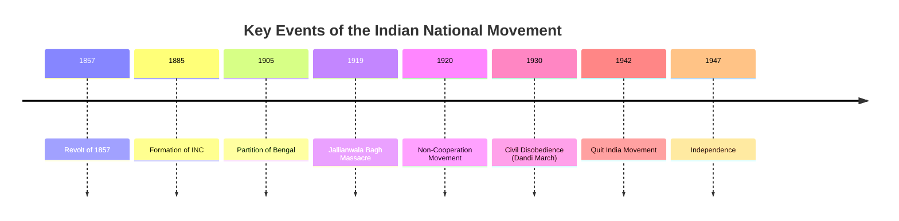

  <h3 style="color: var(--accent); margin-bottom: 16px; border-bottom: 1px solid var(--border); padding-bottom: 8px; display: flex; align-items: center; gap: 8px; font-weight: 600;">MODERN INDIA NATIONAL MOVEMENT AND MCQS</h3>
  <h4 style="border-left: 3px solid var(--info); padding-left: 8px; margin-top: 24px; margin-bottom: 10px; color: var(--text-primary); font-weight: 600;">DEEP CONCEPTUAL EXPLANATION</h4>

GENERAL STUDIES 32. The first Muslim ruler to formulate the theory of kingship similar to the theory of divine right of king was (a) Qutub-ud-din Aibak (b) Alauddin Khilji (c) IItutmish (d) Balban 24. Consider the following historical personalities 1. Abdur Razzak 2. Edordo Barbosa 3. Marco Polo 4. Nicolo di Conti What is the correct chronological order in which they visited India? (a) 4, 1, 2, 3 (b) 3, 4, 1, 2 (c) 2, 3, 4, 1 (d) 1, 2, 3, 4 33. For his unbounded generosity, who amongst the following Sultans was titled by all writers of the time as ‘Lakh Baksh’ or giver of lakhs? (a) Nasir-ud-din Mahmud (b) Balban (c) Qutubuddin Aibak (d) Babar 19. Consider the following statements 1. He organised an efficient spy system.

2. To prevent fraudulent musters, he began the practice of branding horses (Daag) and preparing descriptive rolls of soldiers (Chehra).

3. One of the most remarkable of his reforms was that of market regulation.

4. He set aside the supremacy of the Ulema in the discharge of state duties.

These statements are about (a) Sikandar Lodhi (b) Firuz Shah Tughlaq (c) Alauddin Khilji (d) Qutub-ud-din Aibak 25. Mohammed-bin-Tughlaq’s experiment of producing token currency failed on account of the (a) rejection of token coins for purchase by foreign merchants (b) melting of token coins (c) large scale minting of spurious coins (d) poor quality of token currency 34. What does the word iqta stand for? (a) Law of primogeniture (b) Crown lands donated to army officers (c) State’s share of one-third of the spoils of war (d) The grant of revenue from a territory in lieu of salary 35. Match the following List I List II 20. Which of the following pairs is correctly matched? (a) Diwan-i-Bandgani : Firoz Tughlaq (b) Diwani-i-Mustakhraj : Balban (c) Diwan-i-Kohi : Alauddin Khilji (d) Diwan-i-Arz : Mohammed Tughlaq 26. Who amongst the following Sultans of the Slave dynasty reigned for the longest period? (a) Qutub-ud-din Aibak (b) Ghiyas-ud-din Balban (c) Nasir-ud-din Mahmud (d) Shams-ud-din lltutmish A. Land tax paid by the Hindus 1. Kham B. State’s share one/fifth of the spoils of war 2. Kharaj C. Land tax paid by the Muslims 3. Ushar D. Property tax 4. Zakat 21. In the Delhi Sultanate an administrative unit called ‘Paragana’ was headed by an official known as (a) Shiqdar (b) Barid (c) Ariz (d) Amil 27. Who among the following introduced the famous Persian festival of Navroz in India? (a) Balban (b) Firoz Tughlaq (c) IItutmish (d) Alauddin Khilji 22. Match the following List I List II A. Muftis 1.

Intelligence Agency B. Barid 2.

Expounder of Law 28. Which of the following pairs is correctly matched? (a) Guru Amar Das : Miri and Piri (b) Guru Arjun Dev : Adi Granth (c) Guru Ram Das : Dal Khalsa (d) Guru Govind Singh : Manji C. Kotwal 3. Minister Incharge of Army D. Arz-i-Mamalik 4. Head of City Administration Codes A B C D A B C D (a) 2 1 (b) 1 2 3 4 (c) 2 3 (d) 3 2 4 1 36. In which order did the following dynasties rule Delhi? 1. Slave 2. Khilji 3. Lodhi 4. Sayyid 5. Tughlaq Codes (a) 1, 2, 5, 4, 3 (b) 1, 2, 3, 4, 5 (c) 2, 3, 4, 5, 1 (d) 4, 5, 3, 2, 1 29. The founder of the first Afghan dynasty in India was (a) Ibrahim Lodhi (b) Bahlul Lodhi (c) Sikandar Lodhi (d) Sher Shah Suri 30. Which of the following pairs is not correctly matched? Codes A B C D A B C D (a) 2 4 (b) 1 2 3 4 (c) 4 3 (d) 2 1 4 3 23. Match the following (a) Alai Darwaza : Ala-ud-din Khilji (b) Jamait Khana Masjid : Balban List I (Authors) List II (Works) 37. Babar laid the foundation of the Mughal empire in AD 1526, by defeating (a) Daulat Khan Lodhi (b) Ibrahim Lodhi (c) Rana Sanga (d) Alauddin Khilji A. Minhaj-us-Siraj 1. Tarikh-i-Firuzshai B. Zia-ud-din Barni 2. Tabaqat-i-Nasiri C. Firzu Shah (Tughlaq) 3. Haquiqi Hindi D. Abdul-Wahid Bilgrami 4. Fatuhat-i-Firuzshahi (c) Qutub Minar : Iltutmish (d) Hissar : Firoz Shah Tughlaq 31. Who was the first monarch in the Delhi Sultanate to start direct relations with the cultivators to know the actual amount they paid as land revenue? (a) Balban (b) Mohammed-bin-Tughlaq (c) Alauddin Khilji (d) Sikandar Lodhi Codes A B C D A B C D (a) 1 2 (b) 2 1 3 4 (c) 1 2 (d) 2 1 4 3 38. What was the occasion for Rana Kumbha’s construction of the ‘tower of victory’ at Chittor? (a) His victory against Rao Jodha of Marwar (b) His victory against Mahmud Khilji of Malwa (c) His victory against Ahmed Shah of Gujarat (d) His victory against Ibrahim Shah of Bengal 43. Who was the founder of Chishti Silsila? (a) Khwaza Moin-ud-Din (b) Shiabuddin Shuarawardi (c) Sheikh Abdul Kadir Jalani (d) Shah Abdul Satari 49. Which of the following statements are true regarding Mohammad-bin-Tughlaq? 1. He introduced measures of regulate markets.

2. He introduced monetary reforms.

3. He increased the taxes paid by the people of the Doab region.

4. He invited leaders of different faiths for religious discussions.

Select the correct answer using the codes given below. (a) 1 and 2 (b) 2 and 3 (c) 3 and 4 (d) 1, 2 and 4 39. Which of the following are true about the Manasabdari system? 1. It meant organisation of civil and military services of the state on the basis of gradation of ranks.

2. The word ‘mansab’ is derived from the Arabic word meaning ‘fixing the place’.

3. Mansab in the Mughal administration fixed the rank, dignity and office of the public servant.

Select the correct answer using the codes given below. (a) Only 3 (b) 2 and 3 (c) Only 1 (d) All of these 44. Which of the following Bhakti Saints in chronological order? (a) Guru Nanak, Tulsidas, Ramdas, Tukaram (b) Tulsidas, Guru Nanak, Tukaram, Ramdas (c) Guru Nanak, Tulsidas, Tukaram, Ramdas (d) Tulsidas, Guru Nanak, Ramdas, Tukaram 45. Match the following List I List II A. Second Battle of Panipat 1. Decline of Vijayanagara empire B. Second Battle of Tarain 2. British rule in India C. Battle of Talikota 3. Turkish rule in India D. Battle of Plassey 4. Mughal rule in India 5. Slave dynasty in India 50. Which of the following were not included in the market regulation introduced by Alauddin Khilji? 1. The Sultan fixed the prices of foodgrains far below the usual rates.

2. He imported the necessaries by relaxing important duties.

3. He followed a non-intervention policy as far as the civil supplies were concerned.

4. Advances were given to merchants if they did not posses enough capital.

Select the correct answer using the codes given below. (a) 1 and 4 (b) 2 and 3 (c) 1 and 3 (d) 3 and 4 51. Match the following List I List II 40. Which of the following were the features of the Mansabdari system introduced by the Mughals? 1. Periodic inspection of artillery.

2. Branding horses.

3. Hereditary grant of Jagirs.

4. Lack of distinction between civil and military departments.

Select the correct answer using the codes given below. (a) 1 and 3 (b) 2 and 3 (c) 2 and 4 (d) 1 and 4 41. Match the following List I List II A. Iqta 1. Maratha B. Jagir 2. Delhi Sultanate C. Amaram 3. Mughals D. Mokasa 4. Vijayanagara A. Battle of Haldighati 1. Babar B. Battle of Bilgarm 2. Akbar C. Second Battle of Panipat 3. Humayun D. Battle of khanwa 4. Jahangir Codes A B C D A B C D (a) 2 3 (b) 3 1 2 4 (c) 4 3 (d) 5 3 2 1 46. With reference to the Medieval Indian rulers, which one of the following statements is correct? (a) Alauddin Khilji first set-up a separate ariz department (b) Balban introduced the branding system of horses of his military (c) Mohammad-bin-Tughlaq was succeeded by this uncle to the Delhi throne (d) Firoz Tughlaq set-up a separate department of slaves Codes A B C D A B C D (a) 3 2 (b) 2 3 4 1 (c) 2 3 (d) 3 2 4 1 52. Which one among the following books was authored by a lady of the Mughal Royal House? (a) Akbar Nama (b) Babur Nama (c) Humayun Nama (d) Badshah Nama 53. Amir Khusrau’s ‘Khazain-ul-Futuh’ gives information about the reign of (a) Ghiyasuddin Tughlaq (b) Alauddin Khilji (c) Qutub-ud-din Mubarak Shah Khilji (d) Jalal-ud-din Khilji 47. Who laid the foundation of the first independent Turkish kingdom in India? (a) Mohammad-bin-Qasim (b) Qutub-ud-din Aibak (c) Ghiyasuddin Balban (d) Mohammad-bin-Tughlaq 54. Which of the following pairs are correctly matched? Codes A B C D A B C D (a) 2 3 (b) 1 3 2 1 (c) 3 2 (d) 2 4 1 3 42. Which of the following are true with regard to Akbar? 1. He abolished Jaziya and the Pilgrim Tax in AD 1564 and AD 1563 respectively.

2. He erected the ‘Ibadatkhana’ for holding religious discussions.

3. His Din-i-Ilahi was a code of social conduct.

4. He got the Khutba to be read in his name in AD 1574.

Select the correct answer using the codes given below. (a) 1 and 2 (b) 1, 2 and 3 (c) 1 and 4 (d) All of these 48. Who among the following first divided his empire into Iqtas during the process or civil administration? (a) Aibak (b) lltutmish (c) Razia Sultan (d) Mohammad-bin-Tughlaq 1. Amir Khusrau Alauddin Khilji 2. Zia-ud-din Barni Mohammad-bin-Tughlaq 3. Ibn Batutah Firoz Shah 4. Minhaj-us-Siraj Iltutmish Codes (a) 1, 2 and 3 (b) 1 and 4 (c) 2, 3 and 4 (d) 1, 3 and 4 GENERAL STUDIES 55. Match the following 61. Which of the following pairs is incorrectly matched? List I List II (a) Athanasius Nikitin : Bahmani kingdom A. Kabir 1.

Weaver B. Ravidas 2.

Barber C. Namdev 3.

Tailor D. Sena 4.

Cobbler Codes A B C D A B C D (a) 1 2 (b) 3 2 1 4 (c) 4 3 (d) 4 1 3 2 56. Match the following List I (Saint-Poets) List II (Language of the Compositions) A. Mirabai 1.

Malayalam B. Tyagaraja 2.

Bengali C. Chandidas 3.

Hindi D. Purandardasa 4.

Telugu 5.

S Kannada Codes (a) (b) (c) (d) 67. Consider the following statement(s) about Sufism 1. The Sufism were critical of the dogmatic definitions and scholastic methods of interpreting the Quran and Sunna (traditions of the prophet) adopted by the theologians.

2. The Sufis sought an interpretation of the Quran on the basis of their personal experience.

Which of the statement(s) given above is/are correct? (a) Only 1 (b) Only 2 (c) Both 1 and 2 (d) Neither 1 nor 2 (b) Nicolo Conti : Deva Raya I (c) Abdur Razzaq : Deva Raya II (d) None of the above 62. Consider the following statements regarding the Vijayanagara empire.

1. It was named after the city of Vijayanagara.

2. Krishna Dava Raya was the greatest of all the Vijayanagara rulers.

3. Kings of Vijayanagara ruled on behalf of Shaivite deity Virupaksha.

4. Vijayanagara empire successfully resisted the march of the Delhi Sultans to the South.

68. Match the following List I List II Which of the statement(s) given above are correct? (a) 1 and 3 (b) 1, 2 and 4 (c) 1, 2 and 3 (d) 2, 3 and 4 A. Nizamuddin Auliya 1. Firdausi B. Sheikh Bahauddin Zakaria 2. Chisti C. Sheikh Abdulla 3. Suhrawardi D. Badruddin Samarqandi 4. Shattariya 63. The Portuguese traveller, Nuniz visited Vijayanagara during the reign of which one of the following? (a) Vira Narasimha (b) Deva Raya I (c) Achyuta Raya (d) Sadasiva Raya Codes A B C D A B C D (a) 2 4 (b) 3 4 2 5 (c) 2 5 1 4 (d) 3 5 2 4 57. For the first, time, the land was divided into different categories of purposes of revenue on the basis of the quality of land and its capacity for production during the reign of (a) Alauddin Khilji (b) Firuz Tughlaq (c) Sher Shah Suri (d) Mohammad-bin-Tughlaq Codes A B C D A B C D (a) 2 1 (b) 4 1 2 3 (c) 3 1 (d) 3 2 1 4 69. Akbar’s land revenue system was known as (a) Bandobast system (b) Zabti system (c) Todar Mal’s revenue system (d) All of the above 70. Match the following List I (Structures) List II (Places) 64. Which one of the following is the correct chronological order of the Afghan rulers on the throne of Delhi? (a) Sikandar Shah-Ibrahim Lodhi- Bahlul Khan Lodhi (b) Sikandar Shah-Bahlul Khan Lodhi- Ibrahim Lodhi (c) Bahlul Khan Lodhi-Sikandar Shah- lbrahim Lodhi (d) Bahlul Khan Lodhi-lbrahim Lodhi- Sikandar Shah 58. Consider the following statement(s) 1. Shivaji biography by Sabhasad is known as Bakhar.

2. Watandars were the local elements in Maratha kingdom.

3. The lowest unit of the country was termed as ‘‘prants’’ in the Maratha Kingdom.

Which of the statement(s) given above is/are correct? (a) 1 and 2 (b) 1 and 3 (c) Only 3 (d) All of these A. Akbar’s Mausoleum 1. Lahore B. Gola Mendola 2. Chittorgarh C. Jahangir’s Mausoleum 3. Sikandara D. Vijayastambha 4. Udaipur 65. Which one of the following departments was created by Alauddin Khilji to improve the functioning of the state revenues? (a) Diwan-i-Mustakharaj (b) Diwan-i-Kohi (c) Diwan-i-Arz (d) Diwan-i-Insha 59. The ruler of which one of the following was not invited to join the confederacy of fight against Vijayanagara in the Battle of Talikota? (a) Ahmadnagar (b) Berar (c) Bijapur (d) Golconda 66. Match the following List I List II Codes A B C D A B C D (a) 4 3 (b) 4 3 1 2 (c) 3 4 (d) 3 4 1 2 71. Akbar founded the Din-i-Ilahi primarily to (a) put an end to differences between the Hindus and the Muslims (b) establish a national religion which would be acceptable to the Muslims and Hindus (c) ensure racial and communal harmony (d) form a religious club A.

Adil Shahi 1. Berar B.

Imad Shahi 2. Bidar C. Qutub Shahi 3. Ahmadnagar D.

Nizam Shahi 4. Golconda E.

Barid Shahi 5. Bijapur 60. Which one of the following sequences indicates the correct chronological order? (a) Shankaracharya, Ramanuja, Chaitanya (b) Ramanuja, Shankaracharya, Chaitanya (c) Ramanuja, Chaitanya, Shankaracharya (d) Shankaracharya, Chaitanya, Ramanuja (d) He was responsible for the security of foreign travellers on the highways of the empire (c) Diwan-i-Bandagan or the Department of Slaves was created by Feroz Shah Tughlaq (d) Diwan-i-Khairat or the Department of Public Charities was created by Sikander Lodhi 72. Consider the following statement(s) 1. Mirabai was a contemporary of Guru Nanak.

2. Ramdas was a contemporary of Shivaji.

Which of the statement(s) given above is/are correct? (a) Only 1 (b) Only 2 (c) Both 1 and 2 (d) Neither 1 nor 2 78. Consider the following statement(s) 1. Humayun regained his Delhi throne from Sher Shah in AD 1555.

2. Humayun defeated Hemu at the Second Battle of Panipat in AD 1556.

Which of the statement(s) given above is/are correct? (a) Only 1 (b) Only 2 (c) Both 1 and 2 (d) Neither 1 nor 2 83. The introduction of token currency by Mohammad-bin- Tughlaq did not succeed because (a) the scarcity of silver for minting the silver Taka was over (b) merchants refused to accept the token currency (c) extensive counterfeiting of token currency (d) foreign trade suffered badly 73. Which one among the following depicts the correct meaning of the term Jins-i-Kamil concerning crops in Mughal India? (a) Paddy crop (b) Cash crop (d) Coarse crop (d) Crop grown in the arid 74. Al-Beruni came to India along with (a) Mahmud of Ghazni (b) Mohammed-bin-Qasim (c) Mohammed Ghori (d) Timur 75. Which one of the following pair is correctly matched? (a) Zia-ud-din Barni Tarikh-i- Mohammedi (b) Shams-i-Siraj Afif Tarikh-i-Firozshahi 79. Silk routes are a good example of vibrant pre-modern trade and cultural links between distant parts of the world. Which one among the following is not true of silk routes? (a) Historians have identified several silk route over land and sea (b) Silk routes have linked Asia with Europe and Northern Africa (c) Silk routes existed before the Christian era and thrived almost upto 15th century (d) As a result of silk route trade, precious metals like gold and silver, flowed from Asia to Europe 84. Which of the following was not one of the long-term benefits of the transfer of capital by Mohammed-bin-Tughlaq to Daulatabad? (a) It led to a better control of the peninsula by the Sultanate (b) It helped in bringing North and South India closer together by improving communications (c) It resulted in a new process of cultural interaction between North and South India (d) It shifted the centre of political gravity from the North to the South 80. Which one among the following statements is incorrect of the Jajmani system? (a) It was a non-market exchange system (b) It was practised in many villages and regions during the pre-colonial period (c) It was introduced under pressure from the colonial regime (d) It was incorporated into wider networks of exchange through which agricultural products and other goods circulated 85. Which of the following statement(s) is/are correct? (a) Balban did not go for fresh conquests, rather he concentrated on consolidation of the infant state at Delhi (b) He set about a policy for liquidation of the Challisa or 40 nobles (c) Balban did not differentiated in matters of administration and justice (d) All of the above (c) Ibn Batuta Fatwa-i-Jahandari (d) Amir Khusrau Tabaqat-i-Nasiri 76. Which of the following was/were steps taken by Sher Shah to promote trade and commerce? 1. Making travel safe for traders.

2. Building a new highway between Delhi and Warangal.

3. Abolishing internal duties and levying taxes only at the points of import and sale.

4. Building sarais along roadways.

Select the correct answer using the codes given below. (a) 1, 2 and 3 (b) 2 and 3 (c) 1, 3 and 4 (d) All of these 86. Match the following List I List II 81. The first Muslim invasion of India was led by (a) Mahmud of Ghazni (b) Mohammad Ghori (c) Mohammad-bin-Qasim (d) Timur A. Urdu 1. Composed verses in Hindavi using Persian B. Amir Khusro 2. Literal meaning of the world is Army or Camp C. Sher Shah Suri 3. Built old fort in Delhi Codes A B C (a) 2 1 (b) 1 2 (c) 3 1 (d) 1 3 77. Which one among the following is not a function of Mir Bakshi, the Head of the Military Department as well as of the nobility under Mughal rule? (a) He made recommendations for appointment of Mansabs to the emperor (b) He collected reports of intelligence and information agencies of the empire and presented them to the emperor at the court (c) He was responsible for all incomes and expenditures and held control over Khalisa, Jagir and Inam lands 82. Which of the following statements about the creation of departments by the various Sultans is not correct? (a) Diwan-i-Mustakhraj or the Department of Revenue to realise the areas was created by Alauddin Khilji (b) Diwan-i-Amirkohi or the Department of Agriculture became more prominent during the reign of Mohammad-bin-Tughlaq GENERAL STUDIES 96. Which of the following administrative officers is not correctly matched with their duties? Codes A B C D A B C D (a) 3 4 (b) 4 3 2 1 (c) 4 3 (d) 1 4 2 3 91. Which one of the following pairs is correctly matched? (a) Umarah Group of officers called nobles (b) Barids The news reporters and secret spies (c) Majlis-i-Am or Majlis-i- Khalawant 87. Which of the following statement(s) is/are correct? (a) During the reign of Nasiruddin Mahmud Tughlaq, Timur (Timurlang), a central Asian Turk, invaded India and sacked Delhi (b) The dynasty founded by Khizr Khan, Timur’s nominee, is known as the Sayyid dynasty because Khizr Khan was a descendant of the prophet (c) Both ‘a’ and ‘b’ (d) Neither ‘a’ nor ‘b’ (a) Wakil-i-Dar : Controller of the royal household (b) Hamir-i-Hajib : Master of ceremonies at the court Hajib (c) Akhurbek : Superintendent of royal (d) Naib-i-Mulk : Deputy Prime Minster 97. Which of the following is/are not correct with regard to the architecture of the Turks? 1. In the sphere of decoration, the Turks eschewed representation of human and animal figures in their buildings.

2. The Turks used geometrical and floral designs, combining them with panels of inscriptions containing, verses from the Quran.

3. The Turks did not borrow from Hindu motifs.

4. The Turks did not add colour to their buildings, they used only white marble.

Select the correct answer using the codes given below. (a) 1 and 2 (b) 2 and 4 (c) 3 and 4 (d) 1 and 3 88. Which of the following is/are wrong in context of Alauddin Khilji? 1. Alauddin’s Southern expedition was led by Malik Kafur.

2. Malik Kafur marched with his army upto Madurai.

3. North Indian army had not managed to cross Vindhyas other than that of Alauddin Khilji Army.

4. Alauddin established a direct control over the defeated States of Deccan.

Select the correct answer using the codes given below. (a) 2, 3 and 4 (b) Only 3 (c) Only 4 (d) 3 and 4 Council of friends and trusted officers of the Sultan, which he consulted on important affairs of state (d) All of the above 92. Alam Khan, one of those who invited Babur to invade India was (a) an uncle of Ibrahim Lodhi and a pretender to the throne of Delhi (b) a cousin of Ibrahim Lodhi, who was ill-treated and expelled from the country (c) the father of Dilawar Khan to whom cruel treatment was meted out by Ibrahim Lodhi (d) a high official in Punjab province, who was very much discontented with Ibrahim Lodhi’s treatment to his tribe 93. Amir Khusrau gave the first graphic description of Jauhar of Rajput women, after victory of Alauddin Khilji over which Rajput State? (a) Ranthambhor (b) Chittor (c) Jalor (d) Sevana 98. In Delhi Sultanate, the struggle between the monarchy and the Turkish Chiefs continued till one of the Turkish Chiefs gradually arrogated all power to himself and ascended to throne in 1265. Name this Turkish Chief. (a) Nizan-ul-Mulk Junaidi (b) Nasiruddin Mahmud (c) Ulugh Khan (d) Iltutmish 89. Consider the following statement(s) about Iltutmish 1. He was the first sovereign ruler of the Sultanate of Delhi.

2. He was the first Sultan of Delhi to issue regular currency and declare Delhi as the capital of his empire.

3. He created the Turkish nobility called the chalisa or the group of forty.

Which of the statement(s) given above is/are correct? (a) 1 and 2 (b) Only 3 (c) 2 and 3 (d) All of these 90. Match the following List I List II 94. Consider the following statement(s) 1. Amir Khusrau created a new literary style in Persian, which came to be known as Sabaq-i-Hind.

2. Amir Khusrau was disciple of Nizammudin Auliya.

3. He introduced the perso-arabic ragas etc.

Which of the statement(s) given above is/are correct? (a) Only 3 (b) 1 and 2 (c) All of these (d) None of these 99. Consider the following statement(s) about Alauddin Khilji.

1. The maximum number of Mongol invasions took place during his reign.

2. He was the first sultan to adopt the principle of measurement of cultivable land for determining land revenue.

Which of the statement(s) given above is/are correct? (a) Only 1 (b) Only 2 (c) Both 1 and 2 (d) Neither 1 nor 2 A. Mohammad- bin-Tughlaq 1. Land revenue assessment based on actual measurement B. Firoz Tughlaq 2. Restoration of the prestige of the crown C. Balban 3. Creation of department of agriculture D. Alauddin Khilji 4. Creation of the employment bureau 100. After the capture of Delhi and Ajmer by Mohammed Ghori the successor of Prithviraj Chauhan founded a new kingdom with its capital at (a) Mewar (b) Ranthambhore (c) Chittor (d) Ajmer 95. The story that Alauddin Khilji invaded Chittor to secure Padmini, the queen of Rana Ratan Singh of Mewar, was vividly described by (a) Amir Khusrau in Khazainul Futuh (b) Col J Todd in Annals and Antiquities of Rajasthan (c) Malik Mohammed Jayasi in the epic Padmavat (d) Ibn Battuta in his Rehla 110. Who among the following has issued the coin rupee for the first time? (a) Muhammed-bin-Tughlaq (b) Alauddin Khilji (c) Sher Shah (d) Akbar (c) The basis of the demand by the government was to get-hasil (actual recovery) with enough provision for crop failures (d) He made a large reduction in the scale of revenue fixed by Alauddin and brought it down to one-sixth of the gross produce 101. Alauddin Khilji’s market control system died instantaneously with his death because (a) it was not based on the principle of demand and supply (b) Alauddin Khilji’s successors had no will to continue the system (c) Both ‘a’ and ‘b’ (d) the whole system was kept alive by the use of brute force 111. Which of the following was the original name of Tansen, the famous musician in the court of Akbar? (a) Mahananda Pande (b) Lal Kalwant (c) Baz Bahadur (d) Ramtanu Pande 106. Which of the following was not one of the revenue and agrarian measures of Firoz Shah Tughlaq? (a) He retained only four kinds of taxes sanctioned by the Quran (Kharaj, Zakat, Jaziya, and khums) (b) He undertook revaluation of land to certain its assessment (c) Religious endowments which had reverted to the state under previous rulers were returned to the earlier holders or their descendants (d) He was generous in granting land to civil and military officers and in farming out land 102. Consider the following statements about Balban 1. He called himself Naib-i-Khudai or Deputy of the God.

2. He created Diwan-i-Arz or department of military affairs.

3. He propounded the theory of kingship and restored peace in the Doab.

4. He liquidated the Turkish nobility chalisa or the group of forty.

Which of the statements given above are correct? (a) 1, 2 and 3 (b) 1, 3 and 4 (c) 2, 3 and 4 (d) All of these 112. Which one among the following was/were reason/reasons for the success of European trading companies in South India during the 17th century? 1. The presence of the Mughals in the South was not as much as in the North.

2. The Vijayanagara Kingdom had been overthrown in the late 16th century.

3. The South had many small and weak states.

Select the correct answer using the codes given below. (a) Only 1 (b) 1 and 2 (c) 2 and 3 (d) All of these 103. Consider the following statements 1. Firoz Shah Tughlaq created Diwan-i-Khairat for helping poor Muslim parents in the marriage of their daughter.

2. Mohammad-bin-Tughlaq was known as a ‘Prince of Moneyers’.

3. Firoz Shah Tughlaq wrote in verses in Persian under the name of Gulrakhi.

Which of the statements given above are correct? (a) 1 and 3 (b) 2 and 3 (c) 1 and 2 (d) None of these 113. Which one of the following statements about the teachings of Kabir is not correct? (a) He was not against pilgrimage and idol worship (b) He believed in universal love (c) He emphasised on one God and the spread of devotionalism (d) He did not consider it necessary of abandon the normal life of a householder 114. The Iron Pillar near Qutub Minar draws attention of scientists due to its (a) antiquity (b) glitter (c) hardness (d) restlessness 107. Which of the following statement(s) is/are correct about Sultan Mohammad-bin-Tughlaq? (a) He was the first Sultan to formulate the ‘Famine code’ to provide relief to famine affected people (b) He was the most learned Muslim ruler who was well versed in various branches of learning-including astronomy, mathematics and medicine (c) He granted Sondhar loan to the poor for promoting agriculture (d) All of the above 108. Which of the following statements about Iqta system is correct? (a) Iqta means revenue assignment of a particular area in lieu of cash salary (b) The principle of hereditary Iqta was completely rejected by Balban (c) Ghiyasuddin Tughlaq differentiated between the allotment of the revenues within an Iqta for the personal income of the muqta and that for the payment of salaries to the troops placed under his charge (d) All of the above 104. Which of the following is true about Firoz Shah Tughlaq? (a) He established a department of public works (b) He constructed a water clock and sun clock at Delhi (c) He formed a charity department (d) All of the above 109. ‘A Forgotten Empire’, written by the renowned historian Robert Sewell is about which one of the following Empires? (a) Kushan empire (b) Mauryan empire (c) Vijayanagara empire (d) Mughal empire 105. Which of the following agrarian measures was not taken by Ghiyasuddin Tughlaq? (a) He discarded measurement in favour of sharing (b) The chiefs and headmen of villages were given back their perquisites 115. Which one among the following was a possible reason for the success of Nadir Shah’s military compaign in Delhi? (a) Weak Mughal Emperor (b) Lack of strong defence in the North-West Frontier (c) Late preparation for the defence of Delhi (d) Use of superior military technology by the invading army GENERAL STUDIES 116. Shaikh Moinuddin, Bakhtiyar Kaki and Farid-ud-din Ganj-i-Shakar were (a) prominent military leaders of the Sultanate period (b) prominent painter from the Sultanate period (c) prominent Chisti Saints (d) prominent poets from the courts of the Sultanate period 2. He further divided these sarkars into smaller administrative units called Parganas.

3. His land revenue policy is an important land mark in the history of Indian agrarian system.

4. His silver rupia after elimination of its inscription was current till 1835 and formed the basis of the later British Indian currently.

120. Consider the following statement(s) about the famous traveller Ibn Battuta.

1. He was a Moroccan traveller.

2. He narrated his experiences while travelling the subcontinent in the 14th century in Kitab-ul-Hind.

3. He was sent as an envoy of Sultan of Delhi to China.

117. Match the following List I (Events) List II (Places/Persons) Which of the statement(s) given above is/are correct? (a) Only 3 (b) 1 and 2 (c) 1 and 3 (d) All of these 1. Vijayanagara These statements are about (a) Alauddin Khilji (b) Sher Shah Suri (c) Muhammad-bin-Tughlaq (d) Jahangir A. Tarmashirin Khan’s invasion of India 2. Zainul Abidin B. Visit of Farnao Martinz Evangelho, the Portuguese factor C. Visit of the traveller Nuniz 3. Champaner D. Network of canals in Kashmir valley 4. Mohammed Tughlaq 126. Consider the following statement(s) about Vijayanagara Empire 1. Vijayanagara was noted for its markets dealing in spices, textiles and precious stones.

2. Krishnadeva Raya’s rule was characterised by the strain within the imperial structure.

3. The amara-nayakas were military commanders who were given territories to govern by the Royas.

121. Which one among the following was not a reform measure carried out by Mahmud Gawan of Bahmani Kingdom? (a) The kingdom was divided into eight provinces or Tarafs (b) Nobles were paid salaries and were asked to maintain contingents of horses (c) A tract of land, Khalisa, was set apart for the expenses of he Tarafdar (d) Lands were measured and land taxes were fixed on that basis Which of the statement(s) given above is/are correct? (a) Only 3 (b) 1 and 2 (c) 1 and 3 (d) All of these 122. The Nayakas in the Vijayanagara period were often called as the Amara nayakas because (a) their position was hereditary (b) they granted the amaram lands (c) for their maintenance they were given revenue and tax free amaram lands (d) their exploits were considered immortal (amara) Codes A B C D A B C D (a) 2 1 3 4 (b) 2 3 1 4 (c) 4 3 2 1 (d 4 1 3 2 118. Consider the following statement(s) relating to Sher Shah.

1. During Sher Shah’s reign, the village panchayat and zamindars were not allowed to deal with civil and criminal cases at the local level.

2. Sher shah set-up army cantonments in different parts of the empire and a strong garrison was posted in each of them.

127. Consider the following observation(s) relating to the reign of the Mughal Emperor Akbar.

1. Akbar strengthened his control on the nobility and the army by introducing the mansabdari system.

2. Under the mansabdari system every officer was assigned a rank (mansab).

3. The ranks were divided into three : Zat and Chera.

Which of the statement(s) given above is/are correct? (a) Only 1 (b) Only 2 (c) Both 1 and 2 (d) Neither 1 nor 2 123. The meaning of word Bantai during medieval period was (a) religion tax (b) wealth tax (c) system of calculating revenue (d) property tax 119. Which one among the following pairs is correctly matched? Which of the statement(s) given above is/are correct? (a) Only 1 (b) Only 2 (c) Both 1 and 2 (d) Only 3 (a) The Second Battle of Tarain Defeat of Jaichand of Kannauj by Mohammad Ghori Defeat of Sikander Lodhi by Babar (b) The First Battle of Panipat 124. The sufi saint who maintained that devotional music was one way of coming close to God was (a) Moin-ud-din Chisti (b) Baba Farid (c) Sayyid Muhammad Gesudaraz (d) Shah Alam Bukhari (c) The Battle of Chausa Defeat of Humayun by Sher Shah (d) The Battle of Khanwa Defeat of Rana Pratap by Akbar 128. Chishti order became the most popular sufi order in India on account of (a) Its high ethical ideals (b) the identification of the Chisti saints with the common masses (c) the liberal outlook of many of its saints (d) All of the above 125. Consider the following statement(s) 1. He divided his whole empire into 47 divisions called sarkars. QUESTIONS FROM CDS EXAM (2012-2016) 2012 (II) 5. Which one among the following books was authored by a lady of the Mughal Royal House? (a) Akbar Nama (b) Babur Nama (c) Humayun Nama (d) Badshah Nama 9. Ibn Battuta’s work, Rihla, completed in 1355, is (a) an autobiography (b) an account of the Delhi Sultans from Aibak to Ghiyasuddin Tughlaq (c) a religious text (d) an account of trade with Morocco 2013 (II) 10. Rajatarangini, authored by Kalhan, describes the history of (a) Gujarat (b) Bengal (c) Kashmir (d) Punjab 11. Which of the following did not constitute part of the army reforms of Sher Shah? (a) Keeping a large army at the centre (b) Introduction of a swiftly moving artillery (c) Cash payment to soldiers (d) Introduction of the practice of branding horses 6. Consider the following statement(s) about the European travellers to India.

1. Sir Thomas Roe, the Representative of the East India Company, was granted the permission by Jahangir to open a factory at Surat.

2. Captain Hawkins was driven out from Agra by the Mughals at the instigation of Portuguese.

3. Father Monserrate travelled with Akbar on his journey to Kashmir.

Which of the statement(s) given above is/are correct? (a) 2 and 3 (b) Only 1 (c) 1 and 2 (d) 1 and 3 2013 (I) 1. Which one among the following is not a function of Mir Bakshi, the Head of the Military Department as well as of the nobility under Mughal rule? (a) He made recommendations for appointment of Mansabs to the emperor (b) He collected reports of intelligence and information agencies of the empire and presented them to the emperor at the court (c) He was responsible for all incomes and expenditures and held control over Khalisa, Jagir and Inam lands (d) He was responsible for the security of foreign travellers on the highways of the empire 2. Consider the following statement(s) about Shivaji’s military acumen 1. He was a master in guerrilla tactics and swift cavalry warfare.

2. He had built a series of fortified strongholds on the table mountains of the Western Deccan.

Which of the statement(s) given above is/are correct? (a) Only 1 (b) Only 2 (c) Both 1 and 2 (d) Neither 1 nor 2 7. What was Ziyarat in the language of the Sufis? (a) Pilgrimage to the tombs of Sufi saints for seeking barkat (spiritual grace) (b) Reciting divine name (c) Offering free kitchens run on futuh (unasked for charity) (d) Setting up of auqaf (charitable trusts) 12. The Mansabdari system of the Mughals was a complex system. Its efficient functioning depended upon 1. the practice of offering the title of ‘Mansabdar’ to military personnel only.

2. proper functioning of the dagh (branding) system.

3. proper functioning was of the jagirdari system.

Select the correct answer using the codes given below. (a) Only 1 (b) 1 and 3 (c) 2 and 3 (d) All of these 13. Which one among the following thinkers argued that Maratha rule in general and Shivaji in particular represented early nationalist consciousness in India? (a) Pandita Ramabai (b) MG Ranade (c) Bipin Chandra Pal (d) Gopal Krishna Gokhale 3. Consider the following statement(s) about Sufism.

1. The Sufism were critical of the dogmatic definitions and scholastic methods of interpreting the Quran and Sunna (traditions of the prophet) adopted by the theologians.

2. The Sufis sought an interpretation of the Quran on the basis of their personal experience.

Which of the statement(s) given above is/are correct? (a) Only 1 (b) Only 2 (c) Both 1 and 2 (d) Neither 1 nor 2 2014 (I) 8. Between 1309 and 1311, Malik Kafur led two campaigns in South India. The significance of the expeditions lies in it that 1. they reflected a high degree of boldness and spirit of adventure on the part of the Delhi rulers.

2. the invaders returned to Delhi with untold wealth.

3. they provided fresh geographical knowledge.

4. Alauddin promoted Malik Kafur to the rank of Malik-naib or Vice-Regent of the empire.

Select the correct answer using the codes given below. (a) 1 and 3 (b) 1, 2 and 4 (c) 2 and 4 (d) All of these 14. Consider the following statement(s) regarding Indian Feudalism in the early medieval period 1. The revenue assignments were called Bhoga.

4. Which one among the following depicts the correct meaning of the term Jins-i-Kamil concerning crops in Mughal India? (a) Paddy crop (b) Cash crop (c) Coarse crop (d) Crop grown in the arid GENERAL STUDIES 2014 (II) 2. The hereditary chiefs neither collected revenues nor assumed administrative powers.

Which of the statement(s) given above is/are correct? (a) Only 1 (b) Only 2 (c) Both 1 and 2 (d) Neither 1 nor 2 24. Which empire did Nicolo de Conti, Abdur Razzaq, Afanasy Nikitin and Fernao Nuniz visit? (a) The empire of Kannauj (b) Vijayanagara empire (c) Hoysala empire (d) Rashtrakuta empire 2015 (II) 19. Statement I The 12th century witnessed the emergence of a new movement in Karnataka led by a Brahmana named Basavanna. Statement II The Lingayats worshipped Shiva in his manifestation as a Linga. Codes (a) Both the statements are individually true and Statement II is the correct of Statement I (b) Both the statements are individually true, but Statement II is not the correct of Statement I (c) Statement I is true, but Statement II is false (d) Statement I is false, but Statement II is true 15. Consider the following statement(s) from Kalhana’s Rajatarangini.

1. The common people ate rice and Utpala-saka (a wild vegetable of bitter taste).

2. Harsha introduced into Kashmir a general dress befitting a king which included a long coat.

Which of the statement(s) given above is/are correct? (a) Only 1 (b) Only 2 (c) Both 1 and 2 (d) Neither 1 nor 2 16. Match the following List I (Texts) List II (Authors) 25. Consider the following statement(s) about Alauddin Khilji’s market policy 1. He placed markets under the control of a high officer called ‘Shahna’ for strictly controlling the shopkeepers and prices.

2. In order to ensure a regular supply of cheap foodgrains, he ordered the land revenue from Doab region to be paid directly to the state.

Which of the statement(s) given above is/are correct? (a) Only 1 (b) Only 2 (c) Both 1 and 2 (d) Neither 1 nor 2 26. Match the following A. Kitab-al-Hind 1. Ibn Battuta B. Rehla 2. Al-Biruni C. Humayun Nama 3. Lahori D. Badshah Nama 4. Gulbadan Begum List I (Terms) List II (Meanings) 20. Which of the statements given below about the Mughal rule in India is false? (a) Peasant communities were a united and homogeneous group (b) There was an abundance of food grain (c) The state encouraged those crops that brought in more revenue (d) Most regions produced two crops in a year A. Mihrab 1. Stepped pulpit B. Mimbar 2. Direction towards the Kaba for prayer C. Khutba 3. Arch D. Kibla 4. Sermon 21. The ruins of the Vijayanagara at Hampi were brought to light in 1800 by (a) Colonel Colin Mackenzie (b) Sir John Shore (c) Andrew Fraser (d) John Marshall Codes A B C D A B C D (a) 2 1 (b) 2 4 1 3 (c) 3 1 (d) 3 4 1 2 27. Match the following List I (Persons) List II (Works) A. Uddanda 1. Sudhanidhi B. Sayana 2. Mallikamaruta C. Yadavaprakasha 3. Malatimadhava D. Bhavabhuti 4. Vaijayanti Codes A B C D A B C D (a) 2 4 (b) 3 1 4 2 (c) 3 4 (d) 2 1 4 3 17. Consider the following statement(s) about Sher Shah’s administration 1. He divided his empire into Sarkars, which were further subdivided into Parganas.

2. The Sarkars and the Parganas were directly administered by Sher Shah without the help of any other officials.

Which of the statement(s) given above is/are correct? (a) Only 1 (b) Only 2 (c) Both 1 and 2 (d) Neither 1 nor 2 22. Marco Polo’s trip to India (AD 1271) earned much fame in Europe on account of (a) his having discovered a safe route to India (b) his having established amicable relations with many Kings of India (c) his account of commercial, religious and social conditions in the East (d) All of the above 18. Match the following 2015 (I) List I (Temples) List II (Towns) A. Kailasanatha 1. Bhubaneswar B. Lingaraj 2. Khajuraho C. Kandariya Mahadev 3. Mount Abu D. Dilwara 4. Kanchipuram Codes (a) (b) (c) (d) 28. The ‘Sur Sagar’ is (a) a medieval treatise on music composed by Tansen (b) a poetic work of Surdas (c) memories of Bahadur Shah Zafar (d) None of the above 23. Upari refers to which one of the following? (a) A form of Marathi poetry that emerged during the Maratha period (b) A category of tenancy tenure held under the Maratha regime (c) A court official during Maratha rule (d) A group of peasants who repelled against their oppressive landlords under Maratha rule Codes A B C D A B C D (a) 4 2 (b) 4 1 2 3 (c) 3 1 (d) 3 2 1 4 29. After the death of Shivaji, there was a fight for succession between (a) Shambhaji and the widow of Shivaji (b) Shambhaji and Bajirao (c) Rajaram and Shambhaji (d) None of the above 30. Match the following 32. The Rihla was written in (a) Arabic in the 14th century by Ibn Battuta (b) Persian in the 15th century by Abdur Razzaq (c) Persian in the 13th century by Ibn Battuta (d) Italian in the 13th century by Marco Polo List I (Authors) List II (Works) 2016 (I) A.

Somadeva 1. Malavikagnimitram B.

Kalidasa 2. Kathasaritsagara C. Bhasa 3. Chaurapanchasika D. Bilhana 4. Svapnavasavadatta 1. The kings claimed to rule on behalf of the God Virupaksha.

2. Rulers used the title ‘Hindu Suratrana’ to indicate their close links with Gods.

3. All royal orders were signed in Kannada, Sanskrit and Tamil.

4. Royal portrait sculpture was now displayed in temples.

Select the correct answer using the codes given below. (a) Only 4 (b) 1 and 2 (c) 1, 2 and 3 (d) 1, 2 and 4 33. The followers of Gorakhnath were called (a) Jogis (b) Nath-Panthis (c) Tantriks (d) Sanyasis 34. What were the 12 states of the Sikh confederacy called? (a) Misl (b) Gurmata (c) Sardari (d) Rakhi Codes A B C D A B C D (a) 2 1 (b) 3 4 1 2 (c) 2 4 (d) 3 1 4 2 31. Who among the following was not a painter at Akbar’s Court? (a) Daswanth (b) Abdus Samad (c) Kalyan Das (d) Basawan 36. Iqta in medieval India meant (a) land assigned to religious personnel for spiritual purposes (b) land revenue from different territorial units assigned to army officers (c) charity for educational and cultural activities (d) the rights of the Zamindar 35. Which of the following statement(s) about the Vijayanagara empire is/are true? ANSWERS Practice Exercise Questions from CDS Exam (2012-16) GENERAL STUDIES PART III MODERN INDIA ADVENT OF THE EUROPEANS IN INDIA Danes Danes East India Company was founded in AD 1616. They established their settlement at Bengal (Serampur), Tranqueber (Tamil Nadu). They were forced to sell their settlements to the British in 1854. In the AD 17th-18th centuries India became a centre of attraction for many European nations, who were inspired by the new spirit of adventure and discovery. Following is the order in which Europeans came to India French The Portuguese • ‘Compagnie des Indes Orientales’ popularly known as the French East India Company was formed by Colbert, under state patronage in AD 1664.

• In AD 1667, an expedition was sent under Francois Caron, who established the first French factory India at Surat. In AD 1669, Marcara founded another French factory at Masulipatam by securing patent from the Sultan of Golconda.

• Vasco da Gama was sent in 1498 from Lisbon to find the direct sea-route from Europe to India. Francisco Almeida was the first Governor of Portuguese in India (1505-09). He introduced ‘The Policy of Blue Water’.

Albuquerque, the next Governor, built a great territorial power in India.

• In July 1672, French squadron under De La Haye occupied San Thome near Madras.

• They established trading settlements at Calicut, Cochin and Cannanore. Cochin was the early capital of the Portuguese in India. The Portuguese maritime empire acquired the name of Estado da India which intended to monopolise the pepper and spice trade of the East.

• In 1673, Francois Martin, director of the Masulipatam factory, obtained from Sher Khan Lodi, Governor of Valikondapuram, a site for a factory, which later developed into Pondicherry and its first governor was Francois Martin.

• The Portuguese were able to establish their settlements near the sea in Diu, Daman, Salsette, Bassein, Chaul and Bombay on the Western coast and San Thome near Madras and Hooghly in Bengal.

• In Bengal, the French laid the foundation of their famous settlement of Chandranagar in AD 1690 on a site granted to them by Shaista Khan.

Dutch • In 1602, the Dutch East India Company was formed by the Dutch Parliament through a charter which gave them powers to fight wars. The European Commerce India had maintained its trade relations with the foreign merchants even during the earlier centuries. There was a great difference between the foreign merchants who had earlier settled in and conducted brisk trade from India and the Europeans who came to India in the 16th and 17th centuries.

• The Dutch gradually set-up factories at Masulipatnam, Pulicat, Surat, Bimilipatnam, Karikal, Chinsura, Kasimbazar, Boranagore, Patna, Balasore, Nagapatnam and Cochin. In 18th century, Dutch power in India began to decline and finally, collapsed with their defeat by English in the Battle of Bedara in 1759.

GOVERNOR-GENERAL OF BENGAL English Warren Hastings (1773-85) • English East India Company was founded in AD 1600 by the merchants of London, for trade with India. It was chartered on 31st December, 1600 by Queen Elizabeth and granted the monopoly of Eastern trade.

• He became Governor of Bengal in 1772 and first Governor-General of Bengal in 1773, through the Regulating Act. He abolished the dual system of administration.

• He divided Bengal into districts and appointed collectors and other revenue officials. He established India’s first Supreme Court in Calcutta.

• Jahangir permitted the East India Company to establish factories at several places in the empire. Gradually, the company established factories at Agra, Ahmedabad, Baroda, Broach, Bombay, Surat, Madras, Masulipatnam and different parts of Orissa, Bihar, Bengal.

• He founded Asiatic Society of Bengal with William Jones in 1784 and wrote introduction to the first English translation of the Gita by Charles Wilkins.

• The Island of Bombay was acquired by the East India Company from the British Government in 1668 and was immediately fortified. The first factory of English was established at Surat (1608).

• Started Diwani and Faujdari adalats and the district level Sadar diwani and Nizmat adalats (appellate courts).

• He redefined Hindu and Muslim laws. A translation of code in Sanskrit appeared under the title ‘Code of Gentoo laws’.

• In 1800, he set-up Fort William College in Calcutta. He was famous as Bengal Tiger. He brought the censorship of Press Act, 1799.

Lord Ellenborough (1842-44) Brought an end to the Afghan War (1842). The main events which took place during his tenure were as follow Sir George Barlow (1805-07) Vellore mutiny (1806, by soldiers) took place. Second Anglo-Maratha War ended.

• Annexation of Sindh to British Empire (1843).

• First Anglo-Maratha War was fought during his period, which ended with Treaty of Salbai (1776-82). Second Anglo-Mysore War (1780-84), ended with Treaty of Mangalore. Rohilla War (1774) look place.

• Charles Napier was replaced by Major Outram as the resident in Sindh.

Lord Minto I (1807-13) Treaty of Amritsar (1809) with Ranjit Singh was signed. Charter Act of 1813 ended the monopoly of East India Company in India.

• Pitts India Act, 1784 and Edmund Burke Bill, 1783 was passed.

Deprived Zamindars of their judicial powers. Maintenance of records was made compulsory. Lord Hardinge (1844-48) The main events during his tenure were First Anglo-Sikh War and the Treaty of Lahore. Lord Hastings (1813-23) Adopted the policy of intervention and war. Anglo-Nepal War (1813-23) took place.

• Impeachment proceedings started against him in Britain on the charges of taking bribe. After a trial of 7 years, he was finally acquitted.

GOVERNOR-GENERALS OF INDIA Lord Cornwallis (1786-93) Lord William Bentinck (1828-35) • First person to codify laws (1793). The code separated the revenue administration from the administration of justice. He introduced Izaredari System in 1773. He started the permanent settlement of Bengal.

• Most liberal and enlightened among all Governor-General of India. Regarded as the ‘Father of Modern Western Education in India’. Abolition of Sati in 1829 by Regulation XVII. Thugi was suppressed in 1830. Passed the Charter Act, of 1833.

Lord Dalhousie (1848-56) The main events during his tenure were Second Anglo-Sikh War (1848-49) and annexation of Punjab. Abolished title and passed pensions. Widow Remarriage Act (1856).

Introduced Doctrine of Lapse.

Woods Educational Despatch of 1854 was passed. Introduction of the Railway, Telegraph and the Postal System in 1853. Second Anglo-Burmese War (1852) took place. Santhal uprisings (1855-56) took place.

Charter Act of 1853 was passed.

• He created the post of District Judge. He is called the father of Civil Services in India. Third Anglo-Mysore War and the Treaty of Seringapatam. He undertook police reforms.

• Deposition of Raja of Mysore and annexation of his territories (1831).

Abolition of provincial court of appeal and appointment of commissioners instead. DOCTRINE OF LAPSE • He was first Governor-General of India. First Medical College was opened in Calcutta in 1835. Signed Treaty of Friendship with Ranjit Singh (1831).

Annexed Coorg (1834) and Central Cachar (1831). Sir John Shore (1793-98) He played an important role in planning the permanent settlement.

Introduced First Charter Act (1793).

Famous for his policy of non-interference. Battle of Kharla between Nizam and Marathas (1759). Lord Wellesey (1798-1803) G The Doctrine of Lapse was planned by Lord Dalhousie to deal with questions of succession to princely states or Territory of India. According to the doctrine, if ruler of any princely states under the paramountry of the company died without a natural heir, the state would automatically be annexed to the British Empire. Sir Charles Metcalfe (1835-36) Passed the famous press law, which liberated the press in India. He is known as liberator of press.

• Introduced the system of Subsidiary alliance. Madras presidency was formed during his tenure. Fourth Anglo-Mysore war in 1799, Tipu Sultan died. First subsidiary treaty with Nizam of Hyderabad. Second Anglo-Maratha War took place.

Lord Auckland (1836-42) In 1839, Lord Auckland had started construction of Grand Trunk Road from Calcutta to Delhi. In his period, Sher Shah Suri Marg was also renamed as the Grand Trunk Road (GT Road). G The company took over the princely states of Satara (1848), Jaitpur and Sambalpur (1849), Nagpur and Jhansi (1854), Tanjore and Arcot (1855), Udipur (Chhattisgarh) and Oudh (1856) under the terms of the Doctrine of Lapse. GENERAL STUDIES • Appointment of Universities Commission in 1902 and passing of Indian Universities Act in 1904.

VICEROYS OF INDIA Commission under the Presidency of Richard Strachey in 1878. He was also called as the Viceroy of reverse characters. Lord Canning (AD 1858-62) • Establishment of Department of Commerce and Industry. Passed the Indian Coinage and Paper Currency Act (1899) and put India on a gold standard.

• The last Governor-General and the first Viceroy. Withdrew Doctrine of Lapse. Transfer of control from East India Company to the crown, the Government of India Act, in 1858.

• Under his governorship, the Vernacular Press Act was passed in 1878 to curtail the freedom of the Indian language press. The Act was intended to prevent the vernacular press from expressing criticism of British policies.

• ‘White Mutiny’ by European troops in 1859 took place. Indian Councils Act of 1861 was passed.

Lord Minto II (AD 1905-10) Establishment of Muslim League by Aga Khan in 1906. Split of Congress in annual session of 1907 in Surat. The Indian Council Act of 1909 or the Morley-Minto Reforms was passed. Popularisation of anti-partition and Swadeshi Movement. Lord Hardinge II (AD 1910-16) Lord Elgin (AD 1862-63) Wahabi Movement, took place.

Inauguration of High Court judicature in Bengal. Transfer of Indian Navy to admiralty. Lord Ripon (AD 1880-84) The first Factory Act in 1881 to improve labour conditions. Continuation of financial decentralisation. Government resolution on local self-government in 1882. Appointment of Education Commission under chairmanship of Sir William Hunter in 1882.

• Annie Besant announced the Home Rule Movement. Coronation durbar of king George V held in Delhi in 1911. Creation of Bengal Presidency (like Bombay and Madras) in 1911 or partition of Bengal was cancelled (1911).

Transfer of capital from Calcutta to Delhi in 1911. Lord Dufferin (AD 1884-88) Establishment of the Indian National Congress. He was Governor-General and Viceroy of India. Punjdeh Affair (1884). He celebrated the silver jubilee of Queen Victorica on 16th February, 1887. Lord John Lawrence (AD 1864-69) He created the Indian Forest Department. Bhutan War of 1865 took place. Setting up of the High Courts at Calcutta, Bombay and Madras in 1865. Opened the Telegraphic Communication with Europe.

Lord Lansdowne (AD 1888-94) • Establishment of the Hindu Mahasabha in 1915 by Madan Mohan Malaviya. Gandhiji came back to India from South Africa (1915).

• Second Factory Act of 1891 was passed which, granted a weekly holiday.

Lord Chelmsford (AD 1916-21) • Categorisation of civil services into imperial, provisional and subordinate. Indian Council Act of 1892, was passed. Lord Mayo (AD 1869-72) Opening of the Rajkot College in Kathiawar and the Mayo College at Ajmer for political training of Indian Princes. Establishment of Statistical Survey of India. Establishment of Department of Agriculture and Commerce. Started the process of financial decentralisation in India.

• Formation of Home Rule Leagues by Annie Besant and Tilak in 1916.

Lucknow Pact between the Congress and Muslim League in 1916.

• Setting up of Durand Commission in 1893 to define the Durand Line between India and Afghanistan (now between Pakistan and Afghanistan).

Lord Northbrook (AD 1872-76) Important events took place during his rule are Kuka Movement, Trial of Gaekwad of Baroda and Bihar Famine. He abolished income tax.

• Appointment of Saddler’s Commission in 1917 for reforms in educational policy. Jallianwalla Bagh massacre of 1919. Launch of Non-cooperation and Khilafat Movement.

Lord Lytton (AD 1876-80) Lord Elgin II (AD 1894-99) British officials assassinated by Chapekar brothers in 1897. Lyall commission appointed after famine of 1896-97.

• Appointment of SP Sinha as the Governor of Bihar (the first Indian to become a governor). Death of Tilak (1st August, 1920).

Lord Curzon (AD 1899-1905) • Royal titles in 1876, Queen Victoria assuming the title of ‘Kaiser-i-Hind’ or Queen Empress of India. The Arms Act of 1878 was passed. Lord Reading (AD 1921-26) • Appointment of Police Commission in 1902 under Sir Andrew Frazer to review police administration.

• Moplah rebellion in Kerala in 1921.

Communist Party was founded in 1920 by MN Roy.

• Famine of 1876-78 affecting Madras, Bombay, Mysore, Hyderabad, parts of Central India and Punjab, appointment of Famine Lord Linlithgow (AD 1936-44) LAND REVENUE SYSTEM • Chauri Chaura incident on 5th February, 1922 and subsequent withdrawal on non-cooperation movement.

• First general elections in 1936-37, Congress attained absolute majority in 6 states.

Permanent Settlement • Resignation of the Congress ministries after the outbreak of the World War II in 1939.

• Vishwabharati University started in 1922. Establishment of Swaraj party by CR Das and Motilal Nehru in 1922.

• Escape of Subhash Chandra Bose from India in 1941 and organisation of the Indian National Army.

• Introduced in Bengal, Bihar-Orissa, districts of Banaras and Northern districts of Madras by Lord Cornwallis in 1793. Sir John Shore planned this settlement.

• Decision to hold simultaneous examinations for the ICS both in Delhi and London, with effect from 1923. Kakori train robbery of 1925.

Lord Irwin (AD 1926-31) • Cripps Mission and Cripps plan to offer dominion status to India and setting up of a Constituent Assembly, its rejection by the Congress.

• Appointment of the Harcourt Butler Indian States Commission in 1927. Visit of Simon Commission to India in 1928 and boycott of the Commission by the Indians.

• It declared zamindars as the owners of the land. Hence, they could keep 1/11th of the revenue collected to themselves while the British got a fixed share of 10/11th of the revenue collected. The zamindars were free to fix the rate. Assured of their ownership, many zamindars stayed in towns and exploited their tenants.

• Passing of the ‘Quit India Resolution’ by the Congress in 1942. Outbreak of ‘August Revolution’ or Revolt of 1942 after the arrest of national leaders.

Lord Wavell (AD 1944-47) • An All-Parties Conference held at Lucknow in 1928 for suggestions for the (future) Constitution of India, the report of which was called the Nehru Report or the Nehru Constitution.

• The zamindars collected the rents of land through different intermediate collectors. As a result of such practice there had been creation of multi-level ranks of collector under the zamindar.

Ryotwari Settlement • Wavell Plan and the Shimla Conference in 1942. C Rajagopalachari’s CR formula in 1944, failure of Gandhi-Jinnah talks in 1944. End of World War II in 1945. Proposals of the Cabinet Mission Plan in 1946 and its acceptance by the Congress.

• Murder of Saunders, the assistant superintendent of police of Lahore, bomb blast in the Assembly Hall of Delhi in 1929, the Lahore conspiracy case and bomb accident in train in Delhi in 1929.

Lord Willingdon (AD 1931-36) • It was introduced in Bombay, Madras and Assam. Munro and Charles Reed recommended it. In this system, the direct settlement was made between the Government and the Ryots. The revenue was based on the basis of the quality of the soil and the nature of the crop.

• Observance of ‘Direct Action Day’ on 16th August, 1948 by the Muslim League. Announcement of the end of British Rule in India by Clement Atlee (Prime Minister of England) on 20th February, 1947.

• Second Round Table Conference in 1931 and failure of the conference, resumption of Civil Disobedience Movement.

• The revenue was fixed for a period not exceeding 30 years. It was based on the Scientific Rent Theory of Ricardo. The position of the cultivator became more secure.

Mahalwari System • Announcement of Communal Award in 1932 under which separate communal electorates were set-up.

• ‘Fast unto death’ by Gandhiji in Yervada prison, broken after the Poona Pact in 1932.

• It was introduced in the area of Ganga valley NWFP, parts of Central India and Punjab. Revenue settlement was to be made by village or estates with landlords.

Lord Mountbatten (AD March 1947-August 1947) Last Governor-General of India. Introduction of Indian Independence Bill in the House of Commons. India Independence Act passed by the British Parliament on 4th July, 1947 by which India became independent on 15th August, 1947.

• Third Round Table Conference of 1932. The Government of India Act of 1935. Burma separated from India in 1935.

• In this system, a settlement was made with the village which maintained a form of common ownership known as Bhai Chara or with Mahals, which were group of villages. Revenue was periodically revised.

C Rajagopalachari (AD 1948-50) The last Governor General of free India (The first being Mountbatten). The only Indian Governor General, remained in office till January, 1950.

• Establishment of All India Kisan Sabha in 1936 and Congress Socialist party by Acharya Narendra Dev and Jaya Prakash Narayan in 1934.

GENERAL STUDIES Taluqdari System • William Taylor and Edgre suppressed the revolt at Arrah. Tantia Tope was betrayed by a friend. He was captured and executed on 15th April, 1859.

• Religious Discrimination The social reforms by British was against the people’s will (widow remarriage, abolition of sati, school for girls, Christian missionaries etc). Soldiers were asked to use the Enfield Rifles with greased (by pork or beef) cartridges.

Causes Behind the Failure of the Revolt • The Mahalwari system did not cover the whole of the Uttar Pradesh. In the district of Oudh, there existed another system known as Taluqdari system. Under it a number of villages were put under the Taluqdari system. The government entered into an agreement with the Taluqdar for a period of 30 years.

• Economic Grievances Heavy taxations, discriminatory tariff policy; destruction of traditional handicrafts that hit peasants, artisians and small zamindars.

• Lack of unity and poor organisation of the revolt. All the classes of the society were not effected or participated in the revolt. Lack of common motive for participating in the revolt.

Outbreak of the Revolt • Bengal Resentment in 19 native infantry of Behrampur, which refused to use the newly introduced Enfield Rifle.

• Some of the rulers like Scindhias, Nizam and Holkars helped Britishers in repressing the revolt.

The military equipment of rebels was inferior.

• The Taluqdar collected the stipulated revenues from different villages put under his charge and deposited them with the government, after deducting the cost of collection of the revenues and his own remuneration for the arduous work.

Different Leaders Associated with the Revolt of 1857 • Mangal Pandey 34th native infantry fired at the sergeant major of his regiment. Known as a part of Mutiny of Barrackpur. Place Leaders Barrackpore Mangal Pandey • Unlike the Bengal Zamindars the Oudh Taluqdars had no real rights over the lands under their charge. Moreover, they worked as revenue collectors for the fixed period of the settlement, and not in perpetuity.

• Where the rulers were loyal to the British, the soldiers revolted, as in Gwalior and Indore. In some places, people revolted before the sepoys.

Delhi Bahadur Shah II, Bakht Khan Hakim Ahsanullah (Chief advisor to Bahadur Shah II) REVOLT OF 1857 Lucknow Begum Hazrat Mahal, Bijris Qadir, Ahmadullah (advisor of the ex-Nawab of Awadh) Kanpur Nana Sahib, Rao Sahib (nephew of Nana), Tantia Tope, Azimullah Khan (advisor of Nana Sahib) • In the beginning, the rebels were successful. Europeans were killed, police stations and law courts were attacked and revenue records were destroyed. But, the revolt was soon suppressed. Jhansi Rani Laxmibai Suppression of the Revolt Bihar (Jagdishpur) Kunwar Singh, Amar Singh The mighty upsurge of 1857, swept over many parts of Northern and Central India like an avalanche. The British Empire in India was rattled to its foundation. It was the most significant movement of resistance against European colonial rule. Allahabad and Banaras Maulvi Liyakat Ali Causes of the Revolt Faizabad Maulvi Ahmadullah (he declared the revolt as Jihad against English) Farrukhabad Tufzal Hasan Khan Bijnor Mohammed Khan Muradabad Abdul Ali Khan Bareilly Khan Bahadur Khan • Political Cause Nana Sahib was refused pension as he was the adopted son of Peshwa Baji Rao-II. He later led the revolt from Kanpur.

• John Lawrence remarked, ‘‘Had a single leader of ability arisen among them we must have been lost beyond redemption.’’ Delhi was recaptured on 20th September, 1857 by John Nicholson and Bahadur Shah II was deported to Rangoon, where he died in 1862. His sons were shot dead at Delhi.

Mandsor Firoz Shah Gwalior/Kanpur Tantia Tope Assam Kandapareshwar Singh, Manirama Datta • Awadh (Lucknow) was annexed in 1856, on charge of maladministration and Jhansi was annexed owing to Doctrine of Lapse. Orissa Surendra Shahi, Ujjwal Shahi Kullu Raja Pratap Singh Rajasthan Jaidayal Singh and Hardayal Singh Gorakhpur Gajadhar Singh • Jhansi was recaptured by Hugh Rose on 17th June, 1858. Rani Lakshmi Bai died in the battle field. Kanpur was recaptured on 6th December, 1857 by Colin Campbell. Lucknow was recaptured on 21st March, 1858 by Colin Campbell, Havelock and Outram.

Nana Sahib and Hazrat Mahal both escaped to Nepal.

• Military Discrimination Indian soldiers were paid low salaries, they could not rise above the rank of Subedar and were racially insulted.

Mathura Devi Singh, Kadam Singh OTHER IMPORTANT EVENTS G At Jhansi, Rani Laxmibai, the widow queen of Raja Gangadhar Rao, the last Maratha ruler of Jhansi, led the rebellion.

• A paper named Subodh Patrika was started in order to spread the teaching of the society. Some prominent Prarthana Samajist like Ramkrishna Gopal Bhandarkar, Narayan Ganesh Chandarvarkar, Gopal Ganesh Agarkar, KT Telang etc contributed for overall development of the society.

Arya Samaj Arya Samaj founded by Dayanand Saraswati or Mulshankar (1824-83). G In Bihar, Kunwar Singh of Arrah, raised the banner of rebellion, which soon spread to many parts of Bihar, including Danapur, Chhotanagpur, Ranchi, Palamau etc. The tribals of the region also joined the rebellion. Kunwar Singh overthrew the British authority in Shahabad and established his own government. He marched to Kalpi to help Nana Sahib for a joint attack on Kanpur.

• The first Arya Samaj unit was formally set up by him at Bombay in 1975 and later the headquarter of the Samaj was established at Lahore.

G Prince Firoz Shah raised the banner of revolt at Mandsor (Madhya Pradesh) and kept the British forces engaged in Central India. Driven out of central provinces, he campaigned in Ruhelkhand and Awadh. He also joined the forces of Tantia Tope in Rajputana.

• Dayanand’s views were published in the famous work of Satyarth Prakash (The True Exposition). He gave slogan “Go Back to the Vedas”. He disregarded Puranas, idol worship, casteism and untouchability. He advocated widow remarriage.

G Khan Bahadur Khan raised the banner of revolt in Ruhelkhand with epicenter at Bareilly. He proclaimed himself the Nawab Nazim. Social and Cultural Uprisings • Arya Samaj has established a large number of educational institutions in India particularly in the North, like Kanya Gurukuls and DAV (Dayanand Anglo-Vedic) Schools and College. Brahmo Samaj • Dayanand was the first man to use the term Swaraj and recognise Hindi as the National Language of India.

• Brahmo Samaj was founded by Raja Rammohan Roy in 1828 at Calcutta.

• The Arya Samaj opposed all social evils of the Hindu society like sati, polygamy, child marriage, purdah, casteism etc and started the Shudhi movement.

• Roy believed in the modern scientific approach and principles of human dignity and social equality. He put his faith in monotheism.

Rama Krishna Mission • He wrote the Gift to Monotheists (1809) and translated it into Bengali the Vedas and five Upanishads to prove his conviction to that ancient Hindu text.

• The first Rama Krishna Math was established by the disciple of Rama Krishna, Swami Vivekananda at Baranagar in 1897.

• In 1814, he set-up Atmiya Sabha in Calcutta to campaign against idolatry, caste rigidities, meaningless rituals and other social evils.

• Vivekananda went to America in 1893 and attended the World Parliament of Religious Conference at Chicago.

• In 1825, he established a Vedanta college where courses in both Indian learning and Western social and physical science were offered.

• Vivekananda revived Hindu Spiritualism and thus, established its superiority over Islam and Christianity.

Irish woman Margaret Nobel (known as sister Nivedita) popularised the mission. Young Bengal Movement • Roy was a gifted linguist. He knew more than a dozen language including Sanskrit, Persian, Arabic, English, French, Latin, Greek and Hebrew. He proposed English system of education. Prarthana Samaj • During the late 1820 and early 1830 there emerged a radical intellectual trend among the youth in Bengal, which came to be known as the ‘Young Bengal Movement’.

• Founded by Henry Vivian Derozio, who taught in Hindu College Calcutta from 1826 to 1831. Derozio is considered as the first nationalist poet of Modern India.

• Mahadev Gobind Ranade along with Dr Atmaram Pandurang reorganised Paramhansa Sabha under the guidance of Keshab Chandra Sen and founded Prarthana Samaj in 1867. It was primarily a Social Reform and Social Work Movement.

• He also edited Hosperus and Calcutta Literary Gazette.

He urged the students to live and die for truth. Derozio also supported women rights and education.

• The movement was too radical, therefore it could not survive for long.

• Beyond the religious concerns, the primary focus of the Prarthana Samaj was to improve the condition of women and depressed classes. The samajist demanded to end the caste system, abolish the child marriages and infanticide, educate the women and remarriage of windows.

GENERAL STUDIES Other Socio-religious Movements Satya Shodhak Samaj Movement Founder Feature G K Sridharula renamed it as Brahmo Samaj of South India in 1871. Ved Samaj Keshab Chandra Sen and K Sridharula in G K Sridharula translated Brahmo Samaj into Tamil and Telugu languages.

• Satya Shodhak Samaj (Truth Seeker’s Society) was founded by Jyotiba Phule in 1873. He belonged to the Mali (gardener) community and organised a powerful movement against upper caste domination and Brahminical supremacy.

G Teachings were compiled in book form named Deva Shastra. Deva Samaj Shiv Narain Agnihotri in 1887 at Lahore G Belief in the Supreme Being, Eternity of Soul, Supremacy of Guru.

• Phule’s works ‘Sarvajanik Satyadharma’ and ‘Gulam Giri’ became sources of inspiration for the common masses.

G Belief that Islam is the final dispensation for humanity. Ahmadiya Movement Mirza Ghulam in Punjab in 1889 G Goals were to eradicate the ills of the existing caste system including untouchability. Dravida Kazhagam John Rathinam and EV Ramaswamy • Phule opened with the help of his wife, a girls school at Poona and was a pioneer of widow remarriage movement in Maharashtra.

G Name of Dravida Kazhagam was changed to Dravidar Kazhagam in 1944. JAJMANI SYSTEM C Iyothee Thass in 1891 Dravida Mahajana Sabha G Movement emphasised that Scheduled caste people to register themselves as “casteless Dravidians” instead of identifying themselves as Hindus. G Aim of achieving a society where backward castes have equal human rights.

Self-Respect Movement EV Ramaswamy in 1925 G This system was an Indian social caste system and was an interaction between upper castes and lower castes. It was an economic system where lower castes performed various functions for upper castes. G To encourage backward castes to have self-respect in the context of a caste-based society that considered them to be a lower end of the hierarchy. G The movement was inspired by scholar Shah Waliullah Dehlawi.

Deoband Movement (Deobandis) Rashid Ahmad Gangohi, Muhammad Yaqub Nanautawi in 1867 G The terminology of Jajmani system was introduced by William Wiser. He found in his study on a village in Uttar Pradesh, that how different castes interacted with one another in the production and exchange of goods and services. G The group founded an Islamic seminary known as Darul Uloom Deoband, where Islamic revivalist and anti-imperialist ideology of the Deobandis began to develop. G Deobandis advocated a notion of composite nationalism by which Hindus and Muslims were seen as one nation.

G The system is based on the agricultural system of production and distribution of goods and services. G Belief in one Supreme Being, Supermacy of Guru and Simple Social Life. Radha Swami Movement The Theosophical Movement Tulsi Ram popularly known as Dayal Sahib or Swamiji Maharaj, in 1861 • The Theosophical Society was founded by Madame Blavatsky and Col. Olcott in New York in 1875.

NATIONAL MOVEMENTS Indigo Revolt (AD 1859-60) • The founders arrived in India in January 1882 and established the headquarters of the society at Adyar near Madras.

• The European planters used totally arbitary and ruthless methods to force peasants to grow the unremunerative Indigo crop on a part of their land in Eastern India.

• The society belief in the universal brotherhood of humanity without any discrimination, study of comparative religion, philosophy and science and the unexplained laws of nature and the powers latent in human.

• In 1860, the terribly oppressed indigo peasants launched ‘non-cultivation of indigo’ movements. Beginning with the Ryots of Govindpur village in Nadia district (Bengal) the Indigo strikes rapidly spread to other areas by the spring of 1860.

• In 1888, Mrs Annie Besant joined the society in England. Her membership provided an asset of greatest values to the society.

• Important role was played by Harish Chandra Mukherji, editor of Hindu Patriot. ‘Deen Bandhu Mitra’s’ play Neel Darpan was based on this. Michel Madhusudan Dutta eminent Bengali poet cum play-writer, translated Neel Darpan into English.

• The government appointed an Indigo Commission in 1860. Indigo riots took place in 1867-68 in Champaran (Bihar).

• Annie Besant (1847-1933) became its President after the death of Olcott in 1907.

She laid the foundation of the Central Hindu College in Banaras in 1898, which became BHU in 1916. The Indian National Congress • An important aspect of the Swadeshi Movement was emphasis placed on self-reliance. At the Calcutta session the Congress decided to boycott British goods on 7th August, 1905.

• Lala Lajpat Rai, BG Tilak and Bipin Chandra Pal (Lal, Bal and Pal) and Aurbindo Ghosh played important role in Swadeshi Movement.

• Founded in 1885 by Allan Octavian Hume (AO Hume) a retired British member of Indian Civil Service. It is thought, his main purpose was to encourage the foundation of Congress to provide a ‘safety valve’ or ‘safety outlet’ to growing discontent among the educated Indians.

• The first session of the Indian National Congress was held on 28th December, 1885. Dadabhai Naoroji changed the name of the organisation to Indian National Congress (INC). Wyomesh Chandra Banerjee a leading lawyer of Calcutta was elected its President. Its session was held in Bombay under WC Banerjee in 1885 (72 delegates attended it).

Muslim League (1906) In 1906, the All India Muslim League was founded under the leadership of Agha Khan, Nawab Salim-ul-lah of Dacca and Nawab Mohsin-ul-Mulk. The League supported separate electorate for the Muslim community and opposed the Nationalist moves of the Congress. In return, the British declared that they would protect the ‘special interest of the Muslims’. The Surat Split or Surat Session of INC (1907) • In 1890, Kadambini Ganguly, the first woman graduate of Calcutta university, addressed the Congress session. The most outstanding representative of this school was Bal Gangadhar Tilak later popularly known as Lokamanya Tilak. He was born in 1856. The most outstanding extremist leaders were Bipin Chandra Pal, Aurobindo Ghosh and Lala Lajpat Rai.

• The Indian National Congress (INC) split in two groups, the moderate and extremist groups at the Surat session in 1907. Extremists were led by Lal Lajpat Rai, BG Tilak and Bipin Chandra Pal and the moderates by Gopal Krishna Gokhale.

The Partition of Bengal • The government launched a massive attack on the extremists (between 1907 and 1911) by suppressing their newspaper (Incitement to offences) and their leaders.

• On 20th July, 1905 Lord Curzon issued an order to divide the province of Bengal into two parts. It was done with a partial motive to set-up a communal gulf between Hindus and Muslims.

The Ghadar Party Movement (1913) • Taraknath Das, Sohan Singh Bhakana and Lala Hardayal founded the Ghadar Party Movement.

• The Anti-Partition Movement was started by most prominent leaders like Surendranath Banerjee and Krishna Kumar Mitra. There were cries of ‘Bande Mataram’ which became a national song of Bengal.

• In November, 1913, the Hind Association of America was founded by Sohan Singh Bhakana. It decided to publish a weekly paper Ghadar or Hindustan Ghadar in commemoration with the Revolt of 1857.

• Rabindranath Tagore composed the national song ‘Amar Sonar Bangla’ for the occasion which was sung by huge crowd parading the streets. This song was adopted as national anthem by Bangladesh in 1971 after liberation.

• The organisation headquarter was at San Francisco. Lal Hardayal, Bhai Parmanand and Ram Chandar were leading figures of the Ghadar Party Movement.

• The ceremony of Raksha Bandhan was observed on 16th October, 1905. Hindu and Muslim tied ‘rakhi’ in one another’s wrists as a symbol of the unbreakable unity.

Swadeshi Movement • Ghadar party planned to initiate as armed revolt in India, in 1915. They planned to start revolt in Punjab firstly, then followed by Bengal and rest of India. India units as far as Singapore were planned to participate in the revolt.

• British intelligence infiltrated the Ghadarite movement and crushed the plan before started.

Champaran Satyagraha (1917) • The leader of Bengal felt that mere demonstrations, public meetings and resolutions were not enough and something more concrete was needed and the answer felt was Swadeshi and Boycott. People burnt foreign clothes and foreign goods.

• The leaders of Bengal took up the work of national education in right earnest. National educational institutions were opened by them and literary, technical and physical education was given there.

• On 15th August, 1906 a national council of education was set-up and Aurobindo Ghosh was appointed as the first Principal of the National College.

• The major problem at Champaran in Bihar was of the Indigo planters. The European planters forced the peasant to grow indigo on 3/20th of the total land area (tin katie system). Peasants were also forced to sell their produce at the prices fixed by the Europeans. When the German syntactic dyes replaced indigo, the planters demanded high rents and illegal dues from the peasants in order to maximise their profit.

GENERAL STUDIES Home Rule Leagues (1916) • Home Rule Leagues having been inspired by the Irish rebellion, Mrs Annie Besant (September, 1916) and BG Tilak (April, 1916) set-up the Home Rule League.

• Through tours in rural areas, he established direct contact with ordinary people and talked about their concerns in the language which they understood. This was a novel political technique; it had never been practiced by the educated leaders of the congress.

• For the first time, the peasants were drawn into political agitation under a new type of leadership.

• BG Tilak linked up Swaraj with the demand for the formation of linguistic states and education in Vernacular language. Tilak gave the popular slogan, “Freedom is my birth right and I shall have it.” • For the first time in India, Gandhi was displaying that magnetic personality, which was to draw multitudes to him and to earn him the title of Mahatma and the nickname of Bapu. Under pressure from the Government of India, the Government of Bihar appointed a committee of enquiry (June, 1917). The recommendations of the committee were implemented, by the Champaran Agrarian Act of 1917. He was also member of this committee.

Lucknow Pact (1916) The Lucknow session of the INC in 1916 was memorable event on account of two important development. First was re-admission of the extremists who had been expelled from the INC 9 years earlier. The second development was the alliance between the Congress and Muslim League.

• Some of leaders associated with Gandhiji in this Satyagraha were JB Kripalani, Rajendra Prasad, Mahadev Desai, Narhari Parikh etc.

• Based on this movement, a book Neel Darpan was written by Dinbandhu Mitra.

Ahmedabad Satyagraha (1918) Rowlatt Act (1919) The government passed the Rowlatt Act in March 1919, which empowered the British Government to detain any person without trial. The act was a serious betrayal of the promises made by the government during the world war period. Jallianwala Bagh Tragedy (1919) • People were agitating against arrest of their popular leaders Dr Saif-ud-din Kitchlew and Dr Satyapal.

• While Gandhiji was still engaged in his task in Bihar, he received a letter from Shrimati Anasuyabai. She informed him about the condition of workers in Ahmedabad mills and requested him to take up their cause with the mill owners.

• On 13th April, 1919, Baisakhi Day, hundreds of people were massacred and several thousand wounded in Jallianwala Bagh where they had assembled to held a protest meeting against the repressive policies of the government.

• The terrible plague of 1917-18, led to a heavy decline in the number of workers in the major industrial city of Ahmedabad. In order to attract the workers, the mill owners started paying them 75% of their wages as plague bonus.

• The troops led by General Dyer opened fire on the unarmed men and women, young and old, Hindu and Muslim. It was regarded as the worst massacre during the entire freedom struggle. Hunter Commission was appointed to enquire into it.

• The mill-owners declaration of locking out the mills on 22nd February, 1918 made the situation even more serious. At last, the issue was resolved with the intervention of Mahatma Gandhi. The mill owners agreed to give 35% of wages as bonus. This offer was accepted by the workers.

• Sardar Udham Singh killed General Dyer on 13th March, 1940, when the latter was addressing a meeting in Caxton hall in London.

• Gandhiji intervened in a dispute between the workers and mill owners and he took a fast unto death to force a compromise.

Kheda Satyagraha (1918) The Khilafat Movement (1920-22) The All India Khilafat Conference held at Delhi in November, 1919. Gandhiji was the head of Khilafat Committee. Maulana Abul Kalam Azad also led the movement. Later a Khilafat Manifesto was published which called upon the British to protect the Khalifa (Caliphate). Non-Cooperation Movement (1920-22) • It was first Non-Cooperation Movement in India. In 1917 most of the kharif crops of the farmers of Kheda district in Gujarat were destroyed due to heavy rains thus, incapacitating them to pay the land revenue to the government. When the government refused to comply with the peasant’s demand to remit the land revenues, Gandhiji advised them to withhold the payment and launch a struggle against the government on 22nd March, 1918.

• The Non-Cooperation Movement under the leadership of Mahatma Gandhi, was launched to press three main demands i. The Khilafat issue.

ii. The redressal of the Punjab wrongs.

iii. The attainment of Swaraj.

• Gandhiji with his lieutenants like Vallabhbhai Patel, the young lawyer of Kheda (who had become Gandhiji’s follower during this Satyagraha), Indulal Yagnik and many other youth, toured villages to encourage the peasants.

Simon Commission (1927) • The programme of the movement had two main aspects i. Destructive ii. Constructive • Under the first category came • In November 1927, the British Government appointed the Indian Statutory Commission known as the Simon Commission (after the name of Chairman). – Surrender of titles and honorary offices and resignation from nominated seats in local bodies.

– Refusal to attend official functions.

• John Simon, a British politician, was appointed as Chairman of the commission to review the situation in India with a view to introduce further reforms and extension of parliamentary democracy.

– Gradual withdrawal of children from officially controlled schools and colleges. – Boycott of British Courts by lawyers and litigants.

• At Madras Session in 1927 presided over by Dr Ansari, the Indian National Congress decided to boycott the commission.

– Refusal on the part of the military, clerical and labour classes to offer themselves as recruits for service in Mesopotamia. – Boycott the elections to the Legislative Council.

• The police came down heavily on demonstrators. The lathi-charge at Lahore, led to the death or Lala Lajpat Rai because of injuries (30th October, 1928).

– Boycott of the foreign goods.

• Under the second category came • The agenda for the second round table conference held in London was to discuss the report of Simon Commission.

– Use of Swadeshi goods.

– Hand spinning and weaving.

Bardoli Movement (1928) – Removal of social evils like casteism and untouchability.

• Bardoli Movement against the payment of land tax led by Vallabhbhai Patel in a village called Bardoli in Gujarat.

– Hindu-Muslim unity.

– Collection of money for Tilak Swaraj fund.

• Vallabhbhai Patel got the title Sardar from the women of this movement.

– Setting up national educational institutions. The Nehru Report (1928) • The Prince of Wales visited India during this period. Chauri Chaura Incident (1922) • Having boycotted the Simon Commission, the Indian political parties tried to hammer out a common political programme.

• In Chauri Chaura (Near Gorakhpur, Uttar Pradesh), a police station including 22 policemen was burnt on 5th February, 1922. On 12th February, 1922, Gandhiji decided to withdraw the Non-Cooperation Movement.

• All parties conference met in February, 1928 and appointed a sub-committee under the chairmanship of Motilal Nehru to draft a Constitution. This was the first major attempt by the Indians to draft a constitutional framework for the country.

• The committee also included Tej Bahadur Sapru. The report was finalised on August, 1928.

• Most of the nationalist leaders including CR Das, Motilal Nehru, Subhash Chandra Bose, Jawaharlal Nehru, however, expressed their bewilderment at Gandhi’s decision to withdraw the Non-Cooperation Movement on 12th February, 1922. In March 1922, Gandhiji was arrested and sentenced for 6 years in jail.

Other Political Parties and Movements (1922-27) The Swarajya Party (1923) • CR Das, Motilal Nehru and NC Kelkar suggested that instead of boycotting the councils, they should enter and expose them.

• The moderates who had walked out of the INC in 1918, formed National Liberal League, later known as the All India Liberal Federation and cooperated with the government.

• In December 1922, Das and Motilal Nehru formed the Congress Khilafat Swarajya Party with CR Das as the President and Motilal Nehru as one of the secretaries.

• The All India Khilafat Committee also ceased to function after the abolition of Khilafat in Turkey by Mustafa Kamal Pasha in 1924.

• The Hindu Mahasabha, a communal organisation of the Hindus, founded in December 1915, also gained strength and Madan Mohan Malaviya was elected as its President at Belgaum Session.

• The Swarajists contested elections to the Legislative Assembly and Provincial Councils. In 1923, elections they got 42 seats out of 101 elected seats in Bengal and Central Province. The party broke in 1926 after the death of CR Das.

GENERAL STUDIES Revolutionary Movements Movements After Simon Commission Hindustan Republic Association Lahore Session or Poorna Swaraj (1929) • On 19th December, 1929, under the Presidentship of Pandit JL Nehru, the Lahore Session of the Congress gave voice to the new militant spirit. It passed a resolution declaring Poorna Swaraj (complete independence) to be the Congress objective.

• In October 1924, a meeting of revolutionaries from all parts of India was called at Kanpur. This meeting was attended by old revolutionary leaders like Sachindranath Sanyal, Jogesh Chandra Chatterjee and Ram Prasad Bismil and also by some new revolutionaries like Bhagat Singh, Shiv Verma, Sukhdev, Bhagwati Charan Vohra and Chandra Shekhar Azad.

• On 31st December, 1929 the newly adopted tri-colour flag of freedom was hoisted. On 26th January, 1930, it was fixed as the first Independence Day, which was to be celebrated every year.

• At this meeting, it was decided to set-up the Hindustan Republican Association which was later recognised as the Hindustan Socialist Republican Association (HSRA). The HSRA was founded at Kanpur in October, 1924 by Sachindra Nath Sanyal, Jogesh Chandra Chatterjee, Ramprasad Bismil and Chandra Shekhar Azad and declared its objectives.

The Civil Disobedience Movement The Civil Disobedience Movement was started by Gandhiji on 12th March, 1930 with his famous Dandi March. Kakori Conspiracy Case • Revolutionaries decided to commit a dacoity in a running train on 9th August, 1925 at Kakori on the Lucknow-Saharanpur section of the Northern railway. 29 arrested and tried in the Kakori Conspiracy Case.

• Four revolutionaries Ram Prasad Bismil, Ashfaqullah Khan, Roshan Lal and Rajendra Lahiri were sentenced to death.

Saundar’s Murder Dandi March Mahatma Gandhi launched the Salt Satyagraha on 12th March, 1930. Gandhiji marched from his Sabarmati Ashram (Ahmedabad) with 78 followers. After 24 days long march, he symbolically broke the Salt Law at Dandi on 6th April, 1930. The breaking of the Salt Laws formally inaugurated the Civil Disobedience Movement. This movement sparked off patriotism also among the Indian soldiers in British Army. The Garhwali soldiers refused to open fire on the people of Peshawar.

• The first revolutionary act of the HSRA was the murder of Mr Saundars, the Assistant Superintendent of Police, Lahore, who had ordered Lathi-charge and brutally wounded Lala Lajpat Rai during Anti-Simon Commission protest march at Lahore on 17th December, 1928.

• Saundars was killled at Lahore railway station on 30th October, 1928 by Bhagat Singh, Chandra Shekhar Azad and Rajguru.

First Round Table Conference (12th November, 1930– January 1931) The First Round Table Conference was held in London. 57 political leaders from India participated the conference. Congress didn’t participate. Gandhi-Irwin Pact Bomb at Legislative Assembly In March 1931, the famous Gandhi-Irwin Pact was signed. Gandhi was appointed as the representative of the Congress of the Second Round Table Conference.

• Bhagat Singh and Batukeshwar Dutt threw two crude bombs in Central Legislative Assembly on 8th April, 1929, when assembly was discussing the Public Safety Bill and the Trade Disputes Bill.

• Bhagat Singh and Dutt were arrested and tried in Central Assembly Bomb Case. Bhagat Singh, Sukhdev and Rajguru were hanged to death on 23rd March, 1931 at Lahore jail for their role in Saunder’s murder case.

Chittagong Armoury Raid Surya Sen (1930), a revolutionary of Bengal masterminded the raid on Chittagong armoury. He was hanged in 1933. On 27th February, 1931 Chandra Shekhar Azad was surrounded by the police at Alfred Park, Allahabad where he shot himself dead. Second Round Table Conference (1st September - 1st December, 1931) The Second Round Table Conference opened in September, 1931 in London. Gandhiji represented the INC and went to London to meet British PM Ramsay MacDonald. Indian National Congress in 1932 was declared an illegal organisation. British Government also refused to concede the basic nationalist demand for freedom on the basis of immediate grant of dominion status.

• The demand for a separate state was opposed by Congress and large sections of Muslims such as, Maulana Abul Kalam Azad, Khan Abdul Gaffar Khan and others.

The Individual Satyagrahas The Communal Award (16th August, 1932) Prime Minister Ramsay MacDonald announced his ‘Communal Award’ on 16th August, 1932. According to this award, the Muslim, European and Sikh voters would elect their candidates by voting in separate communal electorates. The award declared the depressed class (Scheduled caste of today) also to be Minority Community entitled to separate electorate and thus, separated them from the rest of the Hindus. Poona Pact (25th September, 1932) • There were two opinions in Congress about the launching of civil disobedience. Gandhi felt that the atmosphere was not in favour of civil disobedience as there were differences and indiscipline within the Congress. While some leaders of Congress, socialists and the All India Kisan Sabha were in favour of immediate struggle.

• The August Offer had disillusioned the Congress.

Finally, Gandhiji had a long meeting with the Viceroy at Simla in September, 1940, after which he was convinced that the British would not modify their policy in India.

• Gandhiji started his fast unto death in Yeravada jail near Poona, an 25th September, 1932. He wanted the Communal Award to be withdrawn. The Poona Pact according to which the idea of separate electorates for the depressed classes was abandoned, but the seats reserved for them in the provincial legislatures were increased from 71 in the Award to 147 and in the Central Legislature to 18% of the total.

• He therefore, decided to launch Individual Satyagraha.

The aim of the satyagraha was to disprove the British claim of India supporting the war effort wholeheartedly.

• Poona Pact agreed upon to appoint electorate for upper and lower classes. Upliftment of harijan now became Gandhi’s main concern. He started an All India Anti-Untouchability League in September, 1932 and the weekly Harijan in January, 1933 even before his release.

8th January, 1933 was observed a ‘Temple Entry Day’.

• On 17th October, 1940, Acharya Vinoba Bhave (the first Satyagrahi) inaugurated the satyagraha by delivering an anti-war speech at Paunar; Bhave had been personally selected by Gandhiji for this.

• After the Poona Pact, Mahatma Gandhi lost interest in the Civil Disobedience Movement and fully engrossed in the Anti-Untouchability Movement, which led to the foundation of the Harijan Sevak Sangh.

• Mahatma Gandhi suspended it on 17th December, 1940 due to little enthusiasm it created. Jawaharlal Nehru was the second to offer Satyagraha after Vinoba Bhave.

It was during Individual Satyagraha that Gandhi declared Nehru as his chosen successor. Individual Satyagraha was also known as Delhi Chalo Satyagraha. August Offer (1940) Third Round Table Conference (1932) Held from 24th November to December, 1932. The Congress boycotted it and only 46 delegates attended the session. Lahore Resolution of League • In 1940 at the Lahore, a resolution called for independent state for Muslims i.e. Pakistan, which was totally based on the Two-Nation Theory of Muslim League.

• To get Indian cooperation in the war effort the viceroy announced the August Offer (August 1940), which proposed dominion status as the objective for India, expansion of viceroy’s Executive Council, setting up of a Constituent Assembly would frame the Constitution after war according to their social, economic and political conceptions.

• The term Pakistan had been coined by Choudhary Rahmat Ali in his Pakistan Declaration in 1933. He referred to the names of the five northern regions of the British India namely; Punjab, Afghania, Kashmir, Sindh and Baluchistan.

Demand for Pakistan • Subject to fulfillment of obligation of the government regarding defence, minority rights treaties with states. All India Services and no future Constitution to be adopted without the consent of minorities. The Congress rejected the August Offer, but it was accepted by the Muslim League.

• In March, 1940 at the Lahore, demand for Pakistan was called. The session was chaired by Muhammad Ali Jinnah.

Cripps Mission (1942) • In March 1942, when Japan occupied Rangoon, after having overrun almost the whole of South-East Asia.

• The Muslim League demanded that the areas in which the Muslims are numerically in a majority as in the North-Western and Eastern Zones of India should be grouped to constitute Independent states.

• The Muslim League was encouraged by the British Government to press its demand for a separate state.

• The British Government, with a view to get support from India, sent Sir Stafford Cripps, leader of the House of Commons to settle terms with the Indian leaders.

GENERAL STUDIES • INA had three fighting brigades named Gandhi, Azad and Nehru. Even a women’s regiment named the Rani Jhansi Regiment was formed.

• For the first time, through the Cripps Mission, British Government recognised the Right of Dominion for India. The mission promised for fulfillment of past promises to ‘self government’ of Indian people.

• The Indian leaders refused to accept more promise for the future and Gandhiji told the proposals as a post-dated cheque on a crashing bank.

• In July 1944, Subhash Chandra Bose asked for Gandhi’s blessings for India’s last war of independence. Subhash Chandra Bose who was now called Netaji by the soldiers of the INA gave his followers the battle cry of ‘Jai Hind’.

Subhash Chandra bose also gave the slogan ‘Dilli Chalo’. The Quit India Movement (1942) • The last echo of the INA Movement was heard when the INA prisoners were tried at the Red Fort in Delhi and were defended by a panel of lawyers which included Tej Bahadur Sapru, Bhulabhai Desai and Jawaharlal Nehru.

• Rangoon and Singapore were the two INA headquarters.

• Also known as proposal and leaderless revolt. The Congress met at Bombay on 8th August, 1942 and passed the famous Quit India Resolution. Gandhiji gave the slogan ‘Do or Die.’ • 12th November, 1945 was celebrated as the INA Day.

Towards the Dominion States • The Quit India Movement became a powerful mass compaign galvanising people into vehemently demanding freedom from the British rule. Rajagopalachari Formula • On 9th August, 1942, Gandhiji and other Congress leaders were arrested and the Congress party was declared illegal once again.

• C Rajagopalachari (CR) the veteran Congress leader, prepared a formula for Congress-League Cooperation. It was an acceptance of the league’s demand for Pakistan.

The main points in CR plan were as follows • The violence had broken out in different parts of the country. Many government offices were destroyed, telegraph wires were cut and communication paralysed. – Muslim League to endorse Congress demand for independence. – League to cooperate with Congress in forming a provisional government at centre.

• Mahatma Gandhi disclaimed all responsibilities for the violence which was the consequence of repressive measure taken by the British. The parallel government was set-up in Ballia in Eastern Uttar Pradesh, by Chittu Pandey.

– After the end of the war, the entire population and Muslim majority areas in the North-West and North-East of India decide by plebiscite. – In case of acceptance of partition agreement to be made jointly for safeguarding defence, commerce communication etc.

• The movement was finally crushed. Span of the movement was short lived, but the importance of the movement lay in demonstrating the intensity of the nationalist feeling that people displayed and the extent to which people would go to make sacrifices in order to achieve freedom.

– The above terms to be operative only if England transferred full powers to India.

• The Muslim League did not support the Quit India Movement. Achyut Patwardhan, Ram Manohar Lohia, Jayaprakash Narayan and Aruna Asaf Ali were the movement’s leaders.

• Jinnah wanted the Congress to accept the Two Nation Theory. He wanted only the Muslim of North-West and North-East to vote in the plebiscite and not the entire population. Hindu leaders led by VD Savarkar condemned the CR Plan.

The Indian National Army (INA) • The Indian National Army led by Subhash Chandra Bose was in cooperation with the Japanese.

• Subhash Chandra Bose, after founding the Forward Bloc, in January 1941, escaped from India and went to Berlin (Germany) via Moscow.

Wavell Plan and Shimla Conference (1945) In May 1945, Lord Wavell, the Viceroy of India, went to London and discussed his ideas about the future of India with the British administration. The talks resulted in the formulation of a plan of action that was made public in June 1945. The plan is known as Wavell Plan. Wavell Plan • Subhash Chandra Bose, who had escaped from his confinement in Calcutta in 1941 formed the Indian National Army in 1943, in Singapore, along with Rasbehari Bose.

• The Azad Hind Fauj as the INA was aimed at a military campaign for the liberation of India. The INA consisted mostly of Indian soldiers of the British Army who had taken prisoners by the Japanese after they had conquered the British colonies in South-East Asia.

• The plan suggested reconstitution of the Viceroy’s Executive Council in which the Viceroy was to select persons nominated by the political parties. Different communities were also to get their due share in the council and parity was reserved for Caste-Hindus and Muslims.

Jinnah’s Direct Action Resolution • While declaring the plan, the Secretary of State for Indian Affairs made it clear that the British Government wanted to listen to the ideas of all major Indian communities. Simla Conference • The set back in the election to the Constituent Assembly forced the league to reject the Cabinet Mission Plan. Jinnah gave the call for ‘Direct Action’ which postulated a campaign for the creation of Pakistan. Muslim League withdrew its acceptance of the Cabinet Plan on 29th July, 1946.

• To discuss these proposals Wavell called for a conference at Shimla on 25th June, 1945. Leaders of both the Congress and the Muslim League attended the conference, which is known as the Simla Conference.

• From 16th August, 1946 the country witnessed communal riots on an unprecedented scale. The League passed a Direct Action Resolution which condemned both British Government and Congress (16th August, 1946). 27th March, 1947 was celebrated as Pakistan Day by Jinnah.

• However, differences arose between the leadership of the two parties on the issue of representation of the Muslim community.

All this resulted in a deadlock. Finally, Wavell announced the failure of his efforts on 14th July, 1945. The Cabinet Mission Plan (1946) Constituent Assembly The Constituent Assembly met in New Delhi on 9th December, 1946, without the participation of the league. Rajendra Prasad was elected as its President. Mountbatten Plan (3rd June, 1947) • The Attlee Government announced in February 1946, the decision to send a high-powered mission of three British Cabinet members : Pethick Lawrence–Stafford Cripps and AV Alexander to India to find out ways and means for a negotiated peaceful transfer of power of India.

• The freedom with partition formula was coming to be widely accepted well before Mountbatten came.

The important points of the plan were as follow • The mission rejected the Muslim League’s demand for Pakistan. The mission proposed a Two Tier Federal Plan, which was initially accepted by both the Congress and Muslim League. The Muslim League eventually decided to keep away. – Punjab and Bengal Legislative Assemblies would meet in two groups: 1. Hindus and 2. Muslims to vote for partition. Reaction to the Plan – In case of partition, two dominions and two Constituent Assemblies would be created.

– Sindh would take its own decision.

• The Muslim League joined the cabinet but decided to boycott the Constituent Assembly which started its work of framing the Constitution on December, 1946.

– The provision of referendum was provided in case of NWFP and Sylhet.

• The Muslim League on 6th June and the Congress on 24th June, 1946 accepted the long-term plan, but forward by the Cabinet Mission.

– Referendum in NWFP and Sylhet, district of Bengal would decide the fate of these areas. – Freedom would come on 15th August, 1947.

• July 1946, elections were held in provincial assemblies for the Constituent Assembly. The Congress got 209 of the total 273 seats.

• 29th July, 1946, the league withdrew its acceptance of the long-term in a reaction against Nehru’s statement and gave a call for ‘direct action’ from 16th August, 1946 to achieve Pakistan.

The Partition of India • A Boundary Commission would be set-up if partition was to be effected. On July 1947 the British Parliament ratified the Mountbatten Plan as the ‘Independence of India’ Act, 1947. The act was implemented on 15th August, 1947. Interim Government (2nd September, 1946) • Lord Wavell invited Jawaharlal Nehru, the leader of the largest party in India to form an Interim Government which was sworn-in on 2nd September, 1946.

• Pakistan became independent on 14th August, 1947. MA Jinnah became the first Governor-General of Pakistan.

At midnight of 15th August, 1947 as the clock struck 12, India became free. Nehru proclaimed it to be the nation with his famous ‘tryst with destiny’ speech.

• It was composed of 12 members (including 3 Muslims) nominated by the Congress, Jawaharlal Nehru was its Vice-President. It was for the first time since the coming of the British that the Government of India was in Indian hands.

• On the morning of 15th August, 1947, Lord Mountbatten was sworn-in as Governor-General and Jawaharlal Nehru as the first Prime Minister of free India.

• At the time of freedom, there were 562 small and big princely states. Sardar Patel, the first Home Minister used iron hand in this regard.

• The Muslim League at first refused to join the Interim Government. But later, it changed its stand. Muslim League joined the Interim Government not to work sincerely.

GENERAL STUDIES Tribal Movements during the British Rule Movement Location Leaders Causes Revolt Years Area Awadh Kisan Sabha (1920) Oudh JL Nehru, Baba Rama Chandra To organise peasants Kol Uprising 1824-1828, 1839, Gujarat Andhra Pradesh NG Ranga Abolition of Zamindari Andhra Ryots Association (1928) Bhils Uprising 1818-1831 Western Ghat Khasi Rising 1846-48, 1855, 1914 Orissa All India Kisan Sabha (1936) Lucknow Swami Sahajananda Protection of peasants from economic exploitation Kuki Rising under Rani Gaidinliu 1917-1819 Manipur Singpo Rising 1830-1839 Assam Bijolia Movement (1905, 1913, 1916, 1927) Rajasthan Sitaram Das, Vijay Pathhik Singh The movement arose due to imposition of 86 different types of cesses of peasants Kol Rising under Buddha Bhagat 1831-1832 Chhotanagpur Bengal Communists Against Zamindars and moneylenders Tibhaga Movement (1946) Khond Rising under Chakrabisai 1846-48, 1855, 1941 Khandmal area in Orissa 1917-1919 Manipur Telangana Movement (1945-1951) Hyderabad Against moneylenders and officials of Nizam of Hyderabad Tharo Kuti Rising under Jadonand and Rani Gaidinliu 1822-1829 Western Ghats Bombay Lala Lajpat Rai, Joseph Baptista, NM Joshi All India Trade Union, Ramsoi Revolt under Vasudeo Balwant Fadke (Robin-hood of Maharashtra) Munda Revolt under Birsa Munda 1899-1900 Chhotanagpur area To establish a social state in India and to watch, promote, safeguard and further the interests, rights and privileges of the workers in all matters relating to their employment FAMOUS PEASANT MOVEMENTS IMPORTANT NATIONAL LEADERS Movement Location Leaders Causes Annie Besant (1847-1933) Against hike in rents in Bengal Pagal Panthi Movement (1825-1835) Bengal Karam Shah, Tipu Shah (Hajong and Garo tribes) Moplah Rebellion (1921) Malabar region, Kerala • She founded the Theosophical Society in India and started the Home Rule League. She established Central Hindu School and College at Banaras (later BHU). She was elected the President of the Calcutta Session of INC, 1917. Sayyid Ali, Sayyid Fazl Against the oppression and exploitation of Muslim Moplah peasants by Hindu Zamindars and British Government Indigo Revolt (1860) Nadia, district of Bengal • She did not attend the 1920 Session at Nagpur due to growing difference with Gandhiji as she felt that Government of India Act, 1919 were means to free India. Digambar Biswas, Bishnu Bishwas, Harish Chandra Mukherjee (editor of newspaper Hindu Patriot) • She edited famous Newspapers — New India and Commonwealth. She prepared — The Lotus Song, a translation of Gita into English.

Peasants were forced to grow indigo in their fields by the European factory owners Dinbandhu Mitra had written about this revolt in his play Neel Darpan (translated into English by Madhusudan Datta) Bal Gangadhar Tilak (1857-1920) Pune By MG Ranade To popularise the peasant’s ‘legal rights’ Poona Sarvajanik Sabha (1870) Eka Movement (1921) Awadh Madari Pasi Higher extraction of rent Champaran Satyagraha (1917) • He was given the title of Lokmanya. He established new English school at Poona. He joined INC in 1891 and moved an Arms Act Resolution. He started the Ganapati pooja and the Shivaji festival, in 1893 and 1896 respectively. Bihar Gandhiji Dr Rajendra Prasad Against the Tin Kathia System imposed by the European Indigo planters Kheda Satyagraha (1918) • He was called Bal, Lala Lajpat Rai was called Lal and Bipin Chandra Pal was called Pal. He constituted the trio of Lal, Bal, Pal, an extremist group. Gujarat Gandhiji Against ignored appeal for remission of band revenue in case of crop failure UP Kisan Sabha (1918) Uttar Pradesh Indira Narain Dwivedi, Madan Mohan Malviya • He founded the Home Rule League in 1916 and helped in ushering the Lucknow Pact and the Reforms Act at the Amritsar Congress in 1919.

Dadabhai Naoroji (1825-1917) • He used swaraj word first time in political sense and accepted Hindi as the national language of India. He gave the slogan ‘Swaraj is my birth right and I shall have it.’ • He was the first Indian to demand Swaraj in the Calcutta Session of INC, 1906. He was also known as the Indian Gladstone, Grand Old Man of India.

• Valentine Chirol Shirol described him as the Father of Indian unrest. He wrote the books, ‘The Arctic Home in the Vedas’ and ‘Gita Rahasya’.

Bhagat Singh (1907-1931) • He was first Indian to be selected to the House of Commons on Liberal Party ticket. He highlighted the draining of wealth from India by the British and its effect in his book Poverty and Un-British Rule in India (1901).

• He started Punjab Naujawan Bharat Sabha in 1926. The sabha was to carry out political work among the youth, peasants and workers on the basis of Marxism ideologies.

• Bhagat Singh and Sukhdev organised the Lahore students union for open legal work among the students.

Dr Bhimrao Ambedkar (1891-1956) Dr Ambedkar was the great leader of the depressed class and an eminent jurist. He set-up a network of colleges in the name of Peoples Education Society. He founded the Depressed Classes Institute (1924) and Samaj Samata Sangh (1927). He participated in all the Three Round Table Conferences and signed the Poona Pact with Gandhiji in 1932. Towards the end of his life, he embraced Buddhism.

• In 1928, he came in contact with revolutionaries like Chandrashekhar Azad, Bejoy Kumar Sinha, Shiv Verma, Jaidev Kapur and Bhagwati Charan Vohra to consolidate Kriti Kisan Party and Hindustan Republican Association into one revolutionary organisation i.e. Hindustan Socialist Republican Association (HSRA).

• He killed British official Saunders in 1928 and was involved in Lahore conspiracy and bombed the Central Legislative Assembly. He was executed on 23rd March, 1931.

Dr Rajendra Prasad (1884-1963) He founded the National College at Patna. He was the minister incharge of Food and Agriculture in the Interim Government (1946). He was the President of the Constituent Assembly. He became the first President of the Indian Republic. He was honoured with Bharat Ratna in 1962. He edited the newspaper — Desh (Hindi weekly). Gopal Krishna Gokhale (1886-1915) Bankim Chandra Chattopadhyay (1833-1894) • He was a great scholar best known for the composition of the hymn Bande Mataram.

• His novel was Durgesnandini, published in 1864 and he also published the journal Bangadarsan.

Bipin Chandra Pal (1858-1932) Gandhiji regarded him as his political guru. He was the President of the Banaras Session of INC, 1905, supported the Swadeshi Movement. He was the founder of the servants of Indian Society in 1905, to train people, who would work as national missionaries. He gave the statement on the establishment of INC i.e., “No Indian has started the INC; he edited newspaper sudharak.” Jawaharlal Nehru (1889-1964) • He was awarded with the title Mightiest Prophet of Nationalism by Aurobindo Ghosh. He supported Age of Consent Bill, 1891, Swadeshi Movement and fought for the cause of the Assam tea-gardeners.

• He became the General-Secretary of INC in 1928 and its President in 1929. The Independence resolution was passed under his Presidentship at the Lahore Session.

• He started newspapers- Paridaashak (weekly); Public Opinion and Tribune (editor); Swaraj (English weekly in London); Hindu Review (English monthly); Independent (daily); Democrate (weekly) and wrote book New India.

• He was the first Prime Minister of Republic India (from 1947 to 1964), also known as architect of Modern India.

He authored the Doctrine of Panchseel and believed in the policy of non-alignment. Chakravarthi Rajagopalachari (1879-1972) • Books — The Discovery of India, Glimpses of World History, A Bunch of Old Letters, The Unity of India, Independence and After, India and the World etc.

• He was a politician and lawyer from Tamil Nadu. He gave up his practice during NCM. He started the CDM in Tamil Nadu and was arrested for leading a Salt March from Trichinopoly to Vedaranniyam on the Tanjore coast.

Lala Lajpat Rai (1865-1928) • He served as the Governor of Bengal (August-November, 1947) and was the first and last Indian Governor-General of India (1948-50).

• He was called The Lion of Punjab (Sher-a-Punjab). He was inspired by Mahatma Hans Raj. Being an Arya Samajist, he helped in establishment of the DAV College at Lahore.

• He was the President of the special session of the Congress at Calcutta, 1920. He opposed the withdrawal of NCM in 1922.

• He became the Minister of Home Affairs in the country’s first cabinet. He founded the Swatantra Party in 1959. His rational ideas are reflected in the collection Satyameva Jayate. He was awarded the Bharat Ratna in 1954.

GENERAL STUDIES • He founded Swaraj Party with Motilal Nehru and CR Das. He was injured during a demonstration against Simon Commission in 1928. He was the editor of the ‘Bande Matram’, ‘the Punjab’ and ‘the People’.

• He founded the Forward Bloc (1939). He escaped to Berlin in 1941 and met Hitler. He took the charge of Indian Army (Azad Hind Fauz) in 1943 in Singapore and set-up Indian Provisional Government there.

Mahatma Gandhi • He addressed Mahatma Gandhi as the Father of the Nation, in a broadcast on Radio. He supposedly died in a plane crash in 1945. He gave the famous slogans — Dilli Chalo and Jai Hind. The India Struggle was his autobiography. Sarojini Naidu (1879-1949) • Gandhi came to India in 1915. He already had started Satyagraha in South Africa. In 1907, he started Satyagraha against compulsory registration and passes for Indians. In 1910, Satyagraha against immigration restrictions, derecognition of Non-Christian Indian marriages was also initiated.

• He led Champaran Satyagraha in 1917 against the tinakathia system. In 1918, he led Ahmedabad mill strike on the demand of plague bonus by the mill workers.

Kheda Satyagraha was led by him in 1918 for the demand of non-payment of tax due to famine.

• Popularly known as the Nightangle of India. She became the first woman to participate in the India’s struggle for independence. She participated in the Dandi March with Gandhiji and presided over the Kanpur Session of Congress in 1925. She was the first woman to become the Governor of Uttar Pradesh State.

• Her famous books include — The Golden Threshold (1905), The Feather of the Dawn; The Bird of Time (1912) and The Broken Wing (1917).

Newspapers, Journals and Books Related to the National Movement • The Ahmedabad Satyagraha, where there was dispute between the mill owner and workers over the ‘plague bonus’ was also a success. Gandhi then advised the workers to go on strike and he undertook hunger strike, after which the mill owners were pressurised to accept the tribunal award of 35% increase in wages. Newspapers, Journals and Books Writer/Editor Abhyudaya, Leader, Hindustan Madan Mohan Malviya Indian Mirror Keshub Chandra Sen Comrade, Hamdard Muhammad Ali Jauhar • Kheda Satyagraha The peasants of Kheda district were in extreme distress due to the failure of crops and the government ignored their appeals for the remission of land revenue. Gandhiji advised them to withhold the revenue and fight to death. Kesari (Marathi), The Maratha (English), Gita Rahasya Bal Gangadhar Tilak Rabindranath Tagore (1861-1941) Young India, Harijan, Nawjiwan, Hindu Swaraj, My Experiment With Truth Mahatma Gandhi Commonweal, New India Annie Besant Sanwad Kaunudi (Bengali), Mirat-ul-Akhbar (Persian) Raja Ram Mohun Ray Anand Math, Devi Chaudhrani Bankimchandra Chattopadhyay • He was a poet, philosopher, educationist, internationalist and a patriot. His elder brother was Satyendranath Tagore, the first Indian to become an ICS. He founded Shantiniketan near Bolpore on 22nd December, 1901. He wrote Gitanjali, which fetched him the Nobel Prize in 1913.

Neel Darpan Deenbandhu Mitra Poverty and Un-British Rule in India, Rast Guftur Dada Bhai Naoroji Amrit Bazaar Patrika Shishir Kumar Ghosh India Wins Freedom, Gubar-e-Khatir, Al-Hilal Abul Kalam Azad Soj-e-Watan, Karmbhoomi, Shatranj ke Khiladi Prem Chandra • On nationalism he said, “Nationalism is a great menance. It is the particular thing which for years has been at the bottom of India’s troubles. And in as such as we have been ruled and dominated by a nation that is strictly political in its attitude, we have tried to develop within ourselves despite our inheritance from the past, a belief in our eventual political destiny”. Indian Struggle Subhash Chandra Bose India for Indians Chitranjan Das • His compositions were chosen as National Anthem by two nations Krmyogi, Yugantar, Vande Mataram, Life Divine, Savitri Arvind Ghosh i. India — Jana Gana Mana ii. Bangladesh — Amar Sonar Bangla Gandhi vs. Lenin, The Socialist, Literature and People Shripad Amrit Dange Subhash Chandra Bose (1897-1945) Amar Jiban-o-Bharater Communist Party (Bengali), Navyug, Langal Muzaffar Ahmad Inquilab (Revolution) Ghulam Hussain The Labour Kisan Gazette, Thozhilalar (Tamil) Singaravelu Chettiar The Revolutionary Shachindranath Sanyal Independent Moti Lal Nehru • He passed the Indian Civil Services Examination in 1920 in England, but left it on Gandhiji’s call of NCM. He founded the independence for India League with Jawaharlal Nehru. He was elected as the President of INC at its Haripura Session (1938) and Tripuri Session (1939), but resigned from Tripuri due to differences with Gandhiji.

PRACTICE EXERCISE 4. Which of the following was the immediate cause which precipitated the Sepoy Mutiny of 1857? (a) Wide disparity between the salaries of native sepoys and the British soldiers (b) Bid to convert the Indians to Christianity (c) Introduction of catridges greased with cow’s and swin fat (d) Dalhousie’s Doctrine of Lapse 8. After the death of Raja Rammohan Roy, the Brahmo Samaj split into two sections; the Brahmo Samaj. Who were the leaders of the two sections respectively? (a) Keshabh Chandra Sen and Debendranath Tagore (b) Radhakanta Deb and Debendranath, Tagore (c) Keshab Chandra Sen and Radhakanta Deb (d) Debendranath Tagore and Radhakanta Deb 1. Under the forceful thrust of British rule, a rapid transformation of the Indian economy took place. In this context, which of the following statement is/are correct? 1. Indian economy was transformed into a colonial economy in the 19th century whose structure was determined by Britain’s fast developing industrial economy.

2. The influx of cheap Indian products into England gave a great blow to English textile industries.

3. The 19th century saw the collapse of the traditional Indian village economy and fresh economic alignment along commercial lines.

Select the correct answer using the codes given below. (a) 1 and 3 (b) Only 1 (c) Only 2 (d) 1 and 2 9. Which of the following is significance of Chauri Chaura in the history of the Indian National Movement? (a) The crowd burnt the police station and killed 22 policemen so due to violence Gandhi withdrew his Non-Cooperation Movement (b) Gandhiji stated his Satyagraha from here (c) Gandhiji started his Non-Cooperation Movement from here (d) Gandhiji started his Dandi March from here 2. Which of the following pairs is incorrectly matched? 5. What was the main objective of Lord Wellesley in concluding a subsidiary treaty (1798) with the Nizam? (a) Create a buffer state between the British possessions and the dominions of Tipu Sultan (b) Exterminate French influence and intrigues in India (c) Improve his relations with the Nizam with a view of creating a permanent rivalry against Tipu Sultan (d) Eliminate the possibility of an alliance between the Nizam and the Marathas 6. Match the following (a) Charter Act of 1853 : To regulate company’s affairs List I List II (b) Charter Act of 1833 : Company’s debt taken over by the Government of India A. Government of Indian Act, 1919 1. Provincial Autonomy B. Government of Indian Act, 1935 2. Dyarchy (c) Charter Act of 1813 : Company’s monopoly of trade with India ended C. Act of 1858 3. Assumption of power by the British Crown (d) The Pitt’s India Act of : Board of control to guide and control company’s affairs 10. Which one among the following statements about the Swadeshi and Revolutionary Movements in Bengal is not correct? (a) It gave a great push forward to the Indian Nationalist Movement (b) It gave a great stimulus to indigenous business and industry Swadeshi enterprise (c) The Government of East Bengal and Assam became sympathetic to the revolutionaries (d) It gave a great stimulus to the development of vernacular literature and revolutionary literature in particular 3. Match the following List I List II A. Permanent Settlement 1. Parts of Madras and Bombay Presidencies B. Ryotwari Settlement 2. Gangetic valley, North-West Provinces, Punjab C. Mahalwari Settlement 3. Bengal and Bihar Codes A B C A B C (a) 1 2 (b) 3 1 (c) 3 2 (d) 2 1 Codes A B C A B C (a) 2 1 (b) 1 2 (c) 3 2 (d) 1 3 7. Which among the following was the reason for the resignation of the Indian Ministers from all the provinces in the year 1939? (a) The Governors refused to act as constitutional heads (b) The Centre did not provide the required financial help to provinces (c) The Governor-General converted Indian help to provinces (d) India was declared a party to the World War II without the consent of the provincial government 11. 13th April, 1919 marked the brutal massacre at Jallianwala Bagh. What was the occasion for the gathering at the Jallianwala Bagh ground before the massacre took place? (a) To condole the death of a local leader in police custody (b) To protest against the passing of the Rowlatt Act (c) To organise a Satyagraha against the generally rude behaviour of General Dyer (d) To demonstrate protest against the arrest of their popular leaders, Dr Saiffudin Kitchlew and Dr Satyapal GENERAL STUDIES (b) To oppose the Indian Government for not taking action against the Jallianwala Bagh Massacre (1919) (c) All of the above (c) None of the above 12. In Delhi Congress Session on 14th June, 1947, the resolution for India’s partition was passed. The session was presided over by (a) Rajendra Prasad (b) Sardar Vallabhbhai Patel (c) Acharya JB Kripalani (d) Jawaharlal Nehru 17. For which of the following reasons was the Simon Commission appointed by the British Government? (a) To suggest reforms in the system of government established under the Act of 1919 (b) To Indianise the defence force (c) To inquire into the causes of growing violence in India (d) All of the above 23. British colonialism in India saw the emergence of new cities. Calcutta, now Kolkata, was one of the first cities. Which of the following villages were amalgamated to form the city of Calcutta? (a) Midnapur, Chittagong, Burdwan (b) 24-Parganas, Kalikata, Thakurgaon (c) Sutanuti, Kalikata, Gobindapur (d) Midnapur, Thakurgaon, Gobindapur 18. Arrange the following events in correct chronological order.

1. Partition of Bengal 2. Permanent Settlement 3. Subsidiary Alliance 4. Doctrine fo Lapse Codes (a) 1, 2, 3, 4 (b) 4, 3, 2, 1 (c) 2, 3, 4, 1 (d) 3, 4, 1, 2 19. Match the following List I List II 24. Arrange the following in correct chronological order.

1. Partition of Bengal 2. Chauri-Chaura Incident 3. First Round Table Conference Codes (a) 1, 2, 3 (b) 3, 2, 1 (c) 1, 3, 2 (d) 2, 1, 3 13. Initially, the Mughals tried to develop friendly relations with the English. Why? 1. They could use the English to counter the Portuguese on the sea.

2. They could use English to keep them in opening trading points in spice islands.

3. Indian, merchants could certainly benefit by competition among their foreign buyers.

Select the correct answer using the codes given below. (a) 1 and 2 (b) 1 and 3 (c) Only 3 (d) All of these A. Lord Wellesley 1. Permanent Settlement B. Lord Dalhousie 2. Subsidiary Alliance C. Lord Cornwallis 3. Abolition of Sati D. Lord William Bentinck 4. Doctrine of Lapse 14. Several socio-political organisations were formed in the 19th and 20th centuries in India. Anjuman-e-Khawatin-e-Islam founded in the year 1914 was (a) All India Muslim Ladies Conference (b) A radical wing of the All India Muslim League (c) All India Muslim Student’s Conference (d) All India Islamic Conference 25. Which one among the following statements about Civil Disobedience Movement is correct? (a) It started with Gandhiji’s march to Champaran (b) Under Gandhi-Irwin agreement Congress agreed to give up Civil Disobedience Movement (c) The British Government was quite soft towards the movement from the beginning (d) There was no violence during the movement 26. Which of the following pairs is incorrectly matched? (a) Kunwar Singh Gorakhpur (b) Lakshman Rao Jhansi (c) Birjis Qadir Lucknow (d) Khan Bahadur Barielly Codes A B C D A B C D (a) 1 2 (b) 4 3 2 1 (c) 2 3 (d) 2 4 1 3 20. Which one among the following was the primary reason behind the failure of the Young Bengal Movement in Bengal? (a) It did not appeal to educated people (b) Its economic programme was not popular (c) It was too radical (d) It did not have good leaders 15. Consider the following statement(s) 1. At the time of independence, the Government of India followed the calender based on Saka era.

2. The National Calender commenced on Chaitra 1 Saka, 1879 corresponding to 22nd March, AD 1957.

Which of the statement(s) given above is/are correct? (a) Only 1 (b) Only 2 (c) Both 1 and 2 (d) Neither 1 nor 2 27. Which of the following launched the Home Rule Movement during 1915-16? (a) The Congress when Mrs Annie Besant was President (b) Annie Besant and Mahatma Gandhi together (c) Annie Besant and BG Tilak separately (d) Annie Besant and BG Tilak together 16. Which of the following was the object of the Rowlatt Act passed by the Government in 1919? (a) Dispense with ordinary procedure for the trial of accused persons and to secure arbitrary confinement (b) Provide for different sets of rules and procedures for dealing with ordinary and political criminals (c) To terrorise the people (d) To break the strength of the nationalist movement 21. Which of the following was the agenda for the Round Table Conference (1930-32)? (a) Discuss the Simon Commission Report (b) Discuss the British Government’s white paper on constitutional reforms (c) Decide upon a Constitution for India acceptable to all parties (d) Find a solution to the communal problem 22. Why was the Non-Cooperation Movement launched in 1920? (a) To oppose the Indian Government’s failure to restore the authority of the Khilafat 28. Why was the Swadeshi Movement started? (a) Lord Curzon divided Bengal (b) Of de–Industrialisation in India (c) The British Government did not grant responsible government to India (d) The British massacred people at Jallianwala Bagh (c) of the introduction of the idea of a Planning Commission (d) of the acceptance of the Government of Indian Act, 1935 by the Congress Which of the statement(s) given above is/are correct? (a) Only 1 (b) Only 2 (c) Both 1 and 2 (d) Neither 1 nor 2 29. Which of the following was the reason behind Gandhiji’s Champaran Movement. (a) Solving the problem of the indigo workers (b) Maintaining the Unity of Hindu Society (c) Civil Disobedience Movement (d) The Security of Rights of Harijans 34. The first individual Satyagrahi, Acharya Vinoba Bhave offered Satyagraha in which among the following way? (a) By not paying taxes (b) By burning British flag (c) By making a speech against the viceroy of India (d) By making antiwar speech 39. Which of the following Acts were passed by the British Government in 1856? 1. Hindu widow Remarriage Act.

2. Abolition of Sati (Regulation XVII).

3. General Service Enlistment Act.

4. Religious Disabilities Act.

Select the correct answer using the codes given below. (a) 1, 2 and 3 (b) 1, 3 and 4 (c) 4, 1 and 3 (d) 2, 3 and 4 30. Who among the following were involved in throwing bomb at Lord Hardinge in 1912? 1. Awadh Bihari 2. Amir Chand 3. Pulin Bihari 4. Balmukand Select the correct answer using the codes given below. (a) 1, 2, 3 (b) 2, 3, 4 (c) 1, 2, 4 (d) 3, 4, 1 40. Consider the following statements 1. Dayanand Saraswati founded the Arya Samaj in 1875.

2. The Arya Samaj repudiated the authority of the caste system.

3. Dayanand Saraswati was born in the Brahman family.

Which of the statements given above are correct? (a) 1 and 3 (b) 1 and 2 (c) 2 and 3 (d) All of these 35. Which one of the following is the correct chronological order of the freedom movements of India? (a) Quit India Movement, Non-cooperation Movement, Civil Disobedience Movement (b) Non-cooperation Movement, Civil Disobedience Movement, Quit India Movement (c) Quit India Movement, Civil Disobedience Movement, Non-cooperation Movement (d) Non-cooperation Movement, Quit India Movement, Civil Disobedience Movement 41. Match the following List I List II A.

Raj Kumar Shukla 1. Kheda Satyagraha B.

Ambalal Sarabhai 2. Ahmedabad Mill Strike 31. Consider the following statement(s) 1. Hindu Widow Remarriage Act was passed during Lord Dalhousie’s Governorship.

2. Foundation of the universities at Calcutta, Bombay and Madras was laid during Lord Canning’s tenure.

3. During the times of Lord Ripon the First Factory Act for the welfare of child was passed.

Which of the statement(s) given above is/are correct? (a) 1 and 2 (b) 2 and 3 (c) Only 3 (d) All of these C.

Indulal Yagnik 3. Bardoli Satyagraha D.

Vallabhbhai Patel 4. Champaran Satyagraha 36. Which of the following was not one of the major political causes of the Revolt of 1857? (a) the withdrawal of the pension of Nana Sahib (b) Lord Dalhousie’s policy of discriminate annexation and Doctrine of Lapse (c) The absence of sovereignship of British rule in India (d) After the defeat of the Sikhs and annexation of the Punjab, the properties of the Lahore, Durbar were auctioned and the Kohinoor was sent to England 32. Consider the following statement(s) 1. Wellesley converted East India Company into British Empire by encouraging subsidiary alliance system.

2. Wellesley continued permanent settlement in Bengal.

3. Fort William College was opened for private training to both aspirants and serving civil servants about India.

Which of the statements(s) given above is/are correct? (a) Only 2 (b) Only 3 (c) 2 and 3 (d) All of these Codes A B C D A B C D (a) 3 1 (b) 4 1 2 3 (c) 4 2 (d) 3 2 1 4 42. Which of the following statements on Gandhian movements is not correct? (a) Mahatma Gandhi was in favour of mass movement (b) Gandhian movements were non-violent in nature (c) In Gandhian movements, leadership had no role (d) Mahatma Gandhi was in favour of passive resistance 37. The Lucknow Congress Session of 1916 is noted for (a) the concession given by the Congress to the Muslim League in the former’s acceptance of separate electorates (b) the electron of a Muslim President of the Congress (c) the merger of the Muslim League with the Congress temporality (d) None of the above 43. Which one among the following works of Mahatma Gandhi provides a critique of modern machine-oriented civilisation? (a) The Story of My Experiments with Truth (b) Hind Swaraj (c) Constructive Programme (d) Anasakti Yoga (Commentary on ‘Gita’) 33. Consider the following statement(s) about the First Session of the Indian National Congress.

1. It was held in Bombay in 1885.

2. Surendranath Banerji could not attend the session due to the simulations session of the Indian National Conference.

38. The Haripura Congress (1938) remains a milestone in Indian Freedom Struggle, because (a) it declared war on the British Empire (b) it appointed Jawaharlal Nehru as the future Prime Minister of India GENERAL STUDIES 55. The Cripps Proposals which were given in 1942, put forward (a) creation of central and provincial government (b) establishment of a Constitution making body (c) giving proper representation to princely states (d) None of the above 44. Consider the following statements about Swami Vivekananda 1. He said that Vedanta was the religion of all.

2. He believed in reviving all the best traditions of Hinduism.

3. He was impressed by the status of women in the West.

Which of the statements given above are correct? (a) 1 and 3 (b) 1 and 2 (c) 2 and 3 (d) All of these Codes (a) (b) (c) (d) 50. Several nationalist leaders in India wrote commentaries on the Bhagvad Geeta to argue the case for an ethical foundation to Indian nationalism, who among the following is an exception to it? (a) Sri Aurobindo (b) Mahatma Gandhi (c) Bal Gangadhar Tilak (d) Ram Manohar Lohia 45. What was the motto of Home Rule Movement? (a) Self-government for India (b) Complete Independence to India (c) Introduction of Universal Adult Franchise (d) None of the above 56. Consider the following campaigns 1. Imposition of import duty on cotton in 1875.

2. Against Arms Act of 1878.

3. Against Inland Emigration Act.

4. In support of llbert Bill.

Which of the above campaigns were organised by pre-congress association were before the struggle begins? (a) 1, 3 and 4 (b) 1, 2 and 3 (c) 2, 3 and 4 (d) All of these 51. Arrange the following events of AD 1919 in correct chronological order.

1. Rowlatt Act.

2. Hunter Report.

3. Jallianwala Bagh Massacre.

4. Return to Knightwood by Rabindranath Tagore.

Codes (a) 1, 2, 3, 4 (b) 1, 3, 4, 2 (c) 2, 1, 3, 4 (d) 3, 1, 2, 4 57. Which of the following was the earliest public association to be formed in Modern India? (a) The Madras Native Association (b) The British Indian Association (c) The Bengal British Indian Society (d) The Landholder’s Society 46. Which of the following statements about Annie Besant are correct? 1. She founded the Central Hindu College at Banaras.

2. She organised the Home Rule League.

3. She introduced the Theosophical Movement in India.

Select the correct answer using the codes given below. (a) 1 and 3 (b) 1 and 2 (c) 2 and 3 (d) All of these 52. The Cabinet Mission proposed (a) setting up of an Interim Government (b) a federal union consisting of British India Provinces and Indian States (c) a Constitution making body elected by the Provincial Assemblies (d) All of the above 58. Which of the following is correct regarding the lease of Madras to the English by the local Raja in 1639? (a) The Raja authorised them to fortify Madras (b) The Raja did not authorised them to administer Madras (c) The Raja did not authorised them to coin money (d) The English built a small fort around their factory 59. Match the following 47. Arrange the following events in correct chronological order.

1. Rowlatt Act 2. Gandhi-Irwin Pact 3. Morley-Minto Reforms 4. Illbert Bill Codes (a) 1, 2, 4, 3 (b) 3, 4, 1, 2 (c) 4, 1, 3, 2 (d) 4, 3, 1, 2 List I (Maratha Powers) List II (Places) 53. The first tribal leader who was inspired by Mahatma Gandhi and his ideology was (a) Jadonang (b) Rani Gaidinliu (c) Alluri Sitaram Raju (d) Thakkar Bapa A.

Bhonsle 1. Baroda B.

Holkar 2. Nagpur C.

Peshwa 3. Poona D.

Gaekwad 4. Indore 48. Who among the following had moved the objectives resolution which formed the basis of the Preamble of the Constitution of India in the Constituent Assembly on 13th December, 1946? (a) Dr BR Ambedkar (b) Dr Rajendra Prasad (c) Sardar Vallabhbhai Patel (d) Pandit Jawaharlal Nehru 49. Match the following List I List II A. Independent 1. MK Gandhi B. Hindu 2. Motilal Nehru C. Maratha 3. G Subramanya Iyer D. New Delhi 4. BG Tilak E. Young India 5. Annie Besant 54. Consider the following statement(s) 1. The All India Trade Union Congress was formed in 1920.

2. Lokamanya Tilak played an important role in the formation of the AITUC.

3. Lala Lajpat Rai was appointed as its first President and Dewan Chaman Lal as its General Secretary.

Which of the statement(s) given above is/are correct? (a) Only 1 (b) 2 and 3 (c) 1 and 2 (d) All of these Codes A B C D A B C D (a) 2 4 (b) 3 4 1 2 (c) 2 3 (d) 4 2 3 1 60. The Dastaks issued by the Nizam to the company involved conflict. Why it is so? (a) The company was granted permits dastaks for the duty-free import-export trade, but the company was mis-using it for internal trades also (b) The dastaks were granted to the company, but they were being mis-used by the company servants (c) The company and its servants were selling the dastaks even to private merchants (d) All of the above (b) Indian merchants were at the disadvantageous situation on account of payment of duties by them while the English trade was duty free (c) Producers were forced through the use of violent methods to sell their commodities at lower prices (d) All of the above 61. Which one of the following was the historical significance of the Battle of Buxar (1764)? (a) It demonstrated the superiority of English arms over the combined army of two of the major Indian Powers (b) It firmly established the British as Master of Bengal, Bihar and Orissa (c) It placed Awadh at the mercy of the English (d) It formally abolished the Mughal empire 71. Consider the following statement(s) 1. The Battle of Plassey was fought on 22nd October, 1757.

2. The Battle of Buxar was fought at the time when Peshwa Madhav Rao was ruling the Marathas.

Which of the statement(s) given above is/are correct? (a) Only 1 (b) Both 1 and 2 (c) Only 2 (d) Neither 1 nor 2 66. Consider the following statement(s) relating to the famous Muzaffarpur murders (1908).

1. The bomb, which was hurled at their carriage of Mrs Pringle and her daughter was actually intended for Mr Kingsford, the District Judge of Muzaffarpur.

2. The revolutionaries wanted to kill Mr Kingsford, because he had inflicted severe punishments of Swadeshi activists.

3. Khudiram and Prafulla chaki had to pay the penalty for their action by death.

Which of the statement(s) given above is/are correct? (a) Only 1 (b) Only 2 (c) 2 and 3 (d) All of these 62. ‘In this instance, we could not play off Mohammedans against the Hindus’. To which one of the following events did this remark of Atkinson relate? (a) Revolt of 1857 (b) Champaran Satyagraha (1917) (c) Khilafat and Non-Cooperation Movement (d) August Movement of 1942 72. Consider the following statements 1. The Anglo-French Wars were fought in Carnatic region.

2. Madras was captured by the French during First Anglo-French War and was given back to the English in 1748.

3. Battle of St Thome was fought between Nawab of Carnatic and the French.

Which of the statements given above are correct? (a) 1 and 2 (b) 1 and 3 (c) 2 and 3 (d) All of these 67. In the context of the Indian Freedom Struggle 16th October, 1905 is well known for which one of the following reasons? (a) The formal proclamation of Swadeshi Movement was made in Calcutta town hall (b) Partition of Bengal took effect (c) Dadabhai Naoroji declared that the goal of Indian National Congress was Swaraj (d) Lokmanya Tilak started Swadeshi Movement in Poona 63. Which is not true about the French East India Company? (a) It was not dependent on the French Government (b) It received treasury grants, subsidies and loans from the French Government (c) It was controlled by the French State (d) None of the above 73. The advantage(s) secured by the English from the Treaty of Calcutta (1757) with Nawab Sirajud Daula was (a) the English were granted permission to fortify Calcutta (b) the English were given permission to mint their own coins (c) All of the above (d) None of the above 68. Consider the following statement(s) 1. The Portugese were the first to follow mercantilist philosophy in India.

2. Blue ocean Policy meant vast control over sea routes but only where environment was sustainable.

Which of the statement(s) given above is/are correct? (a) Only 1 (b) Both 1 and 2 (c) Only 2 (d) Neither 1 nor 2 64. Arrange the correct chronology of the establishment of the French factories.

1. Chander Nagar 2. Surat 3. Masulipatnam 4. Pondicherry Codes (a) 2, 1, 3, 4 (b) 2, 3, 4, 1 (c) 1, 2, 3, 4 (d) 3, 2, 1, 4 74. The Treaty of Alinagar signed between the English and the Nawab on February, 1757 did not provide for (a) compensation for damages to the East India Company (b) permission to fortify Fort William (c) property that had been seized by the Nawab to be restored (d) acknowledgment of the East India Company as the paramount power by the Nawab 69. Who was Sir George Oxenden? (a) First President of Council of Surat (b) First Governor of Bombay and responsible for its rise into prominence (c) First President of council of Madras (d) None of the above 65. Which of the following was the object of the Rowlatt Act passed by the Government in 1919? (a) Dispense with ordinary procedure for the trial of accused persons and to secure arbitrary confinement (b) Provide for different sets of rules and procedures for dealing with ordinary and political criminals (c) To terrorise the people (d) To break the strength of the nationalist movement 70. Why did the trade and industries of Bengal suffer heavily after the Battle of Plassey? (a) Indian merchants faced stiff competition from the English 75. After Bengal, the English seemed the right of duty- free trade in the dominion of (a) Raja of Banaras (b) Nawab of Awadh (c) The Nizam of Hyderabad (d) The Jats of Bharatpur GENERAL STUDIES Which of the statement(s) given above is/are correct? (a) Only 1 (b) Only 2 (c) Both 1 and 2 (d) Neither 1 nor 2 82. Who among the following were official Congress negotiators with Cripps Mission? (a) Mahatma Gandhi and Sardar Patel (b) Acharya JB Kripalani and C Rajagopalachari (c) Pandit Nehru and Maulana Azad (d) Dr Rajendra Prasad and Rafi Ahmed 76. How did the Mughal Emperor Jahandar Shah’s reign come to an early end? (a) He was deposed by his wazir (b) He died due to a slip while climbing down steps (c) He was defeated by his nephew in a battle (d) The died of sickness due to too much consumption of wine 77. Cornwallis’ code of 1793 separated (a) revenue collection for administration of civil justice (b) Civil administration from judicial administration (c) The Bengal administration for central administration (d) The civil administration from military administration 88. Consider the following statement(s) 1. The Hindustan socialist Republican Association was founded in 1928 in Delhi, 2. The most successful revolutionary operation in the entire history of the freedom struggle was led by Surya Sen.

3. Sohan Singh Bakha was the founder President of the Ghadar Party in USA.

Which of the statement(s) given above is/are correct? (a) 1 and 2 (b) Only 2 (c) 2 and 3 (d) All of these 83. Consider the following statement(s) 1. Lord Irwin was popularly known as Christian Viceroy.

2. A separate state of Bihar and Orissa was created during the governorship of Lord Hardinge.

3. During Lord Wellington’s tenure communal award was propagated in August, 1932.

Which of the statement(s) given above is/are correct? (a) 1 and 3 (b) Only 1 (c) 1 and 2 (d) All of these 78. Consider the following statement(s) 1. Subhash Chandra Bose formed the forward bloc.

2. Bhagat Singh was one of the founders of Hindustan Republican Socialist Association [HRSA] Select the correct answer from the codes given below.

(a) Only 1 (b) Only 2 (c) Both 1 and 2 (d) Neither 1 nor 2 84. Mahatma Gandhi undertook fast unto death mainly because (a) Round Table Conference failed to satisfy India political aspirations (b) Congress and Muslim League had differences of opinion (c) Ramsay MacDonald announced the communal award (d) None of the above 79. Which of the following held the chief spirit behind the Shimla Conference in early 1945? (a) C Rajagopalachari (b) Amery, Secretary of State for India (c) Lord Wavell, the Viceroy (d) None of the above 89. Which of the following may be considered drawbacks of the early phase of the congress activities? 1. It was confined to the educated middle class.

2. Misplaced faith in the benevolence and fair mindedness of the British policies.

3. No proper understanding of the exploitative nature of British economic policies.

4. Preservation of caste and communal considerations preventing mass involvement.

Select the correct answer using the codes given below. (a) 1 and 2 (b) 3 and 4 (c) 1, 2 and 3 (d) 2 and 3 85. The French East India Company was founded in 1664. It made rapid progress and was finally established at (a) Calicut and Pondicherry (b) Madras and Chandernagar (c) Chandernagar and Pondicherry (d) Chandernagar and Bassein 80. In the battle of Buxar, nawab Shuja-ud Daula of Awadh joined Mir Qasim under the terms that (a) Mir Qasim would meet the expenses of Shuja’s army (b) Mir Qasim would lead to the province of Bihar to Awadh after his restwatia. (c) Both ‘a’ and ‘b’ (d) Mir Qasim would get Shuja appointed as wazir of Shah Alam II 86. Consider the following personalities 1. JP Narayane 2. JL Nehru 3. Narandra Dev 4. Minu Masani Which was/were two founder of congress Samajvadi Party? (a) 1, 2 and 3 (b) 2, 3 and 4 (c) 1, 2 and 4 (d) 1, 3 and 4 90. The Europeans in India launched a vigorous campaign for the repeal of the llbert Bill for 1. monopolisation of higher judicial posts for Europeans.

2. exclusion of Indians from Viceroy’s Council.

3. their exemption from the jurisdiction Indian judges and magistrates.

Which of the statement(s) given above is/are correct? (a) 1 and 2 (b) 2 and 3 (c) Only 3 (d) All of these 81. Consider the following statement(s) 1. Bankim Chandra Chattopadhyay was the first graduate of Calcutta University.

2. Satyendranath Tagore was the first Indian to qualify for the Indian Civil Service Which of the statement(s) given above is/are correct? (a) Only 1 (b) Only 2 (c) Both 1 and 2 (d) Neither 1 nor 2 87. Consider the following statement(s) 1. The book ‘The Indian War of Independence, 1857’ was written by VD Savarkar.

2. Mirza Ghalib, the famous Urdu poet, witnessed the massacre of male civilians of Delhi by the British soldiers after it was recaptured.

91. The Doctrines of ‘Non-Violence’ and ‘Civil Disobedience’ associated with Mahatma Gandhi were influenced by the works of (a) Churchill-Irwin-Tolstoy (b) Ruskin-Tolstoy-Thoreau (c) Thoreau-Humen-Shaw (d) Cripps-Tolstoy-Howes (c) Develop the felling of national unity among the people (d) Create and nurture and Indian nationhood Which of the statements(s) given above is/are correct? (a) Only 1 (b) Only 2 (c) 1 and 2 (d) 2 and 3 100. Match the following List I (Leaders) List II (Areas under their Operation) A. Maulavi Ahmed Shah 1. Barrackpore B. Mangal Pandey 2. Faizabad C. Bakht Khan 3. Kanpur D. Nana Saheb 4. Delhi 92. Consider the following statement(s) 1. Wellesley converted East India Company into British empire by encouraging subsidiary alliance system.

2. Wellesley continued permanent settlement in Bengal.

3. Fort William college was opened for private training to both the aspirants and serving civil servants in India.

Which of the statement(s) given above is /are correct? (a) Only 2 (b) Only 3 (c) 2 and 3 (d) All of these 96. Consider the following events during the British rule 1. Pundering of begums of Awadh.

2. The permanent settlement system in Bengal.

3. Beginning of the dual Government in Bengal.

4. Beginning of Drain of Wealth form India.

Which of the following is the correct chronological order of the above given events? (a) 4, 3, 1, 2 (b) 4, 3, 2, 1 (c) 3, 4, 2, 1 (d) 3, 4, 1, 2 93. Consider the following statement(s) about Gandhiji’s Movements 1. The movement was based on truth and non-violence.

2. Only the brave and strong could practice stayagraha and be the part of movements.

3. Non-cooperation movement withdrew because the followers were not practising satyagraha.

Which of the statement(s) given above is/are correct? (a) 1 and 2 (b) Only 3 (c) 1 and 3 (d) All of these Codes A B C D A B C D (a) 2 4 1 3 (b) 3 4 1 2 (c) 2 1 4 3 (d) 3 1 4 2 101. Consider the following statements with regard to the Government of India Act, 1935.

1. The act provided for the establishment of an all India Federation.

2. The all India Federation was to be based on a union of the provinces of British India and the princely states.

3. There was to be a bicameral federal legislature.

4. Only 10% of total population in British India was given right to vote.

Which of the statements given above are correct? (a) 1 and 2 (b) 1, 3 and 4 (c) 2, 3 and 4 (d) All of these 97. An important aspect of the Cripps Mission of 1942 was (a) that all Indian states should join the Indian union as a condition to consider any degree of autonomy for India (b) the creation of an Indian Union with Dominion status very soon after the world war (c) the active participation and cooperation of the Indian people, communities and political parties in the British war effort as a condition for granting independence with full sovereign status to India after the war (d) the framing of a Constitution for the entire Indian Union, with no separate Constitution for any province and a Union Constitution to be accepted by all provinces 94. Consider the following statement(s) and mark the correct answer 1. Lord Ripon usually said ‘‘Judge me by my works and not by my words.’’ 2. Lord Lansdowne passed the age of Consent Act which forbade marriage of girl below 12 years.

3. Lord Irwin was responsible for creation of a new province called the North-West Frontier Province.

Which of the statement(s) given above is/are correct? (a) 1 and 2 (b) Only 3 (c) All of these (d) None of these 98. Which one of the factors given below did not help the money-lenders to exploit the cultivators under the British rule in India? (a) The new legal system and new land revenue policy introduced by the British (b) The introduction of transferability of land (c) The growing commercialisation of agriculture (d) Support to money lending traditions, prevalent for a very long time 102. Consider the following statements about Socio-economic condition of the 18th century of India.

1. The socio-economic condition of the 18th century of India was infected by political conclusion and instability.

2. The institution of the castes was the striking feature.

3. Dowry system was prevalent among the upper castes.

4. Polygamy was in common and was mainly practiced by the aristocrats.

5. The Peshwas discouraged Sati in their dominion with limited success.

Which of the statements given above are correct? (a) 1, 2 and 3 (b) 2, 3 and 4 (c) 1, 3 and 5 (d) All of these 99. Which of the following is not considered as the objective of the Indian National Congress? (a) Found a regional movements (b) Develop and propagate anti-colonical nationalist ideology 95. Consider the following statement(s) in respect of the Chittagong Armoury Raid Case.

1. Barindra Kumar Ghosh led the revolutionaries of the Chittagong Armoury Raid Case.

2. The raid was undertaken in the name of the Indian Republican Army.

3. Pritilata Weddedar was one of the female revolutionaries of the Chittagong Armoury Raid Case.

GENERAL STUDIES (d) That the British goods were being imported to India making the country poorer day-by-day 103. Consider the following event(s) during India’s freedom struggle.

1. Chauri-chaura outrage 2. Dandi-March 3. Morley Reforms 2. The Christians missionaries tried to cast Christianity in the light of a better religion and with economic inducements convinced the poor Indians into Christianity.

Which of the statement(s) given above is/are correct? (a) Only 1 (b) Only 2 (c) Both 1 and 2 (d) Neither 1 nor 2 Which of the above is/are responsible for the withdrawal of the non-cooperation movements? (a) 1 and 2 (b) Only 1 (c) 1 and 3 (d) All of these 111. Which among the following was the most immediate factor for the spread of Swadeshi and boycott of foreign goods during the first decade of the last century? (a) Curzon’s design to curtail the sphere of local self-governance (b) Curzon’s attempt to control the universities (c) Curzon’s partition of Bengal (d) Curzon’s plan to curb the growing popularity of the Indian National Congress 104. Which among the following was not one of the provisions of the ‘Communal Award’? (a) Members of the depressed classes were assigned reserved seats and separate electorates (b) Separate electorates for the Muslims (c) Separate electorates for the Europeans and the Sikhs (d) The separate electorates were to lapse at the end of 10 years 108. Consider the following statement(s) 1. Namdhari movement also known as Kuka movement because of the followers resorting to shricks while in ecstasy.

2. Mahar Satyagraha was led by Dr Ambedkar claiming the rights of Mahar’s to use tanks and temples.

3. Sati was abolished in 1829 by the efforts of Raja Rammohan Roy.

Which of the statement(s) given above is/are correct? (a) 1 and 2 (b) Only 1 (c) All of these (d) None of these 109. Match the followings 112. Which of the following statement(s) regarding permanent settlement is/are correct? 1. The permanent settlement was introduced in parts of the Madras and Bombay Presidencies.

2. The permanent settlement created a new class of landlords with hereditary rights on land.

3. The landlords created by the permanent settlement could never be removed under any circumstance.

List I List II 105. Consider the following statement(s) 1. One significant development in the second half of the 19th century was the establishment of large-scale machine based industries in India.

2. The first textile mill was started in Bombay by Cowasjee Nanabhoy in 1863 and the first jute mill in Rishra (Bengal) in 1865.

A. Asiatic Society of Bengal 1. John Eillot Drinkwale B. Anglo-Hindu College 2. Willim Jones Select the correct answer using the codes given below. (a) Only 1 (b) Only 2 (c) 2 and 3 (d) All of the above C. Bethune School 3. Raja Rammohan Roy D. Cental Hindu College at Banaras 4. Madan Mohan Malaviya Which of the statement(s) given above is/are correct? (a) Only 1 (b) Only 2 (c) Both 1 and 2 (d) Neither 1 nor2 113. Gandhiji led the Indian Nationalist Movement from the front and his leadership was motivated by a wider philosophy, he nurtured throughout the course of the movement. Which one among the following was a continuous movement based on this philosophy and not a specific movement? (a) Non-Cooperation Movement (b) Swadeshi Movement (c) Quit India Movement (d) Civil Disobedience Movement 106. Arrange the following events in correct chronological order.

1. Ilbert Bill controversy.

2. The First Delhi Darbar.

3. The Queen’s Proclamation.

4. First Factory Act.

Codes (a) 1, 2, 3 , 4 (b) 2, 1, 3, 4 (c) 3, 4, 1, 2 (d) 3, 2, 4, 1 114. In 1856, Awadh would not have been annexed with the British empire, if the Nawab of Awadh had (a) allied with the British (b) not refused to introduce reforms as suggested by the British (c) fought against the British (d) a natural heir 107. Consider the following statement(s) 1. Impact of British rule in India was started with the very first Christian missionaries arriving to India, with the intention to turn a majority of population into Christians. Codes A B C D A B C D (a) 1 3 2 4 (b) 4 3 2 1 (c) 2 3 1 4 (d) 1 2 3 4 110. Which one among the following statements appropriately defines the term ‘Drain Theory’ as propounded by Dadabhai Naoroji in his work ‘Poverty and Un-British Rule in India’? (a) That a part of India’s national wealth or total annual product was being exported to Britain for which India got no material returns (b) That the resources of India were being utilised in the interest of Britain (c) That the British industrialists were being given a opportunity to invest in India under the protection of the imperial power (c) Deletion of communal question from the agenda of the conference (d) Release of political prisoners excepting those guilty of arson and violence 122. Consider the following events in the 1. Santhal Rebellion 2. Indigo Revolt 3. Sanyasi and Fakir Rebellion 4. Birsa Munda Rebellion Which one of the following is a correct chronological sequence of the above events starting with the earliest? (a) 3, 2, 1, 4 (b) 1, 4, 2, 3 (c) 3, 1, 2, 4 (d) 2, 1, 4, 3 115. Which of the following statements about Fourth Anglo-Mysore War are correct? 1. The Madras Council suggested a policy of rigorous and intense attack on Mysore.

2. Lord Wellesley tried to revive the triple alliance.

3. Tipu sent emissaries to Arabia, Versailles, Mauritius and Kabul enlisting support against the English.

4. The war was of a very short duration though decisive Select the correct answer using the codes given below.

(a) 2, 3 and 4 (b) 1, 3 and 4 (c) 2 and 4 (d) 1 and 3 123. Which of the following statement(s) about Ryotwari settlement is/are correct? 1. It recognised the cultivators as the owner of land.

2. It was a temporary settlement.

3. It was introduced later than the permanent settlement 119. Which one among the following statements regarding the social and religious reform ideas of Raja Rammohan Roy is not correct? (a) His efforts led to the formation of Brahmo Samaj in 1828 (b) He considered different religions as embodiments of universal theism (c) His Vedantic monism was strengthened after 1815 since an exposure to Christian Unitarianism (d) He paid attention exclusively to the problems/Issues of the emerging middle class of India Select the correct answer using the codes given below.

(a) 1 and 2 (b) 2 and 3 (c) Only 1 (d) All of these 116. In addition to Macaulay’s Minutes on Education, another landmark draft is also attributed to him. Identify the draft from the following. (a) Draft of Indian Penal Code (b) Draft of Indian Forest Policy (c) Draft of the Abolition Act (d) Draft of the Trade Policy 117. Consider the following statements and identify with the help of the codes given below, the person who made the statement 120. Which of the following statement(s) regarding Mahatma Gandhi’s philosophy of Satyagraha is/are correct? 1. Truth and non-violence are its two vital ingredients.

2. The follower of Satyagraha would resist evil but not hate the evil doer.

3. The Satyagrahi would, if necessary, inflict suffering on himself and also on the evil doer.

124. Consider the following statement(s) about Dr Ram Manohar Lohia 1. He believed the Satyagraha without constructive work is like a sentence without a verb.

2. He wrote his PhD thesis paper on the topic of Salt Satyagraha, focusing on Mahatma Gandhi’s socio-economic theory.

3. He recognised that caste, more than class was the huge stumbling block to India's progress.

Select the correct answer using the codes given below. (a) 1 and 2 (b) 2 and 3 (c) Only 1 (d) All of these Which of the statement(s) given above is/are correct? (a) Only 1 (b) 2 and 3 (c) 1 and 3 (d) All of these ‘It would be quite impossible for a few hundred British to administer against the active opposition of the whole of the politically minded of the population’. (a) Jawaharlal Nehru in April, 1947 in an address to Congressmen at Lucknow (b) Clement Attlee January, 1947 in a private letter addressed to Ernest Bevin (c) Lord Mountbatten in December, 1946 in a note given to British Parliament (d) Viceroy Wavell in January 1946 in a letter to Secretary of State 121. Consider the following statement(s) about the Non-Cooperation Movement.

1. The movement was a mixture of nationalism, middle class politics, religion, feudalism, agrarian discontent and working class agitation.

2. The movement was much greater in intensity than any other political agitation which came before it.

3. The movement helped to foster Hindu-Muslim unity.

125. Which of the following statement(s) about Warren Hasting is/are correct? 1. He was the last Governor of Bengal.

2. He wrote introduction to the first English translation of “Gita” by Charles Wilkins.

3. He started Diwani and Faujadari Adalats at the district level and Sadar Diwani and Nizamat Adalats (appellate courts) at Calcutta.

Which of the statement(s) given above is/are correct? (a) Only 2 (b) 2 and 3 (c) Only 3 (d) 1 and 3 118. Which one among the following was part of Gandhi-Irwin Agreement of 1931? (a) Sterm action against policemen guilty of brutal assault on Satyagrahis (b) Nehru to represent Congress at the Round Table Conference of Select the correct answer using the codes given below. (a) Only 1 (b) 2 and 3 (c) 1 and 3 (d) All of these GENERAL STUDIES 1. He knew that the spread of Western education was necessary to develop a national and scientific attitude in the Indian society.

2. He played a pioneering role in the religious and social reform movements of 19th century Bengal.

126. Which one among the following prompted Rabindranath Tagore to surrender his title of ‘Sir’? (a) The Passing of the Rowlatt Act (b) The Passing of the Act of 1919 (c) To support Mahatma Gandhi’s Satyagraha Movement (d) To protest against the massacre at Jalianwala Bagh and the imposition of martial law in Punjab Which of the statement(s) given above is/are correct? (a) Only 1 (b) Only 2 (c) Both 1 and 2 (d) Neither 1 nor 2 (a) Pandit Govind Ballabh Pant (b) Lala Lajpat Rai (c) Mangal Singh (d) Motilal Nehru 132. Which of the following was/were the main features (s) of the Government of India Act, 1919? 1. Introduction of separate electorates for Muslims.

2. Devolution of legislative authority by the centre to the provinces.

3. Expansion and reconstitution of central and provincial legislatures.

127. Which one of the following was not a result of British colonial rule in India? (a) Ruin of Indian agriculture (b) Ruin of Indian industries (c) Ruin of India trade (d) Ruin of Indian feudalism 130. To which among the following the residuary powers were conferred by the federation established by the Act of 1935 (a) Federal legislature (b) Provincial legislatures (c) Governor-General (d) Provincial Governors 131. Consider the following paragraph 128. Prior to 1813, which among the following measures, was not adopted by the British to exploit Indians economically? (a) Monopolising the trade of raw goods wherever possible and selling them at high rates (b) Forcing Indian craftsment to produce quality products in fixed quantity and at fixed price (c) Free Trade Policy (d) Elimination of Indian traders from competition by every means He was seriously injured in police lathi charge in Lahore during the demonstration against Simon Commission, for which he subsequently died in November 1928. Later on, the British officer, who was responsible for the lathi charge on him, was shot dead by Bhagat Singh and Rajguru.

129. Consider the following statement(s) relating to Raja Rammohan Roy? The revolutionary referred to in the above paragraph is Select the correct answer using the codes given below.

(a) Only 2 (b) 1 and 3 (c) Only 3 (d) 2 and 3 133. 26th October, 1947 is an important date in the Indian history, because of (a) Maharaja Hari Singh’s signing on instrument of accession (b) cease-fire with Pakistan (c) merger of Sind (d) declaration of war over India by Pakistan 134. Which one of the following commissions, committees was appointed by the British Government to investigate into the massacre in Jallianwala Bagh? (a) Welby Commission (b) Hunter Committee (c) Simon Commission (d) Butler Committee QUESTIONS FROM CDS EXAM (2012-2016) 2012 (I) (c) Belief in Vedantic Philosophy (d) Belief in the Eradication of Untouchability (a) Warren Hastings (b) Lord Cornwallis (c) Lord Wellesley (d) Lord William Bentinck 3. Which one among the following statements is correct? 5. The Cabinet Mission Plan for India envisaged a (a) Federation (b) Confederation (c) Unitary form of Government (d) Union of States 1. Which one among the following statements regarding Bal Gangadhar Tilak is not correct? (a) He propounded the theory of the Arctic Home of the Aryans (b) He founded the Anti-Cow Killing Society (c) He set-up the Home Rule League at Poona (d) He supported the Age of Consent Bill (a) The Revolt of 1857 was not supported by the Nizam of Hyderabad (b) Dinabandhu Mitra was the author of the book, Unhappy India (c) The Sindhias of Gwalior gave shelter to the Rani of Jhansi (d) Mangal Pandey led the Sepoys March to Delhi 4. Who among the following Governor Generals formed the Triple Alliance against Tipu Sultan? 6. Which one among the following states was first annexed by Lord Dalhousie under the Doctrine of Lapse? (a) Nagpur (b) Jhansi (c) Sambalpur (d) Satara 2. Which one among the following principles was not propagated by the Theosophical Society? (a) Belief in Karma and Rebirth (b) Belief in Universal Brotherhood and Humanity 12. Match the following List I (Battles) List II (Treaties) (c) Siraj-ud-Daulah wanted to drive out the English from Bengal (d) Refusal of the English to demolish the fortification of Calcutta A. The Third Carnatic War 1. Treaty of Salbai B. The Third Mysore War 2. Treaty of Lahore C. The First Maratha War 3. Treaty of Paris D. The First Anglo-Sikh War 4. Treaty of Srirangapatam 7. Identify the correct sequence of the following events of Indian earliest) 1. The Doctrine of Lapse 2. The Subsidiary Alliance 3. The Treaty of Lahore 4. The Pitt’s India Act Select the correct answer using the codes given below. (a) 4, 2, 3, 1 (b) 1, 2, 3, 4 (c) 2, 1, 4, 3 (d) 3, 2, 1, 4 Codes B C D A B C D (a) 2 1 (b) 2 4 1 3 (c) 3 4 (d) 3 1 4 2 8. Match the following List I List II 17. The suppression of Indian language newspapers under the Vernacular Press Act of 1878 was caused by the criticism of (a) lavish lifestyle of the English officials (b) ill-treatment given to Indigo workers by their English masters (c) inhuman approach of English officials towards the victims of the famine of 1876-77 (d) misuse of religious places of India by English officials 2012 (II) A. lyothere Thass 1. Satyashodhak Samaj B. Jyotiba Phule 2. Dravida Kazhagam C. John Rathinam 3. Self-Respect Movement D. EV Ramaswami Naickar 4. Dravida Mahajana Sabha 13. Several nationalist leaders in India wrote commentaries on the Bhagvad Geeta to argue the case for an ethical foundation to Indian nationalism, who among the following is an exception to it? (a) Sri Aurobindo (b) Mahatma Gandhi (c) Bal Gangadhar Tilak (d) Ram Manohar Lohia 18. Dalhousie has been regarded as the maker of modern India because he brought about reforms and made a beginning in many fields. Which one among the following was not one of his schemes of reforms? (a) Educational reforms (b) Construction of railways and introduction of telegraph and postal services (c) Establishment of a public works department (d) Factories Act to improve the condition of Indian labour 2013 (I) 14. Which one among the following statements is not true of the Jajmani system? (a) It was a non-market exchange system (b) It was practised in many villages and regions during the pre-colonial period (c) It was introduced under pressure from the colonial regime (d) It was incorporated into wider networks of exchange through which agricultural products and other goods circulated 19. The fortification of Calcutta by the British in 1756 was regarded by the Nawab of Bengal, Siraj-ud-Daulah, as (a) growth of large-scale British trade (b) an attack upon his sovereignty (c) insecurity of the British in India (d) British control over Bengal Codes A B C D A B C D (a) 4 2 (b) 3 1 2 4 (c) 4 1 (d) 3 2 1 4 9. Which of the following statement(s) about Permanent Settlement is/are correct? 1. It conferred proprietary rights to peasants.

2. The Zamindars were recognised as the proprietors of land.

3. The government permanently fixed the land revenue demand.

4. The Zamindars acted as the middlemen between the peasants and the government.

Select the correct answer using the codes given below. (a) 2, 3 and 4 (b) 3 and 4 (c) 1 and 4 (d) 1 and 3 20. Several socio-political organisations were formed in the 19th and 20th centuries in India, Anjuman-e-Khawatin-e-Islam founded in the year 1914 was (a) All India Muslim Ladies Conference (b) A radical wing of the All India Muslim League (c) All India Muslim Student’s Conference (d) All India Islamic Conference 15. Which one among the following correctly describes Gandhiji’s attitude towards the Swarajist leaders? (a) He was not opposed to their entry into council (b) He had full trust in their bonafides and considered them most valued and respected leaders (c) He was not in favour of maintaining warm personal relations with them (d) He was neutral to government’s offensive against the Swarajists and did not defend them 10. The Name of Ram Prasad Bismil is associated with (a) Kanpur Conspiracy Case (b) Alipore Conspiracy Case (c) Kakori Conspiracy Case (d) Meerut Conspiracy Case 21. British colonialism in India saw the emergence of new cities. Calcutta, (now Kolkata), was one of the first cities. Which of the following villages were amalgamated to form the city of Calcutta? (a) Midnapur, Chittagong, Burdwan (b) 24-Parganas, Kalikata, Thakurgaon (c) Sutanuti, Kalikata, Gobindapur (d) Midnapur, Thakurgaon, Gobindapur 16. Which one among the following was the immediate cause of attack by Nawab Siraj-ud-Daulah on Calcutta in 1756? (a) Refusal of the English Company to pay the overdue trade tax (b) The English conspired against the Nawab with a view to depose him from the Throne 11. Which one among the following was not a demand of the Prarthana Samaj? (a) Women education (b) Widow remarriage (c) Raising the age of marriage for boys and girls (d) Abolition of untouchability GENERAL STUDIES 22. Statement I The Permanent Zamindari Settlement of land created a new class of landlords. Directions (Q. Nos. 32-34) The following questions consists of two statements, Statement I and Statement II. You are to examine these two statements carefully and select the answers to these items using the codes given below.

Statement II The new class of landlords became strong political allies of the British and were interested in the continuance of British dominion.

27. Consider the following statement(s) about Satyagraha 1. It was first experimented by Gandhiji in South Africa.

2. It was first experimented in India at Champaran.

Which of the statement(s) given above is/ are correct? (a) Only 1 (b) Only 2 (c) Both 1 and 2 (d) Neither 1 nor 2 28. Who among the following first used the word ‘Swarajya’ in its political sense and accepted Hindi as the national language of India? (a) Ram Mohan Roy (b) Swami Vivekananda (c) Mahatma Gandhi (d) Bal Gangadhar Tilak Codes (a) Both the statements are true and Statement II is the correct explanation of Statement I (b) Both the statements are true, but Statement II is not the correct explanation of Statement I (c) Statement I is true, but Statement II is false (d) Statement I is false, but Statement II is true 23. Which chemical was an important symbol in our struggle for freedom? (a) Glucose (b) Fertilizer (c) Medicine (d) Sodium chloride 29. Which one among the following was the primary reason behind the failure of the Young Bengal Movement in Bengal? (a) It did not appeal to educated people (b) Its economic programme was not popular (c) It was too radical (d) It did not have good leaders 24. Who among the following was not associated with the foundation of the All India Trade Union Congress? (a) NM Joshi (b) Lajpat Rai (c) V V Giri (d) Joseph Baptista Codes (a) Both the statements are true and Statement II is the correct explanation of Statement I (b) Both the statements are true, but Statement II is not the correct of Statement I (c) Statement I is true, but Statement II is false (d) Statement I is false, but Statement II is true 32. Statement I The economy of India in the 19th century came to a state of ruin under English East India Company. Statement II English East India Company’s acquisition of Diwani right led to the miseries of the peasants and those associated with the traditional handicrafts industry of India.

33. Statement I In India tribal movements of 19th century resulted out of the process of land displacements and the introduction of forest laws.

Statement II The Indian national movement resolved the problems faced by the tribals.

34. Statement I The social institutions of caste in India underwent major changes in the colonial period.

Statement II Caste, in contemporary society is more a product of ancient Indian tradition than of colonialism.

30. Which one among the following statements about the Swadeshi and Revolutionary Movements in Bengal is not correct? (a) It gave a great push forward to the Indian Nationalist Movement (b) It gave a great stimulus to indigenous business and industry or Swadeshi enterprise (c) The Government of East Bengal and Assam became sympathetic to the revolutionaries (d) It gave a great stimulus to the development of vernacular literature and revolutionary literature in particular 25. In his lectures on nationalism, Ravindranath Tagore argued that 1. nationalism frees men and women from narrow loyalties and bonds and connects them to wider and better community of fellowship.

2. nationalism will foster a feeling of rootedness and cultural belongingness and put an end to warmongering.

Select the correct answer using the codes given below. (a) Only 1 (b) Only 2 (c) Both 1 and 2 (d) Neither 1 nor 2 2014 (I) 2013 (II) 31. Consider the following ‘India would be far more reliable as a base for operations. Moreover, the prospect of a settlement will be greatly enhanced by the disappearance of Gandhi, who had for years torpedoed every attempt at a settlement.’ The above statement was made by the British in the context of (a) Kheda Satyagraha (b) Civil Disobedience Movement (c) Quit India Movement (d) Non-Cooperation Movement 26. Which one among the following statements about Civil Disobedience Movement is correct? (a) It started with Gandhiji's march to Champaran (b) Under Gandhi-Irwin agreement Congress agreed to give up Civil Disobedience Movement (c) The British Government was quite soft towards the movement from the beginning (d) There was no violence during the movement 35. Which among the following was the reason of the resignation of the Indian Ministers in all the provinces in the year 1939? (a) The Governors refused to act as constitutional heads (b) The Centre did not provide the required financial help to provinces (c) The Governor-General converted Indian administration from federal to unitary one because of the beginning of the World War II (d) India was declared a party to the World War II without the consent of the provincial government

## Visual Summary & Diagrams

### National Movement Timeline

