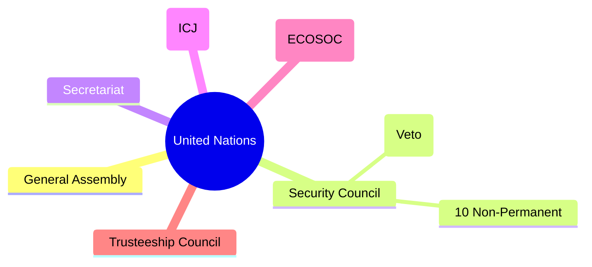

  <h3 style="color: var(--accent); margin-bottom: 16px; border-bottom: 1px solid var(--border); padding-bottom: 8px; display: flex; align-items: center; gap: 8px; font-weight: 600;">WORLD HISTORY AND REVISION MCQS</h3>
  <h4 style="border-left: 3px solid var(--info); padding-left: 8px; margin-top: 24px; margin-bottom: 10px; color: var(--text-primary); font-weight: 600;">DEEP CONCEPTUAL EXPLANATION</h4>

2. The French East India Company built a fort near the Fort William in Calcutta.

Select the correct answer using the codes given below. (a) Only 1 (b) Only 2 (c) Both 1 and 2 (d) Neither 1 nor 2 36. Who among the following was not associated with the activities of the Theosophical Society? (a) Madame HP Blavatsky (b) Mr AO Hume (c) Col HS Olcott (d) Mrs Annie Besant 41. Consider the following statement(s) 1. Battle of Buxar provided the key to the English to establish their rule in India.

2. The Treaty of Allahabad, concluded in 1765, enabled the British to establish their rule in Bengal.

Which of the statement(s) given above is/are correct? (a) Only 1 (b) Only 2 (c) Both 1 and 2 (d) Neither 1 nor 2 Directions (Q. Nos. 46-48) The following questions consist of two statements, Statement I and Statement II. You are to examine these two statements carefully and select the answers to these items using the codes given below. 2014 (II) 37. Consider the following statement(s) about the First Session of the Indian National Congress 1. It was held in Bombay in 1885.

2. Surendranath Bannerji could not attend the session due to the simultaneous session of the Indian National Conference.

Which of the statement(s) given above is/are correct? (a) Only 1 (b) Only 2 (c) Both 1 and 2 (d) Neither 1 nor 2 42. The Ghadar party, formed in the USA, was determined to start a revolt in India. Which among the following provinces did the party choose to begin its armed revolt? (a) Punjab (b) Bengal (c) United Provinces (d) Bihar Codes (a) Both the statements are individually true and Statement II is the correct of Statement I (b) Both the statements are individually true, but Statement II is not the correct of Statement I (c) Statement I is true, but Statement II is false (d) Statement I is false, but Statement II is true 46. Statement I Ram Mohan Roy in his famous work Gift to Monotheism put forward weighty arguments against belief in many Gods and for the worship of a single God.

38. Consider the following statement(s) 1. BG Tilak founded the Home Rule League in April 1916, in Maharashtra.

2. NC Kelkar was not associated with Home Rule Movement.

Which of the statement(s) given above is/are correct? (a) Only 1 (b) Only 2 (c) Both 1 and 2 (d) Neither 1 nor 2 Statement II Ram Mohan Roy in his Precepts of Jesus tried to separate the moral and philosophic message of the New Testament.

47. Statement I The Bethune School, founded in Calcutta in 1849 was the first fruit of the powerful movement for women’s education that arose in the 1840s and 1850s.

39. The social ideals of Mahatma Gandhi were first put forth in (a) Hind Swaraj (b) An Autobiography–The Story of My Experiments with Truth (c) History of the Satyagraha in South Africa (d) The Bhagavad Geeta–According to Gandhi 43. Consider the following statement(s) about colonial economy of Vietnam (Indo-China).

1. The colonial economy in Vietnam was primarily based on rice cultivation and rubber plantations.

2. All the rubber plantations in Vietnam were owned and controlled by a small Vietnamese elite.

3. Indentured Vietnamese labour was widely used in the rubber plantations.

4. Indentured labourers worked on the basis of contracts that did not specify any rights of labourers but gave immense power to the employers.

Which of the statement(s) given above is/are correct? (a) 1, 3 and 4 (b) 1 and 4 (c) 2 and 3 (d) Only 1 Statement II The first step in giving modern education to girls was undertaken by Vidyasagar in 1800.

48. Statement I The annexation of Awadh by Lord Dalhousie in 1856 adversely affected the financial conditions of the sepoys.

Statement II The sepoys had to pay higher taxes on the land where their family members stayed in Awadh.

44. Which of the four linguistic regions in South India remained unaffected by the Non-Cooperation Movement (1921-22)? (a) Kerala (b) Tamil Nadu (c) Andhra Pradesh (d) Karnataka 2015 (I) 40. Consider the following statement(s) about Syed Ahmed Khan, the founder of Muhammadan Anglo-Oriental College, Aligarh 1. He was a staunch supporter of Indian National Congress.

2. Muhammadan Anglo-Oriental College was set-up with the objective of promoting learning of Islamic education among the Muslims.

Which of the statement(s) given above is/are correct? (a) Only 1 (b) Only 2 (c) Both 1 and 2 (d) Neither 1 nor 2 45. Which of the following statement(s) about the penetration of English into Bengal is/are correct? 1. Job Charnock arrived in Sutanati in August, 1690 and laid the foundation of Calcutta which later became the heart of the British Indian empire.

49. Which of the following statement(s) about Mahatma Gandhi’s South African experiences (1893-1914) is/are true? 1. Muslim merchants were actively involved in Gandhian political movements in South Africa.

GENERAL STUDIES 2. In 1906, Gandhi led a campaign in Cape Town against the ordinance on compulsory registration and passes for Indians.

3. Gandhi began his political career with struggles against the imposition of excessive taxes on Indians in Cape Town.

Select the correct answer using the codes given below. (a) Only 1 (b) Only 3 (c) 1 and 2 (d) All of these 54. The interest of the British Government of India in Afghanistan in the 19th century came about in order to (a) make use of the natural resources of Afghanistan (b) ensure that the Russian empire did not have an influence over Afghanistan (c) increase the reach of the British Empire (d) establish a monopoly over the markets of Afghanistan 2. One reason for the uprising was the ban on free movement of the Sannyasis along pilgrimage routes.

3. In the course of the uprisings in 1773, Warren Hastings issued a proclamation banishing all Sannyasis from Bengal and Bihar.

4. Are contemporaneous with the Non-Cooperation Movement.

Select the correct answer using the codes given below. (a) Only 1 (b) 1 and 3 (c) 1, 2 and 3 (d) 2 and 4 50. Which of the following sets of newspapers reflected the concerns of educated Indian Muslims during the Khilafat Movement? (a) Comrade and Hamdard (b) Comrade and Hindustan Times (c) Zamindar and Muslim Voice (d) Comrade, Hamdard, Zamindar and Al Hilal 58. Which of the following characteristic(s) about the state of Travancore in 18th century Kerala is/are correct? 1. Travancore was ruled by Martanda Varma from 1729 to 1758.

2. Travancore built a strong army and defeated the Dutch in 1741.

3. Travancore was an important centre of learning.

Select the correct answer using the codes given below. (a) Only 1 (b) Only 2 (c) 1 and 2 (d) All of these 2015 (II) 51. Which would be the most appropriate description concerning the Punjab Naujawan Bharat Sabha? It aspired to (a) do political work among youth, peasants and workers (b) spread the philosophy of revolution among students (c) initiate discussions regarding anti-imperialism among workers (d) help the formation of a Trade Union Movement in Punjab 55. Which of the following features of the State of Arcot in 18th century South India are correct? 1. The founders of the dynasty that ruled Arcot were Daud Khan Panni and Saadatullah Khan.

2. Arcot became the site of a protracted struggle between the English and Dutch East India Companies from the 1740s.

3. Decentralisation was a key feature of the State of Arcot in the 18th century.

4. The other major State to emerge in South India at this time was Mysore.

Select the correct answer using the codes given below. (a) 1 and 2 (b) 1, 2 and 4 (c) 3 and 4 (d) 2 and 4 52. Match the following List I (Editors) List II (Journals/ Newspapers) A.

SA Dange 1. Labour-Kisan Gazette B.

Muzaffar Ahmed 2. Inquilab C. Ghulam Hussain 3. Navayug D. M Singaravelu 4. The Socialist 59. Which of the following statement(s) about the Hastings Plan of 1772 is/are correct? 1. Each district was to have a civil and a criminal court.

2. The judges were helped by native assessors who were skilled in Hindu and Islamic laws.

3. The Sadar Diwani Adalat was mainly meant to settle mercantile cases exceeding ` 10000 in value.

4. These courts did not put into place any procedural improvements.

Select the correct answer using the codes given below. (a) 1 and 2 (b) 3 and 4 (c) 2 and 4 (d) Only 2 56. Which of the following statements about the social reformer, Raja Ram Mohan Roy, is false? (a) Ram Mohan Roy belonged to the gentry class whose power has been diminished because of the imposition of the Permanent Settlement (b) He studied both Vedantic Monism and Christian Unitarianism (c) He translated the Upanishads into Bengali (d) His first organisation was the Atmiya Sabha, founded in Calcutta in 1815 Codes A B C D A B C D (a) 4 3 (b) 4 2 3 1 (c) 1 2 (d) 1 3 2 4 53. Which of the following was/were connected primarily to the communist ideology? 1. Kirti Kisan Party 2. Labour Swaraj Party Select the correct answer using the codes given below. (a) Only 1 (b) Only 2 (c) Both 1 and 2 (d) Neither 1 nor 2 57. Which of the following is/are the characteristic(s) of the Sannyasi and Fakir uprisings? 1. These uprisings refer to a series of skirmishes between the English East India Company and a group of Sannyasis and Fakirs.

60. Which of the following statement(s) about Maulvi Ahmadullah Shah, who played an important part in the Revolt of 1857 is/are correct? 1. He was popularly known as Danka Shah or the Maulvi with a drum.

2. He fought in the famous Battle of Chinhat.

3. He was killed by British troops under the command of Henry Lawrence.

2016 (I) Select the correct answer using the codes given below. (a) Only 1 (b) 1 and 3 (c) 2 and 3 (d) 1 and 2 63. Consider the following statement(s) 1. In Hind Swaraj, Mahatma Gandhi formulates a conception of good life for the individual as well as the society.

2. Hind Swaraj was the outcome of the experience of Gandhi’s prolonged struggle against Colonial Raj in India.

Which of the statement(s) given above is/are correct? (a) Only 1 (b) Only 2 (c) Both 1 and 2 (d) Neither 1 nor 2 62. Which of the following statement(s) about the formation of the Indian National Congress is/are true? 1. The Indian National Congress was formed at a national convention held in Calcutta in December 1885 under the presidency of Motilal Nehru.

2. The Safety Valve Theory regarding the formation of the Indian National Congress emerged from a biography of AO Hume written by William Wedderburn.

3. An early decision was that the President would be from the same region where the session was to be held.

4. WC Bannerjee was the first President of the Indian National Congress.

Select the correct answer using the codes given below. (a) 1, 2 and 4 (b) 2 and 3 (c) 2 and 4 (d) 1 and 3 61. Which of the following statement(s) about Jyotirao Phule’s Satyashodhak Samaj Movement in Maharashtra is/are true? 1. The Satyashodhak Samaj was set-up in 1873.

2. Phule argued that Brahmins were the progeny of ‘alien’ Aryans.

3. Phule’s focus on the Kunbi peasantry in the 1880s and 1890s led to a privileging of Maratha identity.

Select the correct answer using the codes given below. (a) 1 and 2 (b) Only 2 (c) 1 and 3 (d) All of the above 64. Consider the following statement(s) 1. The province of Assam was created in the year 1911.

2. Eleven districts comprising Assam were separated from the Lieutenant Governorship of Bengal and established as an independent administration under a Chief Commissioner in the year 1874.

Which of the statement(s) given above is/are correct? (a) Only 1 (b) Only 2 (c) Both 1 and 2 (d) Neither 1 nor 2 ANSWERS Practice Exercise Questions from CDS Exam (2012-16) GENERAL STUDIES CIVILISATION OF THE WORLD • Each city also had its own primary God. Sumerian writing, government and culture would pave the way for future civilisations.

• The Sumerian language was orginally that of the hunter and fisher people, who lived in the marshland and the Eastern Arabian littoral region and were part of the Arabian bifacial cultural.

Babylonian Civilisation Civilisation are organised in densely populated settlements divided into hierarchical social classes with a ruling elite and subordinate urban and rural population, which engage in intensive agriculture, mining small-scale manufacturing and trade. Civilisation concentrates power, extending human control over the rest of nature. Civilistions have their own specialisation and their own traditions. Following are the ancient civilisations of the world Egyptian Civilisation • The founder of this civilisaton was the Amorites. The appearance of Hammurabi, the great king of the Amorites made this civilisation progressive.

• It was a civilisation of ancient North-eastern Africa, concentrated along the lower reaches of the Nile River.

• Egyptian civilisation followed Pre-historic Egypt and coalesced around 3150 BC with political unification of upper and lower Egypt under the first Pharaoh Narmer.

• Hammurabi was the first law given in the history of the world. He codified all these laws in a simple form which become famous as the code of Hammurabi. There were four parts in the code of Hammurabi, viz Civil Code, Penal Code, Code of Procedure and Commercial Code.

• This civilisation reached the Pinnacle of its power in the New Kingdom, during the Ramessids period, where it rivalled the Hittite Empire, Assyrian Empire and Mitanni Empire.

• The Babylonian wrote 200 books. They composed books on religion, Science, Mathematics and astrology. In the domain of Babylonian literature, ‘Gilgamesh’ carved a special position.

• The success of Eyptian Civilisation came partly from its ability to adopt to the conditions of the Nile River Valley for agriculture.

Assyrian Civilisation • The achievement of this civilisation includes the quarrying, surveying and construction techniques that supported the building of monumental pyramids, temples and obelisks.

• Assyrian was an integral part of the ancient Mesopotamian world, and had come increasingly under the influence of Sumerian civilisation from the millennium onwards.

Mesopotamian Civilisation • Assyria was a monarchy, the king was the divinety appointed, all powerful ruler and claimed the universal sovereignty.

• This civilisation was developed between the area of Tigris-Eupharates river system. In Greek word, the meaning of Mesopotamia is land between rivers.

• The people living here hunted and gathered the plants and animals. Ancient Mesopotamia and the surrounding area is often called the fertile crescent or the credle of civilisation.

• The King of Assyria was the national God's appointed representative on Earth. He was the chief lawmaker, the chief administrator and commander-in-chief of the army.

• Mesopotamian invented new technology, they were the first to use the wheel. They also created architectural structures such as the dome, the column and the arch.

• The original capital, Ashur, was also the centre of the worship of the chief God of the same name, and long after it had ceased to be the centre of government was revered as a holy city.

Chinese Civilisation • They developed a number system based on 60, this explains why we have 60 seconds in minute and 60 minutes in an hour.

• The earliest civilisation was by the Shang (chou) dynasty, followed by the chin and han dynasties.

• Division of a year into 12 months, month into 4 weeks is given by the Mesopotamian civilisation.

Sumerian Civilisation • In 3rd century BC, the ruler of China dynasty built the Great wall. Chinese script was pictographic and their calender was combination of both solar and lunar calender.

• The Sumerians were the first humans to form civilisation and they invented writing and government.

• Silk became the chief item of export during Han rule.

• They were organised in city-states where each city has its own independent government ruled by a king that controlled the city and surrounding farmland.

• The two major religion were taoism and confucianism. They invented water clock, paper printing press and umbrella.

Reformation Greek Civilisation • The civilisation developed around 8 BC, when the small villages clustered to form city-states.

• It was a Schism from the Roman catholic church initiated by Martin Luther and continued by John Calvin, and other early protestant reformers in early 16th century in Europe.

• They worshiped Zens (Sky God), Poseidon (Sea God), Apollo (Sun God), Athena (Goddess of victory) etc.

• In the Battle of Marathon in 490 BC Greeks defeated king Darius I. Alexander was the Greek ruler.

• Luther began it by criticising the selling of indulgences, insisting that pope had no authority over Purgatory and that the catholic doctrine of the merits of saints had no foundation in the Gospel.

• The olympic games originated in Greece. Iliad and Odyssey are among the best epic of the world written by Homen of Greece.

• The new movement influenced the Church of England decisively after 1547 under Edward VI and Elizabeth I.

Roman Civilisation • The Church of England had been made independent under Henry VIII in the early 1530s for political rather than religious reasons.

• Italy was the centre of civilisation. The city of Rome was founded by Romulus in 1000 BC on the bank of Tiber River. The war between Carthage and Rome is known as Punic War (264 BC to 146 BC).

Industrial Revolution • Julius Caesar, one of the generals, murdered Pompey, another general and occupied the throne. He was attached to the Egyptian queen Cleopatra. Caesar was succeeded by Octavian and Diocletion.

• Industrial revolution was started around the second half of the 18th century. This period witnessed changes in the manufacturing processes from slow to faster and expensive hand production to cheaper machine production.

• Romans worshiped the planets and developed latin language.

• Concrete was invented by Roman which is even today used for construction of buildings.

• Industrial revolution started in England to fulfil the growing demands for goods, both at domestic and international level.

• A number of factors contributed to industrial revolution in England. They are as follows MAJOR REVOLUTIONS – England had great deposits of coal and iron ores.

– England was a politically stable society as well as the world’s leading colonial power, which meant its colonies could serve as a source for raw materials, as well as a market place for manufactured goods.

• Revolutions have occurred through human history and vary widely in terms of methods, duration and motivating ideology. Their results includes major changes in culture, economy and socio-political institutions.

– As demand for goods increased, merchants needed more cost-effective methods of production, which led to rise of mechanisation and the factory system.

• Several generations of scholarly thoughts on revolutions have generated many competing theories and contribution much to the current understanding of this complex phenomenon.

– The agricultural sector of the British economy had been steadily growing during the 18th century. Agricultural stability allowed the British population to increase. The Renaissance • The renaissance is a period in European history from 14th to 17th centuries regarded as the cultural bridge between the Middle Ages and Modern History.

• The industrial revolution started chiefly from the Textile Industry. In 1733, a weaver called John Kay invented a Flying Shuttle, by which the work of weaving could be done quickly.

• The intellectual basis of the Renaissance was its own invented version of humanism, derived from the rediscovery of the classical Greek Philosophy. Such as that of Protagoras, who said that, “Man is the measure of all things”.

• In 1785, Edmund Cartwright invented ‘Powerloom’ Elly Whitley invented a cotton ginning machine called cotton gin. James Watt invented the steam engine, the first railway line was built between Manchester and Liverpool in 1830.

• In politics, the Renaissance contributed to the development of the customs and conventions of diplomacy, and in science to an increased reliance on observation and inductive reasoning.

• The growth of production increased the wealth of the Great Britain and by 1815, England emerged as the greatest banker and the largest carrier of goods in the world.

• During the Renaissance, money and art went hand in hand. Artists depended entirely on Patron while the Patrons needed money to foster artistic talent.

• Due to the industrial revolution, by the close of the 19th century, science and technology became an integral part of Western society.

GENERAL STUDIES The American Revolution • American revolution is also called as American Revolutionary War (1775-83). The conflict arose from growing tensions between residents of Great Britain’s 13 North American colonies and the colonial government, which represented the British crown.

• Guerilla Warfare British armies were not acclimated to guerilla warfare, which the colonists had used during their wars with the Indians. Therefore, the British could not defend themselves well against a fighting strategy they had never seen before. Washington’s use of these and other defensive strategies allowed for considerable American advantage.

• In 1765, members of American colonial society rejected the authority of the British Parliament to tax them and to create other laws affecting them without colonial representatives in the government.

• Popular Support Many colonists, even if they weren’t fighting, were supportive of the cause. Popular support boosted morale among soldiers and encouraged them to push through the tough times.

The French Revolution • The Battles of the American revolution started in Lexington on 19th April, 1775. These were over 20 major battles during the revolution spanning over a period of 6 years.

• The French revolution took place between 1789 and 1799.

It ended in 1799 with the overthrow of the government (Council of 500 in Paris) by Napoleon Bonaparte.

• General George Washington, with the help of France and his continental army defeated British General Cornwallis at the Battle of Yorktown on 19th October, 1781.

• The French revolution paved the way for the secular system of governance, which is prevalent in most of the countries of the modern world.

• Finally, the Treaty of Paris ended the revolution officially on 3rd September, 1783.

Causes of French Revolution BOSTON TEA PARTY • Social and economic unrest triggered the revolution. The country was facing a deteriorating economic condition coupled with a lag between the intellectual development and social political condition that was stagnant. G During the following decade, protests continued to escalate by colonists (known as Patriots) in the Boston Tea Party in 1773, during which patriots destroyed a consignment of taxed tea from the Parliament controlled and favoured East India Company.

• The middle class, also known as the Bourgeoisie was in worst condition. This educated class was heavily taxed whereas the ruling nobles and the clergy were exempted from taxation.

G The British responded by imposing punitive laws on Massachusetts in 1774 known as the Coercive Acts.

• During the summer of 1789, France faced a financial crisis, caused primarily by military expenditures and a parasitic aristocracy.

G In late 1774, the Patriots set-up their own alternative government to better coordinate their resistance efforts against Great Britain, while other colonists, known as Loyalists remained align to the British Crown.

• The revolution was further consolidated by the oath of the ‘Tennis Court’. From there onwards, began the civil disobediences that would eventually pave the way for the revolutionary regime.

Causes of Success • In the events that were to follow the National Assembly did frame a Constitution, which could restore the social unrest, but the differences led to further mishaps.

• The period is known as the reign of terror as many executions were held and all efforts were taken to curb any counter revolutionary activities.

• French Involvement After the American victory at Saratoga, the French in 1778 (later Spain in 1779 and Holland in 1780) realised the Britain could be defeated, and they joined the fight against the British. Without France’s military power, the Americans would never have had the capacity of defeating the superior British army.

• The Thermidorian Reaction, which was eventually overthrown by means of a military coup under the leadership of Napoleon Bonaparte, who put an end to the revolution by declaring himself the ‘First Council of France’.

• Distance Since, the British Government was geographically separated from the places of battle, it was difficult for it to effectively manage and communicate with troops.

• After the defeat of Napoleon, the old ruling dynasty of France was restored to power. However, within a few years in 1830, there was another outbreak of revolution.

• Fighting on Home Soil British armies were not familiar with the climate and rugged terrain of America.

Therefore, the colonists had the geographical advantage because they knew how to survive the land.

• In 1848, the Monarchy was again overthrown though it soon reappeared. Finally, in 1871, the Republic was again proclaimed.

The February Revolution Significance of the French Revolution • The February revolution, which removed Tsar Nicholas II from power, developed spontaneously out of a series of increasingly violent demonstrations and riots on the streets of Petrograd.

• The French revolution led to the preservation and popularisation of the important theories and ideals of liberty, equality and fraternity and the theories of nationalism, democracy etc.

• Though, the February revolution was a popular uprising, it did not necessarily express the wishes of the majority of Russian population.

The October Revolution • The ‘Napoleonic Code’, which consisted of a civil code, codes of civil procedure and criminal procedure, a penal code and a commercial code proved beneficial not only to the France, but also to the whole world. Imperialism and Colonialism • The October revolution is also called as Bolshevik Revolution, overturned the interim provisional government and established the Soviet Union.

• The Bolsheviks, who led this coup, prepared their coup in only six months.

Imperialism is a policy of a nation to extend its control outside its own boundaries, by acquisition of colonies or dependencies or by jurisdiction over other races.

• By October 1917, the Bolsheviks popular base was much larger, they built up a majority of support within petrograd and other urban centres.

• During the 17th and 18th centuries the policy of mercantilism became popular, which accentuated the importance of competition, for overseas trade and colonies.

• After October revolution, the Bolsheviks faced major opposition from Russia and for many different reasons.

• The process of colonisation of Asia began towards the close of 15th century, when Vasco da Gama discovered the sea route to India.

• The result was the Russian Civil War, which would be horrifically painful for the country and that, in the end, would cost even more lives than World War I.

World War I • The four basic causes that led to the horrifying conflict of World War I were as follow • The weakness of Chinese Empire became apparent during the first Opium war of 1840-42. At that time England occupied Hong Kong. In 1857-58, England and France forced China to subscribe to the Treaty of Tientsin according to which China had to give special facilities to Britain, France, Russia and America. i. The system of alliances ii. The militarism and arms race iii. The force of nationalism iv. Imperialism and economic rivalry • Taking advantages of the Chinese weakness France took Cochin China under its protection, occupied Annam and Tokin in 1882 and formed the protectorate of Indo-China.

• Often nationalism led to rivalries and conflicts between nations. Additionally various ethnic groups resented domination by others and wanted independence.

• In Central Asia, Russia and Britain tried to increase their influence. While the Northern part of Persia was to be controlled by Russia, the Southern part was opened for the British.

• By 1890, Germany built a strong army and developed a navy to rival England’s fleet. By 1907, there were two major alliances • The motives of imperialism and empire building were selfish and the people in the colonies were frequently exploited for the benefit of the mother country.

i. Allies or Triple Entente : Consisting of France, Britain and Russia. ii. Central powers or Triple Alliance : Consisting Germany Austria, Hungary, Italy and Rumania. The Russian Revolution • The assassination of Archduke Franz Ferdinand, heir to the Austrian throne in June, 1914 sparked the initiation of World War I.

• The Russian revolution was a time of economic and social reconstruction in the Soviet Union.

• The March revolution (First revolution) overthrew the Tsar and set-up a moderate provisional government.

• The Great War of 1914 was probably outcome of the Balkan Wars. In these wars Germany exercised restraint over Austria and France over Russia. War started as soon as the restrains were not exercised in 1914.

• When, this government coped no better than Tsar, it was itself overthrown by the Bolshevik revolution in November.

• The World War I caused great economic loss, wastage and vast destruction. Nearly 10 billion rupees were directly spent over the war.

GENERAL STUDIES iv. Dissatisfaction of National Minorities of Europe. The Treaty of Versailles • Germany had to sign the Treaty of Versailles that led to many harsh restrictions on Germany. v. Economic Depression in Western countries.

vi. Failure of the League of Nations.

vii. Failure of Disarmament.

viii. Ideological conflict between fascism and democracy.

• The provinces of Alsace and Lorraine were taken away from Germany and they were given back to France.

ix. Attitude of Western powers towards Russia.

x. Imposed Treaty of Versailles.

• Germany had to give Eupen and Malmedy to Belgium.

The polish territories were taken back from the possession of Germany, Austria and Russia. Capitalism • Germany lost her rights in China, Turkey, Egypt, Morocco and Bulgaria.

• Capitalism is a social system based on the principle of individual rights. Politically, it is the system of laissez-faire (freedom).

World War II • Following the demise of feudalism, the capitalism became the dominant economic system in the Western world.

• Between 1939 to 1945 World War II remains the most geographically widespread military conflict the world has ever seen.

• A remarkable confluence of advances in agriculture, cotton spinning and weaving iron manufacture and machine tool design and the harnessing of mechanical power began to alter the character of capitalism profoundly in the last years of the 18th century and the first decades of the 19th century.

• The Treaty of Versailles been drafted with a foresight and Germany meted with a lenient treatment, the World War II might have been averted. Hence, the short sighted and selfishness of the victor powers was the root cause of World War II.

• The form of capitalism differs between nations, because the practice of it is embedded within cultures. Markets cater to national culture as much as national culture mutates to conform to the discipline of profit and loss.

• The German people were angered that their government accepted the lopsided Treaty of Versailles. These sentiments allowed Adolf Hitler to seize power in Germany.

• Firstly in order to avoid war, Europe gave in to Hitler’s demands. But, when Hitler invaded Poland in 1939, England and France promptly declared war of Germany.

• The Great Depression of the 1930 brought the policy of laissez-faire (non-interference by the state in economic matters) to an end in most countries and for a time cast doubt on the capitalist system as a whole.

• Nazi secret police brutally enforced German policies, Millions of Hitler’s enemies were sent to the concentration camps.

• The performance of capitalism since World War II in the United States the United Kingdom, West Germany and Japan, however, has given evidence of its continued vitality.

Communism • Hitler denounced the clauses of the Treaty of Versailles on 16th March, 1935. On 1st April, 1935, the League of Nations formally condemned Germany’s repudiation of the treaty.

• Hitler re-occupied the Rhineland in March, 1936 by sending German troops into the Western German zone.

• Communism is the political and economic doctrine that aims to replace private property and a profit-based economy with public ownership atleast the major means of production. (e.g. mines, mills, factories) and the natural resources of a society.

• Hitler was a success in concluding several pacts and ultimately he alienated the sympathies of France from Italy.

• Marx and Engels maintained that the poverty, disease and early death that afflicted the proletariat were endemic to capitalism. These problems could be resolved only by replacing capitalism with communism.

• Japan entered World War II with an aim to dominate for East. Encouraged by Hitler’s success she bombed the American naval base at Pearl Harbour.

• About 50 million people are estimated to die in the World War II, with 17 million of these deaths having occurred in Asia and the Pacific.

• Under communism the major means of industrial production such as mines, mills, factories and railroads would be publicly owned and operated for the benefit of all.

Causes of the World War II • Today, Mao’s version of Marxism-Leninism remains are active, but ambiguous force else where in Asia, most notably in Nepal. There are nine main causes of World War II, which are as follows i. Aggressive nationalism of Germany.

ii. Rise of Fascism in Italy.

iii. Japanese Imperialism.

• After a decade of armed struggle, Maoist insurgents in Nepal agreed in 2006 to lay down their arms and participated in national elections to choose an assembly to rewrite the Nepalese Constitution.

Socialism Nazism and Fascism • Adolf Hitler made his first appearance in German political scene in 1923. Hitler’s Nazi Party conducted its activities with military fanfares. By November 1923, Hitler was in total control of Nazi Party.

• Socialism as a political philosophy is the social and economic doctrine that calls for public rather than private ownership or control of property and natural resources.

• The origins of socialism as a political movement lie in the Industrial revolution.

• Hitler followed a three fold plan to consolidate the Nazis in power. It comprised capturing the legal authority to rule, crashing the country’s political opposition and eliminating rivals within his party.

• According to the socialist view, individuals do not live or work in isolation, but live in cooperation with one another.

• Hitler infused the German people with the ideas of racism, which convinced them that they were superior people with the right to rule over inferior people.

• Everything that people produce is in some sense a social product and everyone, who contributes to the production of a good is entitled to a share in it.

• Fascism was political ideology antithetical to democracy, parliamentarism, individual liberty, freedom of expression and state control over businesses.

• Mussolini organised the fasci di combattimento (Band of Combatants) in Milan in 1919, providing the basis for the rise of fascism.

• The World War II forged an uneasy alliance between communists and socialists and between liberals and conservatives in their common struggle against fascism.

• Mussolini won popularity among the ordinary masses of Italians by starting huge public projects.

• The terms such as African socialism and Arab socialism were frequently invoked in the 1950s and 60s, partly because the old colonial powers were identified with capitalist imperialism.

• Fascism contributed significantly to the unstable security environment of Europe, which took the world towards the World War II.

GENERAL STUDIES PRACTICE EXERCISE 5. Simon Bolivar and Miguel Hidalgo, leaders of Latin American Independence Movements, were inspired by successful revolutions in (a) the United States and France (b) the Soviet Union and China (c) Cuba and Costa Rica (d) Egypt and Kenya 10. The main reason the Chinese Communists gained control of mainland China in 1949 was that (a) they were supported by many warlords and upper class Chinese (b) the United States has supported the Chinese Communist Party during World War II (c) the dynamic leadership of Mao Zedong had the support of the peasant class (d) they had superior financial resources and were supported by Japan 6. The Great Leap Forward in China and the Five-Year Plans in the Soviet Union were attempts to increase (a) private capital investment (b) religious tolerance (c) individual ownership of land (d) industrial productivity 11. The Tiananmen Square massacre in China was a reaction to (a) Deng Xiaoping’s plan to revive the Cultural Revolution (b) student demands for greater individual rights and freedom of expression (c) China’s decision to seek Western investors (d) Great Britain’s decision to return Hong Kong to China 1. Which among the following regarding the Carnatic wars fought between French and EIC is/are not true? 1. The First Carnatic War was provoked by the outbreak of hostilities in Europe in 1742 between France and England.

2. Dupleix, the French Governor-General in India played a significant role in the Third Carnatic War.

3. The Second Carnatic War was fought purely on domestic issue.

4. The Battle of Wandiwash in 1760 marked the elimination of French influence in India and the resultant Treaty of Paris in 1763 reduced the French Company to a pure trading body without any political privileges.

Select the correct answer using the codes given below. (a) 1, 3 and 4 (b) 1 and 2 (c) Only 2 (d) 3 and 4 7. Peace-keeping missions are operating in more than a dozen of the world’s many trouble spots. The authority to intervene and use force, if necessary, is found in several articles in the Charter. Which organisation is referred to in these statements? (a) United Nations (b) Organisation of American States (OAS) (c) European Union (European Community) (d) International Court of Justice 12. An immediate result of the Cultural Revolution in China was that it (a) helped to establish democracy in urban centers in China (b) led to economic cooperation with Japan and South Korea (c) disrupted China’s economic and educational systems (d) strengthened political ties with the United States 2. The modernisation of Japan during the Meiji Restoration resulted in (a) a return to a feudal system of government (b) the rise of Japan as an imperialistic nation (c) an alliance between China, Korea, Russia and Japan (d) a strengthening of Japan’s isolationist policies 3. Who among the following was the author of ‘Common Sense’ the revolutionary pamphlet of the American Revolution? (a) Thomas Paine (b) Thomas Jefferson (c) George Washington (d) Samuel Adams 8. Consider the following statements 1. Switzerland became the member of UNO in 2002.

2. Year 2003 was announced ‘International Fresh Water Year’ by UNO.

3. The headquarters of International Civil Aviation Organisation is in Montreal.

Which of the statements given above are correct? (a) 1 and 3 (b) 1 and 2 (c) 2 and 3 (d) All of these 13. During the mid-1930s, which characteristic was common to Fascist ltaly, Nazi Germany and Communist Russia? (a) Government ownership of the means of production and distribution (b) One-party system that denied basic human rights (c) Encouragement of individual freedom of expression in the arts (d) Emphasis on consumer goods rather than on weapons 14. Which was the major reason behind the Holocaust being considered as unique event in modern European history? (a) Jews of Europe have seldom been victims of persecution (b) Civilians rarely were killed during air raids on Great Britain (c) Adolf Hitler concealed his anti-Jewish feelings until he came to power (d) The genocide was planned in great detail and required the cooperation of many people 4. What was the one reason that made Nazi programmes and policies of the early 1930s appealed to many people in Germany? (a) The people were frustrated with their current economic and political situation (b) Germany had been denied membership in the United Nations (c) A coup d’etat had forced communism on the German people (d) The German people feared that the French of the British would soon gain control of the polish corridor 9. During the Scientific Revolution and the Enlightenment, one similarity in the work of many scientists and philosophers was that they (a) relied heavily on the ideas of medieval thinkers (b) favoured an absolute monarchy as a way of improving economic conditions (c) received support from the Catholic Church (d) examined natural laws governing the universe 19. The Russian revolutionaries derived their ideology from the doctrines of (a) Lenin and Stalin (b) Marx and Lenin (c) Marx and Engels (d) Lenin and Engels 20. Which of the following statement(s) relating to the Non-Alignment Movement is/are not correct? 1. Non-alignment came to symbolise the struggle of India and other newly independent nations to retain and strengthen their independence from colonialism and imperialism.

2. Non-alignment advanced the process of democratisation of international relations.

3. Military alliances formed a major part of non-alignment.

Select the correct answer using the codes given below. (a) 1 and 2 (b) 2 and 3 (c) Only 3 (d) Only 1 15. Which one of the following statements related to the Boston Tea Party of 16th December, 1773 during the American War of Independence is correct? (a) The revolutionaries stealthily entered into the ships and threw all the chests of tea into the water (b) The revolutionaries hosted a Tea Party in the honour of Charles Townshend, the British Chancellor of the Exchequer in order to place their grievances before him (c) It marked a celebration when Lord North, the successor of Townshend, repealed some of the duties imposed by Townshend (d) It was a protest against the Quebec Act 16. Which one among the following was a reason for which the French could not succeed in India in the 18th century? (a) They sided with the weak Indian sides such as Chanda Sahib and Muzaffar Jang (b) Dupleix was called back at a crucial time (c) They conspired against the Indian powers (d) Their trading company was heavily dependent on the French Government 17. Match the following List I List II 21. Which one among the following sums up Marx’s view about history? (a) History is a record of the wars between various people (b) History is a succession of struggle between the oppressor and the oppressed classes (c) History is a faithful record of the past events (d) None of the above A. Hargreaves 1. Invented a machine which speed up spinning B. Crompton 2. Combined the advantage of the earlier invented machines C. Arkwright 3. Adopted the speed up spinning machine for running with water 22. Industrial Revolution in Europe mainly emerged due to 1. locating the production process in the countryside.

2. declining of the guilds because of non-farming production coming under a single roof (the factory).

3. growing role of merchant capitalists in the production process.

Which of the statement(s) given above is/are correct? (a) Only 2 (b) 2 and 3 (c) 1 and 3 (d) All of these 24. During the 1980’s in the Soviet Union, a major element of the economic policy of Perestroika was (a) increased collectivisation of farms (b) more reliance on local and regional decision-making (c) the expanded use of national Five-Year plans (d) an emphasis on the redistribution of wealth.

25. The withdrawal of France from Indo-China, the involvement of the Soviet Union in Cuba, and the United States support of the Contras in Nicaragua illustrate that nations (a) consistently discard traditional foreign policy goals after changes in administration (b) tend to base foreign policy decisions on what they believe to be their self-interests (c) no longer use warfare as a means to resolve international conflict (d) tend to refer foreign policy conflicts to the United Nations 26. What was one reason the Nazi programmes and policies of the early 1930s appealed to many people in Germany? (a) The people were frustrated with their current economic and political situation (b) Germany had been denied membership in the United Nations.

(c) A coup d’etat had forced communism on the German people (d) The German people feared that the French of the British would soon gain control of the Polish corridor.

27. Communist government(s) were established in most nations of Eastern Europe shortly after World War II because 1. The region had a long tradition of strong communist parties.

2. The Soviet Union used military and diplomatic pressures to install their governments.

3. Members of the Communist party won free elections in these nations.

Select the correct answer using the codes given below. (a) Only 1 (b) Only 3 (c) 1 and 2 (d) 2 and 3 23. Match the following List II (Works) List I (Renaissance Writers) A. Dante 1. Pantagruel B. Machiavelli 2. Don Quixote C. Rabelais 3. The Prince D. Cervantes 4. Divine Comedy Codes A B C A B C (a) 1 2 (b) 2 1 (c) 2 3 (d) 3 2 18. Which of the following statement(s) regarding the American Revolution is/are correct? 1. The American Revolution was a conflict between British settlers and native Americans.

2. The Americans refused to pay taxes imposed by the British Parliament, in which the Americans had no representation.

Select the correct answer using the codes given below. (a) Only 1 (b) Only 2 (c) Both 1 and 2 (d) Neither 1 nor 2 28. Which is generally a characteristic of a communist economy? 1. Government agencies are involved in production planning.

2. The role of government in the economy is restricted by law.

3. Investment is encouraged by the promise of large profits.

Select the correct answer using the codes given below. (a) Only 1 (b) Only 2 (c) 2 and 3 (d) None of these Codes A B C D A B C D (a) 2 3 (b) 3 4 2 1 (c) 4 1 (d) 4 3 1 2 GENERAL STUDIES 29. In Eastern Europe during the 1950’s and 1960’s, the Soviet Union responded to challenges to its control by 1. Allowing free elections, when necessary 2. Imposing prompt and Severe repression 3. Obtaining United Nations assistence Select the correct answer using the codes given below. (a) Only 1 (b) Only 2 (c) Only 3 (d) All of these 30. Consider the following statement(s) regarding French Revolution.

1. The revolution initiated on 5th May, 1989 during the kingship of Louis XVI.

2. Liberty, Equality and Fraternity were the watch of the revolution.

3. The immediate cause of the revolution was the extravagant expenditure and inefficiency by Louis XV and Louis XVI.

Select the correct answer using the codes given below. (a) Only 1 (b) 1 and 2 (c) 2 and 3 (d) All of these 31. Which of the following statement is regarding unification of Germany? 1. This was the result of the Blood and Iron policy of Bismarck, the PM of King William I.

2. Bismark defeated Austria and dissolved the German confederation.

3. William I, the king of Prussia was declared as the Emperor of Germany at Versailles in France.

Select the correct answer using the codes given below. (a) Only 1 (b) 2 and 3 (c) Only 3 (d) All of these 32. Industrial Revolution in Britain began in AD 1750 with the invention of 1. Spinning Jenny by Hargreaves.

2. Water Frame by Richard Arkwright.

3. Mule by Samuel cromption.

4. Steam engine by James Watt.

Select the correct answer using the codes given below. (a) 1 and 4 (b) 2 and 3 (c) 3 and 4 (d) All of these 33. Consider the following question(s) regarding American Revolution.

1. George Washington, the first President of America was the pioneer of the revolution.

2. On 4th June, 1776, the declaration of Independence was issued by Thomas Jafferson.

Select the correct answer using the codes given below. (a) Only 1 (b) Only 2 (c) Both 1 and 2 (d) Neither 1 nor 2 QUESTIONS FROM CDS EXAM (2012-2016) 2013 (II) Which of the statement(s) given above is/are correct? (a) Only 1 (b) 1 and 2 (c) Only 2 (d) 1 and 3 2014 (I) Codes (a) Both the statements are true and Statement II is the correct explanation of Statement I (b) Both the statements are true, but Statement II is not the correct explanation of Statement I (c) Statement I is true, but Statement II is false (d) Statement I is false, but Statement II is true 4. Consider the following statement(s) about the causes of success of the American Revolution 1. the remoteness of the American continent and British ignorance of the American continent led to the success of the Americans.

2. the fierce spirit of liberty drove the Americans to success.

3. the American military forces were superior to the British.

1. Which one among the following events was associated with American War of Independence? (a) Tennis Court Oath (b) Boston Tea Party (c) Fall of Bastille (d) Reign of Terror 2. Which one among the following events was not associated with French Revolution? (a) Calling of the Estates General (b) Guillotine (c) Battle of Concord (d) Tennis Court Oath 3. Statement I The Russian Revolution of 1917 inspired the Indian Working Class Movement.

Statement II The Non-Cooperation Movement (1921-22) saw the involvement of the Indian Working Class.

5. Consider the following statement(s) concerning the initial phase of the Industrial Revolution in England.

1. England was fortunate in that coal and iron ore were plentifully available to be used in industry.

2. Until the 18th century, there was a scarcity of usable iron.

Which of the statement(s) given above is/are correct? (a) Only 1 (b) Only 2 (c) Both 1 and 2 (d) Neither 1 nor 2 6. The Society of Jesus, whose followers were called Jesuits, was set-up by (a) Martin Luther (b) Ulrich Zwingli (c) Erasmus (d) Ignatius Loyola ANSWERS Practice Exercise Questions from CDS Exam (2012-16) PART V ART AND CULTURE Chola Architecture Indian Culture • The culture of India is one of the oldest and unique. In India, there is amazing cultural diversity throughout the country. The South-North and North-East have their own distinct cultures and almost every state has carved out its own cultural niche.

• The Imperial Chola rulers of Tanjore developed the Dravidian sytle of temple architecture almost to perfection. Their works taken up on a stupendous scale include irrigation schemes, embankment of artificial lakes, dams across the cauvery and well planned cities. A special feature of the Chola architecture is the purity of artistic tradition.

• There is hardly any culture in the world that is as varied and unique as India. India is a home to some of the most ancient civilisation including four major world religions i.e.

Hinduism, Buddhism, Jainism and Sikhism. Indian Philosophy • The two magnificent temples at Tanjore and Gangaikonda Cholapuram in Tiruchinrapalli district built in early AD 11th century show the best of Chola art. The Brihadeswara or Rajarajeswara Temple of Shiva in Tanjore built by Rajaraja Chola in AD 1010 is the largest and highest of Chola temples and stands as a symbol of greatness of Chola.

• Philosophy is the study of general and fundamental problems, such as those connected with reason, values, knowledge, reality and existence.

Vijayanagara Architecture • According to a traditional principal of classification, most likely adopted by orthodox Hindu thinkers, the schools or systems of Indian philosophy are divided into two broad classes, namely, orthodox (astika) and heterodox (nastika).

• By the 16th century almost all of Southern India was part of the Vijayanagara empire. The Vijayanagara rulers were great patrons of art and architecture. The Vijayanagara tradition shows a distinct scheme of decoration in terms of architectural space.

• In the 1st group, there are 6 chief philosophical systems (popularly known as sad darsana), namely Mimamsa, Vedanta, Samkhya, Yoga, Nyaya and Vaisesika. These are regarded as orthodox (astika), not because they believe in God, but because they accept the authority of the Vedas.

• Decorative friezes are utilised horizontally on the plinth moulding, caves and pillars of the temple interiors. They appear vertically on the composite pillars, plasters of the walls and doorways of the gopuras as well as the inner part of temples.

Rajput Architecture • Under the other class of heterodox systems, the chief 3 are schools of materialists like the Charvaka, the Buddhas and the Jainas. They are called heterodox (nastika) because they do not believe in the authority of Vedas. Indian Architecture Harappan Architecture • The Rajput rulers had a keen sense of beauty in art and architecture which is seen in the artistic excellence of their temples, forts and palaces. The Indo-Aryan style of architecture developed in North India and upper Deecan and the Dravidian style in South India during the Rajput period.

• Architecture of Indus Valley Civilisation is contained in the structures of Mohenjodaro, which were found by the archaeologists and in the existence of Harappan city.

Harappans were known for their excellent town planning skills. Their civic planning was based on a rectangular grid oriented to cardinal points and standardised brick was the main building material.

• Both sculpture and architecture attained a high degree of excellence. The palaces of Jaisalmer, Bikaner, Jodhpur, Udaipur and Kota represent the maturity of the Rajput style. The foundation of Jaipur, the fabled pink city, represents the final phase of Rajput architecture.

Indian Temple Architecture • In Mohenjodaro, the streets run in straight lines and are crossed by others at right angles. This shows planning and existence of some authority to control the development of the city existed. Pallava Architecture • Almost all Indian art has been religious and almost all forms of artistic tradition have been deeply conservative. The Hindu temple developed over two thousands years and its architectural evolution took place within the boundaries of strict models derived solely from religious considerations. The temple architecture of the Pallavas is divided into rock-cut and structural architecture. The greatest accomplishment of Pallava architecture are the rock-cut temples at Mahabalipuram. Kailasanathar temple located in Kanchipuram is one of the most beautiful temple in India built during the reign of king Narsimha mvaraman.

• Therefore the architect was obliged to keep to the ancient basic proportions and rigid forms which remained unaltered over many centuries.

GENERAL STUDIES North Indian Temples PAINTINGS • The Nagara style which developed in the 5th century is characterised by a beehive shaped tower (called a shikhara, in Northern terminology) made up of layer upon layer of architectural elements such as kapotas and gavaksas, all topped by a large round cushion-like element called an amalaka. The history of Indian Paintings is just about as old as the history of the people of India. The most primitive instances of paintings in India can be traced back to cave paintings. Cave Paintings • These are the earliest evidences of Indian paintings made on cave walls and palaces, whereas miniature paintings are small-sized vibrant, sophisticated handmade artworks.

• The plan is based on a square, but the walls are sometimes so broken up that the tower often gives the impression of being circular. Moreover, in later developments such as in the Chandela temples, the central shaft was surrounded by many smaller reproductions of itself, creating a spectacular visual effect resembling a fountain.

• Paintings on caves and temples walls mostly describe numerous characteristics of Hinduism and Buddhism.

South Indian Temples Ajanta Paintings • From the 7th century the Dravida or Southern style had a pyramid shaped tower consisting of progressively smaller storeys of small pavilions, a narrow throat and a dome on the top called a shikhara (in Southern terminology).

• The repeated storeys give a horizontal visual thrust to the Southern style.

• The paintings here were done between 200 BC and 7th century AD during the period of Sunga, Kushan and Gupta rulers, the main characteristics of these paintings are-these are fresco wall paintings and uses limited colours.

Temples of the Deccan • Variety of life has been expressed, emotions are expressed using hand postures, stories of Jatakas are depicted. Ellora Paintings • So far as the style is concerned, Ellora painting is a departure from the classical form of Ajanta paintings.

• In the border areas between the two major styles, particularly in the modern states of Karnataka and Andhra Pradesh, there was a good deal of stylistic overlap as well as several distinctive architectural features. A typical example is the Hoysala temple with its multiple shrines and remarkable ornate carving. In fact such features are sometimes so significant as to justify classifying distinct sub-regional group.

• Most important characteristic features of ellora painting are the sharp twist of the head, painted angular bents of the arms, sharp projected nose and long drawn open eyes.

Bagh Paintings • The type of raw materials available from region-to-region naturally had a significant impact on construction techniques, carving possibilities and consequently the overall appearance of the temple. The soft soap-stone type material used by the Hoysala architects of the 12th and 13th centuries allowed sculptors working in the tradition of ivory and sandalwood carving to produce the most intricate and ornate of all Indian styles.

• These are located on the banks of river Bagh in Madhya Pradesh. The paintings here are quite similar to those of Ajanta in terms of subject matter and characteristics.

Monuments of Ancient Period Udaygiri Caves During Chandragupta’s reign at Vidisha, Madhya Pradesh • The period of these paintings is still not accurately known. The best paintings were in the cave number 4 though many have now been removed and kept in a museum for preservation. Angkor Wat Temples Suryavarman Vikramashila University Pala King Dharampala Other Styles of Paintings Kailash Temple (Ellora) Rashtrakuta king Krishna I Dilwara Temple Tejapala Mughal School Rathas of Mamallapurram Mahendravarman I (Pallava King) Khajuraho Temples Chandelas Martanda Temple (Kashmir) Lalitaditya Muktapida Gommateswara (Son of Rishabnath) Chamundraya, Minister of the Ganga King, Rajamalla (Sravanbelagola, Karnataka) • This school has a specific style of South Asian painting. Usually, it was confined to miniatures either as book depictions or as individual works to be kept in albums. This practice materialised from Persian miniature painting, with India influence of Hindu, Buddhist and Jain. Hoysaleswara Temple (at Halebid) Ketamalla, Minister of King Vishnukvardhana (Karnataka) Ragas • It wonderfully blossomed during the Mughal empire.

Later, this school of painting reached other Indian courts of Muslims and Hindus and afterwards Sikhs. Akbar and Jahangir were exceptionally great patrons of this painting. Rajput School • The gamut of several note woven into a composition may be called a raga. The ragas can be sung without any instrumental accompaniment, but generally take tabla (drum) for the purpose besides any stringed instrument. They are sung at particular seasons and time of the day or night.

• This school progressed and thrived during the 18th century in the majestic Rajputana courts. This school of painting flooded from the approach of Mughal painting.

• A typical style of painting with particular common characteristics came up in every Rajput realm.

Pahari School of Painting • Indian classical music consists of 6 principle ragas and 30 raginis. Music is adapted to the season of the year, hours of the day and mood of the performer. The Indian year is divided into 6 seasons and each season has its own raga. The principle ragas are Bhairavi, Hindol, Megha, Sriraga, Deepak and Malkaus. Hindustani Classical Music • This school is an umbrella expression which is used for a type of Indian painting starting off from Hill kingdoms of North Indian Himalayan region, during 17th to 19th century.

• It is the Hindustani or North Indian style of Indian classical music found throughout the Northern Indian subcontinent.

• Remarkably Mankot, Basohli, Chamba, Nurpur, Kangra, Garhwal, Mandi and Guler were the places of creating these exotic paintings. They were frequently created in miniature forms.

Rangoli in Different States • The style is sometimes called North Indian Classcial Music or Shastriya Sangeet. It is a tradition that originated in Vedic ritual chants and has been evolving since, the 12th century CE. Name of Rangoli State Carnatic Music Kolam Tamil Nadu Alpana West Bengal Mandana Rajasthan • It is a system of music commonly associated with the Southern part of the Indian sub-continent, with its area roughly confined to 4 modern States of India: Andhra Pradesh, Karnataka, Kerala and Tamil Nadu. Pookalam Kerala Rangoli Karnataka Sathiya Gujarat Chaitrangan Maharashtra • The main emphasis in Carnatic music is on vocal music; most compositions are written to be sung and even when played on instruments, they are meant to be performed in Gayaki (singing) style.

Chowkpurana Uttar Pradesh Muggulu Andhra Pradesh Alikhthap Kumaon • Carnatic music was mainly patronised by the local kings of the kingdom of Mysore and Kingdom of Travancore in the 18th through 20th centuries. Indian Music Indian Dance Forms • Indian music has developed through very complex interaction between different people of different races and cultures over thousand of years. India’s classical music tradition including Carnatic and Hindustani music, has a hisotry spanning millennia and developed over several eras.

• Dancing is one of the most ancient arts in Indian culture. From as early as the Vedic times, it established its root in the Indian soil, being deeply associated with religious rites, representing the supposed performances of the Gods and Goddesses themselves and maintaining the divine and spiritual concepts of the race.

• The Indian music is of 2 types namely Marga-Sangeet (mystical) and Desi Sangeet (secular). Indian music is divided into ragas or melody types.

• The religious purpose being diverse, the styles of dance were equally varied. Classical dances in India, folk dances in India, tribal dances in India.

GENERAL STUDIES Folk Dances and Tribal Dances in India Types of Theatre in India States Dances Maharashtra Kathakeertan, Lezim, Dandaniya, Tamasha, Gafa, Dahikala, Lavani, Mauni, Dasavtar Karnataka Huttari, Suggi Kunitha, Yakashagana Kerala Kaikottikali, Kaliyattam, Tappatikkali Tamil Nadu Kolattam, Pinnal Kolattam, Kummi, Kavadi, Karagam The theatre in India has encompassed all the other forms of literature and fine arts into its physical presentation literature, mime, music, dance, movement, painting, sculpture and architecture all mixed into one and being called ‘Natya’ or ‘Theatre’ in English. Roughly, the Indian theatre can be divided into three distinctive kinds i.e. the Classical or the Sanskrit theatre, the Traditional or the Folk theatre and Modern theatre. Andhra Pradesh Ghanta Mardala, Veedhi Natakam, Burrakatha Famous Sanskrit Plays Odisha Ghumara Sanchar, Chadya Dandanata, Chhau Paschim Banga Kathi, Chhau, Baul, Kirtan, Jatra, Lama Author Name of Play Shudraka Mrichha Katika Assam Bihu, Khel, Gopal, Rash Lila, Tabal Chongli, Canoe Punjab Giddha (women), Bhangra (men) Bhasa Svapna Vasavadattam, Pancharatra, Pratijna Yaugandharayaanam Charudatta, Kamabhara Kalidasa Vikramorvasiyam, Malavikagnimitram, Abhijnanasakuntalam Jammu and Kashmir Rauf, Hikat Bhavabhuti Mahaveeracharita, Uttararamacharita, Malati-Madhava Himachal Pradesh Jhora, Jhali, Dangli, Mahasu, Jadda, Jhainta, Chharhi Harsha Ratnavali, Priyadarshika, Nagananda Haryana Jhumar, Ras Leela, Phag dance, Daph, Dhamal, Loor, Gugga, Khoria, Gagor Modern Indian Theatre Gujarat Garba, Dandiya Rass, Tippani, Gomph Rajasthan Ginad, Chakri, Gangore, Teratali, Khayal, Jhulan Leela, Jhuma, Suisini Bihar Jata Jatin, Jadur, Chhau, Kathaputli, Bakho, Jhijhiya, Samochakwa, Karma, Jatra, Natna Uttar Pradesh Nautanki, Thora, Chappeli, Raslila, Kajri • Modern Indian theatre started after the advent of the British in India. The British developed Calcutta in the East, Bombay and Surat in the West and Chennai in the South as important centres of trade and administration. They also set-up theatres in these cities for their entertainment. Madhya Pradesh Karma Meghalaya Laho Goa Mando Mizoram Khantumm • The first Bengali theatre was established as early as 1795, Russian Indologist Gerasim Lebedev is credited to have founded it. Prasanna Coomar Tagore established the first Indian owned Bengali theatre in 1831 named as Hindu theatre.

Uttarakhand Garhwali Cinema in India Classical Dancers of India Dance Dancer Bharatnatyam Bala Saraswati, CV Chandrasekhar, Leela Samson, Mrinalini Sarabhai, Padma Subramanyam, Rukmini Devi, Sanyukta Panigrahi, Sonal Mansingh, Yamini Krishnamurti • India has one of the oldest and largest film industries in the world. When Lumiere brothers invented cinema in the last decade of the 19th century, they did not quite realise the fact that their invension would, in years to come, entertain millions across the world in an unprecedented manner. Kathak Bharti Gupta, Birju Maharaj, Damayanti Joshi, Durga Das, Gopi Krishna, Kumudini Lakhia, Sambhu Maharaj, Sitara Devi Kuchipudi Josyula Seetharamaiah, Vempathi Chinna Sathyam • India may have lagged behind other countries in many fields, but has maintained near parity in the field of cinema, Only 7 months after its inauguration (premier show) in France, Lumiere brothers’ films were shown in Bombay for the first time on 7th July, 1896. Manipuri Guru Bipin Sinha, Jhaveri Sisters, Nayana Jhaveri, Nirmala Mehta, Savita Mehta Odissi Debaprasad Das, Dhirendra Nath Patnaik, Indrani Rahman, Kelucharan Mahapatra, Priyambada Mohanty Kathakali Mrinalini Sarabhai, Guru Shankaran, Namboodripad, Thottam Shankaran, Kutti Nayyar, Shankar Kurup, KC Pannikar, TT Ram Kulti Nayyar, etc Mohiniattam Protima Devi, Sanyukta Panigrahi, Sonal Mansingh, Pankaj Charan Das, Kelucharan Mahapatra, Madhvi Mudgal, etc • In 1899, Harishchandra Sakharam Bhatwadekar made a film on a wrestling match in Bombay. In 1901, Bhatwadekar made the first news reel. The honour of making the first feature film goes to Dadasaheb (Dhundiraj Govind) Phalke, who made the first film Raja Harishchandra in 1913. Indian cinema has thus completed about a 100 years and feature films have completed a span of more than 80 years.

Facts about Indian Cinema Types of Traditional Indian Puppets String Puppets • String puppets or marionettes having jointed limbs controlled by strings allow far greater flexibility and are, therefore, the most articulate of the puppets. India’s first talking film Alam Ara (Light of the Universe) was released by Ardeshir Irani of Imperial Movietone 14th March, 1931 was a historic day for Indian cinema. The film was based on a successful Passi play, which was written by Joseph Daeeid.

• Rajasthan, Orissa, Karnataka and Tamil Nadu are some of the regions where this form of puppetry has flourished.

Film with most number of songs Indra Sabha with 71 songs is film with most number of songs. The film was made in 1932 by Madan Theatres and the director of the film was JJ Madan. Rod Puppets • Rod puppets are an extension of glove-puppets, but often much larger and supported and manipulated by rods from below. Longest Indian movie Loc Kargil at 4 h 25 min is the longest Indian movie made so far. The story is of Indian soldiers fighting in Kargil. Mera Naam Joker at 4h 14 min is a close second.

• This form of puppetry now is found mostly in West Bengal and Orissa.

Glove Puppets First colour film in India Kisan Kanya is the first colour film in India. It was a 1937 Hindi feature film, which was directed by Moti B Gidvani and produced by Ardeshir Irani of imperial pictures.

• Glove puppets, are also known as sleeve, hand or palm puppets.

The head is made of either papier mache cloth or wood, with two hands emerging from just below the neck. The rest of the figure consists of along flowing skirt. First Indian to get an Oscar Bhanu Athaiya was the first Indian to get an Oscar. She won the award for the best costume designer for Rich and Attenborogh’s film Gandhi in 1982. Longest Hindi film song The song Ab Tumhare Hawale Watan Saathiyon in the film by the same name is the longest film song. The length of the song is 20 min and the song is featured in three installments in the film.

• These puppets are like limp dolls, but in the hands of an able puppeteer, are capable of producing a wide range of movements. The manipulation technique is simple, their movements are controlled by the human hand the first finger inserted in the head and the middle finger and the thumb are the two arms of the puppet.

Shadow Puppets Puppetry • Shadow puppets are flat figures. They are cut out of leather, which has been treated to make it translucent. Shadow puppets are pressed against the screen with a strong source of light behind it.

• Almost all types of puppets are found in India.

Puppetry throughout the ages has held an important place in traditional entertainment. Like traditional theatre.

• Themes for puppet theatre are mostly based on epics and legends.

• The manipulation between the light and the screen kame silhouettes or colourful shadows, as the case may be, for the viewers who sit in front of the screen.

GENERAL STUDIES PRACTICE EXERCISE Which of the statement(s) given above is/are correct? (a) Only 1 (b) Only 2 (c) Both 1 and 2 (d) Neither 1 nor 2 Which of the statement(s) given above is/are correct? (a) Only 1 (b) Only 2 (c) Both 1 and 2 (d) Neither 1 nor 2 1. Consider the following statement(s) 1. Thabal Chongba is a popular Manipuri folk dance associated with the festival of Holi.

2. The literal meaning of ‘Thabal’ is ‘moonlight’ and ‘Chongba’ means ‘dance’.

Which of the statement(s) given above is/are correct? (a) Only 1 (b) Only 2 (c) Both 1 and 2 (d) Neither 1 nor 2 10. Consider the following statement(s) regarding Vesara styles of temple building.

1. The Vesara style combined the feature of Nagara and Dravida style of temple building.

2. Earliest temples are of the North Indian type e.g. Ladkhan temple at Aihole.

6. Consider the following statements regarding Bharhut Stupa.

1. This Stupa was located 21 km South of Satan in Madhya Pradesh.

2. There are as in other Stupa railing, representation of Buddhist themes like Jataka stories in combination with various natural element.

3. The main Stupa structure no longer exists.

Which of the statement(s) given above is/are correct? (a) Only 1 (b) Only 2 (c) Both 1 and 2 (d) Neither 1 nor 2 Which of the statements given above are correct? (a) 1 and 2 (b) 2 and 3 (c) 1 and 3 (d) All of these 2. Consider the following statement(s) 1. The Art of Miniature Painting was introduced to India by the Mughals.

2. In the 16th century, the Mughal ruler Humayun brought artists from Persia, who specialised in Miniature Paintings.

Which of the statement(s) given above is/are correct? (a) Only 1 (b) Only 2 (c) Both 1 and 2 (d) Neither 1 nor 2 7. Consider the following statement(s) 1. ‘Khayal’ came into prominence due to the efforts of Sultan Mohd Sharqi (15th century).

2. The Kirana Gharana of Khayal is considered as the morden school of Khayal singing.

11. Consider following regarding Dravidian style of temple building.

1. The Dravid or Southern style has a polygonal often octagonal Shikharas and a pyramidal Vimana, which is rectangular in plan.

2. A temple of Dravida type is also notable for the towering Gopurams or Gate towards the additional Mandapas.

3. Consider the following statement(s) 1. Garba is a popular folk dance from the State of Gujarat.

2. It is a circular dance performed by women around an Earthenware pot called a Garbo, filled with water.

Which of the statement(s) given above is/are correct? (a) Only 1 (b) Only 2 (c) Both 1 and 2 (d) Neither 1 nor 2 Which of the statement(s) given above is/are correct? (a) Only 1 (b) Only 2 (c) Both 1 and 2 (d) Neither 1 nor 2 Which of the statements(s) given above is/are correct? (a) Only 1 (b) Only 2 (c) Both 1 and 2 (d) Neither 1 nor 2 12. Consider the following statement(s) 1. Kummi is one of the most important and ancient forms of village dances of Tamil Nadu.

2. This is performed by men only.

8. Consider the following regarding Amaravati Stupa.

1. This Stupa is located 46 km from Guntur in Karnataka.

2. The Stupa was built with white marble.

3. The Stupa was primarily built with the help of city chief and the donation from the public.

Which of the statement(s) given above is/are correct? (a) Only 1 (b) Only 2 (c) Both 1 and 2 (d) Neither 1 nor 2 Which of the statements given above are correct? (a) 1 and 2 (b) 1 and 3 (c) 2 and 3 (d) All of the above 4. Consider the following statement(s) 1. The rock-cut caves of Ajanta was built between the 2nd century BC and the AD 6th century.

2. The paintings that adorn the walls and ceilings of the caves depict incidents from the life of Lord Buddha and various Buddhist divinities.

Which of the statement(s) given above is/are correct? (a) Only 1 (b) Only 2 (c) Both 1 and 2 (d) Neither 1 nor 2 13. Consider the following statement(s) 1. Mohiniattam is the female semi-classical dance form of Kerala.

2. Laterally, the dance of the enchantress, Mohiniattam was mainly performed in the temple premises of Kerala.

Which of the statement(s) given above is/are correct? (a) Only 1 (b) Only 2 (c) Both 1 and 2 (d) Neither 1 nor 2 9. Consider the following statements 1. Nagara and Dravida temples are generally identified with the Northern and Southern temple styles respectively.

2. The earliest temples of Dravidian style temple are the rock cut temples known as Dharmaraja Ratha at Mamallapuram and structural temples at Kanchi.

5. Consider the following statement(s) regarding Sanchi Stupas.

1. Sanchi Stupa is located in Sanchi, Madhya Pradesh, 14 km from Vidisha.

2. It has three Stupas all the gateway around them, but the most famous is the great Stupa which was originally made of brick in Ashoka’s time.

14. Match the following Which of the statement(s) given above is/are correct? (a) Only 1 (b) Only 2 (c) Both 1 and 2 (d) Neither 1 nor 2 List I List II A.

Babar 1.

Jama Masjid (Sambhal) B.

Humayun 2.

Din Panah C.

Akbar 3.

Jahangiri Mahal D.

Jahangir 4.

Akbar’s Mausoleum 19. Arrange the following monuments in a chronological order.

1. Brihadeswara temple, Thanjavur 2. Draupadipath, Mamallapuram 3. Kailasa temple, Ellora 4. Meenakshi temple, Madurai Codes (a) 1, 4, 2, 3 (b) 2, 3, 1, 4 (c) 3, 1, 4, 2 (d) 4, 2, 3, 1 24. Consider the following statements regarding temples of Chandella Art.

1. Kandariya Mahadev temple is the largest, best preserved and architecturally the most evolved and contains the largest number of scluptures.

2. Vishwanath temple contains some of the most lyrical images of women.

Which of the statement(s) given above is/are correct? (a) Only 1 (b) Only 2 (c) Both 1 and 2 (d) Neither 1 nor 2 20. Consider the following statements regarding Rajasthan paintings 1. Rajasthani miniature resulted from the amalgamation of Jaina School with Mughal style and influenced by contemporary literature and music.

3. The central theme of love is represented by Radha Krishna legend.

Which of the statement(s) given above is/are correct? (a) Only 1 (b) Only 2 (c) Both 1 and 2 (d) Neither 1 nor 2 25. Consider the following statements with reference to the Bagh Paintings, 1. Bagh Painting is on the same line of Ajanta.

2. There are 9 caves at Bagh, the 4th cave Rang Mahal has got the maximum number of paintings.

Codes A B C D A B C D (a) 1 2 (b) 2 1 3 4 (c) 1 2 (d) 1 3 4 2 15. Consider the following statement(s) 1. The Brihadeswara temples are situated at Thanjavur, the ancient capital of the Chola kings.

2. King Rajaraja Chola constructed this temple in 10th century BC, designed by the famous architect Sama Verma.

Which of the statement(s) given above is/are correct? (a) Only 1 (b) Only 2 (c) Both 1 and 2 (d) Neither 1 nor 2 Which of the statement (s) given above is/are correct? (a) Only 1 (b) Only 2 (c) Both 1 and 2 (d) Neither 1 nor 2 21. Consider the following statements 1. The caves of Kanheri were built by Buddhists.

2. The caves of Elephanta were built by Rashtrakuta rulers.

3. The caves of Elephanta were built by Gupta rulers.

16. Consider the following statements about Ajanta paintings.

1. These are frescoe paintings painted on the rocks of its caves.

2. These belong to the-period of 3rd century BC to AD 7th century.

3. The theme is concerned with the Buddha and Bodhisatva.

Which of the statement(s) given above is/are correct? (a) Only 1 (b) 2 and 3 (c) 1 and 2 (d) All of these 26. Which one of the following inscriptions mentions Pulakesin II’s military success against Harshavardhana? (a) Allahabad Pillar inscription (b) Aihole inscription (c) Damodarpur copper plate inscription (d) Bilsad inscription Which of the statements given above are correct? (a) 1 and 2 (b) 2 and 3 (c) 1 and 3 (d) All of these 27. The first major inscription in classical Sanskrit is that of (a) Chandragupta Vikramaditya (b) Kanishka I (c) Rudradman (d) Samundragupta 22. With reference to Rajasthani miniature paintings features, consider the following statements.

1. The miniature artists use paper ivory, panels, wooden tabletes, leather, marble, cloth and walls for their paintings.

2. The colours are made from minerals and vegetables, precious stones, as well as pure silver and gold.

28. Which one of the following pairs is/are correctly matched? (a) Harappan Civilisation : Painted Grey Ware Which of the statement(s) given above is/are correct? (a) Only 1 (b) Only 2 (c) Both 1 and 2 (d) Neither 1 nor 2 17. Consider the following statements about Bagh Paintings.

1. There are 9 caves at Bagh (near Gwalior) on the banks of the river Bagh (a tributary of Narmada).

2. The fourth cave Rangmahal has got the maximum number of paintings.

Which of the statement(s) given above is/are correct? (a) Only 1 (b) Only 2 (c) Both 1 and 2 (d) Neither 1 nor 2 (b) The Kushans : Gandhara School of Art (c) The Mughals : Ajanta Paintings (d) The Marathas : Pahari School of Painting 18. Consider the following statement(s) 1. The Dilwara Jain temple in Mount Abu constructed out of white marble.

2. Dilwara Jain temple enshrines various Jain ‘Tirthankars’.

Which of the statement(s) given above is/are correct? (a) Only 1 (b) Only 2 (c) Both 1 and 2 (d) Neither 1 nor 2 23. Consider the following statements regarding Khajuraho temples.

1. Khajuraho temples are dedicated to Shiva, Vishnu and Jain Tirhankaras.

2. The underlying plan of these temples of Nagara style consist of the Ardhamandaps (an entrance porch), the Mandaps (the assembly half), Antarala (the vestibule) and the Garbhagriha (the sanctum).

29. Which one of the following statement about Brihadeswara temple at Thanjavur, is not correct? (a) The temple is a splendid example of Chola architecture (b) It was built by Emperor Rajaraja (c) The temple is constructed of granite (d) The temple is a monument dedicated to Lord Vishnu.

GENERAL STUDIES Which of the statements(s) given above is/are correct? (a) Only 1 (b) Only 2 (c) Both 1 and 2 (d) Neither 1 nor 2 33. Which one of the following dances involves solo performance? (a) Bharatanatyam (b) Kuchipudi (c) Kathak (d) Odissi 30. The Sun temple of Konark was built by Narasimhadeva I. To which dynasty did he belong to? (a) Somavamsi dynasty (b) Imperial Ganga dynasty (c) Suryavanshi Gajapati dynasty (d) Bhoi dynasty 34. Who among the following was a Jahangiri painter? (a) Abul Hasan (b) Abdus Samad (c) Daswant (d) Mir Sayyid Ali 36. Which one of the following is an Octagonal Tomb? (a) Tomb of Sikander Lodi (b) Tomb of Balban (c) Tomb of Ghiyasuddin Tughlaq (d) Tomb of Ferozshah Tughlaq 31. Whose philosophy is called the Advaita? (a) Ramanujacharya (b) Shankaracharya (c) Nagarjuna (d) Vasumitra 35. Consider the following statement(s) regarding Sanchi Stupas 1. Sanchi Stupa is located in Sanchi, Madhya Pradesh, 14 km from Vidisha.

2. It has three Stupas all the gateway around them but the most famous is the great Stupa which was originally made of brick in Ashoka’s time.

37. Which of the following tomb is placed in the centre of a large garden and resembles as a prototype of the Taj Mahal? (a) Akbar’s tomb at Sikandara (b) Itmad-ud-daulah tomb at Agra (c) Shershah’s tomb at Sasaram (d) Humayun’s tomb at Delhi 32. Which one of the following was the original name of Tansen, the famous musician in the court of Akbar? (a) Mahananda Pande (b) Lal Kalwant (c) Baz Bahadur (d) Ramtanu Pandey QUESTIONS FROM CDS EXAM (2012-2016) 2012 (I) 1. The Viceregal Lodge at Shimla is a well-known ancient monument.

Which of the following statements about the monument is/are correct? 1. The Lodge was built by 17th Viceroy, Earl Dufferin.

2. The present shape of the building was given by Earl of Marquis of Lansdowne.

3. It is famous for holding three meetings before Independence of India including the Cabinet Mission.

Select the correct answer using the codes given below. (a) 1 and 2 (b) 2 and 3 (c) 1 and 3 (d) All of these which suggests that certain iconographic conventions were already well-established in the pre-Kushana period.

7. The highly polished monolithic Ashokan Pillars were carved out of single pieces of a buff-coloured sandstone, usually mined from the quarries of (a) Chunar near Mirzapur (b) Lauriya in Nandangarh (c) Sarnath near Varanasi (d) Udayagiri near Bhubaneswar 2014 (I) 8. Which one of the following was a temple built by the Chola Kings? (a) Brihadiswara Temple, Tanjavur (b) Meenakshi Temple, Madurai (c) Srirangam Temple, Thiruchirapalli (d) Durga Temple, Aihole 9. The University of Nalanda was set-up by which Gupta ruler? (a) Kumaragupta II (b) Kumaragupta I (c) Chandragupta II (d) Samudragupta 10. Match the following List I (Temples) List II (Towns) 2. Which one among the following statements regarding Jorwe Culture is not correct? (a) Pravara-Godavari Valley was the nuclear zone of Jorwe Culture (b) The main sites of Jorwe Culture are Daimabad, Inamgaon, Jorwe and Nevasa (c) At Daimabad, one gets archaeological evidence of symbolic burial (d) Practically all settlement in the Northern Deccan were suddenly deserted 2012 (II) A.

Kailasanatha 1. Bhubaneswar B.

Lingaraj 2. Khajuraho C. Kandariya Mahadev 3. Mount Abu D. Dilwara 4. Kanchipuram 3. The first Indian ruler to be shown in images as wearing a dress akin to trousers is (a) Chandragupta (b) Ashoka (c) Kanishka (d) Samudragupta 4. Who among the following cultures were the first to paint their pottery? (a) Mesolithic (b) Chalcolithic (c) Neolithic (d) Iron age 2013 (I) Directions (Q. Nos. 5-6) The following questions consist of two statements, Statement I and Statement II. You are to examine these two statements carefully and select the answers to these questions using the codes given below. Codes (a) Both the statements are true and Statement II is the correct explanation of Statement I (b) Both the statements are true, but Statement II is not the correct explanation of Statement I (c) Statement I is true, but Statement II is false (d) Statement I is false, but Statement II is true 5. Statement I Lomash Rishi and Sudama caves in the Barabar hills, modelled on wooden architectural prototypes are examples of the earliest cave architecture in India. Statement II Barabar hills caves were dedicated by Chandragupta Maurya to Ajivika monks.

6. Statement I Sculptures of the Gandhara School stylistically and typically linked to the Greco-Roman and the Parthian art of Iran.

Statement II The earliest stone Buddha images in the Swat valley pre-dated the Kushana period, Codes A B C D A B C D (a) 4 2 (b) 4 1 2 3 (c) 3 1 (d) 3 2 1 4 2014 (II) experimented with the kriti form to set the foundations for modern Carnatic music. Select the correct answer using the codes given below. (a) 1 and 3 (b) Only 2 (c) Only 3 (d) All of these 11. Which of the following statement(s) is/are correct? 1. Early Buddhist literature is generally composed of the canonical text.

2. The Buddhist schools classify their canonical literature as only the Pitakas.

Select the correct answer using the codes given below. (a) Only 1 (b) Only 2 (c) Both 1 and 2 (d) Neither 1 nor 2 2015 (I) 14. Which of the following statement(s) about visual culture in 18th and early 19th century North India is/are correct? 1. Painters from Patna and Murshidabad flocked to Calcutta and produced water colours in the English mode.

2. Landscape and portraiture became extremely important at this time.

3. The artists Zayan-al-Din, Bhawani Das and Ram Das were adopted by the English East India Company to produce albums of India birds and animals.

4. While Indians were influenced by European artistic styles, Europeans artists did not visit regional courts.

Select the correct answer using the codes given below. (a) 1, 2 and 3 (b) 2 and 3 (c) 1, 3 and 4 (d) Only 4 2015 (II) 12. Which of the following statement(s) about the musical culture in 18th and 19th centuries North India is/are not correct? 1. The period was marked by the growing eminence of Sadarang Neamat Khan who introduced the khyal form.

2. A large number of musicians move out of regional centres to Delhi where they hoped they would receive more employment and patronage.

3. The period was marked by the formation of specific region based gharanas.

Select the correct answer using the codes given below. (a) Only 1 (b) 2 and 3 (c) Only 2 (d) All of these 15. Borobudur is the site of (a) a huge temple of Vishnu and Shiva in Java, built in the AD 12th century (b) an enormous Stupa in Java, built in the AD 8th century (c) a magnificent palace of a Chola King in Tamil Nadu (d) a Jain monastery in Gujarat 2016 (I) 16. Which kingdom did the temple of Hazara Rama belong to? (a) Avadh (b) Travancore (c) Vijayanagara (d) Ahom 13. Which of the following statement(s) about the musical culture in 18th and 19th centuries South India is/are correct? 1. Musical developments were spearheaded by the Arcot court.

2. Thanjavur replaced Madras as the cultural capital of classical music in the second half of the 19th century.

3. Three great composers, Tyagaraja, Dikshitar and Syama Sastri 17. Consider the following statements:

1. The inscriptions on the pillar at Rummindei give vivid details of Ashoka’s Dhamma.

2. The Nigalisagar inscription records the fact of Ashoka having visited the Konagamana stupa.

Which of the statement(s) given above is/are correct? (a) Only 1 (b) Only 2 (c) Both 1 and 2 (d) Neither 1 nor 2 18. Which one of the following books was not illustrated with paintings in Akbar’s court? (a) Hamzanama (b) Razmnama (c) Baburnama (d) Tarikh-i-Alfi 19. Which one among the following statements about the coins of the Gupta rulers is correct? (a) The obverse and reverse, both, had only the king’s portrait and date (b) The obverse and reverse, both, had only an image of a deity and date (c) The obverse generally had king’s portrait and reverse had an image of a deity or a motif (d) The obverse generally had king’s portrait and reverse always had a date 20. Which of the following is/are not depicted in the Rajput paintings? 1. The stories of Krishna 2. Ragas and Raginis 3. The deeds of Hamza 4. The deeds of Babur Select the correct answer using the codes given below. (a) 1, 2 and 3 (b) 2, 3 and 4 (c) 3 and 4 (d) Only 4 21. Which one of the following is the common element between the Kailasanatha temple at Ellora and the Shore temple at Mamallapuram? (a) Both are examples of Nagara architecture (b) Both are carved out from solid rocks (c) Both are Gupta period temples (d) Both were built under the patronage of Pallava Kings ANSWERS Practice Exercise Questions from CDS Exam (2012-16)

## Visual Summary: World History

### United Nations Structure

