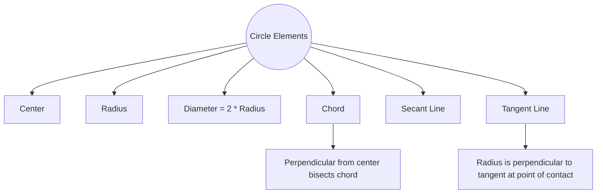

  <h3 style="color: var(--accent); margin-bottom: 16px; border-bottom: 1px solid var(--border); padding-bottom: 8px; display: flex; align-items: center; gap: 8px; font-weight: 600;">CIRCLE</h3>
  <h4 style="border-left: 3px solid var(--info); padding-left: 8px; margin-top: 24px; margin-bottom: 10px; color: var(--text-primary); font-weight: 600;">DEEP CONCEPTUAL EXPLANATION</h4>

Circle CIRCLE Usually (3-6) questions have been asked from this chapter. Generally questions are asked from the topics related to theorem of circle, tangent to a circle and locus. Chord A circle is a curved figure consisting of all points in a plane that are at a fixed distance from a fixed point. The fixed point is called centre and the fixed distance is called radius of the circle. A chord is a line segment whose end points lie on the circle. A diameter is the longest chord in a circle.

• Circles are simple closed curves which divide the plane into two regions : an interior and an exterior.

• In the given figure, O is the centre of circle, OA is the radius of the circle and AB is the diameter of the circle.

Here, in the given figure PQ is a chord and AB is the diameter of the circle which is the longest chord of that circle. RADIUS Secant Radius is the fixed distance between the centre of the circle and the points lying on the circle. A line which intersect the circle at two points is called secant of the circle.

Here, in the figure AB is a secant cutting the circle at two distinct points as C and Here, in the given figure OA OB OC and all are having fixed distance, so they are known as radius of the circle. It is denoted by r. Arc Diameter Any part of a circle between two points is called an arc of the circle. Any two points, say A and B of a circle divide it into two parts called arcs. The smaller arc APB is called minor arc and larger arc AQB is called major arc.

Diameter is any line segment that passes through the centre of the circle and whose end points lie on the circle. The diameter of a circle is twice the radius. Here, AB CD and are the diameters of the circle. AB CD OA = 2( OB OC OD A circle can have an infinite number of diameters.

It is usually denoted by APB and AQB.

Semi Circle Here, in the given figure GBH is a tangent touching the circle at a single point B. A diameter divides the circle into two equal parts. Each of the two is called a semi-circle. Length of tangent The distance between external point P from which tangent is drawn and the point of contact of the tangent is called length of tangent.

In the above figure, RPSR and RQSR are semi-circles. Properties of Tangent To a Circle Segment • Only two tangents can be drawn from a point outside the circle. Minor Segment • Only one tangent can be drawn through a point lying on the circle.

The area enclosed by an arc and its corresponding chord is called a segment of the circle. Major Segment • No tangent can be drawn from a point lying inside the circle.

• The segment containing the minor arc is called minor segment.

• A tangent at any point of a circle is perpendicular to the radius through the point of contact.

• The segment containing the major arc is called major segment.

Sector Sector Relative Position of two Circles The area enclosed by any two radii and the arc determined by the end points of the radii is called a sector of the circle. Circumference O´ O´ r1 r2 O´ r1 r2 (i) (ii) (iii) The length of the complete circle is called its circumference. Circumference = Radius of the circle or Diameter of the circle O´ O´ Concentric Circles (iv) (v) C4 C3 C2 C1 Two circles will (i) be disjoint, when OO ′ > 2.

(ii) be touching externally, when OO ′ = 2.

(iii) be intersecting when OO ′ < 2.

(iv) be touching internally, when OO ′ = (v) one of the circle will lie inside the other, when OO ′ < 1 . Two or more circles having the same centre are called concentric circles. Here, in the given figure C and C4 are known as concentric circles as they have a common centre ‘O’.

An infinite number of circles can be drawn with same centre. Tangent A tangent to a circle is a straight line that touches the circle at a single point.

## Visual Summary & Diagrams: Circle Geometry

### Circle Terminology & Theorems

