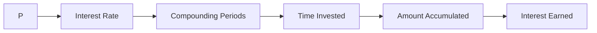

### Compound Interest

#### _Chapter Overview: Harnessing the Power of Compound Interest_

Compound interest is a fundamental concept in finance and banking that can have a significant impact on an individual's or institution's wealth. It is the concept of earning interest not only on the initial principal amount but also on the accrued interest over time. In this chapter, we will explore the mechanics of compound interest, including its calculation, applications, and strategies for maximizing returns.

#### 1. Mechanics of Compound Interest

Compound interest is calculated using the formula: A = P(1 + r/n)^(nt), where A is the amount of money accumulated after n years, including interest, P is the principal amount, r is the annual interest rate (in decimal), n is the number of times that interest is compounded per year, and t is the time the money is invested for in years.

$$A = P\left(1 + \frac{r}{n}\right)^{nt}$$

The key variables in this formula are the principal amount (P), the annual interest rate (r), the number of compounding periods per year (n), and the time the money is invested for (t).

#### 2. Types of Compound Interest

There are several types of compound interest, including:

* **Simple Interest**: This type of interest is calculated only on the principal amount and is not compounded.
* **Compound Interest**: This type of interest is calculated on both the principal amount and the accrued interest.
* **Continuous Compound Interest**: This type of interest is compounded at a continuous rate, rather than at discrete intervals.

#### 3. Applications of Compound Interest

Compound interest has numerous applications in finance, banking, and investing. Some of the key applications include:

* **Savings Accounts**: Compound interest can be used to calculate the interest earned on a savings account.
* **Certificates of Deposit (CDs)**: Compound interest can be used to calculate the interest earned on a CD.
* **Stocks**: Compound interest can be used to calculate the returns on investment in stocks.

> **Edge Case:** When the interest rate is 0%, the formula simplifies to A = P, indicating that the interest earned is 0.

### Critical Insights and Contextual Enrichment

#### Compound Interest Table

| Type of Compound Interest | Formula |
| --- | --- |
| Simple Interest | P + Prt |
| Compound Interest | P(1 + r/n)^(nt) |
| Continuous Compound Interest | Pe^(rt) |

#### Compound Interest Cycle

### The Exhaustive Testing Engine

#### Question 1: What is the formula for calculating compound interest?

a) A = P + Prt
b) A = P(1 + r/n)^(nt)
c) A = Pe^(rt)
d) A = P(1 + r)^(nt)

Correct Option: b) A = P(1 + r/n)^(nt)

Explanation: The formula for calculating compound interest is A = P(1 + r/n)^(nt), where A is the amount of money accumulated after n years, including interest, P is the principal amount, r is the annual interest rate (in decimal), n is the number of times that interest is compounded per year, and t is the time the money is invested for in years.

#### Question 2: What is the key variable in the formula for compound interest?

a) Principal Amount (P)
b) Annual Interest Rate (r)
c) Number of Compounding Periods per Year (n)
d) Time Invested (t)

Correct Option: a) Principal Amount (P)

Explanation: The principal amount (P) is the key variable in the formula for compound interest, as it represents the initial amount of money invested.

#### Question 3: What is continuous compound interest?

a) Interest is calculated only on the principal amount
b) Interest is calculated on both the principal amount and the accrued interest
c) Interest is compounded at a continuous rate
d) Interest is calculated on the interest earned during a period

Correct Option: c) Interest is compounded at a continuous rate

Explanation: Continuous compound interest is a type of compound interest where the interest is compounded at a continuous rate, rather than at discrete intervals.

#### Question 4: What is the application of compound interest in savings accounts?

a) Compound interest can be used to calculate the interest earned on a CD
b) Compound interest can be used to calculate the interest earned on a savings account
c) Compound interest can be used to calculate the returns on investment in stocks
d) Compound interest can be used to calculate the interest earned on a mutual fund

Correct Option: b) Compound interest can be used to calculate the interest earned on a savings account

Explanation: Compound interest can be used to calculate the interest earned on a savings account, as the interest earned is compounded over time.

#### Question 5: What is the edge case for compound interest when the interest rate is 0%?

a) The interest earned is 0 in all cases
b) The interest earned is 0 when the interest rate is 0%
c) The interest earned is positive when the interest rate is 0%
d) The interest earned is negative when the interest rate is 0%

Correct Option: b) The interest earned is 0 when the interest rate is 0%

Explanation: When the interest rate is 0%, the formula for compound interest simplifies to A = P, indicating that the interest earned is 0.

#### Question 6: What is the formula for simple interest?

a) A = P + Prt
b) A = P(1 + r/n)^(nt)
c) A = Pe^(rt)
d) A = P(1 + r)^(nt)

Correct Option: a) A = P + Prt

Explanation: The formula for simple interest is A = P + Prt, where A is the amount of money accumulated after t years, including interest, P is the principal amount, r is the annual interest rate (in decimal), and t is the time the money is invested for in years.

#### Question 7: What is the key difference between compound interest and continuous compound interest?

a) Compound interest is calculated on the interest earned during a period
b) Continuous compound interest is calculated on both the principal amount and the accrued interest
c) Compound interest is calculated at a continuous rate
d) Continuous compound interest is calculated at discrete intervals

Correct Option: c) Compound interest is calculated at a continuous rate

Explanation: Continuous compound interest is calculated at a continuous rate, whereas compound interest is calculated at discrete intervals.

#### Question 8: What is the application of compound interest in CDs?

a) Compound interest can be used to calculate the interest earned on a savings account
b) Compound interest can be used to calculate the interest earned on a CD
c) Compound interest can be used to calculate the returns on investment in stocks
d) Compound interest can be used to calculate the interest earned on a mutual fund

Correct Option: b) Compound interest can be used to calculate the interest earned on a CD

Explanation: Compound interest can be used to calculate the interest earned on a CD, as the interest earned is compounded over time.

#### Question 9: What is the edge case for compound interest when the number of compounding periods per year is infinite?

a) The formula simplifies to A = P + Prt
b) The formula simplifies to A = Pe^(rt)
c) The formula simplifies to A = P(1 + r)^(nt)
d) The formula simplifies to A = P(1 + r/n)^(nt)

Correct Option: b) The formula simplifies to A = Pe^(rt)

Explanation: When the number of compounding periods per year is infinite, the formula for compound interest simplifies to A = Pe^(rt), indicating that the interest is compounded at a continuous rate.

#### Question 10: What is the key variable in the formula for continuous compound interest?

a) Principal Amount (P)
b) Annual Interest Rate (r)
c) Number of Compounding Periods per Year (n)
d) Time Invested (t)

Correct Option: a) Principal Amount (P)

Explanation: The principal amount (P) is the key variable in the formula for continuous compound interest, as it represents the initial amount of money invested.