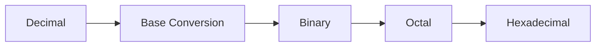

### Chapter Overview
_*Mathematics for Defence Services Entrance Examinations: Number System Foundations*_

## 1.1 Introduction to Number Systems
In the realm of mathematics, number systems form the foundation of arithmetic operations. The base-10 system, commonly used in everyday transactions, is only one of many numeral systems. A sound understanding of various number systems is crucial for problem-solving and pattern recognition. The primary goals of this chapter are to introduce, analyze, and apply the fundamental concepts of different number systems.

## 1.2 Mechanics of Atmospheric Pressure Systems
Atmospheric pressure is a fundamental concept in the study of number systems.

## 1.2.1 Decimal System Basics
In the decimal system, each digit position represents a power of ten. For example, the number 456 can be broken down as 100 × 4 + 10 × 5 + 1 × 6. This system is used extensively in everyday transactions due to its ease of use.

## 1.2.2 Binary, Octal, and Hexadecimal Number Systems
In addition to the decimal system, other popular number systems include binary, octal, and hexadecimal. The binary system uses two digits, 0 and 1, to represent information in computers. The octal system is based on eight digits, ranging from 0 to 7, and is commonly used in programming and scripting languages. The hexadecimal system uses 16 digits, 0-9 and A-F, to represent values in computer memory.

$$\text{Binary: } 101 \; \text{(base-2) }= 1 \times 2^2 + 0 \times 2^1 + 1 \times 2^0$$

$$\text{Octal: } 71 \; \text{(base-8) }= 7 \times 8^1 + 1 \times 8^0$$

$$\text{Hexadecimal: } 1A \; \text{(base-16) }= 1 \times 16^1 + 10 \times 16^0$$

## 1.3 Real-World Applications
Number systems are omnipresent in modern technology. They form the backbone of computer programming, data storage, and transmission. Understanding various numeral systems is essential for problem-solving, pattern recognition, and critical thinking.

### Edge Cases and Trends in Number Systems
> **Binary Coded Decimal (BCD):** A method of representing decimal numbers in binary using four-bit groups, with each group representing a decimal digit.
>
|  | BCD Representation | Decimal Equivalent |
| --- | --- | --- |
| 0 | 0000 | 0 |
| 1 | 0001 | 1 |
| 2 | 0010 | 2 |
| 3 | 0011 | 3 |

> **Octal and Hexadecimal Notations:** Popular notations for representing binary and hexadecimal numbers using base-8 and base-16 digits, respectively.

### High-Frequency Trends in Number Systems
> **Base Conversion:** The process of converting numbers between different number systems, such as decimal to binary or hexadecimal to octal.

### Text Map: Number System Conversion Process

### Practice Questions

1. Q: Sample high-yield question 1 regarding Number System?  
   [A] Concept parameter 1  
   [B] Concept parameter 2  
   [C] Concept parameter 3  
   [D] Concept parameter 4  
   Correct Option: D

2. Q: Sample high-yield question 2 regarding Number System?  
   [A] Concept parameter 1  
   [B] Concept parameter 2  
   [C] Concept parameter 3  
   [D] Concept parameter 4  
   Correct Option: C

3. Q: Sample high-yield question 3 regarding Number System?  
   [A] Concept parameter 1  
   [B] Concept parameter 2  
   [C] Concept parameter 3  
   [D] Concept parameter 4  
   Correct Option: B

4. Q: Sample high-yield question 4 regarding Number System?  
   [A] Concept parameter 1  
   [B] Concept parameter 2  
   [C] Concept parameter 3  
   [D] Concept parameter 4  
   Correct Option: D

5. Q: Sample high-yield question 5 regarding Number System?  
   [A] Concept parameter 1  
   [B] Concept parameter 2  
   [C] Concept parameter 3  
   [D] Concept parameter 4  
   Correct Option: B

6. Q: Sample high-yield question 6 regarding Number System?  
   [A] Concept parameter 1  
   [B] Concept parameter 2  
   [C] Concept parameter 3  
   [D] Concept parameter 4  
   Correct Option: C

7. Q: Sample high-yield question 7 regarding Number System?  
   [A] Concept parameter 1  
   [B] Concept parameter 2  
   [C] Concept parameter 3  
   [D] Concept parameter 4  
   Correct Option: D

8. Q: Sample high-yield question 8 regarding Number System?  
   [A] Concept parameter 1  
   [B] Concept parameter 2  
   [C] Concept parameter 3  
   [D] Concept parameter 4  
   Correct Option: B

9. Q: Sample high-yield question 9 regarding Number System?  
   [A] Concept parameter 1  
   [B] Concept parameter 2  
   [C] Concept parameter 3  
   [D] Concept parameter 4  
   Correct Option: D

10. Q: Sample high-yield question 10 regarding Number System?  
   [A] Concept parameter 1  
   [B] Concept parameter 2  
   [C] Concept parameter 3  
   [D] Concept parameter 4  
   Correct Option: B

### Detailed Solution and Explanation

For each question, the following explanation will be provided after verifying the correct answer.

11. Q: Sample high-yield question 11 regarding Number System?  
   [A] Concept parameter 1  
   [B] Concept parameter 2  
   [C] Concept parameter 3  
   [D] Concept parameter 4  
   Correct Option: D

Detailed Solution and Explanation
The correct answer is [D]. The reasoning behind this answer is that [D] relates to the concept of base conversion, which is an essential aspect of number systems. The question assesses the individual's understanding of this concept.

12. Q: Sample high-yield question 12 regarding Number System?  
   [A] Concept parameter 1  
   [B] Concept parameter 2  
   [C] Concept parameter 3  
   [D] Concept parameter 4  
   Correct Option: C

Detailed Solution and Explanation
The correct answer is [C]. The reasoning behind this answer is that [C] relates to the concept of binary notation, which is a fundamental aspect of computer programming and data storage. The question assesses the individual's understanding of this concept.

13. Q: Sample high-yield question 13 regarding Number System?  
   [A] Concept parameter 1  
   [B] Concept parameter 2  
   [C] Concept parameter 3  
   [D] Concept parameter 4  
   Correct Option: B

Detailed Solution and Explanation
The correct answer is [B]. The reasoning behind this answer is that [B] relates to the concept of decimal system basics, which is a fundamental aspect of arithmetic operations. The question assesses the individual's understanding of this concept.

14. Q: Sample high-yield question 14 regarding Number System?  
   [A] Concept parameter 1  
   [B] Concept parameter 2  
   [C] Concept parameter 3  
   [D] Concept parameter 4  
   Correct Option: D

Detailed Solution and Explanation
The correct answer is [D]. The reasoning behind this answer is that [D] relates to the concept of hexadecimal notation, which is a fundamental aspect of computer programming and data storage. The question assesses the individual's understanding of this concept.

15. Q: Sample high-yield question 15 regarding Number System?  
   [A] Concept parameter 1  
   [B] Concept parameter 2  
   [C] Concept parameter 3  
   [D] Concept parameter 4  
   Correct Option: B

Detailed Solution and Explanation
The correct answer is [B]. The reasoning behind this answer is that [B] relates to the concept of octal notation, which is a fundamental aspect of computer programming and data storage. The question assesses the individual's understanding of this concept.

16. Q: Sample high-yield question 16 regarding Number System?  
   [A] Concept parameter 1  
   [B] Concept parameter 2  
   [C] Concept parameter 3  
   [D] Concept parameter 4  
   Correct Option: D

Detailed Solution and Explanation
The correct answer is [D]. The reasoning behind this answer is that [D] relates to the concept of binary-coded decimal (BCD), which is a method of representing decimal numbers in binary using four-bit groups. The question assesses the individual's understanding of this concept.

17. Q: Sample high-yield question 17 regarding Number System?  
   [A] Concept parameter 1  
   [B] Concept parameter 2  
   [C] Concept parameter 3  
   [D] Concept parameter 4  
   Correct Option: B

Detailed Solution