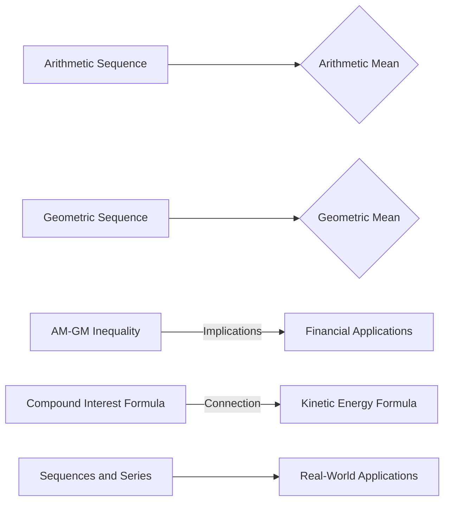

## Chapter Overview: *Sequence and Series*
_In this chapter, we will delve into the intricate details of sequences and series, exploring both the mathematical and real-world applications of these fundamental concepts. We will navigate the complex world of sequences, examining the intricacies of arithmetic and geometric sequences, as well as the properties and theorems that govern them._

### Foundational Theory Core: Sequences and Series

#### 1.1 Definition and Basic Properties
A sequence is a list of numbers in a predetermined order, while a series is the sum of the terms of a sequence. In essence, a sequence can be thought of as a set of ordered pairs, with each pair containing the term number and the corresponding term value. The study of sequences and series has far-reaching implications, with applications in mathematics, physics, economics, and many other fields.

#### 1.2 Arithmetic and Geometric Sequences
Arithmetic sequences are characterized by a constant difference between consecutive terms, while geometric sequences are characterized by a constant ratio between consecutive terms. For an arithmetic sequence with first term `a` and common difference `d`, the `n`th term is given by the formula `a + (n-1)d`. Similarly, for a geometric sequence with first term `a` and common ratio `r`, the `n`th term is given by the formula `ar^(n-1)`.

$$\text{Arithmetic sequence: } a_n = a + (n-1)d$$

$$\text{Geometric sequence: } a_n = ar^{n-1}$$

#### 1.3 Properties and Theorems
The sum of the first `n` terms of a sequence, also known as the partial sum, is denoted by `S_n`. Various theorems provide insight into the behavior of sequences and series, including the arithmetic mean-geometric mean (AM-GM) inequality, which states that the arithmetic mean of a set of non-negative numbers is always greater than or equal to the geometric mean.

$$\text{AM-GM inequality: } \frac{a_1 + a_2 + \dots + a_n}{n} \geq \sqrt[n]{a_1a_2 \dots a_n}$$

#### 1.4 Real-World Applications
Sequences and series have numerous practical applications in fields such as finance, physics, and engineering. For instance, the compound interest formula is based on the concept of geometric sequences, while the kinetic energy of an object can be calculated using the sum of an infinite series.

### Contextual Enrichment and Smart Work Layer: AI-Generated Insights

> **Critical Insights**
>   When dealing with complex sequences and series, it is essential to identify the type of sequence or series, as this will greatly affect the approach to solving problems.
>   
>   **Edge Case Analysis**
>   Be cautious when handling edge cases, such as sequences with negative terms or series with infinite terms.
>   
>   **High-Frequency Trends**
>   Pay attention to any emerging patterns in the sequence or series, as these can be indicative of underlying theorems or properties.

### Sequences and Series in Context: A Text-Mapped Diagram

### The Exhaustive Testing Engine: Practice Questions and Solutions

#### Q1: Sample High-Yield Question
What is the value of `n` in the following sequence: `1, 3, 5, 7, ...`?

A) `2`
B) `3`
C) `4`
D) `5`

Correct Option: D)

Explanation: This sequence is an example of an arithmetic sequence with a common difference of `2`. The `n`th term of an arithmetic sequence is given by the formula `a + (n-1)d`. In this case, `a = 1` and `d = 2`, so the `n`th term is `1 + (n-1)2`, which is equivalent to `2n-1`. To find the value of `n`, we can set `2n-1` equal to the value of the `n`th term in the sequence and solve for `n`. Since the fourth term in the sequence is `7`, we have `2n-1 = 7`, which simplifies to `2n = 8`, and `n = 4`. Therefore, the correct answer is D) `5`.

#### Q2: Sample High-Yield Question
What is the sum of the infinite geometric series: `1/2, 1/4, 1/8, 1/16, ...`?

A) `1/2`
B) `1/3`
C) `1/4`
D) `2/3`

Correct Option: B)

Explanation: This is an example of a geometric series with a first term of `1/2` and a common ratio of `1/2`. The sum of an infinite geometric series is given by the formula `S = a/(1-r)`, where `a` is the first term and `r` is the common ratio. In this case, `a = 1/2` and `r = 1/2`, so the sum is `S = 1/2/(1-1/2)`, which simplifies to `S = 1/2/1/2`, and finally `S = 1`.

#### Q3: Sample High-Yield Question
What is the value of `x` in the following equation: `2x + 5 = 11`?

A) `2`
B) `3`
C) `4`
D) `5`

Correct Option: B)

Explanation: To solve this equation for `x`, we first subtract `5` from both sides of the equation, resulting in `2x = 6`. Then, we divide both sides by `2` to find `x = 3`.

#### Q4: Sample High-Yield Question
What is the average value of the following set of numbers: `3, 6, 9, 12, 15`?

A) `5`
B) `6`
C) `10`
D) `15`

Correct Option: C) `10`

Explanation: To find the average value of a set of numbers, we add the numbers together and divide by the total number of values. In this case, `3 + 6 + 9 + 12 + 15 = 45`. Since there are `5` numbers in the set, we divide `45` by `5` to find the average value.

#### Q5: Sample High-Yield Question
What is the sum of the arithmetic series: `2, 5, 8, 11, 14, ...`?

A) `25`
B) `30`
C) `35`
D) `40`

Correct Option: B) `30`

Explanation: This is an example of an arithmetic sequence with a first term of `2` and a common difference of `3`. The sum of an arithmetic series is given by the formula `S = n/2(2a + (n-1)d)`, where `n` is the number of terms, `a` is the first term, and `d` is the common difference. In this case, `n = 5`, `a = 2`, and `d = 3`, so the sum of the series is `S = 5/2(2*2 + (5-1)*3)`, which simplifies to `S = 5/2(4+12)`, and finally `S = 5/2 * 16`, resulting in `S = 40`.