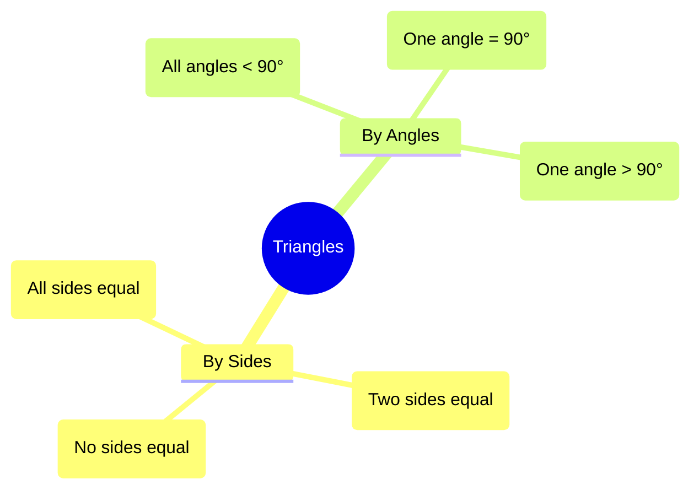
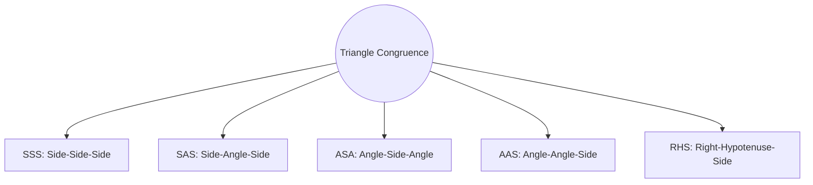

  <h3 style="color: var(--accent); margin-bottom: 16px; border-bottom: 1px solid var(--border); padding-bottom: 8px; display: flex; align-items: center; gap: 8px; font-weight: 600;">TRIANGLES</h3>
  <h4 style="border-left: 3px solid var(--info); padding-left: 8px; margin-top: 24px; margin-bottom: 10px; color: var(--text-primary); font-weight: 600;">DEEP CONCEPTUAL EXPLANATION</h4>

TRIANGLES Generally (8-10) questions have been asked from this chapter. Generally questions are asked from the topic of pythagoras theorem, similarity of triangles and mid-point theorem. TRIANGLE A plane (closed) figure bounded by three line segments is called a triangle. It is denoted by ∆. ∆ABC has • three vertices, namely A B and C.

• three sides, namely AB BC CA and • three angles, namely ∠ and ∠C.

• Sum of three angles of a triangle is 180°. i.e., ∠ + ∠ + ∠ • Area of a triangle = base × height = BC AD Classification of Triangle 1. On the Basis of Angles Hypotenuse Perpendicular Base (i) Right Angled Triangle A triangle in which one of the angle measures 90° is called a right angled triangle. The side opposite to the right angle is called its hypotenuse and the remaining two sides are called as perpendicular and base depending upon conditions. Here, ∆ABC is a right angled triangle in which ∠ 90 and AC is hypotenuse.

(ii) Acute Angled Triangle A triangle in which every angle measure more than 0° but less than 90° is called an acute angled triangle.

Here, ∆ABC is an acute angled triangle.

(iii) Obtuse Angled Triangle A triangle in which one of the angle measures more than 90° but less than 180° is called an obtuse angled triangle. Here, ∆ABC is an obtuse angled triangle and ∠ABC is the obtuse angle. Triangles • Centroid divides the median in the ratio 2 : 1.

2. On the Basis of Sides • A median bisects the area of the triangle i.e.

Ar Ar ABD ADC = 1 Ar( ∆ABC , etc.

(i) Equilateral Triangle A triangle having all sides equal is called an equilateral triangle. Here ∆ABC, is an equilateral triangle in which AB BC AC All angles are equal and are of measure 60°. Incentre and Angle Bisector The point of intersection of all the three angle bisectors of a triangle is called its incentre. It is denoted by I.

• The circle with centre I and touches all the sides is called incircle and radius of this circle is called inradius denoted by ‘r’.

(ii) Isosceles Triangle A triangle in which two sides are equal, is called an isosceles triangle. Here, ∆ABC is an isosceles triangle as AB AC • Angle opposite to equal sides are equal.

i.e.

= ∠ • Inradius = Height = Side 2 3 ID →Inradius, AD →Height Perpendicular Bisector and Circumcentre The point of intersection of the perpendicular bisectors of the sides of a triangle is called its circumcentre. It is denoted by C. (iii) Scalene Triangle A triangle in which all the sides are of different lengths is called a scalene triangle. ∆ABC is a scalene triangle as AB BC AC The circle with centre C and passing through vertices A B and is called circumcircle.

Radius of circumcircle is called circumradius denoted by R. Circumradius (CO) = Height = Side Note The sum of the lengths of three sides of a triangle is called its perimeter.

So, perimeter of ∆ABC = AB BC AC

## Visual Summary & Diagrams: Triangles

### Types of Triangles

### Congruence Criteria

