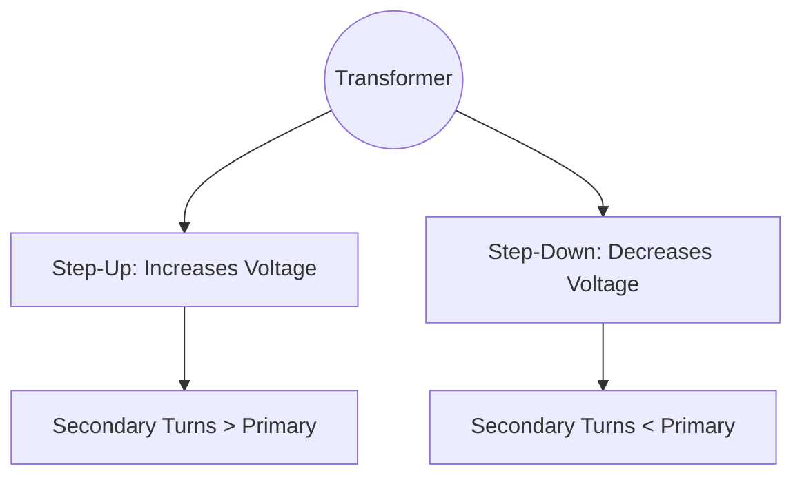

<div class="revision-card" style="background: rgba(20,20,30,0.4); border: 1px solid var(--border); border-radius: 8px; padding: 20px; margin-bottom: 24px; box-shadow: 0 4px 12px rgba(0,0,0,0.25);">
  <h3 style="color: var(--accent); margin-bottom: 16px; border-bottom: 1px solid var(--border); padding-bottom: 8px; display: flex; align-items: center; gap: 8px; font-weight: 600;">ELECTRIC CURRENT</h3>
  <h4 style="border-left: 3px solid var(--info); padding-left: 8px; margin-top: 24px; margin-bottom: 10px; color: var(--text-primary); font-weight: 600;">DEEP CONCEPTUAL EXPLANATION</h4>

Telescope • Magnifying power of telescope, m where fo • Telescope is an optical instrument which is used for observing distinct images of heavenly bodies like stars, planets, etc., when the final image is formed at infinity. is focal length of objective of the telescope and where fe is focal length of eye-piece of the telescope.

• There are two types of telescopes – Astronomical telescope (invented by Kepler in 1611) – Galilean telescope (invented by Galileo in 1609) • Length of telescope tube in astronomical telescope is In Galilean telescope the length of telescope, • In an astronomical telescope, the objective lens is a convex lens of large focal length but eye-piece is a convex lens of short focal length.

² Note Periscope consists of two plane mirrors inclined at an angle of 45°. The principle of working of periscope is based upon reflection and refraction.

• In Galilean telescope, the objective lens is a convex lens of large focal length but the eye-piece is a concave lens of short focal length.

ELECTRIC CURRENT Electric Field ELECTRIC CHARGE The region around an electric charge in which its effect can be experienced is called the electric field. Charge is the basic property associated with matter due to which it produces and experience electrical and magnetic effects. The SI unit of electric charge is Coulomb. Electric field intensity (E ) = Electric Potential • Positively charged particles called protons and negatively charged particles called electrons. A proton possesses a positive charge of 1 6 10 19 . × −C, whereas, an electron possesses a negative charge of 1 6 10 19 . × −C.

The electric potential at a point in an electric field is the work done in bringing a unit positive charge from infinity to that point.

• Similar charges repel each other and opposite charges attract each other.

Conservation of Charges • Electric potential = Work done Charge . Its SI unit is volt (V). When two or more charged bodies come in contact, then total charge on all the bodies are conserved.

• Conductors are those substances which allow passage of electrical charges to flow through them and have very low electrical resistance e.g. copper, aluminium, gold, silver, etc.

• Human body and earth act like a conductor. Silver is the best conductor.

• Charges are always distributed on the surface of the conductor.

• Resistors offer high resistance to the flow of current through them e.g. eureka, nichrome, etc.

• Potential difference ( between two points A and B is the work done in bringing a unit charge from point B to point A.

• Potential difference is a scalar quantity and is measured by means of voltmeter (a high resistance device).

• The electric potential inside a spherical surface is same at each point and is equal to the potential on the surface.

• Electrical potential on earth is considered to be zero.

• A voltmeter connected in parallel with conductor to measure the potential difference across its ends.

• Voltage is the other name for potential difference.

Electric Current • Insulators have infinite resistance and do not allow the passage of current. e.g. rubber, glass, ebonite, etc.

• The rate of flow of electric charges through any cross-section of conductor is called electric current.

• The direction of positive charges is same as direction of conventional current.

² Note The presence of free electrons in a substance makes it a conductor. Coulomb’s Law Current Charge Time ⇒I • The SI unit of electric current is ampere.

• The force of attraction or the force of repulsion acting between the two point charges is proportional to the product of the magnitudes of the two charges and inversely proportional to the square of the distance between them i.e. F q q • Current is measured by an instrument called ammeter.

• An ammeter is connected in series with the conductor to measure the current passing through it.

1 2 πε GENERAL SCIENCE • The reciprocal of resistance of a conductor is called the electrical conductance of the conductor.

• There are two types of electric current (i) Alternating current (AC) and (ii) Direct current (DC).

Conductance Resistance • Alternating current is used in houses and factories and its frequency is 50 Hz.

• Unit of conductance is mho or siemen.

• The specific resistance of the material depends only on the material of conductor and its temperature.

• Resistivity increases with temperature.

• Resistivity of a conductor change with impurity.

• Ordinary DC ammeter and DC voltmeter cannot measure alternating current/voltages. They record zero reading, when used in AC circuits, because average value of alternating current/voltage over a full cycle is zero.

Galvanometer • Resistivity of an alloy is greater than the resistivity of its constituents and remains unchanged with temperature. It is a device used to detect and measure electric current in a circuit. It can measure current up to 10 6 −A. A galvanometer can be converted into a voltmeter by connecting a very high resistance in its series.

• If a wire is stretched or doubled on itself, its resistance will change, but its specific resistance will remains unaffected.

• The reciprocal of resistivity of a conductor is called its conductivity. Its SI unit is mho m 1 −or siemen/metre Sm − ² Note Conventionally the direction of electric current is opposite to that of electrons. Since, electrons flow from negative terminal of a cell to its positive terminal, electric current flows from positive terminal to negative terminal.

Capacitor A capacitor or condenser is a device over which a large amount of charge can be stored.

• Capacitance of capacitor (C) Charge Potential Combination of Resistances There are two combinations given below:

(i) Series combination 3 and here current flows through each conductor is same.

• Its unit is coulomb/volt or farad.

R3 R1 R2 • A capacitor is used in several electrical devices having an electric motor and in several electronic circuits. OHM’S LAW The total resistance in the series combination is more than the greatest resistance in the circuit. (ii) Parallel combination 1 and here potential across each conductor is same.

R1 If the physical circumstances of the conductor. (length, temperature, etc) remains constant then the current flowing through the conductor is directly proportional to the potential difference across its ends.

i.e.

or IR , where R is resistance.

R2 Resistance R3 The resistance of a conductor is directly proportional to its length and inversely proportional to its cross-sectional area. If l and A are respectively length and cross-sectional area of a conductor and R is its resistance, then ⇒R = ρ The total resistance in parallel combination is less than the least resistance of the circuit. ELECTRIC POWER Unit of resistance is ohm ( Ω.

where, ρ is a constant of material of conductor is called specific resistance or resistivity. Its SI unit is ohm-metre. Electrical power is the electrical work done per unit time.

• On increasing the temperature of the metal, its resistance increases.

P = W or P = or P = I R Q V IR or P = V • Those materials whose electrical conductivity lies in between that of insulators and conductors are called semiconductors. On increasing the temperature of semiconductor, its resistance decreases.

Its SI unit is watt (W).

• 1 kilowatt hour =3600000 J = 3.6 10 6 J 1 Horse power (HP) = 746 W 1 Horse power (HP) = 550 foot-pound/second Unit = volt ampere hour Unit = watt hour Heating Effect of Electric Current • When poles of two magnets are brought close together, they exert force on each other. This force is called intersection between the poles.

• If we cut a magnet in two parts, then each separate part will behave as a magnet.

• Permanent magnets are usually made of alloys such as carbon steel, chromium steel, cobalt steel, tungsten steel and alnico (alloy of aluminium, nickel, cobalt and iron).

• Such permanent magnets are used in microphones, loudspeakers, electric clocks, ammeters, voltmeters, speedometer and many other devices.

Heat is produced, when electric current is passed through a conductor. This effect is called heating effect of electric current. joule ² Note The Magnetic Resonance Imaging (MRI) technique which is used to scan inner human body parts in hospitals also uses magnets for its working. Magnetic Field Heat produced = I Rt VIt = V t ² Note The filament of an electric bulb gets very hot and therefore easily oxidised. Thus, bulbs are sealed with inactive nitrogen and argon gases to prevent oxidation of the filament and increase its life.

In electric bulb, tungsten is used for the construction of filament because it has high melting point. IMPORTANT POINTS BASED ON HEATING EFFECT The space in the surrounding of a magnet or a current carrying conductor in which its magnetic effect can be experience is called magnetic field.

• Magnetic lines of force are imaginary lines in the magnetic field, which shows the direction of magnetic field continuously.

• The magnetic field lines originate from the North pole of a magnet and end at its South pole.

• The magnetic field lines do not intersect one another.

Magnetic Materials G In home appliances like electric iron, electric heater and heating rod, the heating element used is of a nichrome (an alloy of Ni and Ci) wire. Nichrome has high melting point and high resistivity. To avoid the risk of electric shock, the metal body of electrical appliances is earthed. G An electric fuse is generally prepared from tin-lead alloy (63% tin + 37% lead). It should have high resistance and low melting point. It is connected in the series. G Tubelight contains a long tube of glass which is linked internally with a fluorescent substance. It is filled with an inert gas like argon along with some mercury.

Magnetic Effect of Current When electricity passes through insulated copper wire, it develops a magnetic field around it. Larger the amount of electricity, stronger the magnetic field. And when we place compass needle in the radius of the magnetic field it diverts from its North-South position. MAGNETS According to behaviour of magnetic substances, they are classified into three classes • Those substances when placed in an external magnetic field, acquire a very low magnetism in direction opposite to the field are called diamagnetic substances. e.g. copper, silver, bismuth, zinc, diamond, salt, water, mercury, etc.

• The permeability of diamagnetic substance is less than one.

• Those substances when placed in an external field, acquire a feeble magnetism in the direction of field are called paramagnetic substances. e.g. aluminium, sodium, potassium, oxygen, etc.

• The permeability of paramagnetic substance is slightly greater than one.

• Those substances, when placed in a magnetic field, acquire a strong magnetism in the direction of field are called ferromagnetic substances. These substances when brought near the end of a strong magnet get radially attracted towards it. e.g. iron, nickel, cobalt, magnetite, etc.

• The permeability of ferromagnetic substance is much greater than one.

Electromagnet An electromagnet is a solenoid coil that attains magnetism due to flow of current. It works on the principle of magnetic effect of current. It is used in electric bells, electric motors, telephone, diaphragms, loudspeakers etc. Magnet is a piece of iron or other materials that can attract iron containing objects and the property of attracting the magnetic substance by a magnet is called magnetism.

• The magnets which do not lose their magnetism with normal treatment are called permanent magnets.

• The materials which retain their magnetism for a long time are called hard magnetic materials.

• In bar, rod and horse-shoe magnets, North or South poles are either indicated by the letter N or S.

GENERAL SCIENCE Magnetic Flux • AC generator consists of slip rings, armature, magnet and brushes while DC generator consists of magnet commutator, armature and brushes. The magnetic flux linked with a surface is equal to the total number of magnetic lines of force passing through that surface normally. Its unit is weber. ² Note Electric motor is a rotating device which converts electrical energy into mechanical energy.

Transformer ELECTROMAGNETIC INDUCTION Transformer is a device which converts low voltage AC into high voltage AC and high voltage AC into low voltage AC. It is based on mutual induction.

• Core of a transformer is made up of soft iron.

When a change occurs in the magnetic flux linked with the coil, an emf is induced in the coil. The phenomenon is called electromagnetic induction.

• Step-up transformer converts a low voltage of high current into a high voltage of low current.

• The phenomenon of production of induced emf in a circuit due to change in magnetic flux in its neighbouring circuit is called mutual induction.

• Step-down transformer converts a high voltage of low current into a low voltage of high current.

• The main energy losses in a transformer are given below:

(a) Iron loss (b) Flux loss (c) Hysteresis loss (d) Humming loss • When the electric current flowing through a circuit changes, the magnetic field linked with circuit also change. As a result an induced emf is set up in the circuit. This phenomenon is called self-induction.

• Transformer is used in voltage regulators, refrigerators, computer, air conditioner.

• Microphone converts sound energy into electrical energy and works on the principle of electromagnetic induction.

• Step-down transformer is used for welding purpose.

Electric Generator • Audio transformer allowed telephone circuits to carry on a two-way conservation over a single pair of wires.

• Radio frequency transformers are used in radio communication.

It is a device which converts mechanical energy into electrical energy. An electric generator is based on the principle of electromagnetic induction. It is used to produce electric current by varying magnetic field through a coil. ² Note A mobile phone charger is one of the best example of step down transformer as it extracts the power from the home supply (AC 220V) and convert it to DC of required voltage.

• A generator can produced both alternating current and direct current.

CATHODE RAYS • X-rays were discovered by scientist Roentgen.

• These produce illumination on falling the fluorescent substances and travel in a straight line with the speed of light.

• X-rays penetrate through different depth into different substances.

• Soft X-rays have greater wavelength and lower frequency and hard X-rays have lower wavelength and higher frequency.

• X-rays ionise gases through which they pass.

• X-rays are not deflected by electric and magnetic fields.

If the gas pressure in a discharge tube is 10 to 10 mm of Hg and a potential difference of 10 4 V is applied between the electrode, then a beam of electrons emerges from the cathode which is called cathode rays.

• Cathode rays are invisible and travel in a straight line.

• These rays are deflected by electric and magnetic fields.

• These rays can ionise gases.

• They can produce chemical change and thus affect a photographic plate.

• When they strike a target of heavy metal such as tungsten, they produce X-rays.

X-RAYS • They show all the important properties of light rays like, reflection, refraction, interference, diffraction and polarisation, etc.

• X-rays are used in surgery, radiotherapy, engineering department and searching.

When cathode rays strike on a heavy metal of high melting points, then a very small fraction of its energy converts into a new type of waves, called X-rays. ² Note Barium and Iodine are some chemicals used as contrast mediums for X-ray based imaging method. i.e. they absorbs X-ray to highlight the targeted body part.

• X-rays are electromagnetic waves and these produce photoelectric effect.


</div>


## Visual Summary: Electricity & Magnetism

### Series vs Parallel Circuits
```mermaid
flowchart LR
    Series((Series Circuit)) --> CurrentSame[Current (I) is Same]
    Series --> VoltageDiv[Voltage (V) Divides]
    Series --> Req[Req = R1 + R2 + R3]
    
    Parallel((Parallel Circuit)) --> VoltageSame[Voltage (V) is Same]
    Parallel --> CurrentDiv[Current (I) Divides]
    Parallel --> ReqP[1/Req = 1/R1 + 1/R2 + 1/R3]
```

### Transformers

