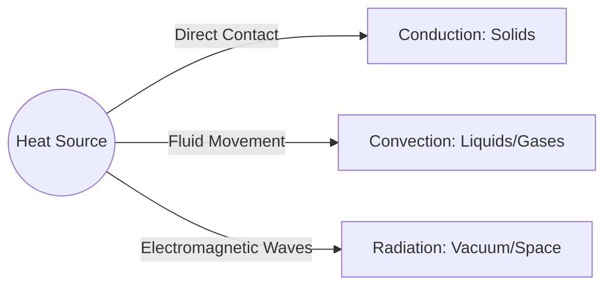

  <h3 style="color: var(--accent); margin-bottom: 16px; border-bottom: 1px solid var(--border); padding-bottom: 8px; display: flex; align-items: center; gap: 8px; font-weight: 600;">HEAT AND THERMODYNAMICS</h3>
  <h4 style="border-left: 3px solid var(--info); padding-left: 8px; margin-top: 24px; margin-bottom: 10px; color: var(--text-primary); font-weight: 600;">DEEP CONCEPTUAL EXPLANATION</h4>

GENERAL SCIENCE HEAT AND THERMODYNAMICS Total Radiation Pyrometer TEMPERATURE The measurement of hotness or coldness of a body is called its temperature. When two bodies are placed in contact, heat always flows from a body at higher temperature to the body at lower temperature. Radiation pyrometer measures the temperature of a body by measuring the radiation emitted by the body. It cannot measure temperature below 800°C because at low temperature, emission of radiation is very small and cannot be detected. Sun's temperature is measured by it. THERMOMETER ² Note Bolometer and thermopile are also used to measure the amount of heat radiated by a body.

HEAT It is a form of energy which produces the sensation of warmth in our body.

• It is due to the kinetic energy of the molecules constituting the object or body. Its units are calorie, kilocalorie or joule.

An instrument used to measure the temperature of a body is called a thermometer. Mercury is generally used as, thermometric substance, because it is sensitive to slightest change in temperature which is notable when it is used in a thermometer. Mercury has a freezing point of − 38 83 C and boiling point at 356 7 ⋅°C, this gives a very big range to measure temperatures for many general purposes. Also, it does not stick to (wet) the capillary wall of the thermometers and it is easy to obtain in its elemental form.

• Calorie is the amount of heat required to raise the temperature of 1 g of water through 1°C (from 10°C to 11°C). It is represented by cal, 1 cal = 418 J.

Temperature Scales • Air is a non-conductor of heat and silver is the best conductor of heat.

• Ebonite rubber, glass and air are bad conductors of heat.

Specific Heat • Specific heat is the amount of heat required to raise the temperature of a unit mass of the substance by 1°C.

• If Q heat changes the temperature of m by ∆T, then specific heat m T The SI unit of specific heat is J/kg-K.

• Specific heat of gold = 130 J/kg-K • Specific heat of water = 4180 J/kg-K • The specific heat of water is maximum.

Some temperature scales are as follows 1. Celsius Scale (C) The melting point of the ice at standard atmospheric pressure is regarded as 0°C and the boiling point of water as 100°C. This scale was designed by Anders Celsius in the year 1710. The degree celsius (°C) can refer to a specific temperature on the celsius scale as well as a unit to indicate a temperature interval.

2. Fahrenheit Scale (F) The melting point of ice is regarded as 32°F and the boiling point of water as 212°F. This scale was designed by Gabriel Fahrenheit in the year 1717.

3. Reaumer Scale (R) The melting point of ice is regarded as 0°R and the boiling point of water as 80°R. This scale was introduced by RA Reaumer in year 1730.

• Mercury has low specific heat.

Thermal Capacity • Scales of temperature measurement, It is the amount of heat required to raise the temperature of a body through 1K. Its units are J/K or cal/°C or kcal/°C. Thermal capacity = mC where, m is the mass of the body and C is the specific heat. Water Equivalent • The normal temperature of a human body is 37°C or 98.4 F.

• − is the temperature at which Celsius and Fahrenheit thermometers read same.

It is the mass of water, which absorbs or emits the same amount of heat as is done by the given body for the same rise or fall in temperature.

• The water equivalent of a body is denoted by W. Its SI unit is kg and CGS unit is g.

• The range of a laboratory thermometer is generally from − 10 C to 110° C. A laboratory thermometer cannot be used to measure the human body temperature.

• Water equivalent, W = mC where, m is mass of the body and C is the specific heat.

Anamalous Expansion of Water Principle of Calorimetry The heat lost by the hot body must be equal to the heat gained by the cold body. This is known as principle of calorimetry or principle of mixtures, i.e. Heat gained = Heat lost • Work and heat are two equivalent forms of energy.

• Calorimeter is a cylindrical vessel made of copper.

Almost every liquid expands with the increase in temperature. But when temperature of water is increased from 0°C to 4°C its volume decreases. If the temperature is increased above 4°C its volume starts increasing, clearly density of water is maximum at 4°C. Interconversion of States of Matter The temperature at which solid starts to liquify is known as melting point of that solid. THERMAL EXPANSION The phenomenon of change in dimensions of an object due to heat supplied is known as thermal expansion.

• The process in which a solid changes into a liquid on heating is called melting solid. Change of state takes place i.e. ice changes into water.

• A solid can undergo three types of expansions:

– Linear expansion (expansion in length) – Superficial expansion (expansion in area) • The process in which a liquid changes into a solid is called fusion. The temperature at which liquid starts to freeze is known as freezing point of the liquid. – Cubical expansion (expansion in volume) • Relation between the coefficients of linear, superficial and cubical expansion : α β γ = 1 2 3 : :

• The process in which a liquid changes into a vapour on heating is called vaporisation. The temperature at which the liquid starts to evaporate is called the boiling point where change of state takes place i.e. water changes into water vapour or steam.

Practical Applications of Thermal Expansion • The process of change of state directly from solid to vapour (or gas) is known as sublimation. LATENT HEAT • When hot tea is poured into a glass tumbler made of soft glass, it cracks because of thermal expansion of glass. It is the amount of heat absorbed by a unit mass of the substance to change its state without change in temperature.

• Telegraph wires are given enough gap to allow the wires for contraction in winter.

• SI unit of latent heat is joule per kilogram.

• Latent heat of fusion is 80 cal/g and vaporisation is 540 cal/g.

• An ordinary pendulum clock runs faster in winter but slower in summer, because in summer the length of pendulum increases, while in winter it decreases.

• Ice at 0°C is more effective in cooling a substance than water at 0°C.

• A metallic ball before heating can pass easily through the ring, but after heating the ball does not pass through the ring because of the thermal expansion of ball.

• If Q is quantity of heat absorbed (or given out), then mL where, m = mass of the substance L = latent heat of substance.

• Steam contains more heat, in the form of latent heat, then boiling water.

• A gap is provided between the iron rails of the railway track, so that rails can easily expand during summer and do not bend. In the construction of bridges, ends of steel gerders are not fixed but placed on rollers to allow free expansion and contraction in summer and winter respectively to avoid any damage to the bridge.

• The burns caused by steam are much more severe than those caused by boiling water though both of them are at the same temperature of 100°C.

EVAPORATION • A tightly fitted cork can be removed from a glass bottle without breaking it on heating its mouth carefully. The glass wall expand and the cork will come out easily. Expansion of Liquids It is the slow process of conversion of a liquid into its vapour even below its boiling temperature.

• Liquids do not have their definite length and surface area. It always need a container. When they are heated, they expand and at the same time the container also expands.

• The expansion of a liquid, when the expansion of its container has not been taken into account is called apparent-expansion.

• The expansion of a liquid, when the expansion of its container is taken into account, is called real expansion.

• Cooking is caused by evaporation due to expansion.

• Factors affecting the evaporation of a liquid are – the area of the liquid surface – the nature of the liquid – temperature of the liquid – dryness of air – the movement of the air – temperature of air or surrounding GENERAL SCIENCE Difference between Petrol Engine and Diesel Engine RELATIVE HUMIDITY Petrol engine Diesel engine It works with a spark plug.

It works with an oil plug.

Efficiency is smaller (47%).

Efficiency is larger (55%).

The ratio of amount of water vapour ( m actually present in a certain volume of air at a given temperature to the amount of water vapour ( M required to saturate it, is called relative humidity, RH. No risk of explosion, because only air is compressed. Hence, compression ratio is kept large.

H = × 100%.

It is associated with the risk of explosion, because petrol vapour and air is compressed. So, low compression ratio is kept.

• The amount of water vapour in air is called as humidity.

Petrol vapour and air is created with spark plug. Spray of diesel is obtained through the jet.

• The amount of water vapour in the air varies as it depends on the rate of evaporation.

Transmission of Heat • The amount of water vapour present in 1 m3 air is called its absolute humidity.

• Relative humidity is measured by hygrometer.

• Relative humidity increases with the increases of temperature.

Transfer of heat from one place to other place is called transmission of heat. There are three processes by which transmission of heat takes place. (a) Conduction (b) Convection (c) Radiation THERMODYNAMICS • In solids, transmission of heat takes place by conduction process.

• In liquids and gases heat takes place by convection process.

• Heat from the sun reaches on the earth by radiation.

• Mercury though a liquid is heated by conduction and not by convection.

• In rooms, ventilators are provided to escape the hot air by the process of convection.

• Air is poor conductor of heat.

• On a cold night two thin blankets gives more hotness than a single thick blanket because the layer of air between the two blankets works as better insulator of heat.

• Cooking utensils are made up of aluminium, brass and steel, because these substances have low specific heat and high conductivity.

Thermodynamics is a branch of physics which deals with exchange of heat energy between bodies and conversion of the heat energy into mechanical energy and vice-versa. First Law of Thermodynamics The amount of heat given to a system is used up in two ways, first to increase the internal energy and second to do the external work. i.e. dQ dU dW Second Law of Thermodynamics The second law of thermodynamics is the outcome of human experience under which heat energy can be converted into mechanical energy. This law is based upon the two statements given below.

(i) It is impossible to construct a device which operates in a cycle that will take heat from a body and convert it completely into the work. (Kelvin-Planck’s Statements) (ii) It is impossible to construct a self acting device which operates in a cycle that will transfer heat from a cold body to a hot body without expenditure of work (Clausius Statement). KIRCHHOFF’S LAW Kirchhoff’s law signifies that good absorbers are good emitters. If a shining metal ball with some black spot on its surface is heated to a high temperature and seen in dark, the shining ball becomes dull but the black spots shines brilliantly because black spot absorbs radiation during heating and emit in dark.

Nature of Internal Energy • White and light colours are bad absorbers and good reflectors of heat.

• According to the kinetic modal of matter, every substance is composed of molecules which are in constant motion inside the substance. Hence, molecules posses kinetic energy.

• In deserts, day temperature is very high and night temperature is extremely low because the specific heat of sand is very low. Therefore, it absorbs the heat readily and its temperature raises by a large degree during day. At night sand radiates the heat equally readily making the temperature loss.

• Molecules also exert force on one another which is called intermolecular force, hence they posses potential energy also. The kinetic energy and potential energy of molecules is the internal energy of the substance.

Perfectly Black Body A perfectly black body is one which absorbs completely all the radiations falling on its surface, whatever be the wavelength.

• The internal energy of an ideal gas is only the kinetic energy of its molecules which depends only upon the temperature of the gas.

where, σ is Stefan's constant.

Perfectly black body is a perfect absorber hence, according to Kirchhoff’s law, it will also be a perfect radiator. It is not essential that a perfectly black body should appear black. Sun emits radiation of all wavelength, so it may be called a black body, even though it looks white. Stefan’s Law The radiant energy emitted by unit area of perfectly black body per unit time is directly proportional to the fourth power of its absolute temperature. ² Note Wein's displacement law can be used to compute the temperature of the sun or of the stars.

Newton’s Law of Cooling The rate of loss of heat by a body is directly proportional to the difference in temperature between the body and the surrounding. If the door of refrigerator is kept open, it will not cool the room, it will increases the temperature of the room, because heat rejected by the refrigerator to the room, will be more than the heat taken by the refrigerator from the room. OSCILLATIONS AND WAVES PERIODIC MOTION – no force acts on the particle.

– velocity is maximum.

– acceleration is zero.

– kinetic energy is maximum.

– potential energy is zero.

• When a particle executing SHM is at the extreme end, then When a body repeats its motion continuously on a definite path in a definite interval of time, then its motion is called periodic motion and the interval of time is called time period. Motion of hands of a clock, motion of earth around the sun and motion of the needle of a sewing machine are examples of periodic motion.

Oscillatory Motion – velocity of particle is zero. – acceleration of the particle is maximum.

– kinetic energy of particle is zero.

– potential energy is maximum.

– restoring force acting on particle is maximum.

• In case of spring block system, time period of oscillation If a body in periodic motion moves along the same path to and fro about a definite point (mean position or equilibrium position), then the motion of the body is a vibratory motion or oscillatory motion. Oscillatory motion is also called as harmonic motion.

is given by T = 2π , where m is the mass of the block.

• In case of spring block system, the restoring force kx = − where, x is displacement of the block from mean position and k is spring constant.

• The motion of the pendulum of a wall clock, the motion of the bob of a simple pendulum, the motion of a loaded spring, the motion of liquid contained in a U-tube , the motion of the prongs of tuning fork and the motion of a bar magnet suspended in the earth’s magnetic field are examples of oscillatory motion.

RESTORING FORCE • All oscillatory motions are periodic motions, but all periodic motions are not oscillatory. When oscillating particle is displaced from its equilibrium position, then a periodic force acts upon it which is always directed towards the equilibrium position. This force is called restoring force. SIMPLE HARMONIC MOTION (SHM) Simple Pendulum A simple pendulum consists of a small metal ball suspended by a long thread from a rigid support, such that the bob is free to swing back and forth.

If a particle repeats its motion about a fixed point after a regular time interval in such a way that at any moment the acceleration of the particle is directly proportional to its displacement from the fixed point at that moment and is always directed towards the fixed point, then the motion of the particle is called simple harmonic motion.

• The distance of the pendulum from its mean position is called its displacement.

• Vibrations of the prongs of a tuning fork, oscillations of a body. Suspended by a spring. Oscillations of a body partly immersed in a liquid and oscillations of a simple pendulum are examples of simple harmonic motion.

• The maximum displacement of the pendulum on either side of its mean position is called the amplitude of oscillations.

• When a particle executing SHM passes through the mean position, then • Time period is the time taken by the pendulum to complete one full oscillation.

## Visual Summary: Heat

### Modes of Heat Transfer

