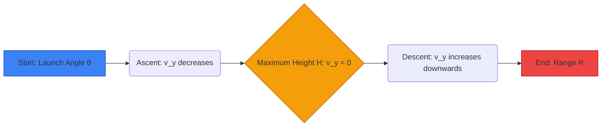

  <h3 style="color: var(--accent); margin-bottom: 16px; border-bottom: 1px solid var(--border); padding-bottom: 8px; display: flex; align-items: center; gap: 8px; font-weight: 600;">MEASUREMENT MOTION WORK ENERGY AND POWER</h3>
  <h4 style="border-left: 3px solid var(--info); padding-left: 8px; margin-top: 24px; margin-bottom: 10px; color: var(--text-primary); font-weight: 600;">DEEP CONCEPTUAL EXPLANATION</h4>

After analysing the previous year question papers, we have seen that 40-45 questions are asked from science section, out of these 20-22 questions are asked from Physics. From physics section, around 2 to 3 questions each are asked from topics like motion, sound, electric current and 1 to 2 questions each are asked from topics like optics, modern physics and heat. MEASUREMENT, MOTION, WORK, ENERGY AND POWER e.g. unit of speed can be derived from fundamental units as, PHYSICAL QUANTITIES Unit of speed = Unit of distance Unit of time ms-1 All the quantities which can be measured directly or indirectly in terms of which law of physics are described and whose measurement is necessary, are called physical quantities. e.g. velocity, time, mass, etc. Unit SI System It is based on the following seven basic units and two supplementary units.

Name of Quantities Name of Units Name of Quantities Name of Units Basic Units The standard amount of a physical quantity chosen to measure the physical quantity of same kind is called a physical unit. Length Metre Thermodynamic temperature Kelvin Fundamental and Derived Units Mass Kilogram Luminous intensity Candela Time Second Quantity of matter Mole Electric current Ampere Supplementary Units Plane angle Radian Solid angle Steradian The unit of a defined set of physical quantities called fundamental quantities are known as fundamental units and the units for all other physical quantities, except fundamental quantities are known as derived units. SCALAR AND VECTOR QUANTITIES Speed The path length or the distance covered by an object divided by the time taken by the object to cover that distance is called the speed of that object. Its unit is m/s or km/h.

Speed Distance travelled Time taken • Physical quantities which have magnitude only and no direction are called scalar quantities. e.g. mass, speed, volume, work, time, power, energy, etc.

• An object is said to be moving with a uniform speed, if it covers equal distances in equal intervals of time.

• An object is said to be moving with a variable speed, if it covers equal distances in unequal intervals of time or unequal distances in equal intervals of time.

• Physical quantities which have magnitude and direction both and which obey triangle law are called vector quantities.

e.g. displacement, velocity, acceleration, force, momentum, torque, etc. Average Speed MECHANICS • If a motion is the ratio of the total distance travelled by the object to the total time taken.

...

...

i.e. average speed, av = • If the body covers equal distances with different speeds, then v v av = 1 2 Mechanics deals with the study of motion of particles, rigid and deformable bodies and general system of particles. Motion A body is said to be in motion when its position changes continuously with respect to a stationary body taken as a reference point. Distance and Displacement • The distance covered by a body is the actual length of the path travelled by the body between the initial position and final position.

When the speed of an object is constantly changing, then the speed at a particular moment or instant of time is called the instantaneous speed of that object. Velocity The rate of change in position or displacement of a body with time is called the velocity of that body. It is a vector quantity.

– It is always positive.

Velocity = Displacement in particular direction Time taken • A body is said to be moving with uniform velocity, if equal displacements of the body take place in same direction in equal intervals of time. – It is a scalar quantity which has magnitude only.

Its unit is metre.

• The displacement of a particle is the change in position of the particle in a particular direction and is given by a vector drawn from its initial position to its final position.

– Displacement may be positive, negative or zero. – It is a vector quantity and its unit is also metre.

• If a body moves in such a way that its speed or the direction or both changes with time, the body is said to have variable velocity.

Average Velocity – The magnitude of displacement may or may not be equal to the path length travelled by an object. – Displacement ≤Distance • If a body is defined as the net displacement divided by the time taken for displacement. av = (a) (b) As net displacement = 1 and time taken = • Average velocity could be zero, positive or negative but average speed is always positive for moving body. When a particle returns to the starting point, its average velocity is zero but average speed is not zero.

Relative Velocity – In Fig. (a) a particle starts from A and reach B through points C, D and E, then AB is the displacement and ( AC CD DE EB is the distance travelled.

• When two bodies are moving in the straight line, the speed (or velocity) of one with respect to another is known as its relative speed (or velocity).

– Also, in Fig. (b), a particle starts from A and reach to C through point B, then AC is displacement and distance covered is ( AB BC • When two bodies are moving in the same direction, then relative velocity = 2. When the two bodies are moving in opposite directions, then relative velocity = 2. GENERAL SCIENCE Acceleration 2. Velocity-Time Graphs (i) In case of zero acceleration, the velocity of the object does not change with time.

• It is the rate of change of velocity with respect to time. Its SI unit is m/s2 and CGS is cm/s2. It is a vector quantity.

• An object is said to be moving with uniform acceleration, if its velocity changes by equal amounts in equal intervals of time.

Velocity Time • An object is said to be moving with a variable acceleration, if its velocity changes by unequal amounts in equal intervals of time.

• If the velocity of an object increases without change in direction, it is said to be moving with positive acceleration.

• If the velocity of an object decreases without change in direction, the object is said to be moving with negative acceleration or deceleration or retardation.

(ii) If the object is moving with uniform positive acceleration having zero initial velocity, then the velocity-time graph is a straight line starting from origin.

• Acceleration of an object is zero, if it is at rest or moving with uniform velocity.

Graphical Representation of Motion Velocity Time Position 1. Position–Time Graphs (i) When distance covered by a moving object goes on increasing with time, the object is said to have positive acceleration (i.e. velocity increases with time). (iii) In case of negative and constant acceleration, the velocity of the object decreases linearly with time. Time (ii) When distance covered by a moving object goes on decreasing with time, the object is said to have negative acceleration (i.e.

velocity decreases with time).

Velocity Time Position Time (iv) When the acceleration of the object is increasing, line bending towards velocity axis represent the increasing acceleration in the body. (iii) When the moving object covers equal distance in equal time, the object is said to have zero acceleration i.e.

uniform velocity.

Velocity Time Position Time (v) When the acceleration of the object is decreasing, line bending towards time axis represents the decreasing acceleration in the body. (iv) When the position of object does not change with time, the object is at rest (i.e. velocity is zero). Velocity Position Time Time Equations of Motion • The horizontal range is the same when the body is projected at θ and ( 90° −θ .

• The horizontal range of a projectile is maximum when angle of projection is 45°.

For a moving object, the relations among its velocity, displacement, time and acceleration can be represented by equations. These equations are called equations of motion.

• For motion a straight line with constant acceleration a • When two balls of different masses are projected horizontally they will reach ground at same time.

(i) at (ii) ut at + 1 FORCE (iii) as • Equation of motion under gravity, (downward direction) Force is a push or pull which produces or tends to produce a change in uniform motion of body; stops or tends to stop a body which is in motion. Its unit is Newton. (i) gt (ii) ut gt + 1 • It is a vector quantity and the straight line along which a force is directed is called the line of action of the force.

• The rotational effect of a force on a body about an axis of rotation is described in terms of moment of force.

• CGS unit of force is dyne i.e. 1 dyne = 10 5N.

(iii) gh Where, u = initial velocity v = final velocity g = gravitational acceleration If an object is thrown vertically upward away from the earth, then we shall substitute −g in place of g in the above equations. The value of g is 9.8 m/s2. ² Note If a body starts from rest and moves with uniform acceleration, then distance covered by the body in t sec is proportional to t (. . i e Force is of two types (i) Component of Force Forces acting at same angle from the coordinate axes can be resolved into mutually perpendicular forces called components. The component of a force parallel to the X-axis is called x-component, parallel to the y-component and so on.

Projectile Motion F sin θ F cos θ Here, When a body moves under an acceleration whose direction is different from the direction of the initial velocity, then both the magnitude and direction of its velocity changes with time. Hence, the body moves on a curved path in a plane. This type of motion is called projectile motion.

• A bullet fired from a rifle and a body dropped from the window of a moving train shows the projectile motion.

v sin θ v cos θ u sin θ • x-component of force F is Fcosθ.

• y-component of force F is F sinθ.

(ii) Contact and Non-contact Force The forces which act on bodies when they are in physical contact are called contact forces. e.g. muscular force, frictional force, etc. A force which can be exerted by an object on another object even from a distance (without physical contact with each other) is called a non-contact force. e.g. magnetic force, electrostatic force and gravitational force.

NEWTON’S LAWS OF MOTION u cos θ Newton has given three laws of motion as below:

• Flight time of projectile, T = 2 sinθ First Law • Height of projectile, h sin θ sin θ.

It states that every body continues in its state of rest or in uniform motion in a straight line, unless it is compelled by an external force to change that state. First law is also called law of Galileo or law of inertia.

• Range of projectile, R • The property of bodies by virtue of which they oppose only change in their present state is called inertia.

• Mass is a measure of the inertia of a body.

• We drop down a ball from a roof and at the same time throw another ball in a horizontal direction, then both the balls would strike the earth simultaneously at different places.

GENERAL SCIENCE Here some practical examples are as follows in which first law is used.

• It is difficult to drive a nail into a wooden block without holding the block.

• Athlete runs some distance, before taking a long jump.

• A ball thrown upward in a train moving with uniform velocity returns to the hand of thrower.

• A jet plane moves on the principle of Newton’s third law of motion. As exhaust gases come out from the nozzle at a greater speed, the reaction of the same moves the plane forwards.

• The mud from the wheels of a moving vehicle flies-off tangentially.

• When we shake the branch of a mango tree, the mangoes fall down.

Validity of Newton’s Laws of Motion Newton’s laws are valid in classical physics only under certain conditions • A man jumping from a moving train may fall down.

• If a cloth placed under a book is given a sudden pull, it comes out without disturbing the book.

• In general, the distances which one work must be much greater than the size of atoms and molecules.

Else, quantum mechanics must be used in place of classical mechanics.

• When a horse suddenly starts moving, the rider falls backward.

• When a running horse suddenly stops, the rider falls forwards.

• In general, the speeds which one work with must be much less than the speed of light. Else, relativistic mechanics must be used in place of classical mechanics.

• We hit a carpet with a stick to remove the dust.

• Also, this is valid with respect to inertial frame of reference only.

Second Law Linear Momentum The rate of change of momentum of a body is directly proportional to the applied force and takes place in the direction in which the force acts. According to second law • The linear momentum of a body is defined as, the product of its mass and its velocity i.e. Momentum = Mass × Velocity, dp dt or F kdp dt where, k is constant of proportionality • It’s direction is the same as the direction of velocity of the body. It is a vector quantity. It’s SI unit is kg-m/s.

• Concept of momentum was introduced by Newton.

k d dt (mv) = kma for simplicity let k = 1. ma 1 newton = 105 dyne • Newton’s second law gives the magnitude of force.

• A heavier body has a larger linear momentum than a lighter body moving with the same velocity. i.e. In the absence of external forces, the total momentum of the system is conserved.

i.e.

m v m v 1 1 2 2 [For single body] and m u m u m v m v 1 1 2 2 1 1 2 2 [For two bodies] Applications of Conservation of Momentum When a bullet is fired from a gun, the gun recoils or gives a sharp pull in backward direction. While firing a bullet, the gun must be held tight to the shoulder.

• When a man jump from a boat to the shore, the boat slightly moves away from the shore.

• Rocket works on the principle of conservation of momentum.

• Newton’s first law is contained in the second law.

Here some practical examples are as follows in which second law is used.

• China wires are wrapped in straw or paper before packing.

• A person falling on pucca floor (or frozen ice) is likely to receive more injuries than one falling on kuccha floor (loose earth).

• While catching a ball, a cricket player lowers his hands to save himself from getting hurt.

• Bogies of the trains are provided with buffers to avoid severe jerks during shunting of trains.

• If someone left on a frictionless floor desires to get out of it, he can do so by blowing air out of his mouth.

Third Law Impulse According to this law, to every action there is an equal and opposite reaction. ‘Action and reaction always act on the different bodies.’ Here some practical examples are as follows in which third law is used • An impulse is a large force acting on a body for a short time to produce a finite change in momentum.

• Impulse = Force Time interval i.e. I × ∆ It’s SI unit is N-s or kg-m/s • In order to walk, we press the ground in backward direction with our feet. As a result, the ground pushes us in forward direction.

Examples of momentum and impulse are as follows:

• Friction is independent of the area of contact of the two surfaces. Rolling friction is less than sliding friction.

• In catching a ball, a player by drawing his hands backward increases the time of contact.

• An athlete is advised to come to stop slowly after finishing a fast race.

• The layer of bricks is broken by player.

• Vehicles like cars, buses, and scooters, are provided with shockers.

• Force of friction ( ) F is directly proportional to the normal reaction ( ) R .

i.e.

= µ where, µ = coefficient of friction.

Also, = tan , where α is the angle of friction. Angle of repose = Angle of friction i.e. θ Methods for Reducing Friction • Bogies of the trains are provided with buffers, because buffers increase the time duration of jerks during shunting. This reduces the force with which bogies push or pull each other and severe jerks are avoided. FRICTION • By using lubricants e.g. grease, oil, etc.

• By using ball or roller bearings, which changes sliding into rolling.

• By using soap solution.

• By using powder.

The opposing force which comes into play when a body moves or tries to move the surface of another body is known as friction.

• Friction due to air is considerably reduced by streamling the shape of the body moving at high speed in air. e.g.

aircraft, jet-planes, fast cars are streamlined.

• The maximum value of the force of friction which comes into play before a body just begins to slide over the surface of another body is called limiting friction.

• The tyres are provided with treads which increases the friction between the tyres and the road.

• The force of friction that comes into play between the surfaces of two bodies before the body actually starts moving is called static friction.

• The force of friction that opposes relative motion between two surfaces in contact is called kinetic or sliding friction.

² Note Pulling is easier than pushing While pushing, there is one component of force that acting downward on the object adds to the weight of the body hence there is more friction opposing the effort. Whereas on pulling, the vertical component of force is against the weight of the body and hence there is less overall friction. So, it is easy to pull than push.

• The frictional force developed, when a body rolls over a surface, is known as the rolling friction.

CIRCULAR MOTION • Static friction is a self adjusting force and it adjusts itself, so that it became equal to the applied force. Advantages of Friction When an object moves along a circular path, then its motion is called circular motion as motion of top, etc. In circular motion force is always at right angles to the displacement therefore no work is done by the force on the particle.

• Due to friction, we are able to move on the surface of the earth.

• When an object moves along a circular path with uniform speed, its motion is called uniform circular motion.

• The fibres of thread are held together due to force of friction.

• The brakes applied in automobiles work only due to friction.

• Circular motion is accelerated even, if the speed of the body is constant. The motion of a satellite is accelerated motion.

• Sledges are used in Arctic region as friction is very low on the surface of ice.

Angular Velocity Disadvantages of Friction Angular velocity is the rate at which angle swept by the radius at the centre changes with time. Its unit is rad/s. B, t=1 • A lot of energy is wasted in the form of heat due to friction that causes wear and tear of the moving parts.

• Due to friction, speed of automobiles cannot be increased beyond a certain limit.

A, t=1 Laws of Friction Friction acts in a direction opposite to the direction of motion of the objects. It depends upon the nature of the two surfaces in contact.

• Angular velocity, ω ⇒s and ω GENERAL SCIENCE Centrifugal Force There are certain situations in which we feel that a body is acted upon by a force, but actually there is no force on the body. Such an apparent force is called a pseudo force.

θ = s So, as v = linear speed, ω = angular velocity, r = radius of the circular path.

• Centrifugal force is such a pseudo force. It is equal and opposite to centripetal force. When a person stand on a rotating platform, then he feels the centrifugal force.

• Cream separator and centrifugal drier work on the principle of centrifugal force.

² Note Centrifugal is a device to separate the particles of different masses present in liquid. Thus, linear velocity = Angular velocity × Radius of circular path. The angular velocity of revolution of a planet around the sun in an elliptical orbit increases. When the planet came closer to sun and vice-versa.

Angular Acceleration WORK • The rate of change of angular velocity is defined as angular acceleration. Work is said to be done, if a force acting on a body is able to actually move it through some distance in the direction of the force.

• Angular acceleration, α . Its unit is rad/s2 or revolution/sec 2.

• Work = Force Distance, i.e.

W = F s • Relation between angular acceleration and linear acceleration, • If the force F is making an angle θ with the direction of displacement of the body, then the work done is Fs cosθ Centripetal Acceleration • It’s SI unit is joule (J). The acceleration is directed towards the centre and is given • CGS unit of work is erg i.e. 1 J = 10 7 ergs , where v is the speed and r is the radius. This is by a Types of Work called centripetal acceleration. Centripetal Force Work can be of following types 1. Positive Work Done Positive work means that force is parallel to displacement.

Examples • When a body falls freely under gravitational pull. A body performing circular motion is acted upon by a force which is always directed towards the centre of the circle. This is called centripetal force. Work done by centripetal force is always zero.

• If a body of mass m is moving on a circular path of radius R with uniform velocity v, then the required • When a horse pulls a cart on a level road.

2. Negative Work Done Negative work means that force is opposite to displacement.

Examples centripetal force, F mv • Any of the forces found in nature such as frictional force, gravitational force, electrical force, magnetic force may act as a centripetal force.

• Cyclist bends his body towards the centre on a turn while turning to obtain the required centripetal force.

• When a body is made to slide over a rough surface or when a positive charge is moved towards another positive charge.

3. Zero Work Done If the force is perpendicular to the displacement and if either the force or the displacement is zero, work done will be zero.

Examples • When a coolie travels on a platform with a load on his head.

• Generally, in rain the scooter slips off the turning of a road because the friction between tyre and road is reduced. Due to this necessary centripetal force is not provided.

• When a body is moved along a circular path. When a person does not move from his position but he may be holding any amount of heavy load.

• Vehicles can move on circular path safely, if friction force ≥required centripetal force.

• Roads are banked at turns to provide the required centripetal force for taking a turn.

• If the force is perpendicular to the displacement and if either the force or the displacement is zero, work done is zero.

• Work done by centripetal force is always zero.

Conservative and Non-conservative Forces • A force is said to be conservative, if the work done by the force in moving a body depends only upon the initial and final positions of the body and is independent of the path followed between the initial and final position, e.g. gravitational force, electrostatic force and magnetic force, etc. Applications of potential energy are given below (i) The potential energy of the wound spring of a clock is used to drive the hands of the clock. (ii) Due to potential energy of the stretched bow, the arrow goes forward with a large velocity on releasing the bow.

(iii) The potential energy of water in dams is used to run turbines in order to produce electrical energy using the generators. Principle of Conservation of Energy • A force is said to be non-conservative, if the work done by the force or against the force, in moving a body from one position to another, depends upon the path followed between the two positions. e.g. friction force, etc. According to the law of conservation of energy it can neither be created nor be destroyed but can only be transformed from one form to another.

ENERGY The energy of an object is its capacity for doing work. It is a scalar quantity and its unit is joule (J).

• The total amount of energy in the universe remains constant. e.g. when an object falls, its potential energy decreases but at the same time kinetic energy increases by an equal amount.

• Energy can exist in different forms such as mechanical energy, heat energy, sound energy, light energy, chemical energy, etc.

Transformation of Energy • Mechanical energy is of two types i.e. kinetic energy and potential energy.

• In a heat engine, heat energy changes into mechanical energy. In the sun, mass changes into radiant energy.

1. Kinetic Energy • In an electrical heater, the electric energy is converted into heat energy.

The energy possessed by a body by virtue of its motion is called its kinetic energy.

• If a body of mass m is moving with velocity v, then • In an electric bulb, the electric energy is converted into light energy in burning coal, oil, etc. The chemical energy changes to heat energy.

kinetic energy = mv • When we rub our hands, heat is generated. Here, mechanical energy of muscles is converted into heat energy.

• When momentum is doubled kinetic energy becomes four times.

• In an electromagnet the electric energy is converted into magnetic energy.

Einstein’s Mass-Energy Equivalence In 1905, Einstein proved the relation between mass and energy. E mc 2, where c is the velocity of light. mc 2 leads to verification of the two laws, law of conservation of mass and law of conservation of energy. POWER The time rate of doing work is called power.

If W is work done in time t then power, P = W • If a body is moving in horizontal circle then its kinetic energy is same at all points, but if it is moving in vertical circle, then the kinetic energy is different at different points. Applications of kinetic energy are given below (i) Kinetic energy of air is used to run wind mills. (ii) Kinetic energy of running water is used to run the water mills.

(iii) A bullet fired from a gun can pierce a target due to its kinetic energy.

2. Potential Energy It is the energy possessed by a body by virtue of its position.

For a constant force F, the Power ( ) F v ⇒P Fv cosθ where v = velocity of object θ = angle between F and v • Suppose a body is raised to a height h above the surface of the earth, then potential energy of body = mgh • Power is a scalar quantity with SI unit watt (W) or joule/s.

• Also, here potential energy = work done = mgh • Some other units of power are 1 watt hour = 3600 J 1 kilowatt hour = 3 6 10 6 1 HP (Horse Power) = 746 W • When the body is projected upwards, then its kinetic energy goes on changing to potential energy and vice-versa.

## Visual Summary & Diagrams

### Projectile Motion Trajectory

