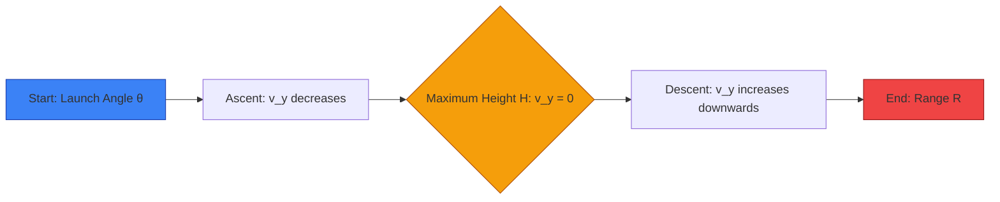
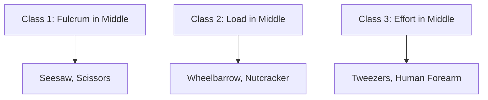

# MEASUREMENT, MOTION, WORK, ENERGY AND POWER
## DEEP CONCEPTUAL EXPLANATION
After analyzing the previous year's question papers, we have seen that 40-45 questions are asked from the science section, out of these 20-22 questions are asked from Physics. From the physics section, around 2 to 3 questions each are asked from topics like motion, sound, electric current, and 1 to 2 questions each are asked from topics like optics, modern physics, and heat.

### PHYSICAL QUANTITIES
The unit of speed can be derived from fundamental units as:

* Unit of speed = Unit of distance / Unit of time = m/s or km/h

All the quantities which can be measured directly or indirectly in terms of which law of physics are described, and whose measurement is necessary, are called physical quantities. e.g., velocity, time, mass, etc.

#### Unit SI System
It is based on the following seven basic units and two supplementary units.

| Name of Quantities | Name of Units | Name of Quantities | Name of Units |
| --- | --- | --- | --- |
| Length | Metre | Thermodynamic temperature | Kelvin |
| Mass | Kilogram | Luminous intensity | Candela |
| Time | Second | Quantity of matter | Mole |
| Electric current | Ampere | Plane angle | Radian |
|  |  | Solid angle | Steradian |

The unit of a defined set of physical quantities called fundamental quantities are known as fundamental units, and the units for all other physical quantities, except fundamental quantities, are known as derived units.

### SCALAR AND VECTOR QUANTITIES
* Physical quantities which have magnitude only and no direction are called scalar quantities. e.g., mass, speed, volume, work, time, power, energy, etc.
* Physical quantities which have magnitude and direction both and which obey triangle law are called vector quantities. e.g., displacement, velocity, acceleration, force, momentum, torque, etc.

#### Average Speed
If a motion is the ratio of the total distance traveled by the object to the total time taken.

### MECHANICS
Mechanics deals with the study of motion of particles, rigid and deformable bodies, and general system of particles.

#### Motion
A body is said to be in motion when its position changes continuously with respect to a stationary body taken as a reference point.

##### Distance and Displacement
* The distance covered by a body is the actual length of the path traveled by the body between the initial position and final position.
* The displacement of a particle is the change in position of the particle in a particular direction and is given by a vector drawn from its initial position to its final position.

#### Velocity
The rate of change in position or displacement of a body with time is called the velocity of that body. It is a vector quantity.

##### Average Velocity
If a body is defined as the net displacement divided by the time taken for displacement.

#### Relative Velocity
When two bodies are moving in the straight line, the speed (or velocity) of one with respect to another is known as its relative speed (or velocity).

### NEWTON’S LAWS OF MOTION
Newton has given three laws of motion as below:

#### First Law
It states that every body continues in its state of rest or in uniform motion in a straight line unless it is compelled by an external force to change that state. First law is also called law of Galileo or law of inertia.

#### Second Law
The rate of change of momentum of a body is directly proportional to the applied force and takes place in the direction in which the force acts.

#### Third Law
According to this law, to every action there is an equal and opposite reaction. ‘Action and reaction always act on the different bodies.’

### FRICTION
The opposing force which comes into play when a body moves or tries to move the surface of another body is known as friction.

#### Types of Friction
* Static friction: The force of friction that comes into play between the surfaces of two bodies before the body actually starts moving.
* Kinetic or sliding friction: The force of friction that opposes relative motion between two surfaces in contact.
* Rolling friction: The frictional force developed when a body rolls over a surface.

### CIRCULAR MOTION
When an object moves along a circular path, then its motion is called circular motion.

#### Centripetal Force
A body performing circular motion is acted upon by a force which is always directed towards the centre of the circle. This is called centripetal force.

#### Centrifugal Force
It is an apparent force that is equal and opposite to centripetal force.

### WORK
Work is said to be done if a force acting on a body is able to actually move it through some distance in the direction of the force.

#### Types of Work
* Positive Work Done: Force is parallel to displacement.
* Negative Work Done: Force is opposite to displacement.
* Zero Work Done: If the force is perpendicular to the displacement and if either the force or the displacement is zero.

### ENERGY
The energy of an object is its capacity for doing work. It is a scalar quantity and its unit is joule (J).

#### Types of Energy
* Kinetic Energy: The energy possessed by a body by virtue of its motion.
* Potential Energy: The energy possessed by a body by virtue of its position.

## Visual Summary & Diagrams


### Projectile Motion Trajectory


### Classes of Levers


### Free Body Diagram (FBD) Logic
```mermaid
flowchart TD
    Object["(Object on a Surface"])
    Object -->|Downwards| W[Weight = mg]
    Object -->|Perpendicular Up| N[Normal Force N]
    Object -->|Forward| F[Applied Force F]
    Object -->|Opposite to Motion| f[Friction f]
```