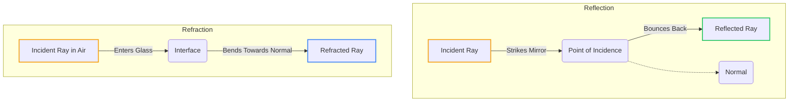
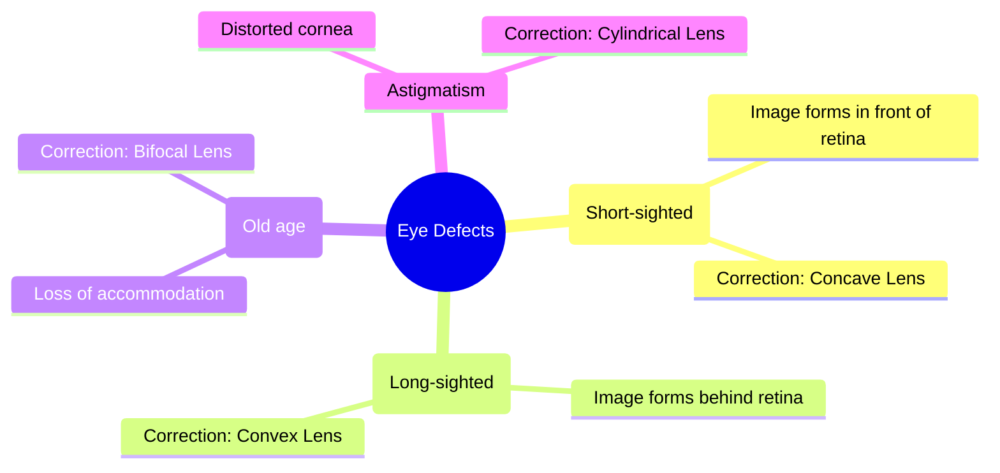
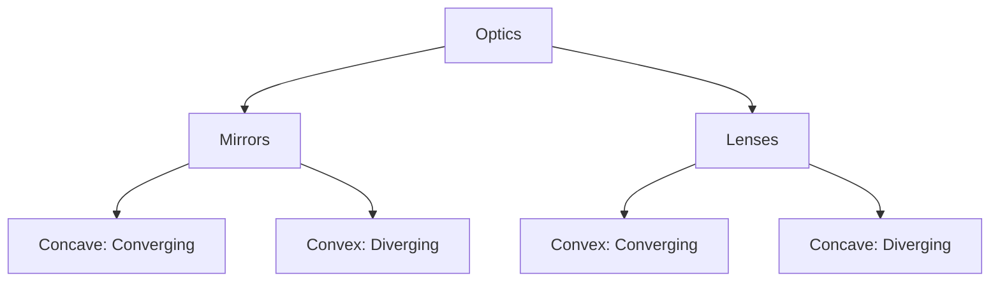

  <h3 style="color: var(--accent); margin-bottom: 16px; border-bottom: 1px solid var(--border); padding-bottom: 8px; display: flex; align-items: center; gap: 8px; font-weight: 600;">OPTICS</h3>
  <h4 style="border-left: 3px solid var(--info); padding-left: 8px; margin-top: 24px; margin-bottom: 10px; color: var(--text-primary); font-weight: 600;">DEEP CONCEPTUAL EXPLANATION</h4>

OPTICS LIGHT • Focal length of plane mirror is infinity i.e. power of the plane mirror is zero.

• Linear magnification produced by plane mirror is 1.

• When two plane mirrors are kept facing each other at an angle θ and an object is placed between them, then (i) Number of images, n = ° − If 360° , is even or object lies symmetrically.

It is the radiation which makes our eyes able to see the object. Its speed is 3 m/s in vacuum.

• Light is the form of energy. It is a transverse wave and it takes 8 min 19 s to reach on the earth from the sun.

• The light reflected from the moon takes 1.28 s to reach the earth.

• It represents the phenomenon of reflection, refraction, interference, diffraction, scattering and polarisation.

(ii) Number of images, n =   . If 360°   is odd or the object lies symmetrically. Reflection of Light Reflection is the phenomenon of change in the path of light without any change in its medium. In reflection, the frequency, speed and wavelength do not change, but a phase change may occur depending on the nature of reflecting surface. Normal Uses of the Plane Mirror (i) Plane mirrors are used as looking glass.

(ii) Plane mirrors are used in constructing periscope which is used in submarines. (iii) Plane mirror are used to make kaleidoscope. Spherical Mirrors Incident ray Reflected ray Spherical mirrors can be regarded as a part of a hollow reflecting spheres of glass. These are of two types (i) Concave mirror (ii) Convex mirror Mirror Point of incidence Reflection of Light Concave mirror The spherical mirror whose reflecting surface is inwardly leaned, called concave mirror. It is also called converging mirror.

Laws of Reflection Principal axis • The angle of reflection ( ∠r is always equal to the angle of incidence ( ∠i i.e. ∠= ∠ r. Pole Focus Centre of curvature • The incident ray, the reflected ray and the normal at the point of incidence all lie in the same plane. Concave mirror MIRROR Convex mirror The spherical mirror whose reflecting surface is outwardly leaned, called convex mirror. It is also called diverging mirror.

It is a polished surface (one side) like glass, which reflects almost all the light that is incident on it. There are two types of mirror Pole (P) Principal axis Plane Mirror Focus Centre of curvature Convex mirror Real Image If the reflecting surface of a mirror is plane, then the mirror is called a plane mirror.

• Size of image is always equal to the size of object.

• The minimum size of the mirror required to see the full image of an observer is half the height of the observer.

• If the plane mirror is rotated in the plane of incidence by an angle θ, then the reflected ray rotates by an angle 2θ.

• If the object is displaced by a distance x towards or away from the mirror, then its image will be displaced by a distance x towards or away from the mirror.

• Real images can be formed on a screen by the actual intersection of reflected (or refracted) light rays.

• The image formed on a cinema screen is a real image.

• A concave mirror forms real image, when an object is placed beyond its focus.

GENERAL SCIENCE Virtual Image (iii) When the object is between infinity and C The image formed is real, inverted and smaller in size and is formed between F and C. Concave mirror • Virtual images cannot be formed on the screen by the apparent intersection of reflected (or refracted) light rays. B′ A′ • The image of our face when we look into a plane mirror is a virtual image. A concave mirror forms a virtual image, when an object is placed between focus and pole of the mirror.

Object Image Position of object Position of image Size of image Nature of image (iv) When the object is at C The image formed is inverted, real, equal in size and is formed at C itself. At infinity At F Highly diminished Real and inverted Concave mirror Object Between infinity and C Between F and C Diminished -do- At C At C Same size -do- B' Between F and C Between infinity and C Enlarged -do- A′ At F At infinity Highly enlarged -do- Image Between F and P Behind the pole Enlarged Virtual and erect (v) When the object is between F and C The image is formed beyond C and is inverted, real and larger than the object. Concave mirror Position of object Position of image Size of image Nature of image Object At infinity At F Highly diminished Erect and virtual B′ Between infinity and pole Between F and P Diminished in size Erect and virtual A′ Image Formation by Concave Mirror (vi) When the object is at focus The image is formed at infinity. The image is real, inverted and infinitely large in size.

Concave mirror The following are the positions and nature of the images formed in a concave mirror for different positions of the object (i) When the object is at infinity Image is formed at F. Concave mirror Object From infinity At infinity (vii) When the object is between F and P The images formed behind the pole. The image is virtual, erect and large. Image B′ (ii) When the rays are parallel to the principal axis The image is formed at F.

Object Image Concave mirror A′ From infinity Image Formation by Convex Mirror REFRACTION OF LIGHT (i) When the object is at infinity The image is formed at focus. Convex mirror When a ray of light passes from one medium to other, it bends from its path. This phenomenon of bending of light is called as refraction of light. A′ B′ • When light passes from rarer medium to a denser medium, it bends towards the normal at the point of incidence.

Image Object at infinity • When light passes from a denser medium to a rarer medium, it bends away from the normal. (ii) When the object is between infinity and pole The image is formed between pole and focus. Convex mirror • When a ray of light enters from one medium to other medium its frequency and phase do not change but wavelength and velocity change.

Laws of Refraction A′ • The incident ray, the refracted ray and the normal at the point of incidence all lie in the same plane. Object Image B′ • The ratio of the sine of the angle of incidence to the sine of the angle of refraction is a constant for a given medium. MIRROR FORMULA sin sin = µ [Snell’s law] • If v is the image distance, u is the object distance and f where, µ is refractive index of the second medium with respect to first.

is the focal length of a mirror, then 1 c /v c /v • The linear magnification (m) produced by a mirror is equal to the ratio of the image distance to the object µ = v or 1µ 2 = v distance with negative sign, m = − where, v1 is speed of light in first medium and v2 is speed of light in second medium. Some Illustrations of Refraction • If the magnification has positive sign, then the image is virtual and erect.

• If the magnification has negative sign, then the image is real and inverted.

Uses of Spherical Mirrors Concave Mirrors • These are used as reflectors in automobiles (car, buses, etc.), head light, search light, hand torches and table lamps.

• Twinkling of stars.

• Oval shape of sun in the morning and evening.

• Bending of a linear object when it is partially dipped in a liquid inclined to the surface of the liquid.

• A fish in a pond when viewed from air appears to be at a smaller depth than actual depth.

• A coin at the base of a vessel filled with water appears raised.

TOTAL INTERNAL REFLECTION • These are used as shaving mirrors.

• These are used by doctors for focussing intense light to examine inside of eye, ears, etc.

• Large concave mirrors are used in the application of solar energy, to focus the sun’s rays for heating solar furnaces etc.

In case of propagation of light from denser to rarer medium through a plane boundary. Critical angle is the angle of incidence for which angle of refraction is 90°. Convex Mirrors • These are used as rear-view mirrors in automobiles as they give large view of the traffic.

• Big convex mirrors are used as shop security mirrors.

• These are used wherever we want to see erect images.

• If light is propagating from denser medium towards the rarer medium and angle of incidence is more than critical angle, then the light incident on the boundary is reflected back in the denser medium, obeying the law of reflection. This phenomenon is called total internal reflection.

² Note We cannot use a concave mirror as a rear-view mirror in motor vehicles. GENERAL SCIENCE • Conditions of Total Internal Reflection – Light must be propagating from denser to rarer medium. Position of object Position of image Size of image Nature of image – Angle of incidence must exceeds the critical angle.

At infinity At F2 Diminished Erect and virtual Between infinity and lens Between F2 and lens Diminished Erect and virtual • Sparkling of diamond, mirage and looming, shinning of air bubble in water and optical fibre are the examples of total internal reflection. ² Note Optical fibre is used for the transmitting and receiving the electrical signals after converting it into the light signal. Image Formation by a Convex Lens SPHERICAL LENSES (i) Object at infinity The image formed is at second focus, real, inverted and highly diminished.

Convex lens A lens is a piece of transparent glass bounded by two spherical surfaces. Parallel rays from top point of distant object F B A′ Image F1 Object at infinity There are two types of lenses (i) Convex lens (converging lens) A lens which is thicker at the centre and thinner at its ends. (ii) Concave lens (diverging lens) A lens which is thinner at the centre and thicker at its ends.

Principal axis Optical centre First focus F1 F1 F2 (ii) Object beyond 2F1 The image formed is between F2 and 2 2 F on the right side of the lens, real, inverted and diminished. Principal axis F2 Second focus Convex lens Optical centre Second focus Convex lens (a) First focus Concave lens (b) F2 B′ 2F2 F1 2F1 Object • The centre point of a lens is known as its optical centre. A′ Image • The line joining the centres of the surfaces of the lens is called the principal axis of the lens.

(iii) Object at 2 1F The image formed is at 2 2 F , real, inverted and of same size as that of the object.

• The distance of the first focus from the optical centre of the lens is called the first focal length of the lens.

Convex lens • The distance of the second focus from the optical centre of the lens is called the second focal length or the principal focal length. F2 2F2 B′ F1 Object F1 A′ Image Position of object Position of image Size of image Nature of image At infinity At F2 Highly diminished Real and inverted (iv) Object between F1 and 2 1F The image formed is beyond 2 2 F , real, inverted and magnified. Convex lens Beyond 2 1F Between F2 and 2 2F Diminished -do- At 2 1F At 2 2F Same size -do- 2F2 B′ Between 2 1F and F1 Beyond 2 F2 Enlarged -do- F2 2F1 At F1 At infinity Highly enlarged -do- F1 Object Enlarged Virtual and erect Between F1 and lens Behind the object, on the same side of the object 2f A′ Image (v) Object at F1 The image formed is real, inverted, and highly enlarged at infinity.

Convex lens • If m is the total magnification of two lenses in contact having magnification m1 and m2, then • Power (P) of a lens is the reciprocal of focal length of lens F2 i.e. = 1 F1 Object SI unit of power is dioptre (D).

• If two or more lenses are combined, then – there is an increase in the magnification of image.

– the final image is erect.

– the spherical aberration is reduced.

(vi) Object between F1 and O The image formed is behind the object, virtual, erect and enlarged. A′ Convex lens • If P is power of two lenses in contact having powers P1 and P2, then 2 or F2 Object F1 B′ Object • If two lenses of equal focal length but of opposite nature are in contact, then combination will behaves as a plane glass plate and f = ∞ Image Formation by a Concave Lens (i) Object at infinity The image formed is at F2, erect, virtual and diminished. Concave lens F2 Image Object at infinity ² Note When lens is dipped in a liquid of higher refractive index the focal length increases and convex lens behaves as concave lens and vice-versa.

An air bubble trapped in water or glass appears as convex but behaves as concave lens. Properties of Light Dispersion of Light Sir Isaac Newton observed that when a narrow beam of light is incident on a prism, the emergent beam is not only deviated but at the same time splits up into a coloured band of seven colours. This phenomenon is called dispersion of light. (ii) Object anywhere between infinity and lens The image formed is between F2 and lens, erect, virtual and diminished.

• The seven colours of band are Violet, Indigo, Blue, Green, Yellow, Orange and Red (can be memorised as VIBGYOR).

Concave lens • The colour of an object is determined by the colour of the light reflected by it. A′ • Violet colour deviates through maximum angle and red colour deviates through the minimum angle. F2 B′ Image Image • Rainbow is formed due to the dispersion of light suffering refractions and total internal reflection in the droplets present in the atmosphere.

LENS FORMULA Primary Colours Red, green and blue are called primary colours or basic colours.

• If v is the image distance, u is the object distance and f is the focal length of a lens, then = Size of image Size of object Magnification, = I Mixing of Colours Red + Green + Blue = White Red + Blue = Magenta Blue + Green = Peacock blue (or Cyan) Red + Green = Yellow • If the magnification m has a positive value, the image is virtual and erect. And if the magnification m has a negative value the image will be real and inverted.

GENERAL SCIENCE HUMAN EYE Human eye is an optical instrument which forms real image of the objects.

• The ability of an eye to focus the distant objects as well as the nearby objects on the retina by changing the focal length of its lens is called accommodation.

• Least distance of distinct vision is 25 cm.

• Far point of normal eye is at infinity.

• Magenta, Cyan and Yellow, etc., are called secondary colours.

• A rose appears red, when day light falls on it because it absorbs all the constituent colour of white light except red which it reflects to us.

• If all the colours of white light are reflected back from the object, then it appears white.

• If all the colours of white light are absorbed by the object, then it appears black.

• The natural colours of transparent objects are due to their selective transmission of light.

Scattering of Light Defect of Human Eye The ability to see is called vision. The defects of vision are known as defects of eye. There are following defects of human eye • When sunlight passes through the earth’s atmosphere, much of the light is absorbed by the fine dust particles and air molecules in the atmosphere which give out the absorbed light in some other direction. This is scattering of light.

• The scattering of light by particle in its path is called Tyndall effect.

• The blue coloured light present in white sunlight is scattered much more easily by air molecules causes the blue colour of the sky.

• The sun and the surrounding sky appear red at sunrise and at sunset because at that time most of blue colour present in sunlight has been scattered out and away from our line of sight, leaving behind mainly red colour in the direct sunlight beam that reaches our eyes.

• Myopia A person suffering from myopia can see the near objects clearly while far objects are not clear; concave lens is used to remove it. The defect of eye called myopia is caused (i) due to high converging power of eye lens or (ii) due to eye ball being too long.

• Hypermetropia A person suffering from hypermetropia can see the distant objects clearly but not the near objects. Convex lens is used to remove it.

The defect of eye called hypermetropia is caused (i) due to low converging power of eye lens or (ii) due to eye ball being too short.

• Presbyopia In the old age, the power of accomodation of the eye is so much lost that a person can neither see the near objects distinctly nor the distant objects. To correct this defect bifocal lens is used.

• Astigmatism In this defect, a person cannot distantly see the horizontal and vertical lines, simultaneously at a normal distance. To correct this defect, cylindrical lens is used.

• Dangers signals are of red colour because red colour of light scatter least and therefore signals can be see from far.

• If the earth had no atmosphere, there would have been no scattering of sunlight at all. In that case, no light from the sky would have entered our eyes and the sky would have looked dark and black to us.

• Cataract In this defect, an opaque, white membrane is developed on cornea due to which a person losses power of vision partially or completely. This defect can be removed by removing this membrane through surgery.

² Note Colour blindness is a genetic disorder which occurs by inheritance. John Dalton was colour blind. Optical Magnifying Instruments Microscope Interference of Light When two waves of exactly same frequency travels in a medium, in the same direction simultaneously, then due to their superposition at same points, intensity of light is maximum while at some other points intensity is minimum. This phenomenon is called interference of light.

• Thin layer of oil on water surface and soap bubbles show various colours in white light due to interference of waves reflected from the two surfaces of the film.

• Polarisation is the only phenomenon which proves that light is a transverse wave.

A microscope is an instrument used to see objects that are too small for the naked eye.

• A simple microscope consists of a convex lens of small focal length.

• It is used to see the details of very small objects.

• The magnifying power of a simple microscope is given by   is least distance of distinct vision.

• For compound microscope m , where mo is magnification of objective lens and me is magnification of eye-piece.

Diffraction of Light If an opaque obstacle is kept between a source of light and a screen, a sufficiently distinct shadow is obtained on the screen. This shows that light which travels the obstacle is small. There is a departure from straight line propagation and so the light bends round the corners of obstacle and enters in the geometrical shadow. This bending of the light is called diffraction. Telescope • Magnifying power of telescope, m where fo • Telescope is an optical instrument which is used for observing distinct images of heavenly bodies like stars, planets, etc., when the final image is formed at infinity. is focal length of objective of the telescope and where fe is focal length of eye-piece of the telescope.

• There are two types of telescopes – Astronomical telescope (invented by Kepler in 1611) – Galilean telescope (invented by Galileo in 1609) • Length of telescope tube in astronomical telescope is In Galilean telescope the length of telescope, • In an astronomical telescope, the objective lens is a convex lens of large focal length but eye-piece is a convex lens of short focal length.

² Note Periscope consists of two plane mirrors inclined at an angle of 45°. The principle of working of periscope is based upon reflection and refraction.

• In Galilean telescope, the objective lens is a convex lens of large focal length but the eye-piece is a concave lens of short focal length.

ELECTRIC CURRENT Electric Field ELECTRIC CHARGE The region around an electric charge in which its effect can be experienced is called the electric field. Charge is the basic property associated with matter due to which it produces and experience electrical and magnetic effects. The SI unit of electric charge is Coulomb. Electric field intensity (E ) = Electric Potential • Positively charged particles called protons and negatively charged particles called electrons. A proton possesses a positive charge of 1 6 10 19 . × −C, whereas, an electron possesses a negative charge of 1 6 10 19 . × −C.

The electric potential at a point in an electric field is the work done in bringing a unit positive charge from infinity to that point.

• Similar charges repel each other and opposite charges attract each other.

Conservation of Charges • Electric potential = Work done Charge . Its SI unit is volt (V). When two or more charged bodies come in contact, then total charge on all the bodies are conserved.

• Conductors are those substances which allow passage of electrical charges to flow through them and have very low electrical resistance e.g. copper, aluminium, gold, silver, etc.

• Human body and earth act like a conductor. Silver is the best conductor.

• Charges are always distributed on the surface of the conductor.

• Resistors offer high resistance to the flow of current through them e.g. eureka, nichrome, etc.

• Potential difference ( between two points A and B is the work done in bringing a unit charge from point B to point A.

• Potential difference is a scalar quantity and is measured by means of voltmeter (a high resistance device).

• The electric potential inside a spherical surface is same at each point and is equal to the potential on the surface.

• Electrical potential on earth is considered to be zero.

• A voltmeter connected in parallel with conductor to measure the potential difference across its ends.

• Voltage is the other name for potential difference.

Electric Current • Insulators have infinite resistance and do not allow the passage of current. e.g. rubber, glass, ebonite, etc.

• The rate of flow of electric charges through any cross-section of conductor is called electric current.

• The direction of positive charges is same as direction of conventional current.

² Note The presence of free electrons in a substance makes it a conductor. Coulomb’s Law Current Charge Time ⇒I • The SI unit of electric current is ampere.

• The force of attraction or the force of repulsion acting between the two point charges is proportional to the product of the magnitudes of the two charges and inversely proportional to the square of the distance between them i.e. F q q • Current is measured by an instrument called ammeter.

• An ammeter is connected in series with the conductor to measure the current passing through it.

1 2 πε

## Visual Summary & Diagrams

### Reflection and Refraction Ray Diagrams

## Visual Summary: Light & Optics

### Human Eye Defects

### Lenses & Mirrors

