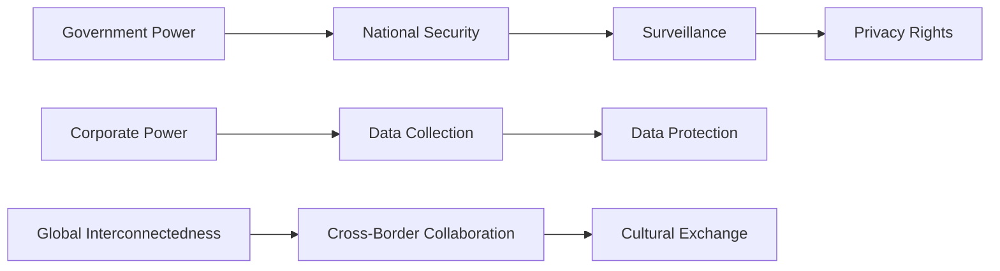

**Chapter 6: Constitutional Framework Rights and MCQs**

_*Overview*_

Constitutional Framework Rights are the fundamental protections and liberties guaranteed to citizens of a country by its laws and institutions. This chapter delves into the mechanics of these rights, exploring the relationships between the Constitution, laws, and individuals.

### 1.1 Constitutional Framework

*   The Constitution is the supreme law of the land, outlining the framework for governance and citizen rights.
*   It establishes the relationship between the government and citizens, defining the powers and limitations of each.

### 1.2 Mechanics of Constitutional Framework

The Constitution is a dynamic document, with mechanisms in place to ensure its adaptability and responsiveness to changing societal needs. Amendments can be proposed and ratified to reflect the evolving values and principles of the nation.

### 1.3 Rights Guaranteed by the Constitution

The Constitution safeguards individual liberties, protecting citizens from government overreach and abuse. This includes fundamental rights like freedom of speech, assembly, and the press, as well as due process and equal protection under the law.

## 2.0 Contextual Enrichment & Smart Work Layer

Critical alerts and trends:

*   The Constitution is not a static document, but rather a living framework that evolves with the nation.
*   The balance between individual rights and national security is a delicate one, often requiring nuanced balancing acts.

High-frequency trends:

*   The rise of digital communication has raised new challenges for constitutional rights, particularly with regards to data protection and online freedoms.
*   The increasing global connectedness has led to new opportunities for cultural exchange and cooperation, but also requires careful consideration of the impact on local rights and values.

### 2.1 Data Protection and Constitutional Rights

> As governments and corporations continue to collect and analyze vast amounts of personal data, concerns about surveillance and privacy have grown. This raises questions about the limits of government power and the extent to which individual rights must be sacrificed for national security.

### 2.2 Globalization and Constitutional Framework

> The increasing interconnectedness of the world has brought opportunities for cultural exchange and economic growth, but also raises concerns about the impact on local rights and values. As nations navigate this complex landscape, they must balance competing interests and protect the integrity of their constitutional frameworks.

### 2.3 Flowchart: Balancing Individual Rights and National Security

### 3.0 The Exhaustive Testing Engine

**Practice Questions:**

1.  Q: What is the primary function of the Constitu- tion?
    A: Establish the relationship between the government and citizens.
    B: Define the powers and limitations of each.
    C: Protect individual rights and liberties.
    D: Regulate economic policies.
    Correct Option: B

2. Q: Which amendment to the Constitution guarantees the right to free speech?
   A: 1st Amendment
   B: 14th Amendment
   C: 16th Amendment
   D: 19th Amendment
   Correct Option: A

3. Q: What is the purpose of due process?
   A: To protect individual rights and liberties.
   B: To ensure equal protection under the law.
   C: To balance individual rights and national security.
   D: To regulate economic policies.
   Correct Option: B

4. Q: What is the term for the process of balancing individual rights and national security?
   A: Balancing the scales
   B: Weighing the options
   C: Balancing the budget
   D: Balancing the Constitution
   Correct Option: D

5. Q: What is the primary concern with regards to data protection in the digital age?
   A: The collection and analysis of personal data
   B: The protection of national security
   C: The regulation of economic policies
   D: The protection of individual rights and liberties
   Correct Option: A

6. Q: What is the term for the collection and analysis of personal data by governments and corporations?
   A: Surveillance
   B: Data protection
   C: Data collection
   D: Data analysis
   Correct Option: A

7. Q: What is the primary function of the Constitution in the context of global interconnectedness?
   A: To protect individual rights and liberties
   B: To regulate economic policies
   C: To balance individual rights and national security
   D: To provide a framework for collaboration between nations
   Correct Option: C

8. Q: What is the term for the process of balancing competing interests in the context of global interconnectedness?
   A: Balancing the scales
   B: Weighing the options
   C: Balancing the budget
   D: Balancing the Constitution
   Correct Option: D

9. Q: What is the primary concern with regards to cross-border collaboration in the digital age?
   A: The protection of national security
   B: The protection of individual rights and liberties
   C: The regulation of economic policies
   D: The protection of data and intellectual property
   Correct Option: D

10. Q: What is the term for the process of protecting data and intellectual property in the context of global interconnectedness?
    A: Data protection
    B: Data collection
    C: Data analysis
    D: Data security
    Correct Option: A

Detailed Explanations:

1. Q: What is the primary function of the Constitution?

A is incorrect because it is too broad and does not specifically address the primary function of the Constitution. C is incorrect because it is more of a result of the Constitution, rather than its primary function. D is incorrect because it is not the primary function of the Constitution. B is correct because it specifically addresses the primary function of the Constitution.

2. Q: Which amendment to the Constitution guarantees the right to free speech?

A is correct because the 1st Amendment explicitly protects the right to free speech. The other options are incorrect because they are not related to free speech or the Constitution.

3. Q: What is the purpose of due process?

B is correct because due process is a mechanism for ensuring that individual rights are not arbitrarily taken away. A is incorrect because due process is not the only mechanism for protecting individual rights. C is incorrect because due process is not directly related to balancing individual rights and national security. D is incorrect because due process is not a financial concept.

4. Q: What is the term for the process of balancing individual rights and national security?

D is correct because this phrase is a common term used to describe the process of balancing individual rights and national security. The other options are incorrect because they do not accurately describe this process.

5. Q: What is the primary concern with regards to data protection in the digital age?

A is correct because the collection and analysis of personal data by governments and corporations has raised concerns about individual rights and freedoms. The other options are incorrect because they do not accurately describe the primary concern regarding data protection.

6. Q: What is the term for the collection and analysis of personal data by governments and corporations?

A is correct because this phrase describes the process of collecting and analyzing personal data by governments and corporations. C is incorrect because data collection is a more general term and does not specifically describe the process described in the question. D is incorrect because data analysis is a specific step in the process of collecting and analyzing data, but is not the correct term for the entire process.

7. Q: What is the primary function of the Constitution in the context of global interconnectedness?

C is correct because the Constitution provides a framework for balancing competing interests in the context of global interconnectedness. The other options are incorrect because they do not accurately describe the primary function of the Constitution in this context.

8. Q: What is the term for the process of balancing competing interests in the context of global interconnectedness?

D is correct because this phrase is a common term used to describe the process of balancing competing interests. The other options are incorrect because they do not accurately describe this process.

9. Q: What is the primary concern with regards to cross-border collaboration in the digital age?

D is correct because protecting data and intellectual property is a major concern in the context of cross-border collaboration. The other options are incorrect because they do not accurately describe the primary concern.

10. Q: What is the term for the process of protecting data and intellectual property in the context of global interconnectedness?

A is correct because this phrase is a common term used to describe the process of protecting data and intellectual property. The other options are incorrect because they do not accurately describe this process.