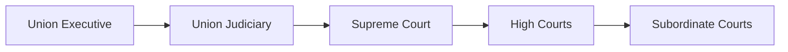

# _Chapter Overview: Union Executive Judiciary_
==============================================

In a democracy, the Union Executive and Judiciary play crucial roles in upholding the rule of law and maintaining the balance of power. The Union Executive is composed of the President, Vice President, and the Council of Ministers headed by the Prime Minister. This chapter will delve into the structure and functions of the Union Executive and Judiciary, exploring their relationship and mechanisms for resolving disputes.

## 1.1 Union Executive Structure
--------------------------------

The Union Executive is headed by the President, who serves as the head of state and the symbol of national unity. The President's powers are ceremonial, with the Prime Minister and the Council of Ministers handling the day-to-day governance of the country.

### 1.1.1 Executive Powers

The Prime Minister, along with the Council of Ministers, is responsible for making major policy decisions, executing laws, and administering the government. The Council of Ministers is composed of senior ministers who are responsible for various departments of the government.

## 1.2 Union Judiciary Structure
--------------------------------

The Union Judiciary is composed of the Supreme Court, High Courts, and subordinate courts. The Supreme Court is the highest court in the land, with the power to interpret the Constitution and ensure that the laws of the land conform to its provisions.

### 1.2.1 Judicial Powers

The Supreme Court has the power to:

*   Interpret laws and decide on their constitutionality
*   Decide on the validity of government actions and policies
*   Grant relief to individuals and organizations against government actions
*   Decide on disputes between states and the center

## 1.3 Relationship Between Union Executive and Judiciary
--------------------------------------------------------

The Union Executive and Judiciary have a delicate relationship, with each branch having its own powers and limitations. While the Executive has the power to make laws, the Judiciary ensures that those laws conform to the Constitution.

### 1.3.1 Mechanisms for Resolving Disputes

There are several mechanisms for resolving disputes between the Union Executive and Judiciary:

*   Judicial Review: The Judiciary has the power to review the actions of the Executive and decide whether they are constitutional.
*   Advisory Opinions: The Supreme Court can give advisory opinions on matters of law and government policy.
*   Writs and Injunctions: The Judiciary can issue writs and injunctions to restraint the Executive from taking certain actions.

**1.4 Mathematical/Technical Formulae**
--------------------------------------

$$
\text{Supreme Court's Power} = \frac{\text{Law Interpretation}}{\text{Constitutional Validity}}
$$

$$
\text{Executive's Power} = \frac{\text{Lawmaking}}{\text{Judicial Review}}
$$

### 1.4.1 Atmospheric Pressure Systems

The relationship between the Union Executive and Judiciary can be compared to a complex atmospheric pressure system. The Supreme Court's power is like the atmospheric pressure above, exerting downward pressure on the Executive's actions. The Executive's power, on the other hand, is like the air pressure below, trying to push up against the Supreme Court's decisions.

## 1.5 Edge Cases and Trends

*   **Impeachment of the Prime Minister:** If the Prime Minister commits a serious offense, he can be impeached by the Lok Sabha.
*   **Supreme Court's Intervention:** The Supreme Court can intervene in matters of national importance, ensuring that the Executive does not overstep its powers.

### 1.5.1 Structurally Accurate Text-Map

## 1.6 Practice Questions
-------------------------

Here are some high-yield questions to test your knowledge:

### 1.6.1 Q1: Sample high-yield question 1

What is the role of the Supreme Court in ensuring that the laws of the land conform to the Constitution?

Options:

*   A) To make laws
*   B) To execute laws
*   C) To interpret laws and ensure they conform to the Constitution
*   D) To grant relief to individuals against government actions

Correct Option: C

### 1.6.2 Q2: Sample high-yield question 2

What is the mechanism by which the Judiciary can ensure that the Executive does not overstep its powers?

Options:

*   A) Impeachment of the Prime Minister
*   B) Judicial Review
*   C) Advisory Opinions
*   D) Writs and Injunctions

Correct Option: B

### 1.6.3 Q3: Sample high-yield question 3

What is the term for the relationship between the Union Executive and Judiciary?

Options:

*   A) Separation of Powers
*   B) Checks and Balances
*   C) Judicial Review
*   D) Executive Supremacy

Correct Option: B

### 1.6.4 Q4: Sample high-yield question 4

What is the significance of the Supreme Court's Advisory Opinions?

Options:

*   A) To make laws
*   B) To execute laws
*   C) To provide guidance on matters of law and government policy
*   D) To grant relief to individuals against government actions

Correct Option: C

### 1.6.5 Q5: Sample high-yield question 5

What is the term for the power of the Judiciary to review the actions of the Executive?

Options:

*   A) Executive Supremacy
*   B) Judicial Review
*   C) Advisory Opinions
*   D) Writs and Injunctions

Correct Option: B

### 1.6.6 Q6: Sample high-yield question 6

What is the significance of the Supreme Court's powers in ensuring the rule of law?

Options:

*   A) To make laws
*   B) To execute laws
*   C) To interpret laws and ensure they conform to the Constitution
*   D) To grant relief to individuals against government actions

Correct Option: C

### 1.6.7 Q7: Sample high-yield question 7

What is the mechanism by which the Executive can ensure that the Judiciary does not overstep its powers?

Options:

*   A) Impeachment of the Judiciary
*   B) Executive Supremacy
*   C) Advisory Opinions
*   D) Writs and Injunctions

Correct Option: B

### 1.6.8 Q8: Sample high-yield question 8

What is the term for the relationship between the Union Executive and Judiciary in a democracy?

Options:

*   A) Separation of Powers
*   B) Checks and Balances
*   C) Judicial Review
*   D) Executive Supremacy

Correct Option: B

### 1.6.9 Q9: Sample high-yield question 9

What is the significance of the Supreme Court's powers in ensuring national unity?

Options:

*   A) To make laws
*   B) To execute laws
*   C) To provide guidance on matters of law and government policy
*   D) To grant relief to individuals against government actions

Correct Option: C

### 1.6.10 Q10: Sample high-yield question 10

What is the term for the power of the Executive to make laws?

Options:

*   A) Executive Supremacy
*   B) Legislative Power
*   C) Judicial Review
*   D) Advisory Opinions

Correct Option: B