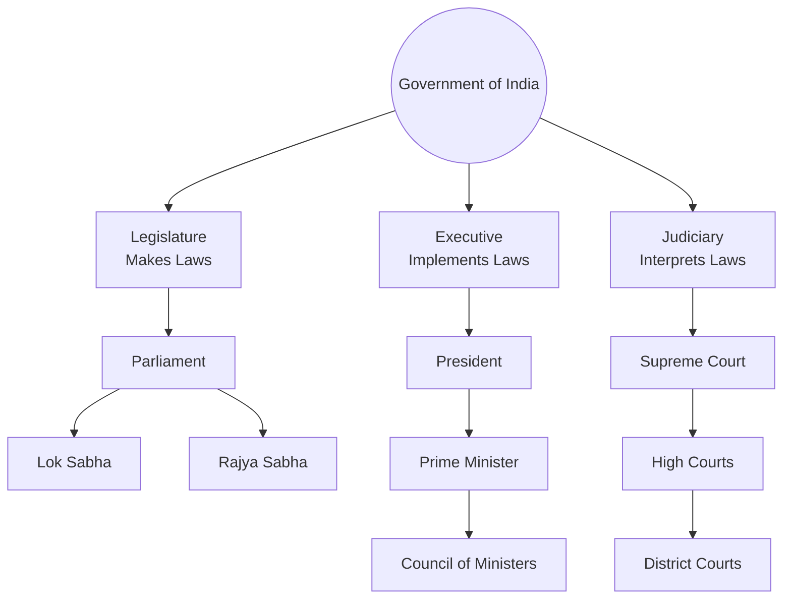
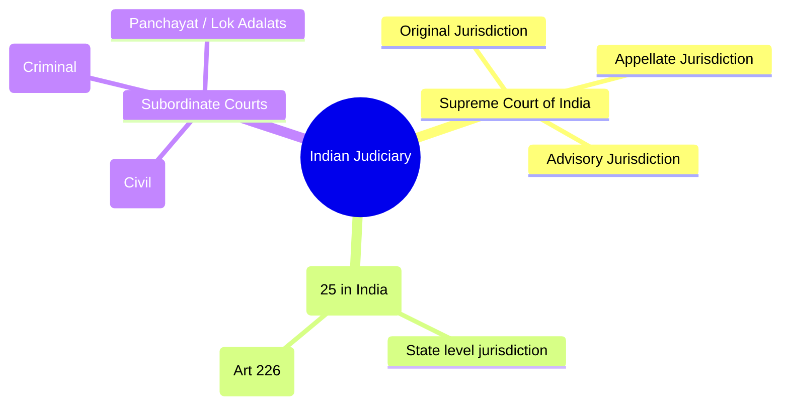

<div class="revision-card" style="background: rgba(20,20,30,0.4); border: 1px solid var(--border); border-radius: 8px; padding: 20px; margin-bottom: 24px; box-shadow: 0 4px 12px rgba(0,0,0,0.25);">
  <h3 style="color: var(--accent); margin-bottom: 16px; border-bottom: 1px solid var(--border); padding-bottom: 8px; display: flex; align-items: center; gap: 8px; font-weight: 600;">UNION EXECUTIVE JUDICIARY AND MCQS</h3>
  <h4 style="border-left: 3px solid var(--info); padding-left: 8px; margin-top: 24px; margin-bottom: 10px; color: var(--text-primary); font-weight: 600;">DEEP CONCEPTUAL EXPLANATION</h4>

State Public Service Commission (SPSC) • 13th Finance Commission, headed by Vijay Kelkar, submitted its report for the period 2010-15. Finance Commission, headed by YV Reddy, has been appointed. Its report will apply for the period 2015-20.

• Parallel to UPSC at the Centre, there is a SPSC in a state. It consists of a chairman and other members appointed by the Governor of the State.

• The 14th Finance Commission has been specifically asked to recommend how non-priority PSUs be relinquished, besides its other constitutional duties.

• The chairman and members of the Commission hold office for a term of six years or until they attain the age of 62 years, whichever is earlier.

National Commission for Scheduled Castes Functions It is duty of the Finance Commission to make recommendations to the President as to :

• The National Commission for Scheduled Castes (SCs) is a constitutional body in the sense that it is directly established by Article 338 of the Constitution.

• the distribution between the Union and States of net proceeds of the taxes which are divisible between the Union and the States.

• the principles which should govern the grants-in-aid of a revenue to the states out of Consolidated Funds of India.

• The main function of the Commission is to investigate and monitor all matters relating to the constitutional and other legal sageguards for the SCs and to evaluate their working.

• any other matter referred to the commission by the President in the interest of sound finance.

Comptroller and Auditor General of India • The Commission also has to investigate all matters relating to the constitutional and other legal safeguards for the OBCs and the Anglo-Indian Community and report to the President upon their working. He is appointed by the President for control and audit of public accounts. He does not hold his office till the pleasure of the President. He is not eligible for further office.

• They are appointed by the President by warrant under his hand and seal. Their conditions of service and tenure of office are also determined by the President.

Functions His main functions are as follows :

• The Commission presents an annual report to the President. It can also submit a report as and when it thinks necessary.

• He audits the account related to all expenditure from consolidated and contingency fund of India, each state and UT’s having a Legislative Assembly.

National Commission for Scheduled Tribes • He acts as a guide, friend and philosopher of the Public Account Committee of the Parliament.

• The National Commission for Scheduled Tribes (STs) is a constitutional body in the sense that it is directly established by Article 338-A of the Constitution.

• To keep a vigilant watch on the finance of Union and the States.

• To submit periodic reports to the President and Governors of State for consideration of Parliament and State Legislature.

• The 89th Constitutional Amendment Act of 2003 bifurcated and combined National Commission for SCs and STs into two separates bodies namely; National Commission for Scheduled Castes (under Article 338) and National Commission for Scheduled Tribes (under Article 338-A).

• To see that the amount voted by the legislature are spent under appropriate heads and they are not exceeded.

• The main function of the Commission is to investigate and monitor all matters relating to the constitutional and other legal safeguards for the STs and to evaluate their working.

Finance Commission (Article 280) Non-Constitutional Bodies Non-Constitutional bodies are the bodies that are established either by an executive resolution of the Government of India or by a legislation enacted by the Parliament or even by any official Gazette notification issued by the Central Government. Composition • Under Article 280 of the Constitution, provision has been made for the Constitution of a Finance Commission within two years of the commencement of the Constitution and thereafter on the expiry of 5th year. It consists of a Chairman and four other members appointed by the President. Planning Commission The Planning Commission was an institution in the Government of India, which formulated India’s Five-Year Plans. The Government has replaced Planning Commission with a new institution named NITI Aayog (National Institution for Transforming India).

GENERAL STUDIES Salient Features of Lokpal and Lokayuktas Act National Development Council • It is the open body for decision making and deliberation on development matters in India presided over by Prime Minister.

• Lokpal bill consist of a chairperson and a maximum of eight members of which 50% shall be judicial members. 50% of members of Lokpal shall be from SC/ST/OBCs, minorities and women.

• The council comprises the Prime Minister, the Union Cabinet Ministers, Chief Ministers of all States, Representation of the Union Territories and members of the planning commission.

• It is an extra-constitutional and non-statutory body. It is the listed as an advisory body to planning commission but its advice is not binding.

NITI Aayog • The selection of chairperson and members of Lokpal shall be through a selection committee consist of 1. Prime Minister 2. Speaker of Lok Sabha 3. Leader of opposition in Lok Sabha 4. Chief Justice of India or a sitting Judge of Supreme Court nominated by CJI.

5. Eminent jurist on the basis of recommendations of the first four members of the selection committee. Prime Minister has been brought under the purview of the Lokpal.

• The institution will serve as ‘Think Tank’ of the Government, a directional and policy dynamo.

National Human Rights Commission • NITI Aayog will provide governments and the central and state levels with relevant strategic and technical advice across the spectrum of key elements of policy. This includes matters of national and international important PM is the ex-officio chairman of NITI Aayog. Functions of NITI Aayog • The National Human Rights Commission is a statutory body. It was established in 1993 under a legislation enacted by the Parliament. The Commission is a multi-member body consisting of a chairman and four members. The chairman should be retired chief justice of India. In case State Human Rights Commission, the chairperson should be a retired Chief Justice of a High Court.

• To foster cooperative federalism through structured support initiatives and mechanisms with the states on a continuous basis, recognising that strong states make a strong nation.

• The chairman and members hold office for a term of 5 years or until they attain the age of 70 years, whichever is earlier. After their tenure, the chairman and members are not eligible for further employment under the Central or a State Government.

• To develop mechanisms to formulate credible plans at the village level and aggregate these progressively at higher levels of government.

National Commission for Minorities (NCM) • The Union Government set-up the National Commission for Minorities under the National Commission for Minorities Act, 1992. Six religious communities namely; Muslims, Christians, Sikhs, Buddhists, Parsis and Jains have been notified as minority communities by the Union Government.

• To ensure, on areas that are specifically referred to it, that the interest of national security are incorporated in economic strategy and policy. To pay special attention to the sections of our society that may be at risk of not benefitting adequately from economic progress.

• The Commission has one Chairperson and five Members represented five minority communities. The Commission consists of President, a Vice-President and five other members from minorities group.

• To provide advice and encourage partnerships between key stakeholders and national and international like-minded Think Tanks, as well as educational and policy research institutions.

CENTRE-STATE RELATION State Finance Commission There is a provision of State Finance Commission to review the financial position of Panchayats and recommended grant-in-aid. It shall make the following recommendation to the governor. The Constitution of India, being federal in structure, divides all powers (legislative, executive and financial) between the centre and the states. The centre-state relations can be studied under three heads, which are as follow i. Legislative relations ii. Administrative relations iii. Financial relations It deals with the relations between union and states. The centres and states are an essential feature of federalism.

Lokpal and Lokayuktas The Lokpal and Lokayuktas Act, 2013 was made by the Parliament to provide for the establishment of body of Lokpal for the Union and Lokayukta for state to inquire into allegations of corruptions against certain public functionaries and for matters concerning them. Legislative Relations • The Constitution divides the subjects into the Union List (100 subjects), the State List (61 subjects) and the Concurrent List (52 subjects). Enumerated in the Seventh Schedule under Article 246. Parliament has exclusive power to legislate on subjects mentioned in the Union List. This list contains subjects like defence, foreign affairs, atomic energy etc. Western Zonal Council Maharashtra, Goa, Gujarat and UTs of Dadra and Nagar Haveli and Daman Diu. Headquarter Mumbai Southern Zonal Council Andhra Pradesh, Tamil Nadu, Karnataka, Kerala and UT of Puducherry. Headquarter Chennai North-Eastern Council It was created in 1971 by a separate Act of Parliament for Assam, Manipur, Tripura, Meghalaya, Nagaland, Mizoram and Arunachal Pradesh.

In 1994, Sikkim was included in it.

The issues in centre-state relations have been under consideration. Time to time government appoints commission for betterment of the relation.

• State legislatures have exclusive power to legislate on subjects mentioned in the State List. The State List contains subjects like health, sanitation, public order, agriculture etc. Both Parliament and State Legislatures can legislate on subjects mentioned in the Concurrent List. This list contains subjects like criminal law, forests, education, marriage and divorce etc.

SARKARIA COMMISSION • Residual Powers (i.e. subjects not included in any of the list) rest with Union Government. It was set-up in June, 1983, by the Central Government of India to examine the relationship and balance of power between states and centre. It was headed by Justice Rajinder Singh Sarkaria, a retired Judge of the Supreme Court of India. PUNCHHI COMMISSION In April, 2007, a new commission was set-up to re-examine centre-state relations. The commission was headed by former Chief Justice of India MM Punchhi.

Administrative Relations The states are expected to comply with the Laws of the Parliament and not impede the exercise of the Executive Powers of the Union (Articles 256 and 257). In this regard, the Union Government can issue necessary directives to the states. All disputes between states regarding the use, distribution or control of water are decided by the centre (Article 262). Inter-State Council Financial Relations • The states are greatly dependent on the Central Government for finance. The State Governments have been provided independent sources of revenue, but these are inadequate.

• Inter-State Council serves a purposeful mechanism to bring various autonomous executive agencies of the state machinery, both the union and the states, and coordinate amongst them the ways and means of execution and implementation of policies concerning common interests, both regional as well as national.

• The Union Government has the power to borrow from within India or outside, subject to the limits laid down by the Parliament, the borrowing power of the states is subject to several limitations and the cannot borrow from outside India.

• Although a provision was made in the Constitution under Article 262 for the formation of such Inter-State Council, it was not until 1990, a formal Inter-State Council was established.

Zonal Councils • This measure was taken after the Sakaria Commission pitched for the formation of such a council. Types of Emergency The President is empowered to promulgate three kinds of emergencies which are as follows : Six zonal councils have been established to discuss and advise on matters of common interest. The Union Home Minister has been nominated to be the common Chairman of all Zonal Councils. Set-up under State Reorganisation Act, 1956.

Northern Zonal Council Consist of Punjab, Rajasthan, Haryana, Jammu and Kashmir, Himachal Pradesh, Chandigarh and Delhi. Headquarter New Delhi Central Zonal Council Uttar Pradesh, Uttarakhand, Chhattisgarh and Madhya Pradesh. Headquarter Allahabad Eastern Zonal Council Bihar, Jharkhand, West Bengal and Odisha. Headquarter Kolkata i. On the ground of threat to the security of India or of any part of the territory by war or an external aggression or an armed rebellion (Article 352) known as National Emergency. ii. On the ground of the failure of the constitutional machinery in a state. (Article 356) known as the President’s Rule or State Emergency.

iii. On the ground of threat to the financial stability or credit of India or any part of the territory (Article 360), known as Financial Emergency. GENERAL STUDIES National Emergency (Article 352) • The National Emergency and Financial Emergency have no time limit. They can continue to be extended without any limit. But the State emergency has a time limit. It cannot go beyond 3 years. E-Governance • If the President is satisfied that a grave emergency exists whereby the security of India or any part of India is threatened, whether by a war or an external aggression or an armed rebellion, he/she may proclaim a state of emergency for the whole of India or part of the territory thereof.

• A proclamation of emergency can be made by the President, even before the actual occurrence of war or external aggression or armed rebellion, if he/she is satisfied that there is an imminent danger.

• When a national emergency is declared on the ground of ‘war’ or ‘external aggression’ it is known as External Emergency. On the other hand, when it is declared on the ground of ‘armed rebellion’ it is known as Internal Emergency.

The word electronic in the term e-Governance implies technology driven governance. e-Governance is the application of Information and Communication Technology (ICT) for delivering government services. e-Governance is basically a move toward SMART Governance i.e. Simple, Moral, Accountable, Responsive and Transparent Governance. There are four types of interactions in e-Governance 1. G2B : Government to Business 2. G2C : Government to Citizens 3. G2E : Government to Employees 4. G2G : Government to Government President’s Rule or State Emergency (Article 356) DIGITAL INDIA It is a flagship e-Governance programme of Government of India with a vision to transform India into a digitally empowered society and knowledge economy.

The focus is to bring transformation to realise • The President’s Rule can be proclaimed under Articles 355, 356 and 365. Article 355 says it shall be the duty of the union to protect every state against external aggression and internal disturbance and to ensure that the government of every state is carried on in accordance with the provisions of this Constitution. IT +IT IT (Indian Talent) (Information Technology) (India Tomorrow) • Article 356 says that if the President, on receipt of a report from the Governor of a State or otherwise, is satisfied that a situation has arisen in which the Government of the State cannot be carried on in accordance with the provisions of this Constitution, he/she may issue a proclamation.

• Article 365 administration says that whenever a state fails to comply with or give effect to any direction from the centre, it will be lawful for the President to hold that a situation has arisen in which the government of the state cannot be carried on in accordance with the provisions of the Constitution.

Financial Emergency (Article 360) Mission Mode Projects (MMPs) A Mission Mode Project (MMP) is an individual project within the National e-Governance Plan (NeGP) that focuses on one aspect of e-Governance, such as banking, land records or commercial taxes etc. Within NeGP, Mission Mode Project implies that projects have clearly defined objectives, scopes and implementation timelines and milestones, as well as measurable outcomes and service levels. NeGP comprises 31 Mission Mode Projects (MMPs), which are further classified as State, Central or Integrated Projects. Each State Government can also define five MMPs specific to its individual needs.

• Article 360 provides that if the President is satisfied that a situation has arisen whereby the financial stability of India or the credit of India or of any part of India is threatened, he/she may make a declaration to that effect.

Under such situation, the executive and legislative powers will go to the center. This article has never been invoked till date.

• The proclamation of Financial Emergency shall ordinarily remain in force for a period of 2 months.

However, it can continue to stay beyond 2 months if before the expiry of the 2 months period, the proclamation has been approved by both the Houses of the Parliament. E-Panchayat The Ministry of Panchayati Raj, Government of India has initiated e-Panchayat, a flagship project, computerisation of Gram Panchayats on a mission mode basis. After a detailed system study by NIC (National Informatics Centre), the department prioritised the applications to be automated for Gram Panchayats. The application areas are birth and death registrations, house tax assessment and demand collections and trade licences. The applications were developed and implemented in 475 Gram Panchayats identified by department. The software is web enabled and hosted on NIC central servers. The capacity building had been taken up at various levels by conducting State and District level workshops and the e-Panchayat project was initiated by Commissioner PR&RE in 2005.

• If, at the time of proclamation of Financial Emergency, the Lok Sabha stands dissolved, the proclamation needs to be approved by the Lok Sabha within 30 days of its meeting after its reconstitution, provided in the meantime the Rajya Sabha has approved it.

Indian Judiciary by ICT enablement of Courts. Such e-court was established first time in Hyderabad High Court on 18th July, 2016. E-Choupal It is an India-based business initiative by ITC (India Tobacco Company) Limited that provides internet access to rural farmers. The purpose is to inform and empower them and, as a result to improve the quality of agricultural goods and the quality of life for farmers. ITC Limited is a consumer product and agribusiness conglomerate in India known for their production of cigarettes, speciality paper, food products and packaging services. Official Languages (Articles 343-351) Article 343 mentions that the official language of the Union shall be Hindi in Devanagari script. Article 348 mentions that English will be language to be used in the Supreme Court and in the high courts and for acts, bills, etc. This part is related to the official languages, promotion of Hindi as well as mother tongues at least in primary education.

Amendment Mobile Governance Mobile Government or m-Government, is the extension of e-Government to mobile platforms and also the strategic use of government services and applications which are only possible using cellular/mobile telephones, laptop computers, Personal Digital Assistants (PDAs) and wireless internet infrastructure.

• An Amendment (Article 368) of the Constitution can be initiated only by the introduction of a bill for purpose in either House of Parliament and not in the State Legislatures.

• The bill can be introduced either by a minister or by a private member and does not require prior permission of the President.

• Each house must pass the bill separately. No provision of joint setting.

E-Courts The e-Courts project was conceptualised on the basis of the ‘National Policy and Action Plan for Implementation of Information and Communication Technology (ICT) in the Indian Judiciary 2005’ submitted by e-Committee (Supreme Court of India), with a vision to transform the IMPORTANT CONSTITUTIONAL AMENDMENTS An amendment to the Constitution can be initiated in either House of the Parliament and there is no provision of joint session here. President has to, under all conditions, provide his consent to such a bill. He cannot withhold his assent nor can be return it.

• 1st Amendment, 1951 to overcome certain practical difficulties related to Fundamental Rights. Also added 9th Schedule (Act and Regulation), Land Reform Act.

• 42nd Amendment, 1976 provided supremacy of Parliament and gave primacy to Directive Principles over Fundamental Rights. It also added 10 Fundamental Duties to the Constitution. The Preamble of the Constitution was also altered to ‘Sovereign’, ‘Socialist’, ‘Secular’ and ‘Democratic Republic’. It is also called Mini Constitution.

• 7th Amendment, 1956 necessitated on account of reorganisation of states on linguistic basis and introduced changes in the 1st and 4th Schedule.

• 9th Amendment, 1960 gave effect to transfer certain territories to Pakistan following the 1958 Indo-Pak agreement.

• 10th Amendment, 1961 incorporated Dadra and Nagar Haveli in India.

• 44th Amendment, 1978 restored the normal duration of the Lok Sabha and Legislative Assembly to 5 years. The Right to Property was deleted from Part III. Also limited the power of the government to proclaim internal emergency. The national emergency shall not be proclaimed except on the written recommendation of the Cabinet.

• 12th Amendment, 1962 incorporated Goa, Daman and Diu in India.

• 13th Amendment, 1962 created Nagaland as a state.

• 52nd Amendment, 1985 10th Schedule was added through this (Anti-Defection Law).

• 14th Amendment, 1963 incorporated Pudicherry in India from France.

• 61st Amendment, 1989 reduced the voting age from 21 to 18 years for the Lok Sabha as well as Assemblies.

• 18th Amendment, 1966 reorganised Punjab into Punjab, Haryana and UT of Chandigarh.

• 62nd Amendment, 1989 extended reservation of seats for SC/ST till AD 2000.

• 27th Amendment, 1971 established Manipur and Tripura as states and Mizoram and Arunachal Pradesh as UT.

• 69th Amendment, 1991 accorded a special status to the Union Territory of Delhi as a National capital territory of Delhi.

• 70th Amendment proposed to grant statehood to Delhi.

• 31st Amendment, 1973 increased the elective strength of Lok Sabha from 525 to 545. The upper limit of representatives of state went up from 500 to 525.

GENERAL STUDIES • 95th Amendment, 2010 To extend the reservation of seats for SCs and STs in the Lok Sabha and States Assemblies from 60 to 70 years.

• 96th Amendment, 2011 Substituted ‘Odia’ for ‘Oriya’.

• 73rd Amendment, 1992 (Panchayati Raj) to provide among other things Gram Sabha in villages, Constitution of Panchayats at the village and other levels, direct elections to all seats in Panchayats and reservation of seats for the SC and ST and fixing of tenure of 5 years for Panchayats.

• 97th Amendment, 2012 To give right to form co-operative societies and give a framework for their working.

• 74th Amendment, 1992 (Nagar Palika) To provide for, among other things, Constitution of three types of municipalities, reservation of seats in every municipality for the SC and ST, women and the backward classes.

• 98th Amendment, 2013 To empower the Governor of Karnataka to take steps to develop the Hyderabad- Karnataka region.

• 76th Amendment Act, 1994 It provides reservation in educational institutions and posts in state services.

• 84th Amendment, 2001 Creation of the new states of Chhattisgarh, Uttaranchal and Jharkhand.

• 99th Amendment, 2014 National Judicial Appointments Commission was established. But on 16th October, 2015 Supreme Court struck down the NIAC as unconstitutional.

• 86th Amendment, 2002 Article 21 (A), which makes primary education a Fundamental Right to children between age of 6-14 years was added.

– Article 45 of Directive Principle.

• 100th Amendment, 2015 To the acquiring of territories by India and transfer of territories to Bangladesh in pursuance of the agreements and its protocol between India and Bangladesh.

– 11th Fundamental Duties were added through this.

• 101st Amendment, 2016 It is related to goods and services tax.

• 102nd Amendment Act, 2018 Provides the constitutional status to National Commission for Backward classes.

• 91st Amendment, 2003 The provision of 10th Schedule (Anti-Defection Law) pertaining to exemption from disqualification in case of split of 1/3rd member of the legislature party has been deleted. It means that defectors have no more protection on grounds of splits.

• 103rd Amendment Act, 2019 Provides 10% reservation to the Economically Backward Classes of society.

• 92nd Amendment Act, 2003 Four languages were added in 8th Schedule—Bodo, Dogri, Maithili and Santhali.

• 93rd Amendment Added clause (5) to Article 15 making special provisions for advancement of any socially and educationally backward classes.

• 104th Amendment Act, 2020 Extends the reservation of seats for SC/ST in Lok Sabha for 10 years (2021 to 2030) and State Assembly removed reserved seats for Anglo-Indian and community.

• 94th Amendment, 2006 To provide for a Minister of Tribal Welfare in newly created Jharkhand and Chhattisgarh states and deletion of Bihar’s name.

• 105th Amendment Act, 2021 To restore the power of the State Government and Union Territories to identify and specify socially and Economically Backward Classes (SEBCs).

PRACTICE EXERCISE Select the correct answer using the codes given below. (a) 1, 3 and 4 (b) 1 and 4 (c) 1 and 3 (d) 2, 3 and 4 8. Match the following List I List II 3. Charter Act, A. Establishment of Board of Control 1. Regulating Act, 1773 B. Establishment of Supreme Court 2. Pitt’s India Act, 1784 C. Christian missionaries were allowed to spread their religion in India 4. Charter Act, 4. Consider the following statement(s) 1. Ministry of Parliamentary Affairs constitute Consultative Committees of Members of both the Houses of Parliament.

2. The main purpose of these Committees are to provide a forum for formal discussions between the Government and Members of Parliament on polices and programmes of the Government.

Which of the statement(s) given above is/are correct? (a) Only 1 (b) Only 2 (c) Both 1 and 2 (d) Neither 1 nor 2 D. Governor General of Bengal as Governor General of India 5. Which of the following pairs is incorrectly matched? 1. Which of the following provisions were made in the Charter Act of 1833? 1. The commercial functions of the East India Company came to an end and now it had only political functions.

2. Government services in India were thrown open to all Indians.

3. The designation of the Governor-General of Bengal was changed as the Governor- General of British India.

4. An Indian was to be appointed as a Law Member in the Governor-General’s council.

Select the correct answer using the codes given below. (a) 1, 2 and 3 (b) 2, 3 and 4 (c) 1, 3 and 4 (d) 3 and 4 2. Which of the following pairs are not correctly matched? 1. Government of India Act, 1919 Dyarchy 2. Government of India Act, 1335 Provincial autonomy 3. Minto-Morley Reforms : Separate electorate 4. Mountbatten Plan Constituent Assembly Codes A B C D A B C D (a) 1 2 (b) 2 1 3 4 (c) 1 2 (d) 2 4 1 3 9. Consider the following statements about the Government of India Act, 1935 provide for 1. the provincial autonomy.

2. the establishment of federal court.

3. all India Federation at the Centre.

Which of the statements given above are correct? (a) 1 and 2 (b) 2 and 3 (c) 1 and 3 (d) All of these (a) 9th December, : Constituent Assembly’s first meeting (b) 26th November, : The people of India adopted, enacted and gave to themselves the Constitution (c) 24th January, : The Constitution was finally signed by the members of the Constituent Assembly (d) 26th January, : The date of commencement the Constitution 5. Cabinet Mission Plan, Partition of India Codes (a) 4 and 5 (b) 1 and 4 (c) 1 and 5 (d) 2 and 3 6. Match the following List I List II A. Bill of Rights and Judicial Review 1. England B. Parliamentary system of Democracy 2. Ireland C. Directive Principles 3. USA D.

Residuary powers with the centre 4. Canada 10. Consider the following statement(s) 1. The Charter Act, 1853 abolished East India company’s monopoly of Indian trade.

2. Under the Government of India Act, 1858, the British Parliament abolished the East India Company altogether and undertook the responsibility of ruling India directly.

Which of the statement(s) given above is/are correct? (a) Only 1 (b) Only 2 (c) Both 1 and 2 (d) Neither 1 nor 2 11. Which one of the following Schedules of the Constitution of India includes the disqualification of a Legislator on grounds of defection? (a) 8th Schedule (b) 7th Schedule (c) 5th Schedule (d) 10th Schedule 3. Which of the following are among the provisions of the Act of 1858? 1. The administration of India and the Indian Territories was transferred to the Crown.

2. The East India Company was abolished.

3. The Governor-General of India was to be known as the Viceroy of India and a Secretary of State for India was also appointed.

4. The administrative power of India was to be shared between the East India Company and the Crown of England.

Select the correct answer using the codes given below. (a) 1, 3 and 4 (b) 1, 2 and 3 (c) 2, 3 and 4 (d) All of these Codes A B C D A B C D (a) 4 1 (b) 1 2 3 4 (c) 3 4 (d) 3 1 2 4 7. Who among the following were the members of the Drafting Committee of the Constitution? 1. KM Munshi 2. Jawaharlal Nehru 3. Alladi Krishnaswami Ayyar 4. Sardar Patel GENERAL STUDIES 17. Who among the following have the office of the Vice-President of India? 1. Mohammed Hidayatullah 2. Fakh-ru-ddin Ali Ahmed 3. Neelam Sanjiva Reddy 4. Shankar Dayal Sharma Select the correct answer using the codes given below. (a) 3 and 4 (b) 1 and 4 (c) 2 and 3 (d) All of these 22. What are the Gandhian principles incorporated in the Indian Constitution? 1. Efforts to be made for the development for weaker or backward sections of the society.

2. Prohibition on the use of intoxicating liquor except for medicinal purposes.

3. Organisation of Village Panchayats.

4. Establishment of cottage and small-scale industries in rural areas.

Select the correct answer using the codes given below. (a) 1, 3 and 4 (b) 1, 2 and 3 (c) 2, 3 and 4 (d) All of these 18. Which of the following taxes is/are levied by the Union and collected and appropriated by states? (a) Stamp Duties (b) Passenger and Goods Tax (c) Estate Duty (d) Taxes on Newspapers 12. Which one of the following statements regarding the Speaker is correct? (a) He holds office during the pleasure of the President (b) He need not be a Member of the House at the time of his election, but has to become a Member of the House within six months from the date of his election (c) He loses his office, if the House is dissolved before the end of its normal tenure (d) If, he intends to resign the letter of his resignation is to be addressed to the President 13. The Indian Parliamentary system is different from the British Parliamentary system, in that India has (a) both real and nominal executive (b) a system of collective responsibility (c) bicameral legislation (d) the system of judicial review 23. Which of the following are a Directive Principle of State Policy? 1. Equal pay for equal work for men and women.

2. Equal right to an adequate means of livelihood.

3. Abolition of untouchability.

4. Just and human condition of work.

Select the correct answer using the codes given below. (a) Only 3 (b) 1, 2 and 4 (c) 1, 2 and 3 (d) All of these 14. Which of the following is a basic feature of the Presidential Government? (a) Rigid Constitution (b) Single Executive (c) Supremacy of the Legislature (d) Residual powers of the State 19. Which of the following can be termed ‘Gandhian’ among the Directive Principles? 1. Prevention of cow slaughter.

2. Promotion of cottage industries.

3. Establishment of Village Panchayats.

4. Uniform civil code for the country.

Select the correct answer using the codes given below. (a) 1 and 2 (b) 1, 2 and 3 (c) 1 and 3 (d) All of these 24. Consider the following statement(s) 1. The Union Executive consists of the President and the Council of Ministers with the Prime Minister as the head.

2. The President may, by writing under his hand addressed to the Vice-President, resign his office.

3. Executive power of the Union is vested in the Prime Minister.

Which of the statement(s) given above is/are correct? (a) 1 and 3 (b) 2 and 3 (c) Only 2 (d) All of these 20. Among the ‘Socialistic’ Directive Principles may be listed 1. prevention of concentration of wealth.

2. right to work.

3. separation of judiciary from executive.

4. organising agriculture along scientific lines.

Select the corect answer using the codes given below. (a) 1 and 2 (b) 1, 2 and 3 (c) 2 and 4 (d) All of these 15. Which of the following is the common features of a Federal Constitution? 1. A written and rigid Constitution.

2. Division of power between the centre.

3. Separation of powers between the Legislature and Executive.

4. Bicameral National Legislature.

Select the correct answer using the codes given below. (a) 2, 3 and 4 (b) 1, 3 and 4 (c) 1, 2 and 4 (d) All of these 16. Match the following List I (Features of the Indian Constitution) List II (Borrowed from) A. Fundamental Rights 1. UK B. Parliamentary System of Government 2. USA 25. Which of the following determines that the Indian Constitution is federal? (a) A written and rigid Constitution (b) An Independent Judiciary (c) Vesting of residuary power with the centre (d) Distribution of powers between centre and states C. Emergency provisions 3. Ireland D. Directive Principle of State Policy 4. Germany Codes A B C D A B C D (a) 2 4 (b) 2 1 3 4 (c) 2 1 (d) 1 2 4 3 26. Which of the followig pairs is correctly matched? (a) Amendment Procedure Article 268 (b) Duties of Prime Minister Article 74 (c) President’s Rule Article 365 (d) Inter-State Council Article 263 21. What is meant by saying that the Directive Principle of State Policy are non-justiciable? 1. In case they are violated, the matter cannot be taken to the court.

2. Courts are debarred from consideration of Directive Principles.

3. The law of the land does not recognise the existence.

4. They are sacrosanct.

Select the correct answer using the codes given below. (a) 1 and 2 (b) Only 1 (c) 1, 2 and 3 (d) All of these 3. Right to Information is available only for citizen to the citizens of India. Select the correct answer using the codes given below.

(a) Only 1 (b) 2 and 3 (c) 1 and 2 (d) All of these 27. Which of the following authorities recommends the principles governing the grant in aid of revenues to states out of consolidated fund of India? (a) Finance Commission (b) Planning Commission (c) Union Ministry of Finance (d) Inter-State Council 2. Withdrawal of moneys from Consolidated Fund of India only after passing the Appropriation Bill.

3. Provisions of supplementary grants and vote-on-account.

4. A periodic or atleast a mid-year review of programme of the Government against macro-economic forecast and expenditure by a Parliamentary Budget Office.

5. Introducing Finance Bill in the Parliament.

Select the correct answer using the codes given below. (a) 1, 2, 3 and 5 (b) 1, 2 and 4 (c) 3, 4 and 5 (d) All of these 32. Which of the following provisions of the Constitution of India have a bearing on Education? 1. Directive Principles of State Policy.

2. Rural and Urban Local Bodies.

3. 5th Schedule.

4. 6th Schedule.

5. 7th Schedule.

Select the correct answer using the codes given below. (a) 1 and 2 (b) 3, 4 and 5 (c) 1, 2 and 5 (d) All of these 28. The Parliament can legislate on any subject in the State List.

1. If, the Rajya Sabha declares by a 2/3rd majority resolution that it is expedient to do so in national interest.

2. For the implementation of international treaties.

3. If, two or more states make a request to Parliament to do so.

4. When Article 356 is imposed in the state.

Which of the statements given above are correct? (a) 1, 2 and 3 (b) 1, 3 and 4 (c) 1, 2 and 4 (d) All of these 33. Under which one of the following Constitution Amendment Acts, four languages were added to the languages under the Eighth Schedule of the Constitution of India, thereby raising their number to 22? (a) Constitution (90th Amendment) Act (b) Constitution (91st Amendment) Act (c) Constitution (92nd Amendment) Act (d) Constitution (93rd Amendment) Act 29. Which of the following statement(s) is/are stated in the Constitution of India? 1. The President shall not be a member of either Houses of Parliament.

2. The Parliament shall consist of the President and two houses.

Select the correct answer using the codes given below. (a) Only 1 (b) Only 2 (c) Both 1 and 2 (d) Neither 1 nor 2 36. Consider the following statements 1. While members of the Rajya Sabha are associated with Committees on Public Accounts and Public Undertakings, members of Committee on Estimates are drawn entirely from Lok Sabha.

2. The Ministry of Parliamentary Affairs works under the overall direction of Cabinet Committee on Parliamentary Affairs.

3. The Minister of Parliamentary Affairs nominates Members of Parliament on Committees, Councils, Boards and Commissions etc set up by the Government of India in the various ministries.

Which of the statements given above are correct? (a) 1 and 2 (b) 2 and 3 (c) 1 and 3 (d) All of these 30. Which of the following statement(s) is/are correct? 1. The Directive Principle are meant to establish Political Democracy.

2. The Directive Principle are meant to establish Social Democracy.

3. The Directive Principle is meant to establish Economic Democracy.

Select the correct answer using the codes given below. (a) Only 1 (b) 2 and 3 (c) 1 and 3 (d) All of these 34. Consider the following statements 1. The Speaker of Lok Sabha has the power to adjourn the House sine die but, on prorogation, it is only the President, who can summon the house.

2. Unless sooner dissolved or there is an extension of the term, there is an automatic dissolution of the Lok Sabha by efflux of time, at the end of the period of 5 years, even if no formal order of dissolution is issued by the President.

3. The Speaker of Lok Sabha continues in office even after the dissolution of the house and until ‘immediately before the first meeting of the house’.

Which of the statements given above are correct? (a) 1 and 2 (b) 2 and 3 (c) 1 and 3 (d) All of these 31. Which of the following statement(s) is/are correct? 1. Fundamental Rights enjoy legal supremacy over Directive Principles.

2. Right to Education is available to foreigners in India.

37. Which of the following special powers have been conferred on the Rajya Sabha by the Constitution of India? (a) To change the existing territory of a state and to change the name of a state (b) To pass a resolution empowering the Parliament to make laws in the State List and to create one or more all India Services (c) To amend the election procedure of the President and to determine the pension of the President after his/her retirement (d) To determine the functions of the Election Commission and to determine the number of Election Commissioners 38. Consider the following statement(s) 1. The Rajya Sabha alone has the power to declare that it would be in national interest for the Parliament to legislate with respect to a matter in the State List.

35. Which of the following are the methods of Parliamentary control over public finance in India? 1. Placing Annual Financial Statement before the Parliament.

GENERAL STUDIES Which of the statement(s) given above is/are correct? (a) Only 1 (b) Only 2 (c) Both 1 and 2 (d) Neither 1 nor 2 2. Resolutions approving the Proclamation of Emergency are passed only by the Lok Sabha. Which of the statement(s) given above is/are correct? (a) Only 1 (b) Only 2 (c) Both 1 and 2 (d) Neither 1 nor 2 42. Who among the following can be the Chairperson of the National Human Rights Commission? (a) A Member of either House of Parliament (b) A Chief Justice of the Supreme Court of India (c) A social worker actively involved in the promotion of human rights (d) Any sitting Judge of High Court or Supreme Court 47. Which of the following statement(s) regarding Money Bill are incorrect, except? (a) A Money Bill can only be introduced in Lok Sabha and Rajya Sabha has no power to make a change in it against the will of Lok Sabha. (b) A Money Bill may be introduced in Rajya Sabha but it must be approved by both the houses.

(c) A Money Bill can only be introduced in Lok Sabha, but it must also be approved by Rajya Sabha. (d) A Money Bill can be introduced in either house but the decision of Lok Sabha thereon shall prevail.

48. Match the following 43. The objective of including Directive Principles of State Policy says that the state shall seek to ensure (a) to establish a welfare state (b) to provide best opportunities for development (c) to establise a democratic state (d) to check the arbitrary action of the Government List II (Provisions) List I (Articles of the Constitution of India) 39. Consider the following statements 1. The joint sitting of the two Houses of the Parliament in India is sanctioned under Article 108 of the Constitution.

2. The first joint sitting of Lok Sabha and Rajya Sabha was held in the year 1961.

3. The second joint sitting of the two Houses of Indian Parliament was held to pass the Banking Service Commission (Repeal) Bill.

Which of the statements given above are correct? (a) 1 and 2 (b) 2 and 3 (c) 1 and 3 (d) All of these A. Article 14 1. The state shall not discriminate against any citizen on grounds only of religion, race, caste, sex, place of birth or any of them B. Article 15 2. The state shall not deny to any person equality before the law or the equal protection of laws within the territory of India C. Article 16 3. ‘Untouchability’ is abolished and its practice in any form is forbidden 44. Which of the following statement(s) are incorrect? 1. Rajya Sabha can reject a Money Bill.

2. Rajya Sabha can make recommendations on a Money Bill.

3. Rajya Sabha cannot reject Money Bill.

4. Rajya Sabha should return the Money Bill to the Lok Sabha within 14 days.

5. Rajya Sabha cannot amend a Money Bill.

Select the correct answer using the codes given below. (a) Only 1 (b) 1, 2 and 5 (c) 1 and 5 (d) 2, 3, 4 and 5 D. Article 17 4. There shall be equality of opportunity for all citizens in matters relating to employment or appointment to any office under the state 40. Which of the following statement is correct? (a) The Parliamentary form of government emphasises on the interdependence between the legislative and executive organs (b) Only a member of the Rajya Sabha can contest for the office of the Vice-President (c) While a candidate to the Lok Sabha can contest from any State in India, a candidate to the Rajya Sabha should ordinary be a resident of the state from where he is contesting (d) The Constitution explicity prohibits the appointment of a nominated member of the Rajya Sabha to the post of minister 45. Which of the following Constitutional Amendments states that the total number of Ministers, including the Prime Minister in the Council of Minister shall not exceed 15% of the total number of members of the house of the people? (a) 90th (b) 91st (c) 92nd (d) 93rd Codes A B C D A B C D (a) 2 4 (b) 3 1 4 2 (c) 2 1 (d) 3 4 1 2 49. Consider the following statement(s) 1. The maximum number of the Judges of the Supreme Court of India is prescribed in the Constitution of India.

2. The maximum number of the members of the Union Public Service Commission is prescribed in the Constitution of India.

Which of the statement(s) given above is/are correct? (a) Only 1 (b) Only 2 (c) Both 1 and 2 (d) Neither 1 nor 2 46. Consider the following statement(s) 1. The Chairman of the Committee on Public Accounts is appointed by the Speaker of the Lok Sabha.

2. The Committee on Public Accounts comprises members of Lok Sabha, members of Rajya Sabha and a few eminent persons of industry and trade.

41. Consider the following statement(s) 1. Union Territories are not represented in the Rajya Sabha.

2. It is within the purview of the Chief Election Commissioner to adjudicate the election disputes.

3. According to the Constitution of India, the Parliament consists of the Lok Sabha and the Rajya Sabha only.

Which of the statement(s) given above is/are correct? (a) Only 1 (b) 2 and 3 (c) 1 and 3 (d) None of these Which of the statement(s) given above is/are correct? (a) Only 1 (b) Only 2 (c) Both 1 and 2 (d) Neither 1 nor 2 57. Consider the following statement(s) 1. A person, who has held office as a permanent Judge of a High Court cannot plead or act in any court or before any authority in India except the Supreme Court.

2. A person is not qualified for appointment as a Judge of a High Court in India unless he has for at least 5 years held a judicial office in the territory of India.

Which of the statement(s) given above is/are correct? (a) Only 1 (b) Only 2 (c) Both 1 and 2 (d) Neither 1 nor 2 50. Consider the following statements 1. Superintendence, direction and conduct of free and fair elections.

2. Preparation of electoral rolls for all elections to the Parliament, State Legislature and the Office of the President and the Vice-President.

3. Giving recognition to political parties and allotting election symbols to political parties and individuals contesting the election.

4. Proclamation of final verdict in the case of election disputes.

Which of the above are the functions of the Election Commission of India? (a) 1, 2 and 3 (b) 2, 3 and 4 (c) 1 and 3 (d) 1, 2 and 4 54. Which of the following statements regarding Fundamental Duties are correct? 1. To preserve the rich heritage of the nation’s composite culture.

2. To cherish and follow the noble ideals of the freedom struggle.

3. To renounce practice derogatory to the dignity of women.

4. 11th Fundamental Duty was added by 68th Constitutional Amendment 2000.

Select the correct answer using the codes given below. (a) 1, 2 and 3 (b) 1 and 3 (c) 2, 3 and 4 (d) All of these 58. Who among the following determines the authority who shall readjust the allocation of seats in the Lok Sabha to the states and division of each State into territorial constituencies? (a) The President of India (b) The Parliament of India (c) The Chief Election Commissioner of India (d) The Lok Sabha alone 51. Financial distribution between the Union and the State takes place on the basis of the recommendations of which one of the following? (a) The National Development Council (b) The Inter-State Council (c) The Planning Commission (d) The Finance Commission 59. Consider the following statements 1. Fundamental Duties added to Constitution on the recommendation of Swarn Singh.

2. Fundamental Duties were added by 44th Amendment Act, 1976.

3. Fundamental Rights meant to establish Political Democracy.

4. Fundamental Rights based on Nehru Report, 1928.

Which of the statements given above are correct? (a) 1 and 2 (b) 1 and 3 (c) 1, 2 and 3 (d) All of these 60. Match the following List I (Schedules) List II (Deals with) 55. Consider the following statements 1. The highest criminal court of the district is the Court of District and Sessions Judge.

2. The District Judges are appointed by the Governor in consultation with the High Court.

3. A person to be eligible for appointment as a District Judge should be an advocate or a pleader of 7 years standing or more or an officer in Judicial Service of the Union or the State.

4. When the Sessions Judge Awards death sentence, it must be confirmed by the High Court before it is carried out.

Which of the statements given above are correct? (a) 1 and 2 (b) 2, 3 and 4 (c) 3 and 4 (d) All of these A. 9th Schedule 1. Anti-Defection Act B. 11th Schedule 2. Languages C. 8th Schedule 3. Panchayats D. 10th Schedule 4. Acts and Regulation 52. Consider the following statement(s) 1. Part IX of the Constitution of India contains provisions for Panchayats and was inserted by the Constitution (73rd Amendment Act, 1992).

2. Part IX-A of the Constitution of India contains provisions for municipalities and the Article 243 envisages two types of municipalities–a Municipal Council and a Municipal Corporation for every state.

Which of the statement(s) given above is/are correct? (a) Only 1 (b) Only 2 (c) Both 1 and 2 (d) Neither 1 nor 2 Codes A B C D A B C D (a) 1 2 (b) 2 3 1 4 (c) 4 3 (d) 3 2 1 4 61. Which of the following is/are Human Right(s) under “Universal Declaration of Human Rights”? 1. Right to education.

2. Right to equal access to public service.

3. Right to food.

53. Consider the following statement(s) 1. The Rajya Sabha alone has the power to declare that it would be in national interest for the Parliament to legislate with respect to a matter in the State List.

2. Resolutions approving the Proclamation of Emergency are passed only by the Lok Sabha.

56. Which of the following statement(s) is not correct? (a) In Lok Sabha, a no-confidence motion has to set out the grounds on which it is based (b) In the case of a no-confidence motion in Lok Sabha, no conditions of admissibility have been laid down in the rules (c) A motion of no-confidence once admitted has to be taken up within ten days of the leave being granted (d) Rajya Sabha is not empowered to entertain a motion of no-confidence GENERAL STUDIES Select the correct answer using the codes given below.

(a) Only 1 (b) 1 and 2 (c) Only 3 (d) All of these 2. The President of India automatically nominates a representative of the community to Lok Sabha.

3. It can derive benefits from the Prime Minister’s 15-Point Programme.

Select the correct answer using the codes given below. (a) Only 1 (b) 2 and 3 (c) 1 and 3 (d) All of these 69. In which of the following situations does the President promulgate an ordinance? (a) There is disagreement between the two Houses of Parliament over a bill (b) Both houses have refused to pass a bill sponsored by the Government with the previous sanction of President (c) A bill has been pending in Parliament for a long-period (d) Parliament is not in session 66. Match the following List I (Amendment Acts) List II (Amended Subjects) A. 86th Amendment Act, 2002 1. Elementary education a Fundamental Right B. 73rd Amendment Act, 1992 2. Panchayati Raj 62. Consider the following statement(s) 1. Article 301 pertains to the Right to Property.

2. Right to Property is a legal right, but not a Fundamental Right.

3. Article 300 A was inserted in the Constitution of India by the Congress Government at the Centre by the 44th Constitutional Amendment.

Which of the statement(s) given above is/are correct? (a) Only 2 (b) 2 and 3 (c) 1 and 3 (d) All of these C. 74th Amendment Act, 1992 3. Municipalities D. 61st Amendment Act, 1988 4. Minimum age limit for voting 70. What does the 104th Constitution Amendment Bill relate to? (a) Abolition of Legislative Councils in certain states (b) Introduction of dual citizenship for persons of India origin living outside India (c) Providing quota to socially and educationally backward classes in private educational institutions (d) Providing quota for religious minorities in the services under the Central Government Codes 71. Which of the following sets of bill is presented to the Parliament along with the Union Budget? (a) Direct Taxes Bill and Indirect Taxes Bill (b) Contingency Bill and Appropriation Bill (c) Finance Bill and Contingency Bill (d) Finance Bill and Appropriation Bill 63. Which of the following statements in regard to the Directive Principles of State Policy is correct? (a) Fundamental Right constitute limitation upon state action while Directive Principles are in the nature of instruction to the Government to achieve certain ends (b) They are justiciable in certain respects (c) They enjoin on the state to secure a living wage to all workers within a specified period (d) The court can compel the state to implement some of the important directions 64. Match the following List I (Committees) List II (Recommendations) 72. Which of the following is correct about the Fundamental Duties? 1. They are not enforceable.

2. They are primarily moral duties.

3. They are not related to legal rights.

Select the correct answer using the codes given below. (a) 1 and 2 (b) 1 and 3 (c) 2 and 3 (d) All of these A B C D A B C D (a) 1 2 (b) 4 2 3 1 (c) 4 3 (d) 1 3 4 2 67. What does the 93rd Constitutional Amendment deal with? (a) Inclusion of Bodo, Dogri, Maithili and Santhali languages in the 8th Schedule (b) Inclusion of service tax levied by Union and collected and appropriated by the Union and the states in the 7th Schedule (c) Free and compulsory education for all children between the age of 6 and 14 years (d) No reservation in Panchayats need to be made in favour of Scheduled Castes in Arunachal Pradesh 73. Match the following List II (Subjects) List I (Schedules in the Constitution of India) A. Balwantrai Mehta Committee 1. 2-Tier Panchayati Raj System B. LM Singhavi Committee 2.

3-Tier Panchayati Raj System C. Ashok Mehta Committee 3. Constitutional status for Panchayat D. GVK Rao Committee 4. Rural Development Codes A. 10th Schedule 1. Languages B. 8th Schedule 2. Provisions as to disqualification on the grounds of defection C. 1st Schedule 3. Validation of certain Acts and Regulations D. 9th Schedule 4. The States Codes A B C D A B C D (a) 4 3 (b) 2 1 4 3 (c) 4 1 (d) 2 3 4 1 68. Consider the following statements 1. Free and compulsory education to the children of 6-14 years age group by the state was made a Fundamental Right by the 76th Amendment to the Constitution of India.

2. Sarva Shiksha Abhiyan seeks to provide computer education even in rural areas.

3. Education was included in the Concurrent List by the 42nd Amendment, 1976 to the Constitution of India.

Which of the statements given above are correct? (a) 1 and 3 (b) 1 and 2 (c) 2 and 3 (d) All of these A B C D A B C D (a) 1 2 4 3 (b) 3 4 2 1 (c) 1 2 (d) 2 3 1 4 65. In India, if a religious sect/community is given the status of a national minority, what special advantages it is entitled to? 1. It can establish and administer exclusive educational institutions.

79. Match the following List I List II 1. State List A. Taxes on incomes other than agricultural income 84. Which of the following rights was described by Dr BR Ambedkar as “The heart and soul of the Constitution”? (a) Right to Freedom of Religion (b) Right of Property (c) Right to Equality (d) Right to Constitutional Remedies B. Estate duty in respect of agricultural land 2. Residuary power C. Inter-planetary outer space travel 3. Concurrent List D. Acquisition and requisitioning property 4. Union List 74. Which of the following are the differences between the Fundamental Rights and the Directive Principles? 1. Fundamental Rights are negative instructions, while the Directive Principles are positive instruction to the government.

2. Fundamental Rights are justiciable while the Directive Principles of State Policy are non-justiciable.

3. Fundamental Rights enjoy constitutional basis while the Directive Principles are based on conventions.

4. In case of a conflict between the Fundamental Rights and most Directive Principles, the former get precedence.

Select the correct answer using the codes given below. (a) 1 and 2 (b) 1, 2 and 3 (c) 1, 2 and 4 (d) All of these 85. Which of the following Directive Principles of State Policy come into category of ‘liberal principles’? 1. The state shall endeavour to secure a Uniform Civil Code throughout the territory of India.

2. The state shall protect every monument or place or object of artistic or historic interest.

3. The state shall endeavour to secure to all workers a living wage and conditions of work ensuring a decent standard of life.

4. The state shall take steps to separate the judiciary from the executive.

Select the correct answer using the codes given below. (a) 1, 2 and 3 (b) 1, 3 and 4 (c) 2, 3 and 4 (d) All of these Codes A B C D A B C D (a) 4 3 (b) 4 1 2 3 (c) 1 2 (d) 4 3 1 2 80. Assertion (A) An award made by a Lok Adalat is deemed be a decree of a Civil Court. Reason (R) Award of Lok Adalat is final and binding on all parties and no appeal lies against thereto before any court.

Codes (a) Both A and R are true and R is the correct explanation of A (b) Both A and R are true, but R is not the correct explanation of A (c) A is true, but R is false (d) A is false, but R is true 75. Who among the following was the first Law Minister of India? (a) Jawaharlal Nehru (b) Maulana Abdul Kalam Azad (c) Dr BR Ambedkar (d) T Krishnamachari 81. Who is the Chairman of second Administrative Reforms Commission? (a) Bimal Jalan (b) Dr Karan Singh (c) M Veerappa Moily (d) Ahmed Patel 86. Which of the following are listed among the Directive Principles in Part IV? 1. Equal pay for equal work.

2. Uniform civil codes.

3. Small family norm.

4. Education through mother tongue at primary level.

Select the correct answer using the codes given below. (a) 1, 2 and 3 (b) 1 and 2 (c) 2 and 3 (d) All of these 76. The financial powers of the President of India are that (a) he is responsible for the preparation for the Union Budget and causes it to be laid before the Parliament (b) He appoints the chairman and members of the Finance Commission (c) No Money Bill can be introduced without his prior approval (d) All of the above 82. Which of the following writs will be issued by the court in case of illegal detention? (a) Habbeas Corpus (b) Mandamus (c) Prohibition (d) Quo-Warranto 83. Match the following List I List II A. Railway is a subject list of 1. Union List 77. President holds office for a term of 5 years (a) from the date of his election (b) from the date of his entering the office (c) from a date specified in the Constitution (d) from a date notified by the election commission 4. Writs 87. The Indian Parliament can invade a State List, if 1. a subject in the State List assumes a national importance.

2. a proclamation of emergency has been issued by the President of India.

3. the Supreme Court authorises the Parliament to do so.

Select the correct answer using codes given below. (a) 2 and 3 (b) 1 and 2 (c) Only 2 (d) Only 3 B. Residuary powers are vested with the 2. Union Government C. High Courts in India were started at 3. Bombay, Calcutta and Madras D. Enforcement of Fundamental Rights Supreme Court issues 88. The Bombay High Court does not have a bench at which one of the following places? (a) Nagpur (b) Panaji (c) Pune (d) Aurangabad Codes A B C D A B C D (a) 1 2 (b) 4 3 2 1 (c) 2 3 (d) 1 3 4 2 78. In which of the following committee, are members from both the Houses of Parliament represented? (a) The Estimation Committee (b) The Public Account Committee (c) The Committee on Government Assurance (d) The Business Advisory Committee GENERAL STUDIES 94. Consider the following statement(s) on Parliamentary Committees 1. Members of the Rajya Sabha are not associated with the Committees on Public Accounts and Public Undertakings.

2. Members of the Committee on Estimates are drawn from both the Lok Sabha and the Rajya Sabha.

Which of the statement(s) given above is/are correct? (a) Only 1 (b) Only 2 (c) Both 1 and 2 (d) Neither 1 nor 2 95. Which of the following statement(s) is/are correct? 99. Which of the following provision(s) of Constitution are non-justiciable, that is not enforceable by the courts? 1. Directive Principle of State Policy.

2. The Preamble of Constitution 3. The Provision relating to citizenship.

4. The Provision of 9th Schedule.

Select the correct answer using the codes given below. (a) Only 1 (b) 1, 2 and 3 (c) 3 and 4 (d) 1 and 2 89. Consider the following statements 1. Indian Constitution establishes a secular state.

2. The state treats all religions equally. Freedom of faith and worship is allowed to all the people.

3. Educational institutions, without exception, are free to impart religious instruction.

4. The state make no discrimination on the basis of the religion in matters of employment.

Which of the statements given above are correct? (a) 1 and 2 (b) 1, 2 and 4 (c) 2, 3 and 4 (d) All of these 90. The term ‘Social Justice’ has enabled the Supreme Court of India to uphold legislation (a) to remove economic inequalities (b) to provide a decent standard of living to the working people (c) to protect the interests of weaker section of society (d) All of the above 100. The functions of Estimates Committee include 1. To suggest alternatively policies in order to bring out efficiency and economy in administration.

2. To see that the expenditure confirms to the authority which governs it.

3. To examine whether the money is well laid out within the limits of the policy implied in the estimates.

4. To suggested the form, in which estimates shall be presented to the Parliament.

91. The Panchayati Raj is based on the Principle of (a) Decentralisation (b) Deconcentration (c) Democratic Centralism (d) Democratic Decentralisation Article 26 of the Constitution of India states that subject to public order, morality and health, every religious denomination or any section there of shall have the right 1. to establish and maintain institutions for religious and charitable purposes.

2. to manage its own affairs in matters of religion.

3. to own and acquire movable and immovable property.

Select the correct answer using the codes given below. (a) Only 1 (b) 1 and 3 (c) 1 and 3 (d) All of these Which of the statements given above are correct? (a) 1 and 2 (b) 1, 3 and 4 (c) 1, 2 and 4 (d) All of the above 101. Match the following List I (Functionaries) List II (Oaths and Affirmations) 96. By which among the following amendments of the Constitution, the territories of Goa, Daman and Diu were incorporated in the Indian Constitution? (a) Constitution (10th) Amendment Act, (b) Constitution (12th) Amendment Act, (c) Constitution (14th) Amendment Act, (d) None of the above 92. Which of the following emerges clearly from Preamble ? 1. When the Constitution was enacted.

2. The ideas that were to be achieved.

3. The system of government.

4. The source of authority.

Select the correct answer using the codes given below. (a) 2, 3 and 4 (b) 1 and 2 (c) 1, 2 and 3 (d) All of these A. President of India 1. Secrecy of Information B. Judges of Supreme Court 2. Faithful discharge of duties 3. Faith and Allegiance C. Member of Parliament of India to the Constitution D. Ministers of the Union 4. Upholding the Union Constitution and the Law 97. Which among the following political party of India has an election symbol almost close to the election symbol of Republican Party of USA? (a) Samajwadi party (b) Bahujan Samaj party (c) Janta Dal (United) (d) Teluhudesam party Codes (a) 3 (b) 4 (c) 3 (d) 4 98. Once a budget has been presented in the Parliament, the government has to get all money bills related to the union budget passed within_? (a) 30 days (b) 60 days (c) 75 days (d) 90 days 93. The Balwant Rai Mehta Committee recommended which one of the following Panchayati Raj structures? (a) Gram Panchayat at the village level and Panchayat Samiti at the block level only (b) Panchayat Samiti at the block level and Zilla Parishad at the district level only (c) Gram Panchayat at the village level, Panchayat Samiti at the block level and Zilla Parishad at the district level (d) Gram Panchayat at the village level and Zilla Parishad at the district level only 110. Match the following 102. Match the following List I (Articles) List II (Deals with) List I (Writs) List II (Meanings) Those associated in with the planning process in India include (a) 1 and 2 (b) 1, 2 and 3 (c) 1 and 4 (d) 3 and 4 A. Mandamus 1. ‘By what warrant or authority’ B. Habeas Corpus 2. ‘We command’ C. Qua Warranto 3. ‘To be certified’ D. Certiorari 4. ‘You may have the body’ A. Article 49 1. To preserve historical monuments B. Article 47 2. Prohibit the slaughter of cow, calves and other milk and drought animals C. Article 48 3. Prohibition of intoxication D. Article 40 4. Organisation of Village Panchayats Codes A B C D A B C D (a) 2 3 4 1 (b) 2 4 3 1 (c) 1 4 2 3 (d) 2 4 1 3 111. Match the following List I List II 1. Article 74 Codes A B C D A B C D (a) 1 2 3 4 (b) 1 3 2 4 (c) 4 2 1 3 (d) 4 3 2 1 103. Match the following 106. Consider the following statements The fundamental object of Panchayati Raj System is to ensure 1. people’s participation in development 2. democratic decentralisation 3. financial mobilisation 4. political accountability Select the correct answer using the codes given below. (a) 1 and 2 (b) 2 and 3 (c) 2, 3 and 4 (d) 1, 2 and 4 A. The Council of Ministers shall be collectively responsible to the House of People.

List I (Parts) List II (Deals with) 2. Article 77 B. Duties of the Prime Minister towards the President.

3. Article 76 C. Council of Ministers to aid and advise the President.

A. Part-III 1. The Panchayat B. Part-IV A 2. Fundamental Rights C. Part-IX 3. Directive Principle D. Part-XI 4. Fundamental Duties E. Part-IV 5. Union and States Relationship 4. Article 75 D. All executive action of the Government of India shall be taken in the name of the President.

5. Article 78 107. Which of the following statements with regard to the CAG are correct? 1. He is responsible only to the Parliament.

2. He certifies the net proceeds of any tax.

3. He complies and maintains the accounts of State Government.

4. He has control over the issue of money from the Consolidated Fund of India.

Select the correct answer using the codes given below. (a) 2 and 4 (b) 1, 3 and 4 (c) 1, 2 and 3 (d) 2, 3 and 4 Codes A B C D A B C D (a) 4 5 1 3 (b) 3 2 4 1 (c) 4 5 1 2 (d) 3 4 1 2 112. Consider the following statement(s) 1. Article 46 of the Constitution of India provides for free legal aid to Scheduled Castes and Scheduled Tribes.

2. Article 14 of the Constitution of India provides for equality before law.

Which of the statement(s) given above is/are correct? (a) Only 1 (b) Only 2 (c) Both 1 and 2 (d) Neither 1 nor 2 108. The Governor of a State 1. possesses Executive Legislative and judicial powers analogous to the President.

2. has to act with the aid and advice of the Council of Ministers always.

3. has the power to appoint and remove the members of State Public Service Commission.

4. has the power to allocate business of the government among the various ministers.

Which of the statements given above are correct? (a) 1 and 2 (b) 2, 3 and 4 (c) 1 and 4 (d) 1, 3 and 4 Codes (a) (b) (c) (d) 104. Which of the following statements are correct? 1. The Constitution does not fix the number of members of the UPSC.

2. One-half of the members of the UPSC should be persons, who have held office under the Government of India or of a state atleast for 5 years.

3. The Chairman and members of the UPSC hold office for a term of 5 years or until they attain the age of 60 years.

4. The salaries and allowances of the members of the UPSC are determined by the Parliament.

5. The entire expanses of UPSC are charged on the Consolidated Fund of India.

Select the correct answer using the codes given below. (a) 2, 4 and 5 (b) 1 and 5 (c) 2, 3 and 4 (d) 1, 4 and 5 113. In the context of Panchayati Raj, which one of the following is true about Gram Sabha? (a) This is the top most tier of the Panchayati Raj (b) It consists of all the voters residing in the jurisdiction of a Village Panchayat (c) It is the executive body consisting of selected representatives from Village Panchayat (d) It consists of all adult males of the Village Panchayat 105. Consider the following 1. Planning Commission 2. National Development Council 3. Indian Parliament 4. Finance Commission 109. Who among the following was the Finance Minister of India in the Interim Government during 1946-1947? (a) RK Shanmukham Chetty (b) John Mathai (c) Liaquat Ali Khan (d) Chintamanrao Deshmukh GENERAL STUDIES (c) This right has been taken from the British Constitution which was the first Welfare State in the world (d) This right has been given to all Indian children between the ages of 6 to 14 years under the 86th Constitutional Amendment Act 2. Extent of the executive power of the Union and the states.

3. Powers of the Supreme Court and High Courts.

4. Any of the Lists in the 7th Schedule.

Select the correct answer using the codes given below. (a) 1 and 2 (b) 1, 2 and 3 (c) 3 and 4 (d) All of these 118. Consider the following statement(s) 1. The Ministries Departments of the Union Government are created by the Prime Minister.

2. The Cabinet Secretary is the Ex-officio Chairman of the Civil Services Board.

Which of the statement(s) given above is/are correct? (a) Only 1 (b) Only 2 (c) Both 1 and 2 (d) Neither 1 nor 2 122. Which of the following statement(s) regarding writ of certiorari is/are correct? 1. There should be court, tribunal or an officer having legal authority to determine the questions of deciding Fundamental Rights with a duty to act judicially.

2. Writ of certiorari is available during the tendency of proceedings before a subordinate court.

Select the correct answer using the codes given below. (a) Only 1 (b) Only 2 (c) Both 1 and 2 (d) Neither 1 nor 2 119. With respect to Article 371 A of the Constitution of India, the Governor of which one of the following states has special responsibility with respect to law and order of the State? (a) Assam (b) Manipur (c) Nagaland (d) Andhra Pradesh 114. With reference to the passage of Money Bill in Indian Parliament, which one of the following statements is correct? (a) The decision of the Union Finance Minister is final on the question whether a bill is Money Bill or not (b) A Money Bill can be introduced only in the Lok Sabha (c) After a Money Bill is passed by Lok Sabha and transmitted to Rajya Sabha, it should be returned within one month (d) When Rajya Sabha returns the Money Bill with its recommendations, the Lok Sabha has to accept such recommendations 115. Which of the following are true of the President’s ordering making power? 1. It is laid down in Article 123.

2. Its ambit is co-extensive with the legislative power of Parliament.

3. He can promulgate an ordinance only when the Lok Sabha is not in session.

4. It is a discretionary power of the President.

Select the correct answer using the codes given below. (a) 1, 2 and 3 (b) 1, 2 and 4 (c) 1 and 2 (d) All of these 123. The Veerapa Moily Commission in its report on Administrative Reforms among other aspects has suggested doing away with which one of the following pairs of Articles of the Constitution of India? (a) Articles 305 and 306 (b) Articles 307 and 308 (c) Articles 308 and 309 (d) Articles 310 and 311 124. Which of the following feature(s) is/are contrary to the norms of a 1. Common All India Service.

2. Single integrated judiciary.

Select the correct answer using the codes given below. (a) Only 1 (b) Only 2 (c) Both 1 and 2 (d) Neither 1 nor 2 120. Consider the following statement(s) 1. The Chairman and the members of the UPSC are appointed by the President.

2. The Chairman and the members of the UPSC are eligible for further employment under the Government.

Which of the statement(s) given above is/are correct? (a) Only 1 (b) Only 2 (c) Both 1 and 2 (d) Neither 1 nor 2 116. Which of the following are the objectives of the National Development Council? 1. To promote common economic policies in all vital spheres.

2. To secure the co-operation of states in the execution of the Plan.

3. To review the working of the Plan from time-to-time.

4. To consider important questions of social and economic policy affecting development.

Select the correct answer using codes given below. (a) 1 and 2 (b) 1, 2 and 3 (c) 1, 2 and 4 (d) All of these 121. Which one among the following statement(s) regarding the constitutionally guaranteed Right to Education in India is correct? (a) This right covers both child and adult illiteracy and therefore, universally guarantees education to all citizens of India (b) This right is a child right covering the age group of 6 to 14 years and becomes operational from the year 2015 125. Which among the following statement(s) regarding Lord Ripon’s plan for local self-government in India is/are correct? 1. The district should be the maximum area served by one Committee or Local Board.

2. The Local Boards should consist of a large majority of nominated official members and be presided over by an official member as Chairman.

Select the correct answer using the codes given below. (a) Only 1 (b) Only 2 (c) Both 1 and 2 (d) Neither 1 nor 2 117. Which of the following provisions of the Constitution of India need the ratification by the legislatures of not less than one-half of the states to effect amendment? 1. The manner of election of the President of India. (c) disputes relating to implementation of the Directive Principles of State Policy (d) a bill passed by the Parliament which is violative of the Constitution 2. Both the Supreme Court and High Courts can issue the writs of habeas corpus, mandamus, prohibition, certiorari and quo warranto only for the purpose of enforcement of Fundamental Rights.

Select the correct answer using the codes given below. (a) Only 1 (b) Only 2 (c) Both 1 and 2 (d) Neither 1 nor 2 126. Which one among the following is not true of the Planning Commission? (a) It is an advisory body and makes recommendations to the Cabinet (b) It is responsible for the execution of development programmes and plans (c) It is responsible for formulation of a plan for the most effective and balanced utilisation of the country’s resources (d) It indicates the factors which tend to retard economic development 131. Which one among the following is a function of the Pro-Tem Speaker of the Lok Sabha? (a) Conduct of the proceedings of the house in the absence of the Speaker (b) To check if the election certificates of the members of the house are in order (c) Swear in the members of the house and hold the charge till a regular Speaker is elected (d) Give his assent to the bills passed by the house 135. Why is political power sharing through different levels of government desirable in a democracy? 1. It helps to reduce the possibility of conflict between various social groups.

2. It decreases the possibility of arbitrary decision-making.

3. It prompts people’s participation at different levels of government.

Select the correct answer using the codes given below. (a) Only 3 (b) Only 2 (c) 1 and 3 (d) All of these 127. Which of the following is/are elements of ‘annual financial statement’ (budget)? 1. Ways and means to raise the revenue.

2. Estimates of revenue and capital reciepts.

3. Estimates of expenditure.

Codes (a) Only 3 (b) 2 and 3 (c) 1 and 3 (d) All of these 132. Which of the following statement(s) with regard to Inter-State Council is/are correct? 1. It was established under the provisions of the Constitution of India.

2. The Council is a recommendatory body.

3. There is a standing committee of the Council under the Chairmanship of the Prime Minister of India to process matters for consideration of the Council.

Select the correct answer using the codes given below. (a) 1 and 3 (b) Only 2 (c) 1 and 2 (d) All of these 128. Despite being a Republican State, India is a member of the Commonwealth of Nations whose head is the British Monarch. This is because (a) this membership does not affect the sovereign nature of the Indian Republic (b) this membership only shows that the British ruled over India (c) members of the association are sovereign and independent (d) it is a symbol of the unity among the members of the association 136. Which of the following statement(s) is/are correct? 1. A registered voter in India can contest an election to Lok Sabha from any constituency in India.

2. As per the Representation of the People Act, 1951, if a person is convicted of any offence and sentenced to an imprisonment of 2 years or more, he will be disqualified to contest election.

Select the correct answer using the codes given below. (a) Only 1 (b) Only 2 (c) Both 1 and 2 (d) Neither 1 nor 2 137. The impeachment of the President of India can be initiated in (a) either house of the Parliament (b) a joint siting of both houses of the Parliament (c) the Lok Sabha alone (d) the Rajya Sabha alone 133. In India, the right to ‘freedom of speech and expression’ is restricted on the grounds of 1. the sovereignty and integrity of India.

2. contempt of court.

3. friendly relation with foreign states.

4. protection of minorities.

Select the correct answer using the codes given below. (a) 1, 2 and 3 (b) 2, 3 and 4 (c) 1 and 3 (d) 1, 2 and 4 129. The President of India is elected by a proportional representation system through single transferable vote. This implies that (a) each elected MP or MLA has an equal number of votes (b) MPs and MLAs of a State have the same number of votes (c) all MPs and MLAs have one vote each (d) MPs and MLAs of different states have different numbers of votes 130. The original jurisdiction of the Supreme Court of India extends to (a) treaties and agreements signed by the Government of India (b) disputes between the Government of India and one or more States 138. Consider the following statements about the Attorney-General of India? 1. He is appointed by the President of India.

2. He has the right to take part in the proceeding of the Parliament.

3. He has the right of audience in all courts in India.

Which of the statements given above are correct? (a) 1 and 2 (b) 1 and 3 (c) 2 and 3 (d) All of these 134. Which of the following statement(s) is/are correct? 1. In India, the constitutional remedy under Article 32 is available only in case of Fundamental Rights, not in the case of rights which follow from some other provision in the Constitution. GENERAL STUDIES 139. Who of the following constitutes a Finance Commission for a State in India? (a) The President of India (b) The Governor of the State (c) The Union Finance Minister (d) The Union Cabinet (c) The Vice-President of India continues to be in office even after the expiry of his term till his successor takes over (d) The Supreme Court of India has to look into all disputes with regard to the election of the Vice-President of India 149. Which one of the following is a human right as well as a Fundamental Rights under the Constitution of India? (a) Right to Information (b) Right to Education (c) Right to Work (d) Right to Housing 145. Consider the following statement(s) 1. A Money Bill cannot be introduced in the Council of States.

2. The Council of States cannot reject a Money Bill nor amend it.

Which of the statement(s) given above is/are correct? (a) Only 1 (b) Only 2 (c) Both 1 and 2 (d) Neither 1 nor 2 150. Under which of the following conditions can citizenship be provided in India? 1. One should be born in India.

2. Either of whose parents was born in India 3. Who has been a resident of India for not less than 5 years.

Select the correct answer using the codes given below. (a) 2 and 3 (b) 1 and 2 (c) All of these (d) None of these 140. Consider the following statement(s) 1. The Annual Appropriation Bill is passed by the Lok Sabha in the same manner as any other Bill.

2. An amendment to the Constitution of India can be initiated by an introduction of a Bill in either Lok Sabha or Rajya Sabha.

Which of the statement(s) given above is/are correct? (a) Only 1 (b) Only 2 (c) Both 1 and 2 (d) Neither 1 nor 2 141. Which one of the following is the subject of the Narasimhan Committee Reports of years 1991 and 1998? (a) Administrative Reforms (b) Banking Reforms (c) Constitutional Reforms (d) Electoral Reforms 151. Which one of the following International Human Rights Instruments has been signed by India but not yet ratified? (a) Convention on the rights of the child (b) Convention on the elimination of all forms of discrimination against women (c) Convention on the political rights of women (d) Convention on the nationality of married women 146. For which one of the following Judgements of the Supreme Court of India, the Kesavananda Bharati vs State of India case is considered a landmark? (a) The religion cannot be mobilised for political ends (b) Abolishing untouchability from the country (c) The basic structures of the Constitution, as defined in the Preamble, cannot be changed (d) Right to life and liberty cannot be suspended under any circumstance 142. Assertion (A) The number of the Members of the Union Public Service Commission is preserved in the Constitution of India.

147. Who among the following Indian Prime Ministers resigned before facing a vote of no-confidence in the Lok Sabha? (a) Chandra Shekhar (b) Morarji Desai (c) Chaudhary Charan Singh (d) VP Singh 152. The Constitution (74th) Amendment Act makes mention of the (a) composition of the National Development Council (b) structure of the Planning Commission of India (c) functions of the State Finance Commission (d) functions of the Kaveri Water Authority Reason (R) The Union Public Service Commission was constituted under the provisions in the Constitution of India.

Codes (a) Both A and R are true and R is the correct explanation of A (b) Both A and R are true, but R is not the correct explanation of A (c) A is true, but R is false (d) A is false, but R is true 143. Who was the President of India at the time of proclamation of emergency in the year 1976? (a) VV Giri (b) Giani Zail Singh (c) Fakhr-ud-din Ali Ahmad (d) Shankar Dayal Sharma 148. Consider the following statement(s) 1. The total elective membership of the Lok Sabha is distributed among the states on the basis of the population and the area of the State.

2. The 84th Amendment Act of the Constitution of India lifted the freeze on the delimitation of constituencies imposed by the 42nd Amendment.

Which of the statement(s) given above is/are correct? (a) Only 1 (b) Only 2 (c) Both 1 and 2 (d) Neither 1 nor 2 153. Consider the following statement(s) with respect to the Comptroller and Auditor General of India 1. He shall only be removed from office in like manner and on the ground as a Judge of the Supreme Court.

2. He shall not be eligible for further office either under the Government of India or under the Government of any State after he has ceased to hold his office.

Which of the statement(s) given above is/are correct? (a) Only 1 (b) Only 2 (c) Both 1 and 2 (d) Neither 1 nor 2 144. Which one of the following statement(s) is not correct? (a) The Vice-President of India holds office for a period of 5 years (b) The Vice-President of India can be removed by a simple majority of votes passed in the Rajya Sabha only 2. A person who was born on 1st July, 1988 in Itanagar, whose mother is a citizen of India at the time of his birth, but the father was not, is deemed to be a citizen of India by birth. Which of the statement(s) given above is/are correct? (a) Only 1 (b) Only 2 (c) Both 1 and 2 (d) Neither 1 nor 2 2. he votes or abstains from voting contrary to any direction issued by his political party.

3. as a result of split, less than one third of the members formed a new group or party in the house.

4. a member who has been elected as a independent member joins any political party.

Select the correct answer using the codes given below. (a) 2 and 3 (b) 1, 2 and 4 (c) 1 and 3 (d) All of these 154. Under which of the following condition(s) security deposits of a candidate contesting for a Lok Sabha seat is returned to him/her? 1. The nomination made by the candidate if found to be invalid.

2. The candidate has withdrawn his/her nomination even though it is found valid.

3. The candidate lost the polls but secured l/6th of the total number of valid votes polled in that election.

Select the correct answer using the codes given below. (a) 1 and 2 (b) Only 3 (c) 2 and 3 (d) All of these 159. Consider the following about ‘Beti Bachao, Beti Padhao’ scheme 1. The scheme was launched on 22nd January, 2015 from Panipat, Haryana.

2. The scheme was initiated with an initial corpus of ` 100 crore.

Which of the scheme(s) given above is/are correct? (a) Only 1 (b) Only 2 (c) Both 1 and 2 (d) Neither 1 nor 2 164. The quorum for joint sitting of the Indian Parliament is (a) one-twelveth of the total number of members of the house (b) one-sixth of the total number of members of the house (c) one-tenth of the total number of members of the house (d) two-third of the total number of members of the house 155. If the Prime Minister is a member of the Rajya Sabha (a) he/she has to get elected to the Lok Sabha within 6 months (b) he/she can declare the government’s policies only in the Rajya Sabha (c) he/she cannot take part in the voting when a vote of no confidence is under consideration (d) he/she cannot take part in the budget deliberation in the Lok Sabha 165. Which one of the following jurisdictions of the Indian judiciary covers Public Interest Litigation? (a) Original Jurisdiction (b) Appellate Jurisdiction (c) Epistolary Jurisdiction (d) Advisory Jurisdiction 160. Identify the correct sequence of passing a Budget in the Parliament. (a) Vote on Account, Finance Bill, Appropriation Bill, Discussion on Budget (b) Finance Bill, Appropriation Bill, Discussion on Budget, Vote on Accounts (c) Discussion on Budget, Vote on Account, Finance Bill, Appropriation Bill (d) Discussion on Budget, Appropriation Bill, Finance Bill, Vote on Account 156. The function of a Protem Speaker is to (a) conduct the proceeding of the house in the absence of the Speaker (b) officiate as Speaker when the Speaker is unlikely to be elected (c) swear members and hold charge till a regular Speaker is elected (d) scrutinise the authenticity of the election certificates of members 161. Which one of the following states does not have Vidhan Parishad? (a) Bihar (b) Maharashtra (c) Tamil Nadu (d) Uttar Pradesh 166. In India, the Supreme Command of the Armed Forces is vested in the President. This means that in the exercise of this power (a) he/she cannot be regulated by law (b) he/she shall be regulated by law (c) during war, the President seeks advice only from the Chiefs of the Armed Forces (d) during war the President can suspended the Fundamental Rights of citizens 162. Who among the following Indian Prime Minister(s) could not vote for himself during the ‘Vote of Confidence’ that he was seeking from the Lok Sabha? (a) VP Singh (b) PV Narasimha Rao (c) Chandra Sekhar (d) Manmohan Singh 157. Which one of the following right(s) conferred by the Constitution of India is also available to non-citizens? (a) Freedom of speech, assembly and form association (b) Freedom to move, reside and settle in any part of the territory of India (c) Freedom to acquire property or to carry on any occupation, trade or business (d) Right to constitutional remedies 167. Which of the following would be construed as a reasonable restriction of the ‘right to freedom’? (a) When the state disallows a candidate from securing votes in the name of religion (b) When the state disallows citizens from forming a club out of state funds that denies access to women (c) When the Government of Nagaland disallows temporary residents to buy immovable property in Nagaland (d) All of the above 158. Consider the following statement(s) 1. A person who was born on 26th January, 1951 in Rangoon, whose father was a citizen of India by birth at the time of his birth is deemed to be an Indian citizen by descent.

163. According to the Constitution (52nd Amendment Act, 1985 as amended in 2003, a legislator attracts disqualification under the 10th Schedule if 1. he voluntarily gives up the membership of the party on whose ticket he was elected.


</div>


## Visual Summary & Diagrams

### Indian Government Structure



## Visual Summary & Diagrams: Polity (Part 1)

### Parliament Structure & Law-Making Process
```mermaid
flowchart TD
    Bill[Draft Bill] --> LokSabha[Lok Sabha (Lower House)]
    Bill --> RajyaSabha[Rajya Sabha (Upper House)]
    
    LokSabha -->|Passed| RajyaSabha
    RajyaSabha -->|Passed| LokSabha
    
    LokSabha -.->|Disagreement| Joint[Joint Sitting]
    RajyaSabha -.->|Disagreement| Joint
    
    LokSabha & RajyaSabha -->|Approved| President
    Joint -->|Approved| President
    
    President -->|Assent| Act((Becomes an Act))
    President -.->|Veto/Return| Bill
```

### Supreme Court & High Court Hierarchy

