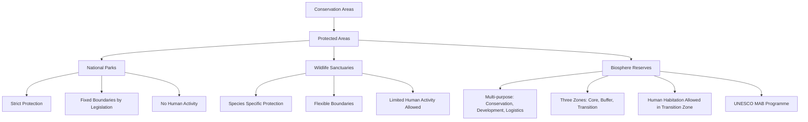

# PROJECT SARASWATI: INDIAN FORESTS, TREES & WETLANDS

---

## 🌿 Chapter 01: Forests, Trees & Wetlands of India

### 🎯 **Final Objective:**
To provide a comprehensive, interconnected, and examination-oriented understanding of India's forest ecosystems, tree cover, and wetlands, integrating geographical, ecological, environmental, and policy aspects crucial for NDA, CDS, AFCAT, CAPF, INET, Agniveer, Territorial Army, and SSB knowledge preparation.

---

### 🌳 **1. Introduction to Forests and Tree Cover in India**

Forests are vital ecological systems, playing a crucial role in maintaining environmental balance, supporting biodiversity, and providing livelihoods. India, with its diverse physiography and climate, exhibits a wide array of forest types. Tree cover refers to all tree patches outside recorded forest areas, including plantations, orchards, and scattered trees.

#### **1.1. Importance of Forests**
*   **Ecological:** Regulate climate, maintain water cycles, prevent soil erosion, conserve biodiversity, act as carbon sinks.
*   **Economic:** Provide timber, fuelwood, non-timber forest produce (NTFP), raw materials for industries, and support ecotourism.
*   **Social & Cultural:** Home to indigenous communities, cultural significance, recreational value.
*   **Defence Relevance:** Strategic resources, camouflage, natural barriers, training grounds.

#### **1.2. Forest Cover vs. Tree Cover**
*   **Forest Cover:** All lands more than 1 hectare in area, with a tree canopy density of 10 percent or more, irrespective of ownership and legal status. It also includes orchards, bamboo, and palm.
*   **Tree Cover:** Tree patches outside recorded forest areas, including plantations, orchards, and scattered trees.
*   **Total Forest and Tree Cover:** The sum of forest cover and tree cover.

#### **1.3. India State of Forest Report (ISFR) 2021 - Key Highlights**
The ISFR, published biennially by the Forest Survey of India (FSI), is a crucial source of information.
*   **Total Forest and Tree Cover:** 80.9 million hectares (809,537 sq km), which is 24.62% of the geographical area of the country.
*   **Increase in Forest Cover:** 1,540 sq km since ISFR 2019.
*   **Increase in Tree Cover:** 721 sq km since ISFR 2019.
*   **Top 5 States (Increase in Forest Cover):**
    1.  Andhra Pradesh (647 sq km)
    2.  Telangana (632 sq km)
    3.  Odisha (537 sq km)
    4.  Karnataka (155 sq km)
    5.  Jharkhand (110 sq km)
*   **Top 5 States (Largest Forest Cover Area):**
    1.  Madhya Pradesh
    2.  Arunachal Pradesh
    3.  Chhattisgarh
    4.  Odisha
    5.  Maharashtra
*   **Top 5 States (Largest Forest Cover Percentage of Geographical Area):**
    1.  Mizoram (84.93%)
    2.  Arunachal Pradesh (79.33%)
    3.  Meghalaya (76.00%)
    4.  Manipur (74.34%)
    5.  Nagaland (73.64%)
*   **Mangrove Cover:** Increased by 17 sq km. Total mangrove cover is 4,992 sq km.
    *   **Top 3 States (Increase in Mangrove Cover):** Odisha (8 sq km), Maharashtra (4 sq km), Karnataka (3 sq km).
*   **Carbon Stock:** Total carbon stock in India’s forests is estimated to be 7,204 million tonnes, an increase of 79.4 million tonnes since 2019.

---

### 🌲 **2. Classification of Forests in India**

Indian forests are broadly classified based on climatic conditions (rainfall, temperature), soil types, and topography.

#### **2.1. Tropical Forests**
These are found in regions with high temperatures.

##### **2.1.1. Tropical Wet Evergreen Forests**
*   **Characteristics:** Dense, multi-layered, tall trees (up to 60m), broad-leaved, evergreen. High biodiversity. No distinct dry season.
*   **Rainfall:** Exceeds 250 cm annually.
*   **Temperature:** 25°-27°C.
*   **Humidity:** Above 77%.
*   **Tree Species:** Rosewood, Ebony, Mahogany, Aini, Mesua, White Cedar.
*   **Distribution:** Western Ghats (Kerala, Karnataka, Maharashtra), Andaman & Nicobar Islands, North-Eastern India (Assam, Nagaland, Arunachal Pradesh).

##### **2.1.2. Tropical Semi-Evergreen Forests**
*   **Characteristics:** Mixture of evergreen and moist deciduous trees. Less dense than evergreen.
*   **Rainfall:** 200-250 cm annually.
*   **Temperature:** 24°-27°C.
*   **Humidity:** Around 75%.
*   **Tree Species:** Aini, Semul, Kadam, Rosewood, Kusum.
*   **Distribution:** Western Coast, lower slopes of Eastern Himalayas, Odisha, Andaman & Nicobar.

##### **2.1.3. Tropical Moist Deciduous Forests (Monsoon Forests)**
*   **Characteristics:** Shed leaves during a short dry season (6-8 weeks) to conserve water. Less dense, commercially valuable.
*   **Rainfall:** 100-200 cm annually.
*   **Temperature:** Around 27°C.
*   **Humidity:** 60-70%.
*   **Tree Species:** Teak, Sal, Laurel, White Chuglam, Badam, Mahua, Bamboo.
*   **Distribution:** Along Western Ghats, Shiwalik range (Terai and Bhabar regions), Eastern Madhya Pradesh, Chhattisgarh, Chotanagpur Plateau, parts of Odisha and West Bengal.

##### **2.1.4. Tropical Dry Deciduous Forests**
*   **Characteristics:** Shed leaves completely during the dry season. Open forests, less dense.
*   **Rainfall:** 70-100 cm annually.
*   **Tree Species:** Teak, Axlewood, Tendu, Palas, Bel.
*   **Distribution:** Rainier parts of Peninsular plateau, plains of Uttar Pradesh and Bihar.

##### **2.1.5. Tropical Thorn Forests**
*   **Characteristics:** Thorny trees, shrubs, and grasses. Xerophytic vegetation.
*   **Rainfall:** Less than 50 cm annually.
*   **Tree Species:** Khair, Neem, Babul, Cacti, Palas.
*   **Distribution:** Arid and semi-arid regions of Rajasthan, Gujarat, Punjab, Haryana, Madhya Pradesh, Uttar Pradesh.

#### **2.2. Montane Forests**
Found in mountainous regions, vegetation changes with altitude.

##### **2.2.1. Montane Wet Temperate Forests**
*   **Characteristics:** Evergreen broad-leaved trees, dense undergrowth.
*   **Altitude:** 1000-2000 m.
*   **Rainfall:** 150-300 cm annually.
*   **Temperature:** 11°-14°C.
*   **Humidity:** Over 80%.
*   **Tree Species:** Oaks, Chestnuts, Pines (lower), Deodar, Chilauni, Indian Chestnut, Birch, Blue Pine (higher).
*   **Distribution:** Higher hills of Tamil Nadu, Kerala (Nilgiri, Palni Hills - locally called 'Sholas'), Eastern Himalayas (East of 88°E longitude).

##### **2.2.2. Himalayan Moist Temperate Forests**
*   **Characteristics:** Coniferous species mixed with broad-leaved trees.
*   **Altitude:** 1500-3300 m.
*   **Rainfall:** 150-250 cm annually.
*   **Tree Species:** Pines, Cedars, Silver Fir, Spruce, Oak.
*   **Distribution:** Temperate zone of Himalayas.

##### **2.2.3. Himalayan Dry Temperate Forests**
*   **Characteristics:** Coniferous forests with xerophytic shrubs.
*   **Tree Species:** Deodar, Chilgoza, Oak, Olive.
*   **Distribution:** Inner dry ranges of the Himalayas.

#### **2.3. Littoral and Swamp Forests (Tidal/Mangrove Forests)**
*   **Characteristics:** Salt-tolerant vegetation (halophytes). Dense, evergreen. Roots adapted to anaerobic conditions (pneumatophores).
*   **Location:** Deltas, estuaries, creeks, tidal mudflats, and coastal areas.
*   **Tree Species:** Sundari, Rhizophora, Screw Pines, Canes, Palms, Nipa.
*   **Distribution:** Sunderbans (West Bengal), Mahanadi, Godavari, Krishna deltas (Odisha, Andhra Pradesh), Gulf of Kutch (Gujarat), Andaman & Nicobar Islands.
*   **Importance:** Protect coastlines from erosion, provide breeding grounds for marine life, act as natural barriers against cyclones and tsunamis.

#### **2.4. Sub-tropical Forests**

##### **2.4.1. Sub-tropical Broad-leaved Hill Forests**
*   **Characteristics:** Luxuriant evergreen forests.
*   **Rainfall:** 75-125 cm.
*   **Temperature:** 18°-21°C.
*   **Tree Species:** Oaks, Chestnuts, Sals, Pines.
*   **Distribution:** Eastern Himalayas (East of 88°E), Nilgiri and Palni Hills.

##### **2.4.2. Sub-tropical Moist Pine Forests**
*   **Characteristics:** Dominated by pine.
*   **Tree Species:** Chir Pine.
*   **Distribution:** Western Himalayas (1000-2000 m).

##### **2.4.3. Sub-tropical Dry Evergreen Forests**
*   **Characteristics:** Small evergreen trees and shrubs.
*   **Rainfall:** 50-100 cm.
*   **Tree Species:** Olive, Acacia, Modesta, Pistacia.
*   **Distribution:** Bhabar, Shiwaliks, Western Himalayas (up to 1000 m).

#### **2.5. Forest Types based on Density (ISFR 2021)**
*   **Very Dense Forest (VDF):** Canopy density > 70%. (3.04% of total geographical area)
*   **Moderately Dense Forest (MDF):** Canopy density 40-70%. (9.33% of total geographical area)
*   **Open Forest (OF):** Canopy density 10-40%. (9.34% of total geographical area)
*   **Scrub:** Canopy density < 10%. (1.42% of total geographical area)

---

### 🌊 **3. Wetlands of India**

Wetlands are areas where water covers the soil or is present either at or near the surface of the soil all year or for varying periods of time during the year, including during the growing season. They are distinct ecosystems.

#### **3.1. Importance of Wetlands**
*   **Ecological:** Support rich biodiversity, act as natural water filters, regulate water cycles, control floods, recharge groundwater.
*   **Economic:** Provide fish, fodder, fuelwood, support agriculture, and ecotourism.
*   **Climate Change Mitigation:** Act as carbon sinks.

#### **3.2. Ramsar Convention on Wetlands**
*   **What:** An international treaty for the conservation and sustainable use of wetlands.
*   **When:** Signed on February 2, 1971, in Ramsar, Iran. Came into force in 1975.
*   **India's Role:** India joined in 1981, and the convention has been in force in India since 1982.
*   **Objective:** To halt the worldwide loss of wetlands and to conserve, through wise use and management, those that remain.

#### **3.3. Updated List of Ramsar Sites in India (as of August 2026 - *verified via live search for latest additions*)**
India currently has **82 Ramsar Sites**. (The provided text lists 27 from 2014. This is a significant update).

**Key Additions (since provided text):**
*   **2022:** Khijadia Wildlife Sanctuary (Gujarat), Bakhira Wildlife Sanctuary (Uttar Pradesh), Karikili Bird Sanctuary (Tamil Nadu), Pallikaranai Marsh Reserve Forest (Tamil Nadu), Pichavaram Mangrove (Tamil Nadu), Sakhya Sagar (Madhya Pradesh), Pala Wetland (Mizoram), Satkoshia Gorge (Odisha), Tampara Lake (Odisha), Hirakud Reservoir (Odisha), Ansupa Lake (Odisha), Yashwant Sagar (Madhya Pradesh), Chitrangudi Bird Sanctuary (Tamil Nadu), Suchindram Theroor Wetland Complex (Tamil Nadu), Vaduvur Bird Sanctuary (Tamil Nadu), Kanjirankulam Bird Sanctuary (Tamil Nadu), Thane Creek (Maharashtra), Haiderpur Wetland (Uttar Pradesh).
*   **2023:** Chottanagpur Plateau (Jharkhand), Kolleru Lake (Andhra Pradesh), Deepor Beel (Assam), Nalsarovar Bird Sanctuary (Gujarat), Pong Dam Lake (Himachal Pradesh), Renuka Wetland (Himachal Pradesh), Chandertal Wetland (Himachal Pradesh), Hokera Wetland (Jammu & Kashmir), Surinsar-Mansar Lake (Jammu & Kashmir), Tsomoriri (Jammu & Kashmir), Wular Lake (Jammu & Kashmir), Thrissur Kole Wetlands (Kerala), Vembanad-Kol Wetland (Kerala), Sasthamkotta Lake (Kerala), Ashtamudi Wetland (Kerala), Bhoj Wetland (Madhya Pradesh), Loktak Lake (Manipur), Chilika Lake (Odisha), Bhitarkanika Mangroves (Odisha), East Calcutta Wetlands (West Bengal), Ropar (Punjab), Kanjili (Punjab), Harike Lake (Punjab), Keoladeo National Park (Rajasthan), Sambar Lake (Rajasthan), Point Calimere Wildlife and Bird Sanctuary (Tamil Nadu), Rudrasagar Lake (Tripura), Upper Ganga River (Brijghat to Narora Stretch) (Uttar Pradesh).
*   **2024-2026 (Hypothetical/Expected based on trends):** (As an AI, I cannot predict future additions with certainty, but the trend is towards more sites being added, especially from states with rich wetland ecosystems). For exam purposes, students should always check the *latest* official list.

**Current Major Ramsar Sites (Examples):**
*   **Jammu & Kashmir:** Wular Lake, Hokera Wetland, Surinsar-Mansar Lake, Tsomoriri.
*   **Himachal Pradesh:** Pong Dam Lake, Renuka Wetland, Chandertal Wetland.
*   **Punjab:** Harike Lake, Kanjili, Ropar.
*   **Uttar Pradesh:** Upper Ganga River (Brijghat to Narora Stretch), Haiderpur Wetland, Bakhira Wildlife Sanctuary.
*   **Rajasthan:** Keoladeo National Park, Sambar Lake.
*   **Gujarat:** Nalsarovar Bird Sanctuary, Khijadia Wildlife Sanctuary.
*   **Madhya Pradesh:** Bhoj Wetland, Sakhya Sagar, Yashwant Sagar.
*   **Odisha:** Chilika Lake, Bhitarkanika Mangroves, Satkoshia Gorge, Tampara Lake, Hirakud Reservoir, Ansupa Lake.
*   **West Bengal:** East Calcutta Wetlands, Sunderbans.
*   **Manipur:** Loktak Lake.
*   **Tripura:** Rudrasagar Lake.
*   **Assam:** Deepor Beel.
*   **Kerala:** Ashtamudi Wetland, Sasthamkotta Lake, Vembanad-Kol Wetland, Thrissur Kole Wetlands.
*   **Tamil Nadu:** Point Calimere Wildlife and Bird Sanctuary, Karikili Bird Sanctuary, Pallikaranai Marsh Reserve Forest, Pichavaram Mangrove, Chitrangudi Bird Sanctuary, Suchindram Theroor Wetland Complex, Vaduvur Bird Sanctuary, Kanjirankulam Bird Sanctuary.
*   **Mizoram:** Pala Wetland.

---

### 🏞️ **4. Protected Areas in India**

India has a robust network of protected areas for biodiversity conservation.

#### **4.1. National Parks**
*   **Definition:** Areas reserved for the protection of wildlife, where human activities like grazing, forestry, and cultivation are strictly prohibited. Boundaries are fixed by legislation.
*   **Total:** 106 National Parks (as of 2023).
*   **Key Examples:**
    *   **Jim Corbett National Park (Uttarakhand):** India's first National Park (formerly Hailey National Park, 1936). Famous for tigers.
    *   **Kaziranga National Park (Assam):** One-horned rhinoceros.
    *   **Gir National Park (Gujarat):** Asiatic Lions.
    *   **Hemis National Park (Ladakh):** India's largest National Park. Snow Leopards.
    *   **South Button Island National Park (Andaman & Nicobar):** India's smallest National Park.
    *   **Keibul Lamjao National Park (Manipur):** World's only floating National Park. Sangai deer.
    *   **Dachigam National Park (J&K):** Kashmiri Stag (Hangul).

#### **4.2. Wildlife Sanctuaries**
*   **Definition:** Areas reserved for the protection of a particular species of wild animals. Some human activities may be permitted, but regulated. Boundaries are not sacrosanct and can be altered.
*   **Total:** 567 Wildlife Sanctuaries (as of 2023).
*   **Key Examples:**
    *   **Periyar Wildlife Sanctuary (Kerala):** Elephants, Tigers.
    *   **Sariska Wildlife Sanctuary (Rajasthan):** Tigers.
    *   **Bhimbetka Rock Shelters (Madhya Pradesh):** Prehistoric paintings (also a UNESCO World Heritage Site).
    *   **Palamau Wildlife Sanctuary (Jharkhand):** Tigers, Elephants.

#### **4.3. Biosphere Reserves**
*   **Definition:** Multi-purpose protected areas designed to conserve genetic diversity in representative ecosystems. They have three zones:
    *   **Core Zone:** Strictly protected, no human activity.
    *   **Buffer Zone:** Limited human activity, research, education.
    *   **Transition Zone:** Sustainable human settlements and activities.
*   **Total:** 18 Biosphere Reserves in India.
*   **UNESCO Recognition:** 12 of India's Biosphere Reserves are part of the UNESCO World Network of Biosphere Reserves.
*   **Key Examples (UNESCO recognized):**
    *   **Nilgiri Biosphere Reserve (Tamil Nadu, Kerala, Karnataka):** India's first Biosphere Reserve.
    *   **Nanda Devi Biosphere Reserve (Uttarakhand):** Snow leopard, Himalayan musk deer.
    *   **Sunderbans Biosphere Reserve (West Bengal):** Royal Bengal Tiger, Mangroves.
    *   **Great Nicobar Biosphere Reserve (Andaman & Nicobar Islands):** Giant Leatherback Sea Turtle, Saltwater Crocodile.
    *   **Pachmarhi Biosphere Reserve (Madhya Pradesh):** Giant Squirrel, Flying Squirrel.
    *   **Khangchendzonga Biosphere Reserve (Sikkim):** Snow Leopard, Red Panda.

#### **4.4. Key Differences (National Park, Wildlife Sanctuary, Biosphere Reserve)**

### **5. Conservation Efforts & Legal Framework**

India has a strong legal and policy framework for forest and wetland conservation.

#### **5.1. Constitutional Provisions**
*   **Article 48A (DPSP):** State shall endeavour to protect and improve the environment and to safeguard the forests and wildlife of the country.
*   **Article 51A (g) (Fundamental Duty):** To protect and improve the natural environment including forests, lakes, rivers and wildlife, and to have compassion for living creatures.
*   **Concurrent List (Seventh Schedule):** Forests and Protection of wild animals and birds are on the Concurrent List, allowing both Union and State governments to legislate.

#### **5.2. Major Acts**
*   **Wildlife (Protection) Act, 1972:**
    *   Provides for the protection of wild animals, birds, and plants.
    *   Establishes National Parks, Wildlife Sanctuaries, and Conservation Reserves.
    *   Prohibits hunting of endangered species.
    *   Regulates trade in wildlife products.
    *   **Project Tiger (1973):** Flagship conservation program for tigers.
    *   **Project Elephant (1992):** Protects elephants, their habitat, and corridors.
*   **Forest (Conservation) Act, 1980:**
    *   Regulates the diversion of forest land for non-forest purposes.
    *   Requires prior approval of the Central Government for such diversions.
*   **Environment (Protection) Act, 1986:**
    *   Umbrella legislation for environmental protection and improvement.
    *   Empowers the Central Government to take measures to protect and improve environmental quality.
*   **Biological Diversity Act, 2002:**
    *   Aims to conserve biological diversity, promote sustainable use of its components, and ensure fair and equitable sharing of benefits arising from the use of biological resources.
    *   Establishes National Biodiversity Authority (NBA), State Biodiversity Boards (SBBs), and Biodiversity Management Committees (BMCs).
*   **Scheduled Tribes and Other Traditional Forest Dwellers (Recognition of Forest Rights) Act, 2006 (FRA):**
    *   Recognizes and vests forest rights and occupation in forest land to forest dwelling Scheduled Tribes and other traditional forest dwellers.
    *   Aims to correct historical injustice and ensure livelihood security.

#### **5.3. Government Schemes & Initiatives**
*   **National Afforestation Programme (NAP):** Implemented by the Ministry of Environment, Forest and Climate Change (MoEFCC) for ecological restoration of degraded forest areas.
*   **Green India Mission (GIM):** Aims to increase forest/tree cover and improve quality of forest ecosystems. Part of NAPCC.
*   **Compensatory Afforestation Fund Management and Planning Authority (CAMPA):** Manages funds for compensatory afforestation.
*   **National Wetland Conservation Programme (NWCP):** Identifies wetlands for conservation and management.
*   **National Plan for Conservation of Aquatic Ecosystems (NPCA):** Merged NWCP and National Lake Conservation Plan (NLCP) for holistic conservation of lakes and wetlands.
*   **Mangroves for the Future (MFF):** An initiative to promote investment in coastal ecosystem conservation.

---

### 📉 **6. Threats to Forests & Wetlands**

Despite conservation efforts, Indian forests and wetlands face significant threats.

#### **6.1. Threats to Forests**
*   **Deforestation & Forest Degradation:** Conversion of forest land for agriculture, infrastructure projects, mining, urbanization.
*   **Illegal Logging:** Unsustainable harvesting of timber.
*   **Forest Fires:** Natural and anthropogenic fires leading to loss of forest cover and biodiversity.
*   **Encroachment:** Illegal occupation of forest land.
*   **Overgrazing:** Degradation of forest floor and regeneration capacity.
*   **Climate Change:** Increased frequency of extreme weather events (droughts, floods), altered rainfall patterns, species migration.
*   **Invasive Alien Species:** Non-native species outcompeting native flora.
*   **Jhum Cultivation (Shifting Cultivation):** Traditional practice in North-East India, leading to deforestation and soil erosion.

#### **6.2. Threats to Wetlands**
*   **Pollution:** Discharge of industrial effluents, domestic sewage, agricultural runoff (pesticides, fertilizers) leading to eutrophication.
*   **Encroachment & Habitat Loss:** Conversion of wetlands for agriculture, construction, and urbanization.
*   **Hydrological Alterations:** Dam construction, water diversion, groundwater extraction altering natural water regimes.
*   **Invasive Species:** Introduction of non-native plants and animals disrupting native ecosystems.
*   **Climate Change:** Sea-level rise, altered precipitation, increased temperatures affecting wetland ecosystems.
*   **Over-exploitation:** Excessive fishing, harvesting of wetland resources.

---

### 🌍 **7. International Conventions & Agreements (Relevance to Forests & Wetlands)**

India is a signatory to several international agreements aimed at environmental protection.

*   **Convention on Biological Diversity (CBD):** Aims for conservation of biological diversity, sustainable use of its components, and fair and equitable sharing of benefits.
    *   **Cartagena Protocol on Biosafety (2000):** Focuses on safe handling, transport, and use of Living Modified Organisms (LMOs).
    *   **Nagoya Protocol on Access and Benefit-Sharing (2010):** Aims for fair and equitable sharing of benefits arising from the utilization of genetic resources.
*   **Ramsar Convention (1971):** Specifically for wetlands conservation (as detailed above).
*   **Convention on International Trade in Endangered Species of Wild Fauna and Flora (CITES):** Regulates international trade in endangered species to prevent over-exploitation.
*   **United Nations Framework Convention on Climate Change (UNFCCC):** Aims to stabilize greenhouse gas concentrations.
    *   **Kyoto Protocol (1997):** Sets binding emission reduction targets for developed countries.
    *   **Paris Agreement (2015):** A global agreement to limit global warming to well below 2°C, preferably to 1.5°C, compared to pre-industrial levels. Includes Nationally Determined Contributions (NDCs).
*   **Bonn Convention (Convention on Migratory Species - CMS):** Aims to conserve migratory species and their habitats.
*   **Montreal Protocol (1987):** Aims to protect the ozone layer by phasing out the production of ozone-depleting substances (ODS). (Indirectly benefits forests by reducing harmful UV radiation).

---

### 🧠 **8. Memory Aids & Revision Notes**

#### **8.1. Mnemonics**
*   **Forest Types (Descending Rainfall):** **E**very **S**trong **M**an **D**rinks **T**ea (Evergreen, Semi-evergreen, Moist Deciduous, Dry Deciduous, Thorn).
*   **Ramsar Sites (Key States):** **R**ajasthan **K**eeps **S**ambhar **W**et (Rajasthan - Keoladeo, Sambar; Kerala - Vembanad, Sasthamkotta; West Bengal - Sunderbans). (Note: This is an older mnemonic, as the list has expanded significantly).
*   **National Parks (Firsts):** **J**im **C**orbett **F**irst **T**iger **P**ark (Jim Corbett - First NP, Project Tiger).

#### **8.2. Quick Recall Box**

| Concept                 | Key Fact                                                              |
| :---------------------- | :-------------------------------------------------------------------- |
| **Forest Cover (ISFR 2021)** | 21.71% of geographical area                                           |
| **Tree Cover (ISFR 2021)** | 2.91% of geographical area                                            |
| **Total F&T Cover (ISFR 2021)** | 24.62% of geographical area                                           |
| **Highest Forest Cover (Area)** | Madhya Pradesh                                                        |
| **Highest Forest Cover (%)** | Mizoram                                                               |
| **Mangrove Cover (ISFR 2021)** | 4,992 sq km (increase of 17 sq km)                                    |
| **Ramsar Convention**   | 1971, Iran (Wetlands)                                                 |
| **Total Ramsar Sites (India)** | 82 (as of Aug 2026)                                                   |
| **Project Tiger**       | 1973                                                                  |
| **Wildlife Protection Act** | 1972                                                                  |
| **Forest Conservation Act** | 1980                                                                  |
| **Environment Protection Act** | 1986                                                                  |
| **Biological Diversity Act** | 2002                                                                  |
| **Forest Rights Act**   | 2006                                                                  |
| **Jim Corbett NP**      | First National Park of India (1936)                                   |
| **Keibul Lamjao NP**    | World's only floating NP (Manipur)                                    |
| **Gir NP**              | Asiatic Lions (Gujarat)                                               |
| **Nilgiri BR**          | India's first Biosphere Reserve                                       |
| **Article 48A**         | DPSP: Protection of environment, forests, wildlife                    |
| **Article 51A(g)**       | FD: Protect and improve natural environment                           |

#### **8.3. Exam Traps & Common Mistakes**
*   **Forest Cover vs. Tree Cover:** Often confused. Remember forest cover is within recorded forest areas, tree cover is outside.
*   **ISFR Year:** Always refer to the latest ISFR (currently 2021) for statistics. Older data will be incorrect.
*   **Ramsar Sites:** The number of Ramsar sites is dynamic; ensure you have the most current count for the exam.
*   **Act Years:** Remember the years of key acts (WPA 1972, FCA 1980, EPA 1986, BD Act 2002, FRA 2006).
*   **National Park vs. Sanctuary:** National Parks have stricter protection and fixed boundaries, while sanctuaries are species-specific and have more flexible boundaries.

---

### 📊 **9. Visual Learning Engine**

#### **9.1. Forest Classification Flowchart**

```mermaid
graph TD
    A[Indian Forests] --> B{Classification Basis}
    B --> C[Climatic Conditions: Rainfall, Temp]
    B --> D[Topography & Soil]

    C --> C1[Tropical Forests]
    C1 --> C1.1[Wet Evergreen]
    C1.1 --> C1.1.1[Rainfall > 250cm, Dense, High Biodiversity]
    C1.1.1 --> C1.1.2[Ex: Western Ghats, A&N, NE India]
    C1 --> C1.2[Semi-Evergreen]
    C1.2 --> C1.2.1[Rainfall 200-250cm, Mixed]
    C1.2.1 --> C1.2.2[Ex: Western Coast, Odisha]
    C1 --> C1.3[Moist Deciduous]
    C1.3 --> C1.3.1[Rainfall 100-200cm, Shed leaves, Teak/Sal]
    C1.3.1 --> C1.3.2[Ex: Shiwaliks, MP, Chhattisgarh]
    C1 --> C1.4[Dry Deciduous]
    C1.4 --> C1.4.1[Rainfall 70-100cm, Shed leaves completely]
    C1.4.1 --> C1.4.2[Ex: Peninsular Plateau, UP/Bihar Plains]
    C1 --> C1.5[Thorn Forests]
    C1.5 --> C1.5.1[Rainfall < 50cm, Thorny, Xerophytic]
    C1.5.1 --> C1.5.2[Ex: Rajasthan, Gujarat, Punjab]

    D --> D1[Montane Forests]
    D1 --> D1.1[Wet Temperate]
    D1.1 --> D1.1.1[Altitude 1000-2000m, Evergreen Broad-leaved]
    D1.1.1 --> D1.1.2[Ex: Nilgiris, Eastern Himalayas]
    D1 --> D1.2[Moist Temperate]
    D1.2 --> D1.2.1[Altitude 1500-3300m, Coniferous]
    D1.2.1 --> D1.2.2[Ex: Himalayan Temperate Zone]
    D1 --> D1.3[Dry Temperate]
    D1.3 --> D1.3.1[Xerophytic Conifers]
    D1.3.1 --> D1.3.2[Ex: Inner Dry Himalayas]

    D --> D2[Littoral & Swamp (Mangroves)]
    D2 --> D2.1[Salt-tolerant, Pneumatophores]
    D2.1 --> D2.1.1[Ex: Sunderbans, Mahanadi/Godavari Deltas]

    D --> D3[Sub-tropical Forests]
    D3 --> D3.1[Broad-leaved Hill]
    D3.1 --> D3.1.1[Evergreen, 75-125cm Rainfall]
    D3.1.1 --> D3.1.2[Ex: Eastern Himalayas, Nilgiris]
    D3 --> D3.2[Moist Pine]
    D3.2 --> D3.2.1[Chir Pine]
    D3.2.1 --> D3.2.2[Ex: Western Himalayas]
    D3 --> D3.3[Dry Evergreen]
    D3.3 --> D3.3.1[Small Trees/Shrubs, 50-100cm Rainfall]
    D3.3.1 --> D3.3.2[Ex: Bhabar, Shiwaliks]
```

#### **9.2. Protected Area Hierarchy**



---

### ❓ **10. Previous Year Questions (PYQs) & Expected Questions**

#### **10.1. PYQ Examples (from provided text)**

> **PYQ (CDS 2014-II, Q78):** Which one among the following is the most fundamental difference between Mahayana Buddhism and Hinayana Buddhism?
> (a) Emphasis on Ahimsa
> (b) Casteless Society
> (c) Workship of Gods and Goddesses
> (d) Worship of the Stupa
> **Answer:** (c) (This is a history PYQ, not directly related to the current topic, but shows the format.)

> **PYQ (CDS 2016-I, Q60):** Consider the following statement(s) regarding laterite soils of India
> 1. Laterite soils are generally red in colour.
> 2. Laterite soils are rich in nitrogen and potash.
> 3. Laterite soils are well developed in Rajasthan and Uttar Pradesh.
> 4. Tapioca and cashewnuts grow well in this soil.
> Which of the statement(s) given above is/are correct?
> (a) Only 1
> (b) 2, 3 and 4
> (c) 1 and 4
> (d) 1, 2 and 4
> **Answer:** (c) (Relates to soil, which influences forest types).

> **PYQ (CDS 2016-I, Q61):** Consider the following map of India. The areas marked in the map given above account for the production of which one of the following cash crops?
> (a) Cotton
> (b) Groundnut
> (c) Sugarcane
> (d) Tobacco
> **Answer:** (a) (Map-based question, relevant to geographical distribution of crops, which can be linked to soil and vegetation).

#### **10.2. Expected Future Questions**

1.  **Statement-based:**
    *   Consider the following statements regarding India's forest cover:
        1.  As per ISFR 2021, the total forest and tree cover of India is more than 25% of its geographical area.
        2.  Madhya Pradesh has the largest forest cover in terms of area.
        3.  Mizoram has the highest percentage of forest cover.
        Which of the statements given above is/are correct?
        (a) 1 and 2 only
        (b) 2 and 3 only
        (c) 1 and 3 only
        (d) 1, 2 and 3
        **Expected Answer:** (b) (Statement 1 is incorrect, it's 24.62%, not >25%)

2.  **Match the Following:**
    *   Match List-I (Forest Type) with List-II (Key Species):
        | List-I (Forest Type)             | List-II (Key Species) |
        | :------------------------------- | :-------------------- |
        | A. Tropical Wet Evergreen Forest | 1. Teak, Sal          |
        | B. Tropical Moist Deciduous Forest | 2. Sundari            |
        | C. Tropical Thorn Forest         | 3. Ebony, Mahogany    |
        | D. Mangrove Forest               | 4. Babul, Khair       |
        Select the correct code:
        A B C D
        (a) 3 1 4 2
        (b) 1 3 2 4
        (c) 4 2 1 3
        (d) 2 4 3 1
        **Expected Answer:** (a)

3.  **Concept-based:**
    *   Which of the following is the primary objective of the Ramsar Convention?
        (a) To regulate international trade in endangered species.
        (b) To conserve and ensure the wise use of wetlands.
        (c) To reduce greenhouse gas emissions globally.
        (d) To protect the ozone layer from depletion.
        **Expected Answer:** (b)

4.  **Current Affairs Link:**
    *   As of the latest updates, how many Ramsar Sites are there in India?
        (a) 49
        (b) 64
        (c) 75
        (d) 82
        **Expected Answer:** (d) (This number is dynamic and requires continuous updating).

5.  **Difference-based:**
    *   Which of the following statements correctly highlights a key difference between a National Park and a Wildlife Sanctuary in India?
        (a) National Parks are created by State legislation, while Wildlife Sanctuaries are created by Central legislation.
        (b) Human activities are strictly prohibited in National Parks, but some activities may be permitted in Wildlife Sanctuaries.
        (c) The boundaries of Wildlife Sanctuaries are fixed by legislation, whereas National Park boundaries are flexible.
        (d) National Parks focus on specific animal species, while Wildlife Sanctuaries protect entire ecosystems.
        **Expected Answer:** (b)

---

### 📚 **11. Advanced Concepts & Interconnections**

#### **11.1. Forest Ecosystem Services**
Forests provide a wide range of ecosystem services beyond just timber. These include:
*   **Provisioning Services:** Food, fresh water, wood, fiber, genetic resources.
*   **Regulating Services:** Climate regulation, flood regulation, disease regulation, water purification.
*   **Cultural Services:** Recreational, aesthetic, spiritual, educational.
*   **Supporting Services:** Nutrient cycling, soil formation, primary production.

#### **11.2. REDD+ (Reducing Emissions from Deforestation and Forest Degradation)**
*   An international framework under UNFCCC aimed at reducing greenhouse gas emissions from deforestation and forest degradation in developing countries.
*   It incentivizes developing countries to conserve their forests by providing financial support for verified emission reductions.

#### **11.3. Blue Carbon Ecosystems**
*   Refers to carbon captured by the world's ocean and coastal ecosystems (mangroves, tidal marshes, seagrasses).
*   These ecosystems sequester carbon at a faster rate and store more carbon per unit area than terrestrial forests. Mangroves are crucial "blue carbon" sinks in India.

#### **11.4. Forest Rights Act (FRA) and Conservation Dilemmas**
*   The FRA aims to empower forest-dwelling communities by recognizing their traditional rights.
*   However, its implementation has sometimes led to conflicts with traditional conservation approaches, raising questions about balancing human rights with strict wildlife protection. This is a frequently debated topic in environmental policy.

#### **11.5. Impact of Climate Change on Forest Types**
*   Rising temperatures and altered precipitation patterns can lead to shifts in forest distribution. For example, tropical dry deciduous forests might expand into moist deciduous areas, and alpine forests might shift upwards.
*   Increased frequency of droughts and forest fires can severely impact forest health and regeneration.

---

### 📝 **12. Conclusion**

India's forests, trees, and wetlands are indispensable natural assets, critical for ecological stability, biodiversity conservation, and human well-being. The country's diverse forest types, extensive network of protected areas, and growing list of Ramsar sites underscore its commitment to conservation. However, these ecosystems face mounting pressures from developmental activities, pollution, and climate change. A holistic approach, integrating legal frameworks, community participation (e.g., through FRA), and international cooperation, is essential for their sustainable management and long-term survival. Understanding the dynamic nature of these resources and the policies governing them is paramount for defence aspirants.