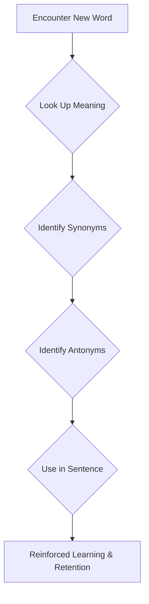
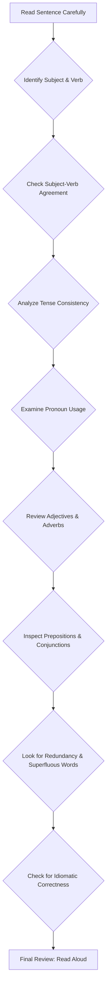

**Topic Module: English Core - Grammar & Vocabulary (Spotting Errors, Synonyms, Antonyms, Idioms & Phrases)**

**Important Note to Student:**
The requested topic for this module was "Chemistry Core". However, the provided primary textbook context and external notes context are entirely focused on English Grammar (Spotting the Errors), Vocabulary (Synonyms, Antonyms), and Idioms & Phrases. Therefore, this module has been generated based on the provided English language content, not Chemistry. Please ensure you have provided the correct content for your desired topic.

---

# Page 1: Core Context - English Grammar Fundamentals

## 1.1 Spotting the Errors: Foundational Concepts

Spotting errors in English grammar involves identifying grammatical mistakes in sentences. These errors can relate to various parts of speech, sentence structure, tense, subject-verb agreement, articles, prepositions, and more. A strong grasp of fundamental grammar rules is essential.

### Common Error Categories (Inferred from Explanations):

*   **Nouns:**
    *   **Singular/Plural Nouns:** Correct usage of singular and plural forms (e.g., "scenery" vs. "sceneries", "furniture" always singular).
    *   **Collective Nouns:** Agreement with singular/plural verbs (e.g., "mob" is singular, "Himalayas" takes plural verb).
    *   **Uncountable Nouns:** Nouns like 'luggage', 'information', 'equipment', 'scenery' are uncountable and always take singular verbs; they do not have plural forms.
    *   **Possessive Nouns:** Correct use of apostrophes.
    *   **Articles with Nouns:** Proper use of 'a', 'an', 'the' (e.g., before abstract nouns, religious books, specific groups).
*   **Pronouns:**
    *   **Subject-Verb Agreement with Pronouns:** Matching pronouns with their correct verb forms (e.g., "One of them" takes singular pronoun 'his').
    *   **Reflexive Pronouns:** Correct use (e.g., 'himself' instead of 'him' when the action reflects back on the subject).
    *   **Superfluous Pronouns:** Avoiding unnecessary pronouns (e.g., "The pronoun ‘he’ in the sentence is not needed.").
    *   **Relative Pronouns:** Correct use of 'who', 'whom', 'which', 'that'.
*   **Verbs & Tenses:**
    *   **Subject-Verb Agreement:** Verb must agree with the subject in number (singular/plural).
    *   **Tense Consistency:** Maintaining consistent tense throughout a sentence or paragraph, especially in reported speech or conditional sentences.
    *   **Continuous Actions:** Correct use of present perfect continuous for actions continuing from past to present (e.g., 'have been waiting' instead of 'am waiting').
    *   **Habitual Actions:** Use simple present tense for habitual actions (e.g., 'goes' instead of 'is going').
    *   **Conditional Sentences:** Correct tense usage in 'if' clauses (e.g., present indefinite in 'if' clause, future in main clause).
*   **Adjectives & Adverbs:**
    *   **Degree of Comparison:** Ensuring adjectives are in the correct degree (e.g., 'the most beautiful' when comparing multiple, 'better' for two).
    *   **Adjective vs. Adverb:** Using the correct form (e.g., 'bluntly' as an adverb, 'direct' as an adjective).
    *   **Superfluous Adjectives/Adverbs:** Avoiding unnecessary words (e.g., 'all the more').
    *   **Word Order:** Correct placement of adverbs (e.g., 'often meet him' vs. 'meet him often').
*   **Prepositions:**
    *   **Fixed Prepositions:** Verbs/nouns followed by specific prepositions (e.g., 'superior to', 'adhere to', 'sympathise with', 'angry with', 'distinguish from', 'cope with', 'victim of').
    *   **Superfluous Prepositions:** Avoiding unnecessary prepositions (e.g., 'enter' does not take 'into', 'consider' does not take 'as', 'despite' does not take 'of').
*   **Conjunctions:**
    *   **Correlative Conjunctions:** Correct pairs (e.g., 'neither-nor', 'either-or', 'no sooner-than').
    *   **Superfluous Conjunctions:** Avoiding redundant conjunctions (e.g., 'reason...because', 'lest...not', 'whether...that').
    *   **Indirect Speech:** Avoiding 'that' in interrogative indirect speech.
*   **Idioms & Phrases:**
    *   Correct usage of idiomatic expressions (e.g., 'at arm’s length', 'hand to mouth', 'catch a glimpse').
*   **Miscellaneous:**
    *   **Redundancy:** Avoiding repetition of meaning (e.g., 'returned back').
    *   **Word Choice:** Selecting the appropriate word for the context (e.g., 'room' vs. 'place' in a compartment, 'outdoors' vs. 'outdoor').

## 1.2 Vocabulary Building: A Structured Approach

Vocabulary is crucial for language proficiency. The textbook outlines a 4-step process to enhance vocabulary:

### Structural Mind-Map for Vocabulary Building:

```
+---------------------+
|   VOCABULARY SKILLS |
+---------------------+
        |
        v
+---------------------+
|   Step 1: Identify  |
|     the Word        |
| (Look up meaning)   |
+---------------------+
        |
        v
+---------------------+
|   Step 2: Identify  |
|    Antonyms         |
| (Opposite meanings) |
+---------------------+
        |
        v
+---------------------+
|   Step 3: Identify  |
|    Synonyms         |
| (Similar meanings)  |
+---------------------+
        |
        v
+---------------------+
|   Step 4: Form a    |
|   Proper Sentence   |
| (Contextual usage)  |
+---------------------+
```

### Foundational Conceptual Notes for Vocabulary:

*   **Synonyms:** Words that have a similar meaning to a given word (e.g., *reside* = *dwell*).
    *   **Direct Format:** Choose the closest meaning from options.
    *   **Sentence Format:** Choose the similar meaning for an underlined/capitalized word in context.
*   **Antonyms:** Words that are directly opposite in meaning to a given word (e.g., *fresh* = *stale*).
    *   **Direct Format:** Choose the opposite meaning from options.
    *   **Sentence Format:** Choose the opposite meaning for an underlined/capitalized word in context.
*   **Idioms & Phrases:** Expressions whose meaning cannot be understood from the ordinary meaning of its words. They add power, meaning, and crispness to language.
    *   **Contextual Usage:** Understanding the meaning of an idiom is crucial to avoid inappropriate usage that can change the sentence's meaning.

---

# Page 2: Core Context - Vocabulary Lists & Error Spotting Examples

## 2.1 High-Frequency Vocabulary Snapshot (A-Z Sample)

This section provides a glimpse into the type of high-frequency words covered, along with their core meanings, synonyms, and antonyms.

*   **Aback:** Taken by surprise. (Syn: Surprised; Ant: Relax)
*   **Abandon:** To leave something and never return. (Syn: Desert; Ant: Continue)
*   **Abase:** To humiliate. (Syn: Degrade; Ant: Honour)
*   **Abate:** To make or become less strong. (Syn: Weaken; Ant: Strengthen)
*   **Abdicate:** To give up power. (Syn: Relinquish; Ant: Accept)
*   **Aberrant:** Straying from the right or normal way. (Syn: Deviant; Ant: Normal)
*   **Abet:** To encourage someone to do wrong. (Syn: Incite; Ant: Prevent)
*   **Abhor:** To feel hatred or dislike. (Syn: Detest; Ant: Admire)
*   **Abide:** To accept something in accordance with. (Syn: Obey; Ant: Reject)
*   **Abnegate:** To give-up; renunciation. (Syn: Discard; Ant: Accept)
*   **Abound:** To exist in large numbers or amounts. (Syn: Plenty; Ant: Scarce)
*   **Abrasive:** Showing little concern for feelings of others. (Syn: Rude; Ant: Pleasant)
*   **Abrogate:** To end a law, agreement or custom formally. (Syn: Abandon; Ant: Institute)
*   **Abstain:** Withhold or Refrain. (Syn: Avoid; Ant: Continue)
*   **Abstruse:** Difficult to understand, obscure. (Syn: Esoteric; Ant: Clear)
*   **Absurd:** Ridiculous, Unreasonable. (Syn: Foolish; Ant: Reasonable)
*   **Accede:** To agree. (Syn: Consent; Ant: Disagree)
*   **Accentuate:** To emphasise or to make noticeable. (Syn: Highlight; Ant: Shadowed)
*   **Accessible:** Easy to obtain, approachable. (Syn: Achievable; Ant: Remote)
*   **Acclaim:** Public approval and praise. (Syn: Praise; Ant: Criticise)
*   **Accolade:** An award or an expression of praise. (Syn: Honour; Ant: Criticism)
*   **Accord:** Be harmonious or consistent. (Syn: Agreement; Ant: Disagree)
*   **Accost:** Approach and address angrily or aggressively. (Syn: Confront; Ant: Aid)
*   **Accrue:** To increase in number or amount. (Syn: Accumulate; Ant: Disperse)
*   **Adept:** Skilful. (Syn: Expert; Ant: Unskilled)
*   **Adjourn:** Temporary breaking-off. (Syn: Suspend; Ant: Carry out)
*   **Adjunct:** Something joined or added to another thing but is not an essential part of it. (Syn: Supplement; Ant: Subtraction)
*   **Admonish:** To warn. (Syn: Scold; Ant: Compliment)
*   **Adorn:** Make more beautiful or attractive. (Syn: Embellish; Ant: Deface)
*   **Adroit:** Very skilful. (Syn: Proficient; Ant: Incompetent)
*   **Afflict:** Affect adversely. (Syn: Suffer; Ant: Comfort)
*   **Affluence:** Having a lot of money. (Syn: Wealth; Ant: Poverty)
*   **Affront:** An action or remark that causes outrage or offence. (Syn: Insult; Ant: Honour)
*   **Aggrandize:** Increase power, status or wealth of. (Syn: Exalt; Ant: Degrade)
*   **Aggravate:** To make a problem worse. (Syn: Worsen; Ant: Soothe)
*   **Agog:** Very eager or curious to hear or see something. (Syn: Impatient; Ant: Uninterested)
*   **Altruism:** Disinterested and selfless concern for the well-being of others. (Syn: Benevolence; Ant: Greediness)
*   **Amalgamate:** To combine to form a larger group. (Syn: Merge; Ant: Separate)
*   **Ambiguous:** Open to more than one interpretation. (Syn: Unclear; Ant: Clear)
*   **Ameliorate:** Making a situation better, less painful. (Syn: Mitigate; Ant: Worsen)
*   **Amenable:** Open and responsive to suggestions. (Syn: Compliant; Ant: Stubborn)
*   **Amicable:** Friendly behaviour of a person. (Syn: Friendly; Ant: Hostile)
*   **Annul:** To make something legally void. (Syn: Cancel; Ant: Validate)
*   **Anomaly:** Deviation from the standard. (Syn: Oddity; Ant: Normality)
*   **Antagonism:** A strong feeling of dislike or hatred. (Syn: Hate; Ant: Love)
*   **Antipathy:** A strong feeling of dislike. (Syn: Aversion; Ant: Affinity)
*   **Antithesis:** The direct or exact opposite. (Syn: Counterpart; Ant: Same)
*   **Aphorism:** A short, wise and true statement. (Syn: Adage; Ant: Nonsense)
*   **Aplomb:** Confidence and style. (Syn: Assurance; Ant: Discomposure)
*   **Apocryphal:** Well-known but probably not true. (Syn: Fictitious; Ant: Authentic)
*   **Apogee:** Most successful part of something. (Syn: Apex; Ant: Bottom)
*   **Appease:** To make someone pleased or less angry. (Syn: Pacify; Ant: Annoy)
*   **Append:** To add something to the end of a writing. (Syn: Attach; Ant: Detach)
*   **Apportion:** To divide something among people. (Syn: Distribute; Ant: Withhold)

## 2.2 Spotting the Errors: Key Learnings from PYQs (2014-2016)

The provided questions and explanations highlight recurring grammatical issues. Here's a summary of common error types observed in the PYQs:

*   **Redundancy:** Words like "returned back" (93), "as well" (104), "even not less" (117), "reason for...because" (118), "despite of" (160), "I gave it to you" (166).
*   **Tense Errors:** Incorrect tense usage, especially in reported speech or sequential past events (e.g., "has seen" instead of "had seen" (94), "he has not read" instead of "he had not read" (116), "will arrive" instead of "would arrive" (156), "will surely pass" instead of "would surely pass" (161)).
*   **Subject-Verb Agreement:** Incorrect verb form for the subject (e.g., "No news are" instead of "No news is" (109), "Radar equipments that is" instead of "Radar equipment that is" (139), "New types...has been developed" instead of "have been developed" (140), "seem" instead of "seems" (146), "foreman are" instead of "foreman is" (150), "support" instead of "supports" (163)).
*   **Incorrect Word Choice/Usage:** Using a similar-sounding but incorrect word or an inappropriate word for the context (e.g., "outdoor" instead of "outdoors" (95), "conclusion remarks" instead of "concluding remarks" (96), "place" instead of "room" (111), "losed" instead of "lost" (115), "total ban" instead of "complete ban" (123), "such books which" instead of "such books as" or "the books which" (124), "poet" instead of "poets" (125), "ask" instead of "asked" (129), "see the play" instead of "watch the play" (130), "man" instead of "men" (131), "sceneries" instead of "scenery" (141), "primary importance" instead of "utmost importance" (142), "beside" instead of "besides" (148), "the best of the two" instead of "the better of the two" (149), "hardly won freedom" instead of "hard-won freedom" (153), "looked after the thief" instead of "looked for the thief" (155), "in the temper" instead of "in a temper" (158)).
*   **Prepositional Errors:** Using wrong prepositions or omitting necessary ones (e.g., "compensation for...from the accident" instead of "compensation for...of the accident" (114), "living from 1965" instead of "living since 1965" (122), "adhere the rules" instead of "adhere to the rules" (128), "sympathise for others" instead of "sympathise with others" (132), "involved with the accident" instead of "involved in the accident" (138), "since two days" instead of "for two days" (147), "despite of the increase" instead of "despite the increase" (160)).
*   **Pronoun Errors:** Incorrect case or unnecessary pronoun (e.g., "whom you said was looking" instead of "who you said was looking" (154), "I gave it to you" (166)).
*   **Article Errors:** Missing or incorrect articles (e.g., "school teacher" instead of "a school teacher" (164)).
*   **Parallelism:** Ensuring grammatical structures are parallel (e.g., "either to exchange...or refund" instead of "either to exchange...or to refund" (97), "to write, to speak or to act" instead of "to write, to speak and to act" (146)).
*   **Infinitive/Gerund:** Incorrect use of 'to + verb' vs. '-ing' form (e.g., "to go by myself" instead of "going by myself" (113), "to smoke was a bad habit" instead of "smoking was a bad habit" (165)).
*   **Inversion:** Incorrect word order, especially with negative adverbs (e.g., "No sooner he appeared" instead of "No sooner had he appeared" (137)).

---

# Page 3: AI Contextual Enrichment - Vocabulary & Idioms Deep Dive

## 3.1 Advanced Vocabulary Strategies & Mnemonics

While the primary text provides a basic 4-step approach, we can deepen our vocabulary acquisition with advanced strategies:

### Visualizing the 4-Step Vocabulary Process:



### Deep Dive into Vocabulary Learning:

*   **Contextual Learning:** Always try to understand a word in the context it appears. This helps grasp nuances. The provided "Sentence Format" for Synonyms/Antonyms directly applies this.
*   **Word Families:** Learn derivatives (noun, verb, adjective, adverb forms) of a root word. E.g., `Abate` (verb) -> `Abatement` (noun).
*   **Etymology:** Understanding word origins (Latin, Greek roots, prefixes, suffixes) can unlock meanings of many related words.
    *   *Example:* `Mal-` (bad) -> `Maladroit` (awkward), `Malodorous` (bad-smelling).
    *   *Example:* `Bene-` (good) -> `Beneficial` (advantageous), `Benevolence` (goodness).
*   **Mnemonics:** Memory aids to link new words with existing knowledge.
    *   **Abhor:** "Ab-horrible" -> to hate something horrible.
    *   **Adept:** "A-dept" (expert in a department) -> skillful.
    *   **Banal:** "Ban-all" original ideas -> boring, unoriginal.
    *   **Fecund:** "Fecund-fertile" (rhymes) -> very fertile.
    *   **Languid:** "Languish" (to become weak) -> showing little energy.
    *   **Mendacious:** "Men-lie-cious" -> lying, dishonest.
    *   **Nadir:** "Nadir-low-point" (sounds like 'neither' up nor down, but lowest) -> lowest point.
    *   **Paucity:** "Pau-city" (poor city) -> shortage, scarcity.
    *   **Soporific:** "Sopor-sleep" -> sleep-inducing.
    *   **Voracious:** "Vore" (devour) -> insatiable appetite.

## 3.2 Idioms & Phrases: Beyond Literal Meaning

Idioms are not just decorative; they convey specific cultural or nuanced meanings.

### Categorization of Idioms for Easier Recall:

*   **Body Parts:**
    *   *An arm and a leg:* Very expensive.
    *   *Bite your tongue:* Stop yourself from saying something.
    *   *Cast iron stomach:* Someone who can eat/drink anything without ill effects.
*   **Animals:**
    *   *A leopard can't change his spots:* A person's character won't change.
    *   *Barking up the wrong tree:* Wrong about the reason or approach.
    *   *Beat a dead horse:* Waste effort on something hopeless.
*   **Colors:**
    *   *Once in a blue moon:* Rarely.
*   **Food/Drink:**
    *   *A piece of cake:* Very easy task.
    *   *A taste of your own medicine:* Being mistreated the way you mistreat others.
    *   *Add fuel to the fire:* Make a bad situation worse.
*   **Situations/Concepts:**
    *   *A blessing in disguise:* Something good not recognized at first.
    *   *A dime a dozen:* Common and easy to get.
    *   *All in the same boat:* Facing the same challenges.
    *   *Back to square one:* Start all over again.
    *   *Between a rock and a hard place:* Stuck between two bad options.
    *   *Come hell or high water:* Do something no matter what happens.

### Recent Trends & Updates in English Language Exams:

While the provided text is from 2012-2016, modern competitive exams continue to emphasize:

*   **Contextual Grammar:** Not just identifying errors, but understanding *why* it's an error in that specific context.
*   **Vocabulary Nuances:** Distinguishing between close synonyms or antonyms based on subtle differences in meaning or connotation.
*   **Phrasal Verbs:** Often tested in error spotting and fill-in-the-blanks, as they are a common source of confusion. (e.g., "take after", "put down", "rough out", "mark down", "lay up", "stomp on", "kick the bucket").

---

# Page 4: AI Contextual Enrichment - Error Spotting Deep Dive

## 4.1 Advanced Error Spotting Techniques & Formulas

Beyond identifying basic errors, mastering error spotting requires a systematic approach and understanding of complex sentence structures.

### Structural Breakdown for Error Analysis:



### Deep Dive into Specific Error Types:

*   **Subject-Verb Agreement (Advanced):**
    *   **Compound Subjects:** When subjects are joined by "and," the verb is usually plural. If they refer to the same person/thing, the verb is singular (e.g., "Bread and butter *is* my favorite breakfast").
    *   **"Either/Or," "Neither/Nor":** The verb agrees with the subject *closer* to it (e.g., "Neither the students nor *the teacher is* present"). (Refer to PYQ 150)
    *   **Indefinite Pronouns:** "Each," "every," "everyone," "anyone," "somebody," "nobody," "one of" take singular verbs (e.g., "Neither of these two documents *supports* your claim." - PYQ 163).
    *   **Phrases like "as well as," "along with," "together with":** The verb agrees with the *first* subject (e.g., "Food as well as water *is* necessary." - PYQ 119).
*   **Tense Consistency (Advanced):**
    *   **Sequence of Tenses:** In complex sentences, the tense of the subordinate clause often depends on the tense of the main clause. If the main clause is in past tense, the subordinate clause also tends to be in a past tense (e.g., "She inquired whether anyone *had seen* her baby." - PYQ 94).
    *   **Universal Truths/Habitual Actions:** These always use simple present tense, regardless of the main clause's tense (e.g., "His grandfather had told him that to smoke *was* a bad habit." - PYQ 165, though the explanation suggests "smoking" is better, the tense for the *habit* itself would be present if it's a universal truth).
    *   **Conditional Sentences (Type 1, 2, 3):**
        *   Type 1 (Real): If + Present Simple, Will + Base Verb (e.g., "If they worked hard, they *would* surely pass." - PYQ 161, corrected from "will").
        *   Type 2 (Unreal Present): If + Past Simple, Would + Base Verb.
        *   Type 3 (Unreal Past): If + Past Perfect, Would Have + Past Participle.
*   **Parallelism:**
    *   Ensuring elements in a series or comparison have the same grammatical structure (e.g., "The shopkeeper offered either to exchange the goods or *to refund* the money." - PYQ 97). This applies to infinitives, gerunds, nouns, etc.
*   **Redundancy & Superfluous Words:**
    *   Many words inherently carry a meaning that makes another word unnecessary.
        *   `Return back` -> `Return`
        *   `Reason... because` -> `Reason... that` or just `Because`
        *   `Lest... not` -> `Lest` (already negative)
        *   `Consider as` -> `Consider`
        *   `Despite of` -> `Despite`
        *   `Cope with` -> `Cope` (when no object follows)
    *   These are frequently tested to check for conciseness and precision.

### Visual Diagram: Conditional Sentence Structure (Type 1)

```mermaid
graph LR
    A[If Clause (Condition)] -- Present Simple --> B[Main Clause (Result)];
    B -- Will + Base Verb --> C[Future Outcome];
    
    subgraph Example (PYQ 161)
        D["If they worked hard"] -- (should be 'work') --> E["they will surely pass"];
        E -- (should be 'would') --> F["Correct: If they work hard, they would surely pass"];
    end
```

*(Note: No external notes were provided for AI Contextual Enrichment. The content in this section is derived from an advanced interpretation and structuring of the concepts implicitly present or directly stated in the Primary Textbook Context, especially the explanations for error spotting and the vocabulary building steps.)*

---

# Page 5: The Testing Layer - Practice Exercises & PYQs

## 5.1 Spotting the Errors (PYQs 2014-2016)

**Directions:** Each sentence below has four parts labeled (a), (b), (c), and (d). Identify the part that contains a grammatical error. If there is no error, choose (d).

1.  He went to England to work as a doctor (a)/ but returned back (b)/ as he could not endure the weather there. (c)/ No error (d)
2.  She inquired whether (a)/ anyone (b)/ has seen (c)/ her baby. No error (d)
3.  When I went (a)/ outdoor (b)/ I found frost everywhere. (c)/ No error (d)
4.  These are (a)/ his (b)/ conclusion remarks. (c)/ No error (d)
5.  The shopkeeper offered either to exchange (a)/ the goods (b)/ or refund the money. (c)/No error (d)
6.  No news (a)/ are (b)/good news. (c)/ No error (d)
7.  There is (a)/ no place (b)/ in this compartment. (c)/ No error (d)
8.  Shakespeare (a)/ is greater than (b)/ any poet. (c)/ No error (d)
9.  The Australian team (a)/ losed the match (b)/ yesterday. (c)/ No error (d)
10. He told us (a)/ that (b)/ he has not read the book. (c)/ No error (d)
11. The reason for (a)/ his failure is because (b)/ he did not work hard. (c)/No error (d)
12. India is larger than (a)/ any democracies (b)/ in the world. (c)/No error (d)
13. I have been living (a)/in Delhi (b)/ from 1965. (c)/No error (d)
14. Such books (a)/ which you read (b)/ are not worth reading. (c)/No error (d)
15. Tagore was (a)/ one of the greatest poet (b)/ that ever lived. (c)/No error (d)
16. Employees are expected to (a)/ adhere the rules (b)/ laid down by the management. (c)/ No error (d)
17. Some man (a)/ are born (b)/ great. (c)/ No error (d)
18. We must sympathise (a)/ for others (b)/ in their troubles. (c)/ No error (d)
19. I am waiting (a)/ for my friend (b)/ since this morning. (c)/ No error (d)
20. No sooner he appeared (a)/ on the stage than the people (b)/ began to cheer loudly. (c)/ No error (d)
21. Radar equipments (a)/ that is to be used (b)/ for ships must be installed carefully. (c)/ No error (d)
22. New types of electrical circuits (a)/ has been developed (b)/ by our engineers. (c)/ No error (d)
23. Recently I visited Kashmir (a)/ and found the sceneries (b)/ to be marvellous. (c)/ No error (d)
24. After we were driving for miles (a)/ on the winding road (b)/ I was suddenly sick. (c)/ No error (d)
25. To write, to speak or to act (a)/ seem (b)/ very easy. (c)/ No error (d)
26. I have not had tea (a)/ since (b)/ two days. (c)/ No error (d)
27. Beside (a)/ his mother, he has two aunts (b)/ who stay with him. (c)/ No error (d)
28. This photograph (a)/ appears to be (b)/ the best of the two. (c)/ No error (d)
29. Either the operator (a)/or the foreman are (b)/ to be blamed for the accident. (c)/ No error (d)
30. This hardly won freedom (a)/ should not be lost (b)/ so soon.(c)/ No error (d)
31. I tried to meet the person (a)/ whom you said (b)/ was looking for me. (c)/ No error (d)
32. We looked after the thief (a)/ but he was nowhere (b)/ to be found. (c)/ No error (d)
33. I hoped that the train (a)/ will arrive on time, (b)/ but it did not. (c)/ No error (d)
34. Their all belongings (a)/ were lost (b)/ in the fire. (c)/ No error (d)
35. He was in the temper (a)/ and refused (b)/ to discuss the matter again. (c)/ No error (d)
36. The decorations in your house (a)/ are similar (b)/ to his house. (c)/ No error (d)
37. Despite of the increase in air fares, (a)/ most people still prefer (b)/ to travel by plane. (c)/ No error (d)
38. He told the boys that (a)/ if they worked hard, (b)/ they will surely pass. (c)/ No error (d)
39. I shall write (a)/ to you (b)/ when I shall reach Chennai. (c)/ No error (d)
40. Neither of these two documents (a)/ support your claim (b)/ on the property. (c)/ No error (d)
41. He is school teacher, (a)/ but all his sons (b)/ are doctors. (c)/ No error (d)
42. His grandfather (a)/ had told him that to smoke (b)/ was a bad habit. (c)/ No error (d)
43. My book, which (a)/ I gave it to you yesterday, (b)/ is very interesting. (c)/ No error (d)
44. I am entirely agreeing with you (a)/ but I regret (b)/ I can’t help you. (c)/ No error (d)

### Solution Matrix for Spotting the Errors:

1.  **(b)** The word 'back' is superfluous as 'returned' itself means to come or go back.
2.  **(c)** The sentence is in reported speech (past tense 'inquired'), so 'has seen' should be 'had seen' to maintain tense consistency.
3.  **(b)** 'Outdoor' is an adjective, but an adverb is needed here. It should be 'outdoors'.
4.  **(c)** 'Conclusion' is a noun; an adjective is needed to modify 'remarks'. It should be 'concluding remarks'.
5.  **(c)** For parallelism with "to exchange", "refund" should also be an infinitive: "or to refund the money".
6.  **(b)** 'News' is always treated as a singular noun, so the verb should be 'is', not 'are'.
7.  **(b)** 'Place' is incorrect here; 'room' should be used to refer to available space in a compartment.
8.  **(c)** In a comparative degree, when comparing one with all others of the same kind, 'other' should be used. It should be 'any other poet'.
9.  **(b)** The past tense of 'lose' is 'lost', not 'losed'.
10. **(c)** In reported speech, if the reporting verb is in the past tense ('told'), the reported speech's verb should also be in a corresponding past tense. 'has not read' should be 'had not read'.
11. **(b)** The phrase "The reason for... is because" is redundant. It should be "The reason for his failure is that he did not work hard."
12. **(b)** When comparing one with all others of the same kind, 'other' should be used. It should be 'any other democracy'.
13. **(c)** 'Since' is used for a point in time (e.g., 1965), while 'from' is used to indicate a starting point of an action. For a continuous action from the past to the present, 'since' is appropriate.
14. **(a)** 'Such...which' is incorrect. It should be 'Such books as you read' or 'The books which you read'.
15. **(b)** The phrase 'one of the' must be followed by a plural noun. It should be 'one of the greatest poets'.
16. **(b)** The verb 'adhere' is followed by the preposition 'to'. It should be 'adhere to the rules'.
17. **(a)** 'Some' takes a plural noun. It should be 'Some men'.
18. **(b)** The verb 'sympathise' is followed by the preposition 'with'. It should be 'sympathise with others'.
19. **(a)** For an action that started in the past and continues to the present, the present perfect continuous tense is used. It should be 'I have been waiting'.
20. **(a)** With 'No sooner', inversion is used, and it's followed by 'had'. It should be 'No sooner had he appeared'.
21. **(a)** 'Equipment' is an uncountable noun and does not have a plural form. It should be 'Radar equipment'.
22. **(b)** The subject is 'New types' (plural), so the verb should be 'have been developed', not 'has been developed'.
23. **(b)** 'Scenery' is an uncountable noun and is always used in the singular form. It should be 'the scenery'.
24. **(a)** The action of driving for miles happened before getting sick. For a prior action in the past, past perfect tense is used. It should be 'After we had driven for miles'.
25. **(b)** When multiple infinitives (to write, to speak, to act) act as a singular subject, the verb should be singular. It should be 'seems'.
26. **(b)** 'Since' is used for a point in time, 'for' is used for a period of time. It should be 'for two days'.
27. **(a)** 'Beside' means 'next to', while 'besides' means 'in addition to'. Here, 'besides' is required.
28. **(c)** When comparing only two items, the comparative degree ('better') is used, not the superlative ('best'). It should be 'the better of the two'.
29. **(b)** With 'either...or', the verb agrees with the subject closer to it. 'Foreman' is singular, so the verb should be 'is', not 'are'.
30. **(a)** 'Hardly' is an adverb meaning 'scarcely'. 'Hard-won' is an adjective meaning 'achieved with great effort'. It should be 'This hard-won freedom'.
31. **(b)** 'Whom' is an objective pronoun, but here a subjective pronoun 'who' is needed as it is the subject of 'was looking'. It should be 'who you said'.
32. **(a)** 'Looked after' means to care for. 'Looked for' means to search for. Here, 'looked for' is appropriate.
33. **(b)** The main clause "I hoped" is in the past tense, so the subordinate clause should also be in a past form. 'will arrive' should be 'would arrive'.
34. **(a)** The possessive pronoun 'their' should come before the quantifier 'all'. It should be 'All their belongings'.
35. **(a)** The correct idiom is 'in a temper', not 'in the temper'. 'Temper' is an abstract noun here.
36. **(c)** This is a case of faulty comparison. It should be 'similar to that of his house' or 'similar to his'.
37. **(a)** 'Despite' does not take the preposition 'of'. It should be 'Despite the increase'.
38. **(c)** This is a conditional sentence (Type 1). If the 'if' clause is in the past tense ('worked hard'), the main clause should use 'would'. It should be 'they would surely pass'.
39. **(c)** In a conditional sentence where both actions are in the future, the 'when' clause (condition) uses the present simple, and the main clause (result) uses the future simple. The second 'shall' is redundant. It should be 'when I reach Chennai'.
40. **(b)** 'Neither of these two documents' refers to a singular entity (neither one), so the verb should be singular. It should be 'supports'.
41. **(a)** A countable singular noun like 'school teacher' must be preceded by an article. It should be 'He is a school teacher'.
42. **(b)** The use of a gerund is more appropriate here for a habit. It should be 'smoking was a bad habit'.
43. **(b)** The relative pronoun 'which' already refers to 'My book', so 'it' is redundant. It should be 'which I gave to you yesterday'.
44. **(a)** 'Agree' is a stative verb and is generally not used in the continuous form. It should be 'I entirely agree with you'.

---

## 5.2 Synonyms (PYQs 2012-2016)

**Directions:** In the following items, which of the given words is closest in meaning to the words provided or the capitalized word in the sentence?

1.  **AUTHENTIC**
    (a) Hand-written
    (b) Genuine
    (c) Proper
    (d) Authoritative
2.  Valiant Vicky used to **BOAST** of his bravery to his beloved wife.
    (a) Cry
    (b) Abuse
    (c) Hate
    (d) Brag
3.  **TEDIOUS**
    (a) Tiresome
    (b) Dull
    (c) Interesting
    (d) Exciting
4.  **DUBIOUS**
    (a) Dismal
    (b) Doubtful
    (c) Derogatory
    (d) Devilish
5.  **ERADICATE**
    (a) Put up
    (b) Remove
    (c) Soften
    (d) Suppress
6.  **PAINSTAKING**
    (a) Feeling panic
    (b) Thorough and rigorous
    (c) Taking risk
    (d) Painful and sorrowful
7.  **PENURY**
    (a) Poverty
    (b) Petty
    (c) Phony
    (d) Pathetic
8.  **STALEMATE**
    (a) Degeneration
    (b) Deadlock
    (c) Exhaustion
    (d) Settlement
9.  **LUCRATIVE**
    (a) Profitable
    (b) Important
    (c) Challenging
    (d) Worthwhile
10. The Deputy Inspector General made a **PERFUNCTORY** inspection of the police station.
    (a) Thorough and complete
    (b) Superficial
    (c) Done as a routine but without interest
    (d) Intensive

### Solution Matrix for Synonyms:

1.  **(b)** **Authentic** means genuine or real.
2.  **(d)** To **boast** means to brag or show off.
3.  **(a)** **Tedious** means tiresome or boring.
4.  **(b)** **Dubious** means doubtful or uncertain.
5.  **(b)** To **eradicate** means to remove or get rid of completely.
6.  **(b)** **Painstaking** means done with great care and thoroughness, which aligns with 'thorough and rigorous'.
7.  **(a)** **Penury** means extreme poverty.
8.  **(b)** **Stalemate** means a situation in which no progress can be made; a deadlock.
9.  **(a)** **Lucrative** means producing a great deal of profit; profitable.
10. **(b)** **Perfunctory** means carried out with a minimum of effort or reflection; superficial.

---

## 5.3 Antonyms (PYQs 2012-2016)

**Directions:** In the following items, which of the given words is opposite in meaning to the words provided or the capitalized word in the sentence?

1.  Poisonous gases emitted from factories **CONTAMINATE** the air we breathe in.
    (a) Sanctify
    (b) Invigorate
    (c) Taint
    (d) Purify
2.  He is **FRUGAL** in his spending.
    (a) Economical
    (b) Extravagant
    (c) Miserly
    (d) Greedy
3.  Some of their customs are **BARBAROUS**.
    (a) Civilised
    (b) Modern
    (c) Polite
    (d) Praiseworthy
4.  There has been a gradual **FALLING OFF** in the quality of articles manufactured locally.
    (a) Shrinkage
    (b) Erosion
    (c) Improvement
    (d) Descent
5.  Because of the failure of the monsoon, there was **PAUCITY** of foodgrains.
    (a) Overflow
    (b) Inflow
    (c) Plenty
    (d) Glut
6.  **PLENTIFUL**
    (a) Handful
    (b) Rare
    (c) Small
    (d) Scanty
7.  **BARREN**
    (a) Wet
    (b) Rich
    (c) Fertile
    (d) Exception
8.  Everybody called it a **LAVISH** party.
    (a) Big
    (b) Wasteful
    (c) Frugal
    (d) Expensive
9.  I find his views **REPUGNANT**.
    (a) Amiable
    (b) Repulsive
    (c) Amoral
    (d) Apolitical
10. His officer was a very **STRICT** person.
    (a) Pleasant
    (b) Open hearted
    (c) Lenient
    (d) Indifferent

### Solution Matrix for Antonyms:

1.  **(d)** To **contaminate** means to make impure. Its opposite is to **purify**.
2.  **(b)** **Frugal** means economical or thrifty. Its opposite is **extravagant**.
3.  **(a)** **Barbarous** means uncivilized or primitive. Its opposite is **civilised**.
4.  **(c)** **Falling off** means a decline in quality. Its opposite is **improvement**.
5.  **(c)** **Paucity** means scarcity or a small amount. Its opposite is **plenty**.
6.  **(d)** **Plentiful** means abundant. Its opposite is **scanty** (very little).
7.  **(c)** **Barren** means infertile or unproductive. Its opposite is **fertile**.
8.  **(c)** **Lavish** means extravagant or wasteful. Its opposite is **frugal**.
9.  **(a)** **Repugnant** means extremely distasteful or repulsive. Its opposite is **amiable** (friendly, pleasant).
10. **(c)** **Strict** means rigid or firm. Its opposite is **lenient** (permissive, merciful).

---

## 5.4 Idioms and Phrases (Sample)

**Directions:** Choose the meaning of the underlined idiom/phrase from the given options.

1.  My friend **KICKED THE BUCKET** when he was 49.
    (a) Got famous
    (b) Married
    (c) To die
    (d) Start a new company
2.  We looked after the thief (a)/ but he was nowhere (b)/ **to be found**. (c)/ No error (d)
    *(Note: This is an error spotting question, but the phrase "to be found" is part of an idiom context.)*

### Solution Matrix for Idioms and Phrases:

1.  **(c)** The idiom **"kick the bucket"** means to die.
2.  **(d)** This is an error spotting question where the phrase "to be found" is correctly used in the context "nowhere to be found." The error in the original question (PYQ 155) was in part (a) "looked after the thief" which should be "looked for the thief". So, the phrase itself is correct.